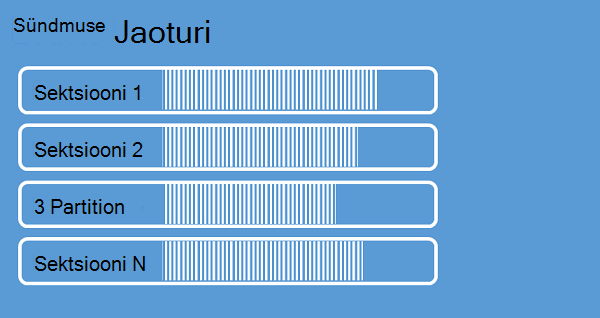

<properties 
    pageTitle="Ülevaade: Azure'i sündmuse jaoturi | Microsoft Azure'i"
    description="Sissejuhatus ja Azure sündmuse jaoturi ülevaade."
    services="event-hubs"
    documentationCenter="na"
    authors="sethmanheim"
    manager="timlt"
    editor="" />
<tags 
    ms.service="event-hubs"
    ms.devlang="na"
    ms.topic="get-started-article"
    ms.tgt_pltfrm="na"
    ms.workload="na"
    ms.date="08/16/2016"
    ms.author="sethm" />

# Azure'i sündmuse jaoturi ülevaade

Paljud tänapäevased lahendused kavatse kohandatava klientide kogemusi või parandada toodete pidev tagasiside ja automatiseeritud telemeetria kaudu. Selliste lahenduste puutuvad kuidas turvaliselt ja usaldusväärselt protsess väga suure hulga teabe palju samaaegseid tootjad ülesanne. Microsoft Azure'i sündmuse jaoturi on hallatavate platform teenus, mis annab aluse sisse stsenaariumid paljusid suuremahuliste andmete kohta. Näiteid sellised stsenaariumid käitumise jälgimine mobiilirakendused, liikluse teabe web parkides,-mängu sündmuse jäädvustada konsooli mängu, või telemeetria andmeid kogutud tööstusliku masinad või ühendatud sõidukite. Levinud roll, mida saab esitada sündmuse jaoturi lahenduse arhitektuur on see toimib "välisuks" jaoks soovitud sündmus müügivõimaluste sageli nimetatakse ka *sündmuse ingestor*. Kuvatakse sündmuse ingestor on osa või teenus, mis asub sündmuse tootjad ja sündmuse tarbijad lahutada arvelt nende sündmuste voogu sündmuse koostamine.

Azure'i sündmuse jaoturi on sündmuse töötlemiseks teenus, mis sisaldab sündmuse ja telemeetria sissepääsu suuri tasandil pilveteenusesse madal latentsus ja usaldusväärsus. See teenus, mida kasutatakse muude teenuste, on eriti kasulik rakendus instrumentation, kasutaja kogemus või töövoo töötlemise ja Internet, asjade stsenaariumid. Sündmuse jaoturi pakub töötlemise võimalus sõnumi voo ja kuigi mõni sündmus jaoturi on sarnane järjekorrad ja teemade üksus, see on omadused, mis on väga erinev traditsiooniline enterprise sõnumside. Enterprise sõnumside stsenaariumid nõuab keerukaid võimalusi järjestuse, dead-kiri, tehing tugi ja keeruka kohaletoimetamise kinnitused, nagu tavaliselt valitsev sündmuse tarbimine ei kõrge läbilaskevõime ja töötlemine paindlikkust sündmuse voogu. Seetõttu sündmuse jaoturi võimaluste erinevad teenuse siini teemad, et need on eelisseisundis kõrge läbilaskevõime ja sündmuse töötlemiseks stsenaariumid. Sellisel kujul sündmuse jaoturi rakendada mõned sõnumside teemade jaoks saadaolevad funktsioonid. Kui vajate neid võimalusi, teemade jäävad optimaalne valik.

Kuvatakse sündmuse jaoturi luuakse sündmuse jaoturi nimeruum tasemel, sarnaselt teenuse siini järjekorrad ja teemade. Sündmuse jaoturi kasutab AMQP ja HTTP oma peamine API liidesed. Järgmisel joonisel on esitatud sündmuse jaoturi ja teenuse siini seos.

## Kontseptuaalne ülevaade

Sündmuse jaoturi pakub voogesitamine sektsioonitud tarbija mustri sõnum. Järjekorrad ja teemade kasutada [Kiiruisutamises tarbija](https://msdn.microsoft.com/library/dn568101.aspx) mudeli iga tarbija proovib lugeda sama järjekorda või ressurss. See konkurentsiga ja ressursid valik tulemuseks keerukuse ja skaala limiidid voo töötlemise rakendusi. Sündmuse jaoturi kasutab sektsioonitud tarbija mustri, kus iga tarbija ainult loeb teatud Alamhulk või sektsiooni sõnumi voo. See võimaldab horisontaalne skaala sündmuse töötlemiseks ja muude voo värskendustest funktsioone, mis pole järjekorrad ja teemade.

### Sektsioonid

Sektsiooni on järjestatud sündmuste jada, mis toimub mõni sündmus keskuses. Uuem sündmuste saabumisel lisatakse lõppu järjestusel. Sektsiooni saab kirjeldada kui "Kinnita Logi."

Andmete säilitamise sektsioonid konfigureeritud säilituspoliitika korda, mis on määratud sündmuse jaoturi tasemel. See säte rakendub üle kõik partitsioonid korral jaoturi. Sündmuste aegumise kellaaja alusel; te ei saa konkreetselt kustutage need. Kuvatakse sündmuse jaoturi sisaldab mitu sektsiooni. Iga sektsiooni ei sõltu ja see sisaldab oma andmete jada. Selle tulemusena sektsioonid sageli kasvata erinevate määrade.

Sektsioonid arv on määratud sündmuse jaoturi loomise ajal ja peab olema 2 32 (vaikimisi on 4). Sektsioonid on andmete ettevõtte süsteem ja rohkem seotud nõutav tarbimine rakenduste kui sündmus jaoturi läbilaskevõime järgneval paralleelsus astet. See muudab valik number sektsioonide sündmuse keskuses, mis otseselt seotud samaaegseid lugejad ootate on arv. Pärast sündmuse keskuse loomine, partition arv ei ole muudetav. kaaluge selle arvu osas pikaajalise oodatud skaala. 32 partition limiit suurendamiseks saate teenuse siini meeskonna poole pöördumist.

Kuigi sektsioonid on tuvastatavad ja saadetaks otse, on parim vältida andmete saatmine teatud sektsioonid. Saate jaotiste [sündmuse publisher](#event-publisher) ja [Publisher poliitika](#capacity-and-security) kasutusele kõrgema taseme importida.

Sündmuse jaoturi kontekstis nimetatakse sõnumite *sündmuse*andmetena. Sündmuse andmed sisaldavad keha sündmus, kasutaja määratletud Atribuudikonteineri ja erinevate metaandmed, nt selle nihke sündmuse kohta sektsioon ja voo järjestuse number. Sektsioonid täidetakse sündmuse andmete jada.

## Sündmuse publisher

Üksus, mis saadab sündmusi või andmete sündmuse jaoturiga on mõni *sündmus publisher*. Sündmuse tootjad saavad avaldada HTTPS või AMQP 1.0 sündmused. Sündmuse tootjad märgiks ühiskasutusse Accessi allkirja (SAS) abil tuvastada end sündmuse jaoturiga, ja saate on kordumatu identiteet või kasutada levinud SAS luba, sõltuvalt nõuetele seda stsenaariumi.

SAS töötamise kohta leiate lisateavet teemast [Ühiskasutuses Accessi allkirja autentimine teenuse siini](../service-bus-messaging/service-bus-shared-access-signature-authentication.md).

### Publisheri põhitoimingud

Selles jaotises kirjeldatakse sündmuse tootjad tavalised toimingud.

#### SAS luba hankimine

Ühiskasutusega juurdepääsu allkirja (SAS) on soovitud autentimise sündmuse jaoturi. Teenuse siini pakub SAS poliitikate nimeruum ja sündmuse jaoturi tasandil. SAS luba luuakse SAS klahvi ja on mõni SHA räsi URL-i, kodeeritud kindlas vormingus. Võti (poliitika) ja luba nime abil saate teenuse siini taastada räsi ja seega autentida saatja. Tavaliselt SAS märgid ürituse tootjad jaoks on loodud ainult **saada** õigused teatud sündmuste jaoturi. See SAS Turbeloa URL-i süsteem on aluseks Publisheri poliitika kasutusele Publisheri tuvastamiseks. SAS töötamise kohta leiate lisateavet teemast [Ühiskasutuses Accessi allkirja autentimine teenuse siini](../service-bus-messaging/service-bus-shared-access-signature-authentication.md).

#### Sündmuse avaldamine

Sündmuse AMQP 1.0 või HTTPS-i kaudu saate avaldada. Teenuse siini pakub hõlmav tund [EventHubClient](https://msdn.microsoft.com/library/microsoft.servicebus.messaging.eventhubclient.aspx) avaldamise sündmuste sündmuse jaoturiga .net-i kliendi kaudu. Muude runtimes ja platvormide jaoks loodud, saate kasutada mis tahes AMQP 1.0 kliendi, nt [Apache Qpid](http://qpid.apache.org/). Saate avaldada sündmuste ükshaaval või batched. Ühe publikatsiooni (sündmuse andmete eksemplari) on 256KB, olenemata sellest, kas see on ühe sündmuse või partii piiri. Avaldamise sündmused, mis on suurem kui tulemuseks viga. See on hea tava tootjad olema teadlik sektsioonid sees oleva sündmuse keskuse ning määrata ainult mõne *partition, võti* (järgmises jaotises toodud) või tema identiteedi kaudu nende SAS luba.

Kasutada AMQP või HTTPS valik on teatud kasutus stsenaariumi. AMQP tarvis on püsivate kahesuunaline turvasoklite Lisaks taseme Turve (TLS) või SSL/TLS. See võib olla kulukas toiming võrguliiklust osas, kuid ainult juhtub ka AMQP seansi alguses. HTTPS on on väiksem algse pea kohal, kuid nõuab SSL-i täiendavad kohal iga taotlus. Tootjad, kes sageli avaldada sündmusi, pakub AMQP olulise jõudluse, latentsus ja läbilaskevõime kokkuhoiu.

### Sektsiooni võti

Sektsiooni võti on väärtus, mille saab vastendada sissetuleva sündmuse andmete kindla sektsioonid andmete ettevõtte eesmärgil. Sektsiooni oluline on möödas mõni sündmus jaoturiga saatja esitatud väärtuse. See on töödeldud staatilise loob rakendus funktsiooni, mille tulemusena loob sektsiooni ülesande kaudu. Kui te ei määra sektsiooni võtme sündmuse avaldamisel, kasutatakse round jaan ülesanne. Kui partition klahvide abil sündmuse publisher on ainult teadlik selle sektsiooni võti pole sektsiooni, millele on avaldatud sündmused. See võti ja partition lahutamine isoleerib saatja vajavad liiga palju järgneval andmetöötlus ja sündmuste kohta teadma. Sektsiooni klahvid oluliste andmete töötlemiseks järgmise etapi korraldamiseks, kuid ei nõua põhjalikult sektsioonid ise. Kasutaja identiteedi teeb hea partition võti, kuid saate ka muid atribuute, nagu geograafia kordumatu või seadme kohta kasutada ühe sektsiooni seotud sündmused rühmitada. Järgmisel pildil on kujutatud sündmuse saatjate Kinnita sektsioonid partition klahvide abil.

Sündmuse jaoturi tagab, et ühiskasutuse sektsiooni võtme väärtus kõik sündmused toimetatakse järjestuses ja sama sektsiooni. Oluline on, kui partition klahve kasutatakse järgmises jaotises kirjeldatud Publisheri põhimõtted siis avaldaja identiteedi ja sektsiooni võtme väärtus peab vastama. Muul juhul ilmneb tõrge.

### Sündmuse tarbija

Üksus, mis loeb sündmuse andmed on sündmuse keskuse kaudu on mõni sündmus tarbija. Kõigi sündmuste tarbijate lugeda sündmuse voo sektsioonid tarbija rühma kaudu. Iga sektsiooni peaks olema ainult üks aktiivne lugeja korraga. Kõigi sündmuste jaoturi tarbijate sündmuste edastatakse kui need muutuvad kättesaadavaks AMQP 1.0 seansiga ühendust luua. Klient ei pea andmete saadavus küsitlus.

#### Rühmi

Rühmi kaudu on lubatud, sündmuse jaoturi avalda/tellimise süsteem. Tarbija rühm on vaade on kogu sündmuse jaoturi (osariik, asukoha või offset). Tarbija rühmade luba mitu nõudvate rakenduste iga on eraldi vaade sündmuse voo ja voo sõltumatult oma tempos ja oma korvamismeetmeid lugeda. Jooksvas töötlemine arhitektuur, võrdub iga järgmise etapi rakenduse tarbija rühma. Kui soovite sündmuse andmeid pikemaks kirjutada, on selle salvestusruumi kirjutaja rakenduse tarbija rühm. Keerukate sündmuse töötlemine on läbi teise, omaette tarbija rühma. Sektsioonid pääseb juurde ainult tarbija rühma kaudu. Mõni sündmus keskuses on alati tarbija vaikejaotise ja saate luua kuni 20 Standard kiht sündmuse jaoturi rühmi.

Järgnevalt on toodud näited tarbija rühma URI mess.

    //<my namespace>.servicebus.windows.net/<event hub name>/<Consumer Group #1>
    //<my namespace>.servicebus.windows.net/<event hub name>/<Consumer Group #2>

Järgmisel pildil on kujutatud sündmuse tarbijad tarbija rühmades.

#### Voo Advance

Erinevust on sündmuse lisamine sektsioonis paigutust. Mõelge erinevust kliendipoolne kursor nimega. Funktsiooni offset on bait sündmuse Nummerdus. See lubab ka sündmuse tarbija (lugeja) määratud punkti korral voona, kust soovite need alustada lugemist sündmused. Saate määrata funktsiooni offset ajatempel või offset väärtusena. Tarbijad vastutate talletamine väljaspool sündmuse jaoturi teenuse oma offset väärtusi.

Sektsioonis, sisaldab iga sündmuse erinevust. Selle nihke kasutavad tarbijad kuvamiseks sündmuste jada antud sektsiooni jaoks asukoht. Korvamismeetmeid saab edasi sündmuse jaoturi kas arvuna või ajatempli väärtusena kui lugeja loob.

#### Checkpointing

*Checkpointing* on toiming, mille lugejad märkimine või Kinnita nende kohast partition sündmuste jada. Checkpointing tarbija ülesanne ja tekib kohta partition alus tarbija rühmas. See tähendab, et iga tarbija rühma, iga sektsiooni lugeja peab silma peal hoida oma praegust paigutust juhul taustal alla laadida ja teenuse saate teavitada, kui see leiab andmevoos lõpule viidud. Kui lugeja katkestatakse sektsiooni, kui see taastab ühenduse see algab kontrollpunkt, mis on varem esitatud sektsiooni viimase lugeja rühmas tarbija lugemisel. Kui lugeja loob, edastab selle nihke sündmuse jaoturi, millest alustada lugemispaani asukoha määramiseks. Sel viisil, saate kasutada checkpointing nii märgi sündmuste "lõpetatuks" järgmise etapi rakendused ja esitada paindlikkust vahel lugejad erinevates arvutites töötavate Tõrkesiirde korral. Kuna sündmuse andmed säilivad säilituspoliitika intervalli määratud sündmuse jaoturi on loodud, on võimalik naasmiseks vanemate andmeid, määrates alumise offset checkpointing selle protsessi. Selle kaudu võimaldab checkpointing Tõrkesiirde paindlikkust nii kontrollitud sündmuse voo kordus.

#### Põhitoimingud tarbija

Selles jaotises kirjeldatakse sündmuse jaoturi sündmus või lugejatele mõeldud tavalised toimingud. Kõigi sündmuste jaoturi tarbijate AMQP 1.0 ühendust luua. AMQP 1.0 on seanss ja state arvestada kahesuunaline side kanali. Iga sektsiooni on AMQP 1.0 link seansi, mis hõlbustab transport sündmuste eraldatud sektsioonis.

##### Sektsiooni ühendamine

Tarbimine sündmused on sündmuse keskuse kaudu, et tarbija tuleb ühendada sektsiooni. Nagu eelnevalt mainitud, pääsete alati sektsioonid tarbija rühma kaudu. Osana sektsioonitud tarbija mudeli ainult üks lugejale peaks olema aktiivne sektsiooni tarbija rühmas korraga. See on tavaks sektsioonid kasutada liisimine lugeja ühenduste teatud sektsioonid koordineerimiseks ühendamiseks. Sellisel viisil, on võimalik iga sektsiooni olema ainult üks aktiivne lugeja tarbija rühma jaoks. Lugeja asukoha järjestuse haldamine on oluline ülesanne, mille kaudu checkpointing. See funktsioon on lihtsustatud .NET klientidele [EventProcessorHost](https://msdn.microsoft.com/library/microsoft.servicebus.messaging.eventprocessorhost.aspx) klassi abil. [EventProcessorHost](https://msdn.microsoft.com/library/microsoft.servicebus.messaging.eventprocessorhost.aspx) on nutikas tarbija agent ja järgmises jaotises kirjeldatakse.

##### Lugege sündmused

Pärast teatud sektsiooni avatakse AMQP 1.0 seansi- ja linkimissuvand, edastatakse sündmused AMQP 1.0 kliendi sündmuse jaoturi teenus. See kohaletoimetamise süsteem võimaldab suurema läbilaskevõimega ja alumise latentsus kui pull vastavalt menetlustele, nt HTTP GET. Kui sündmuste saadetakse kliendi, sisaldab iga sündmuse andmete eksemplari olulised metaandmeid, nt offset ja jada checkpointing sündmuse järjestuse hõlbustamiseks kasutatud.

Teie vastutab selle nihke nii, et kõige paremini võimaldab haldamise edu töötlemine voo haldamiseks.

## Ametinimetus ja turve

Sündmuse jaoturi on väga paindlik paralleelselt arhitektuur voo sissepääsu jaoks. Sellisel kujul on mitmeid olulisi aspekte arvesse võtta, kui suurus ja mastaapimist lahenduse põhjal sündmuse jaoturi. Neid juhtelemente võimsus esimene nimetatakse *läbilaskevõime üksused*, järgmises jaotises kirjeldatud.

### Läbilaskevõime ühikud

Sündmuse jaoturi läbilaskevõime kontrollib läbilaskevõime üksused. Läbilaskevõime üksused on eelnevalt ostetud ühikute läbilaskevõime. Ühe läbilaskevõime ühiku sisaldab järgmist:

- Sissepääsu: Kuni 1 MB sekundis teise või 1000 sündmuste kohta.

- Sealt: Kuni 2 MB sekundis.

Sissepääsu on rakendus kontaktisikute läbilaskevõime ostetud ühikute summasid arvu summa. Andmete kohal selle tulemite summa "ületatud" erand. See on kas 1 MB sekundis teise või 1000 sündmuste kohta, kumb on esimene. Sealt ei tooda ahendamise erandid, kuid on piiratud andmete edastamiseks ette nähtud läbilaskevõime ostetud ühikute suurus: 2 MB sekundis läbilaskevõime ühiku kohta. Kui teile saadetakse avaldamise määr erandid või vaatamiseks kontrollige mitu läbilaskevõime üksuste jaoks, kus on loodud sündmuse jaoturi nimeruumi ostetud kõrgema sealt ootate. Saada rohkem läbilaskevõime ühikut, saate reguleerida [Azure klassikaline portaali][]vahekaardil **mastaap** lehel **nimeruumid** säte. Samuti saate muuta selle sätte abil Azure'i API-d.

Sektsioonid aga andmed ettevõtte mõistet, läbilaskevõime üksused on üksnes võimsus mõistet. Läbilaskevõime üksused on arve tunnis ja on eelnevalt ostetud. Kui ostetud, läbilaskevõime üksused on arve vähemalt üks tund. Mõni sündmus jaoturi nimeruum üksused saab osta kuni 20 läbilaskevõime ja on 20 läbilaskevõime üksuste piirarvu Azure'i konto. Need läbilaskevõime üksused on üle kõik sündmuse jaoturi ühiskasutusse antud nimeruumi.

Läbilaskevõime üksused on parim peegeldav eraldi ette valmistatud ja ei pruugi alati olla saadaval kohe osta. Kui vajate teatud maht, on soovitatav osta nende läbilaskevõime üksuste ette valmistada. Kui vajate rohkem kui 20 läbilaskevõime üksused, võite võtta ühendust Azure ostmiseks rohkem läbilaskevõime ühikut plokkidena 20, kuni esimese 100 läbilaskevõime ühikute kohustuse alusel. Pärast seda, saate osta ka plokid 100 läbilaskevõime ühikut.

Soovitatav on, et te hoolikalt saldo läbilaskevõime üksused ja sektsioonid optimaalse skaala sündmuse jaoturi saavutamiseks. Ühe sektsiooni on maksimaalne skaala läbilaskevõime ühe üksuse. Läbilaskevõime ühikute peaks olema väiksem või võrdne arv sektsioonid mõne sündmuse keskuses.

Üksikasjalik teave hinnad, leiate teemast [Sündmuse jaoturi hinnad](https://azure.microsoft.com/pricing/details/event-hubs/).

### Publisheri poliitika

Sündmuse jaoturi võimaldab Varundustöö juhtida sündmuse avaldajad *avaldaja poliitika*kaudu. Publisher on käitusaja funktsioone, mis hõlbustavad suure hulga sõltumatu sündmuse tootjad kogum. Publisheri poliitikad, kasutab iga Publisheri omaette kordumatut tunnust, kui sündmus keskuses kasutamist järgmised sündmused avaldamine:

    //<my namespace>.servicebus.windows.net/<event hub name>/publishers/<my publisher name>

Teil pole vaja luua Publisheri nimesid ette valmistada, kuid need peab vastama SAS luba kasutada, kui avaldamise sündmust, sõltumatu Publisheri identiteedid tagamiseks. SAS kohta leiate lisateavet teemast [Ühiskasutuses Accessi allkirja autentimine teenuse siini](../service-bus-messaging/service-bus-shared-access-signature-authentication.md). Publisheri poliitikate kasutamisel **PartitionKey** väärtuseks on seatud väljaandja nimi. Töötaks õigesti, peab vastama need väärtused.

## Kokkuvõte

Azure'i sündmuse jaoturi pakub hyper skaala sündmus ja telemeetria töötlemine teenus, mida saate kasutada levinud rakendus ja kasutajale töövoo igal alal jälgimine. Võimalus anda avaldada-Telli võimalusi koos madal latentsus ja suuri tasandil sündmuse jaoturi olla "sees suunas" Big Data. Publisheri-põhiste identiteedi ja tühistusloendid, on neid võimalusi laiendada tavastsenaariumid asjade Internet. Sündmuse jaoturi rakenduste arendamise kohta leiate lisateavet teemast [sündmuse jaoturi programmeerimise juhend](event-hubs-programming-guide.md).

## Järgmised sammud

Nüüd, kui olete õppinud sündmuse jaoturi põhimõtet, saate teisaldada järgmistel juhtudel:

- Kuvatakse [sündmuse jaoturi õpetuse]alustamine.
- Täieliku [valimi rakendus, mis kasutab sündmuse jaoturi].

[Azure'i klassikaline portaal]: http://manage.windowsazure.com
[Sündmuse jaoturi õpetus]: event-hubs-csharp-ephcs-getstarted.md
[valimi rakendus, mis kasutab sündmuse jaoturi]: https://code.msdn.microsoft.com/windowsazure/Service-Bus-Event-Hub-286fd097
