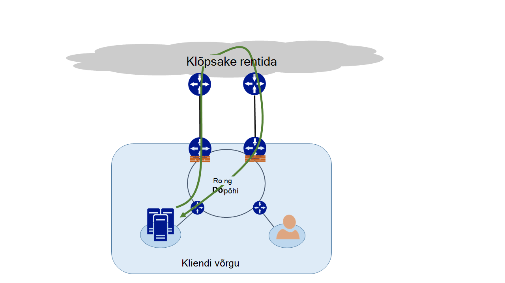
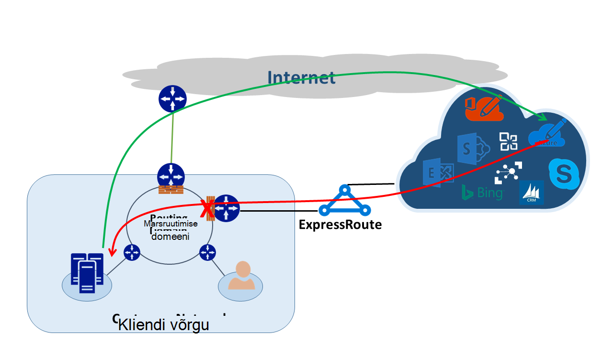
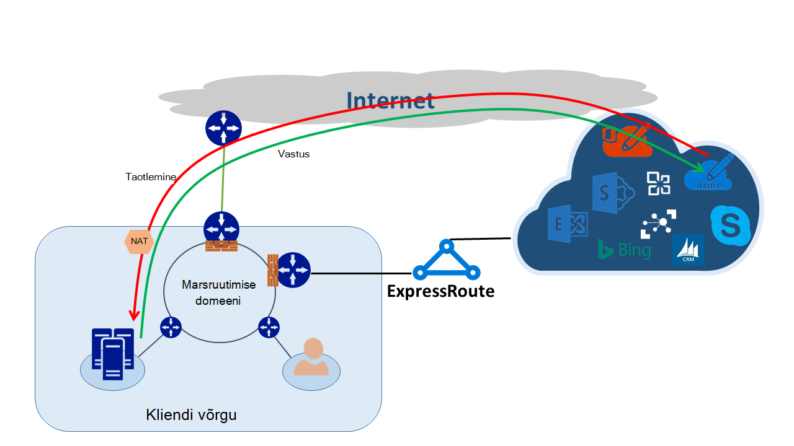

<properties
   pageTitle="Asümmeetriline marsruutimine | Microsoft Azure'i"
   description="Selles artiklis tutvustatakse probleemid, mis klient võib näo asümmeetriline marsruutimine võrk, mis on mitme lingi sihtkohta."
   documentationCenter="na"
   services="expressroute"
   authors="osamazia"
   manager="carmonm"
   editor=""/>
<tags
   ms.service="expressroute"
   ms.devlang="na"
   ms.topic="get-started-article"
   ms.tgt_pltfrm="na"
   ms.workload="infrastructure-services"
   ms.date="10/10/2016"
   ms.author="osamazia"/>

# Mitme võrgu tee asümmeetriline marsruutimine

Selles artiklis selgitatakse, kuidas edasi ja tagasi võrguliiklust võib võtta teistmoodi, kui mitu teed on saadaval võrgu lähte-kui ka vahel.

See on oluline mõista mõistetest mõista asümmeetriline marsruutimist. Üks on mitme võrgu tee mõju. Teine on, kuidas säilitada seadmetest tulemüüri, state. Järgmist tüüpi seadmed nimetatakse stateful seadmed. Nende kahe tegurid loob stsenaariumid, mis võrku liiklus katkeb stateful seade, kuna stateful seade ei tuvasta, et liikluse pärineb seadmes endas.

## Mitme võrgu tee

Kui ettevõtte võrgus on ainult üks link Interneti kaudu oma Interneti-teenuse pakkuja, kogu ja sealt Interneti-liikluse läbib sama tee. Sageli ettevõtted ostavad mitme elektriskeemide, liigsed teed parandada võrgu sees. Kui see juhtub, on võimalik liikluse, mis läheb väljaspool võrgu, Interneti-ühendus, läheb läbi ühe lingi ja saatja liikluse läbib eri link. See tuntakse asümmeetriline marsruutimist. Asümmeetriline marsruutimine tagant võrguliiklust võtab muu tee algse voo kaudu.

Kuigi see esineb peamiselt Interneti-ühendusega arvutid, asümmeetriline marsruutimine ka kehtib muude kombinatsioonid mitme tee. See kehtib näiteks nii Interneti-tee ja minge sihtkohaga ja mitme privaatne tee, et minna sama sihtkohaga privaatne failitee.

Iga ruuteri teel olles allikast sihtkohta, arvutab parim tee sihtkohta jõudmiseks. Parima võimaliku tee ruuteri määramine põhineb kaks peamist tegurit:

-   Väliseid võrgustikke vahel marsruutimine põhineb marsruutimise protokoll, äärise lüüsi protokolli (BGP). BGP võtab reklaamide naabrite ja käivitab neid juhiseid määrata soovitud sihtkohta parim tee kaudu. See talletab parim tee oma marsruutimise tabelis.
-   Protsessiga seotud alamvõrgu mask pikkus mõjutab marsruutimise teed. Kui marsruuteri saab mitme reklaamide sama IP-aadressi, kuid erinevad alamvõrgu maskid, eelistab marsruuteri reklaami enam alamvõrgu maski, sest see peetakse täpsemale marsruutimiseks.

## Stateful seadmed

Ruuterid pilk marsruutimise eesmärgil pakett IP päis. Mõne seadme vaadata isegi põhjalikult paketi sees. Tavaliselt järgmistesse seadmetesse pilk Layer4 (Transmission Control Protocol, või TCP; või transpordimehhanism või UDP), või isegi Layer7 (kihid) päised. Seda tüüpi seadmed on seadmeid või ribalaiuse optimeerimine seadmed. 

Tulemüür on näide stateful seade. Tulemüüri võimaldab või keelab pakett läbida selle liideste põhjal näiteks protokolli, TCP/UDP portide ja URL-i päised. Selle paketi kontrollimise tase paneb raske töötlemine laadi seadmes. Jõudluse parandamiseks tulemüüri uurib esimese paketi lisamine kulgemist. Kui see lubab paketi jätkata, hoiab meilivoo teavet oma riik tabelis. See vool seotud kõik edaspidised paketid on lubatud, põhineb algsel määramine. Paketi, mis on osa mõne olemasoleva kulgemist võib saabuma tulemüüri. Kui tulemüüri on eelneva oleku teavet selle kohta, tulemüüri langeb paketi.

## Asümmeetriline ExpressRoute marsruutimine

Kui loote ühenduse Microsoft Azure'i ExpressRoute kaudu, võrgu muudatuste järgmiselt:

-   Teil on mitu lingid Microsoft. Ühe link on teie Interneti-ühendus, ja teine on ExpressRoute kaudu. Mõned liikluse Microsoft võib minna Interneti kaudu, kuid naaske ExpressRoute kaudu või vastupidi.
-   Saate täpsemale IP-aadressi ExpressRoute kaudu. Nii, et liiklust võrgu kaudu Microsofti kaudu ExpressRoute pakutavaid teenuseid, ruuterid alati eelistan ExpressRoute.

Mõista selle need kaks muudatused on võrgus, vaatame mõne stsenaariumi. Näiteks teil on ainult üks ringi Interneti-ühendus ja saate kasutada kõigi Microsofti teenuste Interneti kaudu. Microsoft ja tagasi võrgu kaudu liikluse läbib sama Internet link ja läbi tulemüüri. Tulemüüri kirjete voogu, kui ta näeb esimese paketi ja saatja paketid on lubatud, kuna voogu riik tabelis on olemas.

Seejärel lülitage sisse ExpressRoute ja üle ExpressRoute Microsoft pakutavaid teenuseid kasutada. Muude Microsofti teenuste tarbib Interneti kaudu. Juurutate oma serva, mis on ühendatud ExpressRoute eraldi tulemüüri. Microsoft reklaamib täpsemale eesliidete võrgu üle ExpressRoute teatud teenuste jaoks. Teie marsruutimise infrastruktuur valib eelistatud tee nende eesliiteid ExpressRoute. Kui olete oma avaliku IP-aadressid Microsoft reklaami pole üle ExpressRoute, Microsoft suhtleb oma avaliku IP-aadressid Interneti kaudu. Edasi võrgu Microsoft liikluse kasutab ExpressRoute ja vastupidise liikluse Microsoft kasutab Interneti-ühendus. Kui tulemüüri serva näeb vastuse paketi jaoks kulgemist, mis ei leia tabelis riik, langeb saatja liikluse.

Kui otsustate kasutada sama võrgu aadressi tõlge (NAT) pool ExpressRoute ja Interneti-ühendus, kuvatakse teile sarnaseid probleeme klientidega võrgus privaatne IP-aadressid. Taotlusi teenuste nagu Windows Update avage Interneti kaudu, kuna IP-aadresside need teenused on pole avaldatud ExpressRoute kaudu. Siiski saatja liikluse tuleb tagasi ExpressRoute kaudu. Kui Microsoft saab Interneti- ja ExpressRoute sama alamvõrgu maski IP-aadress, eelistab ExpressRoute Interneti kaudu. Kui tulemüüri või stateful mõnda muud seadet, mis on teie võrgu serva ja vastastikuste ExpressRoute on eelneva teave voogu, langeb pakette, mis kuuluvad selle kulgemist.

## Asümmeetriline marsruutimise lahendused

Teil on kaks peamist võimalust asümmeetriline marsruudi probleemi lahendada. Üks on läbi marsruutimine ja teine on andmeallika põhjal NAT (SNAT) abil.

### Marsruutimine

Veenduge, et avaliku IP-aadressid on reklaamida vastav lai ala võrgu (WAN) linke. Näiteks, kui soovite kasutada Internetti autentimise liikluse ja ExpressRoute oma e-posti liikluse, saate peaks reklaamida oma Active Directory Federation Services (AD FS) avaliku IP-aadressid ExpressRoute üle. Samuti kindlasti mitte nähtavaks tegemine asutusesisese AD FS server ruuteri saab üle ExpressRoute IP-aadressid. Marsruudib saadud ExpressRoute on täpsemale nii, et nad teevad ExpressRoute eelistatud tee autentimise liikluse Microsoft. See põhjustab asümmeetriline marsruutimist.

Kui soovite kasutada ExpressRoute autentimine, veenduge, et teil on reklaami üle ExpressRoute ilma NAT. AD FS-i avaliku IP-aadressid Sellisel viisil liikluse, mis pärineb Microsofti ja läheb asutusesisese AD FS server läheb üle ExpressRoute. Saatja kliendi Microsoft liikluse kasutab ExpressRoute, kuna see on Interneti kaudu.

### Andmeallika põhjal NAT

Teine võimalus asümmeetriline marsruutimise probleeme lahendada on SNAT abil. Näiteks saate on pole avaldatud avaliku IP-aadress kohapealse lihtne meiliedastusprotokoll (SMTP) serveri üle ExpressRoute Kuna kavatsete kasutada seda tüüpi side Interneti-ühendus. Koosolekukutse, mis pärineb Microsofti ja seejärel läheb kohapealse SMTP-serveri läbib Interneti-ühendus. Saate SNAT sissetuleva taotluse sisemise IP-aadressi. Pööratud liikluse SMTP-server läheb serva tulemüüri (mille abil saate NAT) asemel ExpressRoute kaudu. Saatja liikluse ulatub Interneti kaudu.

## Asümmeetriline marsruutimise automaattuvastus

Jälgimine on parim viis veenduge, et teie võrguliiklust on liiklevad oodatud tee. Kui kavatsete liikluse oma kohapealse SMTP-serveri Microsoft Internet teed, oodatud jälgimine on SMTP-server teenusekomplekti Office 365. Tulem kinnitatakse liikluse tõepoolest lahkub võrgu suunas Interneti ja ei ExpressRoute suunas.
