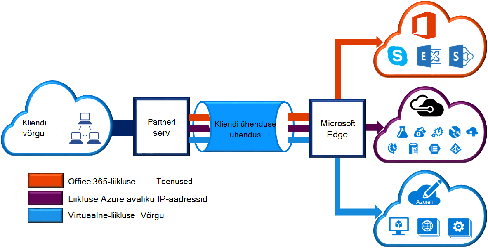
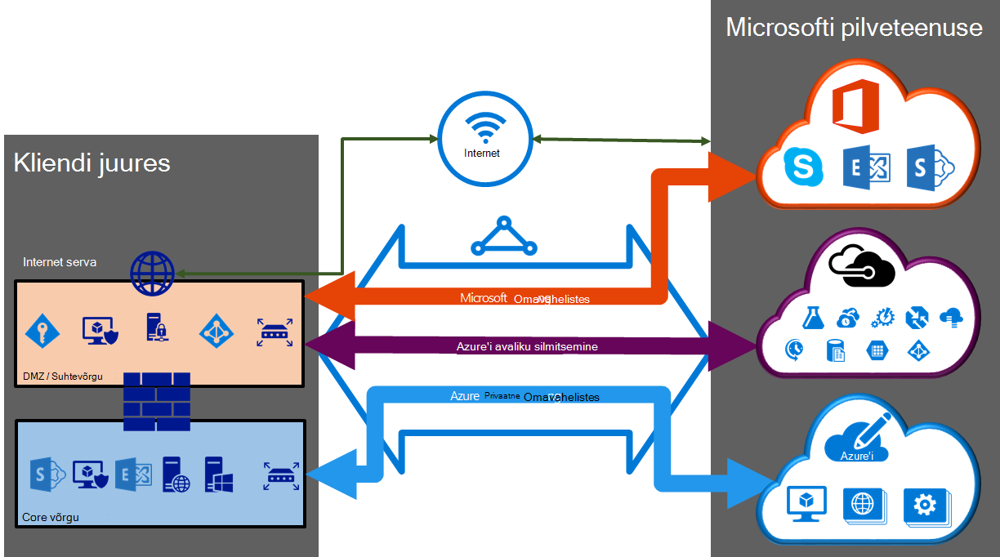

<properties 
   pageTitle="ExpressRoute elektriskeemide ja marsruutimise domeenid | Microsoft Azure'i"
   description="Sellel lehel antakse ülevaade ExpressRoute ahelatega ja marsruutimise domeenid."
   documentationCenter="na"
   services="expressroute"
   authors="cherylmc"
   manager="carmonm"
   editor=""/>
<tags 
   ms.service="expressroute"
   ms.devlang="na"
   ms.topic="article" 
   ms.tgt_pltfrm="na"
   ms.workload="infrastructure-services" 
   ms.date="10/10/2016"
   ms.author="cherylmc"/>

# ExpressRoute elektriskeemide ja marsruutimise domeenid

 Peate tellima *ExpressRoute ringi* oma kohapealse taristu ühenduse Microsoft ühenduvuse pakkuja kaudu. Joonis annab loogilise kujutis Ühenduvus WAN- ja Microsoft.

## ExpressRoute topoloogia

Mõne *ExpressRoute ringi* tähistab loogilise seost kohapealse taristu ja Microsofti pilveteenustega Ühenduvus pakkuja kaudu. Saate tellida mitme ExpressRoute topoloogia. Iga võib olla samas või mõnes muus piirkondades, ja nende ettevõttesse eri ühenduvuse pakkujate kaudu saab ühendada. 

ExpressRoute elektriskeemide kaarti mis tahes füüsilise üksused. Soovitud ringi identifitseerib kordumatult standard GUID kutsutud teenus klahvi (s-klahv). Teenus on Microsofti, ühenduvuse pakkuja ja vahetada ainult infokillu. Võti-s pole salajase turvalisuse tagamiseks. On 1:1 vastendamine ExpressRoute soovitud ringi ja klahvi s vahel.

Mõne ExpressRoute ringi võib olla kuni kolm sõltumatu peerings: Azure'i avalik, Azure privaatne ja Microsoft. Iga silmitsemine on sõltumatu BGP paari seansid neid konfigureeritud redundantly kõrge-saadavus. On 1: n (1 < = N < = 3) vahel on ExpressRoute ringi kaardistamine ja marsruutimine domeenid. Mõne ExpressRoute ringi võib olla mõni, kahest või kõigi kolme peerings lubatud ühe ExpressRoute ringi.
 
Iga on fikseeritud ribalaius (50 Mbps, 100 Mbps, 200 Mbps, 500 Mbps, 1 Gbit, 10 Gbit) ja vastendatakse ühenduvuse pakkuja ja silmitsemine asukoht. Probleeme põhjustab läbilaskevõime, valite üle kõik peerings, ringi jaoks ühiskasutusse anda. 

### Piirmäära, piirangud ja kitsendused

Vaikimisi kvootide ja limiidid taotleda iga ExpressRoute ringi. Vaadake [Azure'i tellimus ja teenuste piirangud, kvootide ja piiranguid](../azure-subscription-service-limits.md) leht ajakohast teavet kvootide kohta.

## ExpressRoute marsruutimise domeenid

Mõne ExpressRoute ringi on seotud mitu marsruutimise domeeni: Azure'i avalik, Azure privaatne ja Microsoft. Iga marsruutimise domeeni, mis on konfigureeritud ühtemoodi ruuterid paari (aktiivne aktiivne või laadi ühiskasutuse konfigureerimine) jaoks kõrge kättesaadavus. Azure'i teenused on liigitatud *Azure'i avaliku* ja *Azure privaatne* tähistada on IP-aadresside skeemid.

### Privaatne silmitsemine

Azure'i arvutada teenuseid, milleks virtuaalmasinates (IaaS) ja privaatne silmitsemine domeeni kaudu saab ühendada pilveteenustega (PaaS), virtuaalse võrgustikus juurutatud. Privaatne silmitsemine domeeni loetakse usaldusväärsete pikendamine core võrgu Microsoft Azure'i sisse. Saate häälestada kahesuunalise ühenduvuse core võrgu ja Azure virtuaalse võrkude (VNets) vahel. See silmitsemine abil saate ühenduse virtuaalmasinates ja cloud services otse oma isiklike IP-aadressid.  

Saate luua ühenduse virtuaalse rohkem kui üks võrk privaatne silmitsemine domeeni. Vaadake lisateavet piirangute ja kitsenduste [KKK lehele](expressroute-faqs.md) . Leiate [Azure'i tellimus ja teenuste piirangud, kvootide ja piiranguid](../azure-subscription-service-limits.md) lehe ajakohast teavet piirangud.  [Marsruutimine](expressroute-routing.md) lehe marsruutimise konfigureerimise kohta lisateabe saamiseks vaadake.

### Avaliku silmitsemine

Nt Azure Storage, SQL-i andmebaasid ja veebisaidid pakutakse avaliku IP-aadressid. Privaatselt saate luua ühenduse avaliku IP-aadressid, sh oma pilveteenuste avaliku silmitsemine marsruutimise domeeni kaudu VIP teenuseid. Saate oma DMZ avaliku silmitsemine domeeni ühenduse ja ühenduse oma avaliku IP-aadressid kõik Azure teenused teie WAN ilma Interneti kaudu ühenduse. 

Microsoft Azure'i teenustele ühenduvuse kaudu oma WAN alati algatatud. Microsoft Azure'i teenuste ei saa algatada ühendused oma võrku selle marsruutimise domeeni kaudu. Kui avaliku silmitsemine on lubatud, saab ühenduse kõik Azure teenused. Me ei luba teil valida valikuliselt teenuste jaoks, mida me reklaamida marsruudib abil. Saate vaadata loendit eesliiteid me reklaamida silmitsemine [Microsoft Azure'i andmekeskuse IP-vahemikke](http://www.microsoft.com/download/details.aspx?id=41653) lehe kaudu. Lehe värskendatakse iga nädal.

Saate määratleda kohandatud marsruutimiseks filtrite kasutamine ainult marsruudib, peate oma võrgustikus. [Marsruutimine](expressroute-routing.md) lehe marsruutimise konfigureerimise kohta lisateabe saamiseks vaadake. Saate määratleda kohandatud marsruutimiseks filtrite kasutamine ainult marsruudib, peate oma võrgustikus. 

Vaadake lisateavet [KKK lehele](expressroute-faqs.md) Services toetatud avaliku silmitsemine marsruutimise domeeni kaudu. 
 
### Microsoft silmitsemine

[AZURE.INCLUDE [expressroute-office365-include](../../includes/expressroute-office365-include.md)]

Ühenduvus muude Microsoft Online'i teenused (nt Office 365 teenused) saab Microsoft silmitsemine kaudu. Me lubada kahesuunalise Ühenduvus WAN- ja Microsofti pilveteenustega Microsoft silmitsemine marsruutimise domeeni kaudu. Tuleb ühendada Microsofti pilveteenustega ainult üle avaliku IP-aadressid, mis kuuluvad teie või teie ühendus pakkuja ja, peate järgima määratletud reegleid. Lisateabe saamiseks vt [ExpressRoute eeltingimused](expressroute-prerequisites.md) .

Vaadake lisateavet Services toetatud, kulud, ja konfiguratsiooni üksikasjad [KKK lehele](expressroute-faqs.md) . Vt lisateavet lehel [ExpressRoute asukohad](expressroute-locations.md) loendist ühenduvuse pakkujad silmitsemine Microsofti toe pakkumine.

## Marsruutimise domeeni võrdlus

Järgmises tabelis võrdleb kolme marsruutimise domeenid.

||**Privaatne silmitsemine**|**Avaliku silmitsemine**|**Microsoft silmitsemine**|
|---|---|---|---|
|**Max. # eesliiteid toetatud silmitsemine kohta.**|vaikimisi 10 000 ExpressRoute Premium 4000|200|200|
|**Toetatud IP-aadresside vahemikud**|Mis tahes sobiv IPv4 aadress oma WAN sees.|Avaliku IPv4 aadressid kuuluvad teie või teie ühendus pakkuja.|Avaliku IPv4 aadressid kuuluvad teie või teie ühendus pakkuja.|
|**NIMEGA arv nõuded**|Era- ja NUMBRITEGA. Peate oma avaliku arvuna, kui kasutate ühte. | Era- ja NUMBRITEGA. Siiski peab osutuda sätestatud avaliku IP-aadressid.| Era- ja NUMBRITEGA. Siiski peab osutuda sätestatud avaliku IP-aadressid.|
|**Marsruutimise kasutajaliidese IP-aadressid**|RFC1918 ja avaliku IP-aadressid|Avaliku IP-aadresside registreeritud teile marsruutimise registrid.| Avaliku IP-aadresside registreeritud teile marsruutimise registrid.|
|**MD5 räsi tugi**| Jah|Jah|Jah|

Saate valida üks või mitu marsruutimise domeenide lubamiseks osana nende ExpressRoute topoloogia. Kui soovite, et on kõik marsruutimise domeeni sellele sama VPN, kui soovite ühendamine ühe marsruutimise domeeni. Võite ka panna need eri marsruutimise domeenis, mis on sarnane skeem. Soovitatav konfiguratsioon on, et privaatne silmitsemine on ühendatud otse core võrgu ja avalik ja Microsoft silmitsemine lingid on ühendatud teie DMZ.
 
Kui valite on kolm silmitsemine seansside, peab teil olema kolm paari BGP seansid (üks paar iga silmitsemine jaoks). BGP seansi paari pakuvad väga kättesaadav linki. Kui loote layer 2 Ühenduvus pakkujate kaudu, saate vastutab, konfigureerimise ja haldamise marsruutimist. Saate lisateavet [töövoogude](expressroute-workflows.md) häälestamise ExpressRoute vaadates.

## Järgmised sammud

- Leidke teenusepakkuja. Vt [ExpressRoute teenusepakkujatele ja asukohad](expressroute-locations.md).
- Veenduge, et kõik eeltingimused on täidetud. Vt [ExpressRoute eeltingimused](expressroute-prerequisites.md).
- Konfigureerige ExpressRoute ühendust.
    - [Mõne ExpressRoute ringi loomine](expressroute-howto-circuit-classic.md)
    - [Marsruutimise (ringi peerings) konfigureerimine](expressroute-howto-routing-classic.md)
    - [Link on VNet mõne ExpressRoute ringi](expressroute-howto-linkvnet-classic.md)
