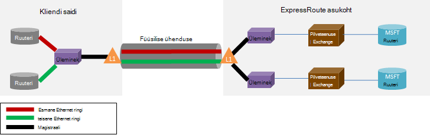

<properties
   pageTitle="ExpressRoute KKK"
   description="KKK ExpressRoute sisaldab teavet toetatud Azure'i teenuste maksumus andmete ja ühenduste, SLA, pakkujate ja asukohad, läbilaskevõime ja täiendavad tehnilised üksikasjad."
   documentationCenter="na"
   services="expressroute"
   authors="cherylmc"
   manager="carmonm"
   editor=""/>
<tags
   ms.service="expressroute"
   ms.devlang="na"
   ms.topic="article" 
   ms.tgt_pltfrm="na"
   ms.workload="infrastructure-services"
   ms.date="10/10/2016"
   ms.author="cherylmc"/>

# ExpressRoute KKK

## Mis on ExpressRoute?
ExpressRoute on Azure'i teenus, mis võimaldab teil luua privaatne seoseid Microsofti andmekeskuses ja taristu, mis on oma ettevõttes või colocation poole. ExpressRoute ühendused avage avaliku Interneti kaudu ja pakkuda suurem turvalisus, töökindluse ja kiiruse ja väiksem kui tüüpilised ühendused latentsused Interneti kaudu.

### Mis on ExpressRoute ja privaatvõrgu ühenduse kasutamise eelised?
ExpressRoute ühendused avage avaliku Interneti kaudu ja pakkuda suurem turvalisus, töökindluse ja kiiruse koos alumise ja terviklik latentsused kui tüüpilised ühendused Interneti kaudu. Mõnel juhul ExpressRoute ühenduste abil andmete vahel kohapealsete seadmed ja Azure saate kulude kasulik.

### Millist Microsofti pilveteenustega toetavad üle ExpressRoute?
ExpressRoute toetab enamiku Microsoft Azure'i teenuste täna, sh Office 365.  Vaadake värskendusi üldiselt kättesaadav varsti.

### Kus asub teenust?
Asukoht ja kättesaadavuseks sellelt lehelt leiate: [ExpressRoute partnerid ja asukohad](expressroute-locations.md).

### Kuidas kasutada ExpressRoute ühenduse loomiseks Microsoft, kui mul pole partnerlus ühe ExpressRoute-carrier partneri?
Saate valida piirkondliku vedaja ja maa Ethernet ühendused ühele toetatud exchange pakkuja asukohad. Saate vaadata siis läbi Microsofti pakkuja asukohas. Märkige ruut [ExpressRoute partnerid ja asukohtade](expressroute-locations.md) kui teenusepakkuja on olemas, mis tahes kohast Exchange'i osa. Seejärel saate tellida mõni ExpressRoute ringi teenusepakkuja Azure'i ühenduse kaudu.

### Kui palju maksab ExpressRoute hind?
Märkige ruut [hinnad üksikasjad](https://azure.microsoft.com/pricing/details/expressroute/) hindade teavet.

### Kui maksate on antud läbilaskevõime ExpressRoute ringi, kas minu võrgu teenuse pakkujalt osta VPN-ühendus peab olema sama kiirust?
Ei. Saate osta VPN-ühenduse kiirusest, mis tahes teenusepakkujalt. Azure'i teie ühendus on ExpressRoute ringi läbilaskevõime, mida osta piirdub.

### Kui maksate on antud läbilaskevõime ExpressRoute ringi, kas võimalus lõhkeda kuni kiirema vajadusel?
Jah. ExpressRoute topoloogia on konfigureeritud toetama juhul, kui saate lõhkeda kuni kaks korda ribalaius, saate täiendavaid tasuta hangitud. Märkige teenusepakkuja juures, kui nad ei toeta seda funktsiooni.

### Saab kasutada sama privaatvõrgu ühendust virtuaalse võrgu ja muude Azure'i teenuste korraga?
Jah. Mõne ExpressRoute ringi üks kord häälestus võimaldab teil juurde pääseda virtuaalse võrgustikus ja muude Azure'i teenuste korraga. Loote virtuaalne võrkude üle privaatne silmitsemine tee ja muude teenuste üle avaliku silmitsemine tee.

### Kas ExpressRoute pakub teenindustaseme leping (SLA)?
Lugege lisateavet [ExpressRoute SLA lehe](https://azure.microsoft.com/support/legal/sla/) .

## Toetatud teenused
Kõige Azure teenused on toetatud ExpressRoute üle.

- Virtuaalmasinates ja pilveteenustega juurutatud, virtuaalse võrgu Ühenduvus on toetatud üle privaatne silmitsemine tee.
- Azure'i veebisaitide on toetatud üle avaliku silmitsemine tee.
- Asjade jaoturi toetatakse üle avaliku silmitsemine tee.
- Office 365 on toetatud Microsoft silmitsemine tee üle.
- Kõik muud teenused on kättesaadavad üle avaliku silmitsemine tee. Erandiks on järgmine.

    **Ei toetata järgmisi teenuseid.**

    - CDN-ID
    - Visual Studio meeskonnatöö teenuste laadi testimine
    - Mitmikautentimise
    - Liikluse haldur

## Andmete ja ühenduste

### Kas on piirangud, mida saab üle kanda ExpressRoute abil?
Me ei määra summa andmeedastus on piiratud. Vaadake [hinnad üksikasjad](https://azure.microsoft.com/pricing/details/expressroute/) läbilaskevõime kohta lisateavet.

### Millist ühenduse korral toetavad ExpressRoute?
Toetatud läbilaskevõime pakkumised:

| 50 Mbps, 100 Mbps, 200 Mbps 500 Mbps 1Gbps, 2 Gbit, 5 Gbit 10Gbps |

### Millised teenusepakkujad on saadaval?
Vaadake teemat [ExpressRoute partnerid ja asukohtade](expressroute-locations.md) teenusepakkujatele ja asukohtade loendit.

## Tehnilised andmed

### Mis on minu kohapealse asukoht ühenduse Azure'i tehnilise?
Lugege [ExpressRoute eeltingimused lehe](expressroute-prerequisites.md) nõuetele.

### On ühendused ExpressRoute liigsed?
Jah. Iga teekonna ringi on üleliigsed paar rist ühendused, mis on konfigureeritud pakkuda kõrge kättesaadavus.

### Kaotsi ühenduvuse kui üks minu ExpressRoute lingid ei?
Te ei kaota ühenduvuse kui ühe rist ühenduse nurjub. Liigsete võrguühenduse toetamiseks võrgu laadi. Lisaks saate luua mitme elektriskeemide tõrge paindlikkuse saavutamiseks silmitsemine asukoht on muutunud.

### Kui ma ei ole koostööd asub veebisaidil pilvepõhise Exchange'i ja minu teenusepakkuja pakub kakspunkt ühendus, pean tellimuse kahe füüsilise seoseid oma kohapealse võrgu ja Microsoft? 
Ei, tuleb ainult üks füüsiline ühendus kui teenusepakkuja saate luua kaks Ethernet virtuaalse ahelatega füüsilise ühenduse kaudu. Füüsilise ühendus (nt kiudoptilised) on lõpetatud kiht 1 (L1) seade (vt pilti allpool). Kaks Ethernet virtuaalse topoloogia on kodeeritud erinevate VLAN ID, mille üks ja üks teisese. Nende VLAN ID-d on väline 802.1Q Ethernet päis. Sisemine 802.1Q kindla [ExpressRoute marsruutimise Domeen](expressroute-circuit-peerings.md)on vastendatud Ethernet päise (ei kuvata). 

### Saate pikendada üks minu VLANs Azure ExpressRoute abil?
Ei. Me ei toeta layer 2 Ühenduvus laiendid Azure'i sisse.

### Kas ma saan mitu ExpressRoute ringi oma tellimust?
Jah. Teie tellimus võib olla mitu ExpressRoute ringi. Sihtotstarbeline topoloogia vaikimisi piirarvu on seatud 10. Võite pöörduda Microsoft Support suurendamiseks limiit vajaduse korral.

### Kas ma saan ExpressRoute topoloogia mitme teenusepakkuja?
Jah. Saate määrata ExpressRoute topoloogia paljud teenuse pakkujad. Iga ExpressRoute ringi seostatakse ainult ühe teenusepakkuja.

### Kuidas ühendada mõne ExpressRoute ringi minu virtuaalse võrkudes
Põhitoimingud on kirjeldatud allpool.

- Peate luua mõne ExpressRoute ringi ja on see teenusepakkuja.
- Teie või pakkuja tuleb konfigureerida BGP silmitsemine (s).
- Ringi ExpressRoute peab virtuaalse võrgu linkida.

Lisateabe saamiseks vaadake [ExpressRoute töövoogusid ringi ettevalmistamise ja ringi olekus](expressroute-workflows.md) .

### Kas minu ExpressRoute ringi ühenduvuse piirid?
Jah. [ExpressRoute partnerid ja asukohtade](expressroute-locations.md) lehel antakse ülevaade piirmäärad ühenduvuse jaoks soovitud ExpressRoute ringi. Mõne ExpressRoute ringi Ühenduvus on piiratud ühe geopoliitiline piirkond. Ühenduvus saate laiendada cross geopoliitiliste piirkondade ExpressRoute premium funktsiooni.

### Saab linkida mitme virtuaalse võrgus on ExpressRoute ringi?
Jah. Kuni 10 virtuaalse võrgu saate linkida mõne ExpressRoute ringi.

### Mul on mitu Azure tellimust, virtuaalse võrgu sisaldavate. Saate ühendada virtuaalse võrgu, mis on ühe ExpressRoute ringi eraldi tellimuste korral?
Jah. Saate autoriseerida kuni 10 muude Azure'i tellimused kasutada ühe ExpressRoute ringi. Selle piirmäära tõsta ExpressRoute premium funktsiooni.

Leiate lisateavet teemast [ühiskasutus on ExpressRoute ringi üle mitu tellimust](expressroute-howto-linkvnet-arm.md).

### Virtuaalse võrguga ühendatud sama ringi üksteisest eraldatud?
Ei. Kõik virtuaalse võrgu seotud sama ExpressRoute ringi kuuluvad sama marsruutimise domeeni ja ei ole eraldatud marsruutimise seisukohalt. Kui teil on vaja marsruutimiseks eraldamise, peate eraldi ExpressRoute ringi loomiseks.

### Kas ma saan ühe virtuaalse võrku ühendatud rohkem kui üks ExpressRoute ringi?
Jah. Saate ühe virtuaalse võrgu kuni 4 ExpressRoute topoloogia linkida. Neid peab tellida kuni 4 eri [ExpressRoute asukohad](expressroute-locations.md).

### Interneti-ühendus saate pääseda minu virtuaalse võrguga ühendatud ExpressRoute topoloogia?
Jah. Kui te pole on avaldatud vaikimisi marsruudib (0.0.0.0/0) või internet marsruutimiseks eesliidete BGP seansi kaudu, saab linkida mõne ExpressRoute ringi virtuaalse võrgust Interneti-ühenduse.

### Interneti-ühenduse, virtuaalse ExpressRoute topoloogia ühendatud võrke saate blokeerida?
Jah. Saab reklaamida vaikimisi marsruudib (0.0.0.0/0) blokeerida kõik Interneti-ühenduse juurutatud virtuaalse võrgustikus virtuaalmasinates ja marsruutimine kõik liiklus välja läbi ExpressRoute ringi. Pange tähele, et kui te reklaamida vaikimisi marsruudib, me sunnib liikluse üle avaliku silmitsemine (nt Azure salvestusruumi ja SQL-i DB) tagasi oma ettevõttes pakutavaid teenuseid. On teil konfigureerida oma ruuterid liikluse naasmiseks Azure kaudu avaliku silmitsemine tee või Interneti kaudu.

### Saate lingitud sama ExpressRoute ringi virtuaalne võrkude üksteisega rääkida?
Jah. Juurutatud, virtuaalse võrguga ühendatud sama ExpressRoute ringi virtuaalmasinates saate omavahel suhelda.

### Saate kasutada saidilt ühenduvuse virtuaalne võrkude koos ExpressRoute?
Jah. ExpressRoute saate kõrvuti VPN saidilt.

### Saate teisaldada virtuaalse võrgu-saidilt / punkti saidi konfiguratsiooni ExpressRoute kasutada?
Jah. On teil ka ExpressRoute lüüsi sees virtuaalse võrgu loomine. Ilmneb väike tööseisakute, protsessiga seotud.

### Mida on vaja ühenduse Azure'i salvestusruumi üle ExpressRoute?
Tuleb luua ka ExpressRoute ringi ja konfigureerida protsesside jaoks avaliku silmitsemine.

### Saab reklaamida lennuliinide arv piirangud on?
Jah. Võtame kuni 4000 marsruutimiseks eesliiteid jaoks privaatne silmitsemine ja 200 avaliku silmitsemine ja Microsoft silmitsemine. Saate suurendada seda kuni 10 000 lennuliinide privaatne silmitsemine kui ExpressRoute premium funktsiooni.

### Saab reklaamida üle BGP seansi IP-vahemike piirangud on?
Me ei aktsepteeri avaliku ja Microsoft silmitsemine BGP seanss privaatne eesliiteid (RFC1918).

### Mis juhtub, kui mul on BGP piirab?
Kõrvaldatakse BGP seansid. Need lähtestatakse, kui eesliide count läheb alla.

### Mis on ExpressRoute BGP hoida aega? Saate seda kohandada?
Hoidke aeg on 180. Ülalhoidmise sõnumid saadetakse iga 60 sekundi järel. Need on fikseeritud sätted Microsoft küljel, mida ei saa muuta.

### Pärast minu virtuaalse võrkudega reklaamida vaikimisi marsruudi (0.0.0.0/0), ei saa minu Azure VMs töötab Windowsi aktiveerida. Kui soovite seda parandada?
Azure'i tuvasta aktiveerimise taotluse aitab järgmist:

1. Luua oma ExpressRoute ringi silmitsemine avaliku.
2. DNS-i teha ja **kms.core.windows.net** IP-aadressi otsimine
3. Tehke kaks järgmist, et Key Management Service tuvastab, et aktiveerimise taotluse pärineb Azure ja au kutse.
    - Kohapealse võrgus marsruutida liikluse, mis on mõeldud IP-aadress (saadud etappi 2) naasmiseks Azure kaudu avaliku silmitsemine.
    - On NSP pakkuja juuksed-pin liiklust Azure'i avaliku silmitsemine kaudu.

### Saate muuta ExpressRoute topoloogia läbilaskevõime?
Jah. Läbilaskevõime ExpressRoute topoloogia saate suurendada ilma, et. On teil tagada, et neid värskendada pidurdab sees oma võrgu läbilaskevõime suurendamiseks toetama ühenduvuse pakkujaga Järeltegevus. Saate siiski ei saa ExpressRoute topoloogia läbilaskevõime vähendada. Vajaduseta alumises ribalaiust tähendab paikneva allapoole ja puhkus ExpressRoute topoloogia.

### Kuidas muuta ExpressRoute topoloogia läbilaskevõime?
Läbilaskevõime ExpressRoute topoloogia, värskendus spetsiaalne ringi API ja PowerShelli cmdlet-käsu abil saate värskendada.

## ExpressRoute Premium

### Mis on ExpressRoute premium?
ExpressRoute premium on saidikogumi funktsioonid, mis on loetletud allpool.

 - Marsruutimise tabeli piiratud 4000 protsessidest 10 000 lennuliinide privaatne silmitsemine suurendada.
 - Suurem arv VNets, mille saab ühendada ExpressRoute ringi (vaikimisi 10). Vt lisateavet allpool esitatud tabelist.
 - Globaalse ühenduvuse Microsoft core võrgu kaudu. Nüüd saab linkida mõne VNet geopoliitiliste piirkonna koos mõne muu piirkonna ExpressRoute ringi. **Näide:** VNet, mis on loodud Euroopa Lääne ExpressRoute ringi, mis loodud Edenvale abil saate linkida.
 - Office 365 teenuste ja CRM Online'i Ühenduvus.

### Kui palju VNets saab linkida mõne ExpressRoute ringi ExpressRoute premium lubamisel?
Järgmistes tabelites on Kuva ExpressRoute piirangud ja VNets arv ExpressRoute ringi kohta.

[AZURE.INCLUDE [expressroute-limits](../../includes/expressroute-limits.md)]

### Kuidas lubada ExpressRoute premium?
Kui see funktsioon on sisse lülitatud ja saab sulgeda, värskendades ringi olek saab lubada ExpressRoute lisafunktsioonidele. Te saate lubada ExpressRoute premium ringi loomise ajal või saate helistada update spetsiaalne ringi API / PowerShelli cmdleti ExpressRoute premium lubamiseks.

### Kuidas keelata ExpressRoute premium?
Saate keelata ExpressRoute premium spetsiaalne värskenduse helistades circuit API / PowerShelli cmdleti, veenduge, et teil on oma ühenduvuse mastaabitud peab vastama vaikimisi piirangud enne, kui keelate ExpressRoute premium. Me ei õnnestu taotluse keelata ExpressRoute premium, kui teie kasutamine skaala Lisaks vaikimisi piirangud.

### Saate saab valida kasutaja soovi premium funktsioonikomplekt funktsioone?
Ei. Te ei saa valida funktsioone, vajate. Kui lülitate ExpressRoute premium võimaldada kõik funktsioonid.

### Kui palju maksab ExpressRoute premium hind?
Vaadake hind [hinnad üksikasjad](https://azure.microsoft.com/pricing/details/expressroute/) .

### Tehke ma ExpressRoute premium lisaks standard ExpressRoute kulude eest maksta?
Jah. ExpressRoute premium kõnetasud peal ExpressRoute ringi ja tasud, mis on vaja ühenduvust pakkuja.

## ExpressRoute ja Office 365 teenuste CRM Online'i

[AZURE.INCLUDE [expressroute-office365-include](../../includes/expressroute-office365-include.md)]

### Kuidas luua ühenduse Office 365 teenuste ja CRM Online'i mõne ExpressRoute ringi?

1. Vaadake üle [ExpressRoute eeltingimused](expressroute-prerequisites.md) lehe veendumaks, et te ei vasta nõuetele.
2. Vaadake üle teenusepakkujatele ja asukohad [ExpressRoute partnerid ja asukohtade](expressroute-locations.md) tagada teie vajadustele ühenduvuse loendit.
3. Lugege läbi [Võrgu plaanimine ja jõudluse häälestamine Teenusekomplektis Office 365](http://aka.ms/tune/)leping teie nõuetele.
4. Täitke alltoodud häälestamine ühenduvuse [ExpressRoute töövoogude ringi ettevalmistamise ja ringi riikide](expressroute-workflows.md)töövoogudes toodud juhised.

>[AZURE.IMPORTANT] Veenduge, et teil on lubatud ExpressRoute premium lisandmooduli Ühenduvus Office 365 teenuste ja CRM Online'i konfigureerimisel.

### Vaja lubamiseks Azure avaliku silmitsemine ühenduse Office 365 teenuste ja CRM Online'i?
Ei, peate ainult Microsoft Peering lubamine. Azure'i AD-liikluse autentimise saadetakse Microsoft Peering kaudu. 

### Saate oma olemasolevad ExpressRoute topoloogia toetab Ühenduvus Office 365 teenuste ja CRM Online'i?
Jah. Teie olemasoleva ExpressRoute ringi saate konfigureeritud toetama Ühenduvus Office 365 teenustega. Veenduge, et teil on piisavalt võimet Office 365 teenustega ühendust ja veenduge, et teil on lubatud premium lisandmooduli. [Võrgu plaanimine ja jõudluse häälestamine Teenusekomplektis Office 365](http://aka.ms/tune/) aitab teil leping ühenduvust teie vajadustele. Vaadake [loomine ja muutke soovitud ExpressRoute ringi](expressroute-howto-circuit-classic.md).

### Millist Office 365 teenuste pääseb ExpressRoute-ühenduse kaudu?

Vaadake [Office 365 URL-id ja IP-aadresside vahemikud](http://aka.ms/o365endpoints) lehe värskendatud loendi toetatud üle ExpressRoute teenuste jaoks.

### Kui palju maksab ExpressRoute Office 365 teenuste ja CRM Online'i maksumus?
Office 365 teenuste ja CRM Online'i nõuab premium olema lubatud lisandmoodul. Kulude üksikasjad [hinnad üksikasjade lehe](https://azure.microsoft.com/pricing/details/expressroute/) ExpressRoute ette.

### Millised piirkonnad on ExpressRoute Office 365 jaoks toetatud?
Vaadake loendi kohta lisateavet, partnerite ja kohad, kus on toetatud ExpressRoute [ExpressRoute partnerid ja asukohad](expressroute-locations.md) .

### Pääseb juurde Office 365 Interneti kaudu isegi siis, kui ExpressRoute konfigureeritud oma asutuse jaoks?
Jah. Office 365 teenuse lõpp-punktid on kättesaadav Interneti kaudu, kuigi ExpressRoute on konfigureeritud võrgu jaoks. Kui olete kohas, kus on konfigureeritud ühenduse Office 365 teenuste ExpressRoute kaudu, siis ühendage ExpressRoute kaudu.

### Dynamics AXI Online'i pääseb ExpressRoute-ühenduse kaudu?
Ei, ei toetata.
