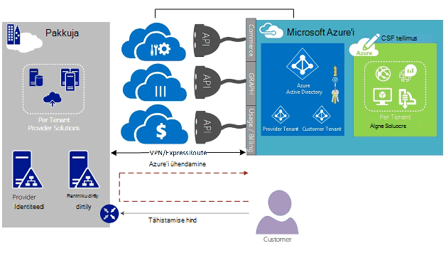

<properties
   pageTitle="Azure'i ExpressRoute pilve lahenduse pakkujate | Microsoft Azure'i"
   description="Sellest artiklist leiate teavet soovite lisada Azure teenuste Cloud teenusepakkujatele ja ExpressRoute sisse oma pakkumisi."
   documentationCenter="na"
   services="expressroute"
   authors="richcar"
   manager="carmonm"
   editor=""/>
<tags
   ms.service="expressroute"
   ms.devlang="na"
   ms.topic="get-started-article"
   ms.tgt_pltfrm="na"
   ms.workload="infrastructure-services"
   ms.date="10/10/2016"
   ms.author="richcar"/>

# ExpressRoute pilve lahenduse pakkujate (CSP)

Microsoft osutab Hyper-skaala teenuste traditsiooniline edasimüüjate ja distributors (CSP) saama kiiresti ettevalmistamise uusi teenuseid ja lahendusi oma klientidele vajamata investeerida arendamise neid uusi teenuseid. Luba pilve lahenduse pakkuja (CSP) võimalus otse hallata neid uusi teenuseid, pakub Microsoft programmid ja API-d, mis võimaldavad CSP haldamiseks Microsoft Azure'i ressursid nimel oma klientidele. Üks need ressursid on ExpressRoute. ExpressRoute võimaldab CSP olemasoleva kliendi ressursid ühenduse Azure'i teenused. ExpressRoute on kiire isikliku suhtlemise link Azure'i teenused. 

ExpresRoute hulka kuuluvad paari topoloogia kõrge-saadavus jaoks, mis on seotud ühe kliendi subscription(s) ja mitme kliendi ei saa ühiskasutusse anda. Iga ringi tuleks erinevate ruuteri säilitada kõrge kättesaadavus lõpetada.

>[AZURE.NOTE] ExpressRoute, mis tähendab, et suured/kompleksarvu rakendusi nõuab mitme ExpressRoute topoloogia üksiku kliendi läbilaskevõime ja ühenduse suurtähelukk puuduvad.

Microsoft Azure'i pakub üha teenused, mida saate pakkuda oma klientidele.  Parim võtta vajavad ära kasutada nende teenuste kasutamine ExpressRoute ühendused anda kiire madal latentsus juurdepääsu Microsoft Azure keskkonnas.

## Microsoft Azure'i haldus
Microsoft osutab RSDde koos API-de haldamiseks, lubades programmiline integreerimine oma teenuste haldus süsteemide Azure klientide tellimused. Toetatud halduse võimaluste leiate [siit](https://msdn.microsoft.com/library/partnercenter/dn974944.aspx).

## Microsoft Azure'i ressursside haldamine
Sõltuvalt lepingu, olete oma kliendi määratleda tellimuse haldamise viisi. Funktsiooni CSP otse saate hallata loomine ja ressursside või kliendi saate hallata Microsoft Azure'i tellimus ja Azure ressursside loomine, nagu need on vaja. Kui teie klient haldab Microsoft Azure'i oma tellimuse ressursside loomine nad kasutavad ühte kahest mudelite: mudeli "Ühendamine kaudu" või "Direct To" mudel. Need mudelid on järgmistes jaotistes on üksikasjalikult kirjeldatud.  

### Mudeli ühenduse kaudu

  

Mudeli ühendus kaudu soovitud CSP loob otse oma andmekeskuses ja kliendi Azure tellimuse vahelise ühenduse. Otsest ühendus on loodud, kasutades ExpressRoute, Azure oma võrguga ühenduse. Klõpsake oma kliendi loob teie võrku. Sel juhul on vaja, et kliendi läbib CSP võrgu Azure'i teenuste kasutamiseks. 

Kui teie klient on muude Azure tellimused, mida te ei halda, kasutaks nad avaliku Interneti- või oma isiklike ühenduse ühenduse nende teenuste, mitte CSP tellimuse jaotises ette valmistatud. 

CSP Azure'i teenuste haldamine, eeldatakse, et selle CSP on varem loodud klientide identiteedi poe, mis tuleks siis tuleb korrata Azure Active Directory oma CSP tellimuse kaudu Administrate-On-Behalf-Of (AOBO) haldamiseks. Kui antud partneri või -teenuse pakkuja on loodud suhte kliendiga, kliendi tarbib teenused praegu või partner on soov esitada pakkuja majutatud ja Azure majutatud lahendusi, et pakkuda paindlikkust ja aadress kliendi probleemid, mis ei rahulda CSP eraldi kombinatsiooni kaasamine võtme draiverid selle stsenaariumi. Näites on kujutatud **joonisel**, all.

### Mudeli ühenduse abil

Mudeli ühendus, et teenusepakkuja loob otsest seost oma kliendi andmekeskuse ja CSP ette valmistatud Azure tellimuse abil ExpressRoute kliendi (klient) üle võrgu.

>[AZURE.NOTE] Jaoks ExpressRoute kliendi oleks vaja luua ja hallata ExpressRoute ringi.  

Selle stsenaariumi ühenduvuse jaoks on vaja, et kliendi loob otse juurde pääseda CSP haldusega Azure tellimuse kliendi võrgu kaudu, kasutades otsese võrguühenduse, mis on loodud, omanik ja kas täielikult või osaliselt kliendi. Nende klientide eeldatakse, et pakkuja praegu ei saa klientide identiteedi poe loodud ja pakkuja aitaks kliendi imitatsiooniga Azure Active Directory oma praeguse tuvastamine poe kaudu AOBO oma tellimuse haldamiseks. Kui antud partneri või -teenuse pakkuja on loodud suhte kliendiga, kliendi tarbib teenused praegu või partner on soov pakkuda teenuseid, mis põhinevad üksnes Azure'i majutatud lahendused olemasoleva pakkuja andmekeskuse või taristu vajamata kaasamine võtme draiverid seda stsenaariumi.

Nende kahe suvand valida põhinevad kliendi vajadustele ja oma praeguse vaja Azure osutamiseks. Need mudelid ja seotud Rollipõhine pääsu juhtimine, võrgunduse ja identiteedi kujundus mustrid hõlmab järgmisi linke üksikasjad:
-   **Roll vastavalt juurdepääsu juhtimine (RBAC)** – RBAC põhineb Azure Active Directory.  Azure'i RBAC kohta lisateabe saamiseks vt [siit](../active-directory/role-based-access-control-configure.md).
-   **Networking** – hõlmab võrgunduse Microsoft Azure erinevate teemadega.
-   **Azure Active Directory (AAD)** – AAD pakub identiteetide haldus Microsoft Azure'i ja 3 SaaS rakenduste jaoks. Lisateavet leiate Azure'i AD [siin](https://azure.microsoft.com/documentation/services/active-directory/).  

## Võrgu kiirust
ExpressRoute toetab võrgu kaudu 50 Mb/s-10Gb/s. See võimaldab klientidele osta võrgu läbilaskevõime nende kordumatu keskkonna jaoks vajalik summa.

>[AZURE.NOTE] Võrgu läbilaskevõime tõsta vastavalt vajadusele ilma katkestades suhtlus, kuid vähendada võrgu kiiruse jaoks on vaja mõista ringi ja selle väiksema võrgu ühenduse taasloomine.  

ExpressRoute toetab mitut vNets, et ühe ExpressRoute ringi ühenduse parem ärakasutamine suurema kiiruse ühendused. Ühe ExpressRoute ringi saab jagada mitme Azure'i tellimused kuuluv sama.

## ExpressRoute konfigureerimine
ExpressRoute saate konfigureeritud toetama üle ühe ExpressRoute ringi kolme tüüpi liikluse ([marsruutimise domeenid](#ExpressRoute-routing-domains)). See liiklus on eraldatud Microsoft silmitsemine, Azure avaliku silmitsemine ja privaatne silmitsemine. Saate valida ühe või kõigi tüüpi liiklust saata üle ühe ExpressRoute ringi või kasutada mitme ExpressRoute topoloogia sõltuvalt suurus ja ExpressRoute ringi eraldamise nõutud oma kliendile. Turvalisus asendi teie kliendi ei luba avaliku liikluse ja privaatne liikluse läbida samas ringi üle.

### Mudeli ühenduse kaudu
Ühenduse loomine – konfiguratsiooni vastutab te kõigi võrgu toetamiseks ühenduse majutatud Azure tellimused oma klientidele andmekeskuse ressursse. Iga oma kliendi jaoks, mida soovite kasutada Azure võimaluste on vaja oma ExpressRoute ühendus, mis juhib te. Funktsiooni saate kasutada samade meetodite kliendi kasutaks ExpressRoute ringi hankida. Te ei järgige samu juhiseid artiklis [ExpressRoute töövoogude](./expressroute-workflows.md) ringi ettevalmistamise ja ringi olekus. Ning seejärel konfigureerige äärise lüüsi protokolli (BGP) marsruudib määrata kohapealse võrgu- ja Azure vNet vahelist liiklust.

### Mudeli ühenduse abil
Ühenduse loomine, et konfiguratsiooni, oma kliendi juba on Azure olemasoleva ühenduse või alustab linkimise ExpressRoute kaudu oma kliendi jaoks andmekeskuse otse Azure, mitte oma andmekeskuse Interneti-teenuse pakkuja ühenduse. Ebausaldusväärsete alustamiseks oma kliendi järgige juhiseid, mudeli ühenduse loomine kaudu eespool kirjeldatud. Kui teie klient tuleb konfigureerida kohapealse võrgu ja Azure vNets juurdepääsu ruuter on loodud ringi.

Kui soovite lubada teie datacenter(s) suhelda kliendi ressursid oma andmekeskuses, või Azure majutatud ressurssidega ressursside saate abistamine ühenduse häälestamise ja konfigureerimise lennuliini.

## ExpressRoute marsruutimise domeenid
ExpressRoute pakub kolme marsruutimise domeene: avaliku, era- ja Microsoft silmitsemine. Iga marsruutimise domeenid on konfigureeritud identse ruuterid aktiivne aktiivne konfiguratsioon kõrge kättesaadavus. ExpressRoute kohta lisateabe saamiseks vaadake marsruutimise domeenid [siin](./expressroute-circuit-peerings.md).

Saate määratleda kohandatud marsruudib filtrid, kui soovite lubada ainult viis(ID), mida soovite lubada või vajate. Lisateavet või vaadake, kuidas neid muuta, lugege artiklit: [loomine ja nende muutmine marsruudi ExpressRoute ringi, mis PowerShelli kaudu](./expressroute-howto-routing-classic.md) filtrite marsruutimise kohta lisateavet.

>[AZURE.NOTE] Microsofti ja avaliku silmitsemine ühenduvuse peab olema kuigi kliendi või CSP avaliku IP-aadress ja järgima kõiki määratletud reeglid. Lisateabe saamiseks vt [ExpressRoute eeltingimused](expressroute-prerequisites.md) .  

## Marsruutimine
ExpressRoute loob ühenduse Azure'i võrkude Azure virtuaalse võrgu lüüsi kaudu. Võrgu lüüside pakuvad marsruudi Azure'i.

Azure'i virtuaalse võrgu loomine loob ka vaikimisi marsruutimise tabeli jaoks, mis suunaks liikluse alamvõrku, on vNet vNet. Kui marsruutimiseks tabeli ei piisa kohandatud lahenduse marsruudib saab luua kohandatud seadmete või ploki marsruudib teatud alamvõrku või väliseid võrgustikke väljamineva liikluse marsruutimiseks.

### Vaikimisi marsruutimine
Vaikimisi marsruutimiseks tabel sisaldab järgmisel viisil:

- Sees on alamvõrgu marsruutimine
- Alamvõrgu-alamvõrgu virtuaalse võrgustikus
- Interneti-ühendus
- Virtuaalse võrgu-virtuaalse võrgu kaudu VPN-lüüsi
- Virtuaalse võrgu-et-kohapealse võrgu kaudu VPN- või ExpressRoute lüüsi

  

### Kasutaja määratletud marsruutimise (UDR)
Kasutaja määratletud marsruudib luba juhtelement liiklust Väljamineva meili kaudu määratud alamvõrgu muude alamvõrku virtuaalse võrgu või üle ühe muud eelmääratletud lüüside (ExpressRoute; Interneti- või VPN). Kasutaja määratletud marsruutimise tabeli, mis asendab marsruutimise tabeli kohandatud marsruudib süsteemi marsruutimise tabeli saate asendada. Kasutaja määratletud marsruutimine, kus kliendid saate luua teatud marsruudib, nagu näiteks tulemüürid või sissetungi tuvastamise seadmete või soovite teatud alamvõrku juurdepääsu takistada majutusteenuse kasutaja määratletud marsruutimiseks alamvõrgu. Kasutaja määratletud marsruudib ülevaate saamiseks vaadake [siin](../virtual-network/virtual-networks-udr-overview.md). 

## Turvalisus
Sõltuvalt sellest, milline mudel on kasutusel, ühendus, et või ühendus kaudu, oma kliendi määratleb selle turbepoliitikate nende vNet või pakub turvalisus poliitika nõuded on CSP oma vNets määratleda. Saate määratleda turvalisus järgmistele kriteeriumitele:

1.  **Kliendi eraldamise** – The Azure'i platvormi annab kliendi eraldamise talletades turvaline andmebaasi, mida kasutatakse iga kliendi liiklus mängu tunneliga kapseldada kliendi ID ja vNet teave.
2.  **Turvalisus jaotises (NSG)** on lubatud liikluse ja sealt alamvõrku sees vNets Azure määratlemiseks. Vaikimisi on NSG sisaldavad blokeerida on vNet Interneti-liikluse ja lubada reeglid liikluse sees on vNet Blokeeri reeglid. Vaadake lisateavet võrgu turberühmad [siin](https://azure.microsoft.com/blog/network-security-groups/).
3.  **Jõusta tunneling** – see on pärit Azure'i üle sees tööruumide andmekeskuse ExpressRoute ühendus ümber suunama seotud Interneti-liikluse ümber valik. Vaadake lisateavet sunniviisilise tunneling [siin](./expressroute-routing.md#advertising-default-routes).  

4.  **Krüptimise** – isegi juhul, kui ExpressRoute topoloogia on mõeldud kindla kliendi, on võimalik, et teenusepakkuja võib rikkunud, lubamisel sissetungija uurida paketi liikluse. Selle võimalikud käsitlema klientide või CSP saate krüptida liikluse ühenduse määratledes IPSec tunneliga-režiimis poliitikad kõigi liiklus vahelist sees tööruumide ressursse ja Azure ressursse (valikuline tunneliga režiimi IPSec viidata klientide 1 joonisel 5: ExpressRoute turvalisus, ülal). Teine võimalus oleks kasutada tulemüüri seadme igal ExpressRoute topoloogia lõpp-punkti. Selleks on vaja täiendavate 3 tootja tulemüüri VMs/seadmete sooritaja krüptimiseks liiklus üle ExpressRoute ringi.

  

## Järgmised sammud
Teenus Cloud lahenduse pakkuja annab teile nii suurendada oma klientidele ilma vajaduseta kallis taristu- ja videovõimaluste oste, säilitades nagu esmane allhanke pakkuja asukoha väärtust. Sujuv integratsioon Microsoft Azure'i suunamist CSP API, mis võimaldab teil integreerida oma halduse olemasolevate raamistik Microsoft Azure juhtimise kaudu.  

Lisateavet leiate järgmistest linkidest:

[Microsofti pilveteenuste lahenduste pakkuja programmi](https://partner.microsoft.com/en-US/Solutions/cloud-reseller-overview).  
[Ettevalmistamine transact pilve lahenduse pakkuja](https://partner.microsoft.com/en-us/solutions/cloud-reseller-pre-launch).  
[Microsofti pilveteenuste lahenduste pakkuja ressursid](https://partner.microsoft.com/en-us/solutions/cloud-reseller-resources).
