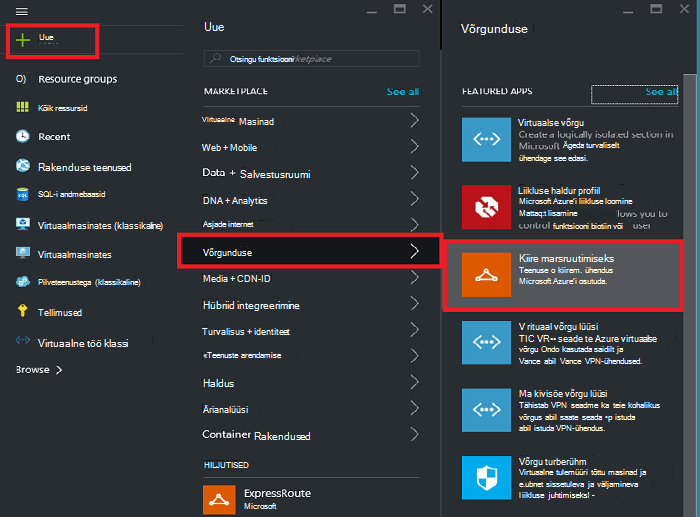
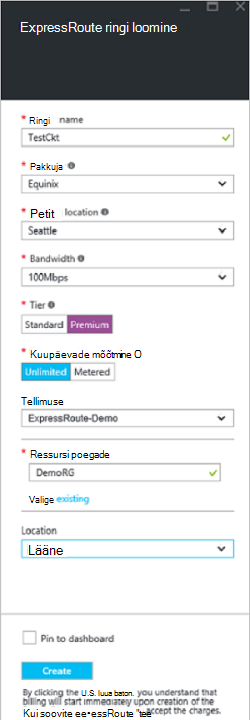
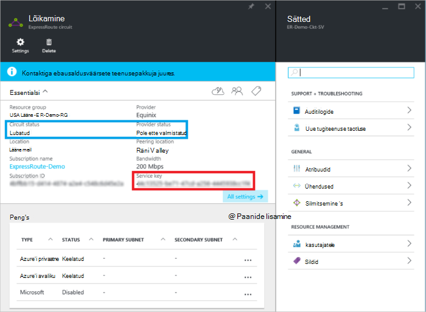
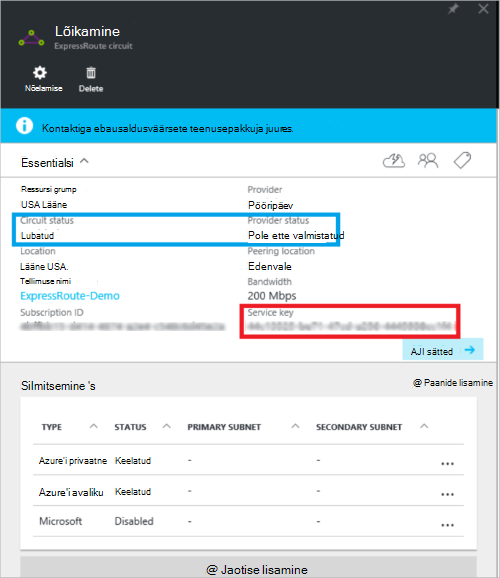
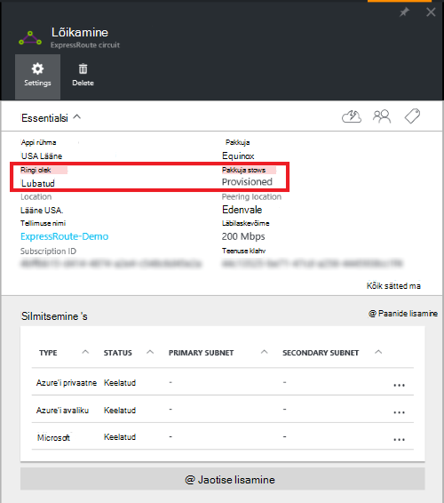

<properties
   pageTitle="Luua ja muuta mõne ExpressRoute ringi ressursihaldur ja Azure portaali abil | Microsoft Azure'i"
   description="Selles artiklis kirjeldatakse, kuidas luua, ette, kinnitamine, värskendada, kustutada ja deprovision mõne ExpressRoute ringi."
   documentationCenter="na"
   services="expressroute"
   authors="cherylmc"
   manager="carmonm"
   editor=""
   tags="azure-resource-manager"/>
<tags
   ms.service="expressroute"
   ms.devlang="na"
   ms.topic="article"
   ms.tgt_pltfrm="na"
   ms.workload="infrastructure-services"
   ms.date="10/10/2016"
   ms.author="cherylmc"/>

# Luua ja muuta mõne ExpressRoute ringi

> [AZURE.SELECTOR]
[Azure'i portaal - ressursihaldur](expressroute-howto-circuit-portal-resource-manager.md)
[PowerShelli - ressursihaldur](expressroute-howto-circuit-arm.md)
[PowerShelli – klassikaline](expressroute-howto-circuit-classic.md)

Selles artiklis kirjeldatakse, kuidas luua mõne Azure'i ExpressRoute ringi Azure portaali ja Azure ressursihaldur juurutamise mudeli abil. Järgmised toimingud Kuva oleku ringi, värskendage seda või kustutamine ja deprovision see.

**Azure'i juurutamise mudelite kohta**

[AZURE.INCLUDE [vpn-gateway-clasic-rm](../../includes/vpn-gateway-classic-rm-include.md)] 

## Enne alustamist

- Enne alustamist konfiguratsiooni, kontrollige [eeltingimused](expressroute-prerequisites.md) ja [töövood](expressroute-workflows.md) .
- Veenduge, et teil on juurdepääs [Azure'i portaalis](https://portal.azure.com).
- Veenduge, et teil on õigused luua uue võrgu ressursse. Kui teil on vastavad õigused, võtke ühendust oma konto administraatoriga.

## Loomine ja mõne ExpressRoute ringi ettevalmistamine

### 1. Azure portaali sisselogimine

Brauserist, liikuge [Azure portaali](http://portal.azure.com) ja Azure kontoga sisselogimine.

### 2. Loo uus ExpressRoute ringi

>[AZURE.IMPORTANT] Oma ExpressRoute ringi, saadetakse teile arve klahvi teenus on välja antud hetkest. Veenduge, et seda toimingut teha kui ühenduvuse pakkuja on valmis ringi ette valmistada.

1. Saate luua ka ExpressRoute ringi, valides võimalus luua uue ressursi. Klõpsake nuppu **Uus** > **Networking** > **ExpressRoute**, nagu on näidatud järgmisel pildil:

    

2. Pärast seda, kui klõpsate **ExpressRoute**, näete **loomine ExpressRoute ringi** tera. Kui te olete selle tera väärtused on täidetud, veenduge, et määratud õige SKU taseme- ja andmete mõõtmine.

    - **Esimese taseme** määrab, kas mõni ExpressRoute standard- või lisandmooduli ExpressRoute premium on lubatud. Saate määrata **Standard** standard SKU-ga või **Premium** saamiseks premium lisandmoodul.

    - **Andmete mõõtmine** määratleb arvelduse tüüp. Saate määrata **Mahupõhised** mahupõhise andmeid ning **piiramatu** piiramatu. Pange tähele, et saate muuta arvelduse tüüp **Mahupõhised** **piiramatu**, kuid ei saa muuta tüüp: **piiramatu** **Mahupõhised**.

    

>[AZURE.IMPORTANT] Palun pange tähele, et silmitsemine asukoht näitab [füüsilise asukoha](expressroute-locations.md) kus olete silmitsemine Microsofti. See ei **ole** seotud "Asukoht" atribuut, mis viitab geograafia, kus asub Azure'i ressursi pakkuja. Kui need on seotud, on hea tava on ressursi pakkuja geograafiliselt lähedal ringi silmitsemine asukoha valimiseks. 

### 3. elektriskeemide ja atribuutide vaatamine

**Saate vaadata kõiki topoloogia**

Saate vaadata elektriskeemide, valides **kogu ressursid** vasakul menüüs loodud.
    

**Atribuutide vaatamine**

    You can view the properties of the circuit by selecting it. On this blade, note the service key for the circuit. You must copy the circuit key for your circuit and pass it down to the service provider to complete the provisioning process. The circuit key is specific to your circuit.

### 4. saata pakkuja connectivity Service'i võti ettevalmistamise

See tera **pakkuja oleku** teave praeguse teenusepakkuja küljel ettevalmistamise kohta. **Ringi olek** pakub Microsoft küljel olek. Ringi olekus ettevalmistamise kohta leiate lisateavet artiklist [töövood](expressroute-workflows.md#expressroute-circuit-provisioning-states) .

Kui loote uue ExpressRoute ringi, saab ringi olekus järgmist:

Pakkuja olek: pole ette valmistatud 
Circuit olek: lubatud

Ringi muutub järgmised oleku, kui ühenduvuse pakkuja tegeleb lubamist saate:

Pakkuja olek: ettevalmistamine 
Circuit olek: lubatud

Saate kasutada ka ExpressRoute ringi, peab olema järgmised olekus:

Pakkuja olek: ette valmistatud 
Circuit olek: lubatud

### 5. perioodiliselt oleku ja ringi võti oleku kontrollimine

Saate vaadata ringi, et olete huvitatud, valides selle atribuute. **Pakkuja oleku** kontrollimine ja veenduge, et see on teisaldatud **Provisioned** enne jätkamist.

### 6. luua oma marsruutimine konfigureerimine

Üksikasjalike juhiste saamiseks lugege artiklit [ExpressRoute marsruutimise konfiguratsioon](expressroute-howto-routing-portal-resource-manager.md) luua ja muuta ringi peerings.

>[AZURE.IMPORTANT] Need juhised kehtivad ainult topoloogia teenuse pakkujad, kes pakub layer 2 connectivity services abil loodud. Kui kasutate teenuse pakkuja, mis pakub hallatavate layer 3 teenused (tavaliselt on IP VPN, nt MPLS), pakkuja Ühenduvus on konfigureerimine ja haldamine saate marsruutimist.

### 7. virtuaalse võrgu linkida mõne ExpressRoute ringi

Järgmiseks link virtuaalse võrgu oma ExpressRoute ringi. Kasutage [ühendav virtuaalse võrkude ExpressRoute topoloogia](expressroute-howto-linkvnet-arm.md) artiklis ressursihaldur juurutamise mudeli töötamisel.

## Oleku ExpressRoute topoloogia toomine

Saate vaadata, valides selle olek on topoloogia. 

## Mõne ExpressRoute ringi muutmine

Saate muuta teatud atribuudid ExpressRoute topoloogia mõjutamata Ühenduvus. Sel ajal, ei saa muuta ExpressRoute ringi atribuudid Azure portaali kaudu. Siiski saate PowerShelli abil saate muuta ringi atribuute. Lisateavet leiate jaotisest [muutmine on ExpressRoute ringi PowerShelli abil](expressroute-howto-circuit-arm.md#modify).

Saate teha järgmised pole tööseisakute.

- Lubamine või keelamine lisandmooduli ExpressRoute premium oma ExpressRoute ringi.

- Teie ExpressRoute topoloogia läbilaskevõime suurendamine Pange tähele, et kasutuselevõttu läbilaskevõime on topoloogia ei toetata. 

- Muuta piiramatu andmete mõõtmine leping Mahupõhised andmete põhjal. Pange tähele, et muutmise mõõtmine leping piiramatu andmete põhjal Mahupõhised andmeid ei toetata.

-  Saate lubada või keelata **Luba klassikaline toimingud**.

Piirangute ja kitsenduste kohta lisateabe saamiseks vaadake [ExpressRoute KKK](expressroute-faqs.md).

## Deprovisioning ja mõne ExpressRoute ringi kustutamine

Saate kustutada oma ExpressRoute ringi ikooni **Kustuta** . Võtke arvesse järgmist.

- Kõik virtuaalse võrgu kaudu ExpressRoute ringi peab lingi eemaldamine. Kui see toiming nurjus, kontrollige, kas virtuaalse võrgu mis tahes lingitakse ringi.

- Kui ExpressRoute ringi teenuse pakkuja ettevalmistamise olek on **Provisioning** või **Provisioned** saate koostööd oma teenusepakkujalt deprovision ringi nende poolel. Jätkame reserveerida ressursid ja kuni teenusepakkuja lõpetab deprovisioning ringi ja teavitab meil teile arve.

- Kui teenusepakkuja on eemaldatud ringi (teenuse pakkuja ettevalmistamise olek on seatud **mitte ette valmistatud**) saate kustutada siis ringi. See toiming peatab ringi arveldus

## Järgmised sammud

Kui olete loonud oma ringi, veenduge, et teha järgmist:

- [Luua ja muuta oma ExpressRoute ringi marsruutimine](expressroute-howto-routing-portal-resource-manager.md)
- [Oma ExpressRoute ringi virtuaalse võrgu linkimine](expressroute-howto-linkvnet-arm.md)
