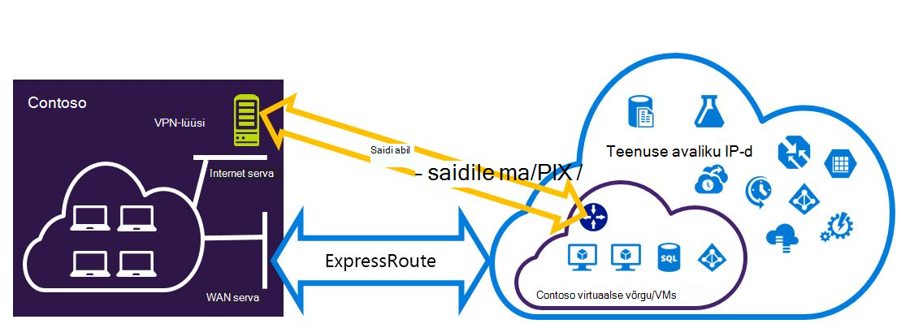
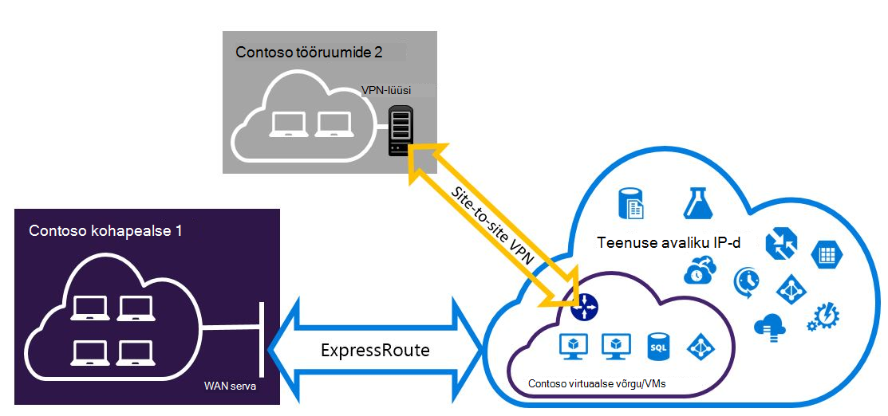

<properties
   pageTitle="Konfigureerida Expressroute ja saidilt VPN ühendused, saate kõrvuti | Microsoft Azure'i"
   description="Selles artiklis tutvustatakse konfigureerida ExpressRoute ja -saidilt VPN-ühendus, mida saate kõrvuti klassikaline juurutamise mudeli."
   documentationCenter="na"
   services="expressroute"
   authors="charwen"
   manager="carmonm"
   editor=""
   tags="azure-service-management"/>
<tags
   ms.service="expressroute"
   ms.devlang="na"
   ms.topic="get-started-article"
   ms.tgt_pltfrm="na"
   ms.workload="infrastructure-services"
   ms.date="10/10/2016"
   ms.author="charwen"/>

# Klassikaline juurutamise mudeli ExpressRoute ja saidilt kooseksisteerimisele ühendused konfigureerimine

> [AZURE.SELECTOR]
- [PowerShelli - ressursihaldur](expressroute-howto-coexist-resource-manager.md)
- [PowerShelli – klassikaline](expressroute-howto-coexist-classic.md)

Teil on võimalus VPN saitide ja ExpressRoute konfigureerimine on mitmeid eeliseid. Turvaline Tõrkesiirde tee VPN saitide konfigureerimine ExressRoute või saidid, mis on ühendatud ExpressRoute kaudu ühenduse VPN saitide abil. Me hõlmab konfigureerimiseks mõlemal juhul selle artikli juhiseid. See artikkel kehtib klassikaline juurutamise mudeli. Selle konfiguratsiooni pole portaalis.

**Azure'i juurutamise mudelite kohta**

[AZURE.INCLUDE [vpn-gateway-clasic-rm](../../includes/vpn-gateway-classic-rm-include.md)] 

>[AZURE.IMPORTANT] ExpressRoute elektriskeemide peab olema eelnevalt konfigureeritud enne, kui te järgige alltoodud juhiseid. Veenduge, et olete täitnud [mõne ExpressRoute ringi loomine](expressroute-howto-circuit-classic.md) ja [konfigureerimine marsruutimine](expressroute-howto-routing-classic.md) juhendite enne, kui te järgige alltoodud juhiseid.

## Piirangud ja kitsendused

- **Teel marsruutimine ei toetata.** Ei saa suunata (kaudu Azure'i) teie kohalikus võrgus VPN saitide kaudu ühendatud ja teie kohalikus võrgus ExpressRoute kaudu ühendatud vahel.
- **Punkti saidi ei toetata.** Ei saa lubada punkti saidi VPN-ühenduste sama VNet, mis on ühendatud ExpressRoute. Punkti saidi VPN-i ja ExpressRoute ei saa koos sama VNet jaoks.
- **Jõustatud tunneling ei saa lubatud VPN saidilt lüüsi.** Saate ainult "jõustada" kõik Interneti seotud liikluse naasta kohapealse võrgu kaudu ExpressRoute.
- **Tavaline SKU lüüsi ei toetata.** Kasutage nii [ExpressRoute lüüsi](expressroute-about-virtual-network-gateways.md) ja [VPN-lüüsi](../vpn-gateway/vpn-gateway-about-vpngateways.md)lihtsa SKU lüüsi.
- **Toetatakse ainult marsruutimiseks vastavalt VPN-lüüsi.** Kasutage marsruutimiseks vastavalt [VPN-lüüsi](../vpn-gateway/vpn-gateway-about-vpngateways.md).
- **Staatilise marsruutimiseks peaks olema konfigureeritud VPN-lüüsi.** Kui teie kohalikus võrgus on ühendatud nii ExpressRoute ja -saidilt VPN, peab teil olema staatilise marsruutimiseks, mis on konfigureeritud ka teie kohalikus võrgus marsruutimiseks avaliku Interneti-saitide VPN-ühendus.
- **Kõigepealt tuleb konfigureerida ExpressRoute lüüsi.** Peate looma ExpressRoute lüüsi kõigepealt enne lisamist-saidilt VPN-lüüsi.

## Konfiguratsiooni kujundused

### Tee Tõrkesiirde VPN saitide konfigureerimine ExpressRoute

Saate konfigureerida-saidilt VPN-ühendus varukoopiana ExpressRoute. See kehtib ainult virtuaalne võrkude lingitud Azure privaatne silmitsemine tee. Azure'i avaliku ja Microsoft peerings kaudu on lahendust Tõrkesiirde VPN-põhiste teenuste jaoks. ExpressRoute ringi on alati esmane link. Kas andmevoo kaudu VPN saidilt tee ainult juhul, kui ExpressRoute ringi nurjub. 

### Saitide pole ühendatud ExpressRoute kaudu ühenduse VPN saitide konfigureerimine

Saate konfigureerida võrgu kui mõnel saidil ühenduse otse Azure-saidilt VPN üle ja mõned saidid ühenduse ExpressRoute kaudu. 

>[AZURE.NOTE] Te ei saa mõnda konfigureerimine virtuaalse võrgu ruuteri teel.

## Kasutage juhiseid valimine

On kaks erinevaid toiminguid selleks, et konfigureerida ühendusi, mis saab kõrvuti valida. Konfiguratsiooni toimingut, mis aktiveeritakse sõltub sellest, kas teil on olemasoleva virtuaalse võrgu, mida soovite ühendada või soovite luua uue virtuaalse võrgu.

- Ma ei ole on VNet ja on vaja luua.
    
    Kui teil pole veel virtuaalse võrk, see toiming juhendab teid loomine uue virtuaalse võrgu kasutada klassikaline juurutamise mudelit ja luua uue ExpressRoute ja saidilt VPN-ühendused. Konfigureerida, järgige artiklis jaotises [luua uue virtuaalse võrgu ja kaasuvad ühendused](#new).

- Mul on juba klassikaline juurutamise mudeli VNet.

    Virtuaalne võrgus võib juba olla olemasoleva-saidilt VPN-ühendus või ühendus ExpressRoute kohas. Artikli jaotist [konfigureerida coexsiting ühenduste jaoks mõne olemasoleva VNet](#add) annab teile läbi lüüsi kustutamine ja seejärel looge uus ExpressRoute ja saidilt VPN-ühendused. Pange tähele, et uute ühenduste loomisel juhiseid tuleb täita väga kindlas järjekorras. Ärge kasutage juhised teised artiklid lüüside ja -ühenduste loomisel.

    Selle protseduuri käigus pakutakse luua ühendusi, mis saab kõrvuti on teil vaja lüüsi kustutamine ja seejärel konfigureerige uus lüüsid. See tähendab, et teil on oma asutusesiseses ühenduste tööseisakute ajal kustutada ja taastada oma lüüsi ja ühendused, kuid teil pole vaja mõnda oma VMs või teenuste uue virtuaalse võrgu migreerimine. Teie VMs ja teenuste saab suhelda välja koormusetasakaalustusteenuse laadimise ajal saate konfigureerida lüüsi, kui need on konfigureeritud seda teha.

## Luua uue virtuaalse võrgu ja kaasuvad ühendused

See toiming on sõelub on VNet loomise ja luua-saitide ja ExpressRoute ühendusi, mis on kõrvuti.

1. Peate Azure PowerShelli cmdletid uusima versiooni installimiseks. Vaadake, [Kuidas installida ja konfigureerida Azure PowerShelli](../powershell-install-configure.md) installimise PowerShelli cmdlet-käskude kohta lisateavet. Pidage meeles, et selle konfiguratsiooni puhul saate kasutada cmdlet-käskude veidi erinevas, mis teil võib olla tuttav. Kasutage neid juhiseid määratud cmdlet-käskude kindlasti. 

2. Skeemi virtuaalse võrgu jaoks luua. Skeemi konfigureerimise kohta leiate lisateavet teemast [Azure virtuaalse võrgu konfiguratsioon skeemi](https://msdn.microsoft.com/library/azure/jj157100.aspx).

    Kui loote oma skeemi, veenduge, et kasutate järgmised väärtused.

    - Lüüsi alamvõrgu virtuaalse võrgu jaoks peab olema /27 või lühemaks eesliite (nt /26 või /25).
    - Lüüsi ühenduse tüüp on "spetsiaalne".

              <VirtualNetworkSite name="MyAzureVNET" Location="Central US">
                <AddressSpace>
                  <AddressPrefix>10.17.159.192/26</AddressPrefix>
                </AddressSpace>
                <Subnets>
                  <Subnet name="Subnet-1">
                    <AddressPrefix>10.17.159.192/27</AddressPrefix>
                  </Subnet>
                  <Subnet name="GatewaySubnet">
                    <AddressPrefix>10.17.159.224/27</AddressPrefix>
                  </Subnet>
                </Subnets>
                <Gateway>
                  <ConnectionsToLocalNetwork>
                    <LocalNetworkSiteRef name="MyLocalNetwork">
                      <Connection type="Dedicated" />
                    </LocalNetworkSiteRef>
                  </ConnectionsToLocalNetwork>
                </Gateway>
              </VirtualNetworkSite>

3. Pärast loomine ja konfigureerimine oma XML-skeemifaili, laadige fail üles. See loob virtuaalse võrgu.

    Järgmine cmdlet-käsk abil saate oma, asendades väärtus oma faili üles laadida.

        Set-AzureVNetConfig -ConfigurationPath 'C:\NetworkConfig.xml'

4. Saate luua ka ExpressRoute lüüsi. Ärge unustage määrata selle GatewaySKU *Standard*, *HighPerformance*, või *UltraPerformance* ja GatewayType nimega *DynamicRouting*.

    Järgmises näites, asendades selle väärtused ise kasutada.

        New-AzureVNetGateway -VNetName MyAzureVNET -GatewayType DynamicRouting -GatewaySKU HighPerformance

5. Link ExpressRoute lüüs ExpressRoute ringi. Kui see toiming on lõpule viidud, kohapealse võrgu ja Azure ExpressRoute, kuni ühendust luua.

        New-AzureDedicatedCircuitLink -ServiceKey <service-key> -VNetName MyAzureVNET

6. Järgmisena Looge oma-saidilt VPN-lüüsi. Funktsiooni GatewaySKU peab olema *Standard*, *HighPerformance*, või *UltraPerformance* ja selle GatewayType peab olema *DynamicRouting*.

        New-AzureVirtualNetworkGateway -VNetName MyAzureVNET -GatewayName S2SVPN -GatewayType DynamicRouting -GatewaySKU  HighPerformance

    Tuua virtuaalse võrgu lüüsi sätteid, sealhulgas lüüsi ID avaliku IP, kasutage funktsiooni `Get-AzureVirtualNetworkGateway` cmdlet-käsk.

        Get-AzureVirtualNetworkGateway

        GatewayId            : 348ae011-ffa9-4add-b530-7cb30010565e
        GatewayName          : S2SVPN
        LastEventData        :
        GatewayType          : DynamicRouting
        LastEventTimeStamp   : 5/29/2015 4:41:41 PM
        LastEventMessage     : Successfully created a gateway for the following virtual network: GNSDesMoines
        LastEventID          : 23002
        State                : Provisioned
        VIPAddress           : 104.43.x.y
        DefaultSite          :
        GatewaySKU           : HighPerformance
        Location             :
        VnetId               : 979aabcf-e47f-4136-ab9b-b4780c1e1bd5
        SubnetId             :
        EnableBgp            : False
        OperationDescription : Get-AzureVirtualNetworkGateway
        OperationId          : 42773656-85e1-a6b6-8705-35473f1e6f6a
        OperationStatus      : Succeeded

7. Kohaliku saidi VPN lüüsi üksuse loomine. See käsk ei kohapealse VPN-lüüsi konfigureerimine. Pigem see võimaldab teil esitada kohaliku lüüsi sätete, näiteks avaliku IP- ja asutusesisese aadresside ruumi, nii, et Azure'i VPN-lüüsi saab ühendada.

    >[AZURE.IMPORTANT] Funktsiooni netcfg pole määratletud VPN saitide jaoks kohaliku saidile. Selle asemel, peate selle cmdlet-käsu abil saate määrata kohaliku saidi parameetrid. Te ei saa määratleda portaali või netcfg faili abil.

    Järgmises näites, asendades väärtused ise kasutada.

        New-AzureLocalNetworkGateway -GatewayName MyLocalNetwork -IpAddress <MyLocalGatewayIp> -AddressSpace <MyLocalNetworkAddress>

    > [AZURE.NOTE] Kui teie kohalikus võrgus on mitu marsruudib, võite anda neile kõik massiivina.  $MyLocalNetworkAddress =@("10.1.2.0/24","10.1.3.0/24","10.2.1.0/24")  

    Tuua virtuaalse võrgu lüüsi sätteid, sealhulgas lüüsi ID avaliku IP, kasutage funktsiooni `Get-AzureVirtualNetworkGateway` cmdlet-käsk. Vt järgmist näidet.

        Get-AzureLocalNetworkGateway

        GatewayId            : 532cb428-8c8c-4596-9a4f-7ae3a9fcd01b
        GatewayName          : MyLocalNetwork
        IpAddress            : 23.39.x.y
        AddressSpace         : {10.1.2.0/24}
        OperationDescription : Get-AzureLocalNetworkGateway
        OperationId          : ddc4bfae-502c-adc7-bd7d-1efbc00b3fe5
        OperationStatus      : Succeeded

8. Kohaliku VPN seadme ühenduse uue lüüsi konfigureerida. Teavet, mida saate tuua juhist 6 konfigureerimisel VPN-seadme kasutamine. VPN seadme konfigureerimise kohta leiate lisateavet teemast [VPN seadme konfiguratsiooni](../vpn-gateway/vpn-gateway-about-vpn-devices.md).

9. Link – saidilt VPN-lüüsi Azure kohaliku lüüsi.

    Selles näites on connectedEntityId kohaliku lüüsi ID, mille leiate käivitades `Get-AzureLocalNetworkGateway`. Leiate virtualNetworkGatewayId, kasutades funktsiooni `Get-AzureVirtualNetworkGateway` cmdlet-käsk. Pärast seda toimingut teie kohalikus võrgus ja Azure-saidilt VPN-ühenduse kaudu ühendust luua.

        New-AzureVirtualNetworkGatewayConnection -connectedEntityId <local-network-gateway-id> -gatewayConnectionName Azure2Local -gatewayConnectionType IPsec -sharedKey abc123 -virtualNetworkGatewayId <azure-s2s-vpn-gateway-id>

## Mõne olemasoleva VNet coexsiting ühendusi konfigureerimine

Kui teil on mõne olemasoleva virtuaalse võrgu, lüüsi alamvõrgu suuruse kontrollimine. Kui lüüsi alamvõrgu on /28 või /29, peate esmalt virtuaalse võrgu lüüsi kustutamine ja lüüsi alamvõrgu suurendamine. Selle jaotise juhised näitab teile, kuidas seda teha.

Kui lüüsi alamvõrgu on /27 või suurem ja ExpressRoute virtuaalse võrku ühendatud, saate vahele jätta alltoodud juhiseid ja jätkake ["Juhis 6 - lüüsi VPN saitide loomine"](#vpngw) eelmises jaotises.

>[AZURE.NOTE] Kui kustutate olemasoleva lüüsi, kaotavad oma kohaliku ettevõttes virtuaalse võrguga ühenduse selle konfiguratsiooni töötamise ajal.

1. Azure'i ressursihaldur PowerShelli cmdlet-käskude uusima versiooni installimiseks peate. Vaadake, [Kuidas installida ja konfigureerida Azure PowerShelli](../powershell-install-configure.md) installimise PowerShelli cmdlet-käskude kohta lisateavet. Pange tähele, et selle konfiguratsiooni puhul saate kasutada cmdlet-käskude võib olla veidi teistsugune kui mis teil võib olla tuttav. Kasutage neid juhiseid määratud cmdlet-käskude kindlasti. 

2. Olemasoleva ExpressRoute või -saidilt VPN lüüsi kustutamine. Kasutage järgmist cmdletti, asendades väärtused ise.

        Remove-AzureVNetGateway –VnetName MyAzureVNET

3. Virtuaalse võrgu skeemi eksportimine. Kasutage järgmist PowerShelli cmdleti, asendades väärtused ise.

        Get-AzureVNetConfig –ExportToFile “C:\NetworkConfig.xml”

4. Redigeerige võrgu konfigureerimise faili skeemi nii, et lüüsi alamvõrgu on /27 või lühemaks eesliite (nt /26 või /25). Vt järgmist näidet. 
>[AZURE.NOTE] Kui teil pole piisavalt jääda virtuaalse võrgu lüüsi alamvõrgu suurendamine IP-aadressid, peate lisama veel IP-aadress ruumi. Skeemi konfigureerimise kohta leiate lisateavet teemast [Azure virtuaalse võrgu konfiguratsioon skeemi](https://msdn.microsoft.com/library/azure/jj157100.aspx).

          <Subnet name="GatewaySubnet">
            <AddressPrefix>10.17.159.224/27</AddressPrefix>
          </Subnet>

5. Kui teie eelmine lüüsi VPN saidilt, peate ka ühenduse tüüp **pühendunud**vahetada.

                 <Gateway>
                  <ConnectionsToLocalNetwork>
                    <LocalNetworkSiteRef name="MyLocalNetwork">
                      <Connection type="Dedicated" />
                    </LocalNetworkSiteRef>
                  </ConnectionsToLocalNetwork>
                </Gateway>

6. Sel hetkel, peate mõne VNet pole lüüside abil. Luua uue lüüside ja täitke oma ühendused, saate jätkata [Samm 4 - luua mõne ExpressRoute lüüsi](#gw), leitud eelnev kogumi juhiseid.

## Järgmised sammud

ExpressRoute kohta leiate lisateavet teemast [ExpressRoute KKK](expressroute-faqs.md)
