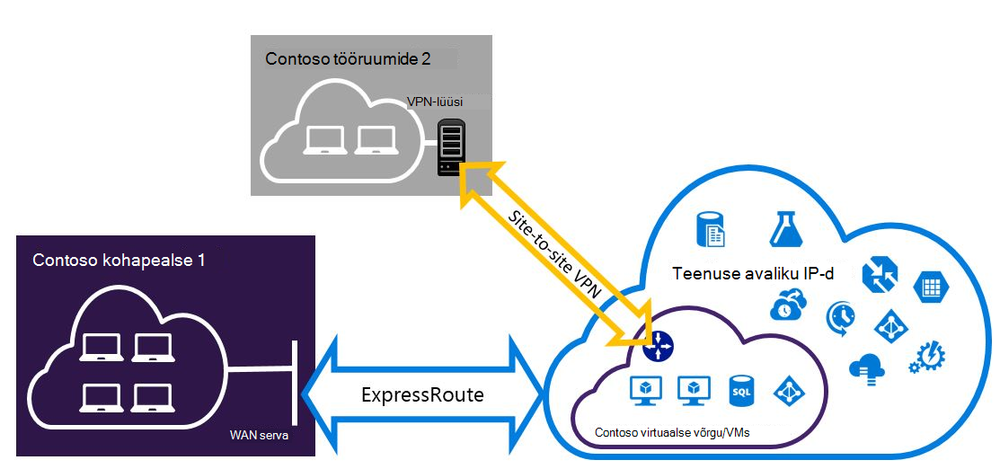

<properties
   pageTitle="Konfigureerida Expressroute ja saidilt VPN ühendused, saate kõrvuti ressursihaldur juurutamise mudeli | Microsoft Azure'i"
   description="Selles artiklis tutvustatakse konfigureerida ExpressRoute ja -saidilt VPN-ühendus, mida saate kõrvuti ressursihaldur mudeli."
   documentationCenter="na"
   services="expressroute"
   authors="charwen"
   manager="carmonm"
   editor=""
   tags="azure-resource-manager"/>
<tags
   ms.service="expressroute"
   ms.devlang="na"
   ms.topic="get-started-article"
   ms.tgt_pltfrm="na"
   ms.workload="infrastructure-services"
   ms.date="10/10/2016"
   ms.author="charleywen"/>

# ExpressRoute ja saidilt kooseksisteerimisele ühendused ressursihaldur juurutamise mudeli konfigureerimine

> [AZURE.SELECTOR]
- [PowerShelli - ressursihaldur](expressroute-howto-coexist-resource-manager.md)
- [PowerShelli – klassikaline](expressroute-howto-coexist-classic.md)

Teil on võimalus VPN saitide ja ExpressRoute konfigureerimine on mitmeid eeliseid. Turvaline Tõrkesiirde tee VPN saitide konfigureerimine ExressRoute või saidid, mis on ühendatud ExpressRoute kaudu ühenduse VPN saitide abil. Me hõlmab konfigureerimiseks mõlemal juhul selle artikli juhiseid. See artikkel kehtib ressursihaldur juurutamise mudeli. Selle konfiguratsiooni pole Azure'i portaalis.

**Azure'i juurutamise mudelite kohta**

[AZURE.INCLUDE [vpn-gateway-clasic-rm](../../includes/vpn-gateway-classic-rm-include.md)] 

>[AZURE.IMPORTANT] ExpressRoute elektriskeemide peab olema eelnevalt konfigureeritud enne, kui te järgige alltoodud juhiseid. Veenduge, et olete täitnud [mõne ExpressRoute ringi loomine](expressroute-howto-circuit-arm.md) ja [konfigureerimine marsruutimine](expressroute-howto-routing-arm.md) juhendite enne, kui te järgige alltoodud juhiseid.

## Piirangud ja kitsendused

- **Teel marsruutimine ei toetata.** Ei saa suunata (kaudu Azure'i) teie kohalikus võrgus VPN saitide kaudu ühendatud ja teie kohalikus võrgus ExpressRoute kaudu ühendatud vahel.
- **Tavaline SKU lüüsi ei toetata.** Kasutage nii [ExpressRoute lüüsi](expressroute-about-virtual-network-gateways.md) ja [VPN-lüüsi](../vpn-gateway/vpn-gateway-about-vpngateways.md)lihtsa SKU lüüsi.
- **Toetatakse ainult marsruutimiseks vastavalt VPN-lüüsi.** Kasutage marsruutimiseks vastavalt [VPN-lüüsi](../vpn-gateway/vpn-gateway-about-vpngateways.md).
- **Staatilise marsruutimiseks peaks olema konfigureeritud VPN-lüüsi.** Kui teie kohalikus võrgus on ühendatud nii ExpressRoute ja -saidilt VPN, peab teil olema staatilise marsruutimiseks, mis on konfigureeritud ka teie kohalikus võrgus marsruutimiseks avaliku Interneti-saitide VPN-ühendus.
- **Kõigepealt tuleb konfigureerida ExpressRoute lüüsi.** Peate looma ExpressRoute lüüsi kõigepealt enne lisamist-saidilt VPN-lüüsi.

## Konfiguratsiooni kujundused

### Tee Tõrkesiirde VPN saitide konfigureerimine ExpressRoute

Saate konfigureerida-saidilt VPN-ühendus varukoopiana ExpressRoute. See kehtib ainult virtuaalne võrkude lingitud Azure privaatne silmitsemine tee. Azure'i avaliku ja Microsoft peerings kaudu on lahendust Tõrkesiirde VPN-põhiste teenuste jaoks. ExpressRoute ringi on alati esmane link. Kas andmevoo kaudu VPN saidilt tee ainult juhul, kui ExpressRoute ringi nurjub.
>[AZURE.NOTE] ExpressRoute ringi on eelistatud üle VPN saidilt, kui mõlemad on sama, kasutage Azure'i longuest eesliite match valida soovitud paketi sihtkoha poole.

### Saitide pole ühendatud ExpressRoute kaudu ühenduse VPN saitide konfigureerimine

Saate konfigureerida võrgu kui mõnel saidil ühenduse otse Azure-saidilt VPN üle ja mõned saidid ühenduse ExpressRoute kaudu. 

>[AZURE.NOTE] Te ei saa mõnda konfigureerimine virtuaalse võrgu ruuteri teel.

## Kasutage juhiseid valimine

On kaks erinevaid toiminguid selleks, et konfigureerida ühendusi, mis saab kõrvuti valida. Konfiguratsiooni toimingut, mis aktiveeritakse sõltub sellest, kas teil on olemasoleva virtuaalse võrgu, mida soovite ühendada või soovite luua uue virtuaalse võrgu.

- Ma ei ole on VNet ja on vaja luua.
    
    Kui teil pole veel virtuaalse võrk, see toiming juhendab teid loomine uue virtuaalse võrgu kasutada ressursihaldur juurutamise mudelit ja luua uue ExpressRoute ja saidilt VPN-ühendused. Konfigureerida, järgige artiklis jaotises [luua uue virtuaalse võrgu ja kaasuvad ühendused](#new).

- Mul on juba ressursihaldur juurutamise mudeli VNet.

    Virtuaalne võrgus võib juba olla olemasoleva-saidilt VPN-ühendus või ühendus ExpressRoute kohas. Jaotise [konfigureerida coexsiting ühenduste jaoks mõne olemasoleva VNet](#add) annab teile läbi lüüsi kustutamine ja seejärel looge uus ExpressRoute ja saidilt VPN-ühendused. Pange tähele, et uute ühenduste loomisel juhiseid tuleb täita väga kindlas järjekorras. Ärge kasutage juhised teised artiklid lüüside ja -ühenduste loomisel.

    Selle protseduuri käigus pakutakse luua ühendusi, mis saab kõrvuti on teil vaja lüüsi kustutamine ja seejärel konfigureerige uus lüüsid. See tähendab, et teil on oma asutusesiseses ühenduste tööseisakute ajal kustutada ja taastada oma lüüsi ja ühendused, kuid teil pole vaja mõnda oma VMs või teenuste uue virtuaalse võrgu migreerimine. Teie VMs ja teenuste saab suhelda välja koormusetasakaalustusteenuse laadimise ajal saate konfigureerida lüüsi, kui need on konfigureeritud seda teha.

## Luua uue virtuaalse võrgu ja kaasuvad ühendused

See toiming on sõelub on VNet loomise ja luua-saitide ja ExpressRoute ühendusi, mis on kõrvuti.
    
1. Peate Azure PowerShelli cmdletid uusima versiooni installimiseks. Vaadake, [Kuidas installida ja konfigureerida Azure PowerShelli](../powershell-install-configure.md) installimise PowerShelli cmdlet-käskude kohta lisateavet. Pidage meeles, et selle konfiguratsiooni puhul saate kasutada cmdlet-käskude veidi erinevas, mis teil võib olla tuttav. Kasutage neid juhiseid määratud cmdlet-käskude kindlasti.

2. Logige sisse oma konto ja keskkonna häälestamine.
    
        login-AzureRmAccount
        Select-AzureRmSubscription -SubscriptionName 'yoursubscription'
        $location = "Central US"
        $resgrp = New-AzureRmResourceGroup -Name "ErVpnCoex" -Location $location

3. Saate luua virtuaalse võrgu, sh lüüsi alamvõrgu. Virtuaalse võrgu konfigureerimise kohta leiate lisateavet teemast [Azure virtuaalse võrgu konfigureerimise](../virtual-network/virtual-networks-create-vnet-arm-ps.md).

    >[AZURE.IMPORTANT] Lüüsi alamvõrgu peab olema /27 või lühemaks eesliite (nt /26 või /25).
    
    Saate luua uue VNet.

        $vnet = New-AzureRmVirtualNetwork -Name "CoexVnet" -ResourceGroupName $resgrp.ResourceGroupName -Location $location -AddressPrefix "10.200.0.0/16" 

    Lisage alamvõrku.

        Add-AzureRmVirtualNetworkSubnetConfig -Name "App" -VirtualNetwork $vnet -AddressPrefix "10.200.1.0/24"
        Add-AzureRmVirtualNetworkSubnetConfig -Name "GatewaySubnet" -VirtualNetwork $vnet -AddressPrefix "10.200.255.0/24"

    Salvestage VNet konfigureerimine.

        $vnet = Set-AzureRmVirtualNetwork -VirtualNetwork $vnet

4. Saate luua ka ExpressRoute lüüsi. ExpressRoute lüüsi konfigureerimise kohta leiate lisateavet teemast [ExpressRoute lüüsi konfigureerimine](expressroute-howto-add-gateway-resource-manager.md). Funktsiooni GatewaySKU peab olema *Standard*, *HighPerformance*või *UltraPerformance*.

        $gwSubnet = Get-AzureRmVirtualNetworkSubnetConfig -Name "GatewaySubnet" -VirtualNetwork $vnet
        $gwIP = New-AzureRmPublicIpAddress -Name "ERGatewayIP" -ResourceGroupName $resgrp.ResourceGroupName -Location $location -AllocationMethod Dynamic
        $gwConfig = New-AzureRmVirtualNetworkGatewayIpConfig -Name "ERGatewayIpConfig" -SubnetId $gwSubnet.Id -PublicIpAddressId $gwIP.Id
        $gw = New-AzureRmVirtualNetworkGateway -Name "ERGateway" -ResourceGroupName $resgrp.ResourceGroupName -Location $location -IpConfigurations $gwConfig -GatewayType "ExpressRoute" -GatewaySku Standard 

5. Link ExpressRoute lüüs ExpressRoute ringi. Kui see toiming on lõpule viidud, kohapealse võrgu ja Azure ExpressRoute, kuni ühendust luua. Link selle toimingu kohta leiate lisateavet teemast [Link VNets ExpressRoute abil](expressroute-howto-linkvnet-arm.md).

        $ckt = Get-AzureRmExpressRouteCircuit -Name "YourCircuit" -ResourceGroupName "YourCircuitResourceGroup"
        New-AzureRmVirtualNetworkGatewayConnection -Name "ERConnection" -ResourceGroupName $resgrp.ResourceGroupName -Location $location -VirtualNetworkGateway1 $gw -PeerId $ckt.Id -ConnectionType ExpressRoute

6. Järgmisena Looge oma-saidilt VPN-lüüsi. VPN-lüüsi konfigureerimise kohta leiate lisateavet teemast [konfigureerimine on VNet saidilt ühendusega](../vpn-gateway/vpn-gateway-create-site-to-site-rm-powershell.md). Funktsiooni GatewaySKU peab olema *Standard*, *HighPerformance*või *UltraPerformance*. Funktsiooni VpnType peab *RouteBased*.

        $gwSubnet = Get-AzureRmVirtualNetworkSubnetConfig -Name "GatewaySubnet" -VirtualNetwork $vnet
        $gwIP = New-AzureRmPublicIpAddress -Name "VPNGatewayIP" -ResourceGroupName $resgrp.ResourceGroupName -Location $location -AllocationMethod Dynamic
        $gwConfig = New-AzureRmVirtualNetworkGatewayIpConfig -Name "VPNGatewayIpConfig" -SubnetId $gwSubnet.Id -PublicIpAddressId $gwIP.Id
        New-AzureRmVirtualNetworkGateway -Name "VPNGateway" -ResourceGroupName $resgrp.ResourceGroupName -Location $location -IpConfigurations $gwConfig -GatewayType "Vpn" -VpnType "RouteBased" -GatewaySku "Standard"

    Azure'i VPN-lüüsi toetab soovitud BGP. Saate määrata - EnableBgp järgmine käsk.

        $azureVpn = New-AzureRmVirtualNetworkGateway -Name "VPNGateway" -ResourceGroupName $resgrp.ResourceGroupName -Location $location -IpConfigurations $gwConfig -GatewayType "Vpn" -VpnType "RouteBased" -GatewaySku "Standard" -EnableBgp $true

    Saate otsida BGP, silmitsemine IP ja Azure VPN lüüsi $azureVpn.BgpSettings.BgpPeeringAddress ja $azureVpn.BgpSettings.Asn kasutava AS number. Lisateavet leiate teemast Azure VPN-lüüsi [BGP konfigureerimine](../vpn-gateway/vpn-gateway-bgp-resource-manager-ps.md) .

7. Kohaliku saidi VPN lüüsi üksuse loomine. See käsk ei kohapealse VPN-lüüsi konfigureerimine. Pigem see võimaldab teil esitada kohaliku lüüsi sätete, näiteks avaliku IP- ja asutusesisese aadresside ruumi, nii, et Azure'i VPN-lüüsi saab ühendada.

    Kui teie kohaliku VPN-seade toetab ainult staatiline marsruutimine, saate konfigureerida staatilise marsruudib järgmisel viisil.

        $MyLocalNetworkAddress = @("10.100.0.0/16","10.101.0.0/16","10.102.0.0/16")
        $localVpn = New-AzureRmLocalNetworkGateway -Name "LocalVPNGateway" -ResourceGroupName $resgrp.ResourceGroupName -Location $location -GatewayIpAddress *<Public IP>* -AddressPrefix $MyLocalNetworkAddress

    Kui kohaliku VPN-seade toetab soovitud BGP ja te soovite lubada dünaamiline marsruutimine, peate teadma BGP, silmitsemine IP ja AS arv, mis kasutab teie kohaliku VPN-seade.

        $localVPNPublicIP = "<Public IP>"
        $localBGPPeeringIP = "<Private IP for the BGP session>"
        $localBGPASN = "<ASN>"
        $localAddressPrefix = $localBGPPeeringIP + "/32"
        $localVpn = New-AzureRmLocalNetworkGateway -Name "LocalVPNGateway" -ResourceGroupName $resgrp.ResourceGroupName -Location $location -GatewayIpAddress $localVPNPublicIP -AddressPrefix $localAddressPrefix -BgpPeeringAddress $localBGPPeeringIP -Asn $localBGPASN

8. Kohaliku VPN seadme ühenduse uue Azure VPN-lüüsi konfigureerida. VPN seadme konfigureerimise kohta leiate lisateavet teemast [VPN seadme konfiguratsiooni](../vpn-gateway/vpn-gateway-about-vpn-devices.md).

9. Link – saidilt VPN-lüüsi Azure kohaliku lüüsi.

        $azureVpn = Get-AzureRmVirtualNetworkGateway -Name "VPNGateway" -ResourceGroupName $resgrp.ResourceGroupName
        New-AzureRmVirtualNetworkGatewayConnection -Name "VPNConnection" -ResourceGroupName $resgrp.ResourceGroupName -Location $location -VirtualNetworkGateway1 $azureVpn -LocalNetworkGateway2 $localVpn -ConnectionType IPsec -SharedKey <yourkey>

## Mõne olemasoleva VNet coexsiting ühendusi konfigureerimine

Kui teil on mõne olemasoleva virtuaalse võrgu, lüüsi alamvõrgu suuruse kontrollimine. Kui lüüsi alamvõrgu on /28 või /29, peate esmalt virtuaalse võrgu lüüsi kustutamine ja lüüsi alamvõrgu suurendamine. Selle jaotise juhised näitab teile, kuidas seda teha.

Kui lüüsi alamvõrgu on /27 või suurem ja ExpressRoute virtuaalse võrku ühendatud, saate vahele jätta alltoodud juhiseid ja jätkake ["Juhis 6 - lüüsi VPN saitide loomine"](#vpngw) eelmises jaotises. 

>[AZURE.NOTE] Kui kustutate olemasoleva lüüsi, kaotavad oma kohaliku ettevõttes virtuaalse võrguga ühenduse selle konfiguratsiooni töötamise ajal. 

1. Peate Azure PowerShelli cmdletid uusima versiooni installimiseks. Vaadake, [Kuidas installida ja konfigureerida Azure PowerShelli](../powershell-install-configure.md) installimise PowerShelli cmdlet-käskude kohta lisateavet. Pidage meeles, et selle konfiguratsiooni puhul saate kasutada cmdlet-käskude veidi erinevas, mis teil võib olla tuttav. Kasutage neid juhiseid määratud cmdlet-käskude kindlasti. 

2. Olemasoleva ExpressRoute või -saidilt VPN lüüsi kustutamine. 

        Remove-AzureRmVirtualNetworkGateway -Name <yourgatewayname> -ResourceGroupName <yourresourcegroup>

3. Lüüsi alamvõrgu kustutada.
        
        $vnet = Get-AzureRmVirtualNetwork -Name <yourvnetname> -ResourceGroupName <yourresourcegroup> 
        Remove-AzureRmVirtualNetworkSubnetConfig -Name GatewaySubnet -VirtualNetwork $vnet

4. Lisage lüüsi alamvõrku, mis on /27 või suurem.
    >[AZURE.NOTE] Kui teil pole piisavalt jääda virtuaalse võrgu lüüsi alamvõrgu suurendamine IP-aadressid, peate lisama veel IP-aadress ruumi.

        $vnet = Get-AzureRmVirtualNetwork -Name <yourvnetname> -ResourceGroupName <yourresourcegroup>
        Add-AzureRmVirtualNetworkSubnetConfig -Name "GatewaySubnet" -VirtualNetwork $vnet -AddressPrefix "10.200.255.0/24"

    Salvestage VNet konfigureerimine.

        $vnet = Set-AzureRmVirtualNetwork -VirtualNetwork $vnet

5. Sel hetkel, peate mõne VNet pole lüüside abil. Luua uue lüüside ja täitke oma ühendused, saate jätkata [Samm 4 - luua mõne ExpressRoute lüüsi](#gw), leitud eelnev kogumi juhiseid.

## Lisada VPN-lüüsi punkti saidi konfigureerimine
Saate järgige alltoodud punkti saidi konfiguratsiooni VPN-lüüsi, koostöö olemas häälestamise juhiseid.

1. Lisage VPN kliendi aadressi uudiseid. 

        $azureVpn = Get-AzureRmVirtualNetworkGateway -Name "VPNGateway" -ResourceGroupName $resgrp.ResourceGroupName
        Set-AzureRmVirtualNetworkGatewayVpnClientConfig -VirtualNetworkGateway $azureVpn -VpnClientAddressPool "10.251.251.0/24"

2. VPN-lüüsi üles laadida Azure'i juurkausta VPN-i serdi. Selles näites eeldatakse, et root sert on talletatud kohalikus arvutis, kus on käivitage järgmised PowerShelli cmdlet-käsud. 

        $p2sCertFullName = "RootErVpnCoexP2S.cer"
        $p2sCertMatchName = "RootErVpnCoexP2S"
        $p2sCertToUpload=get-childitem Cert:\CurrentUser\My | Where-Object {$_.Subject -match $p2sCertMatchName}
        if ($p2sCertToUpload.count -eq 1){
            write-host "cert found"
        } else {
            write-host "cert not found"
            exit
        } 
        $p2sCertData = [System.Convert]::ToBase64String($p2sCertToUpload.RawData)
        Add-AzureRmVpnClientRootCertificate -VpnClientRootCertificateName $p2sCertFullName -VirtualNetworkGatewayname $azureVpn.Name -ResourceGroupName $resgrp.ResourceGroupName -PublicCertData $p2sCertData

Punkti saidi VPN kohta leiate lisateavet teemast [punkti saidi ühenduse konfigureerimine](../vpn-gateway/vpn-gateway-howto-point-to-site-rm-ps.md).

## Järgmised sammud

ExpressRoute kohta leiate lisateavet teemast [ExpressRoute KKK](expressroute-faqs.md).
