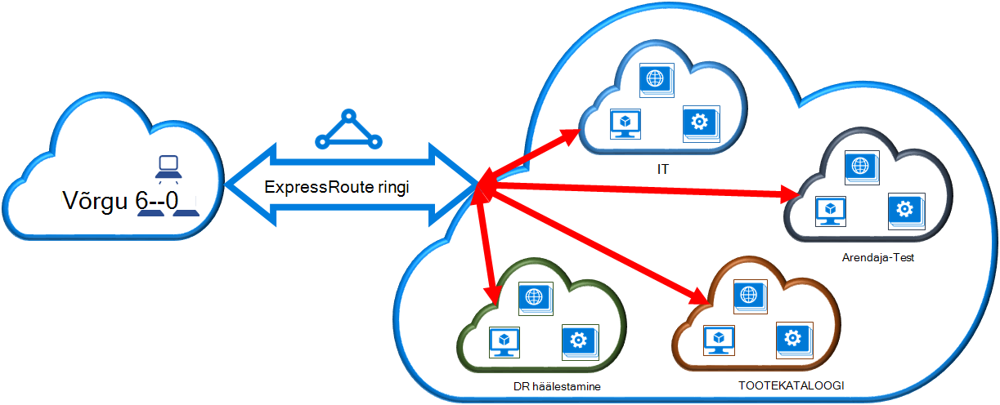

<properties
   pageTitle="Linkimine on ExpressRoute ringi virtuaalse võrgu klassikaline juurutamise mudeli ja PowerShelli abil | Microsoft Azure'i"
   description="Selle dokumendi pakub ülevaade sellest, kuidas lingitakse virtuaalne võrkude (VNets) ExpressRoute topoloogia klassikaline juurutamise mudeli ja PowerShelli abil."
   services="expressroute"
   documentationCenter="na"
   authors="ganesr"
   manager="carmonm"
   editor=""
   tags="azure-service-management"/>
<tags
   ms.service="expressroute"
   ms.devlang="na"
   ms.topic="article"
   ms.tgt_pltfrm="na"
   ms.workload="infrastructure-services"
   ms.date="10/10/2016"
   ms.author="ganesr" />

# Mõne ExpressRoute ringi virtuaalse võrgu linkimine

> [AZURE.SELECTOR]
- [Azure'i portaal - ressursihaldur](expressroute-howto-linkvnet-portal-resource-manager.md)
- [PowerShelli - ressursihaldur](expressroute-howto-linkvnet-arm.md)
- [PowerShelli – klassikaline](expressroute-howto-linkvnet-classic.md)

See artikkel aitab teil virtuaalne võrkude (VNets) link Azure'i ExpressRoute topoloogia klassikaline juurutamise mudeli ja PowerShelli abil. Virtuaalne võrkude võib olla sama tellimuse või saab osa teise tellimus.

**Azure'i juurutamise mudelite kohta**

[AZURE.INCLUDE [vpn-gateway-clasic-rm](../../includes/vpn-gateway-classic-rm-include.md)]

## Konfiguratsiooni eeltingimused

1. Teil on vaja Azure PowerShelli moodulid uusim versioon. Saate alla laadida uusima PowerShelli moodulid [Azure'i allalaadimislehelt](https://azure.microsoft.com/downloads/)PowerShelli osa. Järgige juhiseid, [Kuidas installida ja konfigureerida Azure PowerShelli](../powershell-install-configure.md) üksikasjalikud juhised arvuti kasutada Azure PowerShelli moodulid konfigureerimise kohta.
2. Peate läbi vaadata enne alustamist konfiguratsiooni [eeltingimused](expressroute-prerequisites.md), [marsruutimise nõuded](expressroute-routing.md)ja [töövoogude](expressroute-workflows.md) .
3. Peab teil on aktiivne ExpressRoute ringi.
    - Järgige juhiseid, et [luua mõne ExpressRoute ringi](expressroute-howto-circuit-classic.md) ja on pakkuja ühenduvuse lubamine ringi.
    - Veenduge, et on Azure privaatne silmitsemine oma ringi jaoks konfigureeritud. Artiklist [konfigureerimine marsruutimine](expressroute-howto-routing-classic.md) marsruutimise juhised.
    - Veenduge, et Azure'i privaatne silmitsemine on konfigureeritud ja BGP silmitsemine vahel oma võrgu ja Microsoft on üles, nii et saate lubada lõpuni Ühenduvus.
    - Peab teil olema virtuaalse võrgu- ja virtuaalse võrgu lüüsi loodud ja täielikult ette valmistatud. Järgige konfigureerida [virtuaalse võrgu jaoks ExpressRoute](expressroute-howto-vnet-portal-classic.md).

Kuni 10 virtuaalse võrgu saate linkida mõne ExpressRoute ringi. Kõik virtuaalne võrkude peab olema geopoliitiliste piirkonna. Saate linkida, virtuaalse võrkude oma ExpressRoute ringi või lingi virtuaalse võrgud, mis on geopoliitiline mujal kui märkisite ExpressRoute premium lisandmooduli suuremat arvu. Märkige ruut [FAQ](expressroute-faqs.md) premium lisandmooduli kohta lisateabe saamiseks.

## Ühenduse loomine virtuaalse võrgu sama tellimuse soovitud ringi

Virtuaalse võrgu saab linkida mõne ExpressRoute ringi abil järgmine cmdlet-käsk. Veenduge, et virtuaalse võrgu lüüsi on loodud ja on valmis linkimise enne käivitamist cmdlet-i.

    New-AzureDedicatedCircuitLink -ServiceKey "*****************************" -VNetName "MyVNet"
    Provisioned

## Ühenduse lisamine ringi virtuaalse võrgu eri tellimus

Saate ühiskasutusse anda ka ExpressRoute ringi üle mitu tellimust. Järgmisel joonisel on lihtne, kuidas ühiskasutuse toimib ExpressRoute topoloogia skemaatiline üle mitu tellimust.

Iga väiksem pilved suure pilve väljendamiseks kasutatakse tellimused, mis kuuluvad erinevate osakondade ettevõttes. Kõigi osakondade teie asutuses saate oma tellimuse juurutamine nende teenuste--, kuid osakondade saate jagada ühe ExpressRoute ringi tagasi oma kohapealse võrguga ühenduse loomiseks. Ühe osakonna (selles näites: see) saate oma ExpressRoute ringi. Muude tellimuste teie asutuses saate kasutada ExpressRoute ringi.

>[AZURE.NOTE] Ühenduvus ja läbilaskevõime tasud sihtotstarbeline ringi rakendatakse ExpressRoute ringi omanik. Kõik virtuaalse võrgu jagada sama ribalaiust.

### Haldus

*Ringi omanik* on tellimus, mis on loodud ExpressRoute ringi administraatori/coadministrator. Ringi omanik saab lubada administraatorid/coadministrators muude tellimuste, *ringi kasutajad*, edaspidi kasutada asjakohast ringi, mida nad oma. Ringi kasutajatele, kellel on õigus seda kasutada ettevõtte ExpressRoute ringi saab linkida oma tellimuse virtuaalse võrgu ExpressRoute ringi pärast seda, kui neil on lubatud.

Ringi on õigus muuta ja loa igal ajal tühistada. Luba tühistamise tulemuseks kõik lingid, mida kustutatakse see tellimus, kelle juurdepääs on tühistatud.

### Ringi omanik toimingud

#### Luba loomine

Ringi omanik lubab kasutada määratud ringi muude tellimuste administraatorid. Järgmises näites ringi (Contoso IT) administraator lubab teise tellimuse (arendaja-Test) kuni kahe virtuaalse võrgu linkimiseks ringi administraator. Contoso selle administraator lubab seda, määrates arendaja-testi Microsofti ID-ga. Cmdlet ei saada e-posti on määratud Microsoft ID. Ringi omanik peab konkreetselt teavitamise tellimuse omanik loa lõpuleviimist.

    New-AzureDedicatedCircuitLinkAuthorization -ServiceKey "**************************" -Description "Dev-Test Links" -Limit 2 -MicrosoftIds 'devtest@contoso.com'

    Description         : Dev-Test Links
    Limit               : 2
    LinkAuthorizationId : **********************************
    MicrosoftIds        : devtest@contoso.com
    Used                : 0

#### Luba läbivaatamine

Ringi omanik saate vaadata kõik lube kindla poolt välja antud töötab järgmine cmdlet-käsk:

    Get-AzureDedicatedCircuitLinkAuthorization -ServiceKey: "**************************"

    Description         : EngineeringTeam
    Limit               : 3
    LinkAuthorizationId : ####################################
    MicrosoftIds        : engadmin@contoso.com
    Used                : 1

    Description         : MarketingTeam
    Limit               : 1
    LinkAuthorizationId : @@@@@@@@@@@@@@@@@@@@@@@@@@@@@@@@@@@@
    MicrosoftIds        : marketingadmin@contoso.com
    Used                : 0

    Description         : Dev-Test Links
    Limit               : 2
    LinkAuthorizationId : &&&&&&&&&&&&&&&&&&&&&&&&&&&&&&&&&&&&
    MicrosoftIds        : salesadmin@contoso.com
    Used                : 2

#### Luba värskendamine

Ringi omanik saab muuta lube abil järgmine cmdlet-käsk:

    Set-AzureDedicatedCircuitLinkAuthorization -ServiceKey "**************************" -AuthorizationId "&&&&&&&&&&&&&&&&&&&&&&&&&&&&"-Limit 5

    Description         : Dev-Test Links
    Limit               : 5
    LinkAuthorizationId : &&&&&&&&&&&&&&&&&&&&&&&&&&&&&&&&&&&&&&
    MicrosoftIds        : devtest@contoso.com
    Used                : 0

#### Luba kustutamine

Ringi omanik saab Tühista/Kustuta kasutaja lube käitades järgmine cmdlet-käsk:

    Remove-AzureDedicatedCircuitLinkAuthorization -ServiceKey "*****************************" -AuthorizationId "###############################"

### Ringi kasutaja toimingud

#### Luba läbivaatamine

Ringi kasutaja saate vaadata lube abil järgmine cmdlet-käsk:

    Get-AzureAuthorizedDedicatedCircuit

    Bandwidth                        : 200
    CircuitName                      : ContosoIT
    Location                         : Washington DC
    MaximumAllowedLinks              : 2
    ServiceKey                       : &&&&&&&&&&&&&&&&&&&&&&&&&&&&&&&&&&&&
    ServiceProviderName              : equinix
    ServiceProviderProvisioningState : Provisioned
    Status                           : Enabled
    UsedLinks                        : 0

#### Link lube lunastamise

Ringi kasutaja saab käitada lunastamiseks linki autoriseerimine järgmine cmdlet-käsk:

    New-AzureDedicatedCircuitLink –servicekey "&&&&&&&&&&&&&&&&&&&&&&&&&&" –VnetName 'SalesVNET1'

    State VnetName
    ----- --------
    Provisioned SalesVNET1

## Järgmised sammud

ExpressRoute kohta leiate lisateavet teemast [ExpressRoute KKK](expressroute-faqs.md).
