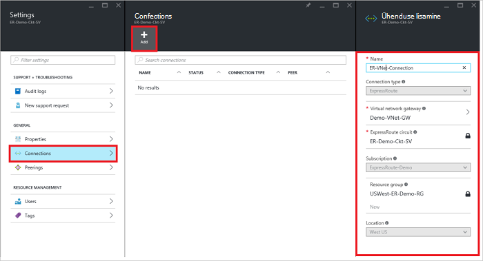
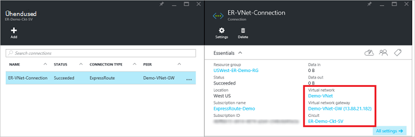

<properties
   pageTitle="Linkimine on ExpressRoute ringi virtuaalse võrgu ressursihaldur juurutamise mudeli ja Azure portaali abil | Microsoft Azure'i"
   description="Selles dokumendis antakse ülevaade sellest, kuidas linkida ExpressRoute topoloogia virtuaalne võrkude (VNets)."
   services="expressroute"
   documentationCenter="na"
   authors="cherylmc"
   manager="carmonm"
   editor=""
   tags="azure-resource-manager"/>
<tags
   ms.service="expressroute"
   ms.devlang="na"
   ms.topic="article"
   ms.tgt_pltfrm="na"
   ms.workload="infrastructure-services"
   ms.date="10/10/2016"
   ms.author="cherylmc" />

# Mõne ExpressRoute ringi virtuaalse võrgu linkimine

> [AZURE.SELECTOR]
- [Azure'i portaal - ressursihaldur](expressroute-howto-linkvnet-portal-resource-manager.md)
- [PowerShelli - ressursihaldur](expressroute-howto-linkvnet-arm.md)
- [PowerShelli – klassikaline](expressroute-howto-linkvnet-classic.md)

See artikkel aitab teil virtuaalne võrkude (VNets) link Azure'i ExpressRoute topoloogia ressursihaldur juurutamise mudeli ja Azure portaali abil. Virtuaalne võrkude võib olla sama tellimuse või need võivad olla osa teise tellimus.

**Azure'i juurutamise mudelite kohta**

[AZURE.INCLUDE [vpn-gateway-clasic-rm](../../includes/vpn-gateway-classic-rm-include.md)]

## Konfiguratsiooni eeltingimused

- Veenduge, et teil vaadata [eeltingimused](expressroute-prerequisites.md), [marsruutimine nõuded](expressroute-routing.md)ja [töövoogude](expressroute-workflows.md) enne alustamist konfigureerimine.
- Peab teil on aktiivne ExpressRoute ringi.
    - Järgige juhiseid, et [luua mõne ExpressRoute ringi](expressroute-howto-circuit-arm.md) ja on lubatud ühenduvuse pakkuja ringi.

    - Veenduge, et on Azure privaatne silmitsemine oma ringi jaoks konfigureeritud. Artiklist [konfigureerimine marsruutimine](expressroute-howto-routing-portal-resource-manager.md) marsruutimise juhised.

    - Veenduge, et Azure'i privaatne silmitsemine on konfigureeritud ja BGP silmitsemine vahel oma võrgu ja Microsoft on üles, nii et saate lubada lõpuni Ühenduvus.

    - Veenduge, et teil on virtuaalse võrgu ja virtuaalse võrgu lüüsi loodud ja täielikult ette valmistatud. Järgige juhiseid, et luua [VPN-lüüsi](../articles/vpn-gateway/vpn-gateway-howto-site-to-site-resource-manager-portal.md) (järgida ainult juhiseid 1 – 5).

Kuni 10 virtuaalse võrgu saate linkida standard ExpressRoute ringi. Kõik virtuaalne võrkude peab olema geopoliitiliste piirkonna standard ExpressRoute ringi kasutamisel. Link virtuaalne võrkude väljaspool ExpressRoute topoloogia geopoliitiline piirkond või suurema hulga virtuaalne võrkude ühendamine oma ExpressRoute ringi kui märkisite ExpressRoute premium lisandmoodul. Märkige ruut [FAQ](expressroute-faqs.md) premium lisandmooduli kohta lisateabe saamiseks.

## Ühenduse loomine virtuaalse võrgu sama tellimuse soovitud ringi

### Ühenduse loomiseks

1. Veenduge, et ExpressRoute ringi ja Azure privaatne silmitsemine on konfigureeritud edukalt. Järgige [soovitud ringi ExpressRoute loomine](expressroute-howto-circuit-arm.md) ja [konfigureerimine marsruutimist](expressroute-howto-routing-arm.md). Oma ExpressRoute ringi peaks välja nägema järgmine pilt.

    

    >[AZURE.NOTE] BGP konfiguratsiooniteavet ei kuvata kui layer 3 pakkuja konfigureerida oma peerings. Kui teie ringi on ettevalmistatud olekus, peaks oskama ühenduste loomine.

2. Nüüd saate alustada ettevalmistamise ühenduse oma virtuaalse võrgu lüüsi oma ExpressRoute ringi link. Klõpsake **ühenduse** > **Lisa** avamine **ühenduse lisamine** tera ja konfigureerimist väärtused. Vt järgmist näidet viide.

      

3. Pärast teie ühendus on nüüd konfigureeritud, kuvatakse teie ühendus objekti ühenduse teave.

    

### Ühenduse kustutamine

Ühenduse saate kustutada enne oma ühenduse ikooni **Kustuta** .

## Ühenduse lisamine ringi virtuaalse võrgu eri tellimus

Sel ajal, ei saa ühendust virtuaalse võrgu tellimustes Azure portaali kaudu. Siiski saate PowerShelli toiming. Lisateavet artiklist [PowerShelli](expressroute-howto-linkvnet-arm.md) .

## Järgmised sammud

ExpressRoute kohta leiate lisateavet teemast [ExpressRoute KKK](expressroute-faqs.md).
