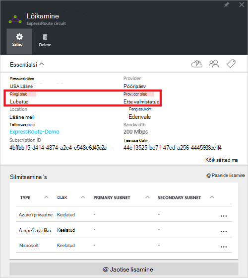
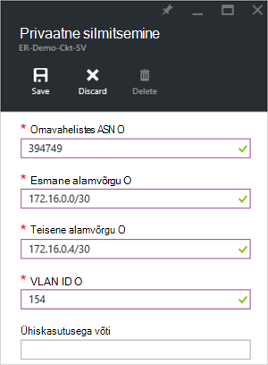
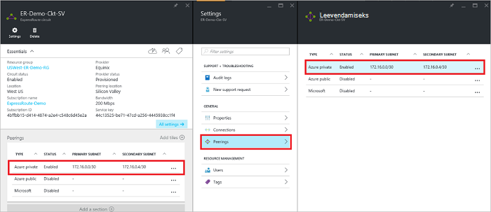
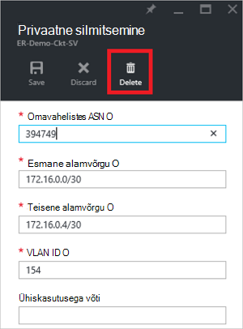
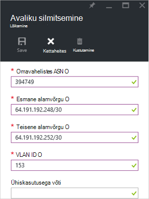
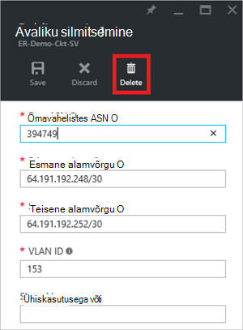
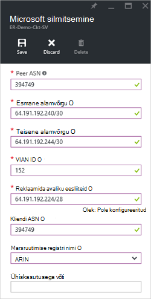
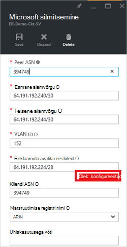
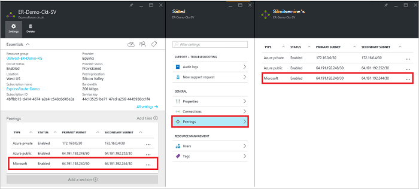
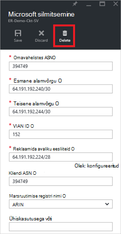

<properties
   pageTitle="Kuidas konfigureerida marsruudi ExpressRoute ringi, mis Azure'i portaalis | Microsoft Azure'i"
   description="Selles artiklis tutvustatakse loomise ja privaatne, avalik ja Microsoft silmitsemine ExpressRoute topoloogia ettevalmistamise juhiseid. Selles artiklis samuti näitab, kuidas oleku, värskendada ja kustutada teie ringi jaoks peerings."
   documentationCenter="na"
   services="expressroute"
   authors="cherylmc"
   manager="carmonm"
   editor=""
   tags="azure-resource-manager"/>
<tags
   ms.service="expressroute"
   ms.devlang="na"
   ms.topic="hero-article" 
   ms.tgt_pltfrm="na"
   ms.workload="infrastructure-services"
   ms.date="10/10/2016"
   ms.author="cherylmc"/>

# Luua ja muuta mõne ExpressRoute ringi marsruutimine

> [AZURE.SELECTOR]
[Azure'i portaal - ressursihaldur](expressroute-howto-routing-portal-resource-manager.md)
[PowerShelli - ressursihaldur](expressroute-howto-routing-arm.md)
[PowerShelli – klassikaline](expressroute-howto-routing-classic.md)

Selles artiklis tutvustatakse luua ja hallata marsruutimine konfigureerimine ExpressRoute ringi, mis Azure portaali ja ressursihaldur juurutamise mudeli kasutamise juhiseid.

**Azure'i juurutamise mudelite kohta**

[AZURE.INCLUDE [vpn-gateway-clasic-rm](../../includes/vpn-gateway-classic-rm-include.md)] 

## Konfiguratsiooni eeltingimused

- Veenduge, et teil vaadata lehe [eeltingimused](expressroute-prerequisites.md) , lehe [marsruutimine nõuded](expressroute-routing.md) ja [töövoogude](expressroute-workflows.md) lehelt enne alustamist konfigureerimine.
- Peab teil on aktiivne ExpressRoute ringi. Järgige loomine [ExpressRoute soovitud ringi](expressroute-howto-circuit-arm.md) ja on lubatud ühenduvuse pakkuja enne jätkamist ringi. Ringi ExpressRoute peab olema ettevalmistatud ja lubatud olekus, et teil oleks võimalik allpool kirjeldatud käitamine.

Need juhised kehtivad ainult elektriskeemide loodud pakub kiht 2 connectivity services teenusepakkujatele. Kui kasutate teenuse pakkuja hallatavad Layer 3 teenuseid (tavaliselt on IPVPN, nt MPLS), pakkuja Ühenduvus konfigureerimine ja haldamine saate marsruutimist. 

>[AZURE.IMPORTANT] Me praegu reklaamida peerings konfigureeritud teenusepakkujatele teenuse haldusportaali kaudu. Me tegeleme selle võimalus kiiresti lubamine. Kontrollige oma teenusepakkujalt enne BGP peerings konfigureerimine.

Saate konfigureerida ühest, kahest või kõigi kolme peerings (Azure'i privaatne, Azure avalik ja Microsofti) jaoks mõne ExpressRoute ringi. Saate konfigureerida peerings valite järjekorras. Siiski saate peab veenduge, et, et iga silmitsemine ühe korraga konfiguratsiooni. 

## Azure'i privaatne silmitsemine

Selles jaotises antakse juhiseid kohta, kuidas luua, saada, värskendada ja kustutada mõne ExpressRoute ringi Azure privaatne silmitsemine konfigureerimine. 

### Azure'i privaatne silmitsemine loomiseks

1. Konfigureerige ExpressRoute ringi. Veenduge, et ringi on täielikult ettevalmistatud ühenduvuse pakkuja enne jätkamist.

    

2. Konfigureerida Azure privaatne silmitsemine ringi. Veenduge, et enne jätkamist järgmiste juhiste abil, et teil on järgmised üksused:

    - Mõne /30 alamvõrgu esmane lingi. See ei tohi olla mis tahes aadressiruumi jaoks virtuaalse võrgu osa.
    - Mõne /30 alamvõrgu teisene lingi. See ei tohi olla mis tahes aadressiruumi jaoks virtuaalse võrgu osa.
    - Lubatud VLAN ID luua silmitsemine kohta. Veenduge, et ei ole muud silmitsemine sisse ringi kasutab sama VLAN ID.
    - Kui arvu silmitsemine. Saate kasutada nii 2-baidine ja 4-baidine ARVUDENA. Saate kasutada privaatse jaoks selle silmitsemine arvuna. Veenduge, et te ei kasuta 65515.
    - Mõne MD5 räsi kui kasutate ühte. **See pole kohustuslik**.

3. Valige privaatne Azure'i silmitsemine rida, nagu allpool näidatud.
    
    
    

4. Konfigureerige privaatne silmitsemine. Alloleval pildil on näide konfigureerimine.

    

    
5. Salvestage konfiguratsiooni, kui olete määranud kõik parameetrid. Pärast konfiguratsiooni vastuvõtmist edukalt, kuvatakse midagi sarnast järgmises näites.

    
    

### Azure'i privaatne silmitsemine üksikasjade vaatamiseks

Azure'i privaatne silmitsemine, valides soovitud silmitsemine atribuutide vaatamine

### Azure'i privaatne silmitsemine konfiguratsiooni värskendamine

Saate valida silmitsemine rida ja muutke silmitsemine atribuute. 

### Azure'i privaatne silmitsemine kustutamine

Saate eemaldada silmitsemine konfiguratsioonist, valides ikooni Kustuta nagu allpool näidatud.

## Azure'i avaliku silmitsemine

Selles jaotises antakse juhiseid kohta, kuidas luua, saada, värskendada ja kustutada mõne ExpressRoute ringi Azure avaliku silmitsemine konfigureerimine. 

### Azure'i avaliku silmitsemine loomiseks

1. Konfigureerige ExpressRoute ringi. Veenduge, et ringi on täielikult ettevalmistatud ühenduvuse pakkuja enne jätkamist edasi.

    

2. Konfigureerida Azure avaliku silmitsemine ringi. Veenduge, et enne jätkamist järgmiste juhiste abil, et teil on järgmised üksused:

    - Mõne /30 alamvõrgu esmane lingi. 
    - Mõne /30 alamvõrgu teisene lingi. 
    - Kõik IP-aadressid selles silmitsemine seadistamiseks kasutatud peab olema lubatud avaliku IPv4 aadressid.
    - Lubatud VLAN ID luua silmitsemine kohta. Veenduge, et ei ole muud silmitsemine sisse ringi kasutab sama VLAN ID.
    - Kui arvu silmitsemine. Saate kasutada nii 2-baidine ja 4-baidine ARVUDENA.
    - Mõne MD5 räsi kui kasutate ühte. **See pole kohustuslik**.

3. Valige Azure avaliku silmitsemine rida, nagu allpool näidatud.
    
    
    

4. Konfigureerige avaliku silmitsemine. Alloleval pildil on näide konfigureerimine.

    

    
5. Salvestage konfiguratsiooni, kui olete määranud kõik parameetrid. Pärast konfiguratsiooni vastuvõtmist edukalt, kuvatakse midagi sarnast järgmises näites.

    
    

### Azure'i avaliku silmitsemine üksikasjade vaatamiseks

Azure'i avaliku silmitsemine, valides soovitud silmitsemine atribuutide vaatamine

### Azure'i avaliku silmitsemine konfiguratsiooni värskendamine

Saate valida silmitsemine rida ja muutke silmitsemine atribuute. 

### Azure'i avaliku silmitsemine kustutamine

Saate eemaldada silmitsemine konfiguratsioonist, valides ikooni Kustuta nagu allpool näidatud.

## Microsoft silmitsemine

Selles jaotises antakse juhiseid, kuidas luua, saada, värskendada ja kustutada Microsoft silmitsemine konfigureerimine on ExpressRoute ringi. 

### Microsoft silmitsemine loomiseks

1. Konfigureerige ExpressRoute ringi. Veenduge, et ringi on täielikult ettevalmistatud ühenduvuse pakkuja enne jätkamist edasi.

    

2. Microsoft silmitsemine ringi jaoks konfigureerida. Veenduge, et enne jätkamist, et teil on järgmine teave.

    - Mõne /30 alamvõrgu esmane lingi. See peab olema lubatud avaliku IPv4 eesliite kuuluv ja registreeritud mõne RIR / IRR.
    - Mõne /30 alamvõrgu teisene lingi. See peab olema lubatud avaliku IPv4 eesliite kuuluv ja registreeritud mõne RIR / IRR.
    - Lubatud VLAN ID luua silmitsemine kohta. Veenduge, et ei ole muud silmitsemine sisse ringi kasutab sama VLAN ID.
    - Kui arvu silmitsemine. Saate kasutada nii 2-baidine ja 4-baidine ARVUDENA.
    - **Reklaamida eesliiteid:** Peate esitama plaanite reklaamida BGP seansi üle kõik eesliiteid loendit. Ainult avaliku IP address eesliiteid aktsepteeritakse. Kui kavatsete saata eesliiteid kogumi, saate saata komaga eraldatud loend. Nende eesliidete tähised tuleb registreerida teile mõne RIR / IRR.
    - **Kliendi ASN:** Kui olete reklaami eesliidete tähised, mis pole registreeritud silmitsemine arvuna, saate määrata AS numbri, mis on registreeritud. **See pole kohustuslik**.
    - **Marsruutimise registri nimi:** Saate määrata selle RIR / IRR suhtes, mis seda arvu ja eesliidete tähised on juba registreeritud. **See pole kohustuslik.**
    - Mõne MD5 räsi, kui kasutate ühte. **See pole kohustuslik.**
    
3. Saate valida silmitsemine seadistada, nagu allpool näidatud. Valige Microsoft silmitsemine rida.
    
    
    

4.  Konfigureerige Microsoft silmitsemine. Alloleval pildil on näide konfigureerimine.

    

    
5. Salvestage konfiguratsiooni, kui olete määranud kõik parameetrid. 

    Kui teie ringi saab valideerimise vaja state (nagu allpool näidatud), avate tugi Piletite kuuluvust eesliiteid meie tugimeeskonnale kuvamiseks.  
    
    

    Saate avada tugi Piletite otse portaalis, nagu allpool näidatud   
    
    

6. Pärast konfiguratsiooni vastuvõtmist edukalt, kuvatakse midagi sarnast järgmises näites.

    
    

### Kui soovite Microsoft silmitsemine üksikasjade kuvamine

Azure'i avaliku silmitsemine, valides soovitud silmitsemine atribuutide vaatamine

### Värskendada Microsoft silmitsemine konfigureerimine

Saate valida silmitsemine rida ja muutke silmitsemine atribuute. 

### Microsoft silmitsemine kustutamine

Saate eemaldada silmitsemine konfiguratsioonist, valides ikooni Kustuta nagu allpool näidatud.

## Järgmised sammud

Järgmise juhise juurde: [lingi lisamine VNet, et mõne ExpressRoute ringi](expressroute-howto-linkvnet-arm.md).

-  ExpressRoute töövoogude kohta leiate lisateavet teemast [ExpressRoute töövood](expressroute-workflows.md).

-  Ringi silmitsemine kohta leiate lisateavet teemast [ExpressRoute ahelatega ja marsruutimise domeenid](expressroute-circuit-peerings.md).

-  Virtuaalne võrkude töötamise kohta leiate lisateavet teemast [Virtual võrgu ülevaade](../virtual-network/virtual-networks-overview.md).

