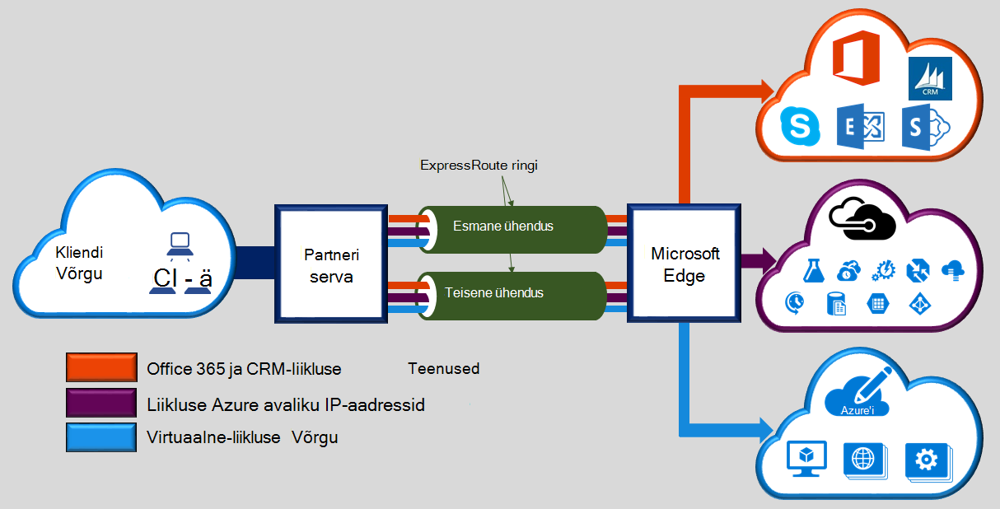
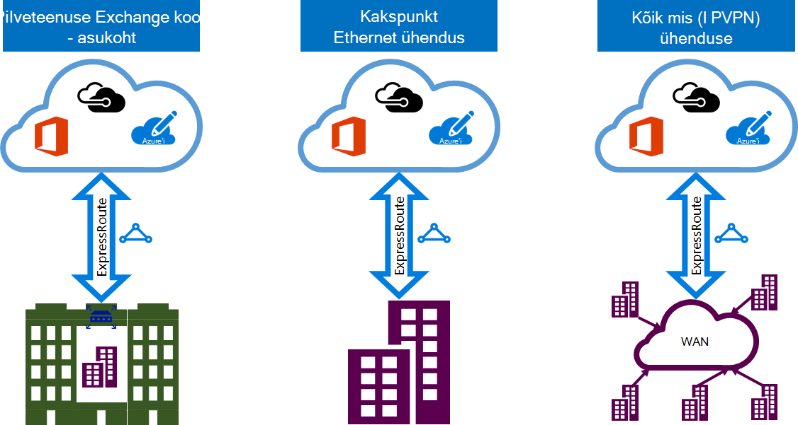

<properties 
   pageTitle="Sissejuhatus ExpressRoute | Microsoft Azure'i"
   description="Sellel lehel antakse ülevaade ExpressRoute teenuse, sh mõne ExpressRoute ühenduse tööpõhimõte."
   documentationCenter="na"
   services="expressroute"
   authors="cherylmc"
   manager="carmonm"
   editor=""/>
<tags 
   ms.service="expressroute"
   ms.devlang="na"
   ms.topic="get-started-article" 
   ms.tgt_pltfrm="na"
   ms.workload="infrastructure-services" 
   ms.date="10/10/2016"
   ms.author="cherylmc"/>

# ExpressRoute tehniline ülevaade

Microsoft Azure'i ExpressRoute võimaldab laiendada oma kohapealse võrgu Microsofti pilveteenuse hõlbustav ühenduvuse pakkuja sihtotstarbeline privaatne ühenduse kaudu. ExpressRoute, kus saate luua ühenduse Microsofti pilveteenustega, nt Microsoft Azure'i, Office 365 ja CRM Online'i. Ühenduvus võib olla ka kõik mis (IP VPN) võrgu, kakspunkt Ethernet võrgus või virtuaalse rist-ühenduse kaudu ühenduvus pakkuja saanud poole. Avaliku Interneti kaudu ei lähe ExpressRoute ühendused. See võimaldab ExpressRoute ühendused pakkuda töökindlust, kiirem kiirust, lower latentsused ja suurem turvalisus, kui tüüpilised ühendused Interneti kaudu.

**Peamised eelised on järgmised.**

- Layer 3 Ühenduvus kohapealse võrgu ja Microsoft Cloud ühenduvuse pakkuja kaudu. Ühenduvus võib olla kõik mis (IPVPN) kaudu, kakspunkt Ethernet ühendus, või virtuaalse rist-ühenduse kaudu Ethernet vahetamise kaudu.
- Microsofti pilveteenustega kõigis piirkondades geopoliitiliste piirkonnas Ühenduvus.
- Globaalne ühenduvust serveritega Microsoft services kõigis piirkondades ExpressRoute premium lisandmooduli abil.
- Dünaamiline marsruutimine oma võrgu ja Microsofti vahel valdkonna standard-protokolli (BGP).
- Sisseehitatud komponentide suurema usaldusväärsuse silmitsemine asukohas.
- Ühenduse sees [SLA](https://azure.microsoft.com/support/legal/sla/).
- QoS ja mitme tunnid teenuse eri rakendustes, nt Skype'i ärirakenduse tugi.

Vt lisateavet [ExpressRoute KKK](expressroute-faqs.md) .

## Kuidas ühendada minu võrgu kaudu ExpressRoute Microsoft?

Saate luua ühenduse kohapealse võrgu ja Microsofti pilveteenuse vahel kolm võimalust:

### Pilveteenuse Exchange'i koostööd asub

Kui asute koostööd asutuses koos pilvepõhise Exchange'i, saate tellida virtuaalse rist-ühenduste Microsofti pilveteenuse kaasautorluse kohta pakkuja Ethernet Exchange'i kaudu. Kaasautorluse kohta saate pakuvad kiht 2 rist-ühendused või hallatavate Layer 3 rist-ühendused oma taristu saanud poole ja Microsofti pilveteenuse vahel.

### Kakspunkt Ethernet ühendused 

Saate luua ühenduse oma kohapealse andmekeskuste/büroode Microsofti pilveteenuse kakspunkt Ethernet linkide kaudu. Kakspunkt Ethernet pakkujate pakkuda kiht 2 ühendused või hallatavate Layer 3 ühendused saidile ja Microsofti pilveteenuse vahel.

### Kõik mis (IPVPN) võrgud

Microsofti pilveteenuse saate oma WAN integreerida. IPVPN (tavaliselt MPLS VPN) pakuvad kõik mis Ühenduvus teie harukontorite ja andmekeskuste. Microsofti pilveteenuse võivad olla omavahel seotud oma WAN teha see välja nii nagu mis tahes muud kontoris. WAN tavaliselt pakuvad hallatavate Layer 3 Ühenduvus. Kõigis ülaltoodud ühenduvuse mudelite on kõik identsed ExpressRoute võimaluste ja funktsioonid. 

Ühe või mitme ühenduvuse mudelite pakkuda ühenduvus pakkujad. Saate töötada ühenduvuse pakkuja valida mudelit, mis töötab teie jaoks kõige paremini.

## ExpressRoute funktsioonid

ExpressRoute toetab järgmisi funktsioone ja võimalusi. 

### Layer 3 Ühenduvus

Microsoft kasutab valdkonna standardse dünaamilise marsruutimise protokolli (BGP) Exchange, mis marsruudib avaliku aadressid kohapealse võrgu Azure'i eksemplaride ja Microsofti vahel.  Me seansside mitme BGP võrguga erinevate liikluse profiilid. Rohkem üksikasju leiate artikli [ExpressRoute ringi ja marsruutimine domeenid](expressroute-circuit-peerings.md) .

### Koondamine

Iga ExpressRoute ringi koosneb kahest ühendused serva marsruuterist Microsoft Enterprise (MSEEs) connectivity pakkuja / teie võrgu serva. Microsoft nõuab kahekordne BGP ühenduse Ühenduvus pakkuja / oma küljel – seda iga MSEE. Võite ei juurutamine liigsed seadmed / Ethernet vooluringide oma otsas. Siiski ühenduvuse pakkujate abil liigsete seadmed tagada, et teie ühendused antakse välja Microsofti liigsete viisil. Liigsete Layer 3 ühenduvuse konfigureerimine on meie [SLA](https://azure.microsoft.com/support/legal/sla/) kehtib nõue. 

### Microsofti pilveteenustega Ühenduvus

[AZURE.INCLUDE [expressroute-office365-include](../../includes/expressroute-office365-include.md)]

ExpressRoute ühendused järgmisi teenuseid juurdepääsu lubamiseks tehke järgmist.

- Microsoft Azure'i teenused
- Microsoft Office 365 teenused
- Microsoft Online'i teenuseid 
 
Te saate lehelt [ExpressRoute KKK](expressroute-faqs.md) jaoks toetatud üle ExpressRoute teenuste üksikasjalik loend.

### Kõigi piirkondade geopoliitilist piirkonnas Ühenduvus

Saate ühenduse loomine Microsoft meie [silmitsemine asukohad](expressroute-locations.md) ja kõigi piirkondade geopoliitilist piirkonnas on juurdepääs. 

Näiteks kui ühendatud Microsoft Amsterdamis ExpressRoute kaudu, on teil juurdepääs kogu Microsofti pilveteenustega ja Lääne-Euroopa majutatud. Vaadake [ExpressRoute partnerid ja silmitsemine asukohad](expressroute-locations.md) artikkel ülevaate geopoliitiliste regioonid, seotud Microsofti pilveteenuste piirkondade ja vastavate ExpressRoute silmitsemine asukohad.

### Globaalne Ühenduvus ExpressRoute premium lisandmoodul

Saate lubada ExpressRoute premium lisandmooduli funktsiooni laienevad geopoliitiliste piirmäärad Ühenduvus. Näiteks kui olete loonud ühenduse Microsoft Amsterdamis ExpressRoute kaudu, on teil juurdepääs kogu Microsofti pilveteenustega majutatud kõikides piirkondades kogu maailmas (liikmesriikide pilved on välistatud). Pääsete ühtemoodi, pääsete Põhja- ja Lääne Euroopa piirkondade Lõuna-Ameerika või Austraalia juurutatud teenused.

### RTF-vormingus ühenduvuse partnerite ökosüsteem

ExpressRoute on pidevalt kasvab ökosüsteemi ühenduvuse teenusepakkuja ja SI partnerite. Viidata saate uusima teabe artikli [ExpressRoute pakkujate ja asukohtade kuvamiseks](expressroute-locations.md) .

### Riigi pilved Ühenduvus

Microsoft töötab teisiti geopoliitiliste piirkondade ja kujundatud isoleeritakse cloud keskkonnas. Vaadake [ExpressRoute pakkujate ja asukohtade](expressroute-locations.md) lehel liikmesriikide pilved ja pakkujate loendit.

### Toetatud läbilaskevõime suvandid

Saate osta ExpressRoute topoloogia jaoks mitmesuguseid andmemahud. Toetatud andmemahud loendis on loetletud allpool. Kindlasti märkige loendi toetatud andmemahud annavad määratlemiseks ühenduvuse teenusepakkuja juures.

- 50 Mbps
- 100 Mbps
- 200 Mbps
- 500 Mbps
- 1 Gbit
- 2 Gbit
- 5 Gbit
- 10 Gbit

### Dünaamiliste skaleerimist läbilaskevõime

Teil on võimalus suurendada ExpressRoute ringi läbilaskevõime (põhimõttel parim peegeldav) ilma ühendusi kiskuma. 

### Paindlik arvelduse mudelite

Saate valida arvelduse mudelit, mis töötab teie jaoks kõige paremini. Valige alltoodud arvelduse mudelite vahel. Vaadake lisateavet [ExpressRoute KKK](expressroute-faqs.md) lehele. 

- **Piiramatu andmete**. Ringi ExpressRoute peab tasuma kuutasu ja sissetulevate ja väljaminevate andmeedastus on tasuta. 
- **Mahupõhised andmed**. Ringi ExpressRoute peab tasuma kuutasu. Sissetuleva andmeedastus on tasuta. Väljamineva andmeedastus on lisandu GB andmeedastuse kohta. Andmete piirkonniti.
- **ExpressRoute premium lisandmoodul**. ExpressRoute premium on lisandmooduli üle ExpressRoute ringi. Lisandmooduli ExpressRoute premium pakub järgmisi võimalusi. 
    - Azure'i avaliku ja Azure privaatne silmitsemine 4000 protsessidest 10 000 marsruudib suurema marsruutimiseks piirangud.
    - Globaalse ühenduvuse teenuste jaoks. ExpressRoute ringi, mis loodud mis tahes piirkonnas (välja arvatud liikmesriikide pilved) on kogu maailmas mis tahes muud piirkonnas ressurssidele. Näiteks pääseb Lääne Euroopa loodud virtuaalse võrk on ExpressRoute ringi ette valmistatud Edenvale sisse.
    - Suurem arv VNet linkide kohta ExpressRoute ringi 10 suuremat piiramiseks olenevalt ringi ribalaiust.

## Järgmised sammud

- Teavet ExpressRoute ühendused ja marsruutimise domeenid. Vt [ExpressRoute ahelatega ja marsruutimise domeenid](expressroute-circuit-peerings.md).
- Leidke teenusepakkuja. Vt [ExpressRoute partnerid ja silmitsemine asukohad](expressroute-locations.md).
- Veenduge, et kõik eeltingimused on täidetud. Vt [ExpressRoute eeltingimused](expressroute-prerequisites.md).
- Vaadake [marsruutimine](expressroute-routing.md), [NAT](expressroute-nat.md) ja [QoS](expressroute-qos.md)nõuded.
- Konfigureerige ExpressRoute ühendust.
    - [Mõne ExpressRoute ringi loomine](expressroute-howto-circuit-classic.md)
    - [Marsruutimine konfigureerimine](expressroute-howto-routing-classic.md)
    - [Link on VNet mõne ExpressRoute ringi](expressroute-howto-linkvnet-classic.md)
