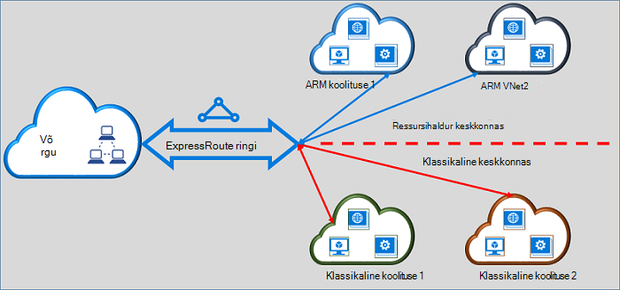

<properties
   pageTitle="Liigub ExpressRoute topoloogia klassikalises ressursside halduri | Microsoft Azure'i"
   description="Selle lehe antakse ülevaade sellest, mida on vaja teada teisendamine klassikaline ja ressursihaldur juurutamise mudelite."
   documentationCenter="na"
   services="expressroute"
   authors="ganesr"
   manager="carmonm"
   editor=""/>
<tags
   ms.service="expressroute"
   ms.devlang="na"
   ms.topic="get-started-article"
   ms.tgt_pltfrm="na"
   ms.workload="infrastructure-services"
   ms.date="10/10/2016"
   ms.author="ganesr"/>

# Klassikaline ExpressRoute topoloogia teisaldamine ressursihaldur juurutamise mudeli

Selles artiklis antakse ülevaade sellest, mida tähendab klassikaline on Azure ExpressRoute ringi teisaldamiseks Azure'i ressursihaldur juurutamise mudeli.

[AZURE.INCLUDE [vpn-gateway-sm-rm](../../includes/vpn-gateway-classic-rm-include.md)]

Saate ühe ExpressRoute ringi ühenduse virtuaalse võrgu nii klassikaline ja ressursihaldur juurutamise mudelite juurutatud. ExpressRoute ringi, olenemata sellest, kuidas on loodud, saate nüüd virtuaalne võrkude üle mõlema juurutamise mudeli linkida.

## Klassikaline juurutamise mudeli loodud ExpressRoute topoloogia

Klassikaline juurutamise mudeli loodud ExpressRoute topoloogia on vaja teisaldada ressursihaldur juurutamise mudeli esmalt lubama ühenduse nii klassikaline ja ressursihaldur juurutamise mudelite. Pole Ühenduvus kaotsimineku või häirete ühenduse liikumisel. Säilitatakse kõik ringi-virtuaalse võrgu lingid klassikaline juurutamise mudeli (jooksul sama tellimuse ja rist-tellimuse).

Pärast teisaldamist on lõpule viidud, ExpressRoute ringi näeb välja, teeb ja tundub täpselt ExpressRoute ringi, ressursihaldur juurutamise mudeli loodud. Nüüd saate luua ühendusi virtuaalne võrkude ressursihaldur juurutamise mudeli.

Pärast soovitud ExpressRoute ringi on teisaldatud ressursihaldur juurutamise mudeli, ainult ressursihaldur juurutamise mudeli abil saate hallata elutsükli ExpressRoute topoloogia. See tähendab, et saate toiminguid teha peerings värskendamine, lisamine ja kustutamine, nt värskendamine ringi atribuutide (nt läbilaskevõime, SKU ja arveldamine tüüp) ja elektriskeemide ainult mudelis ressursihaldur juurutamise kustutamine. Vt jaotist allpool kohta täpsemat teavet, kuidas saate hallata nii juurutamise mudelite juurdepääsu mudelis ressursihaldur juurutamise loodud topoloogia.

Teil pole kaasata pakkuja ühenduvuse teisaldamist sooritamiseks.

## Ressursihaldur juurutamise mudeli loodud ExpressRoute topoloogia

Saate lubada ExpressRoute topoloogia ressursihaldur juurutamise mudeli kättesaadavaks nii juurutamise mudelite põhjal loodud. Mis tahes ExpressRoute ringi teie tellimus saab lubada juurde nii juurutamise mudelite põhjal.

- Ressursihaldur juurutamise mudeli loodud ExpressRoute topoloogia ei saa kasutada klassikaline juurutamise mudeli vaikimisi.
- ExpressRoute elektriskeemide teisaldatud klassikaline juurutamise mudel ressursi halduri juurutamise mudeli pääseb juurde nii juurutamise mudelite vaikimisi.
- Mõne ExpressRoute ringi on alati juurdepääs ressursihaldur juurutamise mudeli sõltumata sellest, kas see on loodud rakenduses ressursihaldur või klassikaline juurutamise mudel. See tähendab, et saate luua virtuaalse võrgu ressursihaldur juurutamise mudeli kohta, [Kuidas link virtuaalne võrkude](expressroute-howto-linkvnet-arm.md)juhiste järgi loodud ühendused.
- Klassikaline juurutamise mudeli juurdepääsu kontrollib ExpressRoute ringi **allowClassicOperations** parameeter.

>[AZURE.IMPORTANT] Kõik piirmäära, mis on avaldatud lehel [teenuse piirangud](../azure-subscription-service-limits.md) kehtivad. Näiteks standard ringi võib olla kuni 10 virtuaalse lingid/võrguühenduste klassikaline nii ressursihaldur juurutamise mudelite üle.

## Juurdepääsu klassikaline juurutamise mudeli kontrollimine

Saate lubada ühe ExpressRoute ringi **allowClassicOperations** parameetri ExpressRoute topoloogia virtuaalne võrkude mõlema juurutamise mudeli linkida.

Säte **allowClassicOperations** TRUE võimaldab link virtuaalse võrkude ExpressRoute ringi nii juurutamise mudelite põhjal. Saate linkida virtuaalne võrkude klassikaline juurutamise mudeli jälgimise juhised, [Kuidas link virtuaalne võrkude klassikaline juurutamise mudeli](expressroute-howto-linkvnet-classic.md)järgi. Saate linkida virtuaalne võrkude ressursihaldur juurutamise mudeli jälgimise juhised, [Kuidas link virtuaalne võrkude ressursihaldur juurutamise mudeli](expressroute-howto-linkvnet-arm.md)järgi.

Seadmine **allowClassicOperations** FALSE blokeerib juurdepääsu ringi klassikaline juurutamise mudel. Klassikaline juurutamise mudeli kõik virtuaalse võrgu lingid jäävad alles. Sel juhul pole nähtav, klassikaline juurutamise mudeli ExpressRoute ringi.

## Klassikaline juurutamise mudeli toetatud toimingud

Klassikaline järgmised toimingud on toetatud ka ExpressRoute ringi kui **allowClassicOperations** on seatud väärtusele tõene:

 - ExpressRoute ringi teabe saamine
 - Klassikaline virtuaalse võrgu loomine ja värskendamine/saada/kustutamine virtuaalse võrgu lingid
 - Loomine ja värskendamine/saada/kustutamine virtuaalse network link lubamise rist-tellimuse Ühenduvus

Klassikaline järgmisi toiminguid ei saa teha, kui **allowClassicOperations** on seatud väärtusele tõene:

 - Loomine ja värskendamine/get/Kustuta ääris lüüsi protokolli (BGP) peerings Azure privaatne, Azure avaliku ja Microsoft peerings
 - ExpressRoute elektriskeemide kustutamine

## Klassikaline ja ressursihaldur juurutamise mudelite suhtlemine

Ringi ExpressRoute toimib nagu on seose klassikaline ja ressursihaldur juurutamise mudelite vahel. Liikluse virtual machines virtuaalse võrkudes klassikaline juurutamise mudeli ja virtuaalse võrgu kaudu ExpressRoute, kui mõlemad virtuaalne võrkude on seotud sama ExpressRoute ringi liikumine ressursihaldur juurutamise mudeli vahel.

Aggregate läbilaskevõime on piiratud lüüsi virtuaalse võrgu läbilaskevõime. Liikluse sisestage võrgu Ühenduvus pakkuja või teie võrgu sellisel juhul. Microsoft network täielikult sisaldub liiklust virtuaalse võrgu vahel.

## Juurdepääs Azure'i avalik ja Microsoft silmitsemine ressursid

Saate jätkata ressursse, mis on tavaliselt kättesaadav Azure avaliku silmitsemine ja Microsoft silmitsemine ilma häireid juurde.  

## Mis on toetatud

Selles jaotises kirjeldatakse, mis ei toeta ExpressRoute topoloogia.

 - Saate ühe ExpressRoute ringi juurde pääseda virtuaalne võrkude klassikaline ja ressursihaldur juurutamise mudelite juurutatud.
 - Saate teisaldada mõnda ExpressRoute ringi klassikaline ressursihaldur juurutamise mudel. Pärast teisaldamist, ExpressRoute ringi välja, tunneb ja täidab nagu mis tahes ExpressRoute ringi, mis on loodud ressursihaldur juurutamise mudeli.
 - Ainult ExpressRoute ringi liikumine – See toiming ei saa teisaldada ringi lingid, virtuaalne võrkude ja VPN lüüsid.
 - Pärast soovitud ExpressRoute ringi on teisaldatud ressursihaldur juurutamise mudeli, ainult ressursihaldur juurutamise mudeli abil saate hallata elutsükli ExpressRoute topoloogia. See tähendab, et saate toiminguid teha peerings värskendamine, lisamine ja kustutamine, nt värskendamine ringi atribuutide (nt läbilaskevõime, SKU ja arveldamine tüüp) ja elektriskeemide ainult mudelis ressursihaldur juurutamise kustutamine.
 - Ringi ExpressRoute toimib nagu on seose klassikaline ja ressursihaldur juurutamise mudelite vahel. Liikluse virtual machines virtuaalse võrkudes klassikaline juurutamise mudeli ja virtuaalse võrgu kaudu ExpressRoute, kui mõlemad virtuaalne võrkude on seotud sama ExpressRoute ringi liikumine ressursihaldur juurutamise mudeli vahel.
 - Rist-tellimuse Ühenduvus on nii klassikaline ja ressursihaldur juurutamise mudelite toetatud.

## Mis on toetatud

Selles jaotises kirjeldatakse, mida ei toetata ExpressRoute topoloogia.

 - Liigub ringi linke, lüüside ja virtuaalne võrkude klassikaline ressursihaldur juurutamise mudel.
 - Haldamise elutsükli ExpressRoute topoloogia klassikaline juurutamise mudel.
 - Rollipõhine juurdepääsu juhtimine (RBAC) toe klassikaline juurutamise mudel. Ei saa teha RBAC juhtelementide lisamine ringi, klassikaline juurutamise mudeli. Tellimuse coadministrator mis tahes administraator saab link või linkimise virtuaalse võrkude ringi.

## Konfigureerimine

Järgige juhiseid, mis on kirjeldatud [teisaldamine mõnda ExpressRoute ringi klassikaline ressursihaldur juurutamise mudeli kaudu](expressroute-howto-move-arm.md).

## Järgmised sammud

- Töövoo leiate teemast [ExpressRoute ringi ettevalmistamise ringi olekud ja töövood](expressroute-workflows.md).
- ExpressRoute ühenduse konfigureerimiseks:

    - [Mõne ExpressRoute ringi loomine](expressroute-howto-circuit-arm.md)
    - [Marsruutimine konfigureerimine](expressroute-howto-routing-arm.md)
    - [Mõne ExpressRoute ringi virtuaalse võrgu linkimine](expressroute-howto-linkvnet-arm.md)
