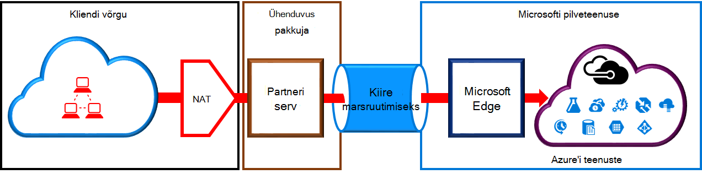
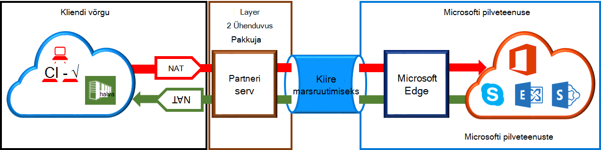

<properties
   pageTitle="NAT nõuded ExpressRoute topoloogia | Microsoft Azure'i"
   description="Sellelt lehelt leiate üksikasjalikke nõudeid, konfigureerimise ja haldamise NAT ExpressRoute topoloogia jaoks."
   documentationCenter="na"
   services="expressroute"
   authors="cherylmc"
   manager="carmonm"
   editor=""/>
<tags
   ms.service="expressroute"
   ms.devlang="na"
   ms.topic="get-started-article"
   ms.tgt_pltfrm="na"
   ms.workload="infrastructure-services"
   ms.date="10/10/2016"
   ms.author="cherylmc"/>

# ExpressRoute NAT nõuded

Kasutades ExpressRoute Microsofti pilveteenustega ühendust luua, peate häälestamine ja haldamine NATs. Mõned ühenduvuse pakuvad häälestamise ja haldamise NAT hallatav teenus. Kontrollige, et näha, kui nad pakuvad teenuse pakkuja Ühenduvus. Kui ei, peate järgima allpool kirjeldatud nõuetele. 

Vaadake üle [ExpressRoute ahelatega ja marsruutimise domeenide](expressroute-circuit-peerings.md) lehe antakse ülevaade eri marsruutimise domeenid. Azure'i avaliku ja Microsoft silmitsemine nõuetele avaliku IP address, soovitame seadistada NAT oma võrgu ja Microsofti vahel. Sellest jaotisest leiate üksikasjaliku kirjelduse NAT taristu, mida soovite häälestada.

## NAT Azure avaliku silmitsemine nõuded

Azure'i avaliku silmitsemine tee võimaldab ühenduse kõigi teenuste majutatud Azure üle oma avaliku IP-aadressid. Nendeks on loetletud [ExpessRoute KKK](expressroute-faqs.md) ja teenuste majutatud tarkvaratarnijad Microsoft Azure. Microsoft Azure'i teenust avaliku silmitsemine Ühenduvus alati algatatud võrgu kaudu Microsoft võrku. Microsoft Azure'i sinna sisse avaliku silmitsemine liikluse peab olema SNATed kehtiv avaliku IPv4 aadressid enne Microsoft network. Joonis pakub kõrgetasemelisi pildi, kuidas NAT võib määrata kuni ülaltoodud nõuetele.

 

### NAT IP pool ja marsruutimiseks reklaamid

Peate tagama liikluse siseneb Azure avaliku silmitsemine tee kehtiv avaliku IPv4 aadress. Microsoft peate saama IPv4 NAT aadress rakenduskausta piirkondlike marsruutimise Interneti registri (RIR) või Internet marsruutimise registri (IRR) omandiõiguse kinnitamiseks. Märge tehakse AS arv on piilus koos ja IP-aadressid, kasutatakse selle NAT. alusel Vaadake [ExpressRoute marsruutimise nõuded](expressroute-routing.md) lehe teavet marsruutimise registrid.
 
Puuduvad NAT IP eesliite, kuni see silmitsemine reklaamida pikkusest piirangud. Peate NAT pool jälgida ja veenduge, et teil on näljane NAT seansside.

>[AZURE.IMPORTANT] NAT IP pool reklaamida Microsoftile ei tuleb reklaamida Interneti-ühendus. See rikub muude Microsofti teenuste Ühenduvus.

## NAT Microsoft silmitsemine nõuded

Microsoft silmitsemine tee saate ühendada Microsofti pilveteenustega, mis pole toetatud Azure avaliku silmitsemine tee kaudu. Teenuste loend sisaldab Office 365 teenuseid, näiteks Exchange Online'i, SharePoint Online, Skype'i ärirakenduse ja CRM Online'i. Microsoft eeldab, et Microsoft silmitsemine toetada kahesuunalise Ühenduvus. Microsofti pilveteenustega sinna liikluse peab olema SNATed kehtiv avaliku IPv4 aadressid enne Microsoft network. Liikluse sinna võrgu kaudu Microsofti pilveteenustega peab olema SNATed enne võrgu. Joonis pakub kõrgetasemelisi pildi, kuidas NAT tuleks häälestamise Microsoft silmitsemine.
 
 

#### Pärinevate sinna Microsoft võrgu liikluse

- Peate tagama liikluse siseneb Microsoft silmitsemine tee kehtiv avaliku IPv4 aadress. Microsoft peate saama valideerimiseks omanik IPv4 NAT aadress pool piirkondlike marsruutimise Interneti registri (RIR) või internet marsruutimise registri (IRR). Märge tehakse AS arv on piilus koos ja IP-aadressid, kasutatakse selle NAT. alusel Vaadake [ExpressRoute marsruutimise nõuded](expressroute-routing.md) lehe teavet marsruutimise registrid.

- Microsoft ei tuleb reklaamida IP-aadresside Azure avaliku silmitsemine häälestamise ja muude ExpressRoute topoloogia BGP seansi kaudu. Puudub – see silmitsemine reklaamida NAT IP eesliite pikkusest piirang.

    >[AZURE.IMPORTANT] NAT IP pool reklaamida Microsoftile ei tuleb reklaamida Interneti-ühendus. See rikub muude Microsofti teenuste Ühenduvus.

#### Pärit Microsoft sinna võrgu liikluse

- Teatud stsenaariumide jaoks on vaja Microsoft algatada Ühenduvus majutada oma võrgustikus teenuse lõpp-punktid. ADFS-i serverites majutatud Teenusekomplektis Office 365 võrgu Ühenduvus oleks tüüpiline näide seda stsenaariumi. Sellisel juhul saate peab sattumist vastav eesliiteid võrgu kaudu Microsoft silmitsemine. 

- Peate SNAT liikluse Microsofti IP-aadressid oma võrgustikus sinna. 

## Järgmised sammud

- Vaadake [marsruutimine](expressroute-routing.md) ja [QoS](expressroute-qos.md)nõuded.
- Töövoo leiate teemast [ExpressRoute ringi ettevalmistamise ringi olekud ja töövood](expressroute-workflows.md).
- Konfigureerige ExpressRoute ühendust.

    - [Mõne ExpressRoute ringi loomine](expressroute-howto-circuit-classic.md)
    - [Marsruutimine konfigureerimine](expressroute-howto-routing-classic.md)
    - [Link on VNet mõne ExpressRoute ringi](expressroute-howto-linkvnet-classic.md)

