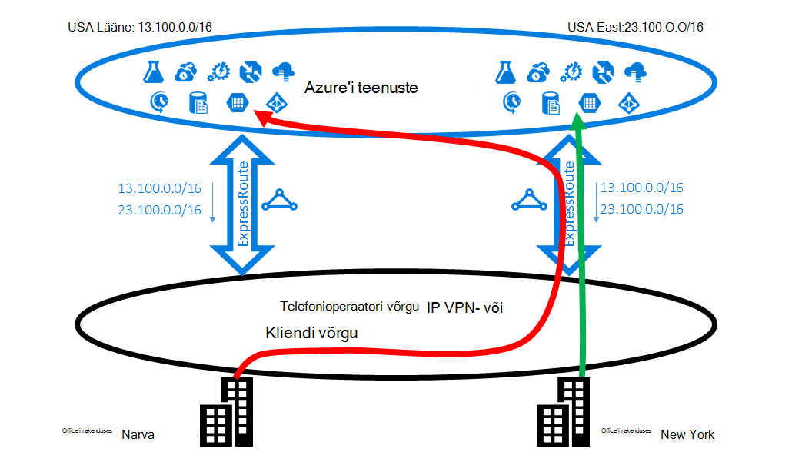

<properties
   pageTitle="Optimeerimine ExpressRoute marsruutimine | Microsoft Azure'i"
   description="Sellelt lehelt leiate üksikasjad, kuidas optimeerida, kui kliendi on rohkem kui üks ExpressRoute topoloogia, mis on Microsofti ja kliendi corp võrgu vahel ühenduse marsruutimise kohta."
   documentationCenter="na"
   services="expressroute"
   authors="charwen"
   manager="carmonm"
   editor=""/>
<tags
   ms.service="expressroute"
   ms.devlang="na"
   ms.topic="get-started-article"
   ms.tgt_pltfrm="na"
   ms.workload="infrastructure-services"
   ms.date="10/10/2016"
   ms.author="charwen"/>

# Optimeerimine ExpressRoute marsruutimine
Kui teil on mitu ExpressRoute elektriskeemide, teil on rohkem kui üks tee ühenduse loomine Microsoft. Seetõttu optimaalsetesse marsruutimine võib juhtuda -, liiklust võib kuluda rohkem tee saavutamiseks Microsoft ja Microsoft oma võrguga. Enam võrguteed, seda suurem latentsus. Latentsus on otsese mõju rakenduse jõudlus ja kasutajale kogemus. Selles artiklis on illustreerida probleemi ja selgitatakse, kuidas optimeerida marsruutimine standard marsruutimise-ja hõlbustusvahendite kasutamine.

## Optimaalsetesse marsruutimise juhul 1
Vaatame lähemalt marsruutimise probleemi näide. Oletage, et teil on kaks kontorit/esindust, USA-s, üks ühe in New York ja Los Angeles. Oma esindused on ühendatud, klõpsake lai ala võrgu (WAN), mis võib olla oma võrgu või teenuse pakkuja IP VPN. Teil on kaks ExpressRoute ahelatega, üks meile Lääne ja teine meile Idas, mis on ühendatud ka WAN. Selge, on teil kaks teed Microsoft võrguga ühenduse loomiseks. Nüüd oletage, et teil on Azure juurutamine (nt Azure'i rakendust Service) meile Lääne nii meile Ida. Teie eesmärk on kasutajate Los Angeles Azure'i meile Lääne ja kasutajate New Yorgi Azure'i meile Ida ühendust luua, kuna teie teenuse administraator reklaamib iga Office'i kasutajad optimaalse kogemusi lähedal Azure teenuseid. Kahjuks leping toimib ka idaranniku kasutajate jaoks, kuid mitte lääneranniku kasutajad. Probleemi põhjuseks on järgmine. Klõpsake iga ExpressRoute ringi, me reklaamida teile nii eesliite Azure'i meile Ida (23.100.0.0/16) ja eesliite Azure'i meile Lääne (13.100.0.0/16). Kui te ei tea, milline eesliide on millised piirkonnast, te ei saa seda kasutatakse erinevalt. WAN võrgu mõelda nii eesliiteid on lähemal kui meile Lääne meile Ida ja seetõttu marsruutida ExpressRoute ringi meile Idas nii office kasutajad. Lõpuks, on teil sellise lahendusega rahul paljud kasutajad Narva Office.

### Lahendus: kasutage BGP ühenduste
Optimeerida marsruutimine nii office kasutajate jaoks, peate teadma, mis eesliide on Azure meile Lääne ja Azure meile Ida. Me kodeerida selle teabe abil [BGP ühenduse väärtused](expressroute-routing.md). Oleme määranud BGP ühenduse kordumatu väärtus iga Azure'i alale, nt meile Ida "12076:51004", "12076:51006" US Lääne jaoks. Nüüd, kui teate, milline eesliide on millised Azure piirkonnast, saate konfigureerida, millised ExpressRoute ringi peaks olema eelistatud. Kuna me kasutame funktsiooni BGP exchange marsruutimise teave, saate BGP's kohaliku eelistused mõjutada marsruutimist. Selles näites saate määrata suurema kohaliku eelistused väärtus 13.100.0.0/16 meile Lääne kui meile Ida ja samamoodi kohaliku eelistused suurem väärtus 23.100.0.0/16 meile Ida kui meile Lääne. Selle konfiguratsiooni veenduge, et kui nii teed, kus Microsoft on saadaval, kasutajate Los Angeles võtab ExpressRoute ringi meile Lääne ühenduse Azure'i meile Lääne kasutajate New Yorgi võtma selle ExpressRoute meile Ida Azure'i meile Ida. Mõlemal on optimeeritud marsruutimist. 

## Optimaalsetesse marsruutimise juhul 2
Siin on teine näide, kus ühendused Microsofti võtta rohkem tee oma võrguga. Sellisel juhul kasutate asutusesisese Exchange serverite ja Exchange Online'i [hübriidjuurutuse keskkonna](https://technet.microsoft.com/library/jj200581%28v=exchg.150%29.aspx). Oma esindused on ühendatud WAN. Saate reklaamida oma kohapealsed serverid nii teie büroode Microsofti kaudu kaks ExpressRoute ahelatega eesliiteid. Exchange Online'i algatada kohapealsed serverid juhtudel nagu postkastide migreerimine ühendused. Kahjuks ühendus oma Narva office suunatakse ExpressRoute ringi meile Ida enne liiklevad kuvatud lääneranniku kogu maailmajaoga tagasi. Probleemi põhjuseks on sarnane esimene. Ilma vihje, ei saa Microsoft network öelda millised kliendi eesliide lähedane meile Ida ja millise neist lähedane meile Lääne. See juhtub valige oma Office'i Los Angeles vale tee.

### Lahendus: kasutada, kui tee prepending
On kaks lahendused. Esimene on lihtsalt reklaamida oma kohapealse eesliite Los Angeles Office'i 177.2.0.0/31, klõpsake ExpressRoute ringi meile Lääne ja teie asutusesisese eesliite New York Office'i 177.2.0.2/31, klõpsake ExpressRoute ringi meile Ida. Seetõttu on ainult üks tee Microsofti ühenduse iga teie esindused. Ei ole ebaselgust ja marsruutimine on optimeeritud. Selle kujundus, peate mõtlema Tõrkesiirde strateegia kavandamine. Juhuks, kui Microsofti kaudu ExpressRoute tee on katkenud, peate veenduge, et Exchange Online saate luua ühenduse oma kohapealsed serverid. 

Teine lahendus on jätkamist reklaamida nii eesliiteid kohta nii ExpressRoute topoloogia, ja Lisaks te meile vihje mis eesliite lähedane oma esindused kumba. Kuna toetame BGP AS tee prepending, saate konfigureerida AS tee oma eesliite mõjutada marsruutimist. Selles näites saate pikendada AS tee 172.2.0.0/31 meile Idas nii, et me eelistab ExpressRoute ringi meile Lääne liikluse mõeldud see eesliide (nagu meie võrgu arvavad selle eesliite tee on lühem Lääne). Samuti saate pikendada AS tee 172.2.0.2/31 meile Lääne nii, et meil kuvatakse eelistate ExpressRoute ringi meile Ida. Mõlemad asutused on optimeeritud marsruutimist. Selle kujundusega, kui ühe ExpressRoute ringi on katkenud, Exchange Online'i endiselt teiega teise ExpressRoute ringi ja teie WAN kaudu. 

>[AZURE.IMPORTANT] Me eemaldamine rakenduses Microsoft Peering saadud eesliiteid AS tee ARVUDENA privaatne. Peate lisamine avaliku ARVUDENA mõjutada marsruudi Microsoft Peering AS tee.

>[AZURE.IMPORTANT] Kui siin toodud näidetes on Microsofti ja avaliku peerings, toetame sama privaatne silmitsemine jaoks. Töötab ka juhul, kui tee prepending ühe ühe ExpressRoute ringi, mõjutada esmaseid ja teiseseid teed valiku sees.
