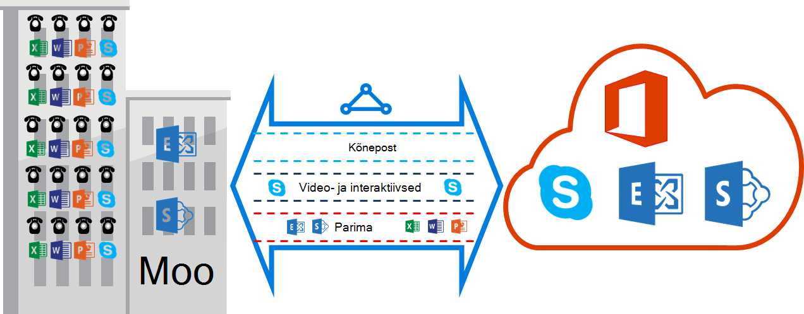

<properties
   pageTitle="QoS nõuded ExpressRoute | Microsoft Azure'i"
   description="Sellelt lehelt leiate üksikasjalikke nõudeid, konfigureerimise ja haldamise QoS ExpressRoute topoloogia jaoks."
   documentationCenter="na"
   services="expressroute"
   authors="cherylmc"
   manager="carmonm"
   editor=""/>
<tags
   ms.service="expressroute"
   ms.devlang="na"
   ms.topic="get-started-article"
   ms.tgt_pltfrm="na"
   ms.workload="infrastructure-services"
   ms.date="10/10/2016"
   ms.author="cherylmc"/>

# ExpressRoute QoS nõuded

Skype'i ärirakendus on erinevad töökoormus, mis nõuavad liigendatud QoS kohtlemine. Kui plaanite kasutamine kõneposti teenuste kaudu ExpressRoute, peaks järgima allpool kirjeldatud nõuetele.

>[AZURE.NOTE] QoS nõuded kehtivad ainult silmitsemine Microsoft. Teie võrguliiklust Azure avaliku silmitsemine ja Azure privaatne silmitsemine DSCP väärtusi lähtestatakse 0. 

Järgmises tabelis loetletakse DSCP märgistuse kasutatud Skype for Business. Lisateabe saamiseks vaadake [Haldamise QoS Skype'i ärirakenduse](https://technet.microsoft.com/library/gg405409.aspx) .

| **Liikluse klassi** | **Kohtlemine (DSCP märkimine)** | **Skype'i ärirakenduse töökoormus** |
|---|---|---|
| **Kõnepost** | EF (46) | Skype'i / Lynci kõneposti |
| **Interaktiivsed** | AF41 (34) | Video |
|   | AF21 (18) | Rakenduse ühiskasutus | 
| **Vaikimisi** | AF11 (10) | Failide edastamine|
|   | CS0 (0) | Midagi muud| 

- Peaksite liigitada süsteemis ja märkida õige DSCP väärtused. Järgige seal toodud juhiseid [siin](https://technet.microsoft.com/library/gg405409.aspx) kohta, kuidas määrata DSCP märgistus teie võrku.

- Peaksite konfigureerimine ja toetavad oma võrgustikus mitmes QoS järjekorras. Kõneposti peab olema eraldi klassi ja vastu võtta RFC 3246 EF töötlus. 

- Saate määrata andmebaasitõrge süsteem, ülekoormuse tuvastamise poliitika ja liikluse klassi läbilaskevõimet eraldatud. Kuid märkimise Skype for Business töökoormus DSCP tuleb säilitada. Kui kasutate DSCP märgistus pole loendis, nt AF31 (26), tuleb kirjutada selle DSCP väärtuseks 0 enne saatmist pakett Microsoft. Microsoft saadab ainult paketid, mis on tähistatud DSCP väärtus ülaltoodud tabelis. 

## Järgmised sammud

- Vaadake [marsruutimine](expressroute-routing.md) ja [NAT](expressroute-nat.md)nõuded.
- Vaadake järgmisi linke ExpressRoute ühenduse konfigureerimiseks.

    - [Mõne ExpressRoute ringi loomine](expressroute-howto-circuit-classic.md)
    - [Marsruutimine konfigureerimine](expressroute-howto-routing-classic.md)
    - [Link on VNet mõne ExpressRoute ringi](expressroute-howto-linkvnet-classic.md)
