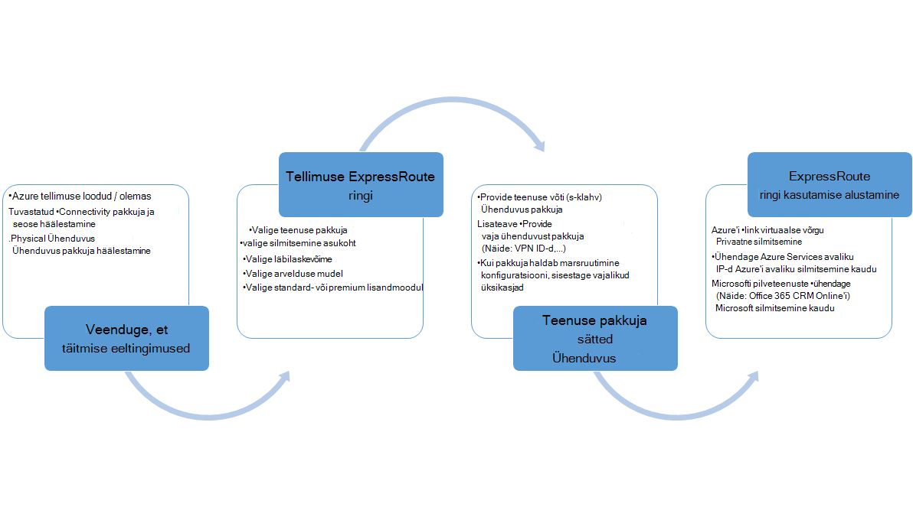
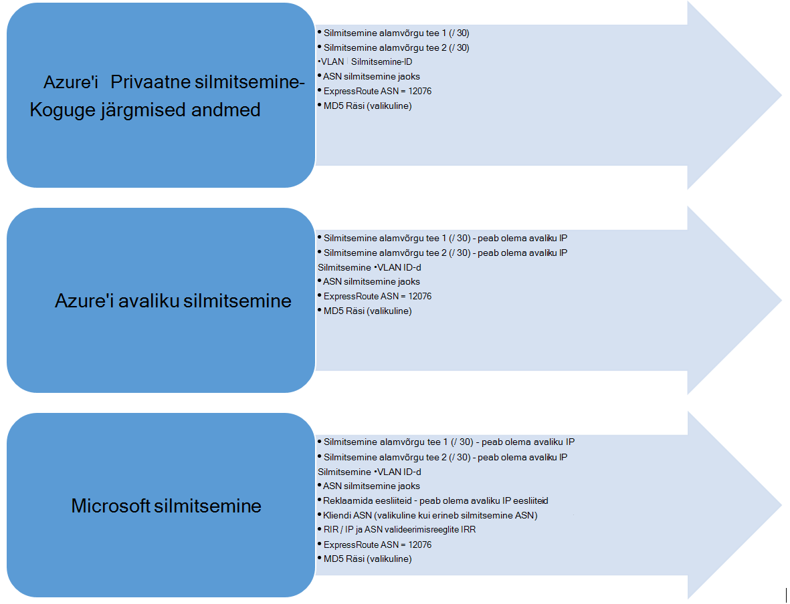

<properties
   pageTitle="Töövood on ExpressRoute ringi konfigureerida | Microsoft Azure'i"
   description="Selle lehe juhendab teid ExpressRoute ringi ja peerings konfigureerida töövood"
   documentationCenter="na"
   services="expressroute"
   authors="cherylmc"
   manager="carmonm"
   editor="" />
<tags
   ms.service="expressroute"
   ms.devlang="na"
   ms.topic="article" 
   ms.tgt_pltfrm="na"
   ms.workload="infrastructure-services"
   ms.date="10/10/2016"
   ms.author="cherylmc"/>

# Ringi ettevalmistamise ja ringi riikide ExpressRoute töövood

Selle lehe juhendab teid teenuse ettevalmistamise ja marsruutimine konfigureerimine töövoogude kõrge.

Järgmisel joonisel ja vastavaid juhiseid kuvada tööülesandeid, peaksite järgima selleks, et mõne ExpressRoute ringi ette valmistatud-lõpuni. 

1. PowerShelli abil saate konfigureerida mõne ExpressRoute ringi. Järgige üksikasjalikumat teavet artiklist [loomine ExpressRoute topoloogia](expressroute-howto-circuit-classic.md) .

2. Tellige ühenduvuse teenusepakkujalt. Selle protsessi muutub. Kuidas tellida ühenduvuse kohta lisateabe saamiseks pöörduge oma Ühenduvus pakkuja.

3. Veenduge, et ringi on ette valmistatud edukalt kontrollides ExpressRoute ringi ettevalmistamise PowerShelli kaudu. 

4. Marsruutimise domeenide konfigureerimine. Kui pakkuja ühenduvuse haldab teie eest Layer 3, nad konfigureerib marsruudi oma ringi. Kui teie ühenduvuse pakkuja pakub ainult Layer 2 teenused, tuleb konfigureerida marsruutimise kohta [marsruutimine nõuded](expressroute-routing.md) ja [marsruudi konfiguratsiooni](expressroute-howto-routing-classic.md) lehtede kirjeldatud juhiseid.

    -  Luba Azure privaatne silmitsemine - tuleb lubada silmitsemine ühenduse VMs / pilveteenused virtuaalne võrkude jooksul.
    -  Luba Azure avaliku silmitsemine – tuleb lubada Azure avaliku silmitsemine, kui soovite, et ühenduse Azure'i teenuseid avaliku IP-aadressid. See on juurdepääsu Azure ressursse, kui olete valinud lubamine vaikimisi marsruudi Azure privaatne silmitsemine nõue.
    -  Luba Microsoft silmitsemine – see tuleb lubada CRM Online'i teenuste ja juurdepääsuga Office 365. 
    
    >[AZURE.IMPORTANT] Te peate tagama, et eraldi puhverserveri kasutamine serva ühenduse Microsofti kui kasutada Interneti-ühendus. Kasutades sama serva ExpressRoute nii Interneti põhjustada asümmeetriline marsruutimist ja põhjustada ühenduvuse katkestuste võrgu jaoks.

    

5. Virtuaalne võrkude ühendamine ExpressRoute topoloogia – saate linkida virtuaalse võrgu oma ExpressRoute ringi. Järgige juhiseid [link VNets](expressroute-howto-linkvnet-arm.md) oma ringi. Nende VNets võib olla sama nimega ExpressRoute ringi Azure tellimuse või võib olla mõni muu tellimus.

## Ettevalmistamise olekus ExpressRoute ringi

Iga ExpressRoute ringi on kaks.

- Teenuse pakkuja ettevalmistamise olek
- Olek

Oleku tähistab Microsofti ettevalmistamise olekus. Selle atribuudi väärtuseks on seatud lubatud mõne Expressroute ringi loomisel

Ühenduvus pakkuja ettevalmistamise olek tähistab ühenduvuse pakkuja küljel olek. See võib olla *NotProvisioned*, *Provisioning*või *Provisioned*. Ringi ExpressRoute peab olema Provisioned olekus, saate seda kasutada.

### Võimalikud olekus ExpressRoute topoloogia

Selles jaotises on loetletud võimalike olekus jaoks soovitud ExpressRoute ringi.

#### Loomise ajal.

Kuvatakse järgmised olekus ExpressRoute ringi niipea, kui käivitate PowerShelli cmdleti ExpressRoute ringi loomiseks.

    ServiceProviderProvisioningState : NotProvisioned
    Status                           : Enabled

#### Kui ühenduvuse pakkuja tegeleb ettevalmistamise ringi

Kuvatakse niipea, kui te kaotate võti teenuse pakkuja Ühenduvus ja nad on alustanud ebausaldusväärsete ExpressRoute ringi järgmised olekus.

    ServiceProviderProvisioningState : Provisioning
    Status                           : Enabled

#### Kui ühenduvuse pakkuja on lõppenud ebausaldusväärsete

Kuvatakse niipea, kui ühenduvuse pakkuja on lõpetatud ebausaldusväärsete ExpressRoute ringi järgmised olekus.

    ServiceProviderProvisioningState : Provisioned
    Status                           : Enabled

Ette valmistatud ja on lubatud, saate kasutada seda võib olla ainult olekus ringi. Kui kasutate kiht 2 pakkuja, saate konfigureerida marsruudi oma ringi ainult siis, kui see on selles olekus.

#### Kui ühenduvuse pakkuja on deprovisioning ringi

Deprovision ExpressRoute ringi pakkuja nõudmisel kuvatakse järgmised olekusse: määrake pärast teenusepakkuja on lõpetanud deprovisioning ringi.

    ServiceProviderProvisioningState : NotProvisioned
    Status                           : Enabled

Kui soovite, et uuesti sisse, kui vaja või käivitage PowerShelli cmdlet-käskude ringi kustutamine.  

>[AZURE.IMPORTANT] Kui käivitate PowerShelli cmdleti kustutamiseks ringi nurjub, kui selle ServiceProviderProvisioningState on Provisioning või toimingu ette valmistatud. Võtke ühendust oma ühenduvuse pakkujat deprovision ExpressRoute ringi esmalt ja seejärel kustutage ringi. Microsoft kasutab ka edaspidi arve ringi käitamise ajal PowerShelli cmdleti kustutamiseks ringi.

## Marsruutimise seansi konfiguratsiooni olek

BGP, state ettevalmistamise saate teada, kui Microsoft Edge'i BGP seansi lubatud. Saate kasutada funktsiooni silmitsemine peab olema lubatud olek.

On oluline, et kontrollida spetsiaalselt Microsoft silmitsemine BGP seansi olek. Lisaks BGP, state ettevalmistamise, on teise riigi nimega *reklaamida avaliku eesliiteid olekus*. Reklaamitud avaliku eesliiteid olekus peab olema olekus *konfigureeritud* nii BGP seansil jõuda üles ja teie marsruutimiseks töö lõpuni. 

Kui reklaamitud avaliku eesliite olek on seatud *valideerimine vaja* oleku, BGP seansi pole lubatud, nagu reklaamitud eesliiteid ei vasta AS arvu, mis tahes marsruutimise registrid. 

>[AZURE.IMPORTANT] Kui riik reklaamitud avaliku eesliidete tähised on *käsitsi valideerimine* olekus, peate avama tugi Piletite koos [Microsofti tugiteenuste](https://portal.azure.com/?#blade/Microsoft_Azure_Support/HelpAndSupportBlade) ja tõendada, et te oma seotud autonoomse süsteemi numbriga mööda reklaamida IP-aadressid.

## Järgmised sammud

- Konfigureerige ExpressRoute ühendust.

    - [Mõne ExpressRoute ringi loomine](expressroute-howto-circuit-arm.md)
    - [Marsruutimine konfigureerimine](expressroute-howto-routing-arm.md)
    - [Link on VNet mõne ExpressRoute ringi](expressroute-howto-linkvnet-arm.md)
