<properties
    pageTitle="Sissejuhatus Microsoft Azure'i | Microsoft Azure'i"
    description="Uus Microsoft Azure'i? Siin on lihtne ülevaade teenuste see pakub näiteid, kuidas nad on kasulik."
    services=" "
    documentationCenter=".net"
    authors="rboucher"
    manager="carolz"
    editor=""/>

<tags
    ms.service="multiple"
    ms.workload="multiple"
    ms.tgt_pltfrm="na"
    ms.devlang="na"
    ms.topic="article"
    ms.date="06/30/2015"  
    ms.author="robb"/>

# Microsoft Azure'i tutvustus

Microsoft Azure on Microsofti rakenduse platvorm avaliku pilve.  Selles artiklis eesmärk on teile fondi põhialuste Azure, mõistmine isegi juhul, kui te ei tea midagi cloud arvutuste.

**Lugege seda artiklit, kuidas**

Azure'i kasvab kogu aeg, seega on lihtne leida ülekoormatud.  Alustage põhiteenused, mis on selles artiklis toodud esmalt, ja minge lisateenuse. See ei tähenda, et te ei saa kasutada lihtsalt lisateenuse ise, kuid tavaline teenuste moodustavad rakendus töötab Azure tuum.

**Tagasiside**

Teie tagasiside on oluline. Selles artiklis peaks teile Azure'i tõhusa ülevaate. Kui see ei räägi lehe allosas jaotise kommentaare. Pange kohta, mis teie arvates ja kuidas parandada artikli mõned üksikasjad.  

## Azure'i komponendid

Azure'i teenuste rühmitab haldusportaal ja erinevate abivahendite nagu [Mis on Azure Infographic](https://azure.microsoft.com/documentation/infographics/azure/) kategooriad. Halduse portaal on, mis abil saate hallata Azure teenused tõenäoliselt (kuid mitte alati).

Selles artiklis kasutatakse mõne **muu ettevõtte** rääkida teenuste põhjal sarnase funktsioon ja olulised sub teenuseid, mis on osa suuremate helistada.  

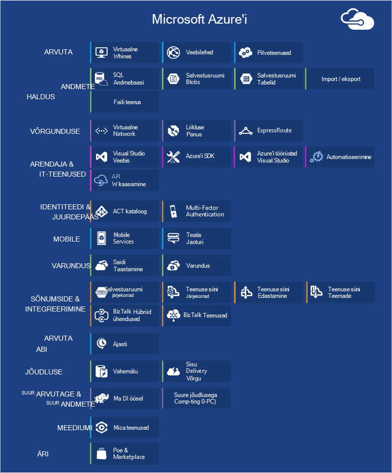   
 *Joonis: Azure'i pakub Interneti-puuetega inimestele juurdepääsetavate töötavate Azure andmekeskuste rakendusteenuste.*

## Haldusportaal
Azure'i on web kasutajaliides nimega [Haldusportaali](http://manage.windowsazure.com) saavad administraatorid vaadata ja hallata kõige, kuid mitte kõigis Azure funktsioone.  Microsoft välja uuem UI portaali beeta tavaliselt enne pensionile ühe vanema. Uuem nimetatakse ["Azure eelvaade portaali"](https://portal.azure.com/).

On tavaliselt pikk kattumise, kui mõlemad portaalide on aktiivne. Kuigi core services kuvatakse nii portaalide, kõik funktsioonid võib olla nii saadaval. Uuemad teenused võib kuvatakse uuem portaali ees- ja vanemad teenuste ja funktsionaalsus võivad esineda ainult vanem.  Sõnum on siin on, et kui te ei leia midagi vanema portaalis kontrollida uuem ja vastupidi.

## Arvuta

Üks kõige põhitoiminguid pilve platvormi ei on rakendusi käivitada. Iga Azure Arvuta mudeli on oma roll.

Saate kasutada nende tehnoloogiate eraldi või neid kombineerida õige alus rakenduse loomiseks. Lähenemisviisi valida, sõltub sellest, milliseid probleeme proovite lahendada.

### Azure'i Virtuaalmasinates

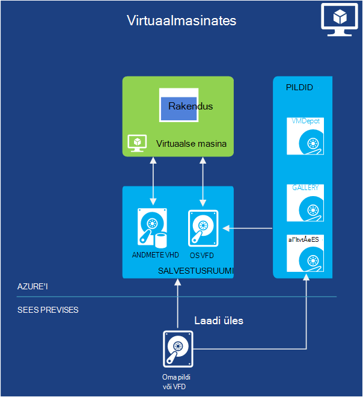   
*Joonis: Azure'i Virtuaalmasinates annab teile virtuaalse masina eksemplarid pilveteenuses üle täielik kontroll.*

Võimalus luua virtuaalse masina nõudmisel, kas standard pildi või mõnest teil pakkuda, võib olla väga kasulik. Seda moodust, tuntakse infrastruktuuri teenus (IaaS) on, mis leiate Azure'i Virtuaalmasinates. Joonis 2 näitab kombinatsiooni virtuaalse masina (VM) töö ja kuidas luua üks on VHD.  

Luua VM, saate määrata, millised VHD kasutamine ja selle VM suurus.  Maksate siis aeg, kus töötab VM. Maksate minutid ja ainult siis, kui see töötab, kuigi ei ole saadaval VHD pidamise minimaalsete salvestusruumi tasuta. Azure'i on saadaval stock VHDs (nn "pildid"), mis sisaldavad käivitatava operatsioonisüsteemi käivitamiseks. Nendeks on Microsofti ja partneri võimalusi, näiteks Windows Server ja Linux, SQL Server, Oracle ja palju muud. Teil on õigus luua VHDs ja pilte ja laadige need ise. Saate alla laadida VHDs, mis sisaldavad ainult andmed ja seejärel neile juurde pääseda oma töötava VMs.

Kõikjal, kus on VHD pärineb, saate salvestada püsivalt VM töötamise ajal tehtud muudatused. Järgmine kord, kui loote selle VHD VM asjade kättesaamine kus pooleli jäite. Azure Storage plekid, mis räägitakse hiljem talletatakse VHDs, mis on Virtuaalmasinates tagasi.  Mida tähendab, et saate koondamise tagada teie VMs ei kao riistvara ja kettaruumi tõrgete tõttu. Samuti on võimalik kopeerida muudetud VHD Azure'i välja ja seejärel käivitage see kohalikult.

Teie rakendus töötab ühe või mitme Virtuaalmasinates, olenevalt sellest, kuidas te seda varem loodud või soovi loomine algusest peale kohe sees.

Cloud arvutuste seda üsna üldine moodust saab kasutada paljude erinevate probleemide lahendamiseks.

**Virtuaalse masina stsenaariumid**

1.  **Arendaja katse** - võib neid kasutada loomiseks odav Arendus ja testimine platvormi, mida saab sulgeda, kui olete valmis seda kasutama. Võite luua ja käivitada rakendusi, mis kasutavad mis tahes keelte ja teegid, mis teile meeldib. Nende rakenduste saate kasutada andmete haldamise suvandeid leiate Azure'i, mis saate kasutada SQL serveri või mõne muu DBMS ühe või mitme virtuaalmasinates töötab.
2.  **Azure'i (lifti-ja-shift) rakenduste teisaldamine** - "Lifti-ja-shift" viitab teisaldamine rakenduse palju, nagu kasutaksite suurte objektile liikumine on laadur.  Saate "tõstke" on VHD kaudu oma kohaliku andmekeskuse ja "shift" seda Azure ja käivitage see seal.  Peate tavaliselt tegema sõltuvuse muudest süsteemidest eemaldada. Kui loendis on liiga palju, võite suvand 3.  
3.  **Laienda oma andmekeskuse** - kasutamine Azure VMs pikendamine oma kohapealse andmekeskuses, töötavad SharePointi või muudes rakendustes. Toetamiseks, on võimalik luua Windows domeenide pilves, käivitades Azure VMs Active Directory. Saate siduda teie kohalikus võrgus ja võrgu Azure koos Azure virtuaalse võrgu (mainitud hiljem).

### Web Apps

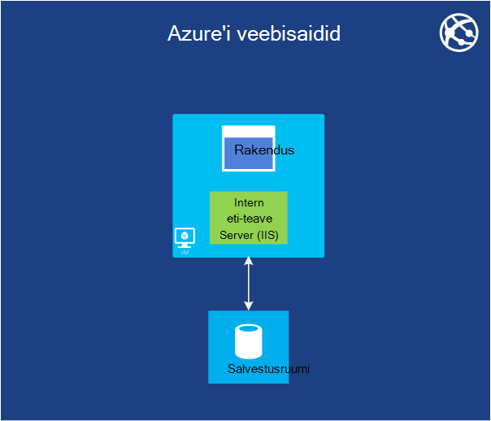   
 *Joonis: Azure'i veebirakenduste veebisaidi rakendus töötab pilves ilma aluseks veebiserver haldamine.*

Üks kõige levinum asjad, mida inimesed teha pilveteenuses käitatakse veebilehed ja veebirakendused. Azure'i Virtuaalmasinates seda lubab, kuid see endiselt jätab teile haldamiseks ühe või mitme VMs ja aluseks opsüsteemide kohustusi. Cloud services web rollid, saate seda teha, kuid juurutamine ja nende säilitamise ikka võtab haldus töö.  Mida teha, kui soovite lihtsalt veebisaidi kui keegi hoolitseb haldus tööd?

See on täpselt, mida pakub Web Apps. See Arvuta mudel pakub kasutades Azure haldusportaali samuti API-de hallatavate veebikeskkonnas. Saate olemasoleva veebisaidi rakenduse viimine veebirakenduste ei muutu või saate luua uue otse pilveteenuses. Kui veebisait töötab, saate lisada või eemaldada eksemplarid dünaamiliselt, tuginedes Azure'i veebirakenduste kogu neid laadimiseks. Azure'i rakenduste pakub nii ühiskasutusega suvand, kui teie veebisait töötab virtuaalse masina ja muude saitide, standard suvand, mis võimaldab saidi käivitamiseks oma VM. Standardse suvandi saate ka suurendamine (arvutuste power) eksemplaride vajaduse korral.

Arengu, toetab veebirakenduste relatsiooniline Storage .NET, PHP, Node.js, Java ja Python koos SQL-andmebaasi ja MySQL-i (alates ClearDB, Microsoft partner). See sisaldab ka mitu populaarsed rakendust, sh WordPress, Joomla ja Drupal tugi. Eesmärk on pakkuda madal – maksumus, scalable ja laiemalt kasulik platvormi loomise veebilehed ja veebirakendused avaliku pilve.

**Web Appsi stsenaariumid**

Web Apps on mõeldud abiks ettevõtted, arendajad ja web kujundus valitsusasutustele. Ettevõtted, on lihtne hallata, scalable, turvaline ja väga kättesaadav lahendus kohaloleku hallatakse. Kui teil on vaja luua, on mõistlik Azure Web Apps alustamine ja pilveteenustega jätkata, kui teil on vaja funktsioon, mis pole saadaval. Vt lisateavet linke, mis aitavad teil valida soovitud suvandid jaotises "Arvuta" lõpus.

### Pilveteenused
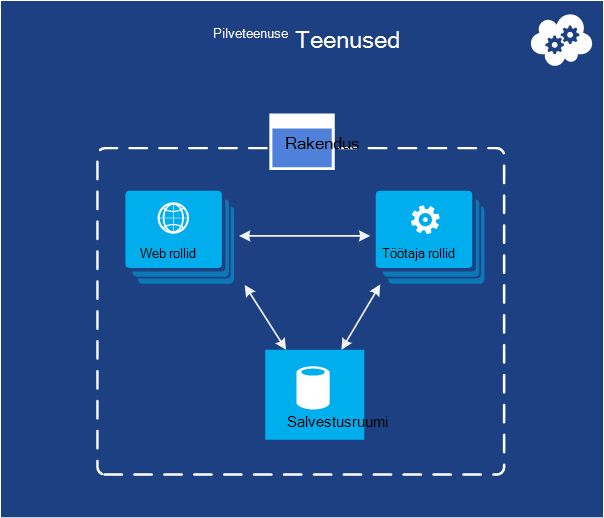   
*Joonis: Azure'i pilveteenustega pakub väga paindlik kohandatud koodi käivitada platvormi nimega Service (PaaS) keskkonna kohta*

Oletame, et soovite luua pilve rakendus, suure hulga kasutajate, toetavad ei nõua palju haldus ja kunagi läheb. Teil võib olla mõni loodud tarkvara müük, näiteks, mis on otsustanud omaks tarkvara kui teenus (SaaS) hoone versiooni üks rakendustest pilveteenuses. Või teil võib olla kohaliku tarbija rakendus, mida eeldate kasvab kiiresti luua. Kui olete tuginedes Azure'i, mis täitmise mudel tuleks kasutada?

Azure'i veebirakenduste lubab seda tüüpi veebirakenduse loomine, kuid on mõned piirangud. Te ei pääse haldus, näiteks, mis tähendab, et te ei saa installida suvalise tarkvara. Azure'i Virtuaalmasinates annab teile paindlikult, sh haldus juurdepääs, ja kindlasti saate koostada väga scalable rakenduse, kuid peate palju aspekte töökindluse ja Administreerimine käsitlema. Mida soovite on suvand, mis annab teile kontrolli, peate, kuid töötleb ka enamik tööd, töökindluse ja haldamiseks.

See on täpselt, mis on esitatud Azure pilveteenustega. See tehnoloogia toetamiseks scalable, usaldusväärseid selgesõnaliselt mõeldud ja madal – administraatori rakendused, ja see on näide, mis on üldiselt tuntud Platform teenus (PaaS). Seda kasutada, saate luua rakenduse abil saate valida, nt C#, Java, PHP, Python, Node.js või midagi muud tehnoloogia. Teie kood seejärel aktiveeritakse virtuaalmasinates (nimetatakse eksemplarid) versiooni Windows Server.

Kuid need VMs erinevad need Azure'i Virtuaalmasinates loomist. Esiteks Azure'i ise haldab neid näiteks installimist operatsioonisüsteem plaastrid ja automaatselt jooksvalt läbi uus paigatud pilte. See tähendab, et rakenduse ei tohiks säilitada veebis või töötaja rolli juhtudel; selle asemel tuleb arvesse võtta üks järgmises jaotises kirjeldatud Azure andmete haldamise suvandid. Azure'i jälgib ka need VMs, igal taaskäivitada, et ei suuda. Saate seada automaatselt luua rohkem või vähem eksemplarid vastuse nõudmisel pilveteenustega. See võimaldab toime suurem kasutus ja siis skaala tagasi, et ei maksa nii palju vähem kasutamise korral.

Teil on näiteks loomisel valida kahe rollid, mõlemad põhjal Windows Server. Kahe põhilise vahe on web rolli eksemplari töötab IIS-i, samal ajal töötaja roll, näiteks ei saa. Mõlemad ühtemoodi, hallatakse siiski ja on tavaline, kuidas kasutada mõlemat. Näiteks võib web rolli eksemplari aktsepteerige kasutajad ja seejärel edasi töötaja rolli eksemplari töötlemiseks. Mastaapimiseks rakenduse üles või alla, saate taotleda Azure'i mitu eksemplari mõlemal rolli loomine või olemasoleva eksemplarid sulgeda. Ja sarnase Azure'i Virtuaalmasinates, peate tasuma ainult aeg, et iga veebis või töötaja rolli töötab.

**Cloud Services stsenaariumid**

Pilveteenustega on optimaalne toetavad suuri skaala välja, kui teil on vaja rohkem kontrolli selle üle platvorm suurem Azure'i veebirakenduste, kuid teil pole vaja juhtida aluseks operatsioonisüsteemi.

#### Arvuta mudeli valimine
[Azure'i veebirakenduste, pilveteenustega ja Virtuaalmasinates võrdluse](./app-service-web/choose-web-site-cloud-service-vm.md) lehe annab valida mudeli Arvuta üksikasjalikumat teavet.

## Andmehaldus

Rakendused on vaja andmeid ja eri tüüpi rakendusi vajavad erinevaid andmeid. Seetõttu Azure pakub mitmeid erinevaid võimalusi talletamine ja andmete haldamine. Azure'i moodi palju salvestusruumi, kuid kõik on mõeldud väga püsival salvestusruumi.  Mõnda järgmistest suvanditest, kus on alati sünkroonitud üle mõne Azure andmekeskusesse ehk 6 kui lubate Azure'i teise andmekeskuse vähemalt 300 miili varundada geo-koondamise abil andmete 3 koopiad.     

### Virtuaalmasinates
Käivitage SQL serveri või mõne muu DBMS loodud Azure'i Virtuaalmasinates VM võimalus juba märgitud. Mõistan, et see valik pole piiratud relatsiooniline süsteemid; te pole vaba NoSQL tehnoloogiaid nagu MongoDB ja Cassandra käivitamiseks. Töötab oma andmebaasi süsteemi on lihtne it dubleerivate, mida me kasutada oma andmekeskuste-, kuid on vaja ka töötlemise selle DBMS haldamine.  Muude suvandite Azure'i tegeleb või suurema hulga haldamise eest.

Klõpsake uuesti virtuaalse masina ja mis tahes täiendavate andmete kettale loomisel või üleslaadimine on tagatud bloobimälu (mis räägitakse hiljem).  

### Azure'i SQL-andmebaas
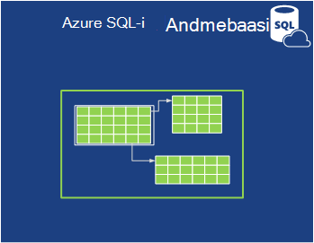   

*Joonis: Azure'i SQL-andmebaasi pakub hallatavate relatsiooniandmebaasist teenust pilveteenuses.*

Relatsiooniliste Storage, Azure pakub funktsioon SQL-andmebaasi. Ärge laske nime panemise pettusele. See on erinevas tüüpilised SQL-andmebaasi esitatud SQL serveri peal Windows Server töötab.  

Varasema nimetusega SQL Azure'i, Azure'i SQL-andmebaasi pakub kõiki põhijooned relatsiooniandmebaasist halduse süsteemi, sealhulgas atomic tehingute samaaegseid andmepääsu andmetervikluse, ANSI SQL-päringud ja tuttavad programmeerimise mudeli mitu kasutajat. Nagu SQL Server, SQL-andmebaasi pääseb kasutades üksuse raames, ADO.net-i, JDBC ja muud tuttavad andmetele juurdepääsu tehnoloogiad. Samuti toetab enamik T-SQL-i keelt, nt SQL Server Management Studio SQL serveri tööriistad koos. Keegi tuttav SQL serveri (või muust relatsiooniandmebaasist) SQL-andmebaasi abil on lihtne.

SQL-andmebaasi pole lihtsalt, kuid DBMS cloud-IT kasutaja PaaS teenus. Veel andmeid hallata ja kes sellele juurde pääsevad, kuid SQL-andmebaasi hoolitseb haldus uriseja tööd, nt riistvara taristu haldamise ja automaatselt andmebaasi ja operatsioonisüsteemi tarkvara ajakohasena hoidmine. SQL-andmebaasi pakub kõrge-saadavus, automaatse varundamise funktsiooni punkti õigel ajal taastada võimaluste ja saate ise eksemplarid kõigis piirkondades.  

**SQL-andmebaasi stsenaariumid**

Kui loote Azure rakenduse (mis tahes Arvuta mudelite abil), mis tuleb relatsiooniline salvestusruumi, SQL-andmebaasi võib olla hea valik. Rakenduste töötamine väljaspool pilveteenuses saate kasutada ka see teenus küll, seega on palju teiste stsenaariumide. Näiteks pääseb muu kliendi süsteemist lauaarvutite, sülearvutite, tahvelarvutite ja telefonide SQL-andmebaasis talletatud andmed. Ja kuna see pakub sisseehitatud kõrge kättesaadavus dispersioonanalüüs kaudu, kasutades SQL-andmebaasi aitab minimeerida tööseisakute.

### Tabelid
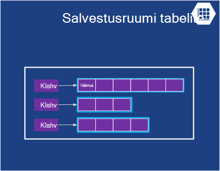  

*Joonis: Azure'i tabelite võimaldab tasapinnalise NoSQL andmete talletamiseks.*

See funktsioon on mõnikord nimetatakse erinevate terminite osana see on suurem funktsiooni nimega "Azure Storage". Kui näete "tabelid", "Azure tabelid" või "salvestusruumi tabelid", on kõik sama.  

Ja Ärge segi nimi: See tehnoloogia ei paku relatsiooniline salvestusruumi. Tegelikult on näiteks NoSQL lähenemisviisi /-väärtuse poe nimega. Azure'i tabelid võimaldavad rakenduse talletada eri tüüpi, nt stringide, täisarvude ja kuupäevade atribuudid. Rakenduse saate tuua seejärel Atribuudid rühma pakkudes selle rühma kordumatu võti. Keerukate toimingute ajal nagu ühenduste ei toetata, tabelite pakkuda sisestatud andmed kiiresti juurde pääseda. Need on väga scalable suudab nii palju Teratavu andmeid, kui ühe tabeli. Ja nende lihtne sobitamine, tabelid on tavaliselt odavam kasutada kui SQL-andmebaasi relatsiooniline salvestusruumi.

**Tabelite stsenaariumid**

Oletame, et soovite luua Azure rakendus, mida on vaja kiiresti juurde pääseda tipitud andmeid, võib-olla palju seda, kuid ei vaja teha keerukad SQL-päringud andmete põhjal. Oletagem näiteks, loote tarbija rakendus, mis tuleb salvestada kliendi profiili teavet iga kasutaja jaoks. Rakenduse saab olla väga populaarne, et peate esmalt lubama jaoks palju andmeid, kuid ei tee palju Lisaks talletamise, seda andmetega, siis toomine seda lihtsat võimalust. See on täpselt selline stsenaarium, kus Azure'i tabelid on mõistlik.

### Plekid
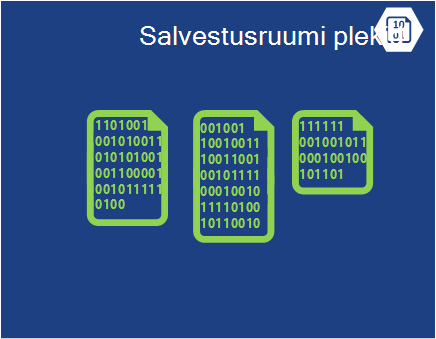    
*Joonis: Azure'i plekid pakub struktureerimata binaarandmeid.*  

Azure'i plekid (uuesti "Bloobimälu" ja lihtsalt "salvestusruumi plekid" on sama) on mõeldud salvestamiseks struktureerimata binaarandmeid. Tabelite, nt plekid pakub odav ja ühe bloobimälu võib olla kuni 1TB (üks Teratavu). Azure'i rakendusi saate kasutada ka Azure kaudu, mis lasta plekid failisüsteemi Windows Azure'i eksemplari paigaldatud püsivate salvestusruumi pakkumine. Rakenduse näeb tavapärase Windowsi faile, kuid tegelikult on talletatud sisu on bloobimälu.

Bloobimälu kasutavad paljude muude Azure funktsioonide (sh Virtuaalmasinates), nii et see kindlasti hakkama oma töökoormus liiga.

**Plekid stsenaariumid**

Rakendus, video, suuri faile või muud kahendarvu teavet saate kasutada plekid lihtsad, odavad salvestusruumi. Plekid ka tavaliselt kasutatakse koos muude teenustega, nagu sisu kohaletoimetamise võrk, mis me räägivad hiljem.  

### Import / eksport
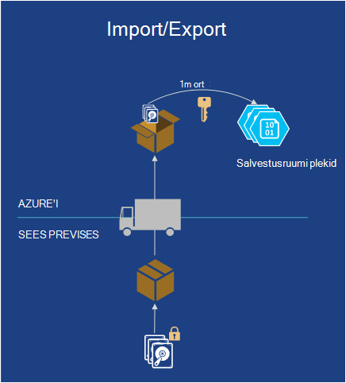  

*Joonis: Azure'i impordi / ekspordi pakub võimalust saata füüsiline kõvaketas või Azure kiirem ja odavam hulgi andmete import või eksport.*  

Vahel soovite teisaldada palju andmeid Azure. Mida võtta kaua aega, võib-olla päevad ja läbilaskevõime palju kasutada. Sellisel juhul saate kasutada Azure impordi/ekspordi, mis võimaldab teil BitLockeri krüptitud 3,5" SATA kõvaketas saadetavad Azure andmekeskuste, kus Microsoft edastame andmed üheks bloobimälu teile saata.  Kui üleslaadimine on lõpule jõudnud, teenusega Microsoft draivid tagasi.  Soovi korral võite, et suurte andmehulkade kaudu bloobimälu peale kõvaketas eksportida ja saata teile e-posti teel.

**Stsenaariumid Import / eksport**

- **Suure andmete migreerimise** - niipea, kui teil on suure hulga andmete (TB), mida soovite üles laadida Azure impordi/ekspordi teenus on sageli palju kiirem ja võib-olla odavam teisaldamist Interneti kaudu. Kui andmed on plekid, saate selle protsessi muude vormidesse, nt tabelimälu või SQL-andmebaasi.

- **Andmete taastamine arhiivitakse** - impordi/ekspordi abil saate on Microsoft edastamine suurte andmehulkade talletatud Azure'i bloobimälu salvestusruumi seadmesse saadetavate ja seejärel selle seadme teinud tagasi teatud asukohta, mida soovivad. Kuna see võtab aega, ei ole avariitaastet hea valik. See on parim viis arhiivitud andmeid, mida te ei pea kiireks juurdepääsuks.

### Faili teenus
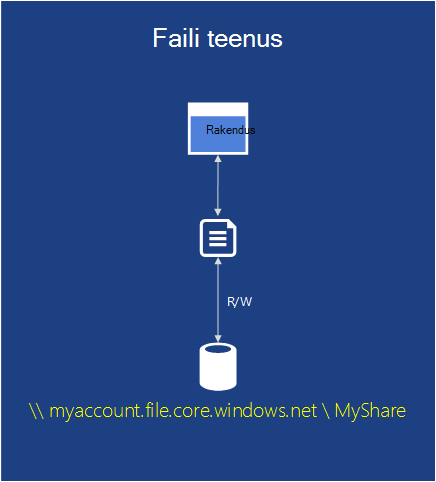    
*Joonis: Azure'i faili Services pakub SMB \\ \\server\share teed rakenduste töötab pilveteenuses.*

Asutusesiseselt, on tavaline on suure hulga failide talletamine kaudu Server sõnum Block (SMB) protokolli abil soovitud \\ \\Server\share vorming. Azure'i on nüüd teenus, mis võimaldab kasutada pilveteenuses protokolliga. Helistamine ja Azure saate seda kasutada failisüsteemi tuttav nagu ReadFile ja WriteFile API VMs vahel faile ühiskasutusse anda. Lisaks saate faile juurde samal ajal ülejäänud kasutajaliides, mis aktsiate kohapealse pääsete juurde, kui seadistate ka virtuaalse võrgu kaudu. Azure'i failid on ehitatud bloobimälu teenus, nii, et see pärib sama kättesaadavus, kestvus, skaleeritavus ja geo-koondamise Azure Storage sisse ehitatud.

**Azure'i failide stsenaariumid**

- **Migrating olemasoleva rakendused pilve** - lihtsam migreeritavate kohapealse pilveteenusesse ja andmete osa rakenduse vahel jagamiseks failikettad kasutavad rakendused. Iga VM loob ühenduse faili ühiskasutus ja seejärel lugeda ja kirjutada failid nagu selle vastu ka kohapealse faili jagada.

- **Ühiskasutusse antud rakenduse sätted** – levinud mustri jaotatud rakenduste on failid keskses kohas, kus ta pääseb paljude erinevate virtuaalmasinates. Need failid saate talletatud on Azure faili ühiskasutusse andmine ja läbivalt kogu rakenduse lugeda. Sätteid saab hallata ka ülejäänud kasutajaliides, mis võimaldab kogu maailmas juurdepääsu failid kaudu.

- **Diagnostika ühiskasutusse andmine** - saate salvestada ja diagnostika logid, mõõdikute ja krahhi puistab failide ühiskasutus. Need failid on saadaval nii SMB ja ülejäänud kasutajaliidese kaudu võimaldab rakendusi kasutada erinevaid andmeanalüüsi tööriistad ja diagnostika andmete analüüsimine.

- **Arendaja/Test/silumine** – kui arendajad või administraatorid töötavad virtuaalmasinates pilves, peavad sageli tööriistad või Utiliidid kogum. Installimine ja levitamine nende teenuste virtual igas arvutis on aeganõudev. Azure'i faile, arendaja või administraator saab talletada oma lemmik tööriistad failikettal ja ühendada need mis tahes virtuaalse masina.

## Võrgunduse

Azure'i käivitatakse täna palju andmekeskuste levinud kogu maailmas. Rakenduse käivitamisel või andmete talletamiseks, saate valida üks või mitu nende andmekeskuste kasutada. Samuti saate luua ühenduse nende andmekeskuste allpool teenuste kasutamisel erineval viisil.

### Virtuaalse võrgu
   

*Joonis: Virtuaalne võrkude pakub privaatvõrgu pilves, et räägivad üksteisest erinevad teenused või kohapealse ressurssidele Kui häälestate VPN asutusesiseses ühendus.*  

Üks kasulik viis, kuidas kasutada avaliku cloud on käsitleda oma andmekeskuse laiendamine.

Kuna loote VMs nõudmisel, siis eemaldage need (ja stop maksab) kui nad pole enam vaja, saate määrata arvutuste power ainult siis, kui soovite seda. Ja kuna Azure'i Virtuaalmasinates võimaldab teil luua VMs töötab SharePoint, Active Directory ja muu tarkvara tuttavad kohapealse, seda moodust saab tööd on juba rakendustega.

Et muuta see väga kasulik, küll, kasutajate peaks saama kohelge need rakendused, kui need on teie enda andmekeskuses töökorras. See on täpselt, mis võimaldab Azure virtuaalse võrgu. VPN lüüsi seadme abil administraator saate häälestada virtuaalse privaatvõrgu (VPN) teie kohalikus võrgus ja oma virtuaalse võrgu Azure juurutatud VMs vahel. Kuna määrate pilveteenusesse VMs v4 oma IP-aadressid, kuvatakse need oma võrguühenduse. Organisatsiooni kasutajad pääsevad rakendused need sisaldavad, kui need on kohalik töökorras.

Plaanimine ja virtuaalse võrgu, mis töötab teie jaoks loomise kohta leiate lisateavet teemast [Virtuaalse võrgu](./virtual-network/virtual-networks-overview.md).

### Kiire marsruutimiseks

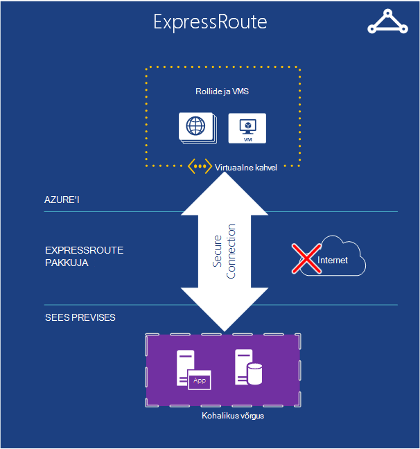   

*Joonis: ExpressRoute kasutab mõni Azure virtuaalse võrgu, kuid marsruudib ühenduste kiiremini sihtotstarbeline ridade asemel avaliku Interneti kaudu.*  

Kui teil on vaja rohkem läbilaskevõime või turvalisust kui Azure virtuaalse võrgu ühenduse saate sisestada, saate uurida ExpressRoute. Mõnel juhul ExpressRoute salvestada ka teie raha. Peate Azure virtuaalse võrgus, kuid seost Azure ja saidi kasutab sihtotstarbeline ühendus, mis ei lähe avaliku Interneti kaudu. Selle teenuse kasutamiseks peate olema võrgu pakkuja või exchange osutaja leping.

Häälestamiseks on ExpressRoute ühendus nõuab rohkem aega ja kavandamise, nii et võite alustada VPN saidilt, siis ExpressRoute ühendus migreerida.

ExpressRoute kohta leiate lisateavet teemast [ExpressRoute tehniline ülevaade](./expressroute/expressroute-introduction.md).

### Liikluse haldur

   

*Joonis: Azure'i liikluse haldur võimaldab teil globaalne liikluse marsruutimiseks nutikad reeglite teenust.*

Kui teie Azure rakendus töötab mitu andmekeskuste, saate Azure'i liikluse haldur marsruutimiseks taotluste kasutajad arukalt mitmes eksemplaris rakenduse. Samuti saate marsruutida liiklust, Services ei tööta Azure, kui need on kättesaadavad Interneti kaudu.  

Ainult üks osa maailma kasutajatega Azure rakendus võib käivitada ainult üks Azure andmekeskuse. Rakenduse kasutajatega laiali kogu maailmas, aga tõenäoliselt käivitamiseks mitmes andmekeskuses, võib-olla ka kõik need. Sellisel juhul teise saate esinema probleem: kuidas te arukalt suunata teenuserakenduse eksemplaride kasutajad? Enamikul juhtudel, soovite tõenäoliselt iga kasutaja juurdepääsu andmekeskuse lähemal, kuna see tõenäoliselt anda talle parim vastus aeg. Aga kui rakenduse eksemplari on ülekoormatud või pole saadaval? Sel juhul oleks tore tema taotlus automaatselt teise andmekeskuse suunamiseks. See on täpselt, mida tehakse Azure'i liikluse haldur.

Rakenduse omanik määratleb reeglid, mis määravad, kuidas peaks taotluste kasutajad suunatakse andmekeskuste ja seejärel tugineb klõpsake liikluse haldur teha järgmisi reegleid. Näiteks kasutajad võivad tavaliselt teid suunatakse lähima Azure'i andmekeskuse, kuid saadetakse teise kui nende vaikimisi andmekeskuse vastuse aeg ületab muude andmekeskuste vastuse aeg. Globaalselt hajutatud rakendusi, kus mitu kasutajat, kas teil on probleeme käsitlema sisseehitatud teenus on kasulik.

Liikluse haldur kasutab Directory teenus (DNS) marsruutimiseks kasutajatele teenuse lõpp-punktid, kuid põhjalikumaks liikluse ei lähe liikluse Manageri kaudu, kui see ühendus on loodud. See hoiab liikluse haldur on kitsaskoht, mis aeglustada suhtluse teenus.

## Arendaja teenused
Azure'i pakub mitmesuguseid tööriistu, mis aitavad arendajad ja IT-spetsialistid luua ja hallata rakenduste pilveteenuses.  

### Azure'i SDK
Tagasi 2008, esimese väljalaske-eelse versiooni Azure toetatud ainult .NET areng. Täna, saate luua Azure rakenduste päris palju mis tahes keeles. Praegu pakub Microsoft .NET, Java, PHP, Node.js, Ruby ja Python Keelekohased SDK-d. Olemas on ka üldine Azure'i Tarkvaraarenduskomplektist, mis tahes keeleks, nt C++ lihtsa toetavad.  

Nende SDK-d aitavad teil koostada, kasutada ja Azure rakenduste haldamine. Need on saadaval [www.microsoftazure.com](https://azure.microsoft.com/downloads/) või GitHub ja neid saab kasutada koos Visual Studio ja Eclipse. Azure'i pakub ka käsurea tööriistu, mida saab kasutada koos toimetaja või arengu keskkonnas, sh rakenduste Azure Linux ja Macintosh Systemsi kasutamise kohta.

Koos aitavad teil luua Azure rakendused, pakuvad need SDK-d ka kliendi teegid, mis aitavad teil luua tarkvara, mis kasutab Azure teenused. Näiteks saate koostada rakendus, mis loeb ja kirjutab Azure plekid või loomine tööriista, mis kasutab Azure rakenduste Azure haldus kasutajaliidese kaudu.

### Visual Studio Team Services

Visual Studio meeskonnatöö teenused on kataks arv teenuseid, mis aitab rakenduste on Azure arendada turundustegevuse nimi.

Et vältida segadust - ei võimalda Visual Studio majutatud või veebipõhine versioon. Peate oma kohaliku eksemplari töötava Visual Studio. Kuid pakub mitmeid tööriistu, mis võib olla väga kasulik.

See ei sisalda majutatud andmeallika juhtelemendi süsteemi nimetatakse Team Foundation teenus, mis pakub versiooni kontrollimine ja töö üksuse jälitus.  Kontrolli versiooni saate kasutada isegi Git, kui soovite, et. Ja teil võib olla muutuv andmeallika juhtelemendi süsteemi kasutate projekti järgi. Saate luua piiramatu privaatne meeskonnatöö kaudu juurdepääsetavad kõikjal maailmas.  

Visual Studio Team Services pakub laadi testimise teenust. Laadi testide Visual Studio VMs pilveteenuses on loodud, saab käivitada. Teie määratud soovite laadida test kasutajate arv, ja Visual Studio Team Services automaatselt määrab, mitu agentide on vaja tööle hakata nõutav virtuaalmasinates ja laadi testide käivitada. Kui olete mõne MSDN-i abonendi, saate tuhandeliste laadi testimine iga kuu tasuta kasutaja-protokolli.

Visual Studio Team Services pakub funktsioone, nagu pidev integratsioon koostab, Kanban tahvleid ja virtuaalse meeskonnatöö, Toad dünaamilised arengu.

**Visual Studio meeskonnatöö teenuste stsenaariumid**

Visual Studio meeskonnatöö teenused on hea valik ettevõtetes, mis kogu maailmas koostööd teha ja ei pea selleks on juba infrastruktuuri. Saada setup minutiga, valige andmeallika juhtelemendi süsteem ja alustada, koodi kirjutamine ja koostamise sel päeval.  Meeskonnatöö tööriistad koht ette koordineerituna ja koostöö- ja täiendavad tööriistad analüüs, testige ja häälestada rakenduse kiiresti vaja.

Kuid ettevõtted, mis on juba kohapealse süsteem testida uue projekti Visual Studio meeskonnatöö Services kuvamiseks, kui see on tõhusam.   

### Rakenduse ülevaated

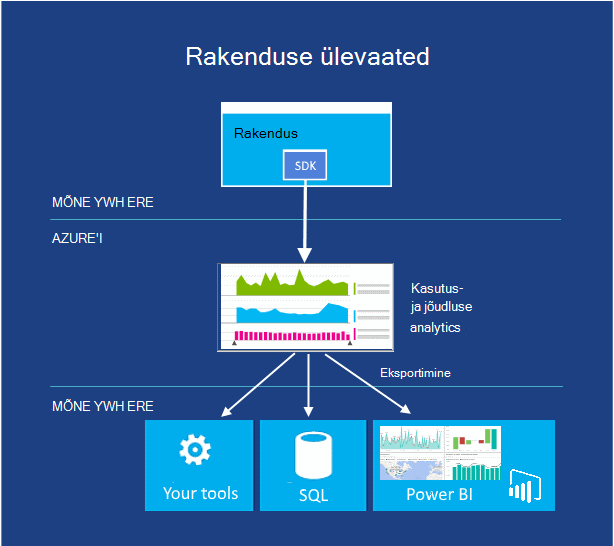  

*Joonis: Rakenduse ülevaated kuvari jõudlus ja reaalajas veebis või seadme rakenduse kasutamist.*

Kui teie rakendus – on avaldatud, kas see töötab mobiilsideseadmete, Lauaarvutid või veebibrauserid - rakenduse ülevaated ütleb teile, kuidas see toimib ja mida kasutajad teevad selle. Sõnaarvestuse jookseb ja aeglane vastuse hoiab, teatis, kui arvud cross aktsepteeritav lävede ja aitab teil diagnoosimine probleeme.

Kui teil tekib uus funktsioon, leping mõõta oma edu kasutajatega. Analüüsitakse mustreid, mõista, mis toimib kõige paremini teie klientide ja täiustamiseks rakenduse iga arengutsükli sisse.

Kuigi see on majutatud Azure, töötab rakenduse ülevaated rakendused, nii sisse ja välja Azure'i lai ja kasvab lahtrivahemik. ASP.net-i nii J2EE web rakendused asuvad, kui ka iOS-i, Androidi, OSX ja Windowsi rakendused. Telemeetria saadetakse SDK rakendus ja sisseehitatud, analüüsida ja kuvatakse rakenduse ülevaated teenuses Azure.

Kui soovite täpsemaid analytics, eksportida telemeetria voo andmebaasi või Power BI või mis tahes muud tööriistad.

**Rakenduse ülevaateid stsenaariumid**

Arendate rakendus. See võib olla web appi või seadme rakendus või seadme rakenduse web tagasi lõppu.

* Pärast avaldamist saate kasutada rakenduse jõudluse häälestamiseks või ajal laadida testimine.  Rakenduse ülevaated kaudu installitud läbivalt kogu telemeetria liitmise ja tutvustab teile vastuse korda, taotlus ja erandi loendab, sõltuvus vastuse korda ja muud mõõdikud diagrammidega. Need aitavad teil oma rakenduse jõudluse häälestamine. Lisateavet teatada koodi võite sisestada konkreetsed andmed, kui teil on vaja.
* Tuvastada ja reaalajas rakenduse probleemide diagnoosimine. Saate avada teatiste e-posti teel, kui mõõdikud cross aktsepteeritav lävede. Saate uurida teatud kasutaja seansid, nt vaatamiseks kutse, mis põhjustada erandi.
* Jälgida kasutust hinnata iga uue funktsiooni abil. Kui loote uue kasutaja Loo, leping palju seda kasutatakse ja kas kasutajad saavad oodatud eesmärkide mõõtmiseks. Rakenduse ülevaated annab teile põhialused andmeid, nt veebilehe vaadete ja jälgida kasutusvõimalused üksikasjalikumalt koodi võite sisestada.

### Automatiseerimine
Keegi meeldib kulutada aega, tehes samas käsitsi protsessid ikka ja jälle. Azure'i automaatika võimaldab teil luua, jälgida, hallata ja juurutamine ressursid Azure keskkond.  

Automaatika kasutab "tegevusraamatud", mis kasutab Windows PowerShelli töövood (ainult tavaline PowerShelli) vs all hõlmab. Tegevusraamatud on mõeldud täitmiseks tuleb kasutaja suhtlus. PowerShelli töövoogude võimaldab salvestatud postkastid teel skripti olek. Seejärel tõrke ilmnemisel ei pea skripti algusest. Saate selle taaskäivitada Viimane kontrollpunkt juures. See säästab palju tööd üritavad toime iga õnnestu skripti.

**Automaatika stsenaariumid**

Azure'i automaatika on hea valik Azure käsitsi, pikaajalisi, vigu ja sageli korduvate ülesannete automatiseerimiseks.

### API haldus

Loomise ja avaldamisega rakenduse programmeerija liidesed (API) Interneti-ühendus on levinud võimalus rakenduste pakkumiseks. Kui need on resellable (nt ilma andmed), saate ettevõtte luba muude kolmandate osapoolte juurdepääsu nende sama teenuste eest tasu. Kui muudate rohkem partneritele, peate tavaliselt optimeerimine ja reguleerida juurdepääsu.  Mõned partnerid isegi vajalikud andmed mõnda muusse vormingusse.

Azure'i API halduse hõlbustab ettevõtted avaldada API-de partnerid, töötajad ja kolmanda osapoole arendajate turvaliselt ja skaala. See pakub erinevaid API lõpp-punkti ja proxy helistamiseks tegelik lõpp-punkti ajal teenuste nagu vahemällu, transformatsioon, pidurdamise, juurdepääsu reguleerimine ja analytics koondamine toimib.

**API stsenaariumi**

Oletame, et teie ettevõttel on seadmete kogum, et kõik peate helistama keskse teenuse andmed – nt saada uuesti saatmine ettevõte, mis on seadmete iga auto teel.  Kindlasti ettevõtte soovite luua süsteemi jälgida oma veoautod nii usaldusväärselt prognoosida ja värskendada kohaletoimetamise korda. Seda saate teada, kui palju on veoautod ja kavandamine õigesti.  Iga auto tuleb seade, mis nõuab tagasi ühes keskses kohas see paigutamine ja kiiruse andmeid ja võib-olla rohkem.

Kliendi ettevõtte saatmine tõenäoliselt ka kasu saada asetuse andmed.  Klient võib kasutada seda teada, kui palju tooted on liikuda, kus nad ei jõua, kui palju need maksavad mööda teatud (kui koos need pöörata saata). Kui ettevõtte saatmine liitmise juba andmeid, võib selle eest maksma paljud kliendid.  Kuid seejärel saatmine ettevõtte võimalda anda klientide andmeid. Kui nad pakuvad juurdepääsu klientidele, nad ei pruugi olla juhtida sageduse andmeid on esitatakse selle kohta päring. Need on reeglid selle kohta, millised andmed juurdepääsu anda. Kõik need reeglid oleks oma välise API sisse ehitatud. See on, kus API haldus aitab.  

## Identiteedi ja juurdepääs

Identiteedi töötamine on enamiku rakenduste osa. Teada, kes on kasutaja võimaldab rakenduse otsustada, kuidas see peaks selle kasutaja suhelda. Azure'i osutab aitab jälgida identiteedi ning integreerida identiteedi salvestab teil võib olla juba kasutusel.

### Active Directory

Enamik kataloogiteenuste, nt Azure Active Directory talletatakse teavet kasutajad ja ettevõtted, nad kuuluvad. See võimaldab kasutajatel sisse logida, siis ta saab esitada oma isikut rakenduste sõned varustab. See lubab ka Windows Server Active Directory töötab ka teie kohalikus võrgus kohapealne kasutajateabe sünkroonimine. Kuigi menetlustele ja Azure Active Directory kasutavad andmevormingute pole identsed kasutada Windows Server Active Directory, tehtav funktsioonid on üsna sarnased.

See on oluline mõista, et Azure Active Directory on mõeldud eelkõige pilv rakendusi. Seda saab kasutada töötavad Azure, näiteks või muude platvormide jaoks loodud pilve rakendused. Seda kasutatakse ka Microsofti enda pilv rakendusi, nagu need Teenusekomplektis Office 365. Kui soovite pikendada oma andmekeskuse pilve Azure'i Virtuaalmasinates ja Azure virtuaalse võrgu abil, kuid Azure Active Directory ei ole õige valik. Selle asemel peaksite käivitamine Windows Server Active Directory virtuaalmasinates.

Luba juurdepääs selles sisalduvat teavet, pakub Azure Active Directory rahulik API, nimetatakse Azure Active Directory graafik. See API võimaldab töötavad rakendused mis tahes platvormi Accessi kataloogiobjektide ja nende vahel seoseid.  Näiteks volitatud rakendus võib kasutada seda API kohta kasutaja, ta kuulub rühmad ja muud teavet. Rakendusi saate vaadata ka kasutajad oma suhtlusvõrgustik Graphi ettevõttevälistel need arukamalt töötamine ühendusi inimese vahel seoseid.

Teine võimalus selle teenuse Azure Active Directory juurdepääsu reguleerimine hõlbustab rakenduse identiteedi teavet Facebooki, Google, Windows Live ID-d ja muud populaarsed identiteedipakkujad kinnitamiseks. Oleks vaja mõista mitmesuguse andmevormingute ja nende pakkujate kasutatavaid rakendus, juurdepääsu reguleerimine tõlgib kõik neist ühe levinud vorming. See lubab ka rakenduse aktsepteerida sisselogimise ühe või mitme Active Directory domeenid. Näiteks müüja esitada SaaS rakenduse võib kasutada Azure Active Directory juurdepääsu reguleerimine anda kasutajatele kõigis oma klientidele ühekordse sisselogimise rakendus.

Kataloogiteenused on core toetamine asutusesiseselt arvutuste. See ei tohiks olla üllatav, et need on ka olulised pilveteenuses.

### Mitmikautentimise
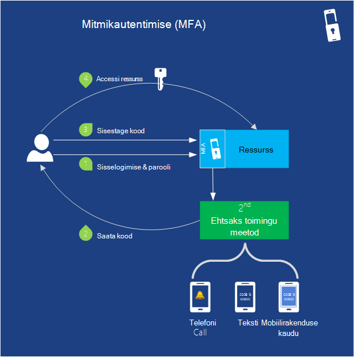   

*Joonis: Mitmikautentimise pakub rohkem kui ühe vormi ID kinnitamiseks rakenduse funktsiooni*

Turvalisus on alati oluline. Mitmikautentimise (MFA) aitab tagada, et ainult kasutaja ise juurde oma kontoga. MFA (tuntud ka kui kahekordne autentimine või "2FA") nõuab kasutajate kaks järgmised kolm võimalust identiteedi kinnitamine kasutaja sisselogimist ja tehingud.

- Asjad, mida teadma (tavaliselt parool)
- Midagi, mida on (usaldusväärne seade pole kerge vaevaga dubleeritud, nt telefoni)
- Midagi, mida on (biomeetria)

Nii kui kasutaja sisse logib, saate nõuda nad ka tema identiteedi mobiilirakenduses, telefonikõne või tekstsõnum koos oma parool. Vaikimisi toetab Azure Active Directory paroolide kasutamise oma ainult autentimise meetodit kasutaja sisselogimist. MFA SDK abil saate kasutada koos Azure AD või kohandatud rakendusi ja kataloogide MFA. Samuti saate selle koos kohapealse rakenduste mitme teguriga autentimine serveri abil.

**MFA stsenaariumid**

Tundliku loomuga kontod, nt panga sisselogimise ja source code access kui volitamata kirje võib olla kõrge finants- või atribuudi maksumus kaitse Logi sisse.   

## Mobile

Kui loote app mobiilsideseadme, aitab Azure'i andmete pilveteenuses talletada, kasutajate autentimiseks ja saatmine tõuketeatised pole vaja palju kohandatud koodi kirjutamine.

Ajal saate koostada kindlasti taustväärtus Virtuaalmasinates, pilveteenustega või Web Apps kasutamine mobiilirakenduses jaoks, saate kulutada palju vähem aega kirjutamise aluseks teenuse komponentide Azure teenuste abil.

### Mobiilirakenduste

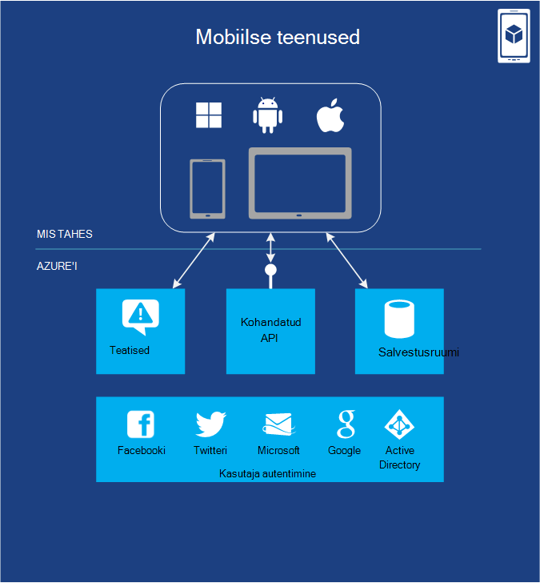

*Joonis: Mobiilirakendused pakub funktsioone, mis on tavaliselt nõutud rakendusi, mis on mobiilsideseadmete jaoks.*

Azure'i mobiilirakenduste kohta leiate palju kasulikke funktsioone, mida saate säästa aega, kui koostamise kirjutamata, mobiilsideseadmete rakenduse. See võimaldab teil teha lihtsaid ettevalmistamise ja SQL-andmebaasis talletatud andmete haldamine. Serveripoolse koodi abil saate hõlpsalt täiendavate andmete talletamise võimalused nagu bloobimälu või MongoDB. Mobiilirakenduste toetab teatised, kuigi teatud juhtudel saate selle asemel kasutada teatis jaoturi, nagu on kirjeldatud edasi.  Teenus on ka REST API-ga, mis teie mobiilirakenduse saate helistada, teha tööd. Mobiilirakenduste pakub võimalus autentida kasutajad Microsofti ja Active Directory kaudu kui ka muude tuntud identiteedipakkujad, nt Facebooki, Twitteri ja Google.   

Saate kasutada muid Azure'i teenuseid, näiteks teenuse siini ja töötaja rollid ja ühenduse loomiseks kohapealse süsteemid. Saab kasutada ka 3 tootja lisandmoodulid Azure'i poest (nt SendGrid e-posti jaoks), anda lisafunktsioone.

Android, iOS-i, HTML-i ja JavaScripti, Windows Phone ja Windowsi poe omakliendi teekide lihtsam põhi mobiilne platvormide rakenduste arendamise. REST API võimaldab teil Mobile teenuste andmeid ja autentimise funktsioonide kasutamine eri platvormide jaoks loodud rakendustega. Ühe mobiilsideteenuse saate tagasi mitme kliendi rakendused nii, et saate sisestada ühtsete kasutuskogemuse kõikides seadmetes.

Kuna Azure toetab suuri skaala juba, saate oma rakenduse vabanemisest populaarsemaks käsitleda liiklus.  Jälgimine ja logimine on toetatud probleemide tõrkeotsinguks ja jõudluse haldamine.

### Teatis jaoturi

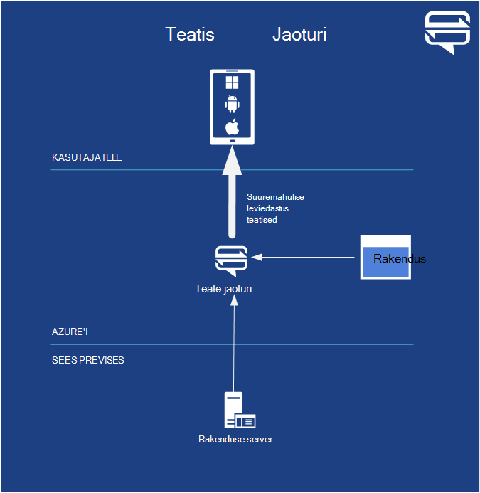  

*Joonis: Teatis jaoturi pakub funktsioone, mis on tavaliselt nõutud rakendusi, mis on mobiilsideseadmete jaoks.*

Ajal koodi teha teatised Azure Mobile'i rakendused kirjutamiseks teatis jaoturi on optimeeritud väga isikupärastatud Tõuketeatiste edastamist miljoneid minuti jooksul.  Te ei pea muretsema kohta üksikasju, näiteks mobiilioperaatori või seadme tootjalt. Saate suunata isik või miljoneid kasutajaid ühe API kõne.

Teatis jaoturi on mõeldud töötamiseks mis tahes taustväärtus. Saate kasutada Azure mobiilirakenduste kohandatud taustväärtus töötavate mis tahes pakkuja pilveteenuses või mõne kohapealse taustväärtus.

**Teatis jaoturi stsenaariumid** Mobiilne mängu, kus mängijad kordamööda kirjutades, peate mängija 2 teatavad, et mängija 1 lõpetanud tema Lülita. Kui see on kõik, mida peate tegema, võite lihtsalt mobiilirakenduste kohta. Kui teil oli 100 000 kasutajat, kuid teie mängu ja saata tundliku tasuta pakkumise kõigile teatis jaoturi on parem valik.

Saate saata uudiseid, spordi-sündmuste ja toote teadaanne teatised miljoneid kasutajaid koos madal latentsus. Suurettevõtete saate teavitage oma töötajatele uue aja tundliku suhtlus, müügivihjed, nt kohta, et töötajad pole pidevalt kontrollida e-posti või muude rakenduste kursis. Lisaks saate saata ühe-tööajaga-paroolid kohustuslikuks mitmikautentimise jaoks.

## Varundamine
Iga ettevõtte peab varundus ja taaste andmed. Azure'i abil saate varundus ja taaste rakenduse kohapealse ja pilveteenuse sisse. Azure'i pakub erinevaid võimalusi sõltuvalt varundamise abil.

### Saidi taastamine

Azure'i saidi taastamine (varem Hyper-V taastamine Manager) aitab teil kaitsta olulised rakenduste koordineerimine kopeerimise ja taastamise saitidel. Saidi taastamine võimaldab kaitsta oma saidi, on hoster saidi või Azure Hyper-v, VMWare või SAN taotluste ja vältida kulude ja keerukuse luua ja hallata oma teisene asukoht. Azure'i krüptib andmeid ja suhtlus ja teil on suvand Luba krüptimise andmete veebisaidil ülejäänud liiga.

See jälgib teenuste seisundit pidevalt ja aitab automatiseerida korrektse taastamise teenuste korral saidi katkestuste esmane andmekeskuse juures. Virtuaalmasinates saate esitada juhitud viisil aitab taastamine teenuse kiiresti, isegi keerukate mitmekihilise töökoormus.

Saidi taastamise töötab olemasolevate tehnoloogiate nagu Hyper-V koopia, System Center ja SQL serveri alati kohta. Vaadake lisateavet [Azure saidi taastamise ülevaade](site-recovery/site-recovery-overview.md) .

### Azure'i varukoopiad
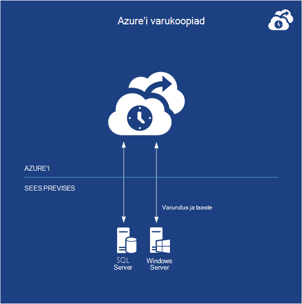  

*Joonis: Azure'i varundus varundab andmeid kohapealse Windows serveritest pilve.*  

Azure'i varundus varundab andmeid kohapealsed serverid, kus töötab Windows Server pilve. Saate hallata oma varukoopiate otse Windows Server 2012, Windows Server 2012 Essentials või System Center 2012 - andmete kaitse Manager varukoopia tööriistu. Teise võimalusena saate eriotstarbelisi varukoopia agent.

Andmed on turvalisem, kuna varukoopiate krüptitud enne edastamist ja talletatud krüptitud rakenduses Azure ja kaitstud sert, mida saate üles laadida. Teenuse kasutab sama liigsete tugevalt andmetega kaitse Azure Storage leitud.  Saate varundada faile ja kaustu regulaarse intervalliga või kohe, kas täieliku või varundamiseks töötab. Pärast andmete varundamise pilveteenusesse, volitatud kasutajad saavad hõlpsalt tagasi varukoopiate serveritega. Samuti pakub konfigureeritav andmete säilituspoliitikate, andmete tihendamise ja andmete edastamiseks pidurdamise nii, et saate hallata maksumus talletamiseks ja andmete edastamiseks.

**Azure'i varukoopiad stsenaariumid**

Kui te kasutate juba Windows Server või System Center, Azure varundus on loomulikus lahendus teie serverid failisüsteemi, virtuaalmasinates ja SQL serveri andmebaasi varundada.  See töötab krüptitud, vähe ja tihendatud faile. Nii, et peaksite [Azure varukoopia eeltingimused märkige](http://technet.microsoft.com/library/dn296608.aspx) esmalt suhtes kehtivad teatud piirangud.

## Sõnumside ja integreerimine

Sõltumata sellest, mida see teeb, peab koodi sageli suhelda muu koodi.  Mõnel juhul kõik, mida on vaja on lihtne järjekorras olevad sõnumid. Muudel juhtudel vajalike keerukamaid populaarsed. Azure'i pakub nende probleemide lahendamiseks mitu võimalust. Joonis 5 illustreerib Valikud.

### Järjekorrad
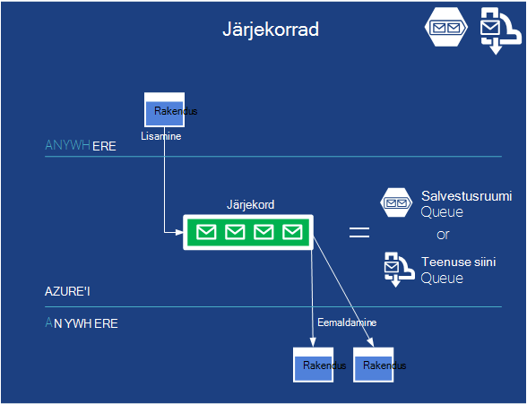

*Joonis: Järjekorrad luba lahti ühendamise rakenduse osade vahel ja hõlbustada skaleerimist.*  

Queuing on lihtne idee: ühe taotluse järjekorda sõnumi paigutab ja lõpuks loetakse see sõnum mõni muu rakendus. Kui teie rakendus peab lihtsalt lihtne teenus, Azure'i järjekorrad võib olla parim valik.

Sellepärast, et selle Azure'i kasvas aja jooksul, Azure'i salvestusruumi järjekorrad ja teenuse siini järjekorrad osutamiseks sarnaseid andmebaasitõrge. Põhjused, miks soovite kasutada üksteise peal asuvad üsna tehniline raamatus [Azure'i järjekorrad ja teenuse siini järjekorrad - võrreldes ja Contrasted](http://msdn.microsoft.com/library/azure/hh767287.aspx).  Paljudel juhtudel kas töötab.

**Järjekorda stsenaariumid**

Täna on üks ühise kasutamise järjekorda lasta web rolli eksemplari töötaja rolli eksemplari sama pilveteenustega rakenduses suhelda.

Näiteks Oletame, et loote Azure rakenduse video jagamiseks. Rakendus koosneb PHP koodi web roll, mille abil kasutajad üles laadida ja vaadata videoid, koos töötaja roll C#, mis tõlgib üleslaaditud video erinevate vorminguid rakendada.

Kui web rolli eksemplari saab uue video kasutajalt, seda talletada video lisamine bloobimälu, siis töötaja rolli kaudu ütleb ta üles leida see uue video järjekorda sõnumeid saata. Töötaja rolli eksemplari it ei oluline, millised neist-saab siis lugeda sõnumit kuhjuda ja teostama nõutud video tõlked taustal.

Rakenduse sel viisil struktureerimine võimaldab asünkroonne töötlemine ja seda ka hõlbustab rakenduse skaala, sest web rolli aknad ja töötaja rolli eksemplaride arv saab muuta sõltumatult. Samuti saate järjekorra suurus käivitamiseks mastaapimiseks töötaja rollide üles-ja allapoole arvu. Liiga suur, ja lisage veel rollid. Kui ta saab alumine, saate vähendada arv, kus töötab säästa.  

Saate seda sama mustri rakenduse paljude erinevate osade vahel isegi siis, kui nad ei kasuta veebi ja töötaja rollid.  See võimaldab teil mastaapimiseks osade kuhjuda üles ja alla nimega nõudmisel mõlemal küljel ja töötlemise ajal nõuab.

### Teenuse siini
Kas nad käivitada pilves, teie andmekeskuse mobiilsideseadmes, või kuhugi mujale, taotlused peavad kasutama. Azure'i teenus siini eesmärk on lasta rakenduste töötamine päris palju andmeid, mis tahes vahetada.

Lisaks järjekorrad (üks-ühele) eespool kirjeldatud, pakub teenuse siini ka muude suhtlusvahendite ees.

#### Teenuse siini edastamine
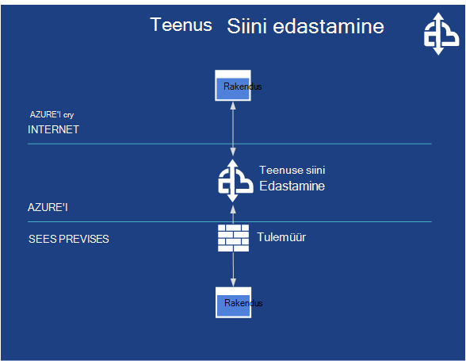

*Joonis: Teenuse siini Relay võimaldab suhtlust rakenduste erinevate külje tulemüür.*

Teenuse siini võimaldab otsest suhtlust oma vahendusteenusesse esitada turvaliselt tulemüürid kaudu suhtlemiseks. Teenuse siini releed lubada rakenduste vahetamise sõnumite majutatud pilves, mitte kohalik lõpp-punkti kaudu suhtlemiseks.

**Teenuse siini Relay stsenaariumid**

Rakenduste kaudu teenuse siini võib olla Azure rakendused või töötab mõni muu pilve platvormi tarkvara. Neid saab ka töötavad väljaspool pilves, kuid rakendused. Näiteks mõelda lennuliin, mis rakendab broneerimiseks teenuste arvutite oma andmekeskuse sees. Lennufirma peab teenuste paljud kliendid, sh sisse kioskis lennujaamade broneerimiseks agent terminalid, jätke ja võib-olla isegi klientide telefonid. See võite kasutada teenuse siini selleks loomise lõdvalt seotud kasutusviisid erinevate rakenduste vahel.

#### Teenuse siini teemade ja tellimused
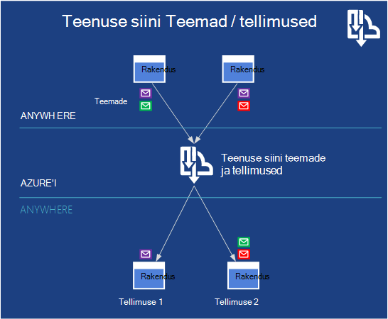   
 *Joonis: Teenuse siini teemade võimaldab sõnumeid postitada ja muude rakenduste tellimise kindlatele kriteeriumidele vastavate meilisõnumite vastuvõtmiseks mitme rakendused.*

Teenuse siini võimaldab avalda ja tellida nimetatakse teemade ja tellimused. Publish-subscribe, rakenduse saate saata sõnumeid teema, samal ajal muid rakendusi saate luua tellimuste teema. See võimaldab üks-mitmele side hulgas kogumi rakendused, lastes sama sõnumit lugeda mitmele adressaadile.

**Teenuse siini teemade ja tellimuste stsenaariumid**

Igal ajal on häälestamiseks, kus on palju sõnumeid, mis on kõik olulised, kuid erinevad järgmise etapi süsteemid ainult vaja kuulata erinevad need suhtlus teenuse siini teema kohta ja tellimused on hea valik.

### BizTalki teenused
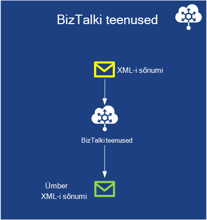   
 *Joonis: BizTalki Services pakub võimalus muuta XML-sõnumite vormide pilveteenuses.*

Mõnikord vaja ühendada, mis vorminguid sõnumside kaudu suhtlemine. See on levinud ettevõtetele on muu andmebaasi skeemi ja XML-i vormingud, sõnumside isegi siis, kui levinud standard on saadaval. Asemel palju kohandatud koodi kirjutamiseks saate erinevate integreerida kohapealse BizTalki serveri.  Azure'i BizTalki Services pakub sama tüüpi teenuse, kuid pilveteenuses. Ainult, mida saate kasutada ja skaala nagu oleksite kohapealse muretsege eest saate maksta.

**BizTalki teenuste stsenaariumid**

Business Business (B2B) kasutusviisid sageli vaja seda tüüpi tõlge.  Näiteks koostamise lennukid ettevõte peab tellimuse osad, see on erinevate osade tarnijad. See on palju osade tarnijad.  Tellimusi peaks automatiseeritud tarnijate süsteemid otse lennukikujuline ehitajad süsteemid minna.  Määratud pole kumbagi business soovib core süsteemide ja sõnumi vormingu muutmine ja see on tõenäoline, et neid vorminguid on samad. BizTalki teenuste võtta sõnumeid ja uute vormingute mõlemaid viise tõlkimine. Kas lennukikujuline tarnija saab teha töö tõlkimiseks või tarnijate saab, olenevalt sellest, kes soovib rohkem võimalusi ja tõlge vajalik summa.     

## Arvutage abi
Azure'i aitab teenused, mida soovite käivitada kogu aeg.  

### Ajasti

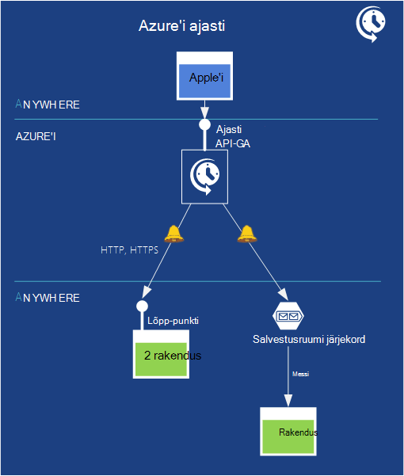   
*Joonis: Azure'i Scheduler võimaldab kavandada töö teatud ajal teatud aja jooksul.*

Mõnikord vaja rakenduste ainult teatud ajal käivitada. Azure, saate salvestada raha seda tüüpi rakenduse asemel et rakendus lihtsalt hoida töötab 24 x 7 andmete töötlemiseks ootamine. Azure'i Scheduler võimaldab teil ajakava rakenduse käitamise vastavalt intervall või kalendri. See on usaldusväärne ja kinnitama, et protsess töötab ka siis, kui on võrgu, seadme ja andmete keskmist ebaõnnestumist. Ajasti REST API abil saate hallata neid toiminguid.

Ajastatud alarm ilmnemisel Scheduler saadab HTTP- või HTTPS sõnumite kindla lõpp-punkti või saate sellele sõnumile salvestusruumi järjekorda.  Seega peate on teie taotlus on juurdepääsetav lõpp- või on see jälgimine salvestusruumi järjekorda. Seejärel kui ta saab sõnumi, saate selle mis tahes programmeeritakse toimingut teostada.

**Ajasti stsenaariumid**

- Korduva rakenduse toimingud: näiteks võib teenuse perioodiliselt andmete toomine Twitteri ja üheks tavaline kanali andmete kogumine.
- Igapäevane hooldus: Log töötlemine või pügamine, tegelik varukoopiate ja muude aeg-ajalt plaanimine tööülesanded.
- Tööülesandeid, mis töötavad öösel.
- Web rakendused tööülesanded nagu igapäevane kärpimine logide, varukoopiate ja muude hooldustoiminguid. Administraator valida näiteks kell 1 9 järgmise kuu, iga päev oma andmebaasi varundada.

Scheduler API võimaldab teil luua, värskendada, kustutada, vaadata ja hallata töö saidikogumite ja ajastatud tööd programmiliselt.

## Jõudluse

Jõudluse on alati rakenduse jaoks oluline. Rakenduste tavaliselt juurdepääs korduvalt samu andmeid. Jõudluse parandamiseks üks viis on talletaks rakendusse, minimeerimine aega, et neid andmeid lähemale. Azure'i pakub erinevate sellega.

### Azure'i vahemällu talletamine

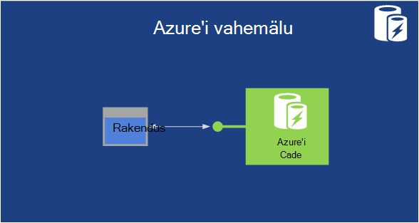   
 **Joonis: Azure'i rakenduse saab mälu andmete vahemälu ja ka kaheks seda üle mitme töötaja rollid**

Juurdepääs talletatud teenuste-SQL-andmebaasiga, tabelite või plekid Azure andmehaldus – on üsna kiire. Veel juurdepääs mälu talletatavad andmed on ka kiirem. Seetõttu säilitamise mälu-koopia sageli külastatud andmeid saate rakenduse jõudlust parandada. Saate seda teha Azure-mälu vahemälu.

Pilveteenuste rakenduse vahemälu andmete talletamiseks ja seejärel neid otse ilma püsivate salvestusruumi juurde. Vahemälu saab hoida oma rakenduse VMs sees või mida VMs, mis on mõeldud ainult vahemällu. Mõlemal juhul vahemälu saab levitada, andmetega see sisaldab ümbruses üle mitme VMs on Azure andmekeskuses.

Azure'i on mitmeid erinevaid vahemälu tehnoloogiaid, mis on nihutatud ajas. Sisse järjestuses on ühiskasutuses, rolli sisse, hallata ja Redis vahemälu. Ühiskasutusega vahemällu on vanem tehnoloogia ja ei tohiks sellega luua uue rakendusi. Hallatavate vahemälu on tolli-rolli vahemälu, kuid väljaspool Azure'i haldusportaal hallatav teenus sarnaseid funktsioone. Redis vahemälu on eelvaade. Redis rakendamist on kõige rohkem funktsioone ja on soovitatav, kui saate uue vahemällu koodi kirjutamine.

**Azure'i vahemälu stsenaariumid**

Rakendus, mis loeb korduvalt tootekataloogi võib kasu kasutades seda tüüpi vahemällu, näiteks, kuna andmeid vajab kättesaadavuse tagamiseks kiiremini. Tehnoloogia toetab samuti lukustamine, lastes lugemis-ja kirjutamisõigusega kui ka kirjutuskaitstud andmeid kasutada. Ja ASP.net-i rakendusi saate kasutada teenust seansi konfiguratsiooni muuta andmete talletamiseks.

### Sisuedastusvõrgud
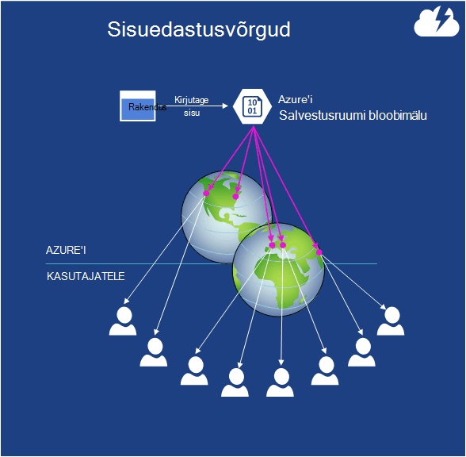   
 **Joonis: Eksemplari on bloobimälu saab kopeerida sites kogu maailmas.**

Oletame, et peate salvestama bloobimälu andmeid, mis ei pääse kasutajad kogu maailmas. Võib-olla on video populaarsed e-raamat uusima MK vastet, näiteks või draiveri värskendusi. Andmete koopia säilitamiseks mitme Azure'i andmekeskuste aitab, kuid kui seal on palju kasutajate, ilmselt ei piisa. Isegi parema jõudluse, saate kasutada Azure CDN.

Funktsiooni CDN on kümneid saitidel kogu maailmas, iga saab hoida Azure plekid koopiad. Mingi osa maailma kasutaja pääseb juurde kindla bloobimälu, esimest korda selles sisalduvat teavet on kopeerida mõne Azure andmekeskuse kohalikku CDN talletusruumi selle geograafia. Pärast seda, kasutatakse avab maailma sellest osast bloobimälu Kopeeri vahemälus on CDN-nad ei vaja minna täiesti lähima Azure'i andmekeskusega. Tulem on kiirem sageli külastatud andmete puhul kogu maailmas kasutajate juurdepääs.

**CDN stsenaariumid**

On tavaline läbiviimist CDN teenustega Media video kogu maailma ulatuses. Video on tavaliselt suur ja nõuab palju ribalaiust.  Media Servicesi on rääkis mujal sellel lehel.

## Big Data ja suur Arvuta

### Hdinsightiga (Hadoopi)
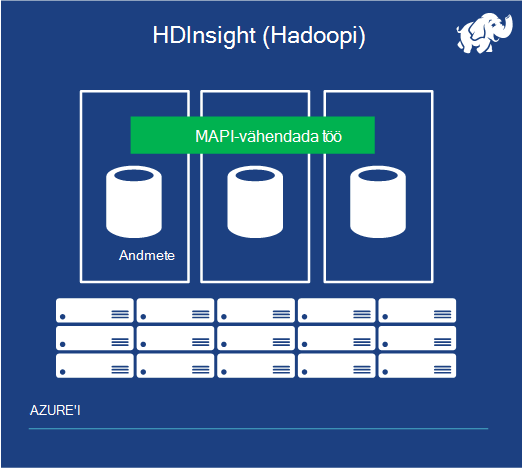   
 **Joonis: Hdinsightiga aitab andmed hulgi töötlemine**

Aastaid andmeanalüüsi hulgi on tehtud relatsiooniliste andmete talletatud ehitatud relatsiooniline DBMS andmebaas. Seda tüüpi ärianalüüsi on endiselt oluline ja oleks tulnud kaua aega. Kuid mida teha, kui andmeid soovite analüüsida on nii suur, et relatsiooniandmebaasid lihtsalt ei saa seda teha? Ja Oletame, et andmed ei relatsiooniline? See võib olla server logib andmekeskuses, näiteks või ajaloolise sündmuse andmeid anduritelt või midagi muud. Juhtudel, teil on suur andmete probleem nn. Teine võimalus on vaja.

Täna suur andmete analüüsimiseks domineerivaks tehnoloogia on Hadoopi. Andmeallika projekti avada Apache, see tehnoloogia salvestab andmed, kasutades funktsiooni Hadoopi jaotatud faili süsteemi (HDFS), siis võimaldab arendajatel luua MapReduce töö, et andmeid analüüsida. HDFS kahel andmete mitme serverites, siis käivitatakse osa MapReduce töö igas seadmes, lastes suur andmeid töödeldakse samal ajal.

Hdinsightiga on selle Azure'i Apache Hadoop-põhiste teenuste nimi. Hdinsightiga võimaldab HDFS klaster andmete talletamiseks ja levitada seda üle mitme VMs. See ka kahel MapReduce töö loogika üle need. Nii nagu kohapealse Hadoopi, kus andmed on töödeldud kohalikult the loogika ja see töötab andmed sama VM- ja samal ajal parema jõudluse. Hdinsightiga saate salvestada ka andmete sisse Azure'i salvestusruumi Vault (ASV), mis kasutab plekid.  Kasutades ASV võimaldab säästa, kuna kustutamine Hdinsightiga klaster, kui ei ole kasutusel, kuid teie andmeid ikkagi ka pilveteenuses alles hoida.

Hdinsightiga toetab muude komponentide Hadoopi ökosüsteemi, sh taru ja siga. Microsoft on loonud ka komponendid, mis hõlbustavad toodetud Hdinsightiga andmetega töötamiseks traditsiooniline Ärianalüüsi tööriistade abil, nagu HiveODBC adapterit ja andmete Exploreri, millega Excel töötada.

### Suure jõudlusega arvutuste (suur Arvuta)

Üks kõige kena ülevaate, kuidas kasutada pilve platvormi on suure jõudlusega arvutuste (HPC) ja muude "Suur arvutada" rakenduste käivitamiseks. Näiteks eriotstarbelisi engineering rakendusi kasutada industry-standard sõnumi läbides kasutajaliidese (MPI) kui ka nn piinlikult paralleelselt rakendusi, sellised rahandus risk mudelid ehitatud.

Suur arvutada sisuliselt on koodi korraga palju masinad käivitamisel. Azure, tähendab see töötab paljud virtuaalse masinad korraga, kõik töötab samal ajal mõned probleemi lahendada. Selle jaoks on vaja kuidagi ressursid ja rakendused, st kavandada, levitada oma töid üle nende aknad. Microsofti tasuta HPC Pack ja muid Arvuta kobar lahendusi ka Azure, Azure Arvuta ja taristu teenused tellitavate võimsus lisamiseks on kohapealse arvutikobaraga või käivitada suur arvutada rakendusi täiesti pilves ära teha.

Azure'i pakub VM vahemiku eksemplari suurused eri konfiguratsioone CPU südamikud, mälu, ketta maht ja muid omadusi erinevates rakendustes nõuetele vastavuse abil. Hiljuti kasutusele A8 ja A9 eksemplarid töö paljude jaoks Arvutage intensiivse töökoormus ja paralleelsete MPI rakenduste, kuna need on kiire, mitmesoonelised protsessorid ja suure hulga. Teatud konfiguratsioone linnanimede ära latentsusajaga ja suure läbilaskevõimega rakendus võrgu pilves, mis sisaldab serveri otsest mälu juurdepääs (RDMA) tehnoloogia maksimaalne tõhusust paralleelselt MPI rakendusi.

Azure'i pakub suur arvutada rakenduste arendajatele ja partnerite kogum Arvuta võimalusi, teenused, arhitektuur valikuid ja arengu tööriistad. Azure'i toetab kohandatud suur arvutada töövoogude seotud eripärase andmete töövood ja töö ja ülesande ajastamine mustrite, mida saab skaala tuhandete arvutada tuuma.

## Meediumi

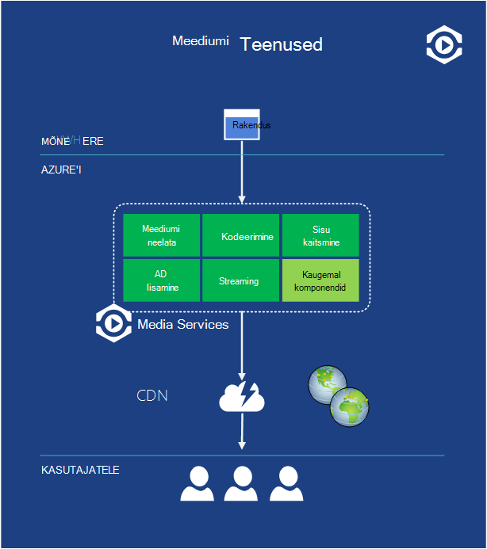   
 **Joonis: Media Servicesi on platvorm rakendusi, mis pakuvad video- ja muude meediumide klientidele kogu maailmas.**

Video moodustab Interneti-liikluse suur osa täna ja protsentuaalne vajavate isegi homme. Veel video esitada veebis pole lihtne. On palju muutujad, näiteks kodeering algoritmi tegemine ja kasutaja ekraani kuvamine. Video ka tavaliselt on lõhkemiseni nõudmisel, nt laupäev kühvli, kui palju inimesi otsustada, soovite vaadata ka online filmi.

Kuna selle populaarsus, on kindel, et uus rakendustele luuakse selle video kasutamine. Veel kõik need tuleb lahendada mõned samad probleemid ja teha igat oma teeb nende probleemide lahendamiseks ei tunne. Parem lähenemine on luua platvorm, mis pakub palju rakendusi kasutada levinud lahendusi. Ja see platvorm pilveteenuses koostamise Eemalda eelised. See võib olla laiemalt kättesaadavaks pensionitingimustega alusel ja toime ka hajuvuse video rakendusi tihti nõuda sisse.

Azure Media Servicesi aadressid probleemi. Pakub pilve komponentide, mis elu lihtsamaks inimeste loomine ja kasutamine, video-ja muude rakenduste jaoks.

Nagu joonisel on näidatud, pakub Media Servicesi rakendusi, mis töötavad koos video ja muude meediumide osade kogum. Näiteks see sisaldab meedia neelata komponent video üleslaadimiseks rakendusse Media Services (kui see on salvestatud Azure plekid), kodeering osa, mis toetab erinevate video- ja helifailide vormingud, sisu kaitse osa, mis pakub digitaalõiguste halduse, komponent reklaamid lisamine video voogesitus, streaming komponendid ja muud. Microsofti partnerite saate ka selliseid osast platvormi, siis on Microsoft levitamine nende komponentide ja nende nimel bill.

Rakendustes, mis kasutavad seda platvormi saab käitada Azure või mujal. Näiteks töölauarakendus jaoks videoproduktsiooni maja võivad kasutajad oma video üleslaadimine Media Servicesi, siis töödelda mitmel viisil. Teise võimalusena võib toetuvad pilvepõhist sisuhaldus teenus, mis töötab Azure Media Servicesi töötlemine ja video. Kuhu see töötab ja mida iganes see, valib konkreetse rakenduse mis komponendid kasutamiseks läheb vaja juurdepääs failidele peaaegu rahulik liideste kaudu.

Levitada, mis toodab, saate rakenduse Azure'i CDN, teise CDN-ID, või lihtsalt bittide otse kasutajatele saatmiseks. Kuid ta saab seal, Media Services abil loodud video saate tarbitud erinevad kliendi abil, sh Windows, Macintosh, HTML 5, iOS-i, Android, Windows Phone, Flash ja Silverlight. Eesmärk on lihtsam kaasaegse meedia rakenduste loomine.

**Viited**

Veel visuaalse ülevaate Media Servicesi tööpõhimõte, laadige alla [Azure Media Services plakati][Azure Media Services Poster].

## Äri

Tõus tarkvara kui teenus on muutnud, kuidas saate luua rakendusi. Samuti on muutnud, kuidas müüme rakendused. Kuna SaaS rakendus asub pilves, on mõistlik, mis võimaliku klientide peaks välja nägema lahendusi võrgus. Ja see muudatus kehtib ka rakenduste andmed. Miks ei tohiks inimesed otsima pilveteenusesse andmekomplektide äriliselt saadaval? Microsoft aadressid nii neid probleeme [Azure'i turuplatsilt](https://azure.microsoft.com/marketplace/).

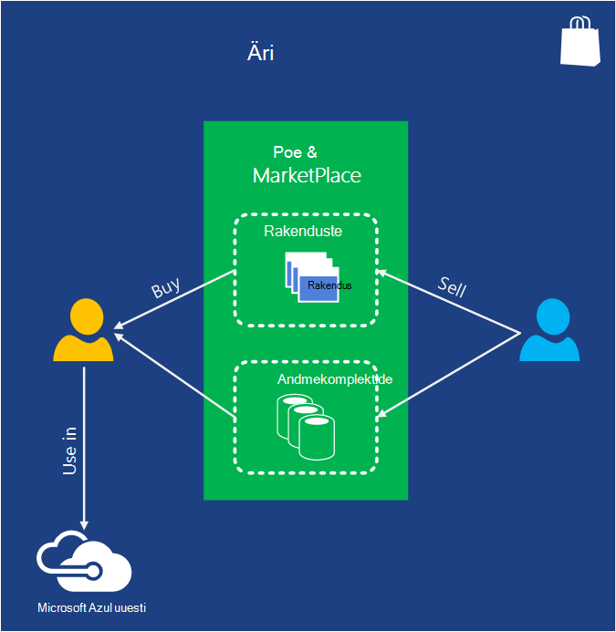   
 **Joonis: Azure'i turuplats ja Azure Store abil saate otsida ja Azure rakendused ja trükikojas andmekomplektide osta ja kasutada neid Azure rakenduste osana.**

Kahe vahe on turuplats on väljaspool Azure'i haldusportaal, et pood pääseb portaali sees. Potentsiaalseid kliente saate otsida leida Azure rakendused oma vajadustele. Klientide saate otsida trükikojas andmekomplektide ka, sh uuringu, finantsandmete, geograafilised andmed ja muud. Kui ta ei leia midagi, pääsevad hankija, kas otse veebiasukohad turuplatsi või poe kaudu või mõnel juhul portaalis haldus. Rakendusi saate kasutada ka Bingi otsingu API kaudu turuplatsilt, andes neile access web otsingute tulemusi.

**Äri stsenaariumid**

SendGrid on Azure poes, mis võimaldab teil saada e-posti rakendus. See pakub täiendavaid funktsioone nagu usaldusväärse kohaletoimetamise ja statistika.  Te saate selle rakenduse ja seotud teenuste ostmine asemel koostada selline infrastruktuur ise proovida.  

## Alustamine

Nüüd, kui teil on suur pilt, on järgmiseks kirjutada esimese Azure rakenduse. Valige soovitud keel, [saada vastav SDK](/downloads/), ja avage see. Pilveteenuse arvutuste on uus vaikevorming--Alusta kohe.

[Azure Media Services Poster]: http://azure.microsoft.com/documentation/infographics/media-services/
