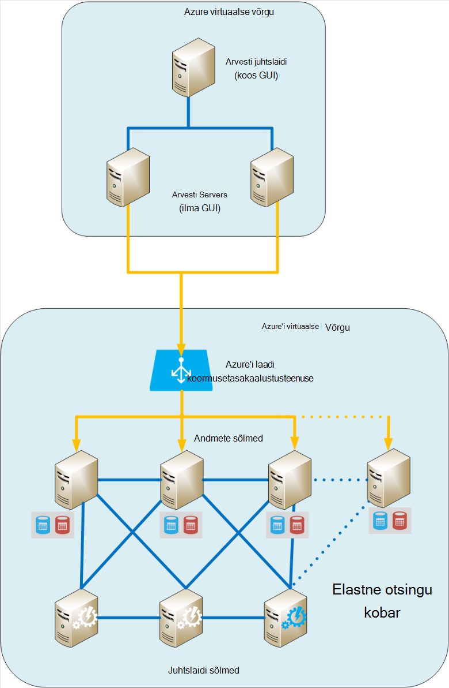
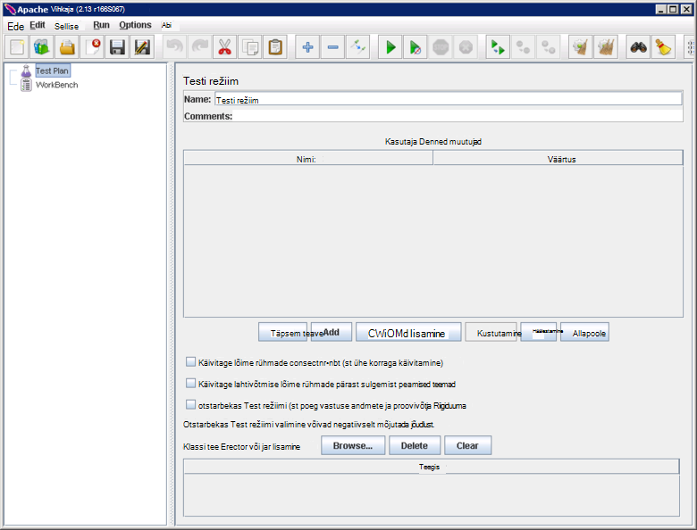
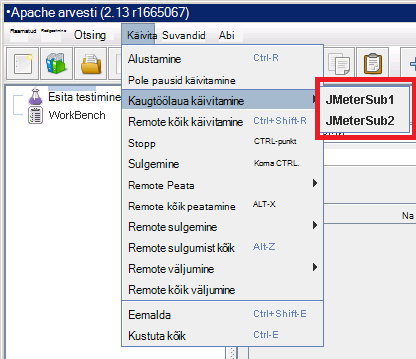
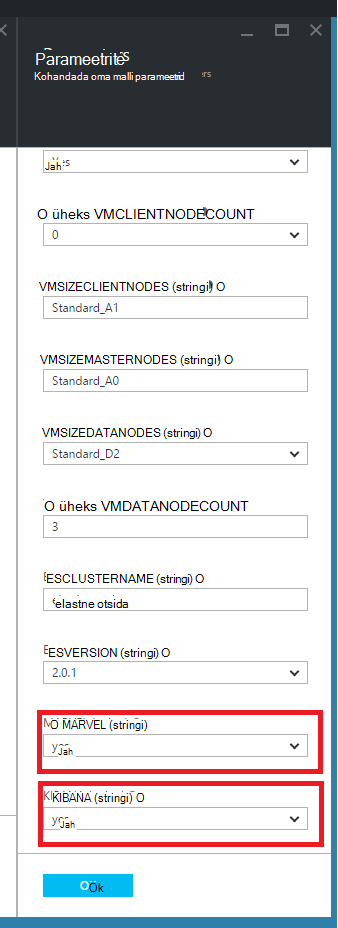
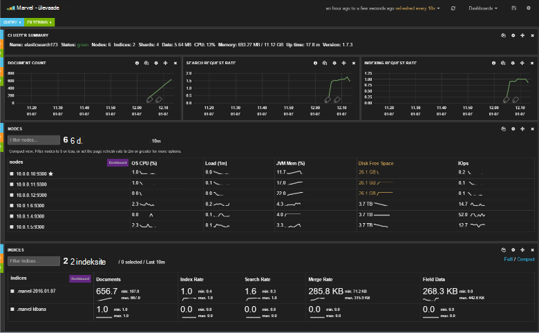
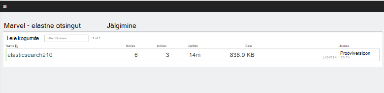
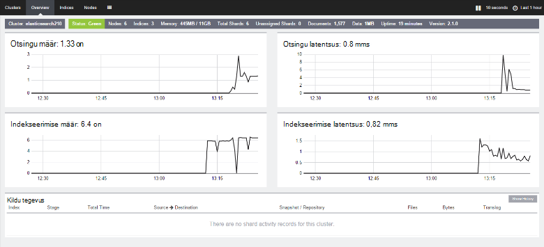

<properties
   pageTitle="Luua testimine keskkonna Elasticsearch tulemuslikkuse | Microsoft Azure'i"
   description="Kuidas häälestada mõne Elasticsearch kobar jõudlus testimiseks keskkonnas."
   services=""
   documentationCenter="na"
   authors="dragon119"
   manager="bennage"
   editor=""
   tags=""/>

<tags
   ms.service="guidance"
   ms.devlang="na"
   ms.topic="article"
   ms.tgt_pltfrm="na"
   ms.workload="na"
   ms.date="09/22/2016"
   ms.author="masashin"/>
   
# <a name="creating-a-performance-testing-environment-for-elasticsearch-on-azure"></a>Luua tulemuslikkuse Elasticsearch Azure keskkonna testimine

[AZURE.INCLUDE [pnp-header](../../includes/guidance-pnp-header-include.md)]

See artikkel on [osa sarjast](guidance-elasticsearch.md). 

Selles dokumendis kirjeldatakse, kuidas häälestada mõne Elasticsearch kobar jõudlus testimiseks keskkonnas. Selle konfiguratsiooni kasutati testida andmed manustamisest ja päringu töökoormus, nagu on kirjeldatud [Tuning andmete manustamisest jõudlust Elasticsearch Azure][].

Jõudluse testimise kasutada [Apache JMeter](http://jmeter.apache.org/), on [seatud standard](http://jmeter-plugins.org/wiki/StandardSet/) juhtslaidi/alluva konfiguratsiooni, kasutades asjakohast VMs (mitte osa Elasticsearch kobar) spetsiaalselt konfigureeritud otstarbel installitud lisandmoodulite. 

[Perfmoni Serveri Agent](http://jmeter-plugins.org/wiki/PerfMonAgent/) installiti iga Elasticsearch sõlme. Järgmistes jaotistes taasloomine testi keskkonna juhised selleks, et saaksite korraldada oma jõudluse testimine JMeter. Järgmised juhised eeldavad, et olete juba loonud mõne Elasticsearch kobar koos sõlmed on Azure virtuaalse võrku ühendatud. 

Pange tähele, et test keskkond töötab ka ühe Azure ressursirühm abil hallata Azure VMs kogumina.

[Marvel](https://www.elastic.co/products/marvel) on ka installinud ja konfigureerinud lubamiseks sisemise aspektide Elasticsearch kobar jälgida ja analüüsida hõlpsam. Kui JMeter statistika ilmnes tippväärtus või minimaalse jõudlust, Marvel kaudu kättesaadavaks teave võib olla eriti abiks juhul kindlaks teha, on muutuste põhjus.

Järgmisel pildil on kujutatud kogu süsteemi struktuuri. 



Võtke arvesse järgmist.

- JMeter juhtslaidi VM käivitatakse Windows Server pakkuda GUI keskkonna JMeter konsooli. JMeter juhtslaidi VM pakub GUI ( *jmeter* rakendus) lubamiseks tester katsete loomiseks analüüse ja tulemused visualiseerida. See VM koordinaadid JMeter serveriga VMs, mis tegelikult päringuid, mis moodustavad testide.

- JMeter alluv VMs käivitada Ubuntu Server (Linux), ei ole GUI need vms. JMeter serveri VMs käivitage JMeter serveritarkvara ( *jmeter-server* rakendus) Elasticsearch kobar päringuid saata.

- Sihtotstarbeline kliendi sõlmed ei kasutata, kuigi sihtotstarbeline juhtslaidi sõlmed olid.

- Andmete sõlmed klaster arvu saate erinevad sõltuvalt seda stsenaariumi testitakse.

- Kõik sõlmed Elasticsearch klaster käivitage ime, et jälgida käitusajal jõudlus ja JMeter Server Agent koguda jälgimisega seotud andmed hilisemaks analüüsiks.

- Kui katsetamine Elasticsearch 2.0.0 ja hiljem, üks andmete sõlmed töötab ka Kibana. See on vajalik versioon Marvel, mis töötab Elasticsearch 2.0.0 ja uuemad versioonid.

## <a name="creating-an-azure-resource-group-for-the-virtual-machines"></a>Luua ka Azure ressursi rühma jaoks soovitud virtuaalmasinates

Juhtslaidi JMeter peab olema saab ühendada otse iga sõlmed Elasticsearch klaster jõudlusandmeid koguda. Kui JMeter VNet erineb Elasticsearch kobar VNet, siis sellega konfigureerimine iga Elasticsearch sõlm avaliku IP-aadressiga. Kui see on teie Elasticsearch konfiguratsiooni probleem, siis leiavad JMeter VMs rakendamisel sama VNet nimega Elasticsearch kobar, kasutades ühte ressursirühma, mille puhul saate argument esimese järgmist.

Esmalt [looge ressursirühma](../resource-group-template-deploy-portal.md). Selle dokumendi eeldab ressursirühma nimega *JMeterPerformanceTest*. Kui soovite sama VNet nimega Elasticsearch kobar JMeter VMs käivitamiseks, kasutage selle asemel luua uue eksemplari kobar ühte ressursirühma.

## <a name="creating-the-jmeter-master-virtual-machine"></a>JMeter juhtslaidi virtuaalse masina loomine

Järgmise [luua Windows VM](../virtual-machines/virtual-machines-windows-hero-tutorial.md) abil *Windows Server 2008 R2 SP1* pilt.  Soovitatav on valida suvand VM suurus piisavalt ja -vormid mälu jõudluse testide abil. Ideaalvariandis mitte sellest saab masina koos vähemalt 2 ja -vormid 3,5 GB muutmälu (A2 standardne või suurem).

<!-- TODO add info on why disabling diagnostics is positive --> 

Soovitame, et keelata diagnostika. Portaali VM loomisel on seda teha enne *sätted* jaotises *diagnostika*jaotises *jälgimine* . Jätke vaikeväärtused ka muud sätted.

Veenduge, et VM ja seotud ressursid on loodud [läbivaatamise ressursirühma](../azure-portal/resource-group-portal.md#manage-resource-groups) portaalis. Ressursse, mis on loetletud peaks koosnevad VM, turberühma võrgu ja sama nimega avaliku IP-aadress ja võrgu kasutajaliidese ja salvestusruumi konto nimed, mis VM põhjal.

## <a name="creating-the-jmeter-subordinate-virtual-machines"></a>JMeter alluv virtuaalmasinates loomine

Nüüd [looge Linux VM](../virtual-machines/virtual-machines-linux-quick-create-portal.md) kasutades *Ubuntu Server 14.04 LTS* pilt.  Sarnaselt JMeter juhtslaidi VM, valige VM suurus piisavalt ja -vormid mälu jõudluse testide abil. Ideaalvariandis mitte sellest saab masina vähemalt 2 tuuma ja vähemalt 3,5 GB muutmälu (Standard A2 või suurem).

Uuesti, soovitame keelata diagnostika.

Saate luua nii palju alluv VMs nii, nagu soovite. 

## <a name="installing-jmeter-server-on-the-jmeter-subordinate-vms"></a>JMeter alluv VMs JMeter serveri installimine

JMeter alluv VMs töötab Linux ja vaikimisi te ei saa neid, avades kaugtöölaua ühendus (RDP). Selle asemel saate [kasutada käsurea akna avamiseks PuTTY](../virtual-machines/virtual-machines-linux-mac-create-ssh-keys.md) iga VM.

Kui olete ühendatud ühele alluv VMs, kasutame Bash JMeter häälestamine.

Installige kõigepealt Java Runtime keskkond JMeter käitamiseks nõutavad.

```bash
sudo add-apt-repository ppa:webupd8team/java
sudo apt-get update
sudo apt-get install oracle-java8-installer
```

Nüüd allalaadimine JMeter tarkvara zip-failina.

```bash
wget http://apache.mirror.anlx.net/jmeter/binaries/apache-jmeter-2.13.zip
```

Installige kasutageunzip käsk ja seejärel seda kasutada JMeter tarkvara laiendamiseks. Tarkvara kopeeritakse kausta nimega **apache-jmeter-2.13**.

```bash
sudo apt-get install unzip
unzip apache-jmeter-2.13.zip
```

Hoidke JMeter täitmisfailid *prügikasti* kataloogi muuta, ja tehke *jmeter-serveri* ja *jmeter* programmide käivitatava.

```bash
cd apache-jmeter-2.13/bin
chmod u+x jmeter-server
chmod u+x jmeter
```

Nüüd, tuleb faili redigeerimiseks `jmeter.properties` praeguses kaustas (kasutage tekstiredaktoris, mis on teile tuttavad kõige, nt *vi* või *vim*). Leidke järgmised read.

```yaml
...
client.rmi.localport=0
...
server.rmi.localport=4000
...
```

Kommenteerige välja (eemaldamine juhtiva \## märke) ja muuta nende ridade, nagu on näidatud allpool, ja seejärel salvestage fail ja sulgege redaktor:

```yaml
...
client.rmi.localport=4441
...
server.rmi.localport=4440
```

Nüüd, käivitage järgmised käsud avamiseks TCP liiklust port 4441 (see on äsja konfigureeritud *jmeter-server* kuulata pordi):

```bash
sudo iptables -A INPUT -m state --state NEW -m tcp -p tcp --dport 4441 -j ACCEPT
```

Laadige alla zip fail, mis sisaldab standard kogum lisandmoodulid JMeter (need lisandmoodulid pakuvad jõudluse jälgimisega seotud hinnale) ja siis lahti **apache-jmeter-2.13** kausta fail. Selles asukohas faili unzipping paigutab selle lisandmoodulid õige kausta.

Kui teilt küsitakse asendada litsentsi faili, võite tippida tähe A (jaoks):

```bash
wget http://jmeter-plugins.org/downloads/file/JMeterPlugins-Standard-1.3.0.zip
unzip JMeterPlugins-Standard-1.3.0.zip
```

Kasutage `nohup` käivitada JMeter server taustal. See vastaks, kuvades protsessi ID ja sõnum, mis näitab, et see on loonud remote objekti ja on valmis saanud käsud.  Käivitage järgmine käsk ~/apache-jmeter-2.13/bin kataloogis. 

```bash
nohup jmeter-server &
```

> [AZURE.NOTE]Kui VM on sulgumist lõpetatakse JMeter server programm. Peate ühenduse VM ja taaskäivitage see uuesti käsitsi. Teise võimalusena saate konfigureerida süsteemi käsk *jmeter-server* automaatselt käivituma käivitamisel, lisades järgmised käsud on `/etc/rc.local` faili (enne käsu *väljumine 0* ):

```bash
sudo -u <username> bash << eoc
cd /home/<username>/apache-jmeter-2.13/bin
nohup ./jmeter-server &
eoc
```

Asendage `<username>` koos oma kasutajanimi.

Võite leida selle kasulik hoida terminal aknas avatud nii, et saaksite jälgida edenemist JMeter serveri töötamise testimine.

Peate korrake neid juhiseid iga JMeter alluv VM.

## <a name="installing-the-jmeter-server-agent-on-the-elasticsearch-nodes"></a>Elasticsearch sõlmed JMeter Serveri Agent installimine

See toiming eeldab, et teil on sisselogimise juurdepääsu Elasticsearch sõlmed. Kui olete loonud klaster ressursihaldur malli abil, saate luua ühenduse iga sõlme kaudu välja hüpata VM, nagu on näidatud [Töötab Elasticsearch Azure](guidance-elasticsearch-running-on-azure.md)Elasticsearch topoloogia osas. Saate luua ühenduse abil PuTTY ka hüpata välja. 

Sealt saate kasutada *ssh* käsk iga sõlmed Elasticsearch klaster sisse logida.

Logige administraatorina sisse ühele Elasticsearch sõlmed.  Käsuviibas Bash sisestage järgmised käsud hoidmiseks JMeter Serveri Agent kausta loomiseks ja selle kausta teisaldada.

```bash
mkdir server-agent
cd server-agent
```

Käivitage järgmised käsud installimiseks *pakkige see lahti* käsk (kui see pole juba installitud), JMeter Server Agent tarkvara alla laadida ja pakkige see lahti.

```bash
sudo apt-get install unzip
wget http://jmeter-plugins.org/downloads/file/ServerAgent-2.2.1.zip
unzip ServerAgent-2.2.1.zip
```
 
Käivitage järgmine käsk Konfigureerige tulemüür ja lubada TCP liikluse läbib pordi 4444 (see on JMeter serveri agent kasutatav port):

```bash
sudo iptables -A INPUT -m state --state NEW -m tcp -p tcp --dport 4444 -j ACCEPT
```

Alustamiseks JMeter Serveri Agent taustal järgmine käsk:

```bash
nohup ./startAgent.sh &
```

JMeter Serveri Agent tuleks vastata sõnumitele, mis näitab, et see on hakanud ja pordi 4444 on kuulamise.  Vajutage sisestusklahvi Enter saada Käsuviip ja käivitage järgmine käsk.

```bash
telnet <nodename> 4444
```

Asendage `<nodename>` teie sõlm nimega. (Leiate töötab teie sõlme nimi on `hostname` käsu.) See käsk avab Telneti ühenduse pordi 4444 oma kohalikus arvutis. See ühendus abil saate kontrollida, kas JMeter Serveri Agent töötab õigesti.

Kui JMeter Serveri Agent ei tööta, saate vastuse 

`*telnet: Unable to connect to remote host: Connection refused*.`

Kui JMeter Serveri Agent töötab ja pordi 4444 on õigesti konfigureeritud, peaksite nägema järgmine vastus:


> [AZURE.NOTE] Telneti seanssi ei anna mingit viip kui seade on ühendatud.

Telneti seansi, tippige järgmine käsk:

``` 
test
```

Kui JMeter Server on konfigureeritud ja listening õigesti, see näitab, et saanud käsu ja vastata sõnumi *Jah*.

> [AZURE.NOTE]Tippige muude käskude saavutamiseks jälgida andmeid. Näiteks käsk `metric-single:cpu:idle` teile praeguse osakaalu aega, mida CPU on jõudeolekus (see on hetktõmmise). Käskude täieliku loendi leiate lehelt [Perfmoni Serveri Agent](http://jmeter-plugins.org/wiki/PerfMonAgent/) . : Tagasi, et see helistamiseks ta Perfmoni Serveri Agent. >>

Telneti seansi, tippige seanss ja naasmiseks Bash käsuviipa järgmine käsk:

``` 
exit
```

> [AZURE.NOTE]Kui soovitud JMeter alluvate VMs, kui logite või kui selles arvutis on sulgemine ja uuesti siis JMeter Server Agent tuleb taaskäivitada käsitsi, kasutades funktsiooni `startAgent.sh` käsk. Kui soovite JMeter Serveri Agent automaatselt käivituma, lisage järgmine käsk lõppu on `/etc/rc.local` faili enne käsu *väljumine 0* . 
> Asendage `<username>` koos oma kasutajanimi:

```bash
sudo -u <username> bash << eoc
cd /home/<username>/server-agent
nohup ./startAgent.sh &
eoc
```

Nüüd kas korrake selle protsessi iga muude sõlm Elasticsearch kobar või saate selle `scp` käsk serveri agent kausta ja sisu kopeerimiseks iga sõlm ja kasutage soovitud `ssh` käsk Käivita JMeter Serveri Agent, nagu allpool näidatud. e Asenda `<username>` oma kasutajanimi ja `<nodename>` sõlm, kuhu soovite kopeerida, ja käivitage tarkvara (teil võidakse paluda esitada oma parooli, nagu iga käsk) nimi:

```bash
scp -r \~/server-agent <username>@<nodename>:\~
ssh <nodename> sudo iptables -A INPUT -m state --state NEW -m tcp -p tcp --dport 4444 -j ACCEPT
ssh <nodename> -n -f 'nohup \~/server-agent/startAgent.sh'
```

## <a name="installing-and-configuring-jmeter-on-the-jmeter-master-vm"></a>Installimine ja konfigureerimine JMeter JMeter juhtslaidi VM

Azure'i portaalis, klõpsake **Ressursi rühmad**. Klõpsake **Ressursi rühmade** labale JMeter juhtslaidi ja alluv VMs sisaldavad ressursirühma.  Klõpsake **ressursirühm** labale **JMeter juhtslaidi VM**. Virtuaalse masina tera, klõpsake tööriistaribal käsku **Ühenda**. Avage veebibrauser küsimise RDP-faili. Windows loob kaugtöölaua ühendus oma VM.  VM Küsimisel sisestage kasutajanimi ja parool.

Internet Exploreris VM, minge lehele [Windowsi jaoks mõeldud Java alla laadida](http://www.java.com/en/download/ie_manual.jsp) . Järgige alla laadida ja käivitada Java installiprogramm.

Veebibrauseris, minge lehele [Apache JMeter alla laadida](http://jmeter.apache.org/download_jmeter.cgi) ja laadige alla zip, mis sisaldavad viimase kahendarvuks. Salvestage zip sobivasse asukohta oma VM.

Minge saidile [Kohandatud JMeter lisandmoodulid](http://jmeter-plugins.org/) ja allalaadimine lisandmoodulid Standard seadmine. Salvestada zip eelmises juhises JMeter allalaadimine samasse kausta.

Windows Exploreris, avage kaust, mis sisaldab apache-jmeter -*xxx* zip-fail, kus *xxx* on JMeter praeguse versiooni. Praeguse kausta failid ekstraktida.

Ekstraktida soovitud JMeterPlugins failid-Standard -*yyy*ZIP-faili, kus *yyy* on praeguse versiooni lisandmoodulid, üheks apache-jmeter -*xxx* kausta. Selle funktsiooni lisandmoodulid õige kausta jaoks JMeter. Saate turvaliselt ühendada teegi kaustad ja kirjutada litsents ja readme faile, kui kuvatakse vastav viip.

Minge apache-jmeter -*xxx*/bin kausta ja Redigeeri selle jmeter.properties faili, kasutades Notepad.  Klõpsake soovitud `jmeter.properties` faili, *Remote majutajate ja RMI konfiguratsiooni*jaotise otsimine.  Selles jaotises faili järgmine rida leidmiseks tehke järgmist.

```yaml
remote_hosts=127.0.0.1
```

Asendage see rida ja asendage IP-aadressid või hostinimed iga JMeter alluv serverid IP address 127.0.0.1 komaga eraldatud loend. Näiteks:

```yaml
remote_hosts=JMeterSub1,JMeterSub2
```

Leidke järgmine rida ja seejärel eemaldage selle `#` märkide selle rea alguses ja muuta selle väärtust client.rmi.localport sätted:

```yaml
#client.rmi.localport=0
```

Kui soovite:

```yaml
client.rmi.localport=4440
```

Salvestage fail ja sulgege Notepad. 

Windowsi tööriistaribal kuvamiseks klõpsake nuppu **Start**, käsku **Haldusriistad**ja klõpsake **Täiustatud turvalisusega Windowsi tulemüür**.  Windowsi tulemüüri akna täiustatud turvalisusega vasakul paanil, paremklõpsake **Sissetulevad reeglid**ja seejärel nuppu **Uus reegel**.

**Uue sissetuleva reegli viisardis**lehel **Reegli tüüp** valige **Port**ja seejärel klõpsake nuppu **edasi**.  Valige lehel pordid ja protokollid **TCP**, **teatud kohaliku portide**, tippige tekst `4440-4444`, ja seejärel klõpsake nuppu **edasi**.  Lehel toiming valige **Luba ühendus**ja klõpsake siis nuppu **edasi**. Profiili lehel jätke kõik suvandid, mis on märgitud ja seejärel klõpsake nuppu **edasi**.  Lehel nimi **nimi** tekstiväljale tippige *JMeter*ja klõpsake siis nuppu **valmis**.  Sulgege akna täiustatud turvalisusega Windowsi tulemüür.

Windows Exploreris, apache-jmeter -*xx*/bin kausta, topeltklõpsake *jmeter* Windowsi pakkfail GUI käivitamiseks. Kasutajaliidese peaks kuvatama:



Menüüribal nuppu **Käivita**, klõpsake **Remote käivitamine**ja veenduge, et JMeter kahe alluva masinad on loetletud:



Nüüd olete valmis alustama jõudluse testimine.

## <a name="installing-and-configuring-marvel"></a>Installimine ja konfigureerimine Marvel

Elasticsearch Kiirjuhend malli Azure installitakse ja konfigureerida Marvel sobiv versioon automaatselt, kui seate väärtuseks true ("Jah") koostamise klaster MARVEL ja KIBANA parameetrid:



Kui lisate mõne olemasoleva kobar, peate installi käsitsi Marvel ja protsess erineb olenevalt sellest, kas kasutate versiooni Elasticsearch 1.7.x või 2.x, nagu on kirjeldatud järgmistest toimingutest.

### <a name="installing-marvel-with-elasticsearch-173-or-earlier"></a>Installimise Marvel Elasticsearch 1,73 või mõnes varasemas versioonis

Kui kasutate Elasticsearch 1.7.3 või varasemas versioonis, tehke selle järgmisi juhiseid *iga sõlme* klaster.

- Logige sisse sõlm ja liikuda Elasticsearch home kataloogi.  Linux, on tüüpilised home directory `/usr/share/elasticsearch`.

-  Alla laadima ja installima Marvel lisandmooduli jaoks Elasticsearch järgmine käsk:

```bash
sudo bin/plugin -i elasticsearch/marvel/latest
```

- Lõpetage ja taaskäivitage Elasticsearch sõlme:

```bash
sudo service elasticsearch restart
```

- Veenduge, et Marvel on õigesti installitud, avage veebibrauser ja liikuge URL-i `http://<server>:9200/_plugin/marvel`. Asendage `<server>` nime või mis tahes Elasticsearch serveri klaster IP-aadress.  Veenduge, et kuvatakse leht sarnaneb allpool näidatud:




### <a name="installing-marvel-with-elasticsearch-200-or-later"></a>Installimine Marvel Elasticsearch 2.0.0 või uuem versioon

Kui kasutate Elasticsearch 2.0.0 või hiljem, tehke selle järgmised toimingud *iga sõlme* klaster.

Sõlme sisse logida ja liikuda Elasticsearch home kataloogi (tavaliselt `/usr/share/elasticsearch`) käivitage järgmised käsud alla laadima ja installima Marvel lisandmooduli Elasticsearch jaoks:

```bash
sudo bin/plugin install license
sudo bin/plugin install marvel-agent
```

Lõpetamine ja taaskäivitage Elasticsearch sõlme.

```bash
sudo service elasticsearch restart
```

Järgmise toimingu, Asendage `<kibana-version>` 4.2.2, kui kasutate Elasticsearch 2.0.0 või Elasticsearch 2.0.1 või kui kasutate Elasticsearch 2.1.0 4.3.1 või uuem versioon.  Asendage `<marvel-version>` 2.0.0, kui kasutate Elasticsearch 2.0.0 või Elasticsearch 2.0.1 või kui kasutate Elasticsearch 2.1.0 2.1.0 või uuem versioon.  Tehke soovitud järgmised toimingud *ühe sõlme* klaster.

Sõlme sisse logida ja Kibana vastav ehitada Elasticsearch versiooni saate alla laadida [Elasticsearch veebisaidilt alla laadida](https://www.elastic.co/downloads/past-releases)ja seejärel ekstraktida paketi.

```bash
wget https://download.elastic.co/kibana/kibana/kibana-<kibana-version>-linux-x64.tar.gz
tar xvzf kibana-<kibana-version>-linux-x64.tar.gz
```

Avage port 5601 aktsepteerida, sissetulevad taotlused.

```bash
sudo iptables -A INPUT -m state --state NEW -m tcp -p tcp --dport 5601 -j ACCEPT
```

Teisalda kausta Kibana config (`kibana-<kibana-version>-linux-x64/config`), redigeerida selle `kibana.yml` fail ja lisada järgmine rida. Asendage `<server>` nime või IP-aadress Elasticsearch serveri klaster:

```yaml
elasticsearch.url: "http://<server>:9200"
```

Teisalda kausta Kibana prügikasti (`kibana-<kibana-version>-linux-x64/bin`), ja Marvel lisandmooduli integreerida Kibana järgmine käsk:

```bash
sudo ./kibana plugin --install elasticsearch/marvel/<marvel-version>
```

Kibana käivitamiseks tehke järgmist.

```bash
sudo nohup ./kibana &
```

Marvel installi kontrollimiseks avage veebibrauser ja liikuge URL-i `http://<server>:5601/app/marvel`. Asendage `<server>` nime või Kibana töötava serveri IP-aadress.

Veenduge, et kuvatakse leht sarnaneb allpool kuvatud (klaster nimi on tõenäoliselt muutuda, et pildil).



Klõpsake linki, mis vastab klaster (elasticsearch210 pildil). Kuvatakse leht sarnaneb allpool näidatud:




[Elasticsearch Azure andmete manustamisest jõudluse häälestamine]: guidance-elasticsearch-tuning-data-ingestion-performance.md  