<properties
   pageTitle="Juurutamine JMeter rongid proovivõtuseadme katsetamiseks Elasticsearch jõudlust | Microsoft Azure'i"
   description="Kuidas rongid proovivõtuseadme abil luua ja üles laadida andmed on Elasticsearch kobar."
   services=""
   documentationCenter="na"
   authors="dragon119"
   manager="bennage"
   editor=""
   tags=""/>

<tags
   ms.service="guidance"
   ms.devlang="na"
   ms.topic="article"
   ms.tgt_pltfrm="na"
   ms.workload="na"
   ms.date="09/22/2016"
   ms.author="masashin"/>
   
# JMeter rongid proovivõtuseadme katsetamiseks Elasticsearch jõudlust juurutamine

[AZURE.INCLUDE [pnp-header](../../includes/guidance-pnp-header-include.md)]

See artikkel on [osa sarjast](guidance-elasticsearch.md). 

Selles dokumendis kirjeldatakse, kuidas luua ja kasutada rongid proovivõtja, mida saate luua ja üles laadida ka Elasticsearch kobar andmete JMeter testi raames. Seda moodust näeb väga paindlik lähenemine laadimine testimine andvate suurt hulka andmeid testimine ilma sõltuvalt välisandmete failid.

> [AZURE.NOTE] Laadi testide andmete manustamisest kirjeldatud [Tuning andmete manustamisest jõudlust Elasticsearch](guidance-elasticsearch-tuning-data-ingestion-performance.md) jõudlus hindamaks ehitatud abil seda moodust. Selles dokumendis on kirjeldatud rongid koodi üksikasju.

Testimise andmete manustamisest jõudluse tagamiseks rongid koodi areneb Eclipse (Mars) abil ja sõltuvused lahendanud Maven abil. Järgmised toimingud on kirjeldatud samm-sammult protsessi Eclipse installimine, konfigureerimine Maven, luua rongid test ja juurutamine nimega rongid taotluse proovivõtuseadme JMeter testi selle testi jaoks.

> [AZURE.NOTE] Struktuuri ja testi keskkonna konfigureerimise kohta leiate üksikasjalikumat teavet teemast [jõudluse testimise keskkonna jaoks Elasticsearch Azure loomine][].

## Installimise eeltingimused

[Java Runtime keskkond](http://www.java.com/en/download/ie_manual.jsp) on vaja arengu teie arvutis.
Samuti peate installimiseks [Eclipse IDE Java arendajatele](https://www.eclipse.org/downloads/index.php?show_instructions=TRUE).

> [AZURE.NOTE] Kui kasutate JMeter juhtslaidi VM kirjeldatud [luua jõudluse testimise keskkond Elasticsearch Azure][] nimega oma arenduskeskkond, alla laadida Windowsi 32-bitise versiooni installiprogrammi Eclipse.

## Koormuse testimine Elasticsearch rongid testi projekti loomine

Käivitage Eclipse IDE, kui see juba ei tööta, ja seejärel sulgege **tervituslehe** .  Klõpsake menüü **fail** nuppu ja klõpsake **Java projekti**.

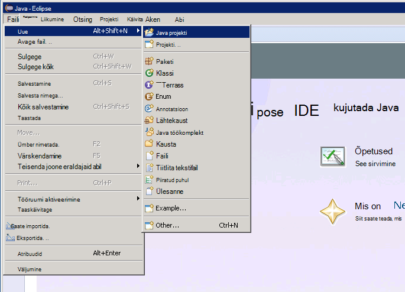

Klõpsake aknas **Uus Java projekt** sisestage projekti nimi, valige **Kasuta vaikimisi JRE**ja klõpsake siis nuppu **valmis**.

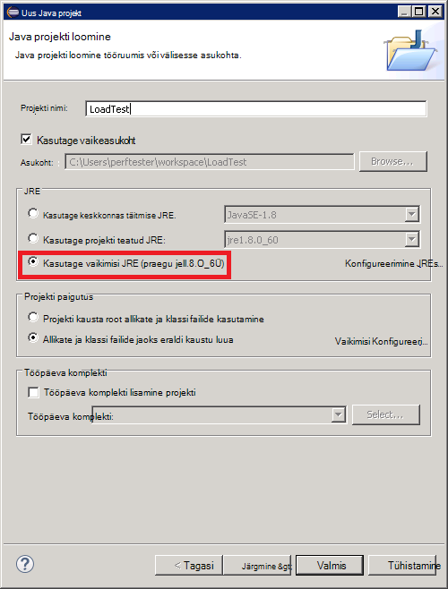

**Paketi Exploreri** aknas, laiendage projekti nime. Veenduge, et see sisaldab kausta nimega **src** ja JRE, määratud viide.

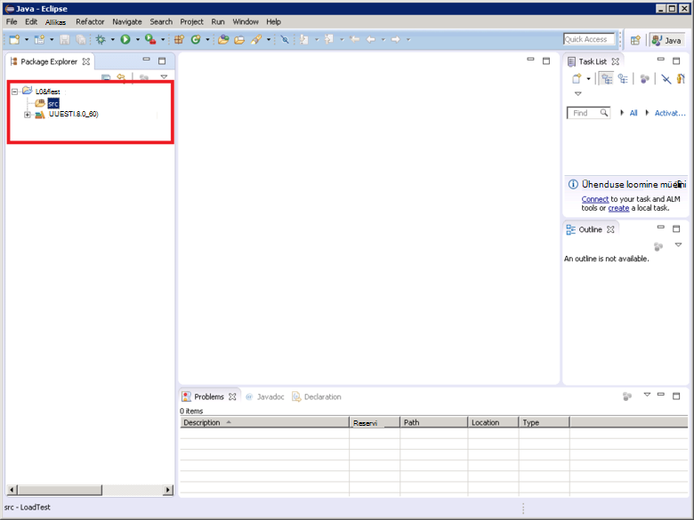

Paremklõpsake kausta **src** , klõpsake nuppu **Uus**ja klõpsake **rongid puhul**.

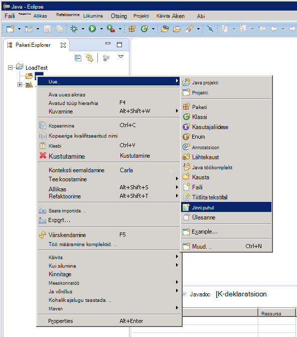

Aknas **Uus rongid puhul** valige **Uus rongid 4 test**, sisestage nimi (selleks võib olla sama nimi projekti, kuigi mess, see peab algama tähega väiketähed suurtähtedeks) paketi, nimi katse klassi ja valige suvandid, mida luua meetod ootavad, mis on vaja oma test. Klassi **testi jaotises** tühjaks jätta, ja klõpsake siis nuppu **valmis**.

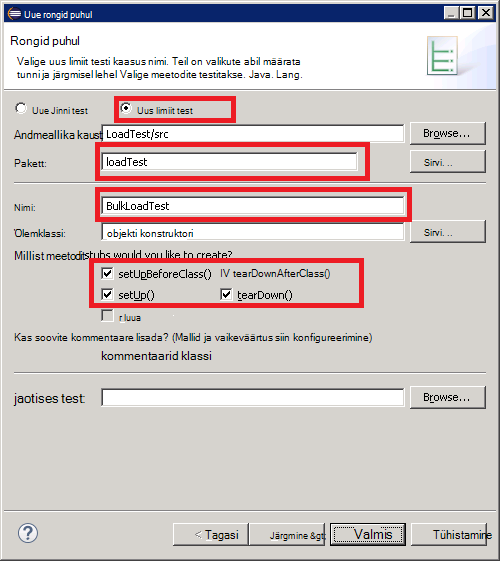

Järgmised **uued rongid puhul** dialoogiboksi kuvamisel valige suvand lisada rongid 4 teegi koostamine tee ja seejärel klõpsake nuppu **OK**. 

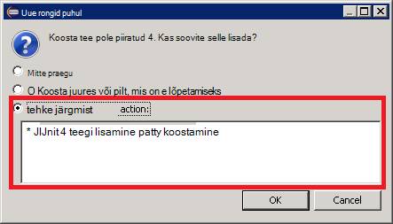

Veenduge, et rongid test skelett kood on loodud ja Java Editori aknas.

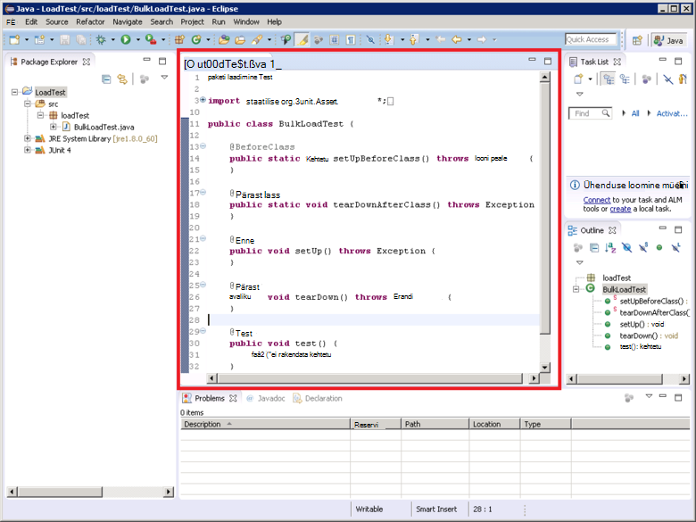

**Paketi Explorer**, paremklõpsake oma projekti sõlm, klõpsake nuppu **Konfigureeri**, ja klõpsake **teisendamine Maven projekti**.

> [AZURE.NOTE]Kasutades Maven lubab rohkem hõlpsalt hallata välise sõltuvused (nt Elasticsearch Java kliendi teegid) projekti sõltub.

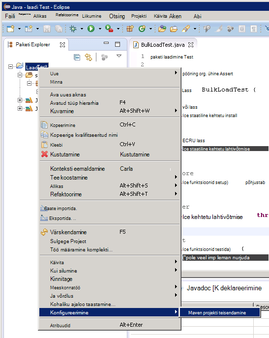

Dialoogiboksis **Loo uus POM** **pakendit** rippmenüü loendis valige **jar**, ja klõpsake siis nuppu **valmis**.

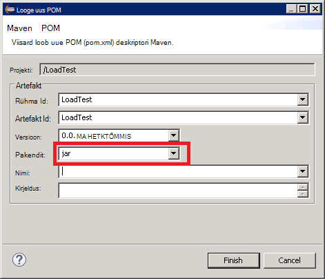

Paan, mis kuvatakse all projekti objekti mudeli (POM) redaktori võib kuvada hoiatus "Koosta tee määrab keskkond J2SE-1,5. Leidub pole installitud tööruumis JREs, mis ühilduvad tingimata selles keskkonnas", olenevalt sellest, millist versiooni Java arengu teie arvutisse on installitud. Kui teil on versiooni Java, mis on hilisem versioon see hoiatus Julgelt ignoreerida 1,5.

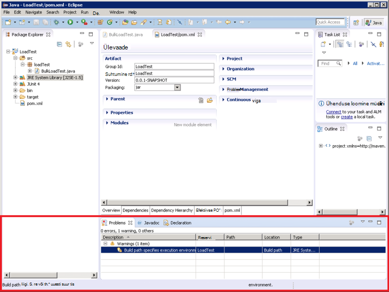

POM redaktoris laiendage **Atribuudid** ja seejärel klõpsake nuppu **Loo**.

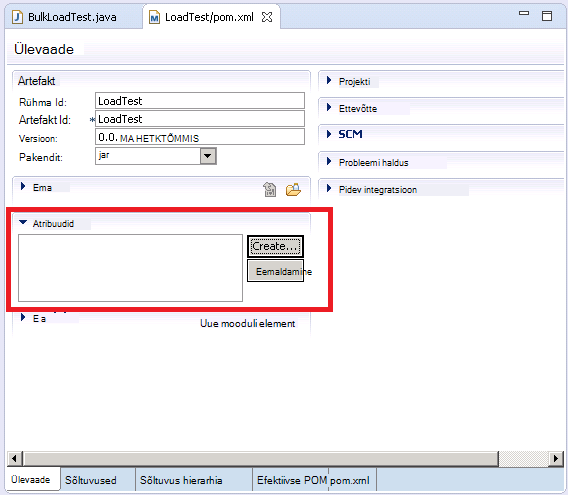

Dialoogiboksis **Atribuutide lisamine** väljale **nimi** tippige *es.version*, tippige väljale **väärtus** *1.7.2*ja seejärel klõpsake nuppu **OK**. See on Elasticsearch Java kliendi teek kasutada versiooni (see versioon võib tulevikus asendada, ja POM atribuudi versiooni määratlemine ja selle atribuudi mujale projekti viitamine võimaldab kiiresti muuta versioon.)

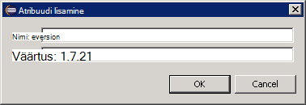

POM redaktori allosas vahekaarti **sõltuvused** ja seejärel klõpsake nuppu **Lisa** **sõltuvused** loendi kõrval.

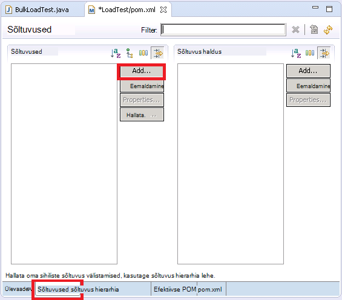

Dialoogiboksis **Valige sõltuvus** **Rühma Id** tippige *org.elasticsearch*, tippige väljale **Artefakt Id** *elasticsearch*, sisestage väljale **versioon** * \${es.version}*, ja seejärel klõpsake nuppu **OK**. Java Elasticsearch kliendi teegi kohta teavet hoitakse online Maven keskses hoidlas ja selle konfiguratsiooni automaatselt alla teek ja sõltuvustega kui projekt on loodud.

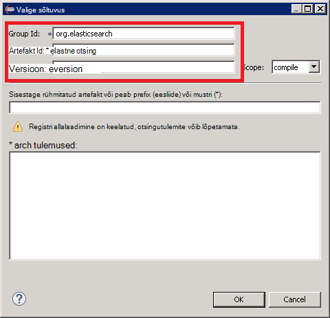

Klõpsake menüüs **fail** nuppu **Salvesta kõik**. See toiming salvestamine ja koostada projekti määratud Maven sõltuvused alla. Veenduge, et kausta Maven sõltuvused kuvatakse paketi Exploreris. Laiendage selle kausta alla laaditud toetamiseks Elasticsearch Java kliendi teek jar failide vaatamiseks.

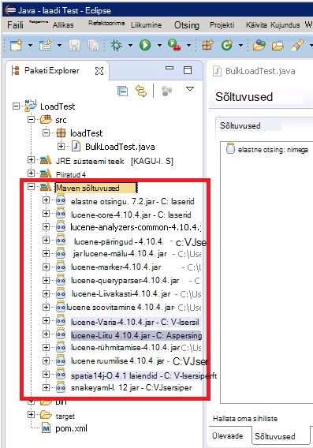

## Eclipse rongid testi projekti importimine

See toiming eeldab, et allalaaditud Maven projekti, mis on varem loodud Eclipse abil.

Käivitage Eclipse IDE. Klõpsake menüüs **fail** nuppu **impordi**.

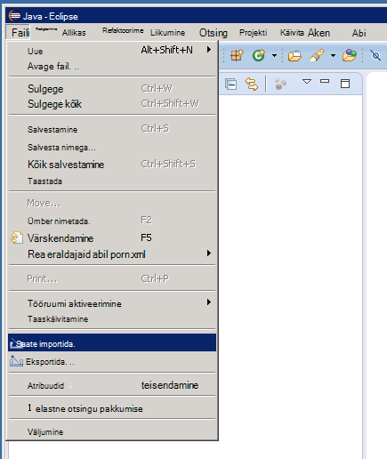

**Valige** aknas laiendage kausta **Maven** , nuppu **Olemasolev Maven projektid**ja seejärel klõpsake nuppu **edasi**.

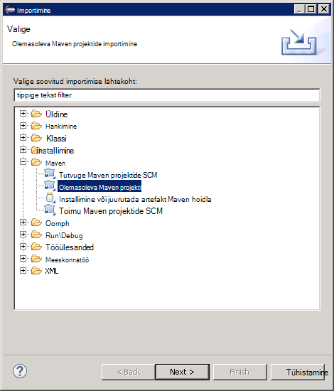

**Maven projektide** aknas määrata kausta, hoides projekt (kaust, kus pom.xml fail), klõpsake nuppu **Vali kõik**ja seejärel klõpsake nuppu **valmis**.

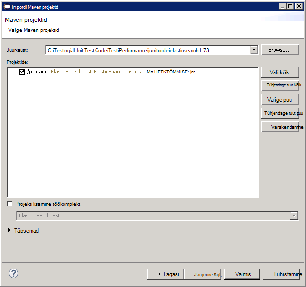

**Paketi Exploreri** aknas, laiendage vastab projekti. Veenduge, et projekt sisaldab kausta nimega **src**. See kaust sisaldab lähtekoodi rongid test. Projekti saate koostada ja juurutada alltoodud juhiseid.

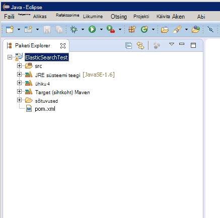

## Teenuse juurutamisel JMeter rongid test

See toiming eeldab, et nimega LoadTest sisaldava klassi rongid testi nimega projekti loomist `BulkLoadTest.java` mida aktsepteerib edastatud sisse ühe stringina ehitaja konfiguratsiooni parameetrit (see on süsteem, mis eeldab, et JMeter).

Eclipse IDE, **Paketi Explorer**, paremklõpsake projekti sõlm ja seejärel klõpsake nuppu **ekspordi**.

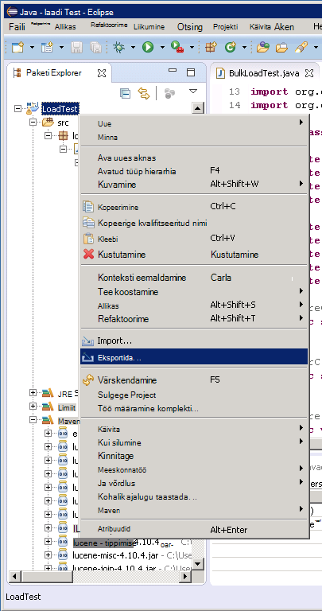

**Ekspordiviisard**lehel **Valige** laiendage **Java** , klõpsake **JAR faili**ja seejärel klõpsake nuppu **edasi**.

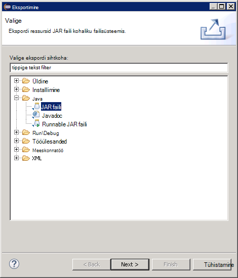

Lehel **JAR faili määratlus** väljale **ressursid eksportimiseks valige** laiendamine projekti tühjendage **.project**ja tühjendage ruut **pom.xml**. **JAR faili** väljale Sisestage faili nimi ja asukoht jar (see tuleks laiendid failinimelaiend) ja klõpsake siis nuppu **valmis**.

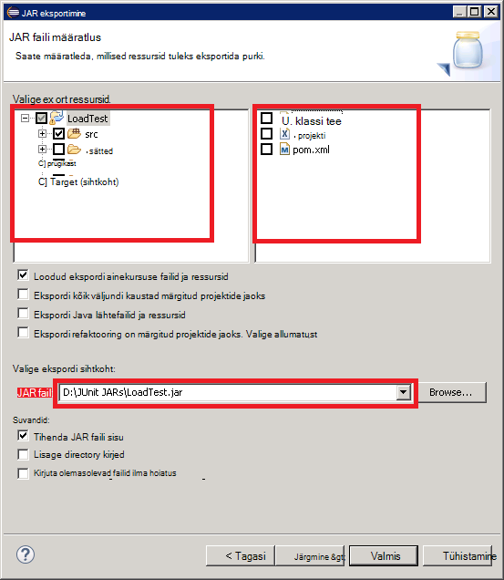

Windows Exploreriga kopeerida JAR fail, mida on loodud JMeter juhtslaidi töötab ja salvestage see apache jmeter 2.13\\teegi\\rongid kaust kaust, kuhu on installitud JMeter all ("Loomine JMeter juhtslaidi virtuaalse masina" protseduur [jõudluse testimise keskkonna jaoks Elasticsearch Azure](guidance-elasticsearch-creating-performance-testing-environment.md) loomisel lisateabe saamiseks vaadake.)

Naasmiseks Eclipse, laiendage **Paketi Exploreri** aknas ja märkige üles kõik JAR failid ja nende asukohti loetletud Maven sõltuvused kausta projekti. Võtke arvesse, et järgmisel pildil kuvatavad failid võivad erineda sõltuvalt sellest, millist Elasticsearch versiooni te kasutate.

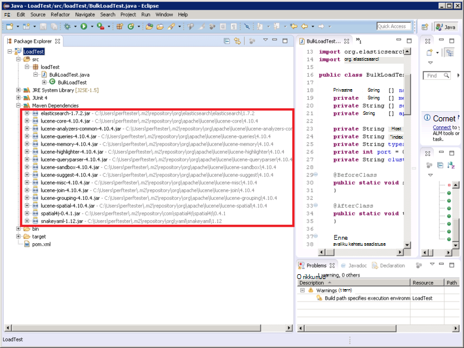

Windows Explorerit, kopeerige iga JAR fail Maven sõltuvused kausta apache jmeter 2.13 viidatud\\teegi\\rongid kausta JMeter juhtslaidi VM.

Kui selle teegi\\rongid kaust juba sisaldab varasemate versioonide faile JAR seejärel eemaldada. Kui jätate need kohas siis rongid test ei pruugi töötada nagu viited võib olla valesti purgid lahendada.

JMeter juhtslaidi VM peatada JMeter, kui praegu töötab.  Käivitage JMeter.  JMeter, paremklõpsake **Testi kavandamine**, klõpsake nuppu **Lisa**, valige **teemad (kasutajad)**ja klõpsake **Teemat rühma**.

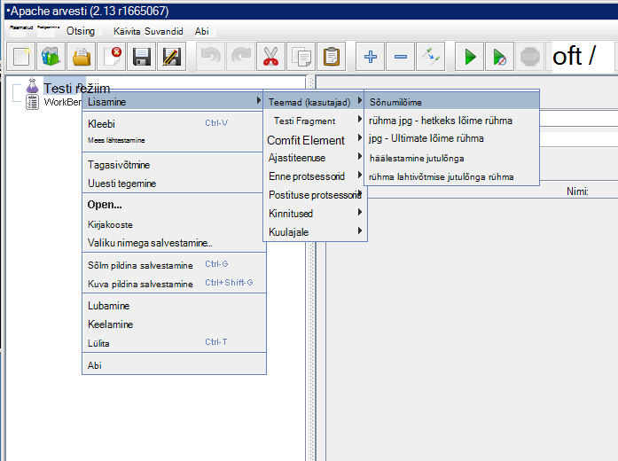

**Test kavandamine** sõlme all Paremklõpsake **Jutulõnga rühma**, klõpsake nuppu **Lisa**, klõpsake **proovivõtja**ja klõpsake **Rongid taotlus**.

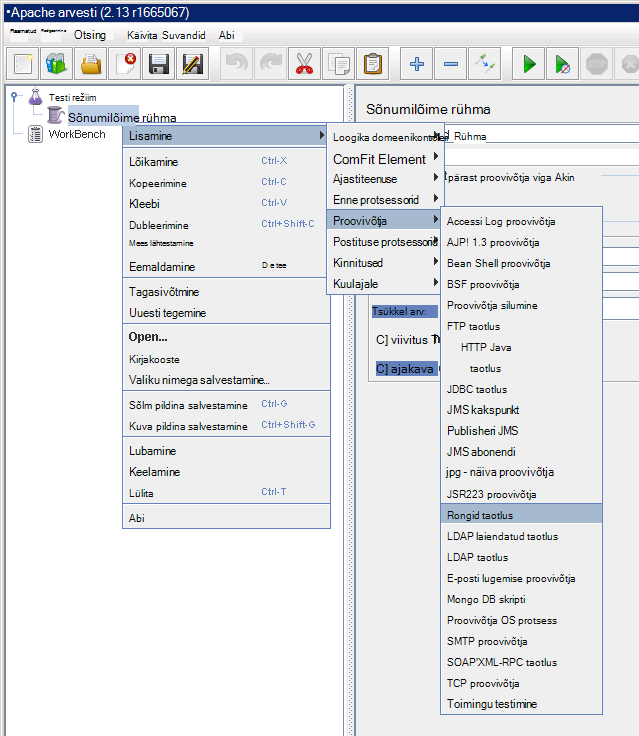

Valige lehel **Rongid taotluse** **otsimine JUnit4 marginaalid (mitte rongid 3)**. Valige ripploendist **klassinimi** rongid laadi testi tunni (see on loetletud vormi * &lt;paketi&gt;.&lt; klassi&gt;*), **Testida meetod** loendist valige soovitud rongid testida meetod (see on meetod, mis tegelikult töötab seostatud test ja märgitud koos selle *@test* marginaali Projectis Eclipse), ja sisestage väljale **Sildi ehitaja stringi** ehitaja edastatavate väärtused. Üksikasjad, mis on näidatud järgmisel pildil on vaid näited; teie **klassinimi** * *Meetod*ja * *Ehitaja stringi sildi** tõenäoliselt erineb esitatud.

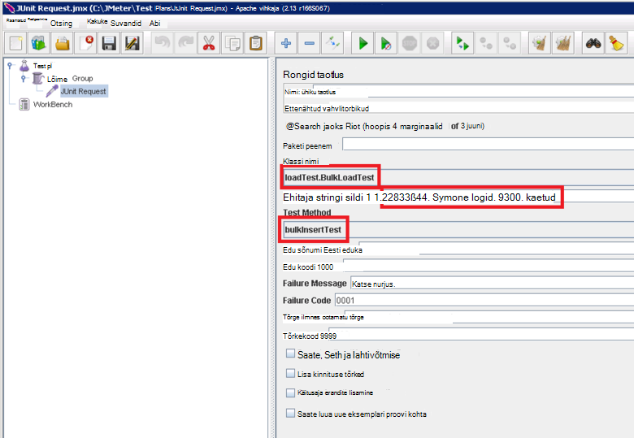

Kui tunni **klassinimi** rippmenüü loendis ei kuvata, tõenäoliselt tähendab see, et selle ei ekspordita õigesti või on viida selle teegi\\rongid kausta või mõnda sõltuvad purgid puuduvad selle teegi\\rongid kausta. Sellisel juhul projekti eksportimine Eclipse uuesti ja veenduge, et teil valitud **src** ressursi, purki kopeerimiseks selle teegi\\rongid kausta ja seejärel veenduge, et olete nüüd kõik sõltuvad purgid loetletud Maven teegi kausta.

Sulgege JMeter. Ei ole vaja salvestada testi režiim.  Kopeerige JAR fail, mis sisaldab soovitud /home/ rongid testi klassi&lt;kasutajanimi&gt;/apache-jmeter-2.13/lib/junit kausta iga JMeter alluv VMs (*&lt;kasutajanimi&gt; * on nimi haldus kasutaja määratud VM loomisel, lisateabe saamiseks vaadake juhiseid "Loomine JMeter alluv virtuaalmasinates" [jõudluse testimise keskkonna jaoks Elasticsearch Azure](guidance-elasticsearch-creating-performance-testing-environment.md) loomisel.)

Nõutud rongid testi klassi soovitud /home/ sõltuvad JAR faile kopeerida&lt;kasutajanimi&gt;iga JMeter alluv VMs /apache-jmeter-2.13/lib/junit kausta. Veenduge, et vanemad versioonid JAR failid eemaldamiseks kõigepealt see kaust.

Saate kasutada funktsiooni `pscp` kasuliku failide kopeerimiseks Windowsi arvuti Linux.

[Luua tulemuslikkuse Elasticsearch Azure keskkonna testimine]: guidance-elasticsearch-creating-performance-testing-environment.md
