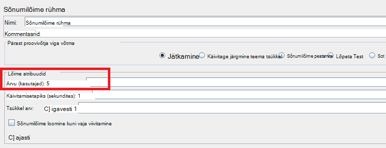
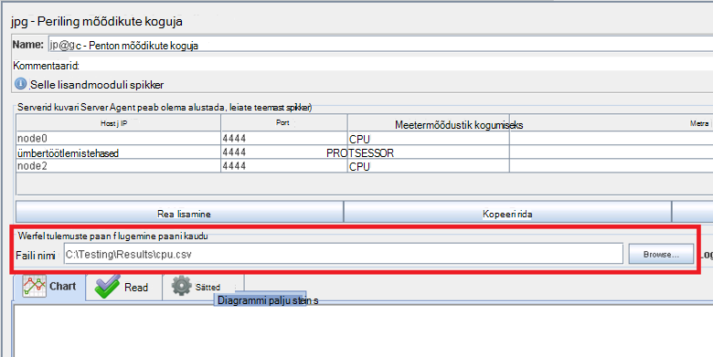
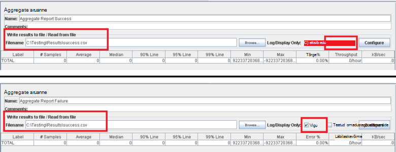
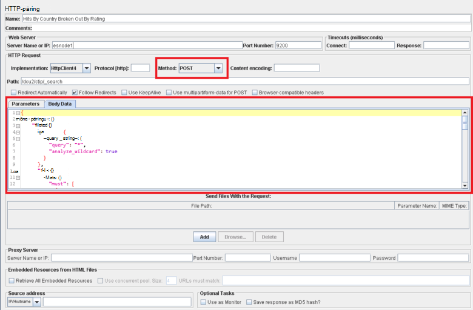

<properties
   pageTitle="JMeter testi kava rakendamisel Elasticsearch jaoks | Microsoft Azure'i"
   description="Jõudluse käivitamise testib Elasticsearch koos JMeter jaoks."
   services=""
   documentationCenter="na"
   authors="dragon119"
   manager="bennage"
   editor=""
   tags=""/>

<tags
   ms.service="guidance"
   ms.devlang="na"
   ms.topic="article"
   ms.tgt_pltfrm="na"
   ms.workload="na"
   ms.date="09/22/2016"
   ms.author="masashin" />
   
# <a name="implementing-a-jmeter-test-plan-for-elasticsearch"></a>JMeter testi lepingut Elasticsearch rakendamine

[AZURE.INCLUDE [pnp-header](../../includes/guidance-pnp-header-include.md)]

See artikkel on [osa sarjast](guidance-elasticsearch.md). 

Tehtud vastu Elasticsearch jõudluse testide rakendatakse JMeter testi lepingute koos Java koodi kui rongid test näiteks üleslaadimine andmed üheks klaster ülesandeid täitvate abil. Testi lepingud ja rongid kood on kirjeldatud [Tuning andmete manustamisest jõudlust Elasticsearch Azure][]ja [Tuning andmete liitmise ja päringu jõudluse Elasticsearch Azure jaoks][].

Selle dokumendi eesmärk on summeeritavaid võtme kogemused ehitamine ja töötavad need katse lepingud. Veebisaidil Apache JMeter [JMeter heade tavade](http://jmeter.apache.org/usermanual/best-practices.html) leht sisaldab rohkem generalized nõu JMeter tõhus kasutamine.

## <a name="implementing-a-jmeter-test-plan"></a>JMeter testi kava rakendamisel

Järgmises loendis on kokku võetud üksused, võiksite kaaluda JMeter testi lepingu loomisel.

- Luua eraldi protsessi rühma iga katse, mida soovite teha. Test võib sisaldada mitut juhiseid, sh loogika kontrollerid, kestus, enne ja pärast protsessorite, võtjad ja kuulajatele.

- Vältige liiga palju Teemad jutulõnga rühma loomine. Liiga suur hulk Teemad põhjustab JMeter nurjumise "Välja mälu" erandid. See on parem lisada rohkem JMeter alluv servereid iga töötab väiksema arvu teemad, kui proovite käitada suure hulga Teemad ühes JMeter serveris.



- Klaster hindamaks lisada [Perfmoni mõõdikute koguja](http://jmeter-plugins.org/wiki/PerfMon/) lisandmoodul testi režiim. See on JMeter kuulajale, mis on saadaval, kui üks standard JMeter lisandmoodulid. Töötlemata jõudlusandmeid failikogumi komaga eraldatud väärtuste (CSV) vormingus salvestada ja töödelda, kui test on lõpule viidud. See on tõhusam ja paneb vähem koormust JMeter, kui proovite andmeid töödelda, kui see on jäädvustatud. 



Saate tööriista selliste Exceli andmed importida ja luua mitmesuguseid graafikud analüüsimise eesmärgil.

Kaaluge hõivamine järgmine teave:

- CPU kasutuse iga sõlme Elasticsearch klaster.

- Sekundis kettalt iga sõlm lugeda baitide arvust.

- Võimaluse korral kulunud aeg CPU oodata I/O teostatav iga sõlme. See pole alati võimalik Windows vms, kuid Linuxi saate luua kohandatud mõõdiku (EXEC meetermõõdustik) shell järgmine käsk autonoomsest *vmstat* sõlme käivituva.

```Shell
sh:-c:vmstat 1 5 | awk 'BEGIN { line=0;total=0;}{line=line+1;if(line&gt;1){total=total+\$16;}}END{print total/4}'
```

Väli 16 *vmstat* väljund sisaldab CPU ootamine I/O kulunud aeg. Teave selle lause kohta leiate lisateavet teemast [vmstat käsk](http://linuxcommand.org/man_pages/vmstat8.html).

- Baitide arvu, saadetud ja vastu võetud võrgu kaudu iga sõlme.

- Kasutavad eraldi liitväärtuse aruande kuulajatele jõudlus ja sagedus õnnestunud ja nurjunud toiminguid. Erinevate failide edu ja tõrge andmete talletamiseks.



- Säilita iga JMeter puhul selleks, et saaksite otse oleksid jõudluse teatud testi toimingute võimalikult lihtne. Test juhtudel, mis nõuavad keerukate loogika võtke arvesse, et see loogika rongid testi kapseldamist ja rongid taotluse proovivõtja abil JMeter käivitage test.

- HTTP-päring proovivõtja abil HTTP toiminguid, nt toomine, postituse, pane või Kustuta. Näiteks saate kasutada Elasticsearch otsingud postituse päringu abil ning esitada päringu üksikasjad väljale *Keha* .



- Korratavuse ja taaskasutuse lihtsustamiseks parameterize testida JMeter testi lepingud. Seejärel saate skriptimise automatiseerimiseks test lepingutest töötab.

## <a name="implementing-a-junit-test"></a>Rakendamise rongid test

Saate lisada keerulise koodi JMeter testi leping, luues ühe või mitme rongid katse. Java integreeritud keskkonnas (IDE) näiteks Eclipse abil saate kirjutada rongid test. Kuidas häälestada mõnda sobivat arenduskeskkond [juurutamine JMeter rongid proovivõtuseadme katsetamiseks Elasticsearch jõudlust][] annab teavet.

Järgmises loendis on kokku võetud peate järgima rongid testi kood kirjutamisel parimaid tavasid.

- Kasutage testi klassi konstruktori lähtestamine parameetrite edastamiseks test. JMeter saate kasutada konstruktori, mida saab ühele tekstistringile argumenti. Ehitaja, sõeluda seda argumenti selle üksikuid elemente, nagu on näidatud koodi järgmises näites:

```Java
private String hostName = "";
private String indexName = "";
private String typeName = "";
private int port = 0;
private String clusterName = "";
private int itemsPerBatch = 0;

/\* JUnit test class constructor \*/
public ElasticsearchLoadTest2(String params) {
    /* params is a string containing a set of comma separated values for:
        hostName
        indexName
        typeName
        port
        clustername
        itemsPerBatch
    */

    /* Parse the parameter string into an array of string items */
    String delims = "\[ \]\*,\[ \]\*"; // comma surrounded by zero or more spaces
    String\[\] items = params.split(delims);

    /* Note: Parameter validation code omitted */

    /* Use the parameters to populate variables used by the test */
    hostName = items[0];
    indexName = items[1];
    typeName = items[2];
    port = Integer.parseInt(items[3]);
    clusterName = items[4];
    itemsPerBatch = Integer.parseInt(items[5]);

    if(itemsPerBatch == 0)
        itemsPerBatch = 1000;
}
```

- Vältida/v-toimingud või muude toimingute aeganõudev ehitaja või häälestamise katse klassi, kuna need käivitada iga kord, kui rongid test töötab. (Sama rongid katse käitamise mitu korda iga katse teostada JMeter tuhat.)

- Kaaluge ühekordse häälestamise kallis puhul lähtestamine.

- Kui test nõuab suure hulga sisendparameetrid, salvestada eraldi konfiguratsioonifailis testi konfiguratsiooniteavet ja selle faili asukohta, lähevad ehitaja.

- Vältige raske kodeerimine failiteed laadi testi kood. Need võivad põhjustada tõrgete tõttu operatsioonisüsteemidesse Windows nt ja Linux erinevused.

- Argumentide abil saate näidata tõrked rongid testida viise, et saate jälgimine nende jälitamiseks JMeter ja kasutada neid business mõõdikute. Võimaluse korral liigu tagasi teave selle tõrke põhjuse, nagu on näidatud järgmises näites kood paks:

```Java
@Test
public void bulkInsertTest() throws IOException {
    ...
    BulkResponse bulkResponse = bulkRequest.execute().actionGet();
    assertFalse(
        bulkResponse.buildFailureMessage(), bulkResponse.hasFailures());
        ...
}
```


[Running Elasticsearch on Azure]: guidance-elasticsearch-running-on-azure.md
[Elasticsearch Azure andmete manustamisest jõudluse häälestamine]: guidance-elasticsearch-tuning-data-ingestion-performance.md
[JMeter rongid proovivõtuseadme katsetamiseks Elasticsearch jõudlust juurutamine]: guidance-elasticsearch-deploying-jmeter-junit-sampler.md
[Andmete koondamine ja Azure Elasticsearch päringu jõudluse häälestamine]: guidance-elasticsearch-tuning-data-aggregation-and-query-performance.md
