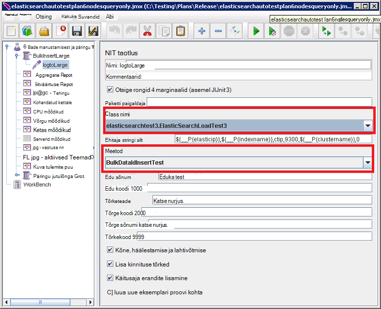

<properties
   pageTitle="Töötab testide automatiseeritud Elasticsearch jõudluse | Microsoft Azure'i"
   description="Kuidas käivitada jõudluse testide oma keskkonnas kirjeldus."
   services=""
   documentationCenter="na"
   authors="dragon119"
   manager="bennage"
   editor=""
   tags=""/>

<tags
   ms.service="guidance"
   ms.devlang="na"
   ms.topic="article"
   ms.tgt_pltfrm="na"
   ms.workload="na"
   ms.date="09/22/2016"
   ms.author="masashin"/>
   
# <a name="running-the-automated-elasticsearch-performance-tests"></a>Töötab testide automatiseeritud Elasticsearch jõudlus

[AZURE.INCLUDE [pnp-header](../../includes/guidance-pnp-header-include.md)]

See artikkel on [osa sarjast](guidance-elasticsearch.md). 

Dokumentide [Tuning andmete manustamisest jõudlust Elasticsearch Azure] ja [Tuning andmete liitmise ja päringu jõudluse jaoks Elasticsearch Azure] kirjeldada jõudluse kontrollib valimi Elasticsearch kobar vastu töötavad.

Katsed olid kirjutasid saaksid käivitamiseks automaatsel viisil. Selles dokumendis kirjeldatakse, kuidas saate oma keskkonnas testide korrata.

## <a name="prerequisites"></a>Eeltingimused

Testide automatiseeritud nõuavad järgmised üksused:

-  Mõne Elasticsearch kobar.

- JMeter keskkonna häälestamine dokument [luua jõudluse testimise keskkond Elasticsearch Azure]kirjeldatud.

- [Python 3.5.1](https://www.python.org/downloads/release/python-351/) installitud JMeter juhtslaidi VM.


## <a name="how-the-tests-work"></a>Testide tööpõhimõtted
Käivitatakse testide abil JMeter. JMeter juhtslaidi server laadib testi lepingut ja edastab selle JMeter alluv serverite, mis tegelikult töötavad testide kogum. Juhtslaidi server JMeter koordinaadid JMeter alluv serverid ja liidetakse tulemused.

Järgmised testi lepingud on esitatud.

* [elasticsearchautotestplan3nodes.jmx](https://github.com/mspnp/azure-guidance/blob/master/ingestion-and-query-tests/templates/elasticsearchautotestplan3nodes.jmx). Töötab manustamisest test üle 3 sõlme kobar.

* [elasticsearchautotestplan6nodes.jmx](https://github.com/mspnp/azure-guidance/blob/master/ingestion-and-query-tests/templates/elasticsearchautotestplan6nodes.jmx). Käivitatakse üle 6 sõlme kobar manustamisest test.

* [elasticsearchautotestplan6qnodes.jmx](https://github.com/mspnp/azure-guidance/blob/master/ingestion-and-query-tests/templates/elasticsearchautotestplan6qnodes.jmx). Käivitatakse manustamisest ja päringu testimiseks üle 6 sõlme kobar.

* [elasticsearchautotestplan6nodesqueryonly.jmx](https://github.com/mspnp/azure-guidance/blob/master/ingestion-and-query-tests/templates/elasticsearchautotestplan6nodesqueryonly.jmx). Käivitab päringu ainult test üle 6 sõlme kobar.


Saate neid testida lepingute alusena oma stsenaariume, kui teil on vaja rohkem või vähem.

Testi lepingud rongid taotluse proovivõtuseadme abil luua ja üles laadida testi andmeid. JMeter testi leping loob ja käivitab selle proovivõtja jälgib iga Elasticsearch sõlmed tulemustega seotud andmete jaoks.  

## <a name="building-and-deploying-the-junit-jar-and-dependencies"></a>Loomine ja juurutamine rongid JAR ja sõltuvused
Enne töötab jõudlus testinud, mida tuleks allalaadimiseks kompileerida ja juurutamine rongid testide asub kaustas jõudluse/junitcode. Need katsed on viidatud JMeter testi leping. Lisateabe saamiseks vt "Rongid testi projekti importimine Eclipse" protseduur dokumendi [juurutamine JMeter rongid proovivõtuseadme katsetamiseks Elasticsearch jõudlust].

On kaks versiooni rongid testide. 

- [Elasticsearch1.73](https://github.com/mspnp/azure-guidance/tree/master/ingestion-and-query-tests/junitcode/elasticsearch1.73). Kood manustamisest katsete tegemiseks. Katsed kasutada Elasticsearch 1,73.

- [Elasticsearch2](https://github.com/mspnp/azure-guidance/tree/master/ingestion-and-query-tests/junitcode/elasticsearch2). Kood päringu katsete tegemiseks. Katsed kasutada Elasticsearch 2.1 ja uuemad versioonid.

Kopeerige oma JMeter masinad vastavat Java archive (JAR) faili koos ülejäänud sõltuvused. Protsessi on kirjeldatud [juurutamine JMeter rongid proovivõtuseadme katsetamiseks Elasticsearch jõudlust][]. 

> **Oluliste** Pärast võtavad rongid test, kasutage JMeter laadimine ja konfigureerimiseks testi lepingud, millele viitavad selle rongid testi ja veenduge, et jaotises BulkInsertLarge jutulõnga viitaks õige JAR faili, rongid tunni nime ja testida meetod.
> 
> 
> 
> Salvestage värskendatud testi lepingud enne käivitamist testide.

## <a name="creating-the-test-indexes"></a>Testi indeksite loomiseks
Iga katse sooritab manustamisest ja/või päringute vastu ühe indeks on määratud, kui test töötab. Peaksite skeemide, lisades dokumentide [Tuning andmete manustamisest jõudlust Elasticsearch Azure] ja [Tuning andmete liitmise ja päringu jõudluse jaoks Elasticsearch Azure] kirjeldatud abil registri loomine ja konfigureerimine neid vastavalt stsenaariumile test (doc väärtused lubatud või keelatud, mitme koopiad ja jne.) Pange tähele, et testi lepingud endale registri sisaldab ühte tüüpi nimega *ctip*.

## <a name="configuring-the-test-script-parameters"></a>Konfigureerimise testi skripti parameetrid
Järgmised testi skripti parameetri failide kopeerimine JMeter serveri arvuti:

* [run.properties](https://github.com/mspnp/azure-guidance/blob/master/ingestion-and-query-tests/run.properties). Selle faili saate määrata arvu JMeter testi kasutamiseks kestus (sekundites) test sõlm (või laadi koormusetasakaalustusteenuse Elasticsearch klaster,) IP-aadress ja klaster nimi.

  ```ini
  nthreads=3
  duration=300
  elasticip=<IP Address or DNS Name Here>
  clustername=<Cluster Name Here>
  ```
  
  Seda faili redigeerida ja määrake oma testi ja kobar väärtused.

* [päringu-config-win.ini](https://github.com/mspnp/azure-guidance/blob/master/ingestion-and-query-tests/query-config-win.ini) ja [päringu-config-nix.ini](https://github.com/mspnp/azure-guidance/blob/master/ingestion-and-query-tests/query-config-nix.ini). Need kaks faili sisaldama sama teavet; *võidavad* fail on vormindatud Windowsi failinimed ja teed ja *nix* fail on vormindatud Linux failinimed ja teed.

  ```ini
  [DEFAULT]
  debug=true #if true shows console logs.

  [RUN]
  pathreports=C:\Users\administrator1\jmeter\test-results\ #path where tests results are saved.
  jmx=C:\Users\administrator1\testplan.jmx #path to the JMeter test plan.
  machines=10.0.0.1,10.0.0.2,10.0.0.3 #IPs of the Elasticsearch data nodes separated by commas.
  reports=aggr,err,tps,waitio,cpu,network,disk,response,view #Name of the reports separated by commas.
  tests=idx1,idx2 #Elasticsearch index(es) name(s) to test, comma delimited if more than one.
  properties=run.properties #Name of the properties file.
  ```

  Selle faili määrata testi tulemused, asukohad JMeter testi lepingu käitamiseks Elasticsearch andmete sõlmed kogute jõudluse mõõdikute põhjal, aruanded, töötlemata jõudluse andmetega, mis on loodud, IP-aadressid ja nimi (või nimed komaga eraldatud) index(es) katse, on rohkem kui üks nimi redigeerimine , kontrollib käivitavad üksteise järel. Kui run.properties fail asub teise kausta või kataloogi, määrake faili täielik tee.

## <a name="running-the-tests"></a>Töötab testide

* Kopeerige faili [päringu-test.py](https://github.com/mspnp/azure-guidance/blob/master/ingestion-and-query-tests/query-test.py) JMeter server kohapeal, samas kaustas run.properties ja päringu-config-win.ini (päringu-config-nix.ini) faile.

* Veenduge, et jmeter.bat (Windows) või jmeter.sh (Linux) oleks käivitatava tee keskkonnas.

* Käivitage päring-test.py skript testide sooritamiseks käsurea kaudu:

  ```cmd
  py query-test.py
  ```

* Kui test on lõpule viidud, talletatakse tulemuste komplekti, komaga eraldatud väärtuste (CSV) faile, mis on määratud faili win.ini-päringu-config (päringu-config-nix.ini). Saate Excelis analüüsida ja graafik andmed.


[Elasticsearch Azure andmete manustamisest jõudluse häälestamine]: guidance-elasticsearch-tuning-data-ingestion-performance.md
[Andmete koondamine ja Azure Elasticsearch päringu jõudluse häälestamine]: guidance-elasticsearch-tuning-data-aggregation-and-query-performance.md
[Luua tulemuslikkuse Elasticsearch Azure keskkonna testimine]: guidance-elasticsearch-creating-performance-testing-environment.md
[JMeter rongid proovivõtuseadme katsetamiseks Elasticsearch jõudlust juurutamine]: guidance-elasticsearch-deploying-jmeter-junit-sampler.md
