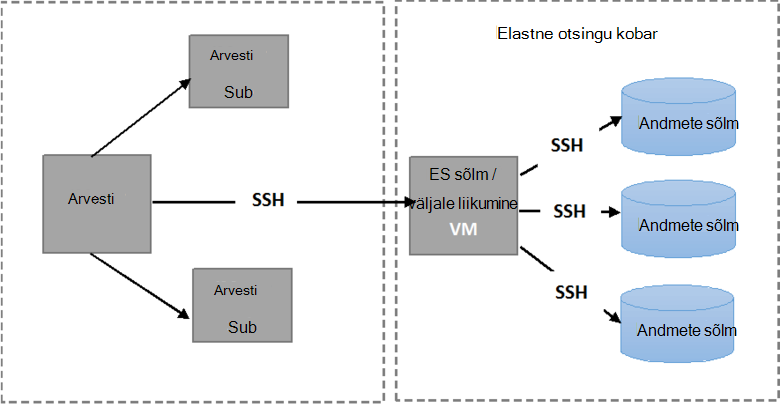

<properties
   pageTitle="Töötab testide automatiseeritud Elasticsearch paindlikkust | Microsoft Azure'i"
   description="Kuidas käivitada paindlikkust testide oma keskkonnas kirjeldus."
   services=""
   documentationCenter="na"
   authors="dragon119"
   manager="bennage"
   editor=""
   tags=""/>

<tags
   ms.service="guidance"
   ms.devlang="na"
   ms.topic="article"
   ms.tgt_pltfrm="na"
   ms.workload="na"
   ms.date="09/22/2016"
   ms.author="masashin"/>

# <a name="running-the-automated-elasticsearch-resiliency-tests"></a>Töötab testide automatiseeritud Elasticsearch paindlikkust

[AZURE.INCLUDE [pnp-header](../../includes/guidance-pnp-header-include.md)]

See artikkel on [osa sarjast](guidance-elasticsearch.md).

[Seadistamine paindlikkuse]ja taastamise kohta Elasticsearch Azure[elasticsearch-resilience-recovery], me kirjeldatud katsed, mis olid läbi valimi Elasticsearch kobar määrata, kuidas süsteemi vastanud mõned levinumad tõrge ja kuidas seda taastatud suhtes. Testide olid kirjutasid saaksid käivitamiseks automaatsel viisil. Selles dokumendis kirjeldatakse, kuidas saate oma keskkonnas testide korrata. 

Testitud olid järgmistel juhtudel:

- **Tõrge sõlm ja taaskäivitage kaotamata andmeid**. Andmete sõlm on peatatud ja 5 minuti pärast uuesti.
Elasticsearch on konfigureeritud jaotada puuduvad shards sellesse vahemikku, seega ei ole täiendavad I/O tekib shards liikumine. Sõlme taaskäivitamisel toob taastamise protsess shards sõlme tagasi ajakohased.

- **Koos katastroofiline andmekao sõlm tõrge**. Andmete sõlm on peatatud ja andmed, mida tal kustutatakse simuleerida katastroofiline ketta tõrge. Sõlme on siis uuesti (5 minutit) pärast tõhus abistas algse sõlm Asenda. Taastamise protsess nõuab taastamine selle sõlme puuduvad andmed ja võib hõlmata shards toimus sõlmed ümber.

- **Tõrge sõlm ja taaskäivitage kaotamata andmeid, kuid Kildu jaotada**. Andmete sõlm on peatatud ja shards, et tal on ümber sõlmi. Sõlme seejärel uuesti ja veel jaotada ilmneb taastub klaster.

- **Jooksvalt värskendused**. Iga sõlme klaster peatada ja uuesti pärast on lühikese simuleerida masinad on tarkvara uuendamine pärast taaskäivitamist. Ainult üks sõlm on peatatud korraga.
Shards on ümber sõlm on alla.

## <a name="prerequisites"></a>Eeltingimused

Testide automatiseeritud nõuavad järgmised üksused:

- Mõne Elasticsearch kobar.

- JMeter keskkonna häälestamine, nagu on kirjeldatud [jõudluse testimise juhiseid]. 

- Neid täiendatakse ainult juhtslaidi JMeter VM installitud.

    - Java Runtime 7.

    - Nodejs 4.x.x või uuem versioon.

    - Käsurea Gittools.

## <a name="how-the-scripts-work"></a>Skriptide tööpõhimõtted

Testi skriptide on mõeldud käivitamiseks JMeter juhtslaidi VM. Kui valite mõne testi, skriptide teha järgmised toimingud:

1.  Teie määratud parameetrid läbides JMeter testi lepingu käivitamine.

2.  Kopeerige skripti, mis sooritavad testi määratud VM klaster vajalikud toimingud. See võib olla mis tahes VM, mis on avalik IP-aadress või *Jumpbox* VM, kui teil on varem klaster [Azure'i Elasticsearch Kiirjuhend malli](https://github.com/Azure/azure-quickstart-templates/tree/master/elasticsearch)abil.

3.  Käivitage skript VM (või Jumpbox).

Järgmisel pildil on kujutatud struktuuri ja testimiskeskkonnas Elasticsearch kobar. Arvestage, et testi skriptide turvaline shell (SSH) ühenduse iga sõlme klaster Elasticsearch erinevaid toiminguid, näiteks peatamine või taaskäivitamine sõlm sooritamiseks.



## <a name="setting-up-the-jmeter-tests"></a>Funktsiooni JMeter häälestamise kontrollib

Enne töötab paindlikkuse testinud, mida tuleks kompileerida ja juurutada rongid testide paindlikkust/jmeter/testide kaustas. Need katsed on viidatud JMeter testi leping. Lisateabe saamiseks vt "Rongid testi projekti importimine Eclipse" protseduur [juurutamine JMeter rongid proovivõtuseadme katsetamiseks Elasticsearch jõudlust][].

On kaks versiooni rongid testide olevad järgmistest kaustadest.

- **Elasticsearch17.** Selles kaustas projekt saab faili Elasticsearch17.jar. Kasutada PURGIST testimiseks Elasticsearch versioonide 1.7.x

- **Elasticsearch20**. Selles kaustas projekt saab faili Elasticsearch20.jar. Kasutage PURGIST Elasticsearch versioon 2.0.0 testimiseks ja uuemad versioonid

Kopeerige oma JMeter masinad vastavat JAR faili koos ülejäänud sõltuvused. Protsessi on kirjeldatud "Juurutamine rongid test JMeter" rakendades [JMeter rongid proovivõtuseadme testimise Elasticsearch jõudluse]korras.

## <a name="configuring-vm-security-for-each-node"></a>Iga sõlme VM turvalisus konfigureerimine

Testi skriptide jaoks on vaja installida ka autentimissert iga Elasticsearch sõlme klaster. See võimaldab skriptide nad ühenduse mitmesuguste VMs kasutajanimi või parool küsimata automaatselt käivituma.

Käivitage sisse, et üks sõlmed Elasticsearch kobar (või Jumpbox VM) ja seejärel käivitage järgmine käsk luua mõne autentimise võti:

```Shell
ssh-keygen -t rsa
```

Kui loote ühenduse Elasticsearch sõlm (või Jumpbox), käivitage järgmised käsud iga sõlme ta Elasticsearch kobar. Asendage `<username>` iga VM ja Asenda kehtiv kasutaja nimi `<nodename>` DNS-i nime või IP-aadress majutusteenuse Elasticsearch sõlm VM.
Pange tähele, et teil palutakse kasutaja parooli käivitamisel need käsud.
Lisateavet leiate [SSH login ilma parool](http://www.linuxproblem.org/art_9.html).

```Shell
ssh <username>@<nodename> mkdir -p .ssh (
cat .ssh/id\_rsa.pub | ssh <username>*@<nodename> 'cat &gt;&gt; .ssh/authorized\_keys'
```

## <a name="downloading-and-configuring-the-test-scripts"></a>Allalaadimist ja testi skriptide konfigureerimine

Testi skriptide on toodud Git hoidla. Järgmiste toimingute abil saate alla laadida ja konfigureerida skriptide.

JMeter juhtslaidi arvutisse kui käivitate testide, avage Git töölaua aken (Git Bash) ja klooni hoidla, mis sisaldab skriptide järgmiselt:

```Shell
git clone https://github.com/mspnp/azure-guidance.git
```

Teisalda kausta paindlikkust – kontrollib ja käivitage järgmine käsk installida sõltuvuste nõutud testi käivitamine.

```Shell
npm install
```

Kui JMeter juhtslaidi töötab Windows, laadige [Plink](http://www.chiark.greenend.org.uk/~sgtatham/putty/download.html), mis on käsurea liides PuTTY Telneti kliendile. Kopeerige käivitatava Plink paindlikkust – testib/teegi kausta.

Kui JMeter juhtslaidi töötab Linux, ei peate alla laadima Plink, kuid on vaja konfigureerida paroolita SSH JMeter juhtslaidi ja Elasticsearch sõlm või kasutasite toimingu kirjeldatud juhiseid järgides Jumpbox vahel "seadistamine VM iga sõlme turvalisus." 

Redigeeri järgmist konfiguratsiooni parameetrid on `config.js` faili, et need vastaksid teie testimiskeskkonnas ja Elasticsearch kobar. Järgmiste parameetrite on kõigi testide.

| Nimi | Kirjeldus | Vaikeväärtus |
| ---- | ----------- | ------------- |
| `jmeterPath` | Kohaliku JMeter asukoha tee. | `C:/apache-jmeter-2.13` |
| `resultsPath` | Suhteline kaust, kus skripti puistab tulemi. | `results` |
| `verbose` | Näitab, kas skripti väljundid Paljusõnaline režiimis või mitte. | `true` |
| `remote` | Näitab, kas JMeter testide käivitada kohalikult või remote serverites. | `true` |
| `cluster.clusterName` | Elasticsearch kobar nimi. | `elasticsearch` |
| `cluster.jumpboxIp`         | Jumpbox arvuti IP-aadress.                 |-|
| `cluster.username`          | Administraator kasutaja loodud juurutamisel klaster. |-|
| `cluster.password`          | Administraator kasutaja parooli.                        |-|
| `cluster.loadBalancer.ip`   | Elasticsearch laadi koormusetasakaalustusteenuse IP-aadress.    |-|
| `cluster.loadBalancer.url`  | Laadi koormusetasakaalustusteenuse Base URL.                          |-|

## <a name="running-the-tests"></a>Töötab testide

Teisalda kausta paindlikkust – kontrollib ja käivitage järgmine käsk:

```Shell
node app.js
```

Kuvatakse järgmine menüü:


Sisestage arv, seda stsenaariumi, mida soovite käivitada: `11`, `12`, `13` või `21`. 

Kui valite stsenaarium, käivitub automaatselt test. Tulemused salvestatakse mitu komaeraldusega (CSV) faili tulemuste Directory loodud kausta. Iga katse on oma tulemused kausta.
Saate Excelis analüüsida ja graafik andmed.

[Running Elasticsearch on Azure]: guidance-elasticsearch-running-on-azure.md
[Tuning Data Ingestion Performance for Elasticsearch on Azure]: guidance-elasticsearch-tuning-data-ingestion-performance.md
[jõudluse testimise juhiseid]: guidance-elasticsearch-creating-performance-testing-environment.md
[JMeter guidance]: guidance-elasticsearch-implementing-jmeter.md
[Considerations for JMeter]: guidance-elasticsearch-deploying-jmeter-junit-sampler.md
[Query aggregation and performance]: guidance-elasticsearch-query-aggregation-performance.md
[elasticsearch-resilience-recovery]: guidance-elasticsearch-configuring-resilience-and-recovery.md
[Resilience and Recovery Testing]: guidance-elasticsearch-running-automated-resilience-tests.md
[JMeter rongid proovivõtuseadme katsetamiseks Elasticsearch jõudlust juurutamine]: guidance-elasticsearch-deploying-jmeter-junit-sampler.md
