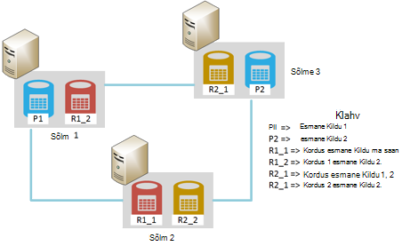
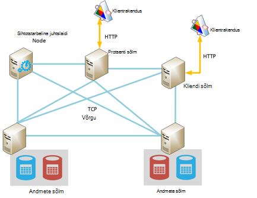
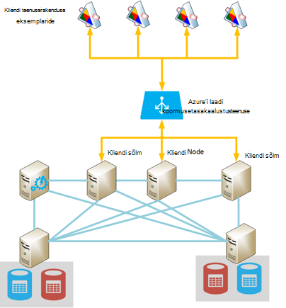
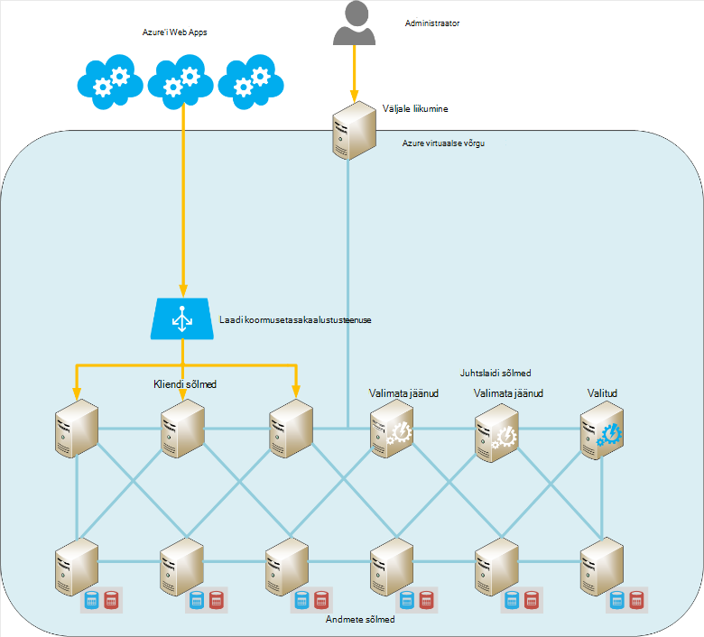
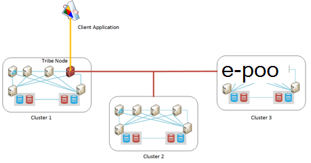

<properties
   pageTitle="Azure'i Elasticsearch töötavate | Microsoft Azure'i"
   description="Kuidas installida, konfigureerida ja käivitada Elasticsearch Azure."
   services=""
   documentationCenter="na"
   authors="dragon119"
   manager="bennage"
   editor=""
   tags=""/>

<tags
   ms.service="guidance"
   ms.devlang="na"
   ms.topic="article"
   ms.tgt_pltfrm="na"
   ms.workload="na"
   ms.date="09/22/2016"
   ms.author="masashin"/>

# <a name="running-elasticsearch-on-azure"></a>Azure'i Elasticsearch töötavate

[AZURE.INCLUDE [pnp-header](../../includes/guidance-pnp-header-include.md)]

See artikkel on [osa sarjast](guidance-elasticsearch.md). 

## <a name="overview"></a>Ülevaade

Selles dokumendis on lühiülevaade Elasticsearch üldist struktuuri ja seejärel kirjeldatakse, kuidas rakendada mõne Elasticsearch kobar Azure'i abil. Head tavad juurutamine Elasticsearch kobar, mis eri otstarbekas jõudlus ja nõuetele teie süsteemi ning kuidas tuleks teie vajadustele drive konfiguratsiooni ja topoloogia, et valite arvestades koondamine puudutab.

> [AZURE.NOTE] Juhised eeldab mõne lihtsa tundmine [Elasticsearch][].

## <a name="the-structure-of-elasticsearch"></a>Elasticsearch struktuuri 

Elasticsearch on väga optimeeritud otsingumootori tegutseda dokumendi andmebaas. Dokumendid on seeriasertide JSON-vormingus. Andmete toimub registrid, rakendada, kasutades [Apache Lucene][], kuigi üksikasjad on võetud vaatest ja ei ole vaja mõista täielikult Lucene Elasticsearch kasutamiseks.

### <a name="clusters-nodes-indexes-and-shards"></a>Kogumite, sõlmed, registrid ja shards

Elasticsearch rakendab rühmitatud arhitektuur, levitada andmete mitmesse sõlmed ja esitada kõrge-saadavus dispersioonanalüüs sharding kasutava. Dokumendid on talletatud registrid. Kasutaja saab määrata, milliseid välju dokumendis kasutatakse tuvastamiseks piires indeks või süsteemi saate luua võtme välja ja väärtused automaatselt. Registri kasutatakse füüsilise dokumentide korraldamine ja põhisumma tähendab asukoha dokumendid. 

Registri sisaldab shards. Dokumendid on ühtlaselt hajutatud üle shards abil registri väärtus ja shards registris olev arvu põhjal loob rakendus süsteem. 

Registrite saab korrata. Sel juhul kopeeritakse iga registris olev Kildu. Elasticsearch tagab, et iga algse Kildu jaoks registri (nn "esmane Kildu") ja selle koopia asuvad alati erinevaid sõlmi. Kui dokument on lisatud või muudetud, kõik kirjutada toiminguid on esmane Kildu esimese ja seejärel iga koopia. 

Alloleval joonisel oluliste aspektide Elasticsearch kobar, mis sisaldavad kolm sõlmed. Registri on loodud, mis koosneb kahe esmane shards kaks koopiad iga Kildu (kuus shards kõikide) jaoks.



*Lihtne Elasticsearch kobar, mis sisaldab kahte esmane sõlme ja kahte tüüpi koopiad*

See kobar asuvad esmane Shardi 1 ja esmane Kildu 2 eraldi sõlmed saldo laadi üle nende abil. Samuti levitatakse selle koopiad. Ühe sõlme nurjumisel ülejäänud sõlmed on teavet, mis võimaldab süsteemi tööd jätkata. Vajaduse korral soodustab Elasticsearch koopia Kildu esmane Kildu saada, kui vastav esmane Kildu pole saadaval.

### <a name="node-roles"></a>Sõlm rollid

Sõlmed on Elasticsearch klaster saate teha järgmisi rolle:

- **Andmete sõlm** , mis võib olla üks või mitu shards, mis sisaldavad viiteandmete.

- **Kliendi sõlm** reguleerivad viiteandmete, kuid mis tegeleb klientrakendustes õigete andmete sõlm sissetulevad taotlused.
 
- **Juhtslaidi sõlm** mis tehete kobar haldus, näiteks säilitamine, kuid mis ei sisalda viiteandmete ja marsruutimise teabe ümber klaster (loendi, mis sisaldavad sõlmed mis shards) kindlaks teha, millised sõlmed on saadaval, ümber shards, nagu sõlmed ja kadumise ja koordineerimine taastamine pärast sõlm tõrge. Mitme sõlmed saab konfigureerida juhtslaidi, kuid tegelikult valib ainult ühe juhtslaidi ülesannete täitmiseks. Selle sõlme nurjumisel teise valimine toimub ja üks muu õigus juhtslaidi sõlmed valitakse ja üle võtta.

> [AZURE.NOTE]Klaster on hästi äärmiselt oluline on valitud juhtslaidi sõlm. Teisi sõlmi ping seda regulaarselt, et tagada, et see on endiselt saadaval. Kui valitud juhtslaidi sõlm on ka abistas andmete sõlm, on võimalus, et sõlme võib muutuda hõivatud ja ei vastata nende ping. Sellisel juhul juhteksemplari loetakse ei ole ja üks juhtslaidi sõlmed on valitud, selle asemel. 

 Alloleval joonisel sihtotstarbeline juhtslaidi, klientide ja andmete sõlmed on Elasticsearch kobar segu sisaldavate topoloogia.



*Elasticsearch kobar, mis näitab erinevat tüüpi sõlmed*

### <a name="costs-and-benefits-of-using-client-nodes"></a>Kulude ja kliendi sõlmed kasutamise eelised

Kui rakenduse esitab mõne Elasticsearch kobar päringu, millele rakendus loob sõlme vastutab suunavad päringu protsess. Sõlme edastab taotluse iga andmete sõlm ja kogutakse tulemused, naasevad akumuleeritud teavet rakenduse. Kui päringu hõlmab liitmised ja muude arvutuste, sooritab sõlm, millele rakendus loob vajalikud toimingud pärast andmete toomisel iga teisi sõlmi. Selle punkt/kogumise protsessi saab kasutada märkimisväärne töötlemine ja mälu ressursse.

Sihtotstarbeline kliendi sõlmed abil saate teha järgmisi toiminguid võimaldab andmete sõlmed keskenduda haldamise ja andmete salvestamiseks. Tulem on palju stsenaariumid, mis hõlmavad keerukate päringute ja liitmised kasu sihtotstarbeline kliendi sõlmed abil. Siiski kasutamise sihtotstarbeline kliendi sõlmed mõju tõenäoliselt sõltuvalt teie stsenaariumi, töökoormus ja kobar suurust. 

> [AZURE.NOTE] Vaadake [häälestamine andmete liitmise ja päringu jõudluse jaoks Elasticsearch Azure][] protsessi häälestamise kohta lisateabe saamiseks.

### <a name="connecting-to-a-cluster"></a>Ühenduse loomine mõne kobar

Elasticsearch seab kliendi rakenduste loomine ja saatmine taotlusi arvutikobaras REST API-de sarja. Kui arendate rakendustes, mis kasutavad .NET Frameworki, kaks kõrgem API-d on saadaval – [Elasticsearch.Net ja pesa][].

Kui on kliendi rakenduste abil Java loomine, saate luua kliendi sõlmed dünaamiliselt ja lisada need klaster [Sõlm kliendi API][] . Kliendi loomine sõlmed dünaamiliselt on mugav juhul, kui teie süsteemi kasutab pikaajalisi ühendusi võrdlemisi väike arv. Kliendi sõlmed sõlm API abil loodud on antud koos klaster marsruutimine kaart (üksikasjad, mis sisaldavad sõlmed mis shards) juhtslaidi sõlm. See teave võimaldab Java rakenduse loomiseks sobivat sõlmed kui indekseerimine ja päringute tegemise, humala, mis võivad olla vajalikud muude API-de kasutamisel arvu.

Seda moodust maksumus on üldkulu kasutamine sõlme klientrakenduses klaster sisse. Kui suure hulga kliendi sõlmed ja kadumise kiiresti, haldamine ja levitamine kobar marsruutimise kaardi mõju muutuvad märgatavalt.

Alloleval joonisel konfiguratsiooni, mis kasutab laadi koormusetasakaalustusteenuse taotlusi marsruutida kogum kliendi sõlmed, kuigi sama strateegiat saab ühendada otse andmete sõlmed kui kliendi sõlmed ei kasutata.



*Kliendi teenuserakenduse eksemplaride ühenduse kaudu Azure'i laadi koormusetasakaalustusteenuse mõne Elasticsearch kobar*

> [AZURE.NOTE][Azure'i laadimine koormusetasakaalustusteenuse][] abil saate seada kobar avaliku Interneti-ühendus või kui klientrakendustes ja kobar sisalduvad täielikult sama virtuaalse privaatvõrgu (VNet), võite kasutada ka [sisemise koormuse koormusetasakaalustusteenuse][] .

### <a name="node-discovery"></a>Sõlm tuvastamine

Elasticsearch põhineb Võrdõigusvõrk suhtlus, nii et avastamine sõlmi klaster on oluline osa elutsükli sõlme. Sõlm discovery võimaldab uute andmete sõlmed kobar, mis omakorda võimaldab kobar mastaapimiseks välja läbipaistev dünaamiliselt lisada. Lisaks, kui andmete sõlm ei vastata suhtlus sõlmi, juhtslaidi sõlm saate otsustada, et andmete sõlm ei ole ja tehke vajalikud toimingud shards, mis see oli ettevõtte andmeid sõlmi suunata.

Elasticsearch sõlm discovery teostab on discovery mooduli kasutamise. Rakenduse discovery moodul on lisandmoodul, mida saab kasutada eri discovery. Vaikimisi discovery mooduli ([Zen][]) põhjustab sõlm väljaandmisel ping taotlusi leidmiseks sõlmi samas võrgus. Kui sõlmi vastata, nad gossip teabevahetuseks. Seejärel saate juhtslaidi sõlm levitamine shards uude sõlme (kui see on andmete sõlm) ja taastub klaster. Zen discovery mooduli töötleb ka juhtslaidi valimise protsessi ja protokolli tuvastamise sõlm tõrge.

Lisaks, kui teil on Elasticsearch sõlmed nimega Azure'i virtuaalmasinates (VM), multisaate sõnumside ei toetata. Selle huvides peaksite konfigureerima Zen discovery ainusaate sõnumside ja sisestage kehtiv kontakti sõlmed konfiguratsioonifailis elasticsearch.yml loendit.

Kui olete hosting on Elasticsearch kobar Azure virtuaalse võrgustikus, saate määrata, et era DHCP määratud IP adresseeritud antud iga VM klaster peaks jääma eraldatud (staatiline). Saate konfigureerida Zen discovery ainusaate sõnumside kaudu need staatiline IP-aadressid. Kui kasutate VMs dünaamilise IP-aadressid, pidage meeles, et VM lakkab töötamast ja taaskäivitamist see antakse tehes discovery keerulisemaks uue IP-aadress. Selle stsenaariumi käsitlema saate vahetada Zen discovery mooduli [Azure pilveteenuse lisandmoodul][]. Selle lisandmooduli kasutab Azure API rakendamiseks on discovery süsteem, mis põhineb Azure tellimuse teave.

> [AZURE.NOTE]Praegune versioon Azure pilveteenuse lisandmoodul peab teil installida Azure tellimuse serdi haldus Java võtmehoidjas Elasticsearch sõlme ja juurdepääs võtmehoidjas elasticsearch.yml faili asukoht ja mandaadi ette. Selle faili toimub avateksti, seega on äärmiselt oluline, et tagada selle faili ainult puuetega inimestele juurdepääsetavate töötavate Elasticsearch teenuse konto. 
> 
> Lisaks ei pruugi see lähenemine ühildu Azure'i ressursihaldur juurutuste. Põhjustest, on soovitatav kasutada juhtslaidi sõlmed staatiline IP-aadressid ja rakendada Zen discovery ainusaate sõnumside üle klaster sõlmed abil. Järgmine konfiguratsioon (võtta valimi andmete sõlm elasticsearch.yml fail), viide hosti IP-aadresside juhtslaidi sõlmed klaster:

```yaml
discovery.zen.ping.multicast.enabled: false  
discovery.zen.ping.unicast.hosts: ["10.0.0.10","10.0.0.11","10.0.0.12"]
```

## <a name="general-system-guidelines"></a>Üldine suunised

Arvutid, ulatuvad ühe sülearvuti kobar klassi serverite erinevaid Elasticsearch käivitada. Veel ressursse mälu, arvutuste power ja kiire kettaid, mille poolest on siiski saadaval parem jõudlus. Järgmistes jaotistes on lihtne riist- ja tarkvara nõuete Elasticsearch töötab.

### <a name="memory-requirements"></a>Mälu nõuded 

Elasticsearch püüab talletamiseks andmete-mälu kiirust. Tüüpilised ettevõtte või keskmise suurusega trükikojas juurutamise Azure sõlme majutusteenuse tootmise server peaks olema 14GB ja 28GB muutmälu (D3 ja D4 VMs). **Levinud laadi üle mitme sõlmed, mitte loomise sõlmed rohkem mälu** (Katsed on näidanud, et suurema sõlmed abil rohkem mälu võib põhjustada laiendatud taastamise korda tõrke korral.) Siiski kuigi kogumite abil väike sõlmed väga suure hulga loomiseks saate suurendada kättesaadavus ja läbilaskevõime, seda ka escalates haldamine ja selliste peegeldav.

**Eraldada 50% saadaoleva mäluga Elasticsearch hunnik serveris**. Kui kasutate Linux Sea ES_HEAP_SIZE keskkonna muutuja enne Elasticsearch käivitamist. Teise võimalusena Windowsi või Linuxi kasutamisel saate määrata mälu suurus soovitud `Xmx` ja `Xms` Elasticseach käivitamisel parameetrite. Seadke mõlema parameetri vältimiseks on Java virtuaalse masina töötab suurust heap käitusajal sama väärtuse. Siiski **eraldada rohkem kui 30 GB**. Kasutage operatsioonisüsteemi faili vahemälu ülejäänud mälu.

> [AZURE.NOTE]Elasticsearch kasutab Lucene teegis luua ja hallata registrid. Lucene struktuurid kasutada kettapõhiste vormingut ja need struktuurid faili süsteemi vahemälu vahemällu oluliselt suurendada jõudlust.

Pange tähele, et maksimaalne optimaalse kuhja suuruse java kohta 64-bitises arvutis on kohal 30GB. Kohal selle Java aktiveerib viitamine Heap objektid on laiendatud süsteemi kasutamise suurus, mis suurendab iga objekti mälu nõuded ja vähendab jõudlust. 

Vaikimisi Java prahikogur (samaaegseid märgi ja Korrasta) võib-olla ka optimaalselt sub kui kuhja maht on üle 30 GB. Pole praegu soovitatakse kasutusele erinevaid prahikogur nagu Elasticsearch ja Lucene ainult on testitud vaikimisi suhtes.

Overcommit mälu, kui vahetada peamised mälu kettale on oluliselt mõjutada jõudlust. Võimaluse korral keelata täielikult vahetamine (üksikasjad sõltuvad operatsioonisüsteem). Kui see pole võimalik siis lubage *mlockall* säte Elasticsearch konfiguratsioonifail (elasticsearch.yml) järgmiselt:

```yaml
bootstrap.mlockall: true
```

Selle konfiguratsiooni säte põhjustab lukustamiseks tema mälu töötab ja takistab selle on vahetasin välja operatsioonisüsteem.

### <a name="disk-and-file-system-requirements"></a>Ketas ja faili süsteeminõuded

Kasutage andmete ketast toetavad premium salvestusruumi shards talletamiseks. Ketast tuleks korraldada suurt hulka andmeid oma shards oodatud, kuigi see on võimalik lisada veel ketast hiljem suurusega. Te saate laiendada on Kildu üle mitme ketast sõlme.

> [AZURE.NOTE]Elasticsearch tihendab LZ4 algoritmi abil salvestatud väljade andmeid ja Elasticsearch 2.0 aastast saate muuta tihendamise tüüp. Mida saab vahetada tihendamise algoritmi DEFLATE poolt *zip* - ja *gzip* Utiliidid kasutatavate. Selle meetodi tihendamise võib olla mitu ressursimahukas, kuid peaksite kasutamise arhiivitud logiandmed. Seda moodust aitab index mahu vähendamiseks.

See pole oluline, et kõik sõlmed klaster on sama ketas paigutus ja võimsus. Siiski väga suurte ketas mahuga võrreldes teiste sõlme klaster sõlm meelitada rohkem andmeid ja vajavad suurema töötlemine power käsitlema andmed. Seetõttu võib muutuda sõlme sõlmi võrreldes "soe" ja see omakorda võib mõjutada jõudlust.

Võimaluse korral kasutada RAID 0 (striping). Muud RAID eeldab, et võrdse ja peegeldus on tarbetu, kuna Elasticsearch pakub oma kõrge ületootmiseprobleemi lahendus koopiate kujul.

> [AZURE.NOTE]Enne Elasticsearch 2.0.0, võivad rakendada ka striping tarkvara tasemel, määrates mitme kataloogide *path.data* konfiguratsioon sätte. Elasticsearch 2.0.0, seda tüüpi striping pole enam toetatud. Selle asemel muu shards võib eraldada eri teed, kuid kõik failid ühe Kildu kirjutatakse sama tee. Kui vajate striping, mida tuleks triip operatsioonisüsteemi või riistvara tasemel andmete. 

Maksimeerimiseks salvestusruumi läbilaskevõime, iga **VM peaks olema sihtotstarbeline premium salvestusruumi konto**.

Lucene teegi abil saate suure hulga failide talletamiseks viiteandmete ja Elasticsearch saate avada palju sockets edastamise sõlme vahel ja klientidega. Veenduge, et operatsioonisüsteem on konfigureeritud toetama piisav arv avatud faili kirjeldused (kuni 64000 kui piisavalt mälu on saadaval). Pange tähele, et vaikimisi konfiguratsiooni palju Linuxi arv on piiratud Ava fail kirjeldused 1024, mis on liiga vähe.

Elasticsearch kasutab mälu vastendatud (mmap) I/O ja Java uue i/o (NIO) kombinatsiooni optimeerimine samaaegseid juurdepääsu andmefailid ja registrid. Kui kasutate Linux, peaksite konfigureerima operatsioonisüsteem tagamaks, et on piisavalt virtuaalmälu saadaval ruumi 256K mälu kaardi alad.

> [AZURE.NOTE]Paljude Linuxi jaotuse vaikimisi abil täielikult ja tehnikamessi andmebaasitõrge (CFQ) ajasti kui korraldamine andmete salvestamiseks kettale. Selle ajasti on optimeeritud SSD. Kaaluge konfigureerimist kasutada NOOP ajasti või tähtaeg ajasti, mis on tõhus SSD operatsioonisüsteem.

### <a name="cpu-requirements"></a>CPU nõuded

Azure'i VMs on saadaval mitmesuguseid CPU konfiguratsioone, toetavad 1 ja 32 tuuma vahel. Andmete sõlm, on alustada standard DS-sarja VM ja valige kas selle DS3 (4 tuuma) või D4 (8 tuuma) SKU-de jaoks. Funktsiooni DS3 pakub 14GB RAM, samal ajal soovitud DS4 sisaldab 28GB. 

GS-sarja (premium salvestusruumi) ja G-sarja (standard salvestusruumi) kasutage Xeon E5 V3 protsessorite, mis võib olla kasulik töökoormus, mis on tugevalt Arvuta mahukat, nt suuremahuliste liitmised. Uusima teabe saamiseks külastage [virtuaalmasinates suurused][].

### <a name="network-requirements"></a>Võrgu nõuded

Elasticsearch nõuab võrgu läbilaskevõime on 1 ja 10Gbps, olenevalt sellest, suurus ja muutumist rühmad, mida ta rakendab. Elasticsearch migreerib shards sõlme vahel, kuna rohkem sõlmi lisatakse arvutikobaras. Elasticsearch eeldab, mis kõik sõlmed vahelise side aja väheneb ja ei pea shards toimus need sõlmed suhteline asukohad. Lisaks saate dispersioonanalüüs tekkida märgatavat võrgu I/O shards vahel. Põhjusel **vältida kogumite, mis on erinevate piirkondade sõlmed**.

### <a name="software-requirements"></a>Tarkvaranõuded

Elasticsearch käivitada Windows või Linux. Elasticsearch teenuse juurutatud Java jar teek ja sõltuvustega muud Java teegid, mis sisalduvad Elasticsearch paketi kohta. Peate installima Java 7 (update 55 või uuem versioon) või Java 8 (update 20 või uuem versioon) töötab Elasticsearch käivitamiseks.

> [AZURE.NOTE]*Xmx* ja *Xms* mälu parameetrid peale (määratud Käsurea võtmed Elasticsearch mootori – vt [mälu][]) muutmine vaikimisi töötab. Elasticsearch loodud abil vaikesätted; nende muutmiseks, võivad põhjustada Elasticsearch muutuvad detuned ja halvasti tegemiseks.

### <a name="deploying-elasticsearch-on-azure"></a>Elasticsearch Azure juurutamine

Kuigi pole keeruline juurutada Elasticsearch ühekordsest loomise sõlmed ja installimist ja konfigureerimist Elasticsearch igas seadmes arv võib olla aeganõudev ja vigu protsess. Kui kaalute, töötab Elasticsearch Azure VMs, on teil kolm võimalust, mis aitab vähendada vigade võimalusi.

- Azure'i ressursihaldur [malli](https://azure.microsoft.com/marketplace/partners/elastic/elasticsearchelasticsearch/) kasutamine Azure Marketplace'ist. Selle malli on loodud elastne. See võimaldab teil lisada trükikojas täiustusi nagu kilp, Marvel, Watcher jne.

- Azure'i Kiirjuhend [malli](https://github.com/Azure/azure-quickstart-templates/tree/master/elasticsearch) abil saate koostada klaster. Selle malli, saate luua Windows Server 2012 või Ubuntu Linux 14.0.4 klaster. See võimaldab teil kasutada katse funktsioone nagu Azure'i Failisalvestusruumi. Selle malli kasutatakse uurimistöö ja testimise tööülesannete selles dokumendis.

- Kasutades skriptide, mida saab automaatse või töötaks. Skriptide, mida saate luua ja kasutusele võtta mõne Elasticsearch kobar on saadaval [GitHub hoidla][elasticsearch-scripts]

## <a name="cluster-and-node-sizing-and-scalability"></a>Kobar ja sõlm suurus ja skaleeritavus. 

Elasticsearch võimaldab arvu juurutamise topoloogiatest, mis toetavad erinevad nõuded ja skaala tasemed. Selles jaotises käsitletakse mõnda levinud topoloogiatest ja kirjeldatakse kaalutlused rakendamiseks kogumite vastavalt nende topoloogiatest.

### <a name="elasticsearch-topologies"></a>Elasticsearch topoloogiatest

Joonis kujutab alguspunkt on Elasticsearch topoloogia kujundamise Azure:



*Soovitatud alguspunkt on Elasticsearch kobar Azure koostamise*

See topoloogia sisaldab kuus andmete sõlme koos kolme kliendi sõlmed ja kolm juhtslaidi sõlmed (ainult üks juhtslaidi sõlm on valitud, teise kaks on saadaval valida, kui valitud juhtslaidi ei.) Iga sõlm on rakendada eraldi VM. Azure'i veebirakenduste suunatakse kliendi sõlmed laadi koormusetasakaalustusteenuse kaudu. 

Selles näites kõik sõlmed ja veebirakenduste asuma samas virtuaalse võrgus, mis tõhusalt isoleerib nende eest. Kui klaster peab olema saadaval väliselt (võib-olla osana hübriid lahenduse, mis sisaldavad kohapealse kliendid), siis saate kasutada Azure laadi koormusetasakaalustusteenuse anda avaliku IP-aadressi, kuid peate klaster volitamata juurdepääsu vältimiseks ettevaatusabinõusid suurema turvalisuse tagamiseks. 

Valikuline "liikumine kasti" on VM, mis on saadaval ainult administraatoritele. See VM on võrguühendus virtuaalse võrgu, kuid on väljapoole vastastikuste võrguühenduse lubada administraatori sisselogimine välise võrgu (selle sisselogimise peaks keeruka parooli või serdi abil kaitstud). Administraator saab liikuda välja logida ja ühendage sealt otse mis tahes sõlmed klaster. 

Alternatiivne lähenemisel kaasata, kasutades ettevõttes ja virtuaalse võrgu vahel VPN saidilt või [ExpressRoute][] topoloogia virtuaalse võrguga ühenduse loomiseks. Need võimaldavad klaster juurdepääs võtmata kobar avaliku Interneti-ühendus.

Azure'i kättesaadavus samu rühmitatakse VM-saadavus säilitamiseks andmete sõlmed. Samuti kliendi sõlmed toimuvad kättesaadavus liidab ja juhtslaidi sõlmed on talletatud kolmanda kättesaadavus kogum.

See topoloogia on üsna lihtne skaala välja, vaid lisada rohkem sõlmi vastavat tüüpi ja veenduge, et need on konfigureeritud kobar samanimelist faili elasticsearch.yml. Samuti vajate kliendi sõlmed kirjutamata rakenduskausta jaoks Azure laadi koormusetasakaalustusteenuse lisada.

**Kogumite Geo otsimine**

**Ei levinud sõlmed klaster piirkondade, nagu see võib mõjutada vaheline sõlm side jõudlus** (vt [võrgu nõuded][]). Geo asukoha andmete lähedale erinevate piirkondade kasutajate jaoks on vaja mitme kogumite loomine. Sellisel juhul tuleb arvestada kuidas (või isegi seda, kas) kogumite sünkroonida. Võimalikud lahendused on järgmised.

[Hõim sõlmed][] sarnanevad kliendi sõlm, et see saab osalemine mitme Elasticsearch kogumite ja vaadata neid kõiki ühe suur kobar. Andmete endiselt haldab kohalik iga kobar (värskendused on levitatud üle kobar piiride), kuid kõik andmed on nähtavad. Hõim sõlm päringu, luua ja hallata dokumente mis tahes kobar. 

Esmane piirangud on, et ei saa kasutada hõim sõlm Loo uus indeks ja indeks nimed peavad olema kordumatud üle kõik kogumite. Seetõttu on oluline, kuidas registrite nimeks kogumite mõeldud juurdepääs hõim sõlmed kujundamisel kaaluda.

See kasutamisel iga kobar sisaldab andmeid, mis on kõige tõenäolisemad kohaliku klientrakendustes juurde, kuid need kliendid endiselt juurde ja kuigi abil võimalik pikendada latentsus remote andmete muutmiseks. Joonis kujutab näidet selle topoloogia. Hõim sõlm kobar-1 on esile tõstetud; muud rühmad võib olla ka hõim sõlmed, kuigi need ei mahu skeemi.



*Juurdepääs mitmele kogumite läbi hõim sõlme kliendi rakendus*

Selles näites klientrakendus loob ühenduse hõim sõlm kobar 1 (paiknevad piirkonna), kuid see sõlm on konfigureeritud saama juurdepääs kobar 2 ja kobar 3, mis võib asuda eri piirkondadest. Klientrakenduse saate päringuid, mis tuua või mis tahes rühmad andmete muutmiseks.

> [AZURE.NOTE]Hõim sõlmed vaja multisaate discovery ühenduse kogumite, mis võivad probleemiks turvalisus. Teavet leiate jaotisest [sõlm discovery][] rohkem üksikasju.

- Rakendab geo-dispersioonanalüüs kogumite vahel. Selle stsenaariumi paljundatakse iga kobar teha muudatused sisse lähedal reaalajas kogumite, mis asuvad teiste andmekeskuste. Kolmanda osapoole lisandmoodulid on saadaval Elasticsearch toetavad seda funktsiooni, nt [PubNub muudatused lisandmoodul][].

- Kasutades [taastamine mooduli ja Elasticsearch hetktõmmise][]. Kui andmed on väga aeglase ja muuta ainult ühe kobar, võite kaaluda hetktõmmiseid perioodiliste koopia andmed ja siis taastada neid pilte ja muid rühmades (pilte saab salvestada Azure'i bloobimälu kui [Azure pilveteenuse lisandmoodul][]on installitud). See lahendus ei tööta ka jaoks kiirelt andmeid või kui andmeid saab muuta rohkem kui üks kobar.

**Väikesemahuliste topoloogiatest**

Ei pruugi suuremahuliste topoloogiatest, mis koosneb kogumite sihtotstarbeline juhtslaidi, klientide ja andmete sõlmed kõigi stsenaariumide korral. Kui olete hoone arengu süsteem või väiketootmise, kaaluge 3 sõlme klaster näidatud alloleval joonisel.

Klientrakendustes ühenduse otse klaster sõlm olemasolevad andmed. Klaster sisaldab kolme shards märgistatud P1-P3 (kui soovite lubada kasvu jaoks) pluss märgistatud R1-R3 koopiad. Kasutades kolme sõlmed võimaldab Elasticsearch levitada shards ja koopiad, et kui mis tahes ühe sõlm nurjub andmed lähevad kaotsi.


*3-sõlm kobar 3 shards ja koopiad*

Kui teil on arengu installi autonoomse arvutisse saate konfigureerida klaster koos ühe sõlme, mis toimib juhtslaidi, klientide ja andmete talletamise. Teise võimalusena saate alustada mitme sõlmed, alustades Elasticsearch mitu eksemplari ühes arvutis klaster töötab. Alloleval joonisel on näide.


*Mitme Elasticsearch sõlmed samas arvutis töötab arengu konfiguratsioon*

Pange tähele, et ega neid konfiguratsioone autonoomse on soovitatav tootmiskeskkonna nagu nad võivad põhjustada väide juhul, kui arvuti arengu on palju mälu ja mitu kiiresti ketast. Lisaks nad ei paku iga kõrge kasutatavuse tagab. Kui seade ei, kõik sõlmed lähevad kaotsi.

### <a name="scaling-a-cluster-and-data-nodes"></a>Skaleerimist kobar ja andmete sõlmed

Elasticsearch saate mastaapimiseks kahes dimensioonis: vertikaalselt (käsitsemine suurem, võimsam) ja horisontaalselt (levitada laadi arvutites).

**Skaleerimist Elasticsearch andmete sõlmed vertikaalselt**

Kui olete mõne Elasticsearch kobar hosting Azure VMs abil, saate iga sõlme vastavad VM. Vertikaalne skaleeritavus sõlme limiit reguleerib suuresti VM SKU ja üldised piirangud rakendada üksiku salvestusruumi kontod ja Azure tellimused. 

Lehe [Azure tellimuse ja teenuste piirangud, kvootide ja piiranguid](../azure-subscription-service-limits.md) kirjeldatakse üksikasjalikult need piirangud, kuid kuna ehitamine on Elasticsearch kobar on, üksused kuvatakse järgmises loendis on kõige asjakohasemad. 

- Iga salvestusruumi konto on piiratud 20 000 IOPS. Iga VM klaster tuleks kasutada spetsiaalne (parim premium) salvestusruumi konto.

- Andmete sõlmed virtuaalse võrku arv. Kui te ei kasuta Azure'i ressursihaldur, on piirang 2048 VM eksemplari kohta. Samal ajal, kui see osutub piisavalt paljudel juhtudel, kui teil on väga suurte sõlmed tuhandete see võib olla piiratud.

- Arv salvestusruumi kontod tellimuse piirkonna kohta. Saate iga piirkonna kuni 100 salvestusruumi kontod Azure tellimuse kohta. Hoidke virtuaalse kasutatakse salvestusruumi kontod ja iga salvestusruumi konto on 500TB salvestusruumi piiri.

- Arv tellimuse kohta valdkond. Vaikimisi on 20 tuuma tellimuse kohta, kuid see võib suurendada kuni 10 000 tuuma paluda limiit suurendamine tugi Piletite kaudu. 

- Mälu ühe VM suurus summa. Väiksem maht VMs on piiratud hulgal mälu (D1 on 3,5 GB, ja D2 on 7 GB). Need masinad ei pruugi olla sobiv stsenaariumid, mis nõuavad Elasticsearch vahemällu märgatavat andmehulkade saavutamiseks head jõudlust (andmete liitmise või analüüsimine suure hulga dokumentide ajal andmete manustamisest, näiteks).

- Ühe VM suurus ketast maksimaalne arv. See piirang saate piirata maht ja jõudlus klaster. Vähem ketast tähendab, et vähem andmeid saab korraldada ja jõudluse saab vähendada on vähem ketast striping jaoks saadaval.

- Arvu domeenide värskendada / vea domeenide kättesaadavus määramine. Kui loote VMs Azure'i ressursihaldur abil, saate kättesaadavus igas kogumis kasutusse kuni 3 viga domeenid ja 20 update domeenid. Seda piirangut võib mõjutada paindlikkuse suurte klaster, mis on läbi sagedased jooksva värskendused.

Lisaks peaksite ilmselt ei, kasutades VMs rohkem kui 64 GB mälu. Nagu on kirjeldatud jaotises [mälu][], peaksite pole rohkem kui 30 GB RAM iga VM eraldatava soovitud töötab ja luba kasutada ülejäänud mälu I/O audiostriimi operatsioonisüsteem.

Järgmiste piirangutega meeles saate tuleks alati laiali virtuaalse ketast vms klaster salvestusruumi kontod vähendada I/O pidurdamise võimalusi. Väga suurte kobar, peate oma loogilise taristu kujundada ja tükeldamine eraldi otstarbekas sektsioonid. Näiteks võib juhtuda tükeldamiseks klaster tellimustes, kuigi see protsess võib põhjustada täiendavaid tüsistusi tõttu ühendust virtuaalse võrgu.

**Skaleerimist mõne Elasticsearch kobar horisontaalselt**

Ettevõttesiseselt sees Elasticsearch, horisontaalne skaleeritavus limiit määratakse iga registri jaoks määratletud shards arv. Esialgu palju shards saab eraldada sama sõlme klaster, kuid andmete maht kasvab täiendavad sõlmed saab lisada ja shards jagatakse sõlmed üle. Põhimõtteliselt ainult siis, kui sõlmed arv jõuab arvu shards süsteemi lõpeb mastaapimiseks horisontaalselt.

Koos vertikaalse suuruse muutmise, on mõned probleemid, mis tuleb arvesse võtta kaalub rakendamise horisontaalne mastaapimine, sh:

- Saate luua ühenduse mõne Azure virtuaalse võrgu VMs maksimaalne arv. See võib piirata horisontaalne skaleeritavus väga suurte kobar jaoks. Saate luua kobar sõlmed, mis kestab rohkem kui ühe virtuaalse võrgu kõrvale selle piirmäära, kuid seda moodust põhjustavad vähendatud jõudluse tõttu iga sõlme asukoht oma kolleegidega.

- Ühe VM suurus ketast arv. Erinevate sari ja SKU-de jaoks toetavad erinevat ketast manustatud arvu.
Lisaks võite kaaluda ka abil efemeersed talletamist kaasas VM piiratud hulgal kiirem andmesalv, kuigi on mõju, mida peaks kaaluma paindlikkust ja taastamine (vt [seadistamine paindlikkuse ja taastamise kohta Elasticsearch Azure] [ elasticsearch-resilience-recovery] Lisateavet). D sarja DS-sarja, Dv2-sari ja GS-sarja VMs kasutada SSD efemeersed salvestusruumi.

Võiksite kaaluda [Virtuaalse masina skaala komplekti] [ vmss] käivitamine ja peatamine VMs nagu nõuab dikteerib. Siiski seda moodust ei pruugi mõne Elasticsearch kobar vastav järgmistel põhjustel:

- Seda moodust sobib kõige paremini kodakondsuseta vms. Iga kord, kui lisate või eemaldate sõlm kaudu mõne Elasticsearch kobar shards on ümber koormuse tasakaalustamiseks ja selle protsessi saate luua suur hulk võrguliiklust ja ketta I/O ja võib mõjutada oluliselt manustamisest rakenduda. Teil peab hinnata, kas see pea kohal tasub täiendavad töötlemine ja mälu ressursse, mis on saadaval dünaamiliselt alustades rohkem VMs.

- VM käivitus ei juhtu hetkega ja võib kuluda mitu minutit enne täiendavate VMs on kättesaadavad või nad on sulgeda. Sel viisil skaleerimist tuleks kasutada ainult käsitlema püsiv muudatuste nõudmisel.

- Pärast välja skaala tegelikult vajate skaleerimist tagasi silmas pidada? VM eemaldamine on Elasticsearch kobar võib olla vaja Elasticsearch taastab shards ja koopiad, mis asuvad selle VM loob need ühe või mitme ülejäänud sõlmed ressursi mahukas. Korraga mitme VMs eemaldamine saanud kahjustada kobar, mistõttu keeruline tagamine. Lisaks palju Elasticsearch rakendusi kasvab aja jooksul, kuid andmed laad on nii, et see enamasti ei mahu Kahanda. On võimalik dokumentide käsitsi kustutada, ja dokumentide konfigureerida TTL (live aeg) pärast mida aegumise ja saada eemaldatud, kuid enamikel juhtudel, on tõenäoline, et ruumi varem eraldatud kiiresti konfigureeritava uusi või muudetud dokumendid. Registri killustumine võib ilmneda juhul, kui dokumendid on eemaldatud või muudetud, mille puhul saate kasutada Elasticsearch HTTP [optimeerimine][] API (Elasticsearch 2.0.0 ja varem) või selle [Jõusta ühendamine][] API (Elasticsearch 2.1.0 ja uuemad versioonid) defragmentimist sooritamiseks.

### <a name="determining-the-number-of-shards-for-an-index"></a>Registri jaoks shards arvu määramiseks

Sõlmed klaster arvu saate aja jooksul muutuda, kuid arvu shards indeks on fikseeritud kui indeks on loodud. Lisamiseks või eemaldamiseks shards nõuab reindexing andmed – luua uus indeks shards vajaliku arvu ja seejärel kopeerige andmed vana registri uude (abil saate pseudonüümid soojustada kasutajaid sellest, et andmed on reindexed – [Tuning andmete liitmise ja päringu jõudluse jaoks Elasticsearch Azure][] leiate üksikasjalikumat teavet).
Seetõttu on oluline shards, mis on tõenäoline, et enne esimest registri loomise klaster arvu. Saate teha seda numbrit loomiseks järgmist:

- Saate luua ühe sõlme kobar, kasutades sama riistvara konfiguratsiooni, mida kavatsete juurutada valmistamisel.

- Saate luua registri, mis vastab struktuuri, mida plaanite kasutada valmistamisel. Pange selle indeksi ühe Kildu ja pole koopiad.

- Registri teatud arv realistlik andmeid lisada.

- Tüüpilised päringud, liitmised ja muude töökoormus vastu registri teha ja mõõta läbilaskevõime ja kutsele vastamise aega.

- Kui läbilaskevõime ja kutsele vastamise aeg on piiridesse, siis korrake toimingut sammus 3 (lisa rohkem andmeid).

- Kui kuvatakse jõudnud võimsus Kildu (vastuse korda ja läbilaskevõime alustada muutumas aktsepteeritav), kirjutage dokumentide maht.

- Ekstrapoleerige ühe Kildu võimsus eeldatava arvu dokumentide valmistamisel shards (teil peaks sisaldama mõne vea veerise nende arvutuste ekstrapolatsiooni ei ole täpne teadus) vajaliku arvu arvutamiseks.

> [AZURE.NOTE]Pidage meeles, et iga Kildu rakendataks Lucene index, mis tarbib faili pidemete mälu ja CPU power. Rohkem shards teil, nende ressursside vajate rohkem.

Lisaks loomise rohkem shards võib skaleeritavus (olenevalt teie töökoormus ja stsenaarium) ning saate tõsta andmete manustamisest läbilaskevõime, kuid see võib vähendada tõhusust palju päringuid. Vaikimisi kuvatakse päringu ülekuulamiseks iga Kildu kasutatavaid registri (abil saate [kohandatud marsruutimist][] muuta selline käitumine, kui teate, mis asub vajate andmete shards). 

Pärast seda protsessi saate luua ainult hinnang shards arvu ja oodatud valmistamisel dokumentide maht, ei saa teada. Sel juhul tuleks määratleda algse köite (nagu eespool kirjeldatud) ja prognoositud kasv. Sobiva arvu shards, kuni te olete valmis ümberindekseerimiseks andmebaasi andmete kasvu käsitlemiseks luua. 

Muud strateegiad kasutatakse stsenaariumid nagu sündmuse haldamine ja logimine kaasata jooksva registrite abil.
Loo uus indeks andmete märkimisväärselt iga päev ja pääsete juurde selle indeksi pseudonüümi, mis on sisse lülitatud iga päev osutamiseks viimase registri kaudu. Seda moodust võimaldab kergemini välja Vanus vana andmete (saate kustutada registrid, mis sisaldab andmeid, mis pole enam vaja) ja hoiab mõistliku andmete maht.

Pidage meeles, et sõlmed arv ei ole shards arvu. Näiteks kui loote 50 shards, te saate laiali need 10 sõlmed algselt ja lisage rohkem sõlmi mastaapimiseks süsteemi välja töö suureneb kogus. Vältige loomine on hulga shards väheste sõlmed (1000 shards levinud üle 2 sõlmed, näiteks). Kuigi süsteemi võib teoreetiliselt mastaapimiseks 1000 sõlmed selle konfiguratsiooni, töötab 500 shards ühe sõlm riske, kurnav sõlme jõudlus.

> [AZURE.NOTE]Süsteemid, mis on andmete-manustamisest raske, kaaluge shards algarvu arv. Dokumentide marsruutimise shards toodab rohkem isegi levinud sel juhul kasutab Elasticsearch vaikimisi algoritmi.

### <a name="security"></a>Turvalisus

Vaikimisi Elasticsearch rakendab minimaalsete turvalisus ja sisestage mis tahes viisil autentimise ja luba. Need on vaja aluseks operatsioonisüsteem ja võrgu konfigureerimise ja lisandmoodulid ja muude tootjate Utiliidid abil. Näiteks [kilp][]ja [Otsing Guard][].

> [AZURE.NOTE]Shield on lisandmoodul, mis on esitatud elastne kasutaja autentimise, andmete krüptimist, Rollipõhine juurdepääsu reguleerimine, IP-filtreerimine ja audit. Tuleb konfigureerida kasutusele turbemeetmete, nt ketta krüptimise aluseks operatsioonisüsteemi.

Toimiv süsteem, võiksite kaaluda kohta:

- Klaster volitamata juurdepääsu vältimiseks.
- Tuvastamine ja kasutajate autentimiseks.
- Lubada Toimingud, mida autenditud kasutajad saavad teha.
- Kaitsta klaster petturitest või kahjustavaid toiminguid.
- Andmete kaitsmine volitamata juurdepääsu.
- Täita normatiivseid nõudeid äriandmete väärtpaberi (vajadusel).

### <a name="securing-access-to-the-cluster"></a>Juurdepääsu klaster

Elasticsearch service on. Sõlmed on Elasticsearch klaster HTTP kaudu sissetulevad kliendi taotlused kuulata ja omavahel TCP kanali abil suhelda. Võtke juhiseid takistada volitamata kliendid või teenuste saata taotlusi üle HTTP ja TCP teed. Võtke arvesse järgmist. 

- Määratleda sissetulevate ja väljaminevate võrguliiklust virtuaalse võrgu või VM ainult teatud portide piiramise võrgu turberühmad.

- Saate muuta vaikeport kasutatakse kliendi web access (9200) ja programmiline võrgupääs (9300). Kasutage tulemüüri kaitsta iga sõlme pahatahtlik Interneti-liikluse.

- Sõltuvalt asukohast ja klientide ühenduvuse, asetage klaster privaatne alamvõrgu pole otsest juurdepääsu Interneti-ühendus. Kui klaster peab avatud väljaspool alamvõrgu, marsruutimine kõik kutsed bastion serveri või puhverserveri piisavalt kõva kaitsta klaster kaudu.

Kui peate sisestama otsest juurdepääsu sõlmed, kasutage mõnda [nginx](http://nginx.org/en/) puhverserveri konfigureerimine ja HTTPS autentimist.

> [AZURE.NOTE]Kasutades näiteks nginx puhverserverit, saate ka piirata juurdepääsu funktsioonid. Näiteks saate konfigureerida nginx lubada ainult taotluste soovitud \_lõpp-punkti otsida, kui soovite takistada kliendid muude toimingute tegemiseks.

Kui vajate põhjalikumat võrgu Accessi turbes, kasutage kilp või otsingu Guard lisandmoodulid.

### <a name="identifying-and-authenticating-users"></a>Tuvastamisel ja autentimisel kasutajad

Kõik kliendid taotlusi klaster peaks olema kinnitatud. Lisaks peaks volitamata sõlmed takistada liitumist klaster, nagu need võivad on backdoor süsteemi, mis mille liiklus möödub autentimist.

Saadaolevad lisandmoodulid Elasticsearch mida saab teha eri tüüpi autentimine, sh:

- **HTTP elementaarautentimine**. Iga taotluse kaasatakse kasutajanimed ja paroolid. Kõik taotlused peavad krüptitud SSL/TLS või samaväärne kaitsetase.

- **LDAP ja Active Directory integreerimine**. Seda moodust nõuab, et kliendid on määratud LDAP või AD rühmade rollid.

- **Kohalikke autentimist**. Kasutatakse määratletud Elasticsearch klaster ise identiteedid.

- **TLS-i autentimist**. Kasuta TLS autentimist klaster autentida kõik sõlmed sees.

- **IP-filtreerimine**. Kasutage IP filtreerimine klientidele volitamata alamvõrku takistada ühenduse ja ära sõlmed kaudu nende alamvõrku liitumise klaster.

### <a name="authorizing-client-requests"></a>Lubab klientide päringutele

Luba sõltub Elasticsearch lisandmooduli, selle teenuse pakkumiseks. Näiteks lisandmoodul, mis pakub elementaarautentimine tavaliselt pakub funktsioone, mis määratlevad autentimist, lisandmoodul, mis kasutab LDAP või AD kliendid tavaliselt seostada rollid ja seejärel määrake juurdepääsuõigus nende rollid. Kui kasutate mis tahes lisandmoodul, arvestage järgmist.

- Kas vajate piirata toimingud, mida saate teha mõnda muud klienti? Näiteks, tuleks mõnda muud klienti jälgida olekut kobar, või luua ja registrite kustutada?

- Kliendi tuleks piirata teatud registrid? See on kasulik on multitenant: pole sidekriipsu kohta laadi juhend. >> olukorda, kus rentnikud määratakse oma määratud registrid ja nende indeksite peaks olema juurdepääs muude rentnikega.

- Kliendi poolt tuleks lugeda ja kirjutada registri andmeid? Kliendi võimalik otsimiseks, mis registri abil andmete otsimiseks, kuid tuleb vältida lisamine või kustutamine andmete selle indeksi, näiteks.

Praegu enamik turvalisus lisandmoodulid ulatus toimingute kobar või index tasemel, mitte dokumentide registrid kohta. See on tõhusust põhjustel. Seetõttu on lihtne piirata taotluste teatud dokumendid ühe indeks. Kui vajate selle taseme granulaarsus, salvestada dokumente eraldi registrid ja pseudonüümid selle rühma registrid koos kasutamine. 

Näiteks töötajatele süsteemis kasutaja A nõuab juurdepääsu kõik dokumendid, mis sisaldavad teavet osakonna X töötajatele, kasutaja B jaoks on vaja juurdepääsu kõik dokumendid, mis sisaldavad teavet osakonna Y töötajatele, kui kasutaja C nõuab juurdepääsu kõik dokumendid, mis sisaldavad nii osakondade töötajate teavet, luua kaks indeksid (osakonna X ja Y osakonna) jaoks , ja pseudonüümi, viitav nii registrid. Anda kasutaja A esimese registri, anda kasutaja B teise registri ja anda kasutaja C nii registrite kaudu pseudonüüm. Lisateabe saamiseks vt [Scam Index pseudonüümid kasutaja kohta][].

### <a name="protecting-the-cluster"></a>Klaster kaitsmine

Klaster võib muutuda tundlik väärkasutamine, kui see on kaitstud hoolikalt. 

**Dünaamiliste päringu Elasticsearch skriptimise keelamine** päringuid, nagu need võivad viia turvahaavatavusi. Kasutage kohalikke asemel päringu skriptimise; kohalikke script on Elasticsearch lisandmoodul, mis on kirjutatud Java ja kompileeritud JAR faili.

Dünaamiliste päringu skriptimine on nüüd vaikimisi välja lülitatud; pole lubage uuesti see juhul, kui teil on väga head põhjust seda teha.

**Vältimine - päringustringi otsingud kasutajatele asetades** selle tüübi otsimine võimaldab kasutajatel ressursse päringute takistamatult täita. Need otsingud võivad oluliselt mõjutada klaster jõudlus ja renderdada süsteemi avatud DOS eest. Lisaks saate-päringustringi otsimise jätke potentsiaalselt isiklikku teavet.

**Keela toimingud tarbib palju mälu** need võivad põhjustada mälu-erandid tulemuseks Elasticsearch vastasel sõlme. Ressursi intensiivse toiminguid saate kasutada ka rakendada DOS eest. Näited:

Vältida otsing nõuab, et üritavad väga suurte väljad laadimiseks mälu (kui päringu sordib skriptide või nende väljade omadustega), näiteks:

- Otsib päring mitme registrid samal ajal.

- Otsingud suure hulga välja tuua. Need otsingud saate ammendada mälu põhjustades suure hulga välja andmed kopeerida. Vaikimisi puudub välja andmete vahemälu maht, kuid [indices.fielddata.cache.*](https://www.elastic.co/guide/en/elasticsearch/reference/current/modules-fielddata.html) atribuudid saate määrata konfiguratsioonifailis elasticsearch.yml piirata ressursse, mis on saadaval. Samuti saate konfigureerida [välja andmete lüliti][] vältimiseks üksiku välja kurnav mälust ja [taotluse lüliti][] peatamiseks üksikute päringutele monopoliseerimise mälu vahemällu talletatud andmed. Kulud ning need parameetrid on mõned päringud ei või ajastus välja suurema tõenäosuse.
 
> [AZURE.NOTE][Dokumendi väärtuste][] abil saate vähendada mälu nõuetele registrid välja andmete salvestamiseks kettale, mitte laadimine mälu. See aitab vähendada mälu lõppemise sõlme, kuid vähendamise kiirus võimalusi.

> Elasticsearch eeldab alati, et see on piisavalt mälu teha oma praeguse töökoormus. Kui see ei ole, siis saate Elasticsearch teenuse krahhi. Elasticsearch pakub lõpp-punktid, mis tagastavad teavet ressursikasutus (HTTP [kass API-d][]) ja seda teavet tuleks hoolikalt jälgida.

**Ootab liiga kauaks tühjendage Alustuseks on pooleli mälu lõigu**. See võib heitgaaside-mälu puhvri ruumi.
Kui vajaduse korral [konfigureerimine on translog][] vähendada milliseid andmeid läved on tühjendada kettale.

**Metaandmete suurte indeksite loomiseks**. Registri dokumendid, millel on suur muutus väljanimesid sisaldava saab kasutada palju mälu. Lisateabe saamiseks vt [Vastendamise plahvatus][].
  
Pikaajalisi või päringu toiming on väga stsenaarium kohased. Tavaliselt ühe kobar oodata töökoormus võib olla hoopis profiili töökoormus teise arvutisse. Määratlemine, milliseid toiminguid on aktsepteeritav nõuab märkimisväärset teadus- ja rakenduste katsetamine.

Olema aktiivne, tuvastada ja peatada pahatahtlik tegevusi, enne kui nad oluline kahju või andmete kaotsimineku.
Kaaluge turvalisus jälgimine ja teatise süsteemi, mis saab kiiresti tuvastada ebatavalised mustrite andmete juurdepääsu ja tõsta teatisi, kui näiteks Kasutaja login kutsed nurjuvad, ootamatud sõlmed liitumine või sellest lahkumine klaster või toimingute võtab oodatust rohkem aega. Tööriistu, mida saate teha järgmisi toiminguid kaasata Elasticearch [Watcher][].

### <a name="protecting-the-data"></a>Andmete kaitsmine

Saate kaitsta andmete reisikonsultandi SSL/TLS-i abil, kuid Elasticsearch ei paku mis tahes sisseehitatud liiki teavet, mis on talletatud kettal andmete krüptimine. Pidage meeles, et seda teavet hoitakse tavaliste ketta failide ja kõik kasutajad, kellel on juurdepääs need failid on võimalik, et neil, näiteks kopeerides need oma kobar andmeid kahjustada. Võtke arvesse järgmist.

- Kaitse kasutatav Elasticsearch andmete mahutamiseks fail. Luba suvalise lugemis- või kirjutamisõigused identiteetidega Elasticsearch teenuse peale.

- Krüptige abil failisüsteemi krüptimine need failid olevad andmed.

> [AZURE.NOTE]Azure'i toetab nüüd ketta krüptimise Windows VMs ja Linux. Lisateabe saamiseks lugege teemat [Azure ketta krüptimise for Windows ja Linux IaaS VMs eelvaade][].

### <a name="meeting-regulatory-requirements"></a>Nõuetele

Regulatiivsetele nõuetele põhiliselt seotud auditeerimine sündmusi, ajaloo säilitamiseks ja tagada privaatsust need toimingud, mis aitavad ära hoida on jälgida (ja uuesti esitada) välise asutus. Tuleks arvesse võtta, tehke järgmist:

- Jälgida kõiki taotlusi (eduka või mitte), ja kõik volitamata juurdepääsu süsteem.

- Krüptige kliendid kobar samuti sõlm sõlme side sooritatud klaster teatised. Kõik kobar side peaks rakendate SSL/TLS. Elasticsearch toetab ühendatav šifrid ka siis, kui teie ettevõte kasutab SSL/TLS kaudu saadaval eraldiseisev nõuded.

- Kõik Auditilogi andmeid turvaliselt salvestada. Auditilogi teabe maht võivad kasvada väga kiiresti ja tuleb kaitsta jõuliselt välistamiseks auditilogi teabe.

- Turvaline arhiivi auditiandmete.

### <a name="monitoring"></a>Jälgimine

Jälgimine on oluline operatsioonisüsteemi tasemel nii Elasticsearch tasemel.

Saate teha operatsioonisüsteemi tasemel opsüsteemide teatud tööriistade abil jälgida. Jaotises Windows juhtelementi sisaldab asjakohaste hinnale, nt jõudluse kuvari üksused Linux saate kasutada näiteks *vmstat*, *iostat*ja *ülemine*. Võtme üksuste jälgimiseks operatsioonisüsteemi tasemel kaasake CPU kasutamine, ketta I/O maht, ketta I/O ootama korda ja võrguliiklust.
Hästi häälestatud Elasticsearch kobar, Protsessori hõivatuse Elasticsearch protsess peaks olema kõrge ja ketta I/O oodake korda olema minimaalsed.

Tasemel tarkvara jälgima taotlusi üksikasjalik päringud ei õnnestu läbilaskevõime ja kutsele vastamise ajad. Elasticsearch pakub mitmesuguseid API-d, mille abil saate tutvuda erinevate aspektide klaster jõudlus. Kaks kõige olulisemad API-d on *_cluster/seisundi* ja *_nodes/statistika*. *_Cluster/seisundi* API saab esitada üldist tervist klaster ning üksikasjalikku teavet iga indeksi hetktõmmise, nagu on näidatud järgmises näites:

`GET _cluster/health?level=indices`

Alltoodud näites väljund on loodud, kasutades seda API:

```json
{
    "cluster_name": "elasticsearch",
    "status": "green",
    "timed_out": false,
    "number_of_nodes": 6,
    "number_of_data_nodes": 3,
    "active_primary_shards": 10,
    "active_shards": 20,
    "relocating_shards": 0,
    "initializing_shards": 0,
    "unassigned_shards": 0,
    "delayed_unassigned_shards": 0,
    "number_of_pending_tasks": 0,
    "number_of_in_flight_fetch": 0,
    "indices": {
        "systwo": {
            "status": "green",
            "number_of_shards": 5,
            "number_of_replicas": 1,
            "active_primary_shards": 5,
            "active_shards": 10,
            "relocating_shards": 0,
            "initializing_shards": 0,
            "unassigned_shards": 0
        },
        "sysfour": {
            "status": "green",
            "number_of_shards": 5,
            "number_of_replicas": 1,
            "active_primary_shards": 5,
            "active_shards": 10,
            "relocating_shards": 0,
            "initializing_shards": 0,
            "unassigned_shards": 0
        }
    }
}
```

See sisaldab kahte nimega *systwo* ja *sysfour*. Võtme statistika jälgimiseks iga indeks on olek, active_shards ja unassigned_shards. Olek peaks olema roheline, active_shards arvu peaks kajastamiseks number_of_shards ja number_of_replicas ja unassigned_shards peaks olema null. 

Kui olek on punane, siis osa registri puudub või on rikutud. Te saate kontrollida, kui *active_shards* säte on väiksem kui *number_of_shards* - (*number_of_replicas* + 1) ja unassigned_shards on null. Pange tähele, et olekut kollane näitab, et registri on ülemineku olekus, kas tulemusena lisada rohkem koopiad või shards ei muudeta. Olek peaks aktiveerimine roheline kui ülemineku on lõpule viidud. 

Kui ta jääb kollane pikema perioodi või punaseks, peaks välja nägema näha, kas kõik oluline I/O (nt kettale või võrgu tõrge) sündmust operatsioonisüsteemi tasemel.

Funktsiooni \_sõlmed/statistika API eraldab olulisel teavet iga sõlme klaster:

`GET _nodes/stats`

Loodud väljund sisaldab täpsemat teavet, kuidas registrid salvestatakse iga sõlme (sh suurused ja arvud dokumendid), aeg kasutatud tegelik indekseerimine, päringute, otsimine, ühendamise, vahemällu, operatsioonisüsteem ja protsessi teave (sh prügi saidikogumi jõudluse), töötab statistikat ja lõime kaustu. Lisateabe saamiseks vt [Jälgimise üksikud sõlmed][].

Kui olulise osa Elasticsearch kutsed ei suuda *EsRejectedExecutionException* tõrketeateid, siis Elasticsearch puudumisel saatmise teel töö kursis. Sellisel juhul peate kitsaskohaks Elasticsearch jääda maha põhjustavat tuvastamiseks. Võtke arvesse järgmist.

- Kui kitsaskohaks on ressursipiirangu tõttu, nt mälu eraldada selle töötab põhjustada liiga suur hulk prügi kogumite, siis kaaluge eraldamise (sel juhul konfigureerimine töötab kasutada rohkem mälu leiate üles sõlm – saadaolevat 50% [mälu][]).

- Kui klaster näitab suur I/O oodake korda ja Ühenda statistika kogutud registri abil soovitud \_sõlm argument statistikud API sisaldavad suured väärtused siis indeks on raske kirjutada. Uuesti indekseerimise jõudluse häälestamine [optimeerimine ressursid indekseerimise toimingute](guidance-elasticsearch-tuning-data-ingestion-performance.md#optimizing-resources-for-indexing-operations) tõstatatud.

- Throttle klientrakendustes, mis on andmete manustamisest toimingute ja määrata selle kohta, et sellel on jõudlus. Kui see lähenemine kuvatakse oluline, siis kaaluge säilitamine soovitud ahendamise või skaala läbi, jagades laadi kirjutamine-raske registrite rohkem sõlmi üle.
Lisateabe saamiseks vt [Tuning andmete manustamisest jõudlust Elasticsearch Azure][].

- Kui registri otsimine statistika näitab, et päringute võtab kaua aega, siis võtke arvesse, kuidas on optimeeritud päringute. Pange tähele, et otsing statistika esitatud *query_time_in_millis* ja *query_total* väärtused abil saate arvutada töötlemata juhend päringu tõhusust; võrrandi *query_time_in_millis* / *query_total* teile kuvatakse Keskmine kellaaeg iga päringu.

### <a name="tools-for-monitoring-elasticsearch"></a>Jälgimiseks Elasticsearch tööriistad

Mitmesuguseid tööriistad on saadaval läbimiseks igapäevaseid jälgimise Elasticsearch valmistamisel. Nende tööriistade kasutamine aluseks Elasticsearch API-de tavaliselt teabe kogumine ja esitamine viisil, mis on lihtsam jälgida, kui töötlemata andmete üksikasjade. Levinud näited [Elasticsearch-Head][], [Bigdesk][], [Kopf][]ja [Marvel][].

Elasticsearch-Head, Bigdesk ja Kopf käivitada Elasticsearch tarkvara lisandmoodulid. Marvel uuemat versiooni saate käivitada sõltumatult, kuid nõua [Kibana][] andmehõive ja majutusteenuse keskkonnas. On see eelis, kasutades Kibana Marvel, saate juurutada jälgimine eraldi keskkonnas saadud Elasticsearch kobar, mistõttu saate uurida probleeme Elasticsearch, mis ei pruugi olla võimalik siis, kui jälgimise tööriistade käivitamine Elasticsearch tarkvara osana. Näiteks kui Elasticsearch korduvalt nurjus või on väga aeglane, tööriistu, mis töötavad Elasticsearch lisandmoodulid nagu ka mõjutab, tehes diagnostika- ja keerulisemaks.

Operatsioonisüsteemi tasemel, saate näiteks funktsiooni Log Analytics [Azure'i Operations Management Suite][] või [Azure diagnostika Azure'i portaalis][] jäädvustada jõudlusandmeid majutusteenuse Elasticsearch sõlmed vms. Teine võimalus on [Logstash][] abil saate jäädvustada jõudlus ja logige sisse andmeid, see teave talletatakse eraldi Elasticsearch kobar (Ärge kasutage sama kobar, mida kasutate rakenduse), ja seejärel kasutage Kibana nende andmete visualiseerimiseks. Lisateavet leiate teemast [Microsoft Azure'i diagnostika abil ELK][].

### <a name="tools-for-testing-elasticsearch-performance"></a>Katsetamiseks Elasticsearch jõudlust tööriistad

Muud tööriistad on saadaval, kui olete võrdlemine Elasticsearch või allutades klaster jõudluse testimine. Nende tööriistade on mõeldud arendus kasutada või testimiseks keskkonnas, mitte tootmist.
Sageli kasutatavate näide on [Apache JMeter][].

JMeter kasutati võrdleva ja muu laadi testide kirjeldatud juhised seotud dokumente. [Luua Elasticsearch Azure jõudluse testimise keskkond][] on üksikasjalikult kirjeldatud kuidas JMeter konfigureeritud ja kasutada.

[Running Elasticsearch on Azure]: guidance-elasticsearch-running-on-azure.md
[Elasticsearch Azure andmete manustamisest jõudluse häälestamine]: guidance-elasticsearch-tuning-data-ingestion-performance.md
[Luua tulemuslikkuse Elasticsearch Azure keskkonna testimine]: guidance-elasticsearch-creating-performance-testing-environment.md
[Implementing a JMeter Test Plan for Elasticsearch]: guidance-elasticsearch-implementing-jmeter-test-plan.md
[Deploying a JMeter JUnit Sampler for Testing Elasticsearch Performance]: guidance-elasticsearch-deploying-jmeter-junit-sampler.md
[Andmete koondamine ja Azure Elasticsearch päringu jõudluse häälestamine]: guidance-elasticsearch-tuning-data-aggregation-and-query-performance.md
[Configuring Resilience and Recovery on Elasticsearch on Azure]: guidance-elasticsearch-configuring-resilience-and-recovery.md
[Running the Automated Elasticsearch Resiliency Tests]: guidance-elasticsearch-configuring-resilience-and-recovery

[Apache JMeter]: http://jmeter.apache.org/
[Apache Lucene]: https://lucene.apache.org/
[Azure'i ketta krüptimise Windowsi ja Linux IaaS VMs eelvaade]: ../azure-security-disk-encryption.md
[Azure'i laadi koormusetasakaalustusteenuse]: ../load-balancer/load-balancer-overview.md
[ExpressRoute]: ../expressroute/expressroute-introduction.md
[sisemise koormuse koormusetasakaalustusteenuse]:  ../load-balancer/load-balancer-internal-overview.md
[Suurused Virtuaalmasinates]: ../virtual-machines/virtual-machines-linux-sizes.md

[Mälu nõuded]: #memory-requirements
[Võrgu nõuded]: #network-requirements
[Sõlm tuvastamine]: #node-discovery
[Query Tuning]: #query-tuning

[elasticsearch-scripts]: https://github.com/mspnp/azure-guidance/tree/master/scripts/ps
[A Highly Available Cloud Storage Service with Strong Consistency]: http://blogs.msdn.com/b/windowsazurestorage/archive/2011/11/20/windows-azure-storage-a-highly-available-cloud-storage-service-with-strong-consistency.aspx
[Azure'i pilveteenuste lisandmoodul]: https://www.elastic.co/blog/azure-cloud-plugin-for-elasticsearch
[Azure'i diagnostika Azure'i portaalis]: https://azure.microsoft.com/blog/windows-azure-virtual-machine-monitoring-with-wad-extension/
[Azure'i Operations Management Suite]: https://www.microsoft.com/server-cloud/operations-management-suite/overview.aspx
[Azure Quickstart Templates]: https://azure.microsoft.com/documentation/templates/
[Bigdesk]: http://bigdesk.org/
[kass API-d]: https://www.elastic.co/guide/en/elasticsearch/reference/1.7/cat.html
[funktsiooni translog konfigureerimine]: https://www.elastic.co/guide/en/elasticsearch/reference/current/index-modules-translog.html
[kohandatud marsruutimine]: https://www.elastic.co/guide/en/elasticsearch/reference/current/mapping-routing-field.html
[Dokumendi väärtused]: https://www.elastic.co/guide/en/elasticsearch/guide/current/doc-values.html
[Elasticsearch]: https://www.elastic.co/products/elasticsearch
[Elasticsearch-Head]: https://mobz.github.io/elasticsearch-head/
[Elasticsearch.Net ja pesa]: http://nest.azurewebsites.net/
[elasticsearch-resilience-recovery]: guidance-elasticsearch-configuring-resilience-and-recovery.md
[Elasticsearch hetktõmmise ja mooduli taastamine]: https://www.elastic.co/guide/en/elasticsearch/reference/current/modules-snapshots.html
[Scam Index pseudonüümid kasutaja kohta.]: https://www.elastic.co/guide/en/elasticsearch/guide/current/faking-it.html
[välja andmete lüliti]: https://www.elastic.co/guide/en/elasticsearch/reference/current/circuit-breaker.html#fielddata-circuit-breaker
[Ühenda jõustamine]: https://www.elastic.co/guide/en/elasticsearch/reference/2.1/indices-forcemerge.html
[gossiping]: https://en.wikipedia.org/wiki/Gossip_protocol
[Kibana]: https://www.elastic.co/downloads/kibana
[Kopf]: https://github.com/lmenezes/elasticsearch-kopf
[Logstash]: https://www.elastic.co/products/logstash
[Vastenduse plahvatus]: https://www.elastic.co/blog/found-crash-elasticsearch#mapping-explosion
[Marvel]: https://www.elastic.co/products/marvel
[Microsoft Azure'i diagnostika abil ELK]: http://aka.ms/AzureDiagnosticsElk
[Üksikute sõlmed jälgimine]: https://www.elastic.co/guide/en/elasticsearch/guide/current/_monitoring_individual_nodes.html#_monitoring_individual_nodes
[nginx]: http://nginx.org/en/
[Sõlm kliendi API]: https://www.elastic.co/guide/en/elasticsearch/client/java-api/current/client.html
[Optimeerimine]: https://www.elastic.co/guide/en/elasticsearch/reference/1.7/indices-optimize.html
[PubNub muudatused lisandmoodul]: http://www.pubnub.com/blog/quick-start-realtime-geo-replication-for-elasticsearch/
[lüliti taotlus]: https://www.elastic.co/guide/en/elasticsearch/reference/current/circuit-breaker.html#request-circuit-breaker
[Otsingu Guard]: https://github.com/floragunncom/search-guard
[Kilp]: https://www.elastic.co/products/shield
[Transport Client API]: https://www.elastic.co/guide/en/elasticsearch/client/java-api/current/transport-client.html
[hõim sõlmed]: https://www.elastic.co/blog/tribe-node
[vmss]: https://azure.microsoft.com/documentation/services/virtual-machine-scale-sets/
[Watcher]: https://www.elastic.co/products/watcher
[Zen]: https://www.elastic.co/guide/en/elasticsearch/reference/current/modules-discovery-zen.html
