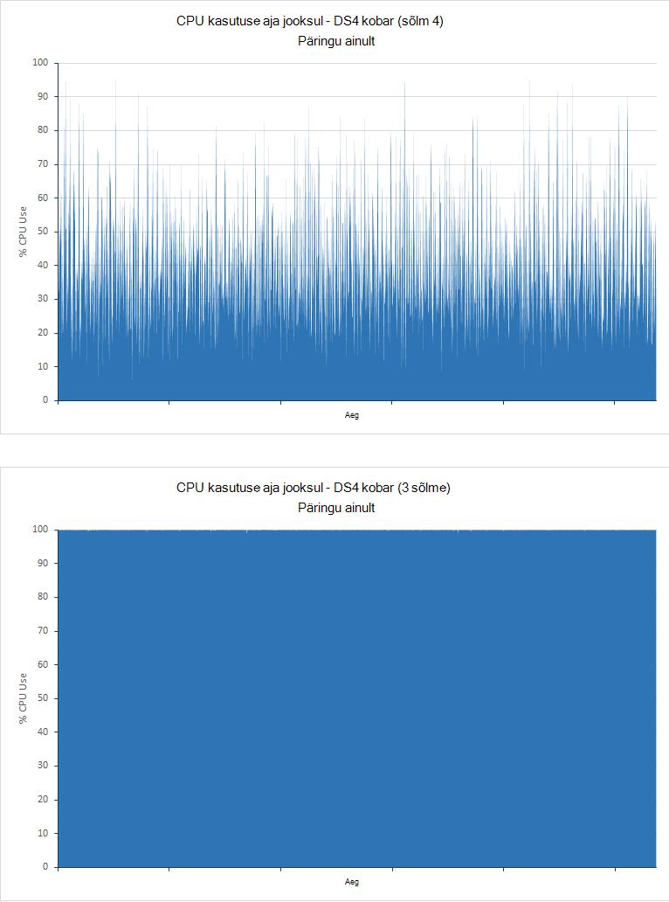

<properties
   pageTitle="Andmete koondamine ja päringu jõudluse Elasticsearch Azure häälestamine | Microsoft Azure'i"
   description="Peaksite arvesse võtma, kui päring ja otsingu jõudlust Elasticsearch optimeerida kokkuvõte."
   services=""
   documentationCenter="na"
   authors="dragon119"
   manager="bennage"
   editor=""
   tags=""/>

<tags
   ms.service="guidance"
   ms.devlang="na"
   ms.topic="article"
   ms.tgt_pltfrm="na"
   ms.workload="na"
   ms.date="09/22/2016"
   ms.author="masashin"/>
   
# <a name="tuning-data-aggregation-and-query-performance-with-elasticsearch-on-azure"></a>Andmete koondamine ja päringu jõudluse Elasticsearch Azure häälestamine

[AZURE.INCLUDE [pnp-header](../../includes/guidance-pnp-header-include.md)]

See artikkel on [osa sarjast](guidance-elasticsearch.md). 

Kasutades Elasticsearch põhjuseks on toetada otsib andmeid. Kasutajate peaks oskama kiiresti leida teavet, mida nad otsivad. Lisaks peavad süsteemi võimaldavad kasutajatel andmete küsimusi, pöörduge korrelatsiooni ja tulla järeldusi, et saate juhtida äriotsuseid. See töötlemine on, mis teavet andmete eristab.

Selle dokumendi Kokkuvõte suvandid, mida võib lugeda, on parim viis määramisel optimeerida teie süsteemi jõudluse päringu ja otsida.

Kõik jõudluse soovitused sõltub suuresti stsenaariumid, mis rakenduvad teie olukord andmeid, mida teil on indekseerimine ja määr, kus rakendused ja kasutajate päringu andmete maht. Muudatuste tulemuste peaks hoolikalt testida, konfigureerimine või indekseerimise abil oma andmed ja töökoormus hinnake oma teatud stsenaariumide kasu struktuuri. Selleks, et selle dokumendi kirjeldatakse arvu kriteeriumid, mis olid läbi ühe kindla stsenaariumi puhul kasutada erinevaid konfiguratsioone. Saate kohandada oma süsteemide hindamaks lähenemisviisi. Katsete üksikasjad on kirjeldatud [liites](#appendix-the-query-and-aggregation-performance-test).

## <a name="index-and-query-performance-considerations"></a>Funktsioonide index ja päringu jõudluse huvides

Selles jaotises kirjeldatakse mõned levinud tegurid, mis peaks teie arvates kui kujundamisel indeksid seda vaja kiiresti päringu- ja otsimise kohta.

### <a name="storing-multiple-types-in-an-index"></a>Registri mitut tüüpi talletamine

Registri Elasticsearch võib sisaldada mitut tüüpi. See võib olla parem vältida seda moodust ja iga eraldi loomine. Võtke arvesse järgmist.

- Eri tüüpi võib määrata eri analüsaatorid ja alati ei ole selge, milline analüsaator Elasticsearch kasutada juhul, kui päring sooritatakse index tasemel, mitte tasemel tüüp. Üksikasjad leiate [Vältimiseks tüüp komistuskive saavutamisel](https://www.elastic.co/guide/en/elasticsearch/guide/current/mapping.html#_avoiding_type_gotchas) .

- Registrite mitut tüüpi reguleerivad shards tõenäoliselt suuremad kui registrid, mis sisaldavad ühte tüüpi. Suurem Kildu rohkem vaeva nõutud Elasticsearch andmete filtreerimiseks täites päringud.

- Kui andmemahtudega tüüpi vahel on oluline lahknevuse, ühte tüüpi teavet saate muutuvad hõredalt jaotatud üle mitme shards vähendada tõhusust otsinguid, et neid andmeid tuua.

    

    ***Mõju ühiskasutuse registri vahel*** 

    Skeemi ülemises osas on sama registri jagatud dokumendid tüüp A ja b tüüp On palju rohkem dokumente type a kui B. otsib tüüp on kaasata kõik neli shards päringu tüüp. Skeemi alumine osa näitab mõju kui eraldi registrid luuakse iga. Sel juhul otsib tüüp suudab ainult jaoks on vaja kahte shards juurdepääs.

- Väike shards võib olla veel ühtlaselt jaotatud, kui suure shards, hõlbustades Elasticsearch levitada laadi sõlmed üle.

- Eri tüüpi võib olla erinevad säilitus perioodide. See võib olla keeruline arhiivida vanu andmeid, mis jagab shards aktiivne andmetega.


Siiski teatud tingimustel registri ühiskasutamine tüüpi saab tõhusa kui:

- Otsingud hõlmata regulaarselt olevad sama registri tüübid.

- Tüübid on ainult dokumentide iga väike arv. Säilitades eraldi shards iga võib muutuda märgatavat pea kohal sel juhul.


### <a name="optimizing-index-types"></a>Indeksi tüüpi optimeerimine

Registri Elasticsearch sisaldab algse JSON dokumendid, mida kasutati asustamiseks selle koopia. Seda teavet hoitakse soovitud [* \_allika*](https://www.elastic.co/guide/en/elasticsearch/reference/current/mapping-source-field.html#mapping-source-field) iga indekseeritud üksuse välja. Andmed pole otsitavate, kuid vaikimisi on tagastatud *hankimine* ja *Otsing* taotlused. Siiski väli andmesidekasutusele pea kohal ja lahtriviide salvestusruumi, muutes shards suuremat ja läbi sisend mahu suurendamine. Saate keelata funktsiooni * \_allika* välja alusel kohta tüüp:

```http
PUT my_index
{
  "mappings": {
    "my_type": {
      "_source": {
        "enabled": false
      }
    }
  }
}
```
Väli keelamine eemaldatakse ka võimalus teha järgmisi toiminguid:

- Registri andmete värskendamist, kasutades funktsiooni *värskendada* API.

- Otsinguid, mis tagastavad esiletõstetud andmed.

- Reindexing ühe Elasticsearch registrist otse teisele.

- Vastendused või analüüsi sätete muutmine.

- Algse dokumendi vaatamise silumine päringud.


### <a name="reindexing-data"></a>Andmete reindexing

Saadaval registri shards arv määrab lõpuks registri võimsus. Saate teha ka algse (ja kursis püsida) hinnang veebisaidil mitu shards on vaja, kuid peaksite alati dokumendi uuesti indekseerimise strateegia ette. Paljudel juhtudel reindexing võib olla ettenähtud ülesanne andmete kasvab. Teil võib-olla soovite eraldada suure hulga shards soovite registri esialgu huvides optimeerimine, kuid uus shards eraldada, kui andmete maht. Muudel juhtudel reindexing võib vaja teha veel erakorralist alusel kui prognoosi kohta andmete kasv osutuda lihtsalt ebatäpne.

> [AZURE.NOTE] Reindexing ei pruugi olla vajalik aegade kiiresti andmeid. Sellisel juhul võivad rakenduse Loo uus indeks iga aja jooksul. Näited kaasamine jõudluse logide või Auditilogi andmeid, mis võivad olla talletatud värske registris iga päev.

<!-- -->

Tõhus reindexing hõlmab vana andmetest uue registri loomise ja vana registri seejärel eemaldamine. Kui indeks on suur, see protsess võib võtta aega ja soovite tagada, et andmed jäävad otsitavate selle aja jooksul. Seetõttu tuleb teil luua [iga indeksi pseudonüüm](https://www.elastic.co/guide/en/elasticsearch/reference/current/indices-aliases.html)ja päringud peaks laadida neid pseudonüümid kaudu. Samal ajal reindexing, säilitamine suunatud vana registri pseudonüüm ja seejärel lülitage see viitamiseks uus indeks kui reindexing on lõpule viidud. See lähenemine on kasulik ajapõhiste andmete, mis loob uue registri iga päev. Praeguse juurdepääsuks kasutada andmete pseudonüümi, mis liigub uus indeks, nagu see on loodud.

### <a name="managing-mappings"></a>Vastenduste haldamine

Elasticsearch kasutab vastendused, et määrata, kuidas andmeid, mis ilmneb iga välja dokumendi tõlgendamine. Iga tüüp on oma vastenduse, mis määratleb tõhus skeemi jaoks. Elasticsearch kasutab seda teavet tüüpi dokumentides pööratud registrid iga välja jaoks luua. Mis tahes dokumendis iga väli on soovitud andmetüüp (nt *stringi*, *kuupäev*või *pikk*) ja väärtus. Saate määrata vastendused registri jaoks registri loomist, kui nad saavad tuletatud Elasticsearch, kui uued dokumendid lisatakse tüüp. Siiski, võtke arvesse järgmist.

- Dünaamiliselt loodud vastendused võib põhjustada tõrkeid, olenevalt sellest, kuidas väljad tõlgendatakse registri dokumentide lisamisel. Näiteks 1 dokument võib sisaldada välja A, millel on mitmeid ja põhjuste Elasticsearch lisada vastenduse, mis määrab, et väli on on *pikk*. Kui edasiste dokument on lisatud väli, kus A sisaldab mittearvulisi andmeid, siis see ei õnnestu. Sel juhul välja A peaksite ilmselt on tõlgendatakse kui stringi esimese dokumendi lisamisel. Määrab selle vastenduse registri loomisel aitab vältida selliseid probleeme.

- Kujundage oma dokumentide vältida liiga suur vastendused nagu see lisada olulisi kohal otsinguid, peab olema palju mälu ja põhjustada ka päringute nurjumise andmeid leida. Dokumentide ühiskasutusse andmine on sama tüüpi väljad ühtsete nimereeglistik vastu. Näiteks ärge kasutage välja nimed, nt "first_name", "Eesnimi" ja "eesnimi" mitu dokumenti. Kasutage igas dokumendis sama välja nime. Lisaks proovivad kasutada väärtuste klahvid (see on levinum lähenemine veeru-pere andmebaaside, kuid võib põhjustada ebatõhusus ja tõrkeid Elasticsearch.) Lisateabe saamiseks vt [Vastendamise plahvatus](https://www.elastic.co/blog/found-crash-elasticsearch#mapping-explosion).

- Kasutage *not_analyzed* vältimiseks avaldise loa loomine vajaduse korral. Näiteks kui dokument sisaldab stringi väli nimega väärtust "ABC DEF" *andmete* siis võib proovite saate otsida kõiki dokumente, mis vastavad selle väärtuse järgmiselt:

  ```http
  GET /myindex/mydata/_search
  {
    "query" : {
      "filtered" : {
        "filter" : {
          "term" : {
            "data" : "ABC-DEF"
          }
        }
      }
    }
  }
  ```

 See otsing ei õnnestu tagastada tõttu, kus on string ABC DEF tokenized, kui see on indekseeritud nii oodatud tulemusi. See tõhus jagatakse kaks märkide ABC ja DEF, sidekriipsu abil. See funktsioon on mõeldud toetama täielik teksti otsimine, kuid kui stringi tõlgendada atomic ühe üksuse soovite keelake avaldise loa loomine, kui dokument on lisatud register. Saate kasutada vastenduse näiteks järgmine:

  ```http
  PUT /myindex
  {
    "mappings" : {
      "mydata" : {
        "properties" : {
          "data" : {
            "type" : "string",
            "index" : "not_analyzed"
          }
        }
      }
    }
  }
  ```

  Lisateabe saamiseks vt [Täpse väärtuste otsimine](https://www.elastic.co/guide/en/elasticsearch/guide/current/_finding_exact_values.html#_term_filter_with_text).


### <a name="using-doc-values"></a>Dokumendi väärtuste kasutamine

Palju päringud ja liitmised nõua, et andmed on sorditud Otsingu toiming osana. Sortimise nõuab ei saaks seda dokumentide loendi ühe või mitme tingimuse vastendada. Et aidata seda toimingut, Elasticsearch laadida kõik kasutada sortimine mällu välja väärtused. See teave on tuntud *fielddata*. Soovidele on, et fielddata mälu vahemällu andmesidekasutusele vähem I/O ja võib olla kiirem kui lugemine korduvalt samu andmeid kettalt. Kui väli on saab siis salvestamise funktsiooni fielddata mälu kõrge arvutite kasutada palju hunnik ruumi, võib-olla mõjutavad võimalus muude samaaegseid toiminguid või isegi kurnav salvestusruumi põhjustada Elasticsearch nurjumise.

Alternatiivne lähenemisviisi toetab Elasticsearch ka *dokumendi väärtused*. Dokumendi väärtus on sarnane-mälu fielddata üksuse, välja arvatud juhul, kui see on talletatud kõvakettal ja luua, kui andmed on salvestatud registri (fielddata ehitatakse dünaamiliselt kui päring on tehtud.) Dokumendi väärtused tarbimine hunnik ruumi ja seega on kasulikud päringud sortimine või koondandmete üle väljade mis võib olla väga suure hulga kordumatuid väärtusi. Lisaks aitab vähendatud rõhu Heap offset kettalt andmete toomine ja mälust lugemise jõudluse erinevused. Prügikoristus on tõenäoline harvem ja muude samaaegseid toimingute kohta, mida kasutada mälu on vähem tõenäoliselt toimuda.

Lubamine või keelamine dokumendi väärtuste kohta atribuudi eraldi registri abil *doc_values* atribuut, nagu on näidatud järgmises näites:

```http
PUT /myindex
{
  "mappings" : {
    "mydata" : {
      "properties" : {
        "data" : {
          ...
          "doc_values": true
        }
      }
    }
  }
}
```
> [AZURE.NOTE] Dokumendi väärtused on vaikimisi koos Elasticsearch versioon 2.0.0 aastast.

Dokumendi väärtusi täpset mõju tõenäoliselt tugevalt seotud oma andmed ja päringu stsenaariume, et olla valmis testivad jõudluse luua nende kasulikkus. Pange ka selle dokumendi analüüsitud stringi väljade väärtused ei tööta. Lisateabe saamiseks lugege teemat [Dokumendi väärtused](https://www.elastic.co/guide/en/elasticsearch/guide/current/doc-values.html#doc-values).

### <a name="using-replicas-to-reduce-query-contention"></a>Koopiad vähendada päringu abil

Päringute jõudlust parandada ühise strateegia on palju koopiad iga indeksi loomiseks. Andmete toomine toimingute saab täidetud andmete tõmbamine koopia. Siiski strateegia oluliselt mõjutada andmete manustamisest toimingute, selleks tuleb kasutada hoolikalt stsenaariumid, mis hõlmavad kombineeritud töökoormus. Lisaks strateegia ei ainult kasu kui koopiad on jaotatud üle sõlmed ja pole võistlema ressursid esmane shards, mis on osa sama registri abil. Pidage meeles, et on võimalik suurendamiseks või vähendamiseks dünaamiliselt vastuste jaoks registri arv.

### <a name="using-the-shard-request-cache"></a>Kildu taotluse vahemälu kasutamine

Elasticsearch saab vahemälu taotleja päringud iga Kildu mällu kohalikud andmed. See võimaldab otsingupäringutest, millega käivitamiseks kiiremini, andmete saate lugeda mälu, mitte vaba talletusruumi samade andmete toomiseks. Sellisel viisil andmete vahemällu seetõttu parandada mõne otsingu toimingute, hinnaga saadaval muude toimingute läbi samaaegselt vähendada. Olemas on ka risk, et andmete serveeritud vahemälust on aegunud. Andmete vahemälu on ainult kehtetuks, kui on Kildu värskendatakse ja andmed on muutunud. Värskendab sagedus reguleerib *refresh_interval* sätte indeksi väärtus.

Registri vahemällu kutse on vaikimisi välja lülitatud, kuid saate lubada järgmiselt:

```http
PUT /myindex/_settings
{
  "index.requests.cache.enable": true
}
```

Kildu taotluse vahemälu sobib kõige teave, mis jääb suhteliselt staatilise, nt ajalooliste või logides sinna andmeid.

### <a name="using-client-nodes"></a>Kliendi sõlmed abil

Kõik päringud töötleb sõlm, mis esmalt saab taotluse. Selle sõlme saadab täpsemaks taotlused kõik sõlmed sisaldav shards jaoks indeksid on esitatakse selle kohta päring ja seejärel liidetakse tulemused tagasi vastuse saamiseks. Kui päring hõlmab andmete liitmise või läbimiseks keerukate arvutuste, algse sõlm on tegemise vastav töötlemine. Kui teie süsteemi peab toetama keerukate päringute võrdlemisi väike arv, kaaluge kogumi kliendi sõlmed laadi andmete sõlmed leevendada. Vastupidi, kui teie süsteemi on reageerimine hulgaliselt lihtpäringuid, seejärel esitada taotlused otse andmete sõlmi ja hajutamine taotluste laadi koormusetasakaalustusteenuse abil.

### <a name="tuning-queries"></a>Päringute häälestamine

Näpunäiteid Elasticsearch päringute jõudlust maksimeerimine järgmist Kokkuvõte

- Vältige päringud, mis hõlmavad metamärgistust võimaluse.

- Kui sama väli on kehtivad täisteksti otsingu- ja sobitamine, siis kaaluge välja andmete säilitamise analüüsitud ja nonanalyzed vorme. Teha täisteksti otsingute suhtes analüüsitud välja ja vastu nonanalyzed välja täpsed vasted.

- Ainult tagastada vajalikud andmed. Kui teil on suur dokumente, kuid rakenduse ainult nõuab teavet olevad väljad alamhulga, tagastab funktsioon selle alamhulk päringud, mitte kogu dokumendid. Selle strateegia saab vähendada klaster võrgu läbilaskevõime nõuetele.

- Võimaluse korral kasutada filtrite asemel päringute andmete otsimisel. Filtri lihtsalt määrab, kas dokumendi vastab antud kriteeriumi tuleks päringu ka arvutab kui lähedal (hinded) dokumendi vaste. Sees, loodud filtri väärtused on talletatud, mis näitab, match/ei iga dokumendi vaste rasterpildina ja ta saab kopeerida Elasticsearch. Kui sama filtri kriteeriumi esineb hiljem, saab rasterpilt vormilt vahemälu ja kasutada kiiresti toomiseks vastavaid dokumente. Lisateavet leiate teemast [Sisemise Filtreerimistoiming](https://www.elastic.co/guide/en/elasticsearch/guide/current/_finding_exact_values.html#_internal_filter_operation).

- *Bool* filtrid läbimiseks võrdlusi staatilise ja ainult abil *, *või*ja *mitte* filtrite*dünaamiliselt arvutatud filtrid, nagu need, mis hõlmavad scripting või *geo -\* * filtrid.

- Kui päringu ühendab *bool* filtrid *ja*, *või*, või *mitte* *geo* -* filtrid, paigutada selle *ja*/*või*/*geo-** filtrid viimati nii, et nad toimivad andmehulga väikseim võimalik.

    Samuti käitada kallis filter toimingud on *post_filter* abil. Viimati täita need filtrid.

- Kasutage liitmised asemel aspekte. Vältige agregaadid, et analüüsitakse või mis on palju võimalike väärtuste arvutamiseks.

    > **Märkus**: omadustega on eemaldatud Elasticsearch versioon 2.0.0 sisse.

- Kasutage *arvutite* koondamine asemel *value_count* koondamine juhul, kui teie rakendus nõuab täpset arvu sobitamine üksused. Mõne täpset arvu saate kiiresti aeguda ja paljude rakenduste puhul ainult mõistlikum ühtlustamise.

- Vältige skriptimise. Päringud ja filtrid skriptide saab kallis ja tulemused pole vahemällu. Pikaajalisi skriptide saab kasutada otsingu Teemad lõputult, põhjustades edaspidised taotlused pandud järjekorda. Kui järjekorda täitub, on tagasi taotlusi lükata.

## <a name="testing-and-analyzing-aggregation-and-search-performance"></a>Testimine ja liitmise ja otsing jõudluse analüüs

Selles jaotises kirjeldatakse katsed, mis olid läbi erineva kobar ja index konfiguratsioone tulemused. Kahte tüüpi kontrollib olid läbi järgmiselt:

- * *Funktsiooni *manustamisest ja päringu* testi **. Selle testi alustamine tühja registri, mis on täidetud, nagu test mitmes toimingute hulgi lisa (iga toimingu lisada 1000 dokumendid). Samal ajal oli eelnev 15 minuti jooksul lisatud dokumentide ja luua liitmised loodud päringute arv 5 teise ajavahemike järel. Selle testi lubati tavaliselt käivitamiseks 24 tundi, et mõju on keeruline töökoormus, mis sisaldab suuremahuliste andmete manustamisest koos lähedal reaalajas päringute.

- **Kuvatakse *ainult päringu* **testida. Selle testi sarnaneb selle *manustamisest ja päringu* testida, et osa manustamisest puudub ja iga sõlme register on asustatud 100 miljonit dokumendid. Sooritatakse muudetud kogum, päringud; Kui andmed on nüüd staatiline on eemaldatud aja elemendi piirata dokumentide neile lisatud viimase 15 minutit. Testide parandusfunktsiooni 90 minutit, on vähem aega, et täitmise mustri tõttu fikseeritud suurt hulka andmeid.

---

Iga dokumendi registri oli sama skeemiga. Selles tabelis on kokku võetud skeemiga väljad.

Nimi                          | Tüüp         | Märkmete |
  ----------------------------- | ------------ | -------------------------------------------------------- |
  Ettevõtte                  | String      | Test loob 200 kordumatu ettevõtted. |
  CustomField1 - CustomField5   |String       |Need on viis stringi väljad, mis on määratud tühi string.|
  DateTimeRecievedUtc           |Ajatempli    |Kuupäev ja kellaaeg, kus dokument on lisatud.|
  Host                          |String       |Selle väärtuseks on seatud tühja stringi.|
  HttpMethod                    |String       |See väli on määratud üks järgmistest väärtustest: "POSTITA", "GET", "Pane".|
  HttpReferrer                  |String       |Selle väärtuseks on seatud tühja stringi.|
  HttpRequest                   |String       |See väli lisatakse suvaline tekst vahel 10 ja 200 märki.|
  HttpUserAgent                 |String       |Selle väärtuseks on seatud tühja stringi.|
  HttpVersion                   |String       |Selle väärtuseks on seatud tühja stringi.|
  OrganizationName              |String       |Selle väärtuseks on sama väärtuse, mis ettevõtte välja.|
  SourceIp                      |IP           |Väli sisaldab andmeid "päritolu" IP-aadress. |
   SourceIpAreaCode              |Pikk         |Selle väärtuseks on 0.|
  SourceIpAsnNr                 |String       |Selle väärtuseks on seatud "AS\#\#\#\#\#".|
  SourceIpBase10                |Pikk         |Selle väärtuseks on 500.|
  SourceIpCountryCode           |String       |Sellel väljal 2-kohalise riigi kood. |
  SourceIpCity                  |String       |Sellel väljal tuvastamise linna riigis string. |
  SourceIpLatitude              |Kahekordne       |Sellel väljal juhusliku väärtuse.|
  SourceIpLongitude             |Kahekordne       |Sellel väljal juhusliku väärtuse.|
  SourceIpMetroCode             |Pikk         |Selle väärtuseks on 0.|
  SourceIpPostalCode            |String       |Selle väärtuseks on seatud tühja stringi.|
  SourceLatLong                 |Geo punkti   |Selle väärtuseks on seatud juhusliku geo punkti.|
  SourcePort                    |String       |See väli lisatakse stringi kujutis juhusliku arvu.|
  TargetIp                      |IP           |See lisatakse vahemikus 0.0.100.100 abil 255.9.100.100 juhusliku IP-aadress.|
  SourcedFrom                   |String       |Selle väärtuseks on string "MonitoringCollector".|
  TargetPort                    |String       |See väli lisatakse stringi kujutis juhusliku arvu.|
  Hindamine                        |String       |See väli lisatakse ühte valitud juhusliku 20 eri stringiväärtust.|
  UseHumanReadableDateTimes     |Kahendmuutuja      |Väli väärtuseks false.|
 
Iga iteratsiooni testist on läbi nimega partii järgmistele küsimustele. Kursiivkirjas nimed kasutatakse viidata selle dokumendi ülejäänud need päringud. Pange tähele, et aeg kriteeriumi (viimase 15 minuti jooksul lisatud dokumendid) on välja jäetud, kuvatakse *ainult päringu* kontrollib:

- Kui palju dokumentide iga väärtuse *reiting* sisestatud viimase 15 minutit (*Count reiting*)? 

- Kui palju dokumente on lisatud iga 5 minuti järel (*arv aja jooksul*) viimase 15 minuti jooksul?

- Kui palju dokumente iga väärtuse *reiting* on lisatud iga riigi viimase 15 minutit (*valib riik*)?

- Millist 15 ettevõtted esineb kõige sagedamini dokumentide lisatud viimase 15 minutit (*ülemine 15 ettevõtted*)?

- Kui palju erinevaid ettevõtted tekkida dokumentide lisatud viimase 15 minutit (*kordumatu count ettevõtted*)?

- Viimase 15 minuti (*kokku tabamust kokku*) on lisatud mitu dokumenti?

- Kui palju erinevaid *SourceIp* väärtusi tekkida dokumentide lisatud viimase 15 minutit (*kordumatu IP loendus*)?


Registri määratluse ja päringute üksikasjad on esitatud [liites](#appendix-the-query-and-aggregation-performance-test).

Testide loodud mõista järgmiste muutujate mõju:

- **Ketas tüüp**. Katsete läbi 6 sõlme kobar D4 vms abil standard salvestusruumi (HDD-d) ja 6 sõlme klaster DS4 vms abil premium salvestusruumi (SSD) korrata.

- **Seadme suurus - ülespoole**. Kontrollib olid läbi 6 sõlme kobar, mis sisaldab DS3 VMs ( *väike* kobar määratud), mida korratakse klaster DS4 vms ( *keskmise* klaster), ja korrata uuesti klaster DS14 masinad ( *suur* klaster). Järgmises tabelis on kokkuvõte iga VM SKU põhitunnused:

 Kobar | VM SKU        | Arvu valdkond | Andmete ketast arv | RAM (GB) |
---------|---------------|-----------------|----------------------|----------|
 Small   | Standardse DS3  | 4               | 8                    | 14       |
 Keskmine  | Standardse DS4  | 8               | 16                   | 28       |
 Suure   | Standardse DS14 | 16              | 32                   | 112      |

- **Kobar suurus - skaala läbi**. Olid tehakse kogumite DS14 vms, mis sisaldab 6 sõlmed 1 ja 3.

- **Registri vastuste arv**. Katsed olid läbi, kasutades registrid konfigureeritud 1 ja 2 koopiad.

- **Dokumendi väärtused**. Testide olid algselt läbi registri säte *doc_values* väärtuseks *true* (vaikeväärtus). Valitud testide olid korrata *doc_values* väärtuseks *false*.

- **Vahemällu**. Katsed olid teha Kildu taotluse vahemälu registri puhul lubatud.

- **Shards arv**. Kontrollib olid korrata eri arvu shards abil saate kindlaks teha, kas päringud parandusfunktsiooni tõhusamalt registrid, mis sisaldavad vähem, suurem shards või rohkem, väiksemad shards üle.


## <a name="performance-results---disk-type"></a>Jõudluse tulemused - kettale tüüp

Jõudluse parandamine on hinnatud *manustamisest ja päringu* test töötab 6 sõlme klaster D4 vms (abil HDD-d) ja 6 sõlme klaster DS4 vms (abil SSD). Konfiguratsiooni Elasticsearch nii rühmades oli sama. Andmed on laiali 16 ketast iga sõlme ja iga sõlme oli 14GB RAM Java virtuaalse masina (töötab) töötab Elasticsearch eraldada, operatsioonisüsteemi kasutamiseks jäeti ülejäänud mälu (ka 14GB). Iga katse parandusfunktsiooni 24 tundi. Selle aja valitud andmete ilmnevad ja lubada süsteemi tasakaalustamiseks suurenevad maht mõju lubamine. Järgmises tabelis on kokkuvõte tulemused, esiletõstmine vastuse ajad erinevaid toiminguid, mis koosneb test.

 Kobar | Toiming päring            | Keskmine vastuse aeg (ms) |
---------|----------------------------|----------------------------|
 D4      | Manustamisest                  | 978                        |
         | Arv, hindamine            | 103                        |
         | Count aja jooksul            | 134                        |
         | Valib riigi            | 199                        |
         | Top 15 ettevõtted       | 137                        |
         | Kordumatu Count ettevõtted | 139                        |
         | Kordumatu IP loendamine            | 510                        |
         | Kokku tabamust kokku           | 89                         |
 DS4     | Manustamisest                  | 511                        |
         | Arv, hindamine            | 187                        |
         | Count aja jooksul            | 411                        |
         | Valib riigi            | 402                        |
         | Top 15 ettevõtted       | 307                        |
         | Kordumatu Count ettevõtted | 320                        |
         | Kordumatu IP loendamine            | 841                        |
         | Kokku tabamust kokku           | 236                        |

Esmapilgul tundub DS4 kobar teha päringuid vähem kui D4 kobar, aeg-ajalt kahekordistumise (või halvem) hästi vastuse aeg. See ei räägi kogu lugu küll. Järgmine tabel näitab manustamisest arv, mida iga kobar (Pidage meeles, et iga toimingu laadib 1000 dokumendid):

 Kobar | Manustamisest toiming arv |
---------|---------------------------|
 D4      | 264769                    |
 DS4     | 503157                    |

DS4 kobar suutis laadimine peaaegu kaks korda nii palju andmeid, kui D4 kobar katse ajal. Seetõttu analüüsis iga toimingu vastuse korda, peate mitu dokumenti skannida sisaldab mõlema päringu ja kui palju dokumendid tagastatakse silmas pidada. Neid dünaamiliseks arvud nagu registri dokumentide maht kasvab pidevalt. Ei saa lihtsalt jagamine 503137 264769 (iga kobar manustamisest toimingute arv) ja seejärel korrutage tulem väärtusega Keskmine vastuse aeg iga päringu poolt D4 kobar anda võrdleva teabe, nagu see ignoreerib sisend on samaaegselt sooritatud toimingu manustamisest summa. Selle asemel tuleks mõõta andmed kirjutatakse füüsilise kogus ja lugeda kettalt edenedes test. JMeter testi leping sisaldab see teave iga sõlme. Summeeritud tulemus on:

 Kobar | Keskmine baiti/lugemise iga |
---------|----------------------------------------------|
 D4      | 13471557                                     |
 DS4     | 24643470                                     |

Andmed näitab, et DS4 kobar oli võimalik säilitada I/O määr on ligikaudu 1,8 korda mis D4 kobar. Arvestades, et peale laad soovitud ketast, kõik muud ressursid on sama, erinevus peab olema tõttu SSD kasutamise asemel HDD-d.

Selleks, et see kokkuvõte õigustatud, järgmised graafikud illustreerivad, kuidas funktsiooni I/O oli läbi aja jooksul iga kobar:


<!-- -->

***Ketas tegevuste jaoks D4 ja DS4 rühmad***

Jaoks D4 kobar graafik esitab olulisi erinevusi, eriti pool test. See oli tõenäoliselt pidurdamise I/O vähendada. Algne etappide test päringud saavad kiiresti käivitamiseks, nagu on vähe andmeid analüüsida. Ketast D4 klaster tõenäoliselt seetõttu töötama lähedale sisend tegevuse kohta teine (IOPS) maht, kuigi iga I/O toiming võib olla esitus palju andmeid. DS4 kobar saab toetada IOPS kiirema ja on sama taseme ahendamine, I/O on veel tavaline. Selle toetamiseks Kuva järgmise paari graafikud, kuidas CPU blokeeriti ketta I/O aja jooksul (näidatud graafikud ketta ootama korda on aega, et CPU oodata I/O osa):


***CPU ketta I/O oodake lõpuaegade D4 ja DS4 rühmad***

See on oluline mõista on kaks peamine põhjust blokeerimiseks CPU/v-toimingud:

- I/O alasüsteemi võib lugemiseks või andmete kirjutamise, et või kettalt.

- I/O alasüsteemi võib Forefronti hosti keskkonnas. Azure'i ketast rakendada, kasutades HDD-d on 500 IOPS on maksimaalne läbilaskevõime ja SSD on 5000 IOPS on maksimaalne läbilaskevõime.


D4 kobar, jaoks soovitud ajakulu oodata I/O esimeses pooles korreleerub katse ajal lähemalt pööratud viisil koos I/O määra graafik. Perioodi madal sisend vastavad CPU veedab blokeeritud märgatavat aega, see näitab, et I/O on rakendus. Rohkem andmeid lisatakse klaster olukord muudatused ning teises pooles test peaks sisse I/O ootama korda vastavad peaks I/O läbilaskevõime sisse. Selles etapis CPU on blokeeritud reaal I/O täites; Klõpsake uuesti DS4 kobar, ajakulu ootamine I/O on palju isegi. Iga tippväärtus vastab on samaväärne tippväärtus I/O jõudluse asemel on minimaalne, see tähendab, et on või pole ahendamise jäävate.

On üks muu tegur. Katse ajal loodud D4 kobar 10584 manustamisest tõrgete ja 21 päringu tõrkeid. Test DS4 klaster toodeti tõrkeid.

## <a name="performance-results---scaling-up"></a>Jõudluse tulemused - ülespoole

Skaala üles test läbi kontrollib töötab 6 sõlme kogumite DS3 ja DS4 DS14 VMs suhtes. Nende SKU-de jaoks valitud Kuna DS4 VM pakub kaks korda CPU ja -vormid on DS3 mälu ja DS14 arvuti kahekordistab protsessori uuesti tagades mälu hulk neli korda. Järgmises tabelis võrreldes olulisi aspektide iga SKU:

 SKU-GA  | \#Protsessorituuma | Mälu (GB) | Max ketta IOPS | Max läbilaskevõime (MB/s)|
------|-------------|-------------|---------------|--------------|
 DS3  | 4           | 14          | 12 800| 128 |
 DS4  | 8           | 28          | 25600| 256 |
 DS14 | 16          | 112         | 50,000| 512 |

Järgmises tabelis on kokkuvõte (DS3) väike, Keskmine (DS4) ja suurtes (DS14) rühmades testide käitamise tulemused. Iga VM kasutada SSD andmeid hoida. Iga katse parandusfunktsiooni 24 tundi.

Tabeli aruanded eduka taotlusi igat tüüpi päringu (tõrked ei kuulu). Arvu proovitakse iga tüüpi päring on ligikaudu sama katse ajal. See on JMeter test leping käivitab üksiku toimumiskorra iga päringu (arv, hindamine, Count aja jooksul, tabamust riikide kaupa, Top 15 ettevõtted, kordumatu Count ettevõtted, kordumatu IP Count ja koguarv tabamust) koos ühe üksuse tuntud on *testida tehingu* (see tehing ei sõltu tööülesande, mis sooritavad manustamisest toiming, mida juhib eraldi protsessi). Iga katse lepingu iteratsiooni teostab tehingu ühe testi. Seetõttu on test tehingud arvu mõõtmine iga tehingu parema päringu vastuse aega.

| Kobar      | Toiming päring            | Taotluste arv | Keskmine vastuse aeg (ms) |
|--------------|----------------------------|--------------------|----------------------------|
| Väike (DS3)  | Manustamisest                  | 207284             | 3328                       |
|              | Arv, hindamine            | 18444              | 268                        |
|              | Count aja jooksul            | 18444              | 340                        |
|              | Valib riigi            | 18445              | 404                        |
|              | Top 15 ettevõtted       | 18439              | 323                        |
|              | Kordumatu Count ettevõtted | 18437              | 338                        |
|              | Kordumatu IP loendamine            | 18442              | 468                        |
|              | Kokku tabamust kokku           | 18428              | 294   
|||||
| Keskmine (DS4) | Manustamisest                  | 503157             | 511                        |
|              | Arv, hindamine            | 6958               | 187                        |
|              | Count aja jooksul            | 6958               | 411                        |
|              | Valib riigi            | 6958               | 402                        |
|              | Top 15 ettevõtted       | 6958               | 307                        |
|              | Kordumatu Count ettevõtted | 6956               | 320                        |
|              | Kordumatu IP loendamine            | 6955               | 841                        |
|              | Kokku tabamust kokku           | 6958               | 236                        |
|||||
| Suur (DS14) | Manustamisest                  | 502714             | 511                        |
|              | Arv, hindamine            | 7041               | 201                        |
|              | Count aja jooksul            | 7040               | 298                        |
|              | Valib riigi            | 7039               | 363                        |
|              | Top 15 ettevõtted       | 7038               | 244                        |
|              | Kordumatu Count ettevõtted | 7037               | 283                        |
|              | Kordumatu IP loendamine            | 7037               | 681                        |
|              | Kokku tabamust kokku           | 7038               | 200                        |

Need arvud näitavad, et selle testi jaoks DS4 ja DS14 kobar jõudlus on mõistlik sarnased. Vastuse korda päringu toimingute jaoks DS3 kobar kuvatakse ka soodsalt algselt võrdlemiseks ja päringu toimingute arv on kaugele üle DS4 ja DS14 kobar väärtused. Siiski ühte võtma tugev teate manustamisest määr ja järgnevad dokumentide arv, mida otsida. DS3 kobar piirab manustamisest palju ja lõpuks test andmebaasi ainult esitatud 40% dokumentide iga kahe rühmad lugeda. See on võib olla tingitud töötlemise ressursside, võrgu ja vaba läbilaskevõime DS3 VM võrreldes DS4 või DS14 VM. DS4 VM on kaks korda paljudest allikatest nimega DS3 VM ja kui neid on DS14 on kaks korda (neli korda mälu) DS4 VM ressursside, jääb üks küsimus: Miks on DS4 ja DS14 rühmad manustamisest määrade vahe oluliselt väiksem kui vahele DS3 ja DS4 rühmad? See võib olla tingitud võrgu kasutamise ja läbilaskevõime piirangute Azure'i vms. Järgmised joonised Kuva selle kõigi kolme kogumite andmeid:


**Võrgu kasutamise jaoks manustamisest ja päringu katse DS3 ja DS4 DS14 rühmad** 

<!-- -->

Võrgu läbilaskevõime ja Azure VMs piiranguid on avaldatud ja võib olla muutuv, kuid asjaolu, et võrgu tegevuse kuvatakse tasakaalustunud umbes 2.75GBps keskmiseks jaoks mõlema funktsiooni DS4 ja DS14 kontrollib näitab, et selline piirang on täis ja primaarne piirata läbilaskevõime on muutunud. Puhul DS3 kobar, võrgu tegevuse oli oluliselt väiksem, nii et alumise jõudlus on muud ressursid kättesaadavuse piirangute tõttu.

Päringu ainult testide kogumi tehtud eristada manustamisest toimingute efektid ja illustreerivad, kuidas päringu jõudluse muutub nagu sõlmed mastaapimiseks, kasutades sama sõlmed. Järgmises tabelis on kokkuvõte saadud tulemuste iga kobar kohta:

> [AZURE.NOTE] Ei tohiks võrrelda jõudlus ja taotluste sooritatud päringute arv on *ainult päringu* testi nende käivitamine *manustamisest ja päringu* test. Selle põhjuseks on muudetud päringute ja seotud dokumentide maht on erinev.

| Kobar      | Toiming päring            | Taotluste arv | Keskmine vastuse Ttme (ms) |
|--------------|----------------------------|--------------------|----------------------------|
| Väike (DS3)  | Arv, hindamine            | 464                | 11758                      |
|              | Count aja jooksul            | 464                | 14699                      |
|              | Valib riigi            | 463                | 14075                      |
|              | Top 15 ettevõtted       | 464                | 11856                      |
|              | Kordumatu Count ettevõtted | 462                | 12314                      |
|              | Kordumatu IP loendamine            | 461                | 19898                      |
|              | Kokku tabamust kokku           | 462                | 8882  
|||||
| Keskmine (DS4) | Arv, hindamine            | 1045               | 4489                       |
|              | Count aja jooksul            | 1045               | 7292                       |
|              | Valib riigi            | 1053               | 7564                       |
|              | Top 15 ettevõtted       | 1055               | 5066                       |
|              | Kordumatu Count ettevõtted | 1051               | 5231                       |
|              | Kordumatu IP loendamine            | 1051               | 9228                       |
|              | Kokku tabamust kokku           | 1051               | 2180                       |
|||||
| Suur (DS14) | Arv, hindamine            | 1842               | 1927                       |
|              | Count aja jooksul            | 1839               | 4483                       |
|              | Valib riigi            | 1838               | 4761                       |
|              | Top 15 ettevõtted       | 1842               | 2117                       |
|              | Kordumatu Count ettevõtted | 1837               | 2393                       |
|              | Kordumatu IP loendamine            | 1837               | 7159                       |
|              | Kokku tabamust kokku           | 1837               | 642                        |

Seekord trendide Keskmine vastuse Times üle erinevate rühmad on selgem. Võrgu kasutamine on ka all 2.75GBps, mis on varem nõutud DS4 ja DS14 rühmad, (mis ilmselt küllastunud võrgu manustamisest ja päringu katsete), ja 1.5GBps DS3 kobar jaoks. Tegelikult on lähemal 200MBps alati graafikud, mis on allpool näidatud:


***Võrgu jaoks DS3, kasutamine päringu ainult katse DS4 ja DS14 kogumite*** 

Piiramine tegur rühmades DS3 ja DS4 kuvatakse nüüd olema CPU kasutamine, mis on palju aega peaaegu 100%. Funktsiooni DS14 kobar CPU kasutus keskmise üle 80%. See on endiselt kõrge, kuid selgelt tõstetakse eeliseid, millel on veel saadaval protsessorituuma. Järgmisel pildil on kujutatud CPU kasutus mustrid DS3 ja DS4 DS14 rühmad.


***CPU kasutuse jaoks päringu ainult katse DS3 ja DS14 rühmad*** 

## <a name="performance-results---scaling-out"></a>Jõudluse tulemused - skaala läbi

Illustreerivad, kuidas sõlmed arvu skaala süsteemi, kontrollib olid käivitada, kasutades DS14 kogumite, mis sisaldab 6 sõlmed 1 ja 3. Seekord ainult selle *päringu ainult* tehtud, kasutades 100 miljonit dokumendid ja 90 minutit töötab:

| Kobar | Toiming päring            | Taotluste arv | Keskmine vastuse aeg (ms) |
|---------|----------------------------|--------------------|----------------------------|
| 1 sõlm  | Arv, hindamine            | 288                | 6216                       |
|         | Count aja jooksul            | 288                | 28933                      |
|         | Valib riigi            | 288                | 29455                      |
|         | Top 15 ettevõtted       | 288                | 9058                       |
|         | Kordumatu Count ettevõtted | 287                | 19916                      |
|         | Kordumatu IP loendamine            | 284                | 54203                      |
|         | Kokku tabamust kokku           | 287                | 3333                       |
|||||
| 3 sõlmed | Arv, hindamine            | 1194               | 3427                       |
|         | Count aja jooksul            | 1194               | 5381                       |
|         | Valib riigi            | 1191               | 6840                       |
|         | Top 15 ettevõtted       | 1196               | 3819                       |
|         | Kordumatu Count ettevõtted | 1190               | 2938                       |
|         | Kordumatu IP loendamine            | 1189               | 12516                      |
|         | Kokku tabamust kokku           | 1191               | 1272                       |
|||||
| 6 sõlmed | Arv, hindamine            | 1842               | 1927                       |
|         | Count aja jooksul            | 1839               | 4483                       |
|         | Valib riigi            | 1838               | 4761                       |
|         | Top 15 ettevõtted       | 1842               | 2117                       |
|         | Kordumatu Count ettevõtted | 1837               | 2393                       |
|         | Kordumatu IP loendamine            | 1837               | 7159                       |
|         | Kokku tabamust kokku           | 1837               | 642                        |

Sõlmed arv muudab erinevus päringu täitmise kobar, kuigi nonlinear viisil. 3 sõlm kobar lõpetab ligikaudu 4 korda nii palju päringuid ühe sõlm kobar, nagu ajal 6 sõlm kobar tegeleb 6 korda nii palju. Selgitavad seda nonlinearity kuvada järgmised graafikud, kuidas CPU tarbimine kolme rühmad:


***1, 3 ja 6 sõlme kogumite päringu ainult katse CPU kasutamine***

Ühe sõlme ja 3 sõlme rühmad on seotud CPU, kuigi CPU kasutuse on kõrge 6 sõlme klaster on kasutamata töötlemise võimsus saadaval. Sel juhul võivad mõjutada ka muud tegurid piiramiseks on läbilaskevõime. Seda võib kinnitada katsetamine, 9 ja 12 sõlmed, mis tõenäoliselt Kuva täpsemaks vaba töötlemise võimsus.

Ülaltoodud tabelis andmete samuti näitab, kuidas Keskmine vastuse korda päringute erineda. See on üksus, mis on kõige tähenduslik testimine, kuidas süsteemi skaala teatud tüüpi päringu. Mõned otsingud on selgelt palju tõhusama kui kestvad rohkem sõlmi, kui teised. Põhjuseks võib olla sõlmed arv ja kobar suurendamisel dokumentide arv, iga kobar sisaldas 100 miljonit dokumendid. Kui otsinguid, mis hõlmavad andmete liitmise Elasticsearch protsessi ja puhvri koondamine käigus iga sõlme mälu andmed. Kui leidub rohkem sõlmi, on vähem andmeid tuua, puhvri, ja iga sõlme töötlemine.

## <a name="performance-results---number-of-replicas"></a>Jõudluse tulemused - vastuste arv

*Manustamisest ja päringu* testide olid vastuolus registri ühe koopiaga. Testide abil registri konfigureeritud kaks koopiad 6 sõlme DS4 ja DS14 rühmad olid korrata. Kõigi testide parandusfunktsiooni 24 tundi. Järgmine tabel sisaldab ühe- ja koopiate võrdleva tulemusi.

| Kobar | Toiming päring            | Keskmine vastuse aeg (ms) - 1 koopia | Keskmine vastuse aeg (ms) - 2 koopiad | % erinevust vastuse ajas |
|---------|----------------------------|----------------------------------------|-----------------------------------------|-------------------------------|
| DS4     | Manustamisest                  | 511                                    | 655                                     | + 28%                          |
|         | Arv, hindamine            | 187                                    | 168                                     | -10%                          |
|         | Count aja jooksul            | 411                                    | 309                                     | -25%                          |
|         | Valib riigi            | 402                                    | 562                                     | + 40%                          |
|         | Top 15 ettevõtted       | 307                                    | 366                                     | + 19%                          |
|         | Kordumatu Count ettevõtted | 320                                    | 378                                     | + 18%                          |
|         | Kordumatu IP loendamine            | 841                                    | 987                                     | + 17%                          |
|         | Kokku tabamust kokku           | 236                                    | 236                                     | + 0%                           |
||||||
| DS14    | Manustamisest                  | 511                                    | 618                                     | + 21%                          |
|         | Arv, hindamine            | 201                                    | 275                                     | + 37%                          |
|         | Count aja jooksul            | 298                                    | 466                                     | + 56%                          |
|         | Valib riigi            | 363                                    | 529                                     | + 46%                          |
|         | Top 15 ettevõtted       | 244                                    | 407                                     | + 67%                          |
|         | Kordumatu Count ettevõtted | 283                                    | 403                                     | + 42%                          |
|         | Kordumatu IP loendamine            | 681                                    | 823                                     | + 21%                          |
|         | Kokku tabamust kokku           | 200                                    | 221                                     | + 11%                          |

Manustamisest määr vähenemine koopiad suurem arv. See peaks oodata, nagu Elasticsearch kirjutamise rohkem koopiaid iga dokumendi loomisel täiendavate ketta I/O.  See kajastub graafikud jaoks DS14 kobar registrite 1 ja 2 koopiad, mis on näidatud järgmisel pildil. Registri 1 koopiaga, oli keskmine I/O määr 16896573 baiti sekundis. Registri 2 koopiad, oli keskmine I/O määr 33986843 baiti sekundis lihtsalt üle kahe korra.


***1 ja 2 koopiad manustamisest ja päringu katse sõlmed ketta I/O määr***

| Kobar | Päringu                      | Keskmine vastuse aeg (ms) - 1 koopia | Keskmine vastuse aeg (ms) - 2 koopiad |
|---------|----------------------------|----------------------------------------|-----------------------------------------|
| DS4     | Arv, hindamine            | 4489                                   | 4079                                    |
|         | Count aja jooksul            | 7292                                   | 6697                                    |
|         | Valib riigi            | 7564                                   | 7173                                    |
|         | Top 15 ettevõtted       | 5066                                   | 4650                                    |
|         | Kordumatu Count ettevõtted | 5231                                   | 4691                                    |
|         | Kordumatu IP loendamine            | 9228                                   | 8752                                    |
|         | Kokku tabamust kokku           | 2180                                   | 1909                                    |
|||||
| DS14    | Arv, hindamine            | 1927                                   | 2330                                    |
|         | Count aja jooksul            | 4483                                   | 4381                                    |
|         | Valib riigi            | 4761                                   | 5341                                    |
|         | Top 15 ettevõtted       | 2117                                   | 2560                                    |
|         | Kordumatu Count ettevõtted | 2393                                   | 2546                                    |
|         | Kordumatu IP loendamine            | 7159                                   | 7048                                    |
|         | Kokku tabamust kokku           | 642                                    | 708                                     |

Need tulemused näitavad parandamist DS4 kobar Keskmine aega, kuid DS14 kobar tõsta. Selleks, et need tulemused tõlgendada, võiksite kaaluda ka iga katse sooritatud päringute arv:

| Kobar | Päringu                      | Sooritatud arvu - 1 koopia | Sooritatud arvu - 2 koopiad |
|---------|----------------------------|------------------------------|-------------------------------|
| DS4     | Arv, hindamine            | 1054                         | 1141                          |
|         | Count aja jooksul            | 1054                         | 1139                          |
|         | Valib riigi            | 1053                         | 1138                          |
|         | Top 15 ettevõtted       | 1055                         | 1141                          |
|         | Kordumatu Count ettevõtted | 1051                         | 1136                          |
|         | Kordumatu IP loendamine            | 1051                         | 1135                          |
|         | Kokku tabamust kokku           | 1051                         | 1136                          |
|||||
| DS14    | Arv, hindamine            | 1842                         | 1718                          |
|         | Count aja jooksul            | 1839                         | 1716                          |
|         | Valib riigi            | 1838                         | 1714                          |
|         | Top 15 ettevõtted       | 1842                         | 1718                          |
|         | Kordumatu Count ettevõtted | 1837                         | 1712                          |
|         | Kordumatu IP loendamine            | 1837                         | 1712                          |
|         | Kokku tabamust kokku           | 1837                         | 1712                          |

Andmed kuvatakse sooritatud DS4 kobar päringute arv suurendada kooskõlas keskmise aja vähenemine, et uuesti soovitud vastupidist kehtib DS14 kobar. Üks oluline tegur on, et selle DS4 CPU kasutamine klaster koopia – 1 ja 2-koopia katsete ebaühtlaselt levinud. Mõned sõlmed eksponeerida lähedale 100% kasutamine, samas kui teised oli vaba töötlemise võimsus. Paranenud jõudlus tõenäoliselt seetõttu suurem võimalus levitamine töötlemine klaster sõlmed üle. Järgmisel pildil näidatakse CPU töötlemine vahel kergelt ja tugevalt kasutatud VMs (sõlmed 4 ja 3):



***Vähem levinud ja enim kasutatud sõlmed DS4 klaster päringu ainult katse CPU kasutamine***

DS14 kobar jaoks see ei olnud. CPU kasutuse mõlema katse oli alumise üle kõik sõlmed, ja teine koopia kättesaadavus sai väiksem ära ja mõne pea kohal:


***Vähem levinud ja enim kasutatud sõlmed DS14 klaster päringu ainult katse CPU kasutamine***

Need tulemused näitavad, et võrrelda teie süsteemi hoolikalt otsustamisel kasutada mitut koopiad. Alati peaks olema vähemalt üks koopia iga indeksi, (v.a juhul, kui olete valmis kaotada andmete sõlme nurjumisel), kuid täiendavad koopiad saate põhjusta vähe kasu, sõltuvalt teie töökoormus ja riistvara ressursid klaster süsteemi koormust.

## <a name="performance-results---doc-values"></a>Jõudluse tulemused - dokumendi väärtused

*Manustamisest ja päringu* katsed olid teha dokumendi väärtuste lubatud, põhjustades Elasticsearch väljad kettal sortimiseks kasutatud andmete talletamiseks. Testide olid keelatud, et Elasticsearch ehitatud fielddata dünaamiliselt ja selle mällu vahemälus talletatud dokumenti väärtustega korrata. Kõigi testide parandusfunktsiooni 24 tundi. Järgmises tabelis võrdleb vastuse kellaajad testide kogumite 6 sõlmed D4, DS4 ja DS14 VMs (D4 kobar kasutab tavalise kõvaketta, kuigi DS4 ja DS14 rühmad kasutada SSD) abil loodud suhtes.

| Kobar | Toiming päring            | Lubatud dokumendi väärtuste keskmine vastuse aeg (ms) – | Keskmine vastuse aeg (ms) – dokumendi väärtused, mis on keelatud. | % erinevust vastuse ajas |
|---------|----------------------------|-------------------------------------------------|--------------------------------------------------|-------------------------------|
| D4      | Manustamisest                  | 978                                             | 835                                              | -15%                          |
|         | Arv, hindamine            | 103                                             | 132                                              | + 28%                          |
|         | Count aja jooksul            | 134                                             | 189                                              | + 41%                          |
|         | Valib riigi            | 199                                             | 259                                              | + 30%                          |
|         | Top 15 ettevõtted       | 137                                             | 184                                              | + 34%                          |
|         | Kordumatu Count ettevõtted | 139                                             | 197                                              | + 42%                          |
|         | Kordumatu IP loendamine            | 510                                             | 604                                              | + 18%                          |
|         | Kokku tabamust kokku           | 89                                              | 134                                              | + 51%                          |
||||||
| DS4     | Manustamisest                  | 511                                             | 581                                              | + 14%                          |
|         | Arv, hindamine            | 187                                             | 190                                              | + 2%                           |
|         | Count aja jooksul            | 411                                             | 409                                              | -0,5%                         |
|         | Valib riigi            | 402                                             | 414                                              | + 3%                           |
|         | Top 15 ettevõtted       | 307                                             | 284                                              | -7%                           |
|         | Kordumatu Count ettevõtted | 320                                             | 313                                              | -2%                           |
|         | Kordumatu IP loendamine            | 841                                             | 955                                              | + 14%                          |
|         | Kokku tabamust kokku           | 236                                             | 281                                              | + 19%                          |
||||||
| DS14    | Manustamisest                  | 511                                             | 571                                              | + 12%                          |
|         | Arv, hindamine            | 201                                             | 232                                              | + 15%                          |
|         | Count aja jooksul            | 298                                             | 341                                              | + 14%                          |
|         | Valib riigi            | 363                                             | 457                                              | + 26%                          |
|         | Top 15 ettevõtted       | 244                                             | 338                                              | + 39%                          |
|         | Kordumatu Count ettevõtted | 283                                             | 350                                              | + 24%                          |
|         | Kordumatu IP loendamine            | 681                                             | 909                                              | + 33%                          |
|         | Kokku tabamust kokku           | 200                                             | 245                                              | + 23%                          |

Järgmises tabelis võrreldakse manustamisest toimingute katsete arv:

| Kobar | Manustamisest toiming arv - dokumendi väärtuste lubatud | Manustamisest toiming arv - dokumendi väärtuste keelatud | % erinevust \number manustamisest toimingute |
|---------|----------------------------------------------|-----------------------------------------------|-----------------------------------------|
| D4      | 264769                                       | 408690                                        | + 54%                                    |
| DS4     | 503137                                       | 578237                                        | + 15%                                    |
| DS14    | 502714                                       | 586472                                        | + 17%                                    |

Täiustatud manustamisest määr ilmneda dokumendi väärtused, mis on keelatud, kuna vähem andmeid on kirjutatud kettale dokumendid on lisatud. Paranenud jõudlus on eriti märgatav D4 VM abil andmete talletamiseks HDD-d. Sel juhul vastuse aeg manustamisest toimingute võrra 15% (vt jaotist esimese tabeli). See võiks tõttu vähendatud rõhu kohta HDD-d, mis olid tõenäoliselt töötab lähedale oma IOPS piirid testi koos dokumendi väärtused, mis on lubatud, vt lisateavet ketta tüüp test. Järgmine joonis võrdleb I/O jõudlus D4 VMs dokumendi väärtuste lubatud (väärtused toimus ketas) ja dokumendi väärtuste keelatud (mälu olevad väärtused).


***Ketas tegevuste jaoks D4 kobar dokumendi väärtustega lubatud ja keelatud***

Seevastu vms, kasutades SSD manustamisest väärtused kuvada väikest kasvu dokumente, kuid tõusu vastuse aeg manustamisest toimingute arv. Ühe või kahe erandiga väike, olid ka päringu vastuse korda hullem. Funktsiooni SSD tõenäoliselt vähem töötama dokumendi väärtustega, mis on lubatud, nii, et muutuste jõudlust pigem tõttu suurendatakse tegevuste ja selle haldamiseks töötab hunnik pea kohal lähedale oma IOPS piirangud. See ilmneb võrreldes Protsessori hõivatuse dokumendi väärtuste lubatud ja keelatud. Järgmise graafik tõstab esile selle andmeid DS4 kobar, kus enamik Protsessori hõivatuse viib 30-40% riba dokumendi väärtustega, mis on lubatud, et 40-50% riba dokumendi väärtustega keelatud (DS14 kobar ilmnes sama):


***Protsessori kasutuse DS4 kobar väärtustega dokumendi jaoks lubatud ja keelatud***

Päringu jõudluse andmete manustamisest dokumendi väärtuste mõju eristamiseks olid paari päringu ainult kontrollib sooritatakse DS4 ja DS14 rühmad dokumendi väärtustega lubatud ja keelatud. Järgmises tabelis on kokku võetud järgmised tulemused.

| Kobar | Toiming päring            | Lubatud dokumendi väärtuste keskmine vastuse aeg (ms) – | Keskmine vastuse aeg (ms) – dokumendi väärtused, mis on keelatud. | % erinevust vastuse ajas |
|---------|----------------------------|-------------------------------------------------|--------------------------------------------------|-------------------------------|
| DS4     | Arv, hindamine            | 4489                                            | 3736                                             | -16%                          |
|         | Count aja jooksul            | 7293                                            | 5459                                             | -25%                          |
|         | Valib riigi            | 7564                                            | 5930                                             | -22%                          |
|         | Top 15 ettevõtted       | 5066                                            | 3874                                             | -14%                          |
|         | Kordumatu Count ettevõtted | 5231                                            | 4483                                             | -2%                           |
|         | Kordumatu IP loendamine            | 9228                                            | 9474                                             | + 3%                           |
|         | Kokku tabamust kokku           | 2180                                            | 1218                                             | -44%                          |
||||||
| DS14    | Arv, hindamine            | 1927                                            | 2144                                             | + 11%                          |
|         | Count aja jooksul            | 4483                                            | 4337                                             | -3%                           |
|         | Valib riigi            | 4761                                            | 4840                                             | + 2%                           |
|         | Top 15 ettevõtted       | 2117                                            | 2302                                             | + 9%                           |
|         | Kordumatu Count ettevõtted | 2393                                            | 2497                                             | + 4%                           |
|         | Kordumatu IP loendamine            | 7159                                            | 7639                                             | + 7%                           |
|         | Kokku tabamust kokku           | 642                                             | 633                                              | -1%                           |

Pidage meeles, et Elasticsearch 2.0 aastast, dokumendi väärtused on vaikimisi sisse lülitatud. Mis hõlmab DS4 kobar katsete keelamine dokumendi väärtused kuvatakse on positiivne mõju üldine, on vastupidist kehtib üldiselt DS14 klaster (funktsiooni kaks juhul, kui jõudluse on parem keelatud dokumendi väärtustega on väga vähe) jaoks.

DS4 kobar, Protsessori kasutuse mõlemal juhul oli peaaegu 100% mõlema katse, mis näitab, et klaster oli seotud CPU kestel. Siiski töödeldud päringute arv vähenemine 7369 5894 (20%). Pidage meeles, kui dokumendi väärtused on keelatud Elasticsearch loob dünaamiliselt fielddata mälu ja see tarbib CPU power. Selle konfiguratsiooni on vähendatud ketta I/O, kuid suuremat rõhku protsessorid lähedale maksimaalne võimalustele juba töötab, nii sel juhul päringud on kiirem keelatud dokumendi väärtustega, kuid on vähem neid.

DS14 testide ja ilma dokumendi väärtuste CPU tegevuse oli kõrge, kuid mitte 100%. Sooritatud päringute arv on veidi suurem (4%) katsete lubatud dokumendi väärtustega:

| Kobar | Päringu                      | Teha – arv dokumendi väärtuste lubatud | Teha – arv dokumendi väärtuste keelatud |
|---------|----------------------------|---------------------------------------|----------------------------------------|
| DS4     | Arv, hindamine            | 1054                                  | 845                                    |
|         | Count aja jooksul            | 1054                                  | 844                                    |
|         | Valib riigi            | 1053                                  | 842                                    |
|         | Top 15 ettevõtted       | 1055                                  | 846                                    |
|         | Kordumatu Count ettevõtted | 1051                                  | 839                                    |
|         | Kordumatu IP loendamine            | 1051                                  | 839                                    |
|         | Kokku tabamust kokku           | 1051                                  | 839  
|||||                                  |
| DS14    | Arv, hindamine            | 1772                                  | 1842                                   |
|         | Count aja jooksul            | 1772                                  | 1839                                   |
|         | Valib riigi            | 1770                                  | 1838                                   |
|         | Top 15 ettevõtted       | 1773                                  | 1842                                   |
|         | Kordumatu Count ettevõtted | 1769                                  | 1837                                   |
|         | Kordumatu IP loendamine            | 1768                                  | 1837                                   |
|         | Kokku tabamust kokku           | 1769                                  | 1837                                   |

## <a name="performance-results---shard-request-cache"></a>Jõudluse tulemused - Kildu taotluse vahemälu

Näidata, kuidas iga sõlme mälu vahemällu viiteandmete võib mõjutada jõudlust, *päringu ja manustamisest* katse oli läbi mõne DS4 ja DS14 6 sõlme kobar index vahemälu lubatud – vaadake teemast [kasutamine Kildu taotluse vahemälu](#using-the-shard-request-cache) lisateavet. Tulemused ei võrreldes varasemate testide sama indeksi abil, kuid index vahemällu keelatud loodud. Järgmises tabelis on kokkuvõte tulemused. Pange tähele, et andmed on antud piiratud kataks ainult 90 minutit test, sel hetkel võrdleva trend ilmnes jätkuva test peaksite ilmselt ei ole andnud mis tahes täiendavaid ülevaateid:

| Kobar | Toiming päring            | Keskmine vastuse aeg (ms) – index vahemälu keelatud. | Keskmine vastuse aeg (ms) – index vahemälu lubatud | % erinevust vastuse ajas |
|---------|----------------------------|---------------------------------------------------|--------------------------------------------------|-------------------------------|
| DS4     | Manustamisest                  | 504                                               | 3260                                             | + 547%                         |
|         | Arv, hindamine            | 218                                               | 273                                              | + 25%                          |
|         | Count aja jooksul            | 450                                               | 314                                              | -30%                          |
|         | Valib riigi            | 447                                               | 397                                              | -11%                          |
|         | Top 15 ettevõtted       | 342                                               | 317                                              | -7%                           |
|         | Kordumatu Count ettevõtted | 370                                               | 324                                              | -12 %%                         |
|         | Kordumatu IP loendamine            | 760                                               | 355                                              | -53%                          |
|         | Kokku tabamust kokku           | 258                                               | 291                                              | + 12%                          |
||||||
| DS14    | Manustamisest                  | 503                                               | 3365                                             | + 569%                         |
|         | Arv, hindamine            | 234                                               | 262                                              | + 12%                          |
|         | Count aja jooksul            | 357                                               | 298                                              | -17%                          |
|         | Valib riigi            | 416                                               | 383                                              | -8%                           |
|         | Top 15 ettevõtted       | 272                                               | 324                                              | -7%                           |
|         | Kordumatu Count ettevõtted | 330                                               | 321                                              | -3%                           |
|         | Kordumatu IP loendamine            | 674                                               | 352                                              | -48%                          |
|         | Kokku tabamust kokku           | 227                                               | 292                                              | + 29%                          |

Andmed on kuvatud kaks huvipunkte.

-  Andmete manustamisest määra kuvatakse oluliselt väheneb, võimaldades index vahemällu.

-  Registri vahemällu ei pruugi parandada vastuse aeg igat tüüpi päringu ja võib olla negatiivset mõju teatud liitväärtuse toiminguid nagu päringute arv, hindamine ja koguarv tabamust läbi viia.
 

Et aru saada, miks süsteemi eksponeerib seda käitumist, kaaluge edukalt sooritada iga katse ajal päringute arv. Järgmises tabelis on kokku võetud andmed.

| Kobar | Toiming päring            | Toimingute/päringute arv - index vahemälu keelatud. | Toimingute/päringute arv - index vahemälu lubatud |
|---------|----------------------------|-------------------------------------------------|------------------------------------------------|
| DS4     | Manustamisest                  | 38611                                           | 13232                                          |
|         | Arv, hindamine            | 524                                             | 18704                                          |
|         | Count aja jooksul            | 523                                             | 18703                                          |
|         | Valib riigi            | 522                                             | 18702                                          |
|         | Top 15 ettevõtted       | 521                                             | 18706                                          |
|         | Kordumatu Count ettevõtted | 521                                             | 18700 miljonit                                          |
|         | Kordumatu IP loendamine            | 521                                             | 18699                                          |
|         | Kokku tabamust kokku           | 521                                             | 18701                                          |
||||                                        |
| DS14    | Manustamisest                  | 38769                                           | 12835                                          |
|         | Arv, hindamine            | 528                                             | 19239                                          |
|         | Count aja jooksul            | 528                                             | 19239                                          |
|         | Valib riigi            | 528                                             | 19238                                          |
|         | Top 15 ettevõtted       | 527                                             | 19240                                          |
|         | Kordumatu Count ettevõtted | 524                                             | 19234                                          |
|         | Kordumatu IP loendamine            | 524                                             | 19234                                          |
|         | Kokku tabamust kokku           | 527                                             | 19236                                          |

Näete, et kuigi manustamisest määr kui vahemällu on lubatud umbes 1/3, et kui vahemällu keelamist, sooritatud päringute arv kasvanud 34. Päringute enam tekkida nii palju ketta I/O ja ei ole võistlema ketta ressursid. See kajastub alloleval joonisel graafikud, mis võrdlevad I/O tegevuse jaoks kõik neli juhtudel:


***Ketta I/O tegevuse manustamisest ja päringu testimiseks index vahemälu keelatud ja lubatud***

Samuti mõeldud ketta I/O vähenemine, et CPU kulunud vähem aega oodanud I/O lõpuleviimiseks. See on esile tõstetud, on näidatud järgmisel joonisel:


***Kulunud oodata ketta I/O index vahemälu keelatud ja lubatud lõpuleviimiseks manustamisest ja päringu testimine***

Vähendamine ketta I/O tähendab, et Elasticsearch võiks kulutada palju suurema osa oma aja teenindamine päringute andmete põhjal toimunud mälu. See suurendada CPU kasutamine, mis ilmneb siis, kui kõik neli juhtudel Protsessori hõivatuse vaadata. Järgmised joonised näitavad, kuidas CPU kasutamist tekkis veel lubatud:


***CPU kasutuse manustamisest ja päringu testimiseks index vahemälu keelatud ja lubatud***

Võrgu I/O mõlemal juhul testide kestel oli üldjoontes sama. Ilma vahemällu testide ilmnes järk-järgult degradeerumine ajal testi perioodi, kuid enam, 24-tunnise töötab ilmnes, et see statistika osaks saanud ligikaudu 2.75GBps tulemusi. Alloleval pildil on näha selle andmeid DS4 rühmad (andmeid DS14 rühmad on väga sarnased):


***Võrgu liikluse maht manustamisest ja päringu testimiseks index vahemälu keelatud ja lubatud***

Katsetamiseks [ülespoole](#performance-results-scaling-up) kirjeldatud piiranguid võrgu läbilaskevõime ja Azure VMs on avaldatud ja võib erineda, kuid CPU ja ketta tegevuse mõõdukad tasemeid näitab, et võrgu kasutamine võib piiramine tegur selle stsenaariumi.

Vahemällu sobib rohkem loomulikult stsenaariumid, kus andmed muutub harva. Esiletõstmiseks mõju vahemällu selle stsenaariumi korral kuvatakse *ainult päringu* katsed olid läbi lubatud. Tulemused kuvatakse allpool (katsed käivitasite 90 minuti ja registrite katse sisaldas 100 miljonit dokumendid):

| Kobar | Päringu                      | Keskmine vastuse aeg (ms) | Sooritatud päringute arv |
|---------|----------------------------|----------------------------|-------------------------|
|         |                            | **Vahemälu keelatud.**         | **Vahemälu lubatud**       |
| DS4     | Arv, hindamine            | 4489                       | 210                     |
|         | Count aja jooksul            | 7292                       | 211                     |
|         | Valib riigi            | 7564                       | 231                     |
|         | Top 15 ettevõtted       | 5066                       | 211                     |
|         | Kordumatu Count ettevõtted | 5231                       | 211                     |
|         | Kordumatu IP loendamine            | 9228                       | 218                     |
|         | Kokku tabamust kokku           | 2180                       | 210                     |
|         |                            |                            |                         |
| DS14    | Arv, hindamine            | 1927                       | 211                     |
|         | Count aja jooksul            | 4483                       | 219                     |
|         | Valib riigi            | 4761                       | 236                     |
|         | Top 15 ettevõtted       | 2117                       | 212                     |
|         | Kordumatu Count ettevõtted | 2393                       | 212                     |
|         | Kordumatu IP loendamine            | 7159                       | 220                     |
|         | Kokku tabamust kokku           | 642                        | 211                     |

Dispersioon noncached katsete põhjuseks DS4 ja DS14 VMs ressursid vahe. Mõlemal juhul vahemällu talletatud testi on toodud otse mälu Keskmine vastuse aeg lähevad märkimisväärselt andmetena. See on ka märkida mis vastuse korda vahemällu talletatud DS4 ja DS14 kobar kontrollib on väga sarnased vaatamata noncached tulemustega erinevus. Lisaks on väga vähe vahe iga päringu iga katse jooksul vastuse korda, need kõik võtta ligikaudu 220ms. Ketta I/O määr ja Protsessori kasutuse jaoks nii kogumite on väga väike, kui üks kord kõik andmed on mälu vähe I/O või töötlemine on nõutav. Võrgu I/O oli sarnane uncached testide, mis kinnitab, võib selle võrgu läbilaskevõime piiramine tegur selle testi. Järgnevad graafikud Esita DS4 kobar seda teavet. Profiili DS14 kobar on üsna sarnased:


***Ketta I/O, Protsessori kasutuse ja võrgu kasutamine päringu ainult katsetamiseks index vahemälu lubatud***

Arvud tabelis näitavad, et DS14 arhitektuur abil kuvatakse vähe kasu üle abil soovitud DS4. Tegelikult valimite loodud DS14 kobar oli ligikaudu 5% allapoole DS4 kobar, kuid see võib olla tingitud võrgu piiranguid, mis võivad aja jooksul veidi erineda.

## <a name="performance-results---number-of-shards"></a>Jõudluse tulemused - shards arv

Selle testi eesmärk oli kindlaks teha, kas registri jaoks loonud shards arv on vastav selle indeksi päringu täitmise.

Eraldi tehtud testide ilmnes varem, et Kildu konfiguratsiooni registri võib mõjutada andmete manustamisest määra. Katsed määratlemiseks päringu jõudluse jälgitavad sarnased meetodid, kuid DS14 riistvara töötab 6 – sõlm arvutikobaras on piiratud. Seda moodust aitab minimeerida muutujat arvu nii jõudluse erinevused peaks olema shards mahu tõttu.

Kuvatakse *ainult päringu* test toimus sama registri konfigureeritud 7, 13, 23, 37 ja 61 esmane shards koopiad. Registri sisaldas 100 miljonit dokumendid ja oli ühe koopia, kahekordne shards arvu klaster üle. Iga katse parandusfunktsiooni 90 minutit. Järgmine tabel näitab tulemusi. Näidatud on vastuse aeg JMeter testi tehingu, mis hõlmab päringute komplekt läbi iga iteratsiooni katse Keskmine vastuse aeg. Vt lisateavet jaotise [jõudluse tulemused - ülespoole](#performance-results-scaling-up) Märkus:

| Shards arv          | Kildu paigutus (shards ühe sõlme, sh koopiad) | Sooritatud päringute arv | AVG vastuse aeg (ms) |
|---------------------------|----------------------------------------------------|-----------------------------|------------------------|
| 7 (sh koopiad 14) | 3-2-2-2-2-3                                        | 7461                        | 40524                  |
| 13 (26)                   | 5-4-5-4-4-4                                        | 7369                        | 41055                  |
| 23 (46)                   | 7-8-8-7-8-8                                        | 14193                       | 21283                  |
| 37 (74)                   | 13-12-12-13-12-12                                  | 13399                       | 22506                  |
| 61 (122)                  | 20-21-20-20-21-20                                  | 14743                       | 20445                  |

Nende tulemused näitavad, on oluline erinevus jõudlust 13(26) Kildu kobar ja 23,(46) Kildu kobar, peaaegu kahekordistab läbilaskevõime ja vastuse korda poole võrra vähendada. Seda tõenäoliselt seetõttu konfiguratsiooni VMs ja struktuurid, mida Elasticsearch kasutab otsing taotlused. Otsingu taotlused järjekorda ja iga Otsingutaotluse käsitletakse ühe otsingu jutulõnga järgi. Arv otsing teemad, mis on loodud mõne Elasticsearch sõlm on funktsioon saadaval majutusteenuse sõlme arvutis protsessorite arvu. Tulemused näitavad, et ainult 4 ja 5 shards sõlme, kus töötlemise ressursside ei on täielikult kasutatakse. See on toetatud, vaadates Protsessori kasutuse selle testi käitamise ajal. Järgmisel pildil on võetud Marvel 13(26) Kildu katse ajal hetktõmmise.


***CPU kasutuse 7(14) Kildu kobar päringu ainult katsetamiseks***

Võrrelge need arvud viidetega 23(46) Kildu test:


***CPU kasutuse 23(46) Kildu kobar päringu ainult katsetamiseks***

23(46) Kildu test, Protsessori kasutuse oli palju kõrgem. Iga sõlm sisaldab 7 või 8 shards. DS14 arhitektuur pakub 16 protsessorite ja Elasticsearch suudab paremini ära kasutada see number koos täiendavate shards valdkond. Ülaltoodud tabelis arvud näitavad, et shards peale selle punkti arvu võib parandada jõudlust veidi, kuid te peaksite offset need arvud on täiendavad pea kohal säilitada suure hulga shards vastu. Need katsed tähenda, et shards ühe sõlme optimaalne arv on saadaval iga sõlme protsessori poole arv. Pidage meeles, et need tulemused olid käivitamisel ainult päringuid. Kui teie süsteemi impordi andmed, võiksite kaaluda ka kuidas sharding võib mõjutada andmete manustamisest toimingute. 

## <a name="summary"></a>Kokkuvõte

Elasticsearch pakub mitmeid suvandeid, registrid ülesehitust ja häälestada neid suurte päring toimingute toetamiseks kasutatavad. Selles dokumendis on kokku võetud mõned levinud konfiguratsioone ja meetodid, mille abil saate häälestada oma andmebaasi päringu eesmärgil. Siiski peaks tunne, on mõne Miinuseks vahel optimeerimine andmebaasi toetama kiire otsinguga asemel toetavad andmete manustamisest. Mõnikord mis on hea päringute võib olla kahjustada mõju lisa toimingud ja vastupidi. Süsteemi, mis on avatud kombineeritud töökoormus, peate hinnata, kus asub saldo ja kohandada süsteemi parameetrid.

Lisaks kohaldamine eri konfiguratsioone ja tehnikate võivad erineda sõltuvalt sellest, andmed ja piirangud struktuuri (või muul viisil) riistvara ehitatakse süsteem. Paljude testide see dokument illustreerivad, kuidas riistvara platvormi valiku võib mõjutada läbilaskevõime ja ka kuidas mõned strateegiad võib olla kasulik teatud juhtudel, kuid kahjustada teised. Oluline on saadaolevate võimaluste ja seejärel sooritada oma andmete kasutamise määratlemiseks kõige optimaalse kombinatsiooni range võrdlemine.

Pidage meeles, et Elasticsearch andmebaasist loobumine ei pruugi staatiline objekt. Seda tõenäoliselt ajaga suureneb ja strateegiad, mida kasutatakse andmete struktureerimiseks võib tekkida vajadus regulaarselt muuta. Näiteks võib see tekkida vajadus skaalal, skaala välja või andmed koos täiendavate shards indekseerib ümber. Kui süsteemi suureneb suuruse ja keerukuse, olge pidevalt testida, et tagada, et teil on endiselt koosoleku mis tahes SLAs tagatud, et teie kliendid.

## <a name="appendix-the-query-and-aggregation-performance-test"></a>Lisa: päringu ja koondamine jõudluse test

Käesolevas liites kirjeldatakse jõudluse katse Elasticsearch kobar suhtes. Testide olid käivitage JMeter töötavate VMs eraldi kogumi abil. Üksikasjad konfiguratsiooni, et keskkond on kirjeldatud [luua testimine keskkonna Elasticsearch Azure tulemuslikkuse](guidance-elasticsearch-creating-performance-testing-environment.md). Testida oma, saate luua oma JMeter testi käsitsi juhiste selle lisa või saate kasutada automatiseeritud testi skripte saadaval eraldi. Lisateabe saamiseks lugege teemat [töötab testide automatiseeritud Elasticsearch jõudlust](guidance-elasticsearch-running-automated-performance-tests.md).

Päringu andmete töökoormus teha päringuid suurte üles dokumentide samal ajal täites allpool kirjeldatud määramine. See töökoormus eesmärk oli simuleerida tootmiskeskkonnas, kus uute andmete pidevalt lisatakse ajal otsingud tehakse. Päringute struktuur viimase 15 minuti jooksul lisatud dokumentide ainult kõige värskemate andmete toomiseks.

Iga dokumendi nimega *idx*ühe indeks on talletatud ja oli *dokumendi*tüüp. Järgmised HTTP-päringu abil saate luua registri. *Number_of_replicas* ja *number_of_shards* sätteid muuta paljudes testide allpool väärtuste põhjal. Lisaks jaoks kasutatud fielddata, mitte dokumendi väärtused, iga atribuudi testide on märgitud atribuut *"doc_values": false*.

**Tähtis**: registri oli kukkunud ja enne iga katse uuesti luua. 

``` http
PUT /idx
{  
    "settings" : {
        "number_of_replicas": 1,
        "refresh_interval": "30s",
        "number_of_shards": "5",
        "index.translog.durability": "async"    
    },
    "doc": {
        "mappings": {
            "event": {
                "_all": {
                    "enabled": false
                },
                "_timestamp": {
                    "enabled": true,
                    "store": true,
                    "format": "date_time"
                },
                "properties": {
                    "Organization": {
                        "type": "string",
                        "index": "not_analyzed"
                    },
                    "CustomField1": {
                        "type": "string",
                        "index": "not_analyzed"
                    },
                    "CustomField2": {
                        "type": "string",
                        "index": "not_analyzed"
                    },
                    "CustomField3": {
                        "type": "string",
                        "index": "not_analyzed"
                    },
                    "CustomField4": {
                        "type": "string",
                        "index": "not_analyzed"
                    },
                    "CustomField5": {
                        "type": "string",
                        "index": "not_analyzed"
                    },
                    "DateTimeReceivedUtc": {
                        "type": "date",
                        "format": "dateOptionalTime"
                    },
                    "Host": {
                        "type": "string",
                        "index": "not_analyzed"
                    },
                    "HttpMethod": {
                        "type": "string",
                        "index": "not_analyzed"
                    },
                    "HttpReferrer": {
                        "type": "string",
                        "index": "not_analyzed"
                    },
                    "HttpRequest": {
                        "type": "string",
                        "index": "not_analyzed"
                    },
                    "HttpUserAgent": {
                        "type": "string",
                        "index": "not_analyzed"
                    },
                    "HttpVersion": {
                        "type": "string",
                        "index": "not_analyzed"
                    },
                    "OrganizationName": {
                        "type": "string",
                        "index": "not_analyzed"
                    },
                    "SourceIp": {
                        "type": "ip"
                    },
                    "SourceIpAreaCode": {
                        "type": "long"
                    },
                    "SourceIpAsnNr": {
                        "type": "string",
                        "index": "not_analyzed"
                    },
                    "SourceIpBase10": {
                        "type": "long"
                    },
                    "SourceIpCity": {
                        "type": "string",
                        "index": "not_analyzed"
                    },
                    "SourceIpCountryCode": {
                        "type": "string",
                        "index": "not_analyzed"
                    },
                    "SourceIpLatitude": {
                        "type": "double"
                    },
                    "SourceIpLongitude": {
                        "type": "double"
                    },
                    "SourceIpMetroCode": {
                        "type": "long"
                    },
                    "SourceIpPostalCode": {
                        "type": "string",
                        "index": "not_analyzed"
                    },
                    "SourceIpRegion": {
                        "type": "string",
                        "index": "not_analyzed"
                    },
                    "SourceLatLong": {
                        "type": "geo_point",
                        "doc_values": true,
                        "lat_lon": true,
                        "geohash": true
                    },
                    "SourcePort": {
                        "type": "string",
                        "index": "not_analyzed"
                    },
                    "SourcedFrom": {
                        "type": "string",
                        "index": "not_analyzed"
                    },
                    "TargetIp": {
                        "type": "ip"
                    },
                    "TargetPort": {
                        "type": "string",
                        "index": "not_analyzed"
                    },
                    "Rating": {
                        "type": "string",
                        "index": "not_analyzed"
                    },
                    "UseHumanReadableDateTimes": {
                        "type": "boolean"
                    }
                }
            }
        }
    }
}
```

Järgmised päringud täitis test:
* Kui palju dokumentide iga väärtuse reiting sisestatud viimase 15 minutit?

  ```http
  GET /idx/doc/_search
  {
    "query": {
      "bool": {
        "must": [
          {
            "range": {
              "DateTimeReceivedUtc": {
                "gte": "now-15m",
                "lte": "now"
              }
            }
          }
        ],
        "must_not": [],
        "should": []
      }
    },
    "from": 0,
    "size": 0,
    "aggs": {
      "2": {
        "terms": {
          "field": "Rating",
          "size": 5,
          "order": {
            "_count": "desc"
          }
        }
      }
    }
  }
  ```

* Kui palju dokumente on lisatud viimase 15 minuti jooksul iga 5 minuti järel?

  ```http
  GET /idx/doc/_search
  {
    "query": {
      "bool": {
        "must": [
          {
            "range": {
              "DateTimeReceivedUtc": {
                "gte": "now-15m",
                "lte": "now"
              }
            }
          }
        ],
        "must_not": [],
        "should": []
      }
    },
    "from": 0,
    "size": 0,
    "sort": [],
    "aggs": {
      "2": {
        "date_histogram": {
          "field": "DateTimeReceivedUtc",
          "interval": "5m",
          "time_zone": "America/Los_Angeles",
          "min_doc_count": 1,
          "extended_bounds": {
            "min": "now-15m",
            "max": "now"
          }
        }
      }
    }
  }
  ```

* Kui palju dokumente iga väärtuse reiting on lisatud iga riigi viimase 15 minutit?

  ```HTTP
  GET /idx/doc/_search
  {
    "query": {
      "filtered": {
        "query": {
          "query_string": {
            "query": "*",
            "analyze_wildcard": true
          }
        },
        "filter": {
          "bool": {
            "must": [
              {
                "query": {
                  "query_string": {
                    "query": "*",
                    "analyze_wildcard": true
                  }
                }
              },
              {
                "range": {
                  "DateTimeReceivedUtc": {
                    "gte": "now-15m",
                    "lte": "now"
                  }
                }
              }
            ],
            "must_not": []
          }
        }
      }
    },
    "size": 0,
    "aggs": {
      "2": {
        "terms": {
          "field": "Rating",
          "size": 5,
          "order": {
            "_count": "desc"
          }
        },
        "aggs": {
          "3": {
            "terms": {
              "field": "SourceIpCountryCode",
              "size": 15,
              "order": {
                "_count": "desc"
              }
            }
          }
        }
      }
    }
  }
  ```

* Millist 15 ettevõtted esineb kõige sagedamini viimase 15 minuti jooksul lisatud dokumentide?

  ```http
  GET /idx/doc/_search
  {
    "query": {
      "filtered": {
        "query": {
          "query_string": {
            "query": "*",
            "analyze_wildcard": true
          }
        },
        "filter": {
          "bool": {
            "must": [
              {
                "query": {
                  "query_string": {
                    "query": "*",
                    "analyze_wildcard": true
                  }
                }
              },
              {
                "range": {
                  "DateTimeReceivedUtc": {
                    "gte": "now-15m",
                    "lte": "now"
                  }
                }
              }
            ],
            "must_not": []
          }
        }
      }
    },
    "size": 0,
    "aggs": {
      "2": {
        "terms": {
          "field": "Organization",
          "size": 15,
          "order": {
            "_count": "desc"
          }
        }
      }
    }
  }
  ```

* Kui palju erinevaid ettevõtted tekkida viimase 15 minuti jooksul lisatud dokumentide?

  ```http
  GET /idx/doc/_search
  {
    "query": {
      "filtered": {
        "query": {
          "query_string": {
            "query": "*",
            "analyze_wildcard": true
          }
        },
        "filter": {
          "bool": {
            "must": [
              {
                "query": {
                  "query_string": {
                    "query": "*",
                    "analyze_wildcard": true
                  }
                }
              },
              {
                "range": {
                  "DateTimeReceivedUtc": {
                    "gte": "now-15m",
                    "lte": "now"
                  }
                }
              }
            ],
            "must_not": []
          }
        }
      }
    },
    "size": 0,
    "aggs": {
      "2": {
        "cardinality": {
          "field": "Organization"
        }
      }
    }
  }
  ```

* Viimase 15 minuti on lisatud mitu dokumenti?

  ```http
  GET /idx/doc/_search
  {
    "query": {
      "filtered": {
        "query": {
          "query_string": {
            "query": "*",
            "analyze_wildcard": true
          }
        },
        "filter": {
          "bool": {
            "must": [
              {
                "query": {
                  "query_string": {
                    "analyze_wildcard": true,
                    "query": "*"
                  }
                }
              },
              {
                "range": {
                  "DateTimeReceivedUtc": {
                    "gte": "now-15m",
                    "lte": "now"
                  }
                }
              }
            ],
            "must_not": []
          }
        }
      }
    },
    "size": 0,
    "aggs": {}
  }
  ```

* Kui palju erinevaid SourceIp väärtusi tekkida viimase 15 minuti jooksul lisatud dokumentide?

  ```http
  GET /idx/doc/_search
  {
    "query": {
      "filtered": {
        "query": {
          "query_string": {
            "query": "*",
            "analyze_wildcard": true
          }
        },
        "filter": {
          "bool": {
            "must": [
              {
                "query": {
                  "query_string": {
                    "query": "*",
                    "analyze_wildcard": true
                  }
                }
              },
              {
                "range": {
                  "DateTimeReceivedUtc": {
                    "gte": "now-15m",
                    "lte": "now"
                  }
                }
              }
            ],
            "must_not": []
          }
        }
      }
    },
    "size": 0,
    "aggs": {
      "2": {
        "cardinality": {
          "field": "SourceIp"
        }
      }
    }
  }
  ```
