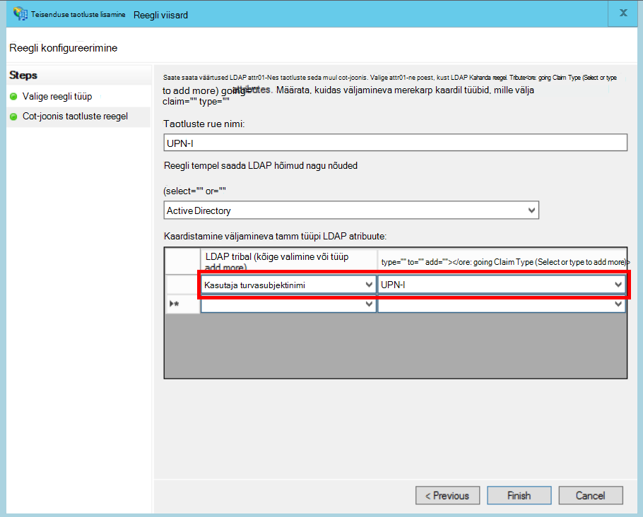

<properties
   pageTitle="Kliendi AD FS-i abil ühendamine | Microsoft Azure'i"
   description="Kuidas federate kliendiga 's rentnikuga rakenduses AD FS-i"
   services=""
   documentationCenter="na"
   authors="JohnPWSharp"
   manager="roshar"
   editor=""
   tags=""/>

<tags
   ms.service="guidance"
   ms.devlang="dotnet"
   ms.topic="article"
   ms.tgt_pltfrm="na"
   ms.workload="na"
   ms.date="06/02/2016"
   ms.author="v-josha"/>

# <a name="federating-with-a-customers-ad-fs-for-multitenant-apps-in-azure"></a>Kliendi AD FS rentnikuga rakenduste Azure ühendamine

[AZURE.INCLUDE [pnp-header](../../includes/guidance-pnp-header-include.md)]

See artikkel on [osa sarjast]. Olemas on ka täieliku [valimi rakendus] , mis kaasneb selle sarja.

Selles artiklis kirjeldatakse, kuidas mitme rentniku SaaS rakenduse toetada autentimise kaudu Active Directory Federation Services (AD FS), et kliendi AD FS liita.

## <a name="overview"></a>Ülevaade

Azure Active Directory (Azure AD) on lihtne: Azure'i AD rentnikud, sh Office 365 ja Dynamics CRM Online'i klientide kasutajad sisse logida. Aga kuidas on lood klientidele, kes kasutavad kohapealne Active Directory ettevõtte sisevõrgu?

Üheks võimaluseks on nende klientide sünkroonida oma kohapealne AD Azure AD, [Azure'i AD-ühenduse]kaudu. Ei saa mõned kliendid kasutada seda meetodit või mitte, ettevõtte IT poliitika või muul põhjusel. Teine võimalus on sellisel juhul liita Active Directory Federation Services (AD FS) kaudu.

Selle stsenaariumi lubamiseks tehke järgmist.

-   Kliendi peab olema Interneti-ühendusega AD FS pargi.
-   SaaS pakkuja kasutab oma serveripargi AD FS-i.
-   Kliendi ja SaaS pakkuja peate häälestama [federation usalda]. See on käsitsi.

Usalda seos on kolm peamist rolli.

-   Kliendi AD FS-i on [konto partner], eest vastutav autentimine kasutajad kliendi AD kasutaja ja luua turvalisus sõned kasutaja nõuded.
-   SaaS pakkuja AD FS-i on [ressurss partner], mis loodab konto partneri ja kasutajale taotluste saab.
-   Rakendus on konfigureeritud osaleja (RP) SaaS pakkuja AD FS-i.

    

> [AZURE.NOTE] Selles artiklis me endale OpenID ühenduse autentimise protokoll kasutab. Teine võimalus on kasutada oli-Federation.

> OpenID Connect SaaS pakkuja peab kasutage AD FS-i 4.0 Windows Server 2016 tehniline eelvaade on praegu töötab. AD FS 3.0 ei toeta OpenID ühendus.

> ASP.net-i Core 1.0 ei sisalda out-of-box tugi oli-ühinemise jaoks.

Näiteks oli-Federation funktsiooniga ASP.net-i 4, leiate teemast [active directory-dotnet-Web Appis-wsfederation valimi][active-directory-dotnet-webapp-wsfederation].

## <a name="authentication-flow"></a>Meilivoo autentimine

1.  Kui kasutaja klõpsab "sisse logida", suunab rakenduse SaaS pakkuja AD FS lõpp OpenID ühendus.
2.  Kasutaja sisestab oma ettevõtte kasutajanimi ("`alice@corp.contoso.com`"). AD FS-i kasutatakse home Domeen discovery kliendi AD FS-i, kui kasutaja sisestab oma volitusi ümber suunata.
3.  Kliendi AD FS-i saadab kasutaja nõuded SaaS pakkuja AD FS-i abil WF-Federation (või SAML).
4.  Nõuded tulenevad AD FS-i rakendus, kasutades OpenID ühendus. Selleks on vaja oli-Federation üleminek Protocol (protokoll).

## <a name="limitations"></a>Piirangud

Kirjutamise ajal rakenduse saab piiratud hulk taotluste OpenID id_token, nagu järgmises tabelis loetletud. 4.0 AD FS-i on endiselt eelvaade nii, et see võib muutuda. Ei ole võimalik määratleb täiendavad nõuded:

Nõue   | Kirjeldus
------|-------------
AUD | Sihtrühma. Rakendus, mille selle nõuded on välja antud.
authenticationinstant   | [Kiirsõnumite autentimist]. Millist autentimise ajal ilmnes.
c_hash  | Koodi räsi väärtus. See on räsi Turbeloa sisu.
exp | [Aegumise aeg]. Aeg, pärast mida ei luba enam vastu.
IAT | [Välja]. Kui antud luba aeg.
ISS | Väljaandja. Selle nõude väärtus on alati ressursi partneri AD FS-i.
Nimi    | Kasutajanimi. Näide: `john@corp.fabrikam.com`.
nameidentifier | [Identifikaator nimi]. Identifikaator üksus, mille jaoks on antud luba nimi.
nonss   | Seansi nonss. AD FS-i vältida kordus eest loodud kordumatu väärtus.
UPN-i | Kasutaja turvasubjektinimi (UPN). Näide:john@corp.fabrikam.com
pwd_exp | Parooli aegumise perioodi kohta. Soovitud sekundite arv kuni kasutaja parooli või sarnane autentimise salajane, nt PIN-koodi. lõppemist.

> [AZURE.NOTE] "iss" taotlemine sisaldab partneri AD FS-i (tavaliselt on see väide tuvastab SaaS pakkuja nimega väljaandja). See ei tuvasta kliendi AD FS-i. Saate otsida kliendi domeeni UPN-i osana.

Ülejäänud selles artiklis kirjeldatakse, kuidas häälestada usalda seos RP (rakendus) ja konto partneri (klient).

## <a name="ad-fs-deployment"></a>AD FS-i juurutamine

SaaS pakkuja saate juurutada AD FS-i kas kohapealne või Azure VMs. Turvalisus ja kättesaadavuseks, on oluline järgmisi juhiseid.

-   Juurutada vähemalt kaks AD FS server ja kahe AD FS puhverserverid parim kättesaadavus AD FS-i teenuse saavutamiseks.
-   Domeenikontrollerid ja AD FS-i serverid kunagi puutuda otse Interneti ja peaks olema virtuaalse võrgu otsest juurdepääsu.
-   Web teenuserakenduse puhverserverite (varem AD FS-i puhverserverite) tuleb kasutada AD FS-i serverid avaldada Interneti-ühendus.

Häälestada sarnaseid topoloogia Azure tuleb kasutada Virtual võrke, NSG's, Azure'i VM ja kättesaadavus komplektid. Lisateavet leiate teemast [juhised juurutamine Windows Server Active Directory Azure'i Virtuaalmasinates][active-directory-on-azure].

## <a name="configure-openid-connect-authentication-with-ad-fs"></a>OpenID Connect autentimise konfigureerimine AD FS-i abil

SaaS pakkuja peab võimaldama OpenID ühenduse loomine rakenduse ja AD FS-i vahel. Selleks lisada taotlus rühma AD FS-i.  Üksikasjalikud juhised leiate selle [ajaveebipostitus], jaotises "Häälestamise OpenId Connect Web Appi sisselogimine AD FS-i". 

Järgmiseks konfigureerida OpenID Connect vahevara. Metaandmete lõpp-punkti `https://domain/adfs/.well-known/openid-configuration`, kus on see SaaS pakkuja AD FS-i Domeen.

Tavaliselt teil võib seda kombineerida teiste OpenID Connect lõpp-punktid (nt AAD). Peate kaks erinevat sisselogimise nuppu või mõnel muul viisil, et eristada neid, nii, et kasutaja saadetakse õige autentimise lõpp-punkti.

## <a name="configure-the-ad-fs-resource-partner"></a>Partneri AD FS-i ressursikeskuse konfigureerimine

SaaS pakkuja peab iga kliendi, mida soovite ühendada ADFS-i kaudu toimige järgmiselt.

1.  Lisage nõuded pakkuja usaldus.
2.  Lisage taotluste reeglid.
3.  Luba kodu-Domeen otsimine.

Siin on toodud juhised üksikasjalikumalt.

### <a name="add-the-claims-provider-trust"></a>Nõuded pakkuja usaldus lisamine

1.  Server Manager, klõpsake nuppu **Tööriistad**ja valige **AD FS -i haldus**.
2.  Konsoolipuus jaotises **AD FS-i**, paremklõpsake **Taotluste pakkuja loodab**. Valige **lisa nõuded pakkuja usaldus**.
3.  Klõpsake viisardi käivitamiseks **käivitamine** .
4.  Valige suvand "impordi andmed avaldatud võrgus või kohalikus võrgus taotluste pakkuja kohta". Sisestage kliendi federation metaandmete lõpp-punkti URI. (Näide: `https://contoso.com/FederationMetadata/2007-06/FederationMetadata.xml`.) Peate toomine kliendi.
5.  Täitke viisardi vaikesuvandite abil.

### <a name="edit-claims-rules"></a>Nõuded reeglite redigeerimine

1.  Paremklõpsake äsja lisatud nõuded pakkuja usaldus ja valige **Redigeeri taotluste reeglid**.
2.  Klõpsake nuppu **Lisa reegel**.
3.  Valige "Arvestatud kaudu või Filter an sissetulevate taotluste" ja klõpsake nuppu **edasi**.
    
4.  Sisestage reegli nimi.
5.  Valige jaotises "Sissetulevate taotluste tüüp" **UPN-i**.
6.  Valige "Läbi kõik taotlemine väärtusi".
  
7.  Klõpsake nuppu **valmis**.
8.  Korrake juhiseid 2 – 7 ja määratlege sissetuleva taotluse tüüp **Ankur taotlemine tüüp** .
9.  Klõpsake nuppu **OK** , et viisardi lõpuleviimine.

### <a name="enable-home-realm-discovery"></a>Luba kodu-Domeen otsimine
Käivitage järgmine PowerShelli skripti:

```
Set-ADFSClaimsProviderTrust -TargetName "name" -OrganizationalAccountSuffix @("suffix")
```

kus "nimi" on nõuded pakkuja usaldus sõbralik nimi ja "järelliide" on järelliide UPN-i kliendi kasutaja AD (näiteks "corp.fabrikam.com").

Selle konfiguratsiooni puhul lõppkasutajad saate tippida oma ettevõtte konto ja AD FS-i valib automaatselt vastava nõuded pakkuja. Teemast [AD FS -i Logi sisse lehtede kohandamine], jaotises "Konfigureerimine identiteedipakkuja kasutamiseks teatud e-posti sufiksid".

## <a name="configure-the-ad-fs-account-partner"></a>Partneri AD FS-i konto konfigureerimine

Klient, peate tegema järgmist:

1.  Lisage tuginedes tootja (RP) usaldus.
2.  Lisab taotluste reeglid.

### <a name="add-the-rp-trust"></a>RP usalda lisamine

1.  Server Manager, klõpsake nuppu **Tööriistad**ja valige **AD FS -i haldus**.
2.  Konsoolipuus jaotises **AD FS-i**, paremklõpsake **Tuginedes tootja loodab**. Valige **Lisa tuginedes poole usaldus**.
3.  **Nõuded arvestada** ja klõpsake nuppu **Käivita**.
4.  Valige lehel **Andmeallika valimine** soovitud suvand "andmete importimine avaldatud võrgus või kohalikus võrgus taotluste pakkuja kohta". Sisestage SaaS pakkuja federation metaandmete lõpp-punkti URI.
  
5.  Sisestage lehel **Määrake kuvatav nimi** mõni nimi.
6.  Valige lehel **Valige juurdepääsu juhtimine poliitika** poliitika. Te lubate kõigile asutuse töötajatele või valida kindla turberühma.
  
7.  Sisestage väljale **poliitika** nõutav parameetrid.
8.  Klõpsake nuppu **edasi** viisardi lõpuleviimine.

### <a name="add-claims-rules"></a>Nõuded reeglite lisamine

1.  Paremklõpsake äsja lisatud tuginedes poole usaldus ja valige **Taotluste emissiooni poliitika redigeerimine**.
2.  Klõpsake nuppu **Lisa reegel**.
3.  Valige "Saada LDAP atribuute nimega nõuded" ja klõpsake nuppu **edasi**.
4.  Sisestage nimi reegli, näiteks "UPN".
5.  Valige jaotises **atribuut talletada**, **Active Directory**.
  
6.  **LDAP vastendamise atribuudid** jaotises:
  - Valige suvandis **LDAP atribuut** **Kasutaja turvasubjektinimi**.
  - Valige jaotises **Väljamineva meili taotluse tüüp** **UPN-i**.
  
7.  Klõpsake nuppu **valmis**.
8.  Klõpsake uuesti nuppu **Lisa reegel** .
9.  Valige "Saada taotluste abil ka kohandatud reegel" ja klõpsake nuppu **edasi**.
10. Sisestage nimi reegli, nt "Ankur taotluste tüüp".
11. **Kohandatud reegli**alusel, sisestage järgmine:

    ```
    EXISTS([Type == "http://schemas.microsoft.com/ws/2014/01/identity/claims/anchorclaimtype"])=>
      issue (Type = "http://schemas.microsoft.com/ws/2014/01/identity/claims/anchorclaimtype",
             Value = "http://schemas.xmlsoap.org/ws/2005/05/identity/claims/upn");
    ```

    See reegel probleemid nõude tüüpi `anchorclaimtype`. Nõude ütleb osalise kasutamiseks UPN-i kasutaja ID-ga püsiv.

12. Klõpsake nuppu **valmis**.
13. Klõpsake nuppu **OK** , et viisardi lõpuleviimine.

## <a name="next-steps"></a>Järgmised sammud

- Järgmise artiklist selle sarja: [kasutamine kliendi kinnituse saada juurdepääsu sõnet Azure AD][client assertion]

<!-- Links -->
[Sarja mittekuuluva]: guidance-multitenant-identity.md
[Azure'i AD-ühenduse]: ../active-directory/active-directory-aadconnect.md
[Federation usalda]: https://technet.microsoft.com/library/cc770993(v=ws.11).aspx
[konto partneri]: https://technet.microsoft.com/library/cc731141(v=ws.11).aspx
[ressursi partneri]: https://technet.microsoft.com/library/cc731141(v=ws.11).aspx
[Kiirsõnumite autentimine]: https://msdn.microsoft.com/library/system.security.claims.claimtypes.authenticationinstant%28v=vs.110%29.aspx
[Aegumise aeg]: http://tools.ietf.org/html/draft-ietf-oauth-json-web-token-25#section-4.1.4
[Välja]: http://tools.ietf.org/html/draft-ietf-oauth-json-web-token-25#section-4.1.6
[Nime ID.]: https://msdn.microsoft.com/library/system.security.claims.claimtypes.nameidentifier(v=vs.110).aspx
[active-directory-on-azure]: https://msdn.microsoft.com/library/azure/jj156090.aspx
[ajaveebipostitus]: http://www.cloudidentity.com/blog/2015/08/21/OPENID-CONNECT-WEB-SIGN-ON-WITH-ADFS-IN-WINDOWS-SERVER-2016-TP3/
[AD FS-i Logi sisse lehtede kohandamine]: https://technet.microsoft.com/library/dn280950.aspx
[proovi taotluse]: https://github.com/Azure-Samples/guidance-identity-management-for-multitenant-apps
[client assertion]: guidance-multitenant-identity-client-assertion.md
[active-directory-dotnet-webapp-wsfederation]: https://github.com/Azure-Samples/active-directory-dotnet-webapp-wsfederation
