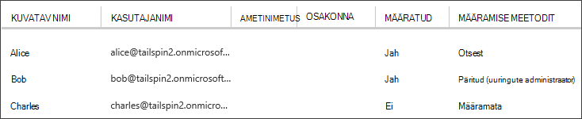

<properties
   pageTitle="Rakenduse rollide | Microsoft Azure'i"
   description="Kuidas teha rakenduse rollide autoriseerimist"
   services=""
   documentationCenter="na"
   authors="MikeWasson"
   manager="roshar"
   editor=""
   tags=""/>

<tags
   ms.service="guidance"
   ms.devlang="dotnet"
   ms.topic="article"
   ms.tgt_pltfrm="na"
   ms.workload="na"
   ms.date="02/16/2016"
   ms.author="mwasson"/>

#  <a name="application-roles-in-multitenant-applications"></a>Rakenduse rollide rentnikuga rakendustes

[AZURE.INCLUDE [pnp-header](../../includes/guidance-pnp-header-include.md)]

See artikkel on [osa sarjast]. Olemas on ka täieliku [valimi rakendus] , mis kaasneb selle sarja.

Rakenduse rollide kasutatakse kasutajatele õiguste määramiseks. Näiteks [Tailspin uuringute] [ Tailspin] rakenduse määratleb järgmisi rolle:

- Administraatori poole. Saate toiminguid kõigi CRUD mis tahes küsitlust, mis kuulub sellele rentnikule.
- Looja. Saate luua uusi küsitlusi.
- Lugeja. Mis tahes küsitlused, mis kuuluvad sellele rentnikule saate lugeda.

Näete, et rollid lõpuks tõlgitakse õigused ajal [autoriseerimine]. Kuid esimese küsimuse määramist ja rollide haldamine. Me kindlaks kolm peamist võimalust:

-   [Azure'i AD Rakenduse rollid](#roles-using-azure-ad-app-roles)
-   [Azure'i AD turberühmad](#roles-using-azure-ad-security-groups)
-   [Roll Rakendusehaldur](#roles-using-an-application-role-manager).

## <a name="roles-using-azure-ad-app-roles"></a>Azure'i AD Rakenduse rollidega rollid

See on lähenemine, mida kasutasime Tailspin küsitluste rakenduses.

Seda moodust The SaaS pakkuja määratleb rakenduse rollide lisamisega Rakendusmanifest. Pärast kliendi registreerub, määrab kliendi AD directory administraator kasutajate rollid. Kui kasutaja sisse logib, saadetakse taotluste kasutaja määratud rollid.

> [AZURE.NOTE] Kui kliendil on Azure AD Premium, admin saate määrata rolli turberühma ja rühma liikmete pärivad rakenduse roll. See on mugav viis hallata rollid, kuna rühma omaniku ei pea olema AD administraatoriks.

Seda moodust eelised:

-   Lihtne programmeerimise mudel.
-   Rakendus on rollid. Mõnda muusse rakendusse ei saadeta rolli taotluste ühe rakenduse.
-   Kui kliendi eemaldab rakendus oma AD rentniku, rollid minema.
-   Rakendus ei vaja mis tahes täiendavaid Active Directory õigusi peale lugemise kasutajaprofiili.

Puudused:

- Klientide Azure AD Premium ilma ei saa määrata turberühmad rollid. Nende klientide puhul tuleb teha kõik kasutaja ülesanded AD administraator.
- Kui teil on kirjutamata veebi-API, mis on eraldi web Appis, pole veebirakenduse rollimäärangud veebi-API rakendada. Mitme arutelu selle punkti, leiate teemast [turvamine on kirjutamata web API].

### <a name="implementation"></a>Rakendamine

**Määratleda rollid.** SaaS pakkuja kinnitab rakenduse rolle [rakenduse näidata]. Siin on näiteks uuringute rakenduse manifest kirje:

```
"appRoles": [
  {
    "allowedMemberTypes": [
      "User"
    ],
    "description": "Creators can create Surveys",
    "displayName": "SurveyCreator",
    "id": "1b4f816e-5eaf-48b9-8613-7923830595ad",
    "isEnabled": true,
    "value": "SurveyCreator"
  },
  {
    "allowedMemberTypes": [
      "User"
    ],
    "description": "Administrators can manage the Surveys in their tenant",
    "displayName": "SurveyAdmin",
    "id": "c20e145e-5459-4a6c-a074-b942bbd4cfe1",
    "isEnabled": true,
    "value": "SurveyAdmin"
  }
],
```

Funktsiooni `value` atribuut kuvatakse taotluste roll. Funktsiooni `id` atribuut on määratletud rolli ainuidentifikaator. Alati luua uut GUID väärtust `id`.

**Määrata kasutajatele**. Kui registreerub uus klient, registreeritakse kliendi AD rentniku rakendus. Selles etapis AD administraator selle rentniku jaoks saate määrata kasutajate rollid.

> [AZURE.NOTE] Nagu varem, kliendid, kellel on Azure AD Premium saate määrata ka turberühmad rollidele.

Azure'i portaalis järgmine pilt kuvatakse kolm kasutajad. Alice määratud otse rollid. Bob päritud rolli liige nimega "Küsitluste Admin", mis on määratud roll. Mis tahes rolli Charles pole määratud.



> [AZURE.NOTE] Teise võimalusena rakenduse saab määrata rollid programmiliselt, kasutades Azure AD Graph API.  Siiski selle ette, et saada kliendi AD directory kirjutamisõigused. Need õigused rakendus võib teha palju pahandust &mdash; kliendi on usaldusväärsed rakenduse pole mess üles oma kataloogi. Paljud kliendid võib olla ei soovi seda pääsutaseme anda.

**Roll taotluste saada**. Kui kasutaja sisse logib rakenduse saab kasutaja määratud role(s) tüüp nõude `http://schemas.microsoft.com/ws/2008/06/identity/claims/role`.  

Kasutaja võib olla mitu rollid või ei. Luba koodi, ei võta kasutajal on täpselt ühe rolli taotlemine. Selle asemel kirjutada kood, mis kontrollib, kas teatud kindlate taotluste väärtus on olemas:

```csharp
if (context.User.HasClaim(ClaimTypes.Role, "Admin")) { ... }
```

## <a name="roles-using-azure-ad-security-groups"></a>Kasutades Azure AD turberühmade rollid

Selle stsenaariumi rollid on esindatud AD turberühmad. Rakenduse määrab kasutajatele põhinevad nende turvalisus rühmaliikmeid õigused.

Eelised:

-   Klientidele, kes on Azure AD Premium, võimaldab see lähenemine klientide haldamine rollimääranguid turberühmad abil.

Miinust:

- Keerukuse. Kuna iga rentniku saadab eri rühma taotluste, rakendus peab silma peal hoida turberühmad vastavaid milline rakenduse rollid, iga rentniku jaoks.
- Kui kliendi eemaldab rakendus oma AD rentniku, jäetakse turberühmade oma AD kataloogi.

### <a name="implementation"></a>Rakendamine

Rakenduse manifesti, määrake soovitud `groupMembershipClaims` atribuut "SecurityGroup". See on vajalik saada rühma liikmete taotluste AAD.

```
{
   // ...
   "groupMembershipClaims": "SecurityGroup",
}
```

Kui registreerub uus klient, juhendab rakenduse kliendi loomiseks vajalik rakendus rollid turberühmad. Kliendi siis peab sisestama rakendusse rühma objekti ID-d. Rakenduse salvestab need tabelis, et kaarte rühma ID-d rakenduse rollide rentniku kohta.

> [AZURE.NOTE] Teise võimalusena rakenduse saanud luua rühmad programmiliselt, kasutades Azure AD Graph API.  See on vähem vigu. Rakenduse hankimine "lugemine ja kirjutamine kõigi rühmade" nõuab siiski kliendi AD directory õiguste. Paljud kliendid võib olla ei soovi seda pääsutaseme anda.

Kui kasutaja sisse logib:

1.  Rakenduse saab kasutaja rühmade taotluste. Iga nõude väärtus rühma objekti ID-d.
2.  Luba saadetud rühmade arv on piiratud Azure AD. Kui rühmade arv ületab, suunatakse Azure AD teisiti "aegunud" taotluste. Kui see väide on olemas, peate rakenduse päringu Azure AD Graph API saada kõik rühmad, kuhu kasutaja kuulub. Lisateavet leiate teemast jaotises pealkirjaga "Rühmade taotlemine lisatud liigses" [autoriseerimine Cloud rakendustes AD rühmade kasutamine].
3.  Rakendus otsib oma andmebaasi leidmiseks vastava rakenduse rollide kasutajale määrata objekti ID-d.
4.  Rakendus lisab kohandatud taotluste väärtus kasutaja põhisumma, mis väljendab rakenduste roll. Näide: `survey_role` = "SurveyAdmin".

Luba poliitikate tuleks kasutada kohandatud taotluste, mitte tervele rühmale taotlemine.

## <a name="roles-using-an-application-role-manager"></a>Rollide mõne rolli Rakendusehaldur abil

Seda moodust koos rakenduse rollide ei salvestata Azure AD üldse. Selle asemel talletab rakendus rollimääranguid iga kasutaja jaoks eraldi DB &mdash; olemasolevat **RoleManager** klassi ASP.net-i identiteedi.

Eelised:

-   Rakendus on rollid ja kasutajale ülesanded üle täielik kontroll.

Puudused:

- Keerukamaid, raskem säilitada.
- Ei saa kasutada AD turberühmade haldamine rollimääranguid.
- Talletab kasutajateabe rakenduse andmebaasi, kui on võimalik saada rentniku AD Directoryga sünkroonitud, nagu kasutajaid lisada või eemaldada.   

On palju olemasoleva näiteid seda lähenemisviisi. Näiteks vt [auth ja SQL-i DB ASP.NET MVC rakenduse loomine ja võtta kasutusele Azure'i rakendust Service].

## <a name="next-steps"></a>Järgmised sammud

- Järgmise artiklist selle sarja: [rolli ja ressursside autoriseerimine rentnikuga rakendustes][autoriseerimine]

<!-- Links -->
[Tailspin]: guidance-multitenant-identity-tailspin.md
[Sarja mittekuuluva]: guidance-multitenant-identity.md
[luba]: guidance-multitenant-identity-authorize.md
[Turvaliseks taustväärtus veebi-API]: guidance-multitenant-identity-web-api.md
[ASP.net-i MVC rakenduse auth ja SQL-i DB loomine ja juurutamine Azure'i rakendust Service]: ../app-service-web/web-sites-dotnet-deploy-aspnet-mvc-app-membership-oauth-sql-database.md
[rakenduse manifesti]: ../active-directory/active-directory-application-manifest.md
[proovi taotluse]: https://github.com/Azure-Samples/guidance-identity-management-for-multitenant-apps
