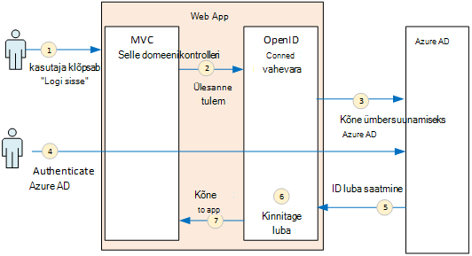
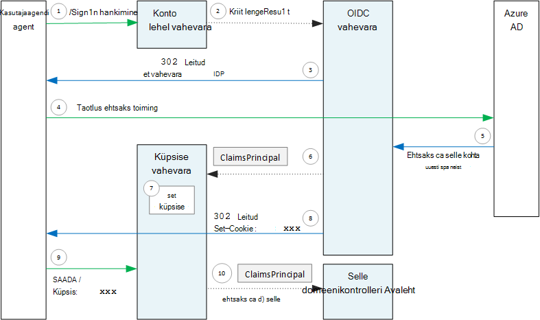

<properties
   pageTitle="Autentimise rentnikuga rakendustes | Microsoft Azure'i"
   description="Kuidas saab rentnikuga rakenduse autentida kasutajat Azure AD"
   services=""
   documentationCenter="na"
   authors="MikeWasson"
   manager="roshar"
   editor=""
   tags=""/>

<tags
   ms.service="guidance"
   ms.devlang="dotnet"
   ms.topic="article"
   ms.tgt_pltfrm="na"
   ms.workload="na"
   ms.date="05/23/2016"
   ms.author="mwasson"/>

# <a name="authentication-in-multitenant-apps-using-azure-ad-and-openid-connect"></a>Autentimist kasutades Azure AD rentnikuga rakendustes ja OpenID ühendamine

[AZURE.INCLUDE [pnp-header](../../includes/guidance-pnp-header-include.md)]

See artikkel on [osa sarjast](guidance-multitenant-identity.md). Olemas on ka täieliku [valimi rakendus] , mis kaasneb selle sarja.

Selles artiklis kirjeldatakse, kuidas saate rentnikuga rakenduse autentida kasutajat Azure Active Directory (Azure AD), kasutades OpenID ühenduse (OIDC) autentida.

## <a name="overview"></a>Ülevaade

Meie [viide rakendamine](guidance-multitenant-identity-tailspin.md) on rakendus ASP.net-i Core 1.0. Rakendus kasutab sisseehitatud OpenID Connect vahevara OIDC autentimise voogu. Järgmine diagramm näitab, mis juhtub, kui kasutaja lahkub, kõrge.



1.  Kasutaja klõpsab rakenduses nupp "sisse logida". See toiming on käsitleja oli mõne MVC kontrolleril.
2.  MVC kontrolleril tagastab **ChallengeResult** toiming.
3.  Funktsiooni vahetarkvara intercepts **ChallengeResult** ja loob 302 vastust, mis suunab kasutaja Azure AD sisselogimislehel.
4.  Kasutaja autendib Azure AD.
5.  Azure AD saadab rakendus on ID luba.
6.  Funktsiooni vahevara kinnitatakse ID luba. Selles etapis nüüd autenditud kasutaja rakenduse sees.
7.  Funktsiooni vahevara suunab kasutaja tagasi rakendus.

## <a name="register-the-app-with-azure-ad"></a>Rakenduse registreerida Azure AD

OpenID Connect lubamiseks SaaS pakkuja registreerib rakendus oma Azure AD rentniku sees.

Rakenduse registreerimiseks järgige [Rakenduste integreerimine Azure Active Directory](../active-directory/active-directory-integrating-applications.md), [lisades rakenduse](../active-directory/active-directory-integrating-applications.md#adding-an-application)jaotises.

Klõpsake lehe **konfigureerimine**

-   Pange tähele kliendi ID-ga.
-   **Rakendus on mitme rentniku**, valige **Jah**.
-   Seadke **Vastus URL-i** URL-i kui Azure AD saadab autentimise vastus. Saate rakenduse base URL.
  - Märkus: URL-tee saab midagi, kui hosti nimi vastab teie juurutatud rakendus.
  - Saate määrata mitu vasta URL-id. Väljatöötamise käigus, saate kasutada mõne `localhost` aadress, töötavad rakenduse kohalikult.
-   Luua kliendi salajane: jaotises **klahvid**, klõpsake rippmenüü, mis ütleb, **Valige kestus** ja valige 1 või 2 aastat. Võti on nähtav, kui klõpsate käsku **Salvesta**. Kopeerige kindlasti väärtus, kuna see on kuvatud uuesti kui konfiguratsiooni leht uuesti.

## <a name="configure-the-auth-middleware"></a>Auth vahevara konfigureerimine

Selles jaotises kirjeldatakse, kuidas ASP.net-i Core 1.0 rentnikuga autentimise OpenID Connect vahevara autentimise konfigureerimine.

Käivitus oma tunni, OpenID Connect vahevara lisamiseks tehke järgmist.

```csharp
app.UseOpenIdConnectAuthentication(options =>
{
    options.AutomaticAuthenticate = true;
    options.AutomaticChallenge = true;
    options.ClientId = [client ID];
    options.Authority = "https://login.microsoftonline.com/common/";
    options.CallbackPath = [callback path];
    options.PostLogoutRedirectUri = [application URI];
    options.SignInScheme = CookieAuthenticationDefaults.AuthenticationScheme;
    options.TokenValidationParameters = new TokenValidationParameters
    {
        ValidateIssuer = false
    };
    options.Events = [event callbacks];
});
```

> [AZURE.NOTE] Lugege teemat [Startup.cs](https://github.com/Azure-Samples/guidance-identity-management-for-multitenant-apps/blob/master/src/Tailspin.Surveys.Web/Startup.cs).

Klassi käivitamise kohta leiate lisateavet teemast [Rakenduse käivitamine](https://docs.asp.net/en/latest/fundamentals/startup.html) ASP.net-i Core 1.0 dokumentatsiooni.

Seadke vahevara järgmised suvandid:

- **ClientId**. Rakenduse kliendi ID, mis teil Azure AD Rakenduse registreerimisel.
- **Asutuse**. Rentnikuga rakenduse, määrata `https://login.microsoftonline.com/common/`. See on URL-i Azure AD levinud näitaja, mis võimaldab kasutajatel sisse logida mis tahes Azure AD rentniku kohta. Levinud lõpp-punkti kohta leiate lisateavet teemast [sellest ajaveebipostitusest](http://www.cloudidentity.com/blog/2014/08/26/the-common-endpoint-walks-like-a-tenant-talks-like-a-tenant-but-is-not-a-tenant/).
- Määrake **TokenValidationParameters**, **ValidateIssuer** väärtuseks väär. See tähendab, et rakendus ei vastuta kontrollimine väljaandja ID luba väärtus. (Selle vahevara kinnitatakse endiselt luba ise.) Kinnitamise väljaandja kohta leiate lisateavet teemast [väljaandja valideerimine](guidance-multitenant-identity-claims.md#issuer-validation).
- **CallbackPath**. Määrake see võrdne tee registreeritud Azure AD vastus URL-i. Kui vastus URL on näiteks `http://contoso.com/aadsignin`, **CallbackPath** peaks olema `aadsignin`. Kui seate selle suvandi, vaikeväärtus on `signin-oidc`.
- **PostLogoutRedirectUri**. Määrake URL, mille soovite ümber suunata kasutajate pärast Logi välja. See peaks olema lehekülg, mis võimaldab anonüümse taotlused &mdash; tavaliselt avalehele.
- **SignInScheme**. Määrata `CookieAuthenticationDefaults.AuthenticationScheme`. See säte tähendab, et pärast seda, kui kasutaja on autenditud, kasutaja nõuded on talletatud kohalik küpsis. See küpsis on, kuidas kasutaja jääb sisseloginud brauseriseansi ajal.
- **Sündmuste.** Sündmuse kontekstiatribuuti; vt [autentimise sündmused](#authentication-events).

Tulemas lisada vahevara küpsise autentimine. See vahevara vastutab kasutaja nõuete küpsis kirjutamine ja järgmise lehe laadimise ajal lugeda küpsise.

```csharp
app.UseCookieAuthentication(options =>
{
    options.AutomaticAuthenticate = true;
    options.AutomaticChallenge = true;
    options.AccessDeniedPath = "/Home/Forbidden";
});
```

## <a name="initiate-the-authentication-flow"></a>Kontaktiga voogu autentimine

ASP.net-i MVC autentimise voogu alustamiseks on **ChallengeResult** tulu selle contoller:

```csharp
[AllowAnonymous]
public IActionResult SignIn()
{
    return new ChallengeResult(
        OpenIdConnectDefaults.AuthenticationScheme,
        new AuthenticationProperties
        {
            IsPersistent = true,
            RedirectUri = Url.Action("SignInCallback", "Account")
        });
}
```

See põhjustab vahevara 302 (leitud) vastust, mis suunab autentimise lõpp-punkti tagastamiseks.

## <a name="user-login-sessions"></a>Kasutaja login seansid

Nagu mainitud, kui kasutaja esmalt sisse logib, kirjutab küpsise autentimine vahevara küpsis kasutaja nõuded. Pärast seda, autentimise abil lugemise küpsise HTTP päringuid.

Vaikimisi küpsise vahevara kirjutab [seansi küpsise][session-cookie], mis saab kustutatud üks kord kasutaja suleb brauseris. Järgmisel korral kasutaja edasi saidi neil uuesti sisse logida. Siiski kui seate **IsPersistent** true **ChallengeResult**, kirjutab selle vahevara püsivate küpsis nii, et kasutaja jääb pärast sulgemist brauseris sisse loginud. Saate konfigureerida küpsise aegumise; vt [mittekontrollivate küpsise suvandid][cookie-options]. Püsivad küpsised on mugavam kasutaja jaoks, kuid võib olla sobimatu mõnede rakenduste (öelda, panga rakendus) Kui soovite, et kasutaja iga kord sisse logima.

## <a name="about-the-openid-connect-middleware"></a>OpenID Connect vahevara kohta

OpenID Connect vahevara ASP.net-i peidab enamik protokolli üksikasjad. See jaotis sisaldab mõningaid märkmeid rakendamist, mis võib olla kasulik mõistmine protokolli voo kohta.

Esmalt analüüsime autentimise voogu osas ASP.net-i (ignoreerides üksikasju OIDC protokolli voo rakendus ja Azure AD vahel). Järgmisel joonisel on esitatud protsess.



See diagramm on kaks MVC kontrollerid. Konto lehel tegeleb taotluste Logi sisse ja Avaleht kontrolleril esitab avalehele.

Siin autentimist.

1. Kasutaja klõpsab nuppu "Logi sisse" ja brauseri saadab GET-päringu. Näide: `GET /Account/SignIn/`.
2. Konto lehel annab vastuseks `ChallengeResult`.
3. OIDC vahevara tagastab HTTP 302 vastuse, Azure AD ümbersuunamist.
4. Brauseri saadab autentimise taotluse Azure AD
5. Kasutaja logib Azure AD, ja Azure AD edastab vastuse autentimist.
6. OIDC vahevara loob taotluste subjekt ja edastab selle vahevara küpsise autentimine.
7. Küpsise vahevara serializes taotluste põhisumma ja määrab küpsis.
8. OIDC vahevara suunab rakenduse tagasihelistamise URL-i.
10. Brauseri järgib suunata, saata küpsise kutse.
11. Küpsise vahevara deserializes põhisumma nõuete küpsise ja määrab `HttpContext.User` taotluste põhisumma võrdne. Taotluse suunatakse mõne MVC kontrolleril.

### <a name="authentication-ticket"></a>Piletimüügi autentimine

Kui autentimine õnnestub, loob OIDC vahevara autentimise Piletite, mis sisaldab taotluste põhisumma, mis on kasutaja taotluste. Pääsete Piletite **AuthenticationValidated** või **TicketReceived** sündmuse sees.

> [AZURE.NOTE] Kogu autentimise voogu lõpetamiseni `HttpContext.User` kuulub endiselt mõne anonüümse põhisumma, _mitte_ autenditud kasutaja. Anonüümse põhisumma on mõnda tühja taotluste saidikogumi. Pärast autentimist on lõpule jõudnud ja rakenduse ümbersuunamised, küpsise vahevara deserializes autentimise küpsise ja komplektid `HttpContext.User` taotluste peamiste, mis tähistab autenditud kasutaja.

### <a name="authentication-events"></a>Autentimise sündmused

Autentimise käigus OpenID Connect vahevara tõstab üritused:

- **RedirectToAuthenticationEndpoint**. Enne selle vahevara suunab autentimise lõpp-punkti nimetatakse paremale. Sel juhul saate muuta ümbersuunamise URL-i; Näiteks, et lisada taotluse parameetrid. Näiteks vt [administraator nõusoleku küsimuse lisamine](guidance-multitenant-identity-signup.md#adding-the-admin-consent-prompt) .

- **AuthorizationResponseReceived**. Nimetatakse funktsiooni vahevara saab autentimist vastuse identiteedipakkuja (IDP), kuid enne selle vahevara kinnitatakse vastus.  

- **AuthorizationCodeReceived**. Nimega luba kood.

- **TokenResponseReceived**. Pärast soovitud vahevara saab Accessi Turbeloa ka IDP nimega. Kehtib ainult autoriseerimine kood kulgemist.

- **AuthenticationValidated**. Pärast soovitud vahevara kinnitatakse ID luba nimega. Selles etapis taotlus on kogumi valideeritud taotlusi kasutaja kohta. Sel juhul saate teha täiendavaid valideerimise nõuded või muuta taotluste. Vaata [töötamise nõuded](guidance-multitenant-identity-claims.md).

- **UserInformationReceived**. Kui soovitud vahevara saab kasutaja profiili kasutaja teave lõpp-punkti nimetatakse. Kehtib ainult autoriseerimine kood kulgemist ja ainult siis, kui `GetClaimsFromUserInfoEndpoint = true` vahevara suvandid.

- **TicketReceived**. Nimetatakse kui autentimine on lõpule viidud. See on viimase sündmus, eeldades, et autentimine õnnestus. Pärast selle sündmuse käsitletakse, on kasutaja logitud rakendusse.

- **AuthenticationFailed**. Nimetatakse autentimise nurjumisel. Sündmuse abil autentimine vead toime &mdash; , näiteks suunata tõrge lehel.

Kontekstiatribuuti ette järgmisi sündmusi, sisselülitamiseks **sündmused** on vahevara. On kaks võimalust deklareerida selle sündmuseohjur: Tekstisisese lambdas või tunni, mis tuleneb **OpenIdConnectEvents**.

Tekstisisene lambdas abil:

```csharp
app.UseOpenIdConnectAuthentication(options =>
{
    // Other options not shown.

    options.Events = new OpenIdConnectEvents
    {
        OnTicketReceived = (context) =>
        {
             // Handle event
             return Task.FromResult(0);
        },
        // other events
    }
});
```

Tulenevad **OpenIdConnectEvents**:

```csharp
public class SurveyAuthenticationEvents : OpenIdConnectEvents
{
    public override Task TicketReceived(TicketReceivedContext context)
    {
        // Handle event
        return base.TicketReceived(context);
    }
    // other events
}

// In Startup.cs:
app.UseOpenIdConnectAuthentication(options =>
{
    // Other options not shown.

    options.Events = new SurveyAuthenticationEvents();
});
```

Teine lähenemine on soovitatav, kui teie sündmuse kontekstiatribuuti on mis tahes olulisi loogika, seega nad ei tarbetu käivitus tunni. Meie viide rakendamiseks kasutab seda moodust; lugege teemat [SurveyAuthenticationEvents.cs](https://github.com/Azure-Samples/guidance-identity-management-for-multitenant-apps/blob/master/src/Tailspin.Surveys.Web/Security/SurveyAuthenticationEvents.cs).

### <a name="openid-connect-endpoints"></a>OpenID ühenduse lõpp-punktid

Azure AD toetab [OpenID ühenduse Discovery](https://openid.net/specs/openid-connect-discovery-1_0.html), kus identiteedipakkuja (IDP) tagastab JSON metaandmete dokument on [tuntud lõpp-punkti](https://openid.net/specs/openid-connect-discovery-1_0.html#ProviderConfig). Metaandmete dokument sisaldab teavet, näiteks:

-   Luba lõpp-punkti URL-i. See on, kus rakenduse suunab autentida.
-   "Seansi lõpetamine" lõpp-punkti, kus rakenduse läheb Logi välja kasutaja URL-i.
-   URL-i hankimine allkirjastamiseks võtmed, mille klient kasutab seda saab ka IDP OIDC märkide kinnitamiseks.

Vaikimisi OIDC vahevara oskab toomiseks metaandmed. Seadmine suvandi **asutus** selle vahevara ja selle vahevara sisuosast URL-i metaandmete. (Saate alistada URL-i metaandmete määrates suvandi **MetadataAddress** .)

### <a name="openid-connect-flows"></a>OpenID ühenduse puhul

Vaikimisi kasutab OIDC vahevara hübriid meilivoo vormi postituse vastuse režiim.

-   _Hübriidjuurutuse meilivoo_ tähendab, et kliendi pääsevad ID luba ja luba näeb välja umbes järgmine sama edasi-tagasi autoriseerimine server.
-   _Vormi postitada reponse režiim_ tähendab, et autoriseerimine server kasutab taotluse HTTP-postituse saatmiseks rakenduse luba ja luba isikukood. Väärtused on vormi-urlencoded (sisu tüüp = "rakenduse/x-www-form-urlencoded").

Kui OIDC vahevara suunab autoriseerimine lõpp-punkti, ümbersuunamise URL-i sisaldab kõiki nõutud OIDC on päringustringi parameetrite. Hübriidjuurutuse flow: jaoks

-   client_id. Selle väärtuseks on seatud **ClientId** suvandi
-   ulatus = "openid profiili", mis tähendab, et see on üks OIDC taotlus ja soovime kasutajaprofiili.
-   response_type = "code id_token". Seda määrab hübriid kulgemist.
-   response_mode = "form_post". Seda määrab vormi postitusele vastust.

Erinevate meilivoo määramiseks atribuudi **ResponseType** soovitud suvandid. Näiteks:

```csharp
app.UseOpenIdConnectAuthentication(options =>
{
    options.ResponseType = "code"; // Authorization code flow

    // Other options
}
```

## <a name="next-steps"></a>Järgmised sammud

- Järgmise artiklist selle sarja: [taotlusepõhise identiteedid rentnikuga rakendustes töötamine][claims]


[claims]: guidance-multitenant-identity-claims.md
[cookie-options]: https://docs.asp.net/en/latest/security/authentication/cookie.html#controlling-cookie-options
[session-cookie]: https://en.wikipedia.org/wiki/HTTP_cookie#Session_cookie
[proovi taotluse]: https://github.com/Azure-Samples/guidance-identity-management-for-multitenant-apps
