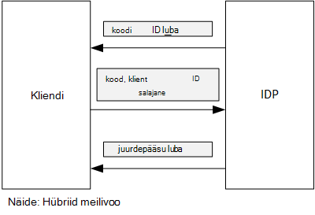

<properties
   pageTitle="Accessi sõned toomine Azure AD kliendi kinnituse abil | Microsoft Azure'i"
   description="Kuidas saada juurdepääsu sõned Azure AD kliendi kinnituse abil."
   services=""
   documentationCenter="na"
   authors="MikeWasson"
   manager="roshar"
   editor=""
   tags=""/>

<tags
   ms.service="guidance"
   ms.devlang="dotnet"
   ms.topic="article"
   ms.tgt_pltfrm="na"
   ms.workload="na"
   ms.date="05/23/2016"
   ms.author="mwasson"/>

# <a name="using-client-assertion-to-get-access-tokens-from-azure-ad"></a>Accessi sõned toomine Azure AD kliendi kinnituse abil

[AZURE.INCLUDE [pnp-header](../../includes/guidance-pnp-header-include.md)]

See artikkel on [osa sarjast]. Olemas on ka täieliku [valimi rakendus] , mis kaasneb selle sarja.

## <a name="background"></a>Tausta

Kui kasutate autoriseerimine kood liikumisele või hübriid meilivoo OpenID ühendus, vahetab kliendi autoriseerimine tähist juurdepääsu sümboolse. Selle toimingu käigus on kliendil autentida ise serveriga.



Kliendi autentimiseks üheks võimaluseks on kliendi salajane abil. See on kuidas [Tailspin uuringute] [ Surveys] rakendus on vaikimisi konfigureeritud.

Siin on mõni näide taotlus kliendi IDP, taotleda juurdepääsu sümboolse. Märkus selle `client_secret` parameeter.

```
POST https://login.microsoftonline.com/b9bd2162xxx/oauth2/token HTTP/1.1
Content-Type: application/x-www-form-urlencoded

resource=https://tailspin.onmicrosoft.com/surveys.webapi
  &client_id=87df91dc-63de-4765-8701-b59cc8bd9e11
  &client_secret=i3Bf12Dn...
  &grant_type=authorization_code
  &code=PG8wJG6Y...
```

Salajane on lihtsalt sõne nii, et teil on veenduge, et lekkima väärtus. Parim on kliendi salajane allikas kontrolli all hoida. Azure'i juurutamisel talletada salajane [säte rakenduse][configure-web-app].

Siiski igaüks, kellel on juurdepääs Azure tellimuse saate vaadata rakenduse sätted. Lisaks on alati kiusatus märkige saladusi andmeallika juhtelemendi (nt juurutamise skriptide), neid ühiskasutusse andmine meili teel jne.

Täiendava turvalisuse huvides saate [Kliendi kinnituse] asemel kliendi salajane. Kliendi kinnitus, klient kasutab mõnda x.509 vastav sert tõestamaks Turbeloa taotluse oli klient. Kliendi sert on installitud veebiserver. Üldiselt on lihtsam juurdepääsu piiramiseks sert, kui ilmneb tagamaks, et keegi ei tahtmatult kliendi salajane. Web Appis serdid konfigureerimise kohta leiate lisateavet teemast [Abil serdid Azure veebisaitide rakendustes][using-certs-in-websites]

Siin on Turbeloa taotluse abil kliendi kinnitus.

```
POST https://login.microsoftonline.com/b9bd2162xxx/oauth2/token HTTP/1.1
Content-Type: application/x-www-form-urlencoded

resource=https://tailspin.onmicrosoft.com/surveys.webapi
  &client_id=87df91dc-63de-4765-8701-b59cc8bd9e11
  &client_assertion_type=urn:ietf:params:oauth:client-assertion-type:jwt-bearer
  &client_assertion=eyJhbGci...
  &grant_type=authorization_code
  &code= PG8wJG6Y...
```

Pange tähele, et selle `client_secret` parameetri enam ei kasutata. Selle asemel funktsiooni `client_assertion` parameeter sisaldab JWT luba, mis on allkirjastatud serdiga kliendi. Funktsiooni `client_assertion_type` parameeter määrab argumendi tüüp &mdash; sisse selle juhul JWT luba. Server kinnitatakse JWT luba. Kui JWT luba ei sobi, tagastab Turbeloa taotluse tõrke.

> [AZURE.NOTE] X.509 serdid ei ole ainult vormi kliendi kinnituse; Me keskenduda see siin kuna see toetab Azure AD.

## <a name="using-client-assertion-in-the-surveys-application"></a>Kliendi kinnituse küsitluste rakenduse abil

Selles jaotises kirjeldatakse konfigureerimine Tailspin küsitluste rakenduse kasutamiseks kliendi kinnitus. Neid juhiseid te luua iseallkirjastatud serdi, mis sobib arengu, kuid mitte tootmisotstarbeks.

1. Käivitage PowerShelli skripti [/Scripts/Setup-KeyVault.ps1] [ Setup-KeyVault] järgmiselt:

    ```
    .\Setup-KeyVault.ps -Subject [subject]
    ```

    Jaoks soovitud `Subject` parameeter, sisestage mis tahes nimi, näiteks "surveysapp". Skripti genereeritud iseallkirjastatud serdi ja talletab selle "praeguse kasutaja isiklikku" serdi pood.

2. Skripti väljund on JSON fragment. Lisage see web appi Rakendusmanifest järgmiselt:

    1. Logige [Azure'i haldusportaal] [ azure-management-portal] ja liikuge Azure AD kataloogi.

    2. Klõpsake nuppu **rakendused**.

    3. Valige uuringute rakendus.

    4.  Klõpsake nuppu **Halda näidata** ja valige **Allalaadimine näidata**.

    5.  Avage tekstiredaktoris JSON Avaldamisfail. Kleepimine skripti üheks väljund on `keyCredentials` atribuut. See peaks välja nägema umbes järgmine:

        ```    
        "keyCredentials": [
            {
              "type": "AsymmetricX509Cert",
              "usage": "Verify",
              "keyId": "29d4f7db-0539-455e-b708-....",
              "customKeyIdentifier": "ZEPpP/+KJe2fVDBNaPNOTDoJMac=",
              "value": "MIIDAjCCAeqgAwIBAgIQFxeRiU59eL.....
            }
          ],
         ```

    6.  Muudatuste salvestamiseks JSON-faili.

    7.  Minge tagasi portaali. Klõpsake nuppu **Halda näidata** > **Üles näidata** ja JSON-fail üles.

3. Käivitage järgmine käsk saamiseks serdi sõrmejälje.

    ```
    certutil -store -user my [subject]
    ```

    kus `[subject]` on väärtus, mis teie määratud teemat PowerShelli skripti. Funktsiooni sõrmejälje on loetletud "Cert Hash(sha1)". Eemaldage tühikute kuueteistkümnendarvu arvud.

4. Värskendage oma rakenduse saladusi. Solution Exploreris paremklõpsake Tailspin.Surveys.Web projekti ja valige **Halda kasutaja saladused**. Kirje lisamine jaotises "AzureAd", "Asymmetric" jaoks, nagu allpool näidatud:

    ```
    {
      "AzureAd": {
        "ClientId": "[Surveys application client ID]",
        // "ClientSecret": "[client secret]",  << Delete this entry
        "PostLogoutRedirectUri": "https://localhost:44300/",
        "WebApiResourceId": "[App ID URI of your Survey.WebAPI application]",
        // new:
        "Asymmetric": {
          "CertificateThumbprint": "[certificate thumbprint]",  // Example: "105b2ff3bc842c53582661716db1b7cdc6b43ec9"
          "StoreName": "My",
          "StoreLocation": "CurrentUser",
          "ValidationRequired": "false"
        }
      },
      "Redis": {
        "Configuration": "[Redis connection string]"
      }
    }
    ```

    Peate määrama `ValidationRequired` juurde false, kuna sert pole allkirjastatud juur CA asutuse järgi. Valmistamisel, kasutage sert, mis on allkirjastatud asutuse CA ja `ValidationRequired` tõene.

    Ka kustutada kirje `ClientSecret`, kuna see ei ole vaja kliendi kinnitus.

5. Startup.cs, otsige üles registreerib koodis on `ICredentialService`. Kommenteerige välja rida, mis kasutab `CertificateCredentialService`, ja kommenteeri välja rida, mis kasutab `ClientCredentialService`:

    ```csharp
    // Uncomment this:
    services.AddSingleton<ICredentialService, CertificateCredentialService>();
    // Comment out this:
    //services.AddSingleton<ICredentialService, ClientCredentialService>();
    ```

Käitusajal, loeb veebirakenduse serdi sert poest. Serdi peab olema installitud samasse arvutisse web app.

## <a name="next-steps"></a>Järgmised sammud

- Järgmise artiklist selle sarja: [Azure'i klahvi Vault kaitsmiseks rakenduse saladusi abil][key vault]


<!-- Links -->
[configure-web-app]: ../app-service-web/web-sites-configure.md
[azure-management-portal]: https://manage.windowsazure.com
[kliendi kinnitus]: https://tools.ietf.org/html/rfc7521
[key vault]: guidance-multitenant-identity-keyvault.md
[Setup-KeyVault]: https://github.com/Azure-Samples/guidance-identity-management-for-multitenant-apps/blob/master/scripts/Setup-KeyVault.ps1
[Surveys]: guidance-multitenant-identity-tailspin.md
[using-certs-in-websites]: https://azure.microsoft.com/blog/using-certificates-in-azure-websites-applications/
[Sarja mittekuuluva]: guidance-multitenant-identity.md
[proovi taotluse]: https://github.com/Azure-Samples/guidance-identity-management-for-multitenant-apps
