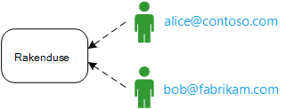
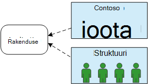
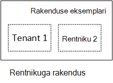
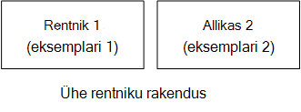
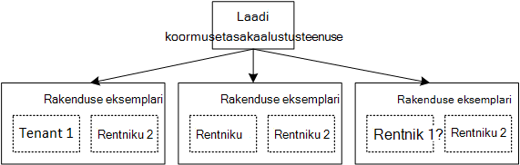

<properties
   pageTitle="Identiteedi haldamise rentnikuga rakenduste | Microsoft Azure'i"
   description="Identiteedi haldamise rentnikuga rakendustes tutvustus"
   services=""
   documentationCenter="na"
   authors="MikeWasson"
   manager="roshar"
   editor=""
   tags=""/>

<tags
   ms.service="guidance"
   ms.devlang="dotnet"
   ms.topic="article"
   ms.tgt_pltfrm="na"
   ms.workload="na"
   ms.date="06/02/2016"
   ms.author="mwasson"/>

# Identiteedi haldamise rentnikuga rakendusi Microsoft Azure tutvustus

[AZURE.INCLUDE [pnp-header](../../includes/guidance-pnp-header-include.md)]

See artikkel on [osa sarjast]. Olemas on ka täieliku [valimi rakendus] , mis kaasneb selle sarja.

Oletame, et kirjutate ettevõte SaaS rakenduse pilveteenuses töötaks. Muidugi on rakenduse kasutajad:

Kuid need kasutajad kuuluvad asutuste.

Näide: Tailspin müüb tellimused oma SaaS rakendusse. Contoso ja Fabrikam registreeru rakendus. Kui Alice (`alice@contoso`) märgid, rakenduse peaksite teadma, et Alice on osa Contoso.

- Alice _peaks_ olema juurdepääs Contoso andmetele.
- Alice _ei peaks_ olema Fabrikam andmetele juurdepääsu.

Juhised näitab teile, kuidas hallata kasutajate identiteete rentnikuga rakenduses, kasutades [Azure Active Directory] [ AzureAD] sisselogimine ja autentimine (Azure AD).

## Mis on multitenancy?

_Rentnik_ on kasutajate rühma. Rentnik on SaaS rakenduses, abonendi või kliendi taotluse. _Multitenancy_ on kus mitme rentniku jagada sama füüsilise eksemplari rakenduse arhitektuur. Kuigi rentnikud füüsilised ressursid (nt VMs või salvestusruumi), saab iga rentniku oma rakenduse loogiline eksemplar.

Tavaliselt on rakenduse andmete jagada kasutajatele rentniku, kuid mitte muid rentnikud.

Võrrelge seda arhitektuur ühe – rentniku arhitektuuri, kus iga Rentnik on spetsiaalne füüsilise eksemplari. Ühe-rentniku arhitektuur, lisamiseks rentnikud valmistamata häälestamine rakenduse uue eksemplari.

### Multitenancy ja horisontaalne mastaapimine

Skaala pilveteenuses saavutamiseks on levinud lisada rohkem füüsilist eksemplari. Seda nimetatakse _Horisontaalne mastaapimine_ või _skaleerimist välja_. Kaaluge web appi. Rohkem liiklust käsitlema saate lisada rohkem serveri VMs ja paneb laadi koormusetasakaalustusteenuse taha. Iga VM käivitatakse web appi eraldi füüsilise eksemplari.

Mis tahes taotluse marsruuditakse eksemplaris. Koos, toimib süsteemi loogika ühekordsest. Saate Sättiä VM või tööasendisse uue VM, mõjutamata kasutajad. See arhitektuur iga füüsilise eksemplari on mitme rentniku ja muudate, lisades mitu eksemplari. Kui ühel läheb alla, tuleks see ei mõjuta mis tahes rentniku.

## Identiteedi rentnikuga rakenduses

Rentnikuga rakenduses, peate arvesse võtma kasutajate rentnikud kontekstis.

**Autentimine**

- Kasutajate ja ettevõtte volituste rakendusse sisse logida. Neil pole uue kasutajaprofiilide rakenduse loomiseks.
- Kasutajate sama ettevõttes on samal rentnikukontol.
- Kui kasutaja sisse logib, rakenduse teab, millist rentniku kasutaja kuulub.

**Luba**

- Kui kasutaja toimingud (ütlevad vaatamine ressursi), rakenduse tuleb arvesse võtta selle kasutaja rentnik.
- Kasutaja olema määratud rolle rakenduses, näiteks "Admin" või "Tavakasutaja". Kliendi, mitte pakkuja SaaS haldavad rollimääranguid.

**Näide.** Alice töötaja contoso, viib rakendus oma brauseris ja klõpsab nuppu "Logi sisse". Ta on ümber login kuvale, kus ta sisestab oma ettevõtte mandaadi (kasutajanime ja parooli). Sel hetkel ta on sisse logitud rakendusse nimega `alice@contoso.com`. Rakenduse ka teab, et Alice on selle rakenduse kasutaja administraator. Kuna ta on administraator, saab ta vaadata loendit ressursse, mis kuuluvad Contoso. Siiski ta ei saa vaadata tema Fabrikam ressursse, kuna ta on üksnes tema rentniku administraator.

See juhistes vaatame konkreetselt Azure AD kasutamise identiteetide haldus.

- Me oletame, et kliendi talletab nende kasutajaprofiilide Azure AD (sh Office 365 ja Dynamics CRM-i rentnike jaoks)
- Kliendid ja kohapealne Active Directory (AD) saate kasutada [Azure'i AD-ühenduse] [ ADConnect] sünkroonida oma kohapealne AD Azure AD.

Kui kliendi kohapealne ad ei saa Azure'i AD-ühenduse (ettevõtte IT poliitika või muudel põhjustel) tõttu, kasutaja SaaS, pakkuja saate liita kliendi AD Active Directory Federation Services (AD FS) kaudu. See suvand on kirjeldatud [Federating kliendi AD FS].

Juhised ei pea muude aspektide multitenancy andmete eraldamine, rentniku kohta konfiguratsiooni nagu jne.

## Järgmised sammud

- Järgmise artiklist selle sarja: [kohta Tailspin uuringute rakendus][tailpin]

<!-- Links -->
[ADConnect]: ../active-directory/active-directory-aadconnect.md
[AzureAD]: https://azure.microsoft.com/documentation/services/active-directory/
[Sarja mittekuuluva]: guidance-multitenant-identity.md
[Kliendi AD FS-i abil ühendamine]: guidance-multitenant-identity-adfs.md
[proovi taotluse]: https://github.com/Azure-Samples/guidance-identity-management-for-multitenant-apps
[tailpin]: guidance-multitenant-identity-tailspin.md
