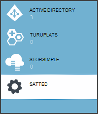
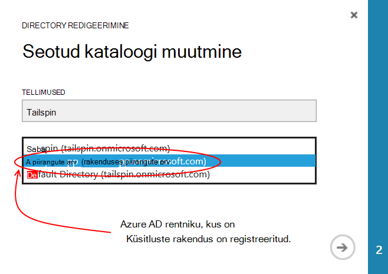
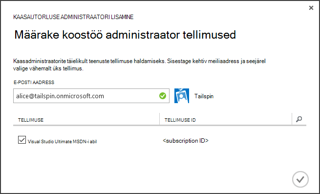
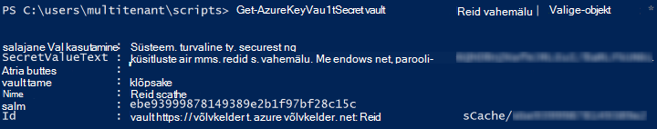

<properties
   pageTitle="Kasutades klahvi Vault kaitsmiseks rakenduse saladused | Microsoft Azure'i"
   description="Kuidas kasutada klahvi Vault teenuse rakenduse saladusi talletamiseks"
   services=""
   documentationCenter="na"
   authors="MikeWasson"
   manager="roshar"
   editor=""
   tags=""/>

<tags
   ms.service="guidance"
   ms.devlang="dotnet"
   ms.topic="article"
   ms.tgt_pltfrm="na"
   ms.workload="na"
   ms.date="02/16/2016"
   ms.author="mwasson"/>

# <a name="using-azure-key-vault-to-protect-application-secrets"></a>Azure'i klahvi Vault kaitsmiseks rakenduse saladusi abil

[AZURE.INCLUDE [pnp-header](../../includes/guidance-pnp-header-include.md)]

See artikkel on [osa sarjast]. Olemas on ka täieliku [valimi rakendus] , mis kaasneb selle sarja.

## <a name="overview"></a>Ülevaade

See on tavaline on rakenduse sätteid, mis on tundliku ja tuleb kaitsta, näiteks:

- Andmebaasi ühendusstringi
- Paroolide
- Cryptographic võtmed

Levinud, kui kunagi peaks talletatakse neid saladusi Juhtelemendi allikas. See on ka lihtne eritumist &mdash; isegi juhul, kui teie lähtekoodi hoidla on privaatne. Ja see ei praktiliselt pidamine saladusi kaudu üldise avaliku. Suuremate projektide, võiksite piirata mis arendajad ja tehtemärkide pääsete juurde selle tootmissaladused. (Katse- või veebikeskkonnas sätted on erinevad).

Turvalisemad suvand on salvestada neid saladusi [Azure'i klahvi Vault][KeyVault]. Klahv Vault on pilve majutatud cryptographic võtmed ja muud saladusi haldamise teenus. Selles artiklis kirjeldatakse klahvi Vault abil saate rakenduse talletada.

[Tailspin uuringute] [ Surveys] rakenduse on salajane järgmised sätted:

- Andmebaasi ühendusstringi.
- Redis ühendusstring.
- Kliendi salajane veebirakenduse jaoks.

Klahv võlvkelder konfiguratsiooni saladusi talletamiseks küsitluste rakenduse rakendab konksud ASP.net-i Core 1.0 [konfiguratsiooni süsteemi]kohandatud Otsingukonfiguratsiooni pakkuja[configuration]. Kohandatud pakkuja loeb konfiguratsioonisätted klahvi hoidlast käivitamisel.

Küsitluste rakenduse laadib konfiguratsioonisätted järgmistes kohtades:

- Appsettings.json fail
- [Kasutaja saladused talletada] [ user-secrets] (arenduskeskkond ainult;)
- Majutusteenuse keskkonnas (Azure'i veebirakendustes rakenduse sätted)
- Võtme Vault

Kõik need alistab eelmine, nii, et ühtegi sätet talletatud klahvi Vault ülimuslik.

> [AZURE.NOTE] Vaikimisi on keelatud võti Vault konfiguratsiooni pakkuja. See rakendus töötab kohalikult pole vaja. See võimaldaks tootmise juurutamine.

> Klahv Vault pakkujat pole praegu toetatud .NET peamiste, kuna see nõuab [Microsoft.Azure.KeyVault] [ Microsoft.Azure.KeyVault] paketi.

Käivitamisel rakenduse loeb sätted iga registreeritud konfiguratsiooni pakkuja ja kasutab neid asustamiseks tugevalt tipitud Suvandid objekti. (Lisateabe saamiseks vt [suvandite kasutamine ja konfigureerimine objektide][options].)

## <a name="implementation"></a>Rakendamine

[KeyVaultConfigurationProvider] [ KeyVaultConfigurationProvider] klassi on konfiguratsiooni pakkuja, mille saab ühendad ASP.net-i Core 1.0 [süsteemi konfiguratsioon][configuration].

Kasutada funktsiooni `KeyVaultConfigurationProvider`, kõne on `AddKeyVaultSecrets` laiendamine meetod käivitus klassi:

```csharp
    var builder = new ConfigurationBuilder()
        .SetBasePath(appEnv.ApplicationBasePath)
        .AddJsonFile("appsettings.json");

    if (env.IsDevelopment())
    {
        builder.AddUserSecrets();
    }
    builder.AddEnvironmentVariables();
    var config = builder.Build();

    // Add key vault configuration:
    builder.AddKeyVaultSecrets(config["AzureAd:ClientId"],
        config["KeyVault:Name"],
        config["AzureAd:Asymmetric:CertificateThumbprint"],
        Convert.ToBoolean(config["AzureAd:Asymmetric:ValidationRequired"]),
        loggerFactory);
```

Pange tähele, et `KeyVaultConfigurationProvider` nõuab teatud konfiguratsiooni sätted tuleb salvestada ühes konfiguratsiooni muudest allikatest.

Kui rakendus käivitub, `KeyVaultConfigurationProvider` loetleb kõik saladused võtme võlvkelder. Iga salajane – jututuba, näeb see välja sildi nimega "ConfigKey". Sildi väärtus konfiguratsiooni säte nime.

> [AZURE.NOTE] [Siltide] [ key-tags] on valikuline metaandmete salvestatud võti. Sildid on siin kasutada, kuna võtme nimed ei tohi sisaldada koolon (:) märgid.

```csharp
var kvClient = new KeyVaultClient(GetTokenAsync);
var secretsResponseList = await kvClient.GetSecretsAsync(_vault, MaxSecrets, token);
foreach (var secretItem in secretsResponseList.Value)
{
    //The actual config key is stored in a tag with the Key "ConfigKey"
    // because ':' is not supported in a shared secret name by Key Vault.
    if (secretItem.Tags != null && secretItem.Tags.ContainsKey(ConfigKey))
    {
        var secret = await kvClient.GetSecretAsync(secretItem.Id, token);
        Data.Add(secret.Tags[ConfigKey], secret.Value);
    }
}
```

> [AZURE.NOTE] Lugege teemat [KeyVaultConfigurationProvider.cs].

## <a name="setting-up-key-vault-in-the-surveys-app"></a>Klahv Vault häälestamise küsitluste rakenduses

Eeltingimused

- Installige [Azure'i ressursihaldur cmdlettide][azure-rm-cmdlets].
- Konfigureerige küsitluste rakenduse [uuringute rakendus]kirjeldatud[readme].

Üksikasjalik järgmiselt:

1. Saate häälestada rakenduse administraator kasutaja rentniku.
2. Saate häälestada kliendi serti.
3. Saate luua võtme vault.
4. Lisamine konfiguratsioonisätted võtme hoidlasse.
5. Kommenteerige välja koodi, mis võimaldab võtme vault.
6. Värskendage rakenduse kasutaja saladused.

### <a name="set-up-an-admin-user"></a>Administraator on Kasutaja seadistamine

> [AZURE.NOTE] Võtme vault loomiseks kasutage konto, kus saate hallata Azure tellimuse. Ka, saate lubada lugeda võtme hoidlast rakendusele registreeritud peab samal rentnikukontol selle konto.

Selles etapis tuleb teil on veenduge, et klahv võlvkelder ajal sisse logitud kasutaja rentnik saate luua kus uuringute rakendus on registreeritud.

Esmalt muuta Azure tellimusega seostatud kataloogi.

1. [Azure'i haldusportaal] sisse logida[azure-management-portal]

2. Klõpsake nuppu **sätted**.

    

3. Valige Azure tellimuse.

4. Klõpsake käsku **Redigeeri Directory** portaali allosas.

    

5. "Muuda seotud kataloogi", valige Azure AD rentniku, kus uuringute rakendus on registreeritud,

    

6. Klõpsake noolenuppu ja täitke dialoogiboksi.

Looge Azure AD rentniku, kus uuringute rakendus on registreeritud kasutaja administraator.

1. Logige [Azure'i haldusportaal][azure-management-portal].

2. Valige Azure AD rentniku, kus teie rakendus on registreeritud.

3. Klõpsake linki **Kasutajad** > **Lisa kasutaja**.

4. Dialoogiboksis **Lisa kasutaja,** määrata üldadministraatori rolliga kasutaja.

Lisage admin kasutaja Azure tellimuse koostöö administraatorina.

1. Logige [Azure'i haldusportaal][azure-management-portal].

2. Klõpsake nuppu **sätted** ja valige Azure tellimuse.

3. Klõpsake nuppu **Administraatorid**

4. Klõpsake nuppu **Lisa** portaali allosas.

5. Sisestage e-posti administraator kasutaja varem loodud.

6. Märkeruudu tellimuse.

7. Dialoogiboks lõpuleviimiseks nuppu märge.




### <a name="set-up-a-client-certificate"></a>Kliendi serti häälestamine

1. Käivitage PowerShelli skripti [/Scripts/Setup-KeyVault.ps1] [ Setup-KeyVault] järgmiselt:
    ```
    .\Setup-KeyVault.ps1 -Subject <<subject>>
    ```
    Jaoks soovitud `Subject` parameeter, sisestage mis tahes nimi, näiteks "surveysapp". Skripti genereeritud iseallkirjastatud serdi ja talletab selle "praeguse kasutaja isiklikku" serdi pood.

2. Skripti väljund on JSON fragment. Lisage see web appi Rakendusmanifest järgmiselt:

    1. Logige [Azure'i haldusportaal] [ azure-management-portal] ja liikuge Azure AD kataloogi.

    2. Klõpsake nuppu **rakendused**.

    3. Valige uuringute rakendus.

    4.  Klõpsake nuppu **Halda näidata** ja valige **Allalaadimine näidata**.

    5.  Avage tekstiredaktoris JSON Avaldamisfail. Kleepimine skripti üheks väljund on `keyCredentials` atribuut. See peaks välja nägema umbes järgmine:
    ```
            "keyCredentials": [
                {
                  "type": "AsymmetricX509Cert",
                  "usage": "Verify",
                  "keyId": "29d4f7db-0539-455e-b708-....",
                  "customKeyIdentifier": "ZEPpP/+KJe2fVDBNaPNOTDoJMac=",
                  "value": "MIIDAjCCAeqgAwIBAgIQFxeRiU59eL.....
                }
              ],
    ```          
    6.  Muudatuste salvestamiseks JSON-faili.

    7.  Minge tagasi portaali. Klõpsake nuppu **Halda näidata** > **Üles näidata** ja JSON-fail üles.

3. Lisage sama JSON fragment veebi-API (Surveys.WebAPI) Rakendusmanifest.

4. Käivitage järgmine käsk saamiseks serdi sõrmejälje.
    ```
    certutil -store -user my [subject]
    ```
    kus `[subject]` on väärtus, mis teie määratud teemat PowerShelli skripti. Funktsiooni sõrmejälje on loetletud "Cert Hash(sha1)". Eemaldage tühikute kuueteistkümnendarvu arvud.

Kasutage funktsiooni sõrmejälje hiljem.

### <a name="create-a-key-vault"></a>Võtme vault loomine

1. Käivitage PowerShelli skripti [/Scripts/Setup-KeyVault.ps1] [ Setup-KeyVault] järgmiselt:

    ```
    .\Setup-KeyVault.ps1 -KeyVaultName <<key vault name>> -ResourceGroupName <<resource group name>> -Location <<location>>
    ```

    Mandaadi küsimise korral logige sisse Azure AD kasutaja, et varem loodud. Skripti loob uue ressursirühma ja uue tootenumbri vault selle ressursi rühmas.

    Märkus: - asukohta parameetri jaoks, saate loendi kehtiv piirkondade PowerShelli käsk:

    ```
    Get-AzureRmResourceProvider -ProviderNamespace "microsoft.keyvault" | Where-Object { $_.ResourceTypes.ResourceTypeName -eq "vaults" } | Select-Object -ExpandProperty Locations
    ```

2. Käivitage uuesti SetupKeyVault.ps järgmiste parameetrite abil:

    ```
    .\Setup-KeyVault.ps1 -KeyVaultName <<key vault name>> -ApplicationIds @("<<web app client ID>>", "<<web API client ID>>")
    ```

    Kui

    - võtme vault nimi = nimi, et andis võtme vault eelmises etapis.
    - Web Appi Kliendiid = kliendi ID küsitluste veebirakenduse jaoks.
    - Web api Kliendiid = kliendi ID Surveys.WebAPI rakenduse.

    Näide:
    ```
    .\Setup-KeyVault.ps1 -KeyVaultName tailspinkv -ApplicationIds @("f84df9d1-91cc-4603-b662-302db51f1031", "8871a4c2-2a23-4650-8b46-0625ff3928a6")
    ```

    > [AZURE.NOTE] Saate kliendi ID-d [Azure'i haldusportaal][azure-management-portal]. Valige Azure AD rentniku, valige rakendus ja klõpsake nuppu **Konfigureeri**.

    See skript lubab web app ja Veebiteenuste saladusi toomiseks teie olulisi hoidlast. Leiate [Azure'i klahvi Vault alustamine] [ authorize-app] lisateabe saamiseks.

### <a name="add-configuration-settings-to-your-key-vault"></a>Lisamine konfiguratsioonisätted võtme hoidlasse

1. Käivitage SetupKeyVault.ps järgmiselt:

    ```
    .\Setup-KeyVault.ps1 -KeyVaultName <<key vault name> -KeyName RedisCache -KeyValue "<<Redis DNS name>>.redis.cache.windows.net,password=<<Redis access key>>,ssl=true" -ConfigName "Redis:Configuration"
    ```
    Kui

    - võtme vault nimi = nimi, et andis võtme vault eelmises etapis.
    - DNS-i nimi redis = Redis vahemälu eksemplari oma DNS-i nimi.
    - Kiirklahv redis = kiirklahv Redis vahemälu eksemplari puhul.

    See käsk salajase lisatakse teie olulisi vault. Salajane on nime/väärtuse paari pluss sildi.

    -   Võtme nimi pole kasutatud rakenduse, kuid peab olema kordumatu võti Vault.
    -   Väärtus väärtus konfigureerimist, praegusel juhul Redis ühendusstring.
    -   sildi "ConfigKey" hoiab konfiguratsiooni võti nime.

2. Selles etapis on soovitav kontrollida, kas edukalt talletatud võtme vault saladusi. Käivitage PowerShelli järgmine käsk:

    ```
    Get-AzureKeyVaultSecret <<key vault name>> RedisCache | Select-Object *
    ```
    Väljund peaks kuva salajane väärtus pluss mõned metaandmete:

    

3. Käivitage uuesti lisamiseks andmebaasi ühendusstringi SetupKeyVault.ps:

    ```
    .\Setup-KeyVault.ps1 -KeyVaultName <<key vault name> -KeyName ConnectionString -KeyValue <<DB connection string>> -ConfigName "Data:SurveysConnectionString"
    ```

    Kui `<<DB connection string>>` andmebaasi ühendusstringi väärtus.

    Kohaliku andmebaasi testimiseks kopeerige ühendusstring Tailspin.Surveys.Web/appsettings.json failist. Kui te seda teha, veenduge, et muuta kahekordsete kurakriipsu ('\\\\") sisse ühe kurakriipsu. Kahekordne kurakriipsu on paomärki JSON-failis.

    Näide:

    ```
    .\Setup-KeyVault.ps1 -KeyVaultName mykeyvault -KeyName ConnectionString -KeyValue "Server=(localdb)\MSSQLLocalDB;Database=Tailspin.SurveysDB;Trusted_Connection=True;MultipleActiveResultSets=true" -ConfigName "Data:SurveysConnectionString"
    ```

### <a name="uncomment-the-code-that-enables-key-vault"></a>Kommenteerige välja koodi, mis võimaldab klahvi Vault

1. Avage Tailspin.Surveys lahendus.

2. Klõpsake [Tailspin.Surveys.Web/Startup.cs][web-startup], Leidke järgmine kood plokk ja selle eemaldamine.

    ```csharp
    //#if DNX451
    //            _configuration = builder.Build();
    //            builder.AddKeyVaultSecrets(_configuration["AzureAd:ClientId"],
    //                _configuration["KeyVault:Name"],
    //                _configuration["AzureAd:Asymmetric:CertificateThumbprint"],
    //                Convert.ToBoolean(_configuration["AzureAd:Asymmetric:ValidationRequired"]),
    //                loggerFactory);
    //#endif
    ```

3. Klõpsake [Tailspin.Surveys.WebAPI/Startup.cs][web-api-startup], Leidke järgmine kood plokk ja selle eemaldamine.

    ```csharp
    //#if DNX451
    //            var config = builder.Build();
    //            builder.AddKeyVaultSecrets(config["AzureAd:ClientId"],
    //                config["KeyVault:Name"],
    //                config["AzureAd:Asymmetric:CertificateThumbprint"],
    //                Convert.ToBoolean(config["AzureAd:Asymmetric:ValidationRequired"]),
    //                loggerFactory);
    //#endif
    ```

4. Klõpsake [Tailspin.Surveys.Web/Startup.cs][web-startup], leidke registreerib funktsiooni `ICredentialService`. Kommenteerige välja rida, mis kasutab `CertificateCredentialService`, ja kommenteeri välja rida, mis kasutab `ClientCredentialService`:

    ```csharp
    // Uncomment this:
    services.AddSingleton<ICredentialService, CertificateCredentialService>();
    // Comment out this:
    //services.AddSingleton<ICredentialService, ClientCredentialService>();
    ```

    See muudatus võimaldab kasutada [Kliendi kinnituse] veebirakenduse[ client-assertion] OAuthi Accessi sõned saada. Kliendi kinnitus, ei pea mõne OAuthi kliendi salajane. Teise võimalusena võivad talletada kliendi salajane võtme võlvkelder. Siiski võtme hoidla ja mõlemad kasutada mõnda muud klienti kliendi kinnituse sertifikaat, nii, et kui lubate võtme vault, on mõistlik lubada kliendi kinnituse ka.

### <a name="update-the-user-secrets"></a>Kasutaja saladusi värskendamine

Solution Exploreris paremklõpsake Tailspin.Surveys.Web projekti ja valige **Halda kasutaja saladused**. Failis secrets.json kustutage olemasolev JSON ja kleepige järgmine:

    ```
    {
      "AzureAd": {
        "ClientId": "[Surveys web app client ID]",
        "PostLogoutRedirectUri": "https://localhost:44300/",
        "WebApiResourceId": "[App ID URI of your Surveys.WebAPI application]",
        "Asymmetric": {
          "CertificateThumbprint": "[certificate thumbprint. Example: 105b2ff3bc842c53582661716db1b7cdc6b43ec9]",
          "StoreName": "My",
          "StoreLocation": "CurrentUser",
          "ValidationRequired": "false"
        }
      },
      "KeyVault": {
        "Name": "[key vault name]"
      }
    }
    ```

Asendage õigete väärtuste kirjeid [nurksulgudes].

- `AzureAd:ClientId`: Kliendi ID uuringute rakendus.
- `AzureAd:WebApiResourceId`: Surveys.WebAPI rakenduse loomisel Azure AD määratud rakenduse ID URI.
- `Asymmetric:CertificateThumbprint`: Serdi sõrmejälje, mida teil varem, kui olete loonud kliendi sert.
- `KeyVault:Name`: Teie olulisi vault nimi.

> [AZURE.NOTE] `Asymmetric:ValidationRequired`on false kuna on varem loodud sert pole allkirjastatud juur sertimiskeskus (CA). Valmistamisel, kasutage sert, mis on allkirjastatud root CA ja `ValidationRequired` tõene.

Värskendatud secrets.json faili salvestada.

Järgmiseks Solution Exploreris paremklõpsake Tailspin.Surveys.WebApi projekti ja valige **Halda kasutaja saladused**. Kustutage olemasolev JSON ja kleepige järgmine:

```
{
  "AzureAd": {
    "ClientId": "[Surveys.WebAPI client ID]",
    "WebApiResourceId": "https://tailspin5.onmicrosoft.com/surveys.webapi",
    "Asymmetric": {
      "CertificateThumbprint": "[certificate thumbprint]",
      "StoreName": "My",
      "StoreLocation": "CurrentUser",
      "ValidationRequired": "false"
    }
  },
  "KeyVault": {
    "Name": "[key vault name]"
  }
}
```

Asendage [nurksulgudes] kirjeid ja secrets.json faili salvestada.

> [AZURE.NOTE] Veebis API, veenduge, et kasutada kliendi ID Surveys.WebAPI rakenduse, mitte uuringute rakendus.


<!-- Links -->
[authorize-app]: ../key-vault/key-vault-get-started.md/#authorize
[azure-management-portal]: https://manage.windowsazure.com/
[azure-rm-cmdlets]: https://msdn.microsoft.com/library/mt125356.aspx
[client-assertion]: guidance-multitenant-identity-client-assertion.md
[configuration]: https://docs.asp.net/en/latest/fundamentals/configuration.html
[KeyVault]: https://azure.microsoft.com/services/key-vault/
[KeyVaultConfigurationProvider]: https://github.com/Azure-Samples/guidance-identity-management-for-multitenant-apps/blob/master/src/Tailspin.Surveys.Configuration.KeyVault/KeyVaultConfigurationProvider.cs
[key-tags]: https://msdn.microsoft.com/library/azure/dn903623.aspx#BKMK_Keytags
[Microsoft.Azure.KeyVault]: https://www.nuget.org/packages/Microsoft.Azure.KeyVault/
[options]: https://docs.asp.net/en/latest/fundamentals/configuration.html#using-options-and-configuration-objects
[readme]: https://github.com/Azure-Samples/guidance-identity-management-for-multitenant-apps/blob/master/docs/running-the-app.md
[Setup-KeyVault]: https://github.com/Azure-Samples/guidance-identity-management-for-multitenant-apps/blob/master/scripts/Setup-KeyVault.ps1
[Surveys]: guidance-multitenant-identity-tailspin.md
[user-secrets]: http://go.microsoft.com/fwlink/?LinkID=532709
[web-startup]: https://github.com/Azure-Samples/guidance-identity-management-for-multitenant-apps/blob/master/src/Tailspin.Surveys.Web/Startup.cs
[web-api-startup]: https://github.com/Azure-Samples/guidance-identity-management-for-multitenant-apps/blob/master/src/Tailspin.Surveys.WebAPI/Startup.cs
[Sarja mittekuuluva]: guidance-multitenant-identity.md
[KeyVaultConfigurationProvider.cs]: https://github.com/Azure-Samples/guidance-identity-management-for-multitenant-apps/blob/master/src/Tailspin.Surveys.Configuration.KeyVault/KeyVaultConfigurationProvider.cs
[proovi taotluse]: https://github.com/Azure-Samples/guidance-identity-management-for-multitenant-apps
