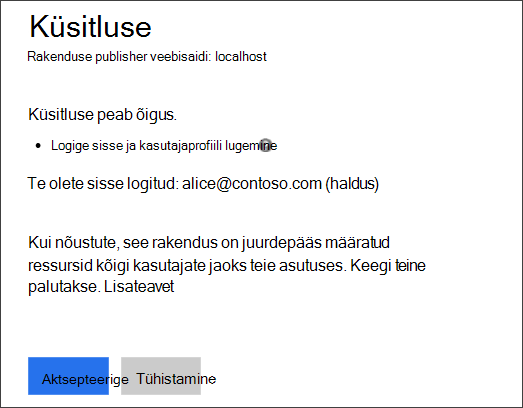
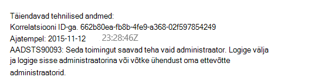
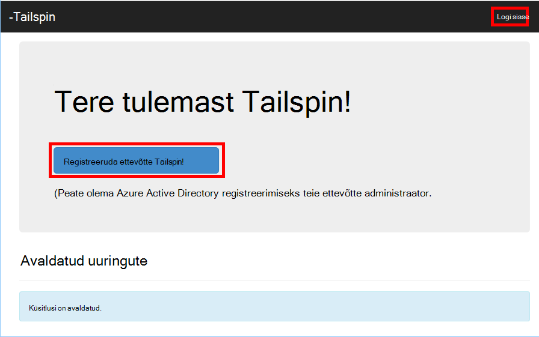
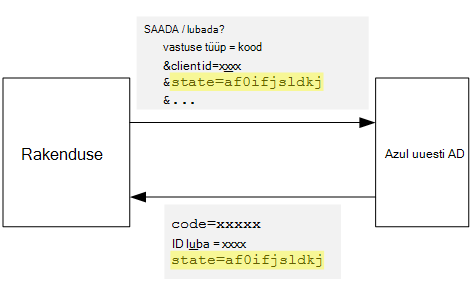
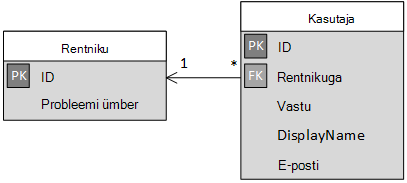

<properties
   pageTitle="Registreerumise ja rentnikuhalduse kasutuselevõtt rentnikuga rakendustes | Microsoft Azure'i"
   description="Kuidas pardal rentnikega rentnikuga rakenduses"
   services=""
   documentationCenter="na"
   authors="MikeWasson"
   manager="roshar"
   editor=""
   tags=""/>

<tags
   ms.service="guidance"
   ms.devlang="dotnet"
   ms.topic="article"
   ms.tgt_pltfrm="na"
   ms.workload="na"
   ms.date="05/23/2016"
   ms.author="mwasson"/>

# <a name="sign-up-and-tenant-onboarding-in-a-multitenant-application"></a>Registreerumise ja rentniku rentnikuga rakenduses kasutuselevõtt

[AZURE.INCLUDE [pnp-header](../../includes/guidance-pnp-header-include.md)]

See artikkel on [osa sarjast]. Olemas on ka täieliku [valimi rakendus] , mis kaasneb selle sarja.

Selles artiklis kirjeldatakse, kuidas rakendada mõne _registreerumise_ mitme rentniku rakenduses, mis võimaldab kliendi registreeruda oma organisatsiooni rakenduse protsess.
On mitu põhjust rakendada mõne registreerumisprotsessi.

-   Luba kliendi kogu asutuse rakenduse kasutamiseks nõusolekut AD administraator.
-   Krediitkaardiga või muu kliendi teabe kogumine.
-   Mis tahes ühekordse kohta rentniku häälestamine rakenduse jaoks vajalik teha.

## <a name="admin-consent-and-azure-ad-permissions"></a>Administraator nõusolekut ja Azure AD õiguste

Rakenduse autentimiseks Azure AD, peab kasutaja kaustale juurdepääs. Vähemalt, peab taotluse õigus lugeda kasutajaprofiili. Esimene kord, kui kasutaja märke, kuvatakse Azure AD nõusoleku lehel, kus on loetletud nõutud õigused. Klõpsake nuppu **Aktsepteeri**, kasutaja annab loa rakendus.

Vaikimisi on nõusolek kasutaja alusel. Igale kasutajale, kes sisse logib näeb nõusoleku lehel. Azure AD toetab samuti _administraator nõusolekut_, mis võimaldab kogu ettevõtte administraator AD nõusolekut.

Administraator nõusolekut voogu kasutamisel olekud nõusoleku lehel, et AD administraator on õiguse andmiseks nimel kogu rentniku:



Pärast admin klõpsab nuppu **Aktsepteeri**, sama rentniku teised kasutajad saavad sisse logida ja Azure AD vahele nõusolekut ekraani.

Ainult AD administraator saab nõusolekut administraator, kuna seda määrab nimel kogu ettevõttes õigus. Kui administraator nõusolekut voogu autentimiseks proovib mitte-administraatoritest, Azure AD kuvatakse tõrge:



Kui rakendus nõuab täiendavaid õigusi hiljem, tuleb kliendi sisse logida uuesti ja nõustuma uuendatud õigused.  

## <a name="implementing-tenant-sign-up"></a>Rentniku registreerumise rakendamine

[Tailspin uuringute] jaoks[ Tailspin] rakenduse meil määratletud mitu nõuded registreerumisprotsessi:

-   Rentniku jaoks tuleb registreeruda enne kasutajad saavad sisse logida.
-   Registreerumise kasutab administraator nõusolekut voogu.
-   Rakenduse andmebaasi registreerumise lisab selle kasutaja rentnik.
-   Pärast rentniku registreerub, kuvatakse rakenduse mõne lehe kasutuselevõtt.

Selles jaotises juhendame meie registreerumisprotsessi rakendamine.
See on oluline mõista selle "sign up" ja "Logi sisse" on rakenduse mõiste. Ajal autentimist kulgemist, Azure AD potentsiaalselt tea, kas kasutaja on registreerumine. See on rakenduse silma peal kontekstis.

Kui Anonüümne kasutaja külastamine rakenduse küsitlused, kasutaja on näha kaks nuppu, üks sisse logida ja üks "registreeruda ettevõtte" (Logi sisse).



Need nupud autonoomsest [AccountController] tunni toimingud.

Funktsiooni `SignIn` toimingu annab vastuseks **ChallegeResult**, mis põhjustab OpenID Connect vahevara ümbersuunamiseks autentimise lõpp-punkti. See on vaikimisi viis päästik autentimise ASP.net-i Core 1.0.  

```csharp
[AllowAnonymous]
public IActionResult SignIn()
{
    return new ChallengeResult(
        OpenIdConnectDefaults.AuthenticationScheme,
        new AuthenticationProperties
        {
            IsPersistent = true,
            RedirectUri = Url.Action("SignInCallback", "Account")
        });
}
```

Nüüd võrdlus on `SignUp` toiming:

```csharp
[AllowAnonymous]
public IActionResult SignUp()
{
    // Workaround for https://github.com/aspnet/Security/issues/546
    HttpContext.Items.Add("signup", "true");

    var state = new Dictionary<string, string> { { "signup", "true" }};
    return new ChallengeResult(
        OpenIdConnectDefaults.AuthenticationScheme,
        new AuthenticationProperties(state)
        {
            RedirectUri = Url.Action(nameof(SignUpCallback), "Account")
        });
}
```

Nagu `SignIn`, et `SignUp` toiming tagastab samuti on `ChallengeResult`. Kuid seekord lisame olekus infokillu abil soovitud `AuthenticationProperties` sisse selle `ChallengeResult`:

-   registreerimine: kahendmuutujaga lipu, mis näitab, et kasutaja käivitas registreerumisprotsessi.

Oleku teave `AuthenticationProperties` saab lisada OpenID ühendamine [olekus] parameeter, mis ümardada reisi ajal autentimist voogu.



Pärast kasutaja autendib Azure AD ja ümbersuunamist tagasi rakendusele, sisaldab autentimise Piletite olekut. Kasutame sellest veendumaks, et "registreerimine" väärtus ei lahene üle kogu autentimise voogu.

## <a name="adding-the-admin-consent-prompt"></a>Administraatori nõusoleku küsimuse lisamine

Azure AD, käivitatakse administraator nõusolekut voogu, lisades "küsimus" parameeter päringustringi autentimine taotluse:

```
/authorize?prompt=admin_consent&...
```

Küsitluste rakendus lisab küsimuse ajal kuvatakse `RedirectToAuthenticationEndpoint` sündmus. See sündmus kutsutakse enne selle vahevara suunab autentimise lõpp-punkti paremale.

```csharp
public override Task RedirectToAuthenticationEndpoint(RedirectContext context)
{
    if (context.IsSigningUp())
    {
        context.ProtocolMessage.Prompt = "admin_consent";
    }

    _logger.RedirectToIdentityProvider();
    return Task.FromResult(0);
}
```

> [AZURE.NOTE] Lugege teemat [SurveyAuthenticationEvents.cs].

Säte` ProtocolMessage.Prompt` ütleb vahevara autentimine taotluse lisamiseks "küsimus" parameeter.

Pange tähele, et küsimuse on vaja vaid registreerumise käigus. Tavaline sisselogimist tuleks lisada selle. Nende eristamine me otsida soovitud `signup` väärtus autentimise olekus. See tingimus kontrollib laiend järgmisel viisil:

```csharp
internal static bool IsSigningUp(this BaseControlContext context)
{
    Guard.ArgumentNotNull(context, nameof(context));

    string signupValue;
    object obj;
    // Check the HTTP context and convert to string
    if (context.HttpContext.Items.TryGetValue("signup", out obj))
    {
        signupValue = (string)obj;
    }
    else
    {
        // It's not in the HTTP context, so check the authentication ticket.  If it's not there, we aren't signing up.
        if ((context.AuthenticationTicket == null) ||
            (!context.AuthenticationTicket.Properties.Items.TryGetValue("signup", out signupValue)))
        {
            return false;
        }
    }

    // We have found the value, so see if it's valid
    bool isSigningUp;
    if (!bool.TryParse(signupValue, out isSigningUp))
    {
        // The value for signup is not a valid boolean, throw                
        throw new InvalidOperationException($"'{signupValue}' is an invalid boolean value");
    }

    return isSigningUp;
}
```

> [AZURE.NOTE] Lugege teemat [BaseControlContextExtensions.cs].

> [AZURE.NOTE] Märkus: Järgmine kood sisaldab mõnda lahendus teadaolev viga ASP.net-i Core 1,0 RC1. Klõpsake soovitud `RedirectToAuthenticationEndpoint` sündmus, ei ole võimalik saada autentimise atribuutide mis sisaldab "registreerimine" olekut. Lahenduseks on `AccountController.SignUp` meetod ka panna "registreerimine" olek sisse selle `HttpContext`. See toimib, sest `RedirectToAuthenticationEndpoint` juhtub enne suunata, et meil on veel sama `HttpContext`.

## <a name="registering-a-tenant"></a>Rentniku registreerimine

Küsitluste rakenduse salvestab iga rentniku kohta leiate teavet ja kasutajale rakenduse andmebaas.



Tabelis rentniku IssuerValue on väljaandja nõude rentniku väärtus. Azure AD, on see `https://sts.windows.net/<tentantID>` ja annab kordumatu väärtus rentniku kohta.

Kui uue rentniku registreerub, küsitluste rakenduse kirjutab rentniku kirje andmebaasi. See juhtub sees on `AuthenticationValidated` sündmus. (Ei tee seda enne sündmuse, kuna ID luba ei valideeritakse veel, et te ei saa usaldada taotluste väärtused. Lugege teemat [autentimist].

Siin on oluline kood küsitluste rakendusest:

```csharp
public override async Task AuthenticationValidated(AuthenticationValidatedContext context)
{
    var principal = context.AuthenticationTicket.Principal;
    var userId = principal.GetObjectIdentifierValue();
    var tenantManager = context.HttpContext.RequestServices.GetService<TenantManager>();
    var userManager = context.HttpContext.RequestServices.GetService<UserManager>();
    var issuerValue = principal.GetIssuerValue();
    _logger.AuthenticationValidated(userId, issuerValue);

    // Normalize the claims first.
    NormalizeClaims(principal);
    var tenant = await tenantManager.FindByIssuerValueAsync(issuerValue)
        .ConfigureAwait(false);

    if (context.IsSigningUp())
    {
        // Originally, we were checking to see if the tenant was non-null, however, this would not allow
        // permission changes to the application in AAD since a re-consent may be required.  Now we just don't
        // try to recreate the tenant.
        if (tenant == null)
        {
            tenant = await SignUpTenantAsync(context, tenantManager)
                .ConfigureAwait(false);
        }

        // In this case, we need to go ahead and set up the user signing us up.
        await CreateOrUpdateUserAsync(context.AuthenticationTicket, userManager, tenant)
            .ConfigureAwait(false);
    }
    else
    {
        if (tenant == null)
        {
            _logger.UnregisteredUserSignInAttempted(userId, issuerValue);
            throw new SecurityTokenValidationException($"Tenant {issuerValue} is not registered");
        }

        await CreateOrUpdateUserAsync(context.AuthenticationTicket, userManager, tenant)
            .ConfigureAwait(false);
    }
}
```

> [AZURE.NOTE] Lugege teemat [SurveyAuthenticationEvents.cs].

Järgmine kood teeb järgmist.

1.  Kontrollige, kas rentniku väljaandja väärtus on juba andmebaasis. Kui Rentnik on ei registreerunud, `FindByIssuerValueAsync` tagastab null.
2.  Kui kasutaja on registreerumine:
  1.    Lisada rentnikule andmebaasi (`SignUpTenantAsync`).
  2.    Autenditud kasutaja lisamine andmebaasi (`CreateOrUpdateUserAsync`).
3.  Muul juhul täitke tavaline kulgemist.
  1.    Kui rentniku väljaandja andmebaasi ei leitud, tähendab see, rentnik pole registreeritud ja klient peab registreeruda. Sel juhul põhjustada erandi nurjumise autentimine põhjustada.
  2.    Muul juhul selle kasutaja andmebaasi kirje loomine, kui veel pole ühte (`CreateOrUpdateUserAsync`).

Siin on [SignUpTenantAsync] meetod, mis lisab rentniku andmebaasi.

```csharp
private async Task<Tenant> SignUpTenantAsync(BaseControlContext context, TenantManager tenantManager)
{
    Guard.ArgumentNotNull(context, nameof(context));
    Guard.ArgumentNotNull(tenantManager, nameof(tenantManager));

    var principal = context.AuthenticationTicket.Principal;
    var issuerValue = principal.GetIssuerValue();
    var tenant = new Tenant
    {
        IssuerValue = issuerValue,
        Created = DateTimeOffset.UtcNow
    };

    try
    {
        await tenantManager.CreateAsync(tenant)
            .ConfigureAwait(false);
    }
    catch(Exception ex)
    {
        _logger.SignUpTenantFailed(principal.GetObjectIdentifierValue(), issuerValue, ex);
        throw;
    }

    return tenant;
}
```

Siin on kogu registreerumise kulgemist küsitluste rakenduse Kokkuvõte:

1.  Kasutaja klõpsab nuppu **Liitu** .
2.  Funktsiooni `AccountController.SignUp` toiming tagastab tulemi challege.  Autentimise olekus sisaldab väärtust "registreerimine".
3.  Klõpsake soovitud `RedirectToAuthenticationEndpoint` sündmus, lisamine soovitud `admin_consent` küsimus.
4.  OpenID Connect vahevara suunab Azure AD ja kasutajale autendib.
5.  Klõpsake soovitud `AuthenticationValidated` sündmus, vaadake "registreerimine" olekus.
6.  Lisada rentnikule andmebaas.

## <a name="next-steps"></a>Järgmised sammud

- Järgmise artiklist selle sarja: [rakenduse rollide rentnikuga rakendustes][app roles]


<!-- Links -->
[app roles]: guidance-multitenant-identity-app-roles.md
[Tailspin]: guidance-multitenant-identity-tailspin.md
[Sarja mittekuuluva]: guidance-multitenant-identity.md
[AccountController]: https://github.com/Azure-Samples/guidance-identity-management-for-multitenant-apps/blob/master/src/Tailspin.Surveys.Web/Controllers/AccountController.cs
[olek]: http://openid.net/specs/openid-connect-core-1_0.html#AuthRequest
[SurveyAuthenticationEvents.cs]: https://github.com/Azure-Samples/guidance-identity-management-for-multitenant-apps/blob/master/src/Tailspin.Surveys.Web/Security/SurveyAuthenticationEvents.cs
[BaseControlContextExtensions.cs]: https://github.com/Azure-Samples/guidance-identity-management-for-multitenant-apps/blob/master/src/Tailspin.Surveys.Web/Security/BaseControlContextExtensions.cs
[Autentimine]: guidance-multitenant-identity-authenticate.md
[SignUpTenantAsync]: https://github.com/Azure-Samples/guidance-identity-management-for-multitenant-apps/blob/master/src/Tailspin.Surveys.Web/Security/SurveyAuthenticationEvents.cs
[proovi taotluse]: https://github.com/Azure-Samples/guidance-identity-management-for-multitenant-apps
