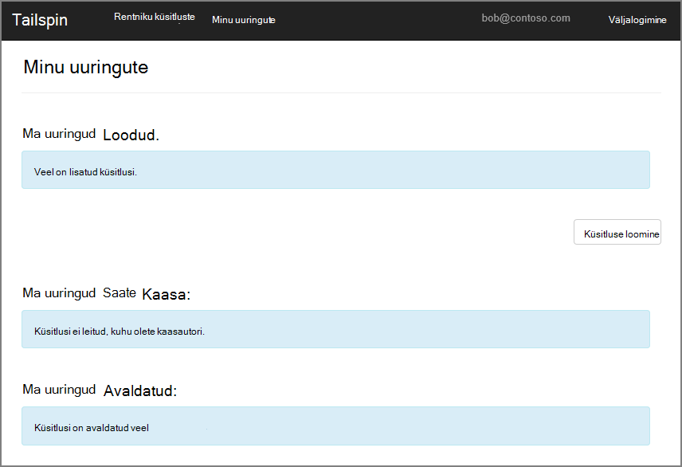
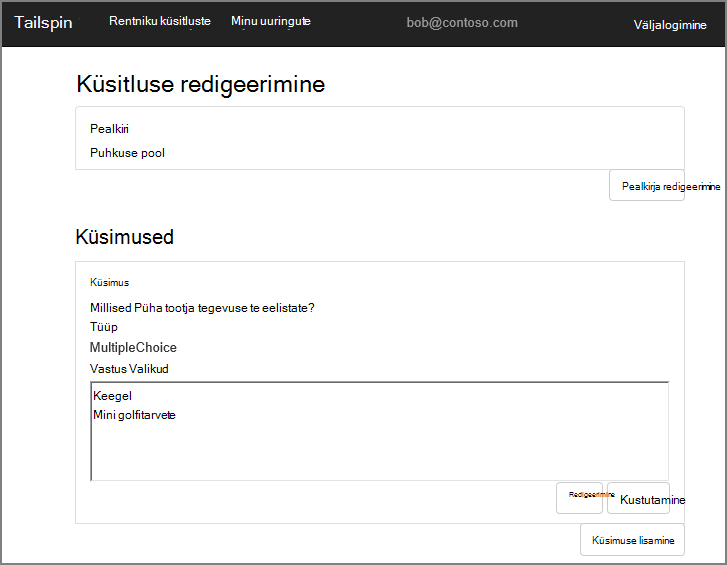
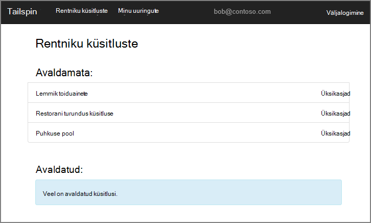
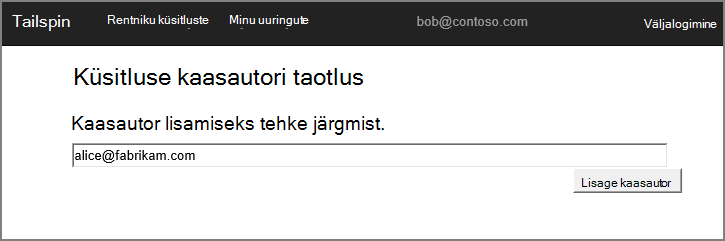
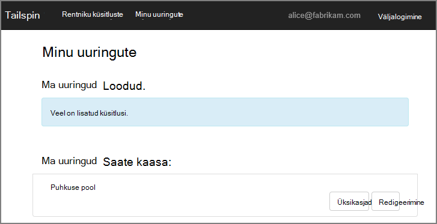
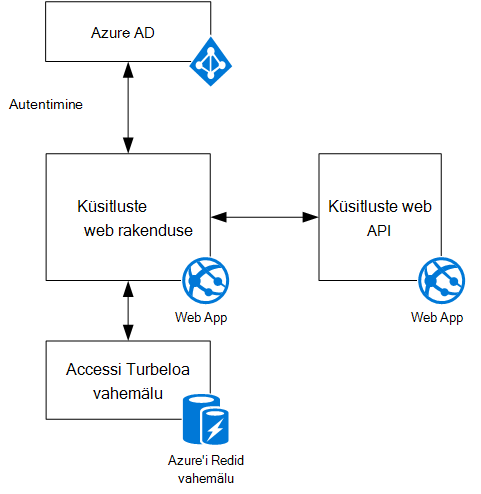

<properties
   pageTitle="Tailspin küsitlused rakenduse kohta | Microsoft Azure'i"
   description="Tailspin küsitluste rakenduse ülevaade"
   services=""
   documentationCenter="na"
   authors="MikeWasson"
   manager="roshar"
   editor=""
   tags=""/>

<tags
   ms.service="guidance"
   ms.devlang="dotnet"
   ms.topic="article"
   ms.tgt_pltfrm="na"
   ms.workload="na"
   ms.date="05/23/2016"
   ms.author="mwasson"/>

# Tailspin küsitluste rakenduse kohta

[AZURE.INCLUDE [pnp-header](../../includes/guidance-pnp-header-include.md)]

See artikkel on [osa sarjast]. Olemas on ka täieliku [valimi rakendus] , mis kaasneb selle sarja.

Tailspin on väljamõeldud ettevõte, mis areneb SaaS rakenduse, küsitluste nimega. See rakendus võimaldab asutustel luua ja avaldada online küsitlused.

- Ettevõtte saavad registreeruda rakendus.
- Pärast seda, kui asutuses on registreerunud, saate kasutajad sisse logida taotluse volituste organisatsioonisisene.
- Kasutajate loomine, redigeerimine ja küsitluste avaldada.

> [AZURE.NOTE] Alustamine rakenduse, lugege teemat [küsitlused rakendus].

## Kasutajad saavad loomine, redigeerimine ja vaatamine küsitlused

Autenditud kasutaja saab vaadata küsitlused, et ta on loodud või on kaasautori õigused ja luua uusi küsitlusi. Pange tähele, et kasutaja on sisse loginud oma organisatsiooni identiteedi `bob@contoso.com`.

Sellel kuvatõmmisel on kuvatud küsitlusleht redigeerimine:

Kasutajad saavad vaadata ka kõik uuringute sama rentniku teiste kasutajate loodud.

## Küsitluse omanikud saate kutsuda osaliste

Kui kasutaja loob küsitluse, ta saate kutsuda teised inimesed ülevaatuse kaasautoriteks määratavate. Osaliste küsitlus, redigeerida, kuid ei saa kustutada või selle avaldada.  

Kasutaja saate lisada osaliste muud rentnikud, mis võimaldab rist – rentniku jagada ressursse. Pildil, Bob (`bob@contoso.com`) lisab Alice (`alice@fabrikam.com`) kaasautorina Bob loodud küsitlusele.

Kui Alice sisse logib, näeb loendis "Küsitluste saate kaasa" küsitlus.

Pange tähele, et Alice logitakse sisse oma rentniku ei Contoso rentniku külalisena. Alice on osalusõigused ainult selle küsitluse &mdash; ta ei saa vaadata teiste uuringute Contoso sihtrentnikusse.

## Arhitektuur

Küsitluste rakendus koosneb web vastendamisel ja veebi-API taustväärtus. Mõlemad on rakendatud [ASP.net-i Core 1.0]abil.

Veebirakenduse kasutab Azure Active Directory (Azure AD) kasutajate autentimiseks. Veebirakenduse kutsub Azure AD sõned OAuthi 2 juurdepääsu saamiseks veebi-API-ga. Accessi sõned vahemällu Azure'i Redis vahemälu. Vahemälu võimaldab mitmes eksemplaris jagada sama Turbeloa vahemälu (nt serveripargi).

## Järgmised sammud

- Järgmise artiklist selle sarja: [autentimist kasutades Azure Active Directory ja OpenID ühendamine rentnikuga rakendustes][authentication]

<!-- Links -->

[authentication]: guidance-multitenant-identity-authenticate.md
[Sarja mittekuuluva]: guidance-multitenant-identity.md
[Küsitluste rakendus]: https://github.com/Azure-Samples/guidance-identity-management-for-multitenant-apps/blob/master/docs/running-the-app.md
[ASP.net-i Core 1.0]: https://docs.asp.net/en/latest/
[proovi taotluse]: https://github.com/Azure-Samples/guidance-identity-management-for-multitenant-apps
