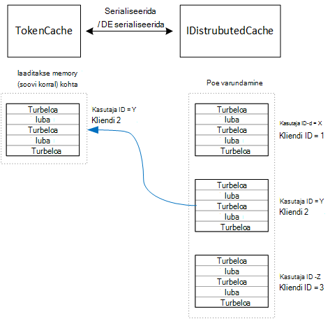

<properties
   pageTitle="Vahemällu acess sõned rentnikuga rakenduses | Microsoft Azure'i"
   description="Accessi märgid kasutatud kasutada mõnda taustväärtus Veebiteenuste vahemällu talletamine"
   services=""
   documentationCenter="na"
   authors="MikeWasson"
   manager="roshar"
   editor=""
   tags=""/>

<tags
   ms.service="guidance"
   ms.devlang="dotnet"
   ms.topic="article"
   ms.tgt_pltfrm="na"
   ms.workload="na"
   ms.date="02/16/2016"
   ms.author="mwasson"/>


# <a name="caching-access-tokens-in-a-multitenant-application"></a>Vahemällu rentnikuga rakenduses access sõned

[AZURE.INCLUDE [pnp-header](../../includes/guidance-pnp-header-include.md)]

See artikkel on [osa sarjast]. Olemas on ka täieliku [valimi rakendus] , mis kaasneb selle sarja.

See on üsna kallis saada juurdepääsu OAuthi Turbeloa, kuna see nõuab HTTP-päring Turbeloa lõpp-punkti. Seetõttu on hea vahemälu sõned alati, kui võimalik. [Azure'i AD Authentication Library] [ ADAL] (ADAL) salvestab automaatselt sõned saadud Azure AD, sh värskendamise sõned.

ADAL pakub vaikimisi Turbeloa vahemälu rakendamine. Turbeloa vahemälu omakliendi rakendused on mõeldud, ent on _pole_ sobiv veebirakenduste:

-   See on staatiline eksemplar ja teemat kaitstud.
-   See ei skaala suure hulga kasutajate, kuna sõned kõigi kasutajate minna sama sõnastikku.
-   See ei saa ühiskasutusse anda web on serveripargi serverites.

Selle asemel tuleks rakendada kohandatud Turbeloa vahemälu, mis tuleneb funktsiooni ADAL `TokenCache` tunni, kuid sobib serveri keskkonnas ja pakub sõned erinevatele kasutajatele vahelise eraldustaseme soovitav tase.

Funktsiooni `TokenCache` klassi talletab sõnastiku märkide indekseeritud väljaandja, ressursside, kliendi ID ja kasutajale. Kohandatud Turbeloa vahemälu tuleks kirjutada selle sõnastiku varundamise poodi, nt Redis vahemälu.

Rakenduses Tailspin Küsitlused on `DistributedTokenCache` rakendab tunni Turbeloa vahemälu. Selle rakendamist kasutab [IDistributedCache] [ distributed-cache] võtmiseks ASP.net-i tuum 1.0. Sel viisil, mis tahes `IDistributedCache` rakendamiseks saate kasutada varundamise poe.

-   Vaikimisi kasutab rakendust küsitluste Redis vahemälu.
-   Ühekordse veebiserver, võite kasutada ASP.net-i Core 1.0 [vahemälu][in-memory-cache]. (See on ka hea võimalus töötavad rakenduse kohalik arendamise käigus.)

> [AZURE.NOTE] Praegu ei toetata .NET Core Redis vahemälu.

`DistributedTokenCache`salvestab vahemälu andmeid varundamise poes /-väärtuse paarideks. Oluline on kasutaja ID ja kliendi ID, nii varundamise poe hoiab eraldi vahemälu andmete iga kasutaja/kliendi kordumatu kombinatsiooni.



Kasutaja on liigendatud varundamise pood. Iga HTTP nõude sõned kasutaja jaoks poest varundamise lugeda ja laaditud soovitud `TokenCache` sõnastik. Kui Redis kasutatakse varundamise pood, loeb iga serveri eksemplar serveripargi kirjutab sama vahemälu ja seda moodust skaala paljud kasutajad.

## <a name="encrypting-cached-tokens"></a>Vahemällu salvestatud sõned krüptimine

Märkide on tundliku loomuga andmeid, kuna need anda juurdepääsu kasutaja ressursid. (Lisaks erinevalt kasutaja parooli, ei saa lihtsalt salvestada räsi luba.) Seetõttu on oluline kaitsta sõned väärkasutus. Redis tagatud vahemälu on kaitstud parooliga, kuid kui keegi saab parooli, võivad nad saavad kõik vahemälus talletatud Accessi sõned. Seetõttu on `DistributedTokenCache` krüptib kõike, mida selle kirjutab varundamise pood. Krüptimine on lõpule jõudnud, kasutades ASP.net-i Core 1.0 [andmekaitse] [ data-protection] API-d.

> [AZURE.NOTE] Kui juurutate Azure veebisaite, krüptimise võtmed võrgu salvestusruumi varundada ja sünkroonida kõik arvutites (vt [Key Management][key-management]). Vaikimisi võtmed on krüptitud Azure veebisaitide käivitamisel, kuid saate [krüptimine kasutab serti X.509][x509-cert-encryption].


## <a name="distributedtokencache-implementation"></a>DistributedTokenCache rakendamine

[DistributedTokenCache] [ DistributedTokenCache] klassi tuleneb ADAL [TokenCache] [ tokencache-class] klassi.

Ehitaja, on `DistributedTokenCache` klassi loob praeguse kasutaja klahvi ja laadib vahemälu varundamise poe kaudu:

```csharp
public DistributedTokenCache(
    ClaimsPrincipal claimsPrincipal,
    IDistributedCache distributedCache,
    ILoggerFactory loggerFactory,
    IDataProtectionProvider dataProtectionProvider)
    : base()
{
    _claimsPrincipal = claimsPrincipal;
    _cacheKey = BuildCacheKey(_claimsPrincipal);
    _distributedCache = distributedCache;
    _logger = loggerFactory.CreateLogger<DistributedTokenCache>();
    _protector = dataProtectionProvider.CreateProtector(typeof(DistributedTokenCache).FullName);
    AfterAccess = AfterAccessNotification;
    LoadFromCache();
}
```

Võti on loodud, ühendades kasutaja ID ja kliendi ID-ga. Mõlemad on võetud taotluste leitud kasutaja `ClaimsPrincipal`:

```csharp
private static string BuildCacheKey(ClaimsPrincipal claimsPrincipal)
{
    string clientId = claimsPrincipal.FindFirstValue("aud", true);
    return string.Format(
        "UserId:{0}::ClientId:{1}",
        claimsPrincipal.GetObjectIdentifierValue(),
        clientId);
}
```

Andmete vahemälu laadimiseks lugeda sarjadesse jaotatud bloobimälu varundamise pood ja kõne `TokenCache.Deserialize` teisendada selle bloobimälu vahemälu andmed.

```csharp
private void LoadFromCache()
{
    byte[] cacheData = _distributedCache.Get(_cacheKey);
    if (cacheData != null)
    {
        this.Deserialize(_protector.Unprotect(cacheData));
    }
}
```

Iga kord, kui ADAL juurdepääs vahemälu, see käivitub mõne `AfterAccess` sündmus. Kui vahemälu andmed on muutunud, on `HasStateChanged` atribuut on täidetud. Sel juhul varundamise poe selle muudatuse kajastamiseks värskendada, ja seejärel seadke `HasStateChanged` juurde false.

```csharp
public void AfterAccessNotification(TokenCacheNotificationArgs args)
{
    if (this.HasStateChanged)
    {
        try
        {
            if (this.Count > 0)
            {
                _distributedCache.Set(_cacheKey, _protector.Protect(this.Serialize()));
            }
            else
            {
                // There are no tokens for this user/client, so remove the item from the cache.
                _distributedCache.Remove(_cacheKey);
            }
            this.HasStateChanged = false;
        }
        catch (Exception exp)
        {
            _logger.WriteToCacheFailed(exp);
            throw;
        }
    }
}
```

TokenCache saadab kaks sündmust:

- `BeforeWrite`. Nimetatakse vahetult enne ADAL kirjutab vahemällu. Kasutage seda kokkulangevus strateegia rakendamiseks
- `BeforeAccess`. Vahetult enne ADAL loeb vahemälust nimega. Siin saate uuesti vahemälu uusim versioon.

Meie puhul otsustasime ei käsitlema järgmisi sündmustest.

- Kokkulangevus, viimase kirjutage võitu. Mis on OK, kuna sõned talletatakse sõltumatult iga kasutaja + klient, et konflikt oleks ainult siis, kui sama kasutaja oli kaks samaaegseid login seansid.
- Lugemine, koormus iga taotluse vahemälu. Lühiajalise on taotlused. Kui vahemälu saab selle aja jooksul muudetud, järgmise taotluse hooleks on uus väärtus.

## <a name="next-steps"></a>Järgmised sammud

- Järgmise artiklist selle sarja: [Federating kliendi AD FS rentnikuga rakenduste Azure][adfs]

<!-- links -->
[ADAL]: https://msdn.microsoft.com/library/azure/jj573266.aspx
[adfs]: guidance-multitenant-identity-adfs.md
[data-protection]: https://docs.asp.net/en/latest/security/data-protection/index.html
[distributed-cache]: https://docs.asp.net/en/latest/fundamentals/distributed-cache.html
[DistributedTokenCache]: https://github.com/Azure-Samples/guidance-identity-management-for-multitenant-apps/blob/master/src/Tailspin.Surveys.TokenStorage/DistributedTokenCache.cs
[key-management]: https://docs.asp.net/en/latest/security/data-protection/configuration/default-settings.html
[in-memory-cache]: https://docs.asp.net/en/latest/fundamentals/caching.html
[tokencache-class]: https://msdn.microsoft.com/library/azure/microsoft.identitymodel.clients.activedirectory.tokencache.aspx
[x509-cert-encryption]: https://docs.asp.net/en/latest/security/data-protection/implementation/key-encryption-at-rest.html#x-509-certificate
[Sarja mittekuuluva]: guidance-multitenant-identity.md
[proovi taotluse]: https://github.com/Azure-Samples/guidance-identity-management-for-multitenant-apps
