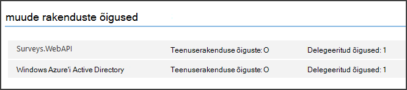

<properties
   pageTitle="Turvaliseks taustväärtus web API rentnikuga rakenduses | Microsoft Azure'i"
   description="Kuidas tagada kirjutamata veebi-API"
   services=""
   documentationCenter="na"
   authors="MikeWasson"
   manager="roshar"
   editor=""
   tags=""/>

<tags
   ms.service="guidance"
   ms.devlang="dotnet"
   ms.topic="article"
   ms.tgt_pltfrm="na"
   ms.workload="na"
   ms.date="06/02/2016"
   ms.author="mwasson"/>

# <a name="securing-a-backend-web-api-in-a-multitenant-application"></a>Turvaliseks taustväärtus web API rentnikuga rakenduses

[AZURE.INCLUDE [pnp-header](../../includes/guidance-pnp-header-include.md)]

See artikkel on [osa sarjast]. Olemas on ka täieliku [valimi rakendus] , mis kaasneb selle sarja.

[Tailspin uuringute] rakendus kasutab taustväärtus veebi-API CRUD toiminguid uuringute haldamine. Näiteks, kui kasutaja klõpsab "Minu küsitluste", saadab veebirakenduse veebi-API HTTP-päring:

```
GET /users/{userId}/surveys
```

Veebi-API tagastab JSON objekti:

```
{
  "Published":[],
  "Own":[
    {"Id":1,"Title":"Survey 1"},
    {"Id":3,"Title":"Survey 3"},
    ],
  "Contribute": [{"Id":8,"Title":"My survey"}]
}
```

Veebi-API ei luba anonüümseid taotlusi, nii, et veebirakenduse peab ise, kasutades OAuthi 2 esitaja sõned autentida.

> [AZURE.NOTE] See on server server stsenaariumi. Rakenduse helistada AJAXI API kliendi brauseri kaudu.

On kaks peamist lähenemisviisi, mida ette võtta.

- Delegeeritud kasutaja identiteet. Veebirakenduse autendib kasutaja identiteet.
- Rakenduse identiteedi. Veebirakenduse autendib OAuth2 kliendi mandaadi meilivoo abil oma kliendi ID-ga.

Rakenduse Tailspin rakendab delegeeritud kasutaja identiteet. Siin on peamised erinevused.

**Delegeeritud kasutaja identiteet**

- Esitaja luba saadetud veebi-API sisaldab kasutaja identiteet.
- Veebi-API muudab kasutaja identiteet autoriseerimine otsuseid.
- Veebirakenduse peab käsitlema 403 (keelatud) viga, veebi-API, kui kasutajal on õigus toimingu sooritamine.
- Tavaliselt veebirakenduse kujundamisega mõned autoriseerimine otsuseid, mis mõjutavad UI, nt kuvada või peita Kasutajaliidese elemendid).
- Veebi-API saab kasutada potentsiaalselt ebausaldusväärsete kliendid, nt JavaScript rakenduse või kohalikke klientrakendusega.

**Rakenduse identiteedi**

- Veebi-API ei saa kasutaja teavet.
- Veebi-API ei saa teha põhineb kasutaja identiteet luba. Veebirakenduse tehakse kõik autoriseerimine otsuseid.  
- Kui ebausaldusväärsete klient (JavaScripti või omakliendi rakenduse) ei saa kasutada veebi-API.
- Seda moodust võib mõnevõrra lihtsam rakendada, kuna ei ole autoriseerimine loogiline Web API.

Kas lähenemine peab veebirakenduse saada juurdepääsu luba, mis on vaja kõne veebi-API mandaat.

- Delegeeritud kasutaja identiteedi jaoks luba on pärit IDP, mida saate probleemi märgiks kasutaja nimel.

- Kliendi mandaat, võib rakenduse toomine selle IDP luba või majutada oma Turbeloa server. (Kuid ei kirjutada Turbeloa serveri nullist; kasutada põhjalikult testitud framework, nt [IdentityServer3].) Kui te autentimiseks Azure AD, on tungivalt soovitatav saada juurdepääsu luba Azure AD, isegi kui tasute kliendi mandaadi kulgemist.

Ülejäänud selles artiklis eeldatakse, et rakendus on Azure AD autentimist.


## <a name="register-the-web-api-in-azure-ad"></a>Veebi-API Azure AD registreerimine

Selleks Azure AD väljaandmisel märgiks esitaja jaoks veebi-API, peate konfigureerima mõned asjad Azure AD.

1. [Web API Azure AD registreerida].

2. Lisada kliendi ID veebirakenduse veebi-API Rakendusmanifest, on `knownClientApplications` atribuut. Vt [rakenduse manifestid värskendada].

3. [Rakenduse web juurdepääsuõiguse veebi-API kõne anda].

  Azure'i haldusportaal määratavad õigused kahte tüüpi: "Teenuserakenduse õiguste" rakenduse identiteedi (klient mandaati vool) või "Delegeeritud õigused" delegeeritud kasutaja identiteedi jaoks.

  

## <a name="getting-an-access-token"></a>Saada juurdepääsu sümboolse

Enne veebi-API, veebirakenduse saab Accessi Turbeloa Azure AD. .NET rakenduses, kasutage [Azure AD autentimiseks teeki (ADAL) .net-i][ADAL].

Rakenduses OAuthi 2 autoriseerimine kood meilivoo rakenduse vahetab autoriseerimine tähist juurdepääsu sümboolse. Järgmine kood kasutab ADAL saada juurdepääsu luba. Järgmine kood nimetatakse ajal kuvatakse `AuthorizationCodeReceived` sündmus.

```csharp
// The OpenID Connect middleware sends this event when it gets the authorization code.   
public override async Task AuthorizationCodeReceived(AuthorizationCodeReceivedContext context)
{
    string authorizationCode = context.ProtocolMessage.Code;
    string authority = "https://login.microsoftonline.com/" + tenantID
    string resourceID = "https://tailspin.onmicrosoft.com/surveys.webapi" // App ID URI
    ClientCredential credential = new ClientCredential(clientId, clientSecret);

    AuthenticationContext authContext = new AuthenticationContext(authority, tokenCache);
    AuthenticationResult authResult = await authContext.AcquireTokenByAuthorizationCodeAsync(
        authorizationCode, new Uri(redirectUri), credential, resourceID);

    // If successful, the token is in authResult.AccessToken
}
```

Siin on erinevate parameetrite, mida on vaja.

- `authority`. Saadud kehtib kasutaja rentniku ID-d. (Pole SaaS pakkuja rentniku ID)  
- `authorizationCode`. mida teil tagasi ka IDP auth kood.
- `clientId`. Veebirakenduse kliendi ID-ga.
- `clientSecret`. Veebirakenduse kliendi salajane.
- `redirectUri`. Ümbersuunamise URI, mida saate seada OpenID ühendada. See on, kui ka IDP helistab tagasi koos luba.
- `resourceID`. Rakenduse ID URI, veebi-API, mille lõite veebi-API registreerimisel Azure AD
- `tokenCache`. Objekti vahemälu Accessi sõned. Vt [sümboolne vahemällu].

Kui `AcquireTokenByAuthorizationCodeAsync` õnnestub, ADAL vahemälu luba. Hiljem saab teile luba vahemälu AcquireTokenSilentAsync helistades:

```csharp
AuthenticationContext authContext = new AuthenticationContext(authority, tokenCache);
var result = await authContext.AcquireTokenSilentAsync(resourceID, credential, new UserIdentifier(userId, UserIdentifierType.UniqueId));
```

kus `userId` on kasutaja objekti ID, mille leiate funktsiooni `http://schemas.microsoft.com/identity/claims/objectidentifier` taotlemine.

## <a name="using-the-access-token-to-call-the-web-api"></a>Luba juurdepääs abil helistamine veebi-API

Kui teil on luba, saatke see autoriseerimine päises HTTP päringuid veebi-API.

```
Authorization: Bearer xxxxxxxxxx
```

Järgmised laiendamine meetod rakendusest uuringute komplekti autoriseerimine päise HTTP-päring, kasutades **HttpClient** klass.

```csharp
public static async Task<HttpResponseMessage> SendRequestWithBearerTokenAsync(this HttpClient httpClient, HttpMethod method, string path, object requestBody, string accessToken, CancellationToken ct)
{
    var request = new HttpRequestMessage(method, path);
    if (requestBody != null)
    {
        var json = JsonConvert.SerializeObject(requestBody, Formatting.None);
        var content = new StringContent(json, Encoding.UTF8, "application/json");
        request.Content = content;
    }

    request.Headers.Authorization = new AuthenticationHeaderValue("Bearer", accessToken);
    request.Headers.Accept.Add(new MediaTypeWithQualityHeaderValue("application/json"));

    var response = await httpClient.SendAsync(request, ct);
    return response;
}
```

> [AZURE.NOTE] Lugege teemat [HttpClientExtensions.cs].

## <a name="authenticating-in-the-web-api"></a>Klõpsake veebi-API autentimine

Veebi-API on autentida esitaja luba. ASP.net-i Core 1.0, saate kasutada [Microsoft.AspNet.Authentication.JwtBearer] [ JwtBearer] paketi. Selle pakett sisaldab vahevara, mis võimaldab saada OpenID Connect esitaja sõned rakendus.

Registreerida soovitud vahevara oma veebi-API `Startup` klassi.

```csharp
app.UseJwtBearerAuthentication(options =>
{
    options.Audience = "[app ID URI]";
    options.Authority = "https://login.microsoftonline.com/common/";
    options.TokenValidationParameters = new TokenValidationParameters
    {
        //Instead of validating against a fixed set of known issuers, we perform custom multi-tenant validation logic
        ValidateIssuer = false,
    };
    options.Events = new SurveysJwtBearerEvents();
});
```

> [AZURE.NOTE] Lugege teemat [Startup.cs].

- **Sihtrühma**. Määra see rakendus ID URL-i veebi-API, mille lõite veebi-API registreerimisel Azure AD.
- **Asutuse**. Rentnikuga rakenduse, määrata `https://login.microsoftonline.com/common/`.
- **TokenValidationParameters**. Rentnikuga rakenduse, **ValidateIssuer** väärtuseks false. Mida tähendab, et kinnitada rakenduse väljaandja.
- **Sündmuste** on klassi, mis tuleneb **JwtBearerEvents**.

### <a name="issuer-validation"></a>Väljaandja valideerimine

Kinnitage **JwtBearerEvents.ValidatedToken** juhul, kui loa väljaandja. "Iss" taotluste saadetakse väljaandja.

Rakenduse küsitlused, veebi-API töötleb [rentniku registreerumise]. Seetõttu seda lihtsalt kontrollib, kas väljaandja on juba rakenduse andmebaasi. Kui ei, see põhjustab erandi, mis põhjustab autentimist.

```csharp
public override async Task ValidatedToken(ValidatedTokenContext context)
{
    var principal = context.AuthenticationTicket.Principal;
    var tenantManager = context.HttpContext.RequestServices.GetService<TenantManager>();
    var userManager = context.HttpContext.RequestServices.GetService<UserManager>();
    var issuerValue = principal.GetIssuerValue();
    var tenant = await tenantManager.FindByIssuerValueAsync(issuerValue);

    if (tenant == null)
    {
        // the caller was not from a trusted issuer - throw to block the authentication flow
        throw new SecurityTokenValidationException();
    }
}
```

> [AZURE.NOTE] Lugege teemat [SurveysJwtBearerEvents.cs].

Samuti saate **ValidatedToken** sündmuse teha [taotluste teisendus]. Pidage meeles, et nõuded on pärit otse Azure AD, nii et kui veebirakenduse mis tahes taotluste teisendused, need ei kajastu esitaja luba veebi-API võtab vastu.

## <a name="authorization"></a>Luba

Üldine arutelu loa, vt [roll ja ressursside autoriseerimine][Authorization]. 

JwtBearer vahevara tegeleb autoriseerimine vastuseid. Näiteks piirata kontrolleril toimingu autenditud kasutajad, kasutage **[Autoriseerin]** atrribute ja määrata **JwtBearerDefaults.AuthenticationScheme** autentimise skeem.

```csharp
[Authorize(ActiveAuthenticationSchemes = JwtBearerDefaults.AuthenticationScheme)]
```

See tagastab 401 olekukoodi, kui kasutajal pole autenditud.

Määrata piirata kontrolleril toimingu authorizaton poliitika, **[Autoriseerin]** atribuut poliitika nimi:

```csharp
[Authorize(Policy = PolicyNames.RequireSurveyCreator)]
```

See tagastab 401 olekukoodi, kui kasutajal pole autenditud ja 403, kui kasutaja on kinnitatud, kuid pole lubatud. Poliitika käivitamisel registreerimine

```csharp
public void ConfigureServices(IServiceCollection services)
{
    services.AddAuthorization(options =>
    {
        options.AddPolicy(PolicyNames.RequireSurveyCreator,
            policy =>
            {
                policy.AddRequirements(new SurveyCreatorRequirement());
                policy.AddAuthenticationSchemes(JwtBearerDefaults.AuthenticationScheme);
            });
    });
}
```

## <a name="next-steps"></a>Järgmised sammud

- Järgmise artiklist selle sarja: [vahemälu Accessi sõned rentnikuga rakenduses][token cache]

<!-- links -->
[ADAL]: https://msdn.microsoft.com/library/azure/jj573266.aspx
[JwtBearer]: https://www.nuget.org/packages/Microsoft.AspNet.Authentication.JwtBearer
[Sarja mittekuuluva]: guidance-multitenant-identity.md
[Tailspin küsitluste]: guidance-multitenant-identity-tailspin.md
[IdentityServer3]: https://github.com/IdentityServer/IdentityServer3
[Veebi-API Azure AD registreerimine]: https://github.com/Azure-Samples/guidance-identity-management-for-multitenant-apps/blob/master/docs/running-the-app.md#register-the-surveys-web-api
[Värskendage rakenduste manifestid]: https://github.com/Azure-Samples/guidance-identity-management-for-multitenant-apps/blob/master/docs/running-the-app.md#update-the-application-manifests
[Rakenduse web juurdepääsuõiguse veebi-API kõne anda]: https://github.com/Azure-Samples/guidance-identity-management-for-multitenant-apps/blob/master/docs/running-the-app.md#give-the-web-app-permissions-to-call-the-web-api
[Turbeloa vahemällu talletamine]: guidance-multitenant-identity-token-cache.md
[HttpClientExtensions.cs]: https://github.com/Azure-Samples/guidance-identity-management-for-multitenant-apps/blob/master/src/Tailspin.Surveys.Common/HttpClientExtensions.cs
[Startup.cs]: https://github.com/Azure-Samples/guidance-identity-management-for-multitenant-apps/blob/master/src/Tailspin.Surveys.WebAPI/Startup.cs
[rentniku registreerumise]: guidance-multitenant-identity-signup.md
[SurveysJwtBearerEvents.cs]: https://github.com/Azure-Samples/guidance-identity-management-for-multitenant-apps/blob/master/src/Tailspin.Surveys.WebAPI/SurveyJwtBearerEvents.cs
[nõuded teisendus]: guidance-multitenant-identity-claims.md#claims-transformations
[Authorization]: guidance-multitenant-identity-authorize.md
[proovi taotluse]: https://github.com/Azure-Samples/guidance-identity-management-for-multitenant-apps
[token cache]: guidance-multitenant-identity-token-cache.md
