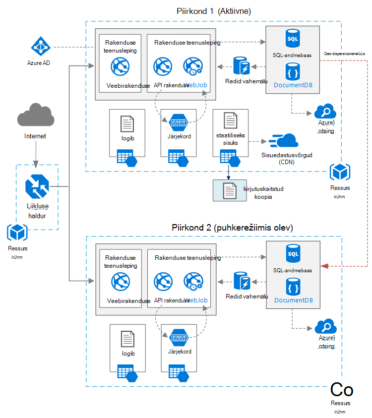

<properties
   pageTitle="Veebirakenduse kõrge kättesaadavus | Azure'i viide arhitektuur | Microsoft Azure'i"
   description="Soovitatav arhitektuur veebirakenduse kõrge kättesaadavus, käitades rakenduses Microsoft Azure'i."
   services="app-service,app-service\web,sql-database" 
   documentationCenter="na"
   authors="MikeWasson"
   manager="roshar"
   editor=""
   tags=""/>

<tags
   ms.service="guidance"
   ms.devlang="na"
   ms.topic="article"
   ms.tgt_pltfrm="na"
   ms.workload="na"
   ms.date="06/27/2016"
   ms.author="mwasson"/>

# <a name="azure-reference-architecture-web-application-with-high-availability"></a>Azure'i viide arhitektuur: veebirakenduse kõrge kättesaadavus

[AZURE.INCLUDE [pnp-RA-branding](../../includes/guidance-pnp-header-include.md)]

Selles artiklis kirjeldatakse soovitatav arhitektuur veebirakenduse kõrge kättesaadavus, Microsoft Azure'i töötab. Arhitektuur põhineb [Azure viide arhitektuur: parandada skaleeritavus veebirakenduse][guidance-web-apps-scalability].

## <a name="architecture-diagram"></a>Arhitektuur skeem



See arhitektuur põhineb üks näidatud [parandamine skaleeritavus veebirakenduse][guidance-web-apps-scalability]. Peamised erinevused on:

- **Põhi- ja regioonid**. See arhitektuur kasutab mõlema piirkonna kõrgemale saavutamiseks. Rakendus on juurutatud iga regioonid. Esmane piirkond suunatakse ajal toiminguid, võrguliiklust. Kuid kui see pole saadaval, liiklus marsruuditakse teisene alale. Üksikasjalikku teavet Tõrkesiirde kohta leiate teemast [haldamine Tõrkesiirde](#managing-failover-and-failback).

- **Azure'i liikluse haldur**. [Liikluse haldur] [ traffic-manager] marsruudib sissetulevad taotlused esmane alale. Kui rakendus töötab piirkonnas pole saadaval, liikluse haldur ei üle teisene piirkond. 

- SQL-andmebaasi ja DocumentDB **Geo-dispersioonanalüüs** .

## <a name="recommendations"></a>Soovitused

### <a name="regional-pairing"></a>Piirkondliku sidumine

Iga Azure'i piirkonna on ühendatud muu piirkonna sama geograafia. Üldiselt valida piirkondade sama piirkondliku paar (nt Ida-USA 2 ja Kesk-USA). Tehes eelised on järgmised.

- Lai katkestuste korral prioriteetne vähemalt ühe piirkonna välja iga paari taastamine.
- Kavandatud Azure süsteemi värskendusi saadetakse välja andmepunktipaaride piirkondadele järjest, võimalike tööseisakute minimeerimiseks.
- Enamikul juhtudel riigis paari elavad sama geograafia, andmete tingimust täita.

Aga veenduge, et mõlemad piirkonnad toetavad kõigi Azure'i teenuste rakenduse jaoks vajalik. Lugege teemat [teenuste regiooniti][services-by-region]. Piirkondliku paari kohta leiate lisateavet teemast [äri järjepidevus ja Avariijärgne taaste (BCDR): Azure'i paaris piirkondade][regional-pairs].

### <a name="resource-groups"></a>Ressursi rühmad

Kaaluma piirkond esmane, teisene piirkond ja liikluse haldur eraldi [Ressursirühma][resource groups]. Selle abil saate hallata iga piirkonna ühe kogumina juurutatud ressursside &mdash; saate neid eraldi juurutada, kustutada juurutamise ja nii edasi. 

### <a name="traffic-manager"></a>Liikluse haldur

**Marsruutimist.** Liikluse haldur toetab mitut [marsruutimise algoritmide][tm-routing]. Selles artiklis kirjeldatud stsenaariumi kasutada _prioriteet_ marsruutimist (varasema nimega _Tõrkesiirde_ marsruutimine). Selle sätte liikluse haldur saadab kõik taotlused esmane piirkond, kui selle piirkonna lõpp-punkti kättesaamatu. Sel hetkel seda automaatselt ei üle teisene piirkond. Vt [Tõrkesiirde konfigureerimine marsruutimise meetod][tm-configure-failover].

**Tervise juures.** Liikluse haldur kasutab mõnda HTTP (või HTTPS) juures, et nende iga lõpp-punkti. Funktsiooni juures annab liikluse haldur pass/fail test probleemse teisene alale. See toimib saatmisega määratud URL-tee. Kui ta saab-200 vastuse ajalõpu jooksul, kuvatakse juures nurjub. Pärast nelja nurjunud taotlusi, liikluse haldur tähistab lõpp-punkti, kuna halvenenud ja jätab üle soovitud lõpp-punkti. Lisateavet leiate teemast [liikluse haldur lõpp-punkti jälgimine ja Tõrkesiirde][tm-monitoring].

Hea tava, seisund juures näitaja, mis aruannete üldist tervist rakenduse loomine ja kasutamine selle lõpp-punkti seisundi juures. Lõpp-punkti kontrollige kriitilised sõltuvused, nt rakenduse rakendused, salvestusruumi kuhjuda ja SQL-andmebaasi. Muul juhul võib selle juures aruande "terve" lõpp-punkti, kui rakenduse kriitiliste osade tegelikult ei suuda. 

Teisalt, ärge kasutage seisundi juures kontrollida alumise teenused. Näiteks kui e-posti teenus läheb alla, saate rakenduse aktiveerige teine pakkuja või saada e-kirju lihtsalt hiljem. Rakendus ilmselt ei tohiks ei õnnestu üle sellisel juhul. Lisateabe saamiseks lugege teemat [Seisund lõpp-punkti jälgimise mustri][health-endpoint-monitoring-pattern].
  
### <a name="sql-database"></a>SQL-andmebaas

Kasutage [Aktiivse Geo-kopeerimine] [ sql-replication] teises regioonis loetav teisese loomiseks. Teil võib olla kuni nelja loetav sekundaaride. Kui teie peamine andmebaasi ei õnnestu, või lihtsalt peab võrguühenduseta, saate Tõrkesiirde ühtegi teisene andmebaasi. Aktiivse Geo-kopeerimine saab konfigureerida iga andmebaasi elastne andmebaasi igal pool.

### <a name="documentdb"></a>DocumentDB

DocumentDB toetab geo-dispersioonanalüüs piirkondade lõikes. Ühe piirkonna on määratud kirjutatav ja teised on kirjutuskaitstud. 

Kui piirkondliku katkestuste, teil ei õnnestu üle, valides mõne muu piirkonna olema kirjutamine piirkond. DocumentDB kliendi SDK saadab automaatselt kirjutamise taotlused kirjutamine praeguse ala, seetõttu ei pea te pärast Tõrkesiirde kliendi konfiguratsiooni värskendamiseks. Lisateabe saamiseks lugege teemat [hajuta andmeid globaalselt DocumentDB][docdb-geo]. 

> [AZURE.NOTE] Kõik kujundusmuudatusi kuuluvad ühte ressursirühma.

### <a name="storage"></a>Salvestusruumi

Azure Storage, kasutage [lugemisõigus – geograafilise liigne salvestusruumi] [ ra-grs] (RA GRS). RA-GRS salvestusruumi, kus andmed on kopeeritud teisene piirkond. Teil on kirjutuskaitstud juurdepääs andmetele teisene piirkonna eraldi lõpp-punkti. Kui on piirkondliku katkestuste või tõttu, võib Azure Storage meeskonnatöö kindlaks teha geo Tõrkesiirde teisene alale. On pole vaja selle Tõrkesiirde kliendi midagi.

Järjekorda Storage, luua varukoopia järjekorda teisene piirkonna. Ajal Tõrkesiirde, saate rakenduse varukoopia järjekorda, kuni esmane piirkond muutub uuesti. Nii rakenduse endiselt protsessi uutele päringutele. 

## <a name="availability-considerations"></a>Kättesaadavus kaalutlused

Mitme piirkonna arhitektuur võib anda suurema kättesaadavuse ühele piirkonnale juurutamine. Kui piirkondliku katkestuste mõjutab esmane piirkond, võib ebaõnnestuda üle teisene alale. See arhitektuur aitab ka siis, kui ka üksikute alasüsteemi rakenduse nurjub.  
     
On mitu üldist lähenemisviisi saavutamiseks kõrge kättesaadavus kogu andmekeskuste:      
- Aktiivne/passiivne kuum puhkerežiimis olev. Liikluse läheb ühe piirkonna, samal ajal ootab puhkerežiimis. Rakendus on juurutatud ja töötab teisene piirkonna. Võite alustada väiksema eksemplari arv teisene andmekeskuse ja mastaapimiseks klõpsake välja, vastavalt vajadusele. 

- Aktiivne/passiivne külma puhkerežiimis olev. Sama, aga rakendus on juurutatud kuni Tõrkesiirde vaja. Seda moodust maksab vähem käivitamiseks, kuid üldiselt on enam tõrke ajal alla. 

- Aktiivne/aktiivne. Mõlemad piirkonnad on aktiivne ja taotlused on laadi nende vahel. Kui üks andmekeskuse pole saadaval, on selle välja pöörde võtta. 

See artikkel keskendub aktiivne/passiivne kuum puhkerežiimis olev, [Azure'i liikluse] halduris koos[ traffic-manager] marsruutimiseks liiklus alale. 

### <a name="traffic-manager"></a>Liikluse haldur

Liikluse haldur jätab automaatselt üle kui esmane regioonis saadaval. Kui liikluse haldur ei üle, pole teatud aja jooksul, kui kliendid ei jõua rakendus, mis võib olla mitu minutit. Kahe mõjutavad kogupikkus:

- Seisund juures peab avastada, et esmane andmekeskuse on muutunud kättesaamatu.

- DNS-serverid peate värskendama vahemällu talletatud DNS-i kirjeid IP-aadressi, mis sõltub DNS-i aeg live (TTL). Vaikimisi TTL on 300 sekundi (5 minutit), kuid saate konfigureerida selle väärtuse liikluse haldur profiili loomisel.

Lisateavet leiate teemast [Kohta liikluse haldur jälgimise][tm-monitoring]. 

Liikluse haldur on võimalik tõrge punkti süsteem. Kui teenus ei, kliendid ei pääse teie taotlus on tööseisakute ajal. Vaadake üle [Liikluse haldur SLA][tm-sla], ja määrata, kas liikluse halduriga eraldi vastab teie ettevõtte kõrge-saadavus. Kui ei, siis võiksite lisada mõne muu liikluse lahendus on failback nimega. Azure'i liikluse haldur teenuse nurjumisel muuta oma CNAME-kirjeid DNS-i muude liikluse halduse teenuse osutamiseks. (Selle juhise käsitsi täita ja rakenduse ei ole saadaval, kuni DNS-i muudatused paljundatakse.) 

### <a name="sql-database"></a>SQL-andmebaas

Taastamine punkti eesmärk (RPO) ja SQL-andmebaasi hinnangulise aeg (ERT) on kirjeldatud [allpool][sql-rpo]. 

### <a name="storage"></a>Salvestusruumi

RA-GRS salvestusruumi pakub püsival, kuid on oluline, et aru saada, mis võib juhtuda on katkestuste ajal. 

- Salvestusruumi katkestuste juhul tekib teatud aja jooksul, kui teil pole kirjutusõiguse andmed. Siiski saate lugeda teisene lõpp-punkti on katkestuste ajal.

- Kui piirkondliku katkestuste või tõttu, mõjutab esmane asukoht ja andmeid ei saa seda taastada, Azure Storage meeskonnatöö kindlaks teha teha geo Tõrkesiirde teisene alale. 

- Andmete kopeerimine teisene regioon on asünkroonselt. Seetõttu, kui toimub geo Tõrkesiirde, mõned andmekao on võimalik, kui andmeid ei saa taastada esmane piirkonnast.

- Siirdamiseks tõrkeid, näiteks võrgu elektrikatkestus, ei Käivita salvestusruumi Tõrkesiirde. Kujundage rakenduse olevat, et siirdamiseks ebaõnnestumist. Võimalikud kergendamise:

    - Teisese lugeda.

    - Ajutiselt aktiveerige teine salvestusruumi konto jaoks uus kirjutada toiminguid (nt järjekorda sõnumitele). 

    - Kopeerige andmed teisese salvestusruumi teisele kontole.

    - Sisestage vähendatud funktsionaalsus kuni süsteem ei tagasi.

Lisateabe saamiseks lugege teemat [mida teha, kui esineb ka Azure Storage katkestuste][storage-outage].

## <a name="managing-failover-and-failback"></a>Tõrkesiirde ja failback haldamine

### <a name="traffic-manager"></a>Liikluse haldur

Liikluse haldur jätab automaatselt üle kui esmane regioonis saadaval. Vaikimisi see automaatselt ka nurjub tagasi, kui esmane piirkond muutub uuesti.

Soovitame siiski käsitsi failback läbimiseks, mitte ei automaatselt uuesti. Enne puudumisel tagasi, veenduge, et kõik rakenduse allsüsteemide on terve. Muul juhul saate luua olukorda, kus rakenduse ümberpööramisel liigub kaasa edasi ja tagasi andmekeskuste vahel. 

Selleks, et automaatne failback, käsitsi vähendage prioriteet Esmane piirkonna pärast Tõrkesiirde sündmus. Oletame näiteks, et esmane regioon on prioriteet 1 ja teisese on prioriteet 2. Pärast Tõrkesiirde, määramine prioriteet 3, vältimaks automaatse failback esmane piirkond. Kui olete valmis uuesti aktiveerimiseks, lähtestamiseks prioriteet 1.

Järgmised käsud Värskenda prioriteet.

**PowerShelli** 

```bat
$endpoint = Get-AzureRmTrafficManagerEndpoint -Name <endpoint> -ProfileName <profile> -ResourceGroupName <resource-group> -Type AzureEndpoints
$endpoint.Priority = 3
Set-AzureRmTrafficManagerEndpoint -TrafficManagerEndpoint $endpoint
```

Lisateabe saamiseks lugege teemat [Azure liikluse Manager cmdlet-käsud][tm-ps].

**Azure'i CLI**

```bat
azure network traffic-manager endpoint set --name <endpoint> --profile-name <profile> --resource-group <resource-group> --type AzureEndpoints --priority 3
```    

### <a name="sql-database"></a>SQL-andmebaas

Kui esmase andmebaasi ei õnnestu, tehke käsitsi Tõrkesiirde teisene andmebaasi. Leiate [Azure'i SQL-andmebaasi- või teisese Tõrkesiirde taastamine][sql-failover]. Enne, kui teil ei õnnestu üle teise andmebaasi jääb kirjutuskaitstud. 


<!-- links -->

[azure-sql-db]: https://azure.microsoft.com/en-us/documentation/services/sql-database/
[docdb-geo]: ../documentdb/documentdb-distribute-data-globally.md
[guidance-web-apps-scalability]: guidance-web-apps-scalability.md
[health-endpoint-monitoring-pattern]: https://msdn.microsoft.com/library/dn589789.aspx
[ra-grs]: ../storage/storage-redundancy.md#read-access-geo-redundant-storage
[regional-pairs]: ../best-practices-availability-paired-regions.md
[resource groups]: ../resource-group-overview.md
[services-by-region]: https://azure.microsoft.com/en-us/regions/#services
[sql-failover]: ../sql-database/sql-database-disaster-recovery.md
[sql-replication]: ../sql-database/sql-database-geo-replication-overview.md
[sql-rpo]: ../sql-database/sql-database-business-continuity.md#sql-database-business-continuity-features
[storage-outage]: ../storage/storage-disaster-recovery-guidance.md
[tm-configure-failover]: ../traffic-manager/traffic-manager-configure-failover-routing-method.md
[tm-monitoring]: ../traffic-manager/traffic-manager-monitoring.md
[tm-ps]: https://msdn.microsoft.com/en-us/library/mt125941.aspx
[tm-routing]: ../traffic-manager/traffic-manager-routing-methods.md
[tm-sla]: https://azure.microsoft.com/en-us/support/legal/sla/traffic-manager/v1_0/
[traffic-manager]: https://azure.microsoft.com/en-us/services/traffic-manager/
