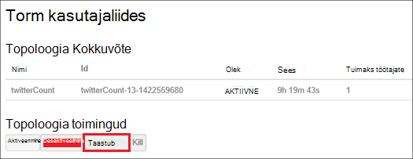

<properties
    pageTitle="Hadoopi kogumite rakenduses .NET SDK Hdinsightiga haldamine | Microsoft Azure'i"
    description="Saate teada, kuidas administraatoritoiminguid Hadoopi rühmad Hdinsightiga Hdinsightiga .NET SDK abil sisse."
    services="hdinsight"
    editor="cgronlun"
    manager="jhubbard"
    tags="azure-portal"
    authors="mumian"
    documentationCenter=""/>

<tags
    ms.service="hdinsight"
    ms.workload="big-data"
    ms.tgt_pltfrm="na"
    ms.devlang="na"
    ms.topic="article"
    ms.date="09/02/2016"
    ms.author="jgao"/>

# Hadoopi kogumite Hdinsightiga sisse, kasutades .NET SDK haldamine

[AZURE.INCLUDE [selector](../../includes/hdinsight-portal-management-selector.md)]

Saate teada, kuidas hallata Hdinsightiga kogumite [HDInsight.NET SDK](https://msdn.microsoft.com/library/mt271028.aspx)abil.

**Eeltingimused**

Enne alustamist selles artiklis, peab teil olema järgmised:

- **An Azure'i tellimus**. Leiate [Azure'i saada tasuta prooviversioon](https://azure.microsoft.com/documentation/videos/get-azure-free-trial-for-testing-hadoop-in-hdinsight/).

##Ühenduse loomine Windows Azure Hdinsightiga

Vajate järgmist Nuget-paketid:

    Install-Package Microsoft.Rest.ClientRuntime.Azure.Authentication -Pre
    Install-Package Microsoft.Azure.Management.ResourceManager -Pre
    Install-Package Microsoft.Azure.Management.HDInsight

Järgmine kood näidis näitab, kuidas ühendada Azure, enne kui saate hallata jaotises tellimuse Azure Hdinsightiga kogumite.

    using System;
    using Microsoft.Azure;
    using Microsoft.Azure.Management.HDInsight;
    using Microsoft.Azure.Management.HDInsight.Models;
    using Microsoft.Azure.Management.ResourceManager;
    using Microsoft.IdentityModel.Clients.ActiveDirectory;
    using Microsoft.Rest;
    using Microsoft.Rest.Azure.Authentication;

    namespace HDInsightManagement
    {
        class Program
        {
            private static HDInsightManagementClient _hdiManagementClient;
            // Replace with your AAD tenant ID if necessary
            private const string TenantId = UserTokenProvider.CommonTenantId; 
            private const string SubscriptionId = "<Your Azure Subscription ID>";
            // This is the GUID for the PowerShell client. Used for interactive logins in this example.
            private const string ClientId = "1950a258-227b-4e31-a9cf-717495945fc2";

            static void Main(string[] args)
            {
                // Authenticate and get a token
                var authToken = Authenticate(TenantId, ClientId, SubscriptionId);
                // Flag subscription for HDInsight, if it isn't already.
                EnableHDInsight(authToken);
                // Get an HDInsight management client
                _hdiManagementClient = new HDInsightManagementClient(authToken);

                // insert code here

                System.Console.WriteLine("Press ENTER to continue");
                System.Console.ReadLine();
            }

            /// 

            /// Authenticate to an Azure subscription and retrieve an authentication token
            /// 

            /// <param name="TenantId">The AAD tenant ID</param>
            /// <param name="ClientId">The AAD client ID</param>
            /// <param name="SubscriptionId">The Azure subscription ID</param>
            /// <returns></returns>
            static TokenCloudCredentials Authenticate(string TenantId, string ClientId, string SubscriptionId)
            {
                var authContext = new AuthenticationContext("https://login.microsoftonline.com/" + TenantId);
                var tokenAuthResult = authContext.AcquireToken("https://management.core.windows.net/", 
                    ClientId, 
                    new Uri("urn:ietf:wg:oauth:2.0:oob"), 
                    PromptBehavior.Always, 
                    UserIdentifier.AnyUser);
                return new TokenCloudCredentials(SubscriptionId, tokenAuthResult.AccessToken);
            }
            /// 

            /// Marks your subscription as one that can use HDInsight, if it has not already been marked as such.
            /// 

            /// <remarks>This is essentially a one-time action; if you have already done something with HDInsight
            /// on your subscription, then this isn't needed at all and will do nothing.</remarks>
            /// <param name="authToken">An authentication token for your Azure subscription</param>
            static void EnableHDInsight(TokenCloudCredentials authToken)
            {
                // Create a client for the Resource manager and set the subscription ID
                var resourceManagementClient = new ResourceManagementClient(new TokenCredentials(authToken.Token));
                resourceManagementClient.SubscriptionId = SubscriptionId;
                // Register the HDInsight provider
                var rpResult = resourceManagementClient.Providers.Register("Microsoft.HDInsight");
            }
        }
    }

Viip peab näete selle programmi käivitamisel.  Kui te ei soovi küsimuse, vt [loomine autentimist mitte-interaktiivne .NET Hdinsightiga rakendused](hdinsight-create-non-interactive-authentication-dotnet-applications.md).

##Kogumite loomine

Vt [loomine Linux-põhine kogumite Hdinsightiga SDK .net-i abil rakenduses](hdinsight-hadoop-create-linux-clusters-dotnet-sdk.md)

##Loendi kogumite

Järgmised koodilõigu loetletud kogumite ja osa atribuute.

    var results = _hdiManagementClient.Clusters.List();
    foreach (var name in results.Clusters) {
        Console.WriteLine("Cluster Name: " + name.Name);
        Console.WriteLine("\t Cluster type: " + name.Properties.ClusterDefinition.ClusterType);
        Console.WriteLine("\t Cluster location: " + name.Location);
        Console.WriteLine("\t Cluster version: " + name.Properties.ClusterVersion);
    }

##Kogumite kustutamine

Kustutage klaster sünkroonselt või asünkroonselt järgmised koodilõigu abil. 

    _hdiManagementClient.Clusters.Delete("<Resource Group Name>", "<Cluster Name>");
    _hdiManagementClient.Clusters.DeleteAsync("<Resource Group Name>", "<Cluster Name>");
            
##Kogumite skaala
Funktsioon skaleerimist klaster võimaldab töötaja sõlmed kobar, kus töötab Windows Azure Hdinsightiga ilma uuesti luua klaster kasutatavat arvu muutmine.

>[AZURE.NOTE] Ainult koos Hdinsightiga versiooni 3.1.3 kogumite või suurem on toetatud. Kui te pole kindel, klaster versiooni, saate lehe atribuudid.  Vaadake [loendi ja Kuva kogumite](hdinsight-administer-use-portal-linux.md#list-and-show-clusters).

Muudatuste mõju andmete sõlmed iga tüüpi kobar ei toeta Hdinsightiga arv:

- Hadoopi

    Saate suurendada sujuvalt töötaja sõlmed Hadoopi klaster, mis töötab ilma mõjutavad ootel või esitatava töökohtade arvu. Uute töökohtade esitada ka toimingu ajal. Tõrked skaleerimise toiming käsitletakse nõtkelt nii, et klaster on alati otstarbekas olekus vasakule.

    Kui Hadoopi kobar võetakse vähendades andmete sõlmed arvu, teatud teenuste klaster taaskäivitada. Ebaõnnestuda skaleerimise toimingu sooritamist põhjustab kõik töötab ja ootel tööd. Olete, saate siiski uuesti tööd pärast selle toimingu lõpuleviimist.

- HBase

    Sujuv saate lisada või eemaldada sõlmed klaster HBase, kui see töötab. Piirkondliku serverid on automaatselt tasakaalustatud skaleerimise toimingu lõpuleviimiseks mõne minuti jooksul. Siiski saate ka käsitsi jääk piirkondliku serverid headnode klaster sisse logida ja käivitades järgmised käsud käsuviiba aken:

        >pushd %HBASE_HOME%\bin
        >hbase shell
        >balancer

- Torm

    Sujuv saate lisada või eemaldada andmete sõlmed klaster Storm, töötamise ajal. Kuid pärast installimise lõpulejõudmist skaleerimise toimingu, peate taastub topoloogia.

    Ümberkorraldamine suunamist kahel viisil:

    * Torm web UI
    * Käsurea liides (CLI) tööriista

    Vaadake [Apache Storm dokumentatsiooni kohta](http://storm.apache.org/documentation/Understanding-the-parallelism-of-a-Storm-topology.html) lisateavet.

    Torm web UI on saadaval Hdinsightiga klaster:

    

    Siin on näide CLI käsu taastub Storm topoloogia:

        ## Reconfigure the topology "mytopology" to use 5 worker processes,
        ## the spout "blue-spout" to use 3 executors, and
        ## the bolt "yellow-bolt" to use 10 executors

        $ storm rebalance mytopology -n 5 -e blue-spout=3 -e yellow-bolt=10

Järgmised koodilõigu kuvatud suuruse muutmise klaster sünkroonselt või asünkroonselt.

    _hdiManagementClient.Clusters.Resize("<Resource Group Name>", "<Cluster Name>", <New Size>);   
    _hdiManagementClient.Clusters.ResizeAsync("<Resource Group Name>", "<Cluster Name>", <New Size>);   
    

##Anda/Tühista juurdepääs

Hdinsightiga kogumite kuuluvad järgmised HTTP web services (kõik need teenused on rahulik lõpp-punktid).

- ODBC
- JDBC
- Ambari
- Oozie
- Templeton

Vaikimisi on nende teenuste juurdepääsu anda. Te saate Tühista/anda juurdepääs. Kui soovite tühistada:

    var httpParams = new HttpSettingsParameters
    {
        HttpUserEnabled = false,
        HttpUsername = "admin",
        HttpPassword = "*******",
    };
    _hdiManagementClient.Clusters.ConfigureHttpSettings("<Resource Group Name>, <Cluster Name>, httpParams);

Anda:

    var httpParams = new HttpSettingsParameters
    {
        HttpUserEnabled = enable,
        HttpUsername = "admin",
        HttpPassword = "*******",
    };
    _hdiManagementClient.Clusters.ConfigureHttpSettings("<Resource Group Name>, <Cluster Name>, httpParams);

>[AZURE.NOTE] Andmisel/tühistada juurdepääsu, lähtestab kobar kasutajanimi ja parool.

Seda saab teha portaali kaudu. Teemast [Azure portaali kaudu hallata Hdinsightiga][hdinsight-admin-portal].

##HTTP kasutajatunnust värskendamine

See on sama toimingut, mis [anda/Tühista HTTP juurdepääs](#grant/revoke-access). Kui klaster on antud juurdepääs HTTP, peate selle esmalt tühistada.  Ja seejärel andke juurdepääs koos uue HTTP kasutajatunnust.

##Salvestusruumi vaikekonto otsimine

Järgmised koodilõigu näitab, kuidas on vaikimisi salvestusruumikonto nimi ja vaikimisi salvestusruumi konto võti klaster.

    var results = _hdiManagementClient.Clusters.GetClusterConfigurations(<Resource Group Name>, <Cluster Name>, "core-site");
    foreach (var key in results.Configuration.Keys)
    {
        Console.WriteLine(String.Format("{0} => {1}", key, results.Configuration[key]));
    }

##Esitage tööde haldamine

**Esitada MapReduce tööde haldamine**

Lugege teemat [Hdinsightiga käivitada Hadoopi MapReduce proovi](hdinsight-hadoop-run-samples-linux.md).

**Esitada taru tööde haldamine** 

Lugege teemat [kasutades .NET SDK käivitada taru päringuid](hdinsight-hadoop-use-hive-dotnet-sdk.md).

**Esitada siga tööde haldamine**

[Käivitage siga projektide kasutades .NET SDK](hdinsight-hadoop-use-pig-dotnet-sdk.md)kuvamiseks.

**Esitada Sqoop tööde haldamine**

Lugege teemat [kasutamine Sqoop Hdinsightiga abil](hdinsight-hadoop-use-sqoop-dotnet-sdk.md).

**Esitada Oozie tööde haldamine**

Lugege teemat [Kasutamine Oozie koos Hadoopi määratlemine ja Hdinsightiga töövoo käivitada](hdinsight-use-oozie-linux-mac.md).

##Laadi andmed Azure'i bloobimälu
Vt [üles laadida Hdinsightiga andmeid][hdinsight-upload-data].

## Vt ka
* [Hdinsightiga .NET SDK dokumentides](https://msdn.microsoft.com/library/mt271028.aspx)
* [Azure'i portaal abil Hdinsightiga haldamine][hdinsight-admin-portal]
* [Käsurea liidest kasutades Hdinsightiga haldamine][hdinsight-admin-cli]
* [Hdinsightiga kogumite loomine][hdinsight-provision]
* [Laadi andmed Hdinsightiga][hdinsight-upload-data]
* [Alustamine Windows Azure Hdinsightiga][hdinsight-get-started]

[azure-purchase-options]: http://azure.microsoft.com/pricing/purchase-options/
[azure-member-offers]: http://azure.microsoft.com/pricing/member-offers/
[azure-free-trial]: http://azure.microsoft.com/pricing/free-trial/

[hdinsight-get-started]: hdinsight-hadoop-linux-tutorial-get-started.md
[hdinsight-provision]: hdinsight-provision-clusters.md
[hdinsight-provision-custom-options]: hdinsight-provision-clusters.md#configuration
[hdinsight-submit-jobs]: hdinsight-submit-hadoop-jobs-programmatically.md

[hdinsight-admin-cli]: hdinsight-administer-use-command-line.md
[hdinsight-admin-portal]: hdinsight-administer-use-portal-linux.md
[hdinsight-storage]: hdinsight-hadoop-use-blob-storage.md
[hdinsight-use-hive]: hdinsight-use-hive.md
[hdinsight-use-mapreduce]: hdinsight-use-mapreduce.md
[hdinsight-upload-data]: hdinsight-upload-data.md
[hdinsight-flight]: hdinsight-analyze-flight-delay-data.md

