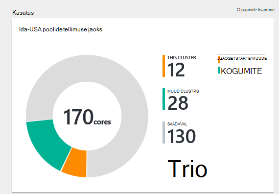

<properties
    pageTitle="Hadoopi kogumite sisse portaalis Azure Hdinsightiga haldamine | Microsoft Azure'i"
    description="Saate teada, kuidas hallata Hdinsightiga teenus. Luua ka Hdinsightiga kobar, avage interaktiivne JavaScripti konsooli ja avage Hadoopi käsk konsooli."
    services="hdinsight"
    documentationCenter=""
    tags="azure-portal"
    authors="mumian"
    manager="jhubbard"
    editor="cgronlun"/>

<tags
    ms.service="hdinsight"
    ms.workload="big-data"
    ms.tgt_pltfrm="na"
    ms.devlang="na"
    ms.topic="article"
    ms.date="09/14/2016"
    ms.author="jgao"/>

# Hadoopi kogumite rakenduses Hdinsightiga abil Azure portaali haldamine

[AZURE.INCLUDE [selector](../../includes/hdinsight-portal-management-selector.md)]

[Azure'i portaalis][azure-portal], saate loomine Hadoopi kogumite Windows Azure Hdinsightiga, Hadoop kasutaja parooli muutmine ja lubada Kaugtöölaua protokolli (RDP), et pääseksite Hadoopi käsk konsooli klaster.

Selle artikli teave kehtib ainult aken vastavalt Hdinsightiga kogumite. Linux-põhine kogumite haldamise kohta lisateabe saamiseks klõpsake ülaltoodud.

Klõpsake teavet loomine Hadoopi kogumite Hdinsightiga muude tööriistade abil. 

**Eeltingimused**

Enne alustamist selles artiklis, peab teil olema järgmised:

- **An Azure'i tellimus**. Leiate [Azure'i saada tasuta prooviversioon](https://azure.microsoft.com/documentation/videos/get-azure-free-trial-for-testing-hadoop-in-hdinsight/).
- **Azure Storage konto** - An Hdinsightiga kobar kasutab mõnda Azure'i bloobimälu salvestusruumi container failisüsteemi. Kuidas Azure'i bloobimälu pakub tõrgeteta koos Hdinsightiga kogumite kohta leiate lisateavet teemast [Kasutamine Azure'i bloobimälu Hdinsightiga](hdinsight-hadoop-use-blob-storage.md). Lisateavet Azure Storage konto loomise kohta leiate teemast [salvestusruumi konto loomine](../storage/storage-create-storage-account.md).

##Avage portaal

1. Logige sisse [https://portal.azure.com](https://portal.azure.com).
2. Kui portaalis on avatud, saate teha järgmist.

    - Klõpsake vasakul menüüs uus klaster loomiseks **Uus** .
    
        
    - Klõpsake vasakpoolses menüüs **Hdinsightiga kogumite** .
    
        

    Kui **Hdinsightiga** vasakpoolses menüüs ei kuvata, klõpsake nuppu **Sirvi**. 

    

##Kogumite loomine

Loomise portaalis, leiate artiklist [loomine Hdinsightiga kogumite](hdinsight-provision-clusters.md#create-using-the-preview-portal).

Hdinsightiga töötab, Hadoop komponendid. Komponendid, mis on kinnitatud ja toetatud loendit vt [millist versiooni Hadoopi on Windows Azure Hdinsightiga](hdinsight-component-versioning.md). Saate kohandada Hdinsightiga, kasutades ühte järgmistest suvanditest:

- Skripti toimingu abil saate käivitada kohandatud skriptid, mida saate kohandada klaster kobar konfiguratsiooni muutmine või kohandatud komponendid, nt Giraph või Solri installida. Lisateabe saamiseks vt [kohandamine Hdinsightiga kobar skripti toimingu abil](hdinsight-hadoop-customize-cluster.md).
- Kasutage kobar kohandamine parameetrid Hdinsightiga .NET SDK või Azure PowerShelli kobar loomise ajal. Nende konfiguratsioonimuudatuste klaster ning seejärel säilitada ja ei mõjuta kobar sõlm reimages, mis Azure'i platvormi teeb perioodiliselt hooldustööd. Kobar kohandamine parameetrite kasutamise kohta leiate lisateavet teemast [loomine Hdinsightiga kogumite](hdinsight-provision-clusters.md).
- Mõned kohalikke Java komponendid, nt Mahout ja Cascading, saab käitada klaster JAR failidena. Need JAR failid saate jaotatud Azure'i bloobimälu ja esitada Hdinsightiga kogumite Hadoopi töö esitamise menetlustele kaudu. Lisateabe saamiseks lugege teemat [esitada Hadoopi töö programmiliselt](hdinsight-submit-hadoop-jobs-programmatically.md).

    >[AZURE.NOTE] Kui teil on probleeme juurutamist JAR failid Hdinsightiga kogumite või helistades JAR failid Hdinsightiga kogumite, pöörduge [Microsofti toe poole](https://azure.microsoft.com/support/options/).

    > Kuhjuvate ei toeta Hdinsightiga ja Microsoft Support ei. Loendite toetatud komponendid, lugege teemat [mis on uut esitatud Hdinsightiga kobar versioonides?](hdinsight-component-versioning.md).

Kohandatud tarkvara abil kaugtöölaua ühendus klaster install ei toetata. Vältige pea sõlme kaudu mis tahes failide salvestamise nagu nad lähevad kaotsi, kui teil on vaja uuesti luua rühmad. Soovitame Azure'i bloobimälu failide salvestamine. Bloobimälu on püsiv.

##Loendi- ja Kuva kogumite

1. Logige sisse [https://portal.azure.com](https://portal.azure.com).
2. Klõpsake vasakpoolses menüüs **Hdinsightiga kogumite** .
3. Klõpsake kobar nime. Kui kobar loend on pikk, saate kasutada filtrit lehe ülaosas.
4. Topeltklõpsake klaster loendis Kuva üksikasjad.

    **Menüüde ja Essentialsi**.

    
    
    - Menüü kohandamine, paremklõpsake suvalist menüü ja seejärel klõpsake nuppu **Kohanda**.
    - **Sätted** ja **Kõik sätted**: kuvatakse **sätted** höövlitera kobar, mis võimaldab kasutada üksikasjalik konfiguratsiooniteavet klaster.
    - **Armatuurlaua**, **Kobar armatuurlaua** ja **URL: need kõik võimalused kobar armatuurlaud, mis on Ambari Web kogumite Linux-põhine. - **Secure Shell **: kuvatakse juhiseid ühendamiseks klaster Secure Shell (SSH) ühenduse kaudu.
    - **Skaala kobar**: võimaldab teil muuta töötaja sõlmed see arv.
    - **Kustuta**: kustutab klaster.
    - **Kiirjuhend ()**: kuvatakse teave, mis aitavad teil Hdinsightiga kasutamise alustamine.
    - **Kasutajate ()**: võimaldab teil määrata teiste kasutajate õiguste _portaali haldus_ , see Azure tellimuse.
    
        > [AZURE.IMPORTANT] See _ainult_ mõjutab juurdepääsu ja selle kobar Azure'i portaalis õigused ja kes saab ühenduse või edastab Hdinsightiga kobar tööd ei mõjuta.
    - **Silte ()**: Sildid saate seada määratleda kohandatud taksonoomia oma pilveteenuste /-väärtuse paarideks. Näiteks võib luua nimega __projekti__klahvi ja seejärel kasutage kõigi teenuste teatud projektiga seotud ühise väärtuse.
    - **Ambari vaated**: Ambari Web linke.
    
    > [AZURE.IMPORTANT] Teenuste Hdinsightiga klaster juhtida peate kasutama Ambari veebis või Ambari REST API-ga. Ambari kasutamise kohta leiate lisateavet teemast [haldamine Hdinsightiga kogumite Ambari abil](hdinsight-hadoop-manage-ambari.md).

    **Kasutus**:
    
    
    
5. Klõpsake nuppu **sätted**.

    

    - **Atribuudid**: kobar atribuutide vaatamiseks.
    - **Kobar AAD identiteedi**: 
    - **Azure'i salvestusruumi klahvid**: vaikekonto salvestusruum ja selle klahvi kuvamine. Salvestusruumi konto on konfigureerimise käigus kobar loomine.
    - **Kobar Login**: kobar HTTP kasutajanime ja parooli muutmine.
    - **Välise Metastores**: taru ja Oozie metastores vaadata. Selle metastores saab konfigureerida ainult kobar loomisprotsessi ajal.
    - **Skaala kobar**: suurendamine ja vähendamine kobar töötaja sõlmed arv.
    - **Kaugtöölaua**: lubamine ja keelamine (RDP) kaugtöölaua juurdepääsu konfigureerimine RDP kasutajanimi.  RDP kasutaja nimi peab olema kasutajanimi HTTP erinev.
    - **Kirjepartneri**:
    
    > [AZURE.NOTE] See on üldise loendi saadaolevad sätted; Kõik need ei ole Esita kobar kõigi jaoks.

6. Klõpsake nuppu **Atribuudid**:

    Atribuutide loendid, mis on järgmine:
    
    - **Hostname (hostinimi)**: kobar nimi.
    - **Kobar URL-i**.
    - **Olek**: kaasata katkestatud vastu, ClusterStorageProvisioned, AzureVMConfiguration, HDInsightConfiguration funktsionaalseid, töötab, viga, kustutamine, kustutada, semaforile, DeleteQueued, DeleteTimedout, DeleteError, PatchQueued, CertRolloverQueued, ResizeQueued, ClusterCustomization
    - **Piirkond**: Azure'i asukoht. Toetatud Azure asukohtade loendit, vt **piirkond** ripploendiboksi [Hdinsightiga](https://azure.microsoft.com/pricing/details/hdinsight/)hinda.
    - **Andmete loodud**.
    - **Operatsioonisüsteem**: kas **Windows** või **Linux**.
    - **Tüüp**: Hadoopi, HBase, Storm, säde. 
    - **Versiooni**. Vaadake teemat [Hdinsightiga versioonid](hdinsight-component-versioning.md)
    - **Tellimus**: tellimuse nime.
    - **Tellimuse ID**.
    - **Esmane andmeallikas**. Azure'i bloobimälu salvestusruumi konto kasutatakse vaikimisi Hadoopi failisüsteemis.
    - **Töötaja sõlmed hinnad taseme**.
    - **Juhi sõlm hinnakirjad taseme**.

##Kogumite kustutamine

Kustuta klaster ei kustutata salvestusruumi vaikekonto või mis tahes lingitud salvestusruumi kontod. Sama salvestusruumi kontod ja sama metastores abil saate luua uuesti klaster.

1. Logige sisse [portaali][azure-portal].
2. Klõpsake nuppu **Sirvi kõik** vasakult menüüst, klõpsake **Hdinsightiga kogumite**, klõpsake oma nime kobar.
3. Klõpsake nuppu **Kustuta** ülalt menüüst, ja seejärel järgige juhiseid.

Vt ka [paus/kogumite Sule](#pauseshut-down-clusters).

##Kogumite skaala
Funktsioon skaleerimist klaster võimaldab töötaja sõlmed kobar, kus töötab Windows Azure Hdinsightiga ilma uuesti luua klaster kasutatavat arvu muutmine.

>[AZURE.NOTE] Ainult koos Hdinsightiga version 3.1.3 kogumite või suurem on toetatud. Kui te pole kindel, klaster versiooni, saate lehe atribuudid.  Vaadake [loendi ja Kuva kogumite](#list-and-show-clusters).

Muudatuste mõju andmete sõlmed iga tüüpi kobar ei toeta Hdinsightiga arv:

- Hadoopi

    Saate suurendada sujuvalt töötaja sõlmed Hadoopi klaster, mis töötab ilma mõjutavad ootel või esitatava töökohtade arvu. Uute töökohtade esitada ka toimingu ajal. Tõrked skaleerimise toiming käsitletakse nõtkelt nii, et klaster on alati otstarbekas olekus vasakule.

    Kui Hadoopi kobar võetakse vähendades andmete sõlmed arvu, teatud teenuste klaster taaskäivitada. Ebaõnnestuda skaleerimise toimingu sooritamist põhjustab kõik töötab ja ootel tööd. Pärast selle toimingu lõpuleviimist, saate, tööde siiski uuesti.

- HBase

    Sujuv saate lisada või eemaldada sõlmed klaster HBase, kui see töötab. Piirkondliku serverid on automaatselt tasakaalustatud skaleerimise toimingu lõpuleviimiseks mõne minuti jooksul. Siiski saate ka käsitsi jääk piirkondliku serverid headnode klaster sisse logida ja käivitades järgmised käsud käsuviiba aken:

        >pushd %HBASE_HOME%\bin
        >hbase shell
        >balancer

    HBase shell kasutamise kohta leiate lisateavet teemast]
- Torm

    Sujuv saate lisada või eemaldada andmete sõlmed klaster Storm, töötamise ajal. Kuid pärast installimise lõpulejõudmist skaleerimise toimingu, peate taastub topoloogia.

    Ümberkorraldamine suunamist kahel viisil:

    * Torm web UI
    * Käsurea liides (CLI) tööriista

    Vaadake [Apache Storm dokumentatsiooni kohta](http://storm.apache.org/documentation/Understanding-the-parallelism-of-a-Storm-topology.html) lisateavet.

    Torm web UI on saadaval Hdinsightiga klaster:

    

    Siin on näide CLI käsu taastub Storm topoloogia:

        ## Reconfigure the topology "mytopology" to use 5 worker processes,
        ## the spout "blue-spout" to use 3 executors, and
        ## the bolt "yellow-bolt" to use 10 executors

        $ storm rebalance mytopology -n 5 -e blue-spout=3 -e yellow-bolt=10

**Kogumite skaala**

1. Logige sisse [portaali][azure-portal].
2. Klõpsake nuppu **Sirvi kõik** vasakult menüüst, klõpsake **Hdinsightiga kogumite**, klõpsake oma nime kobar.
3. Valige ülalt menüüst **sätted** ja klõpsake **Skaala kobar**.
4. Sisestage **Number, töötaja sõlmed**. Kobar sõlm piirang erinev Azure'i tellimused. Võite pöörduda arveldustega seotud toe suurendamiseks limiit.  Arvu sõlmed tehtud muudatused kajastuvad teabes.

    

##Kogumite paus/Sule

Hadoopi tööd on paketi tööd, mis on ainult parandusfunktsiooni aeg-ajalt. Enamik Hadoopi kogumite, on suur aja jooksul, mis ei kasutata klaster töötlemiseks. Hdinsightiga, kus teie andmed on salvestatud Azure Storage, nii, et saate turvaline kustutada klaster, kui seda ei kasuta.
Saate ka ostmisega on Hdinsightiga kobar isegi siis, kui seda ei kasuta. Kuna kulude klaster jaoks on mitu korda rohkem mäluruumi kui, on mõistlik economic kustutamiseks kogumite, kui nad ei kasuta.

On palju võimalusi, saate programmi protsessi:

- Kasutaja Azure'i andmed Factory. Teemast [Azure Hdinsightiga lingitud teenuse](../data-factory/data-factory-compute-linked-services.md) ja [transformatsioon ja analüüsida abil Azure'i andmed Factory](../data-factory/data-factory-data-transformation-activities.md) nõudmisel ja määratud Hdinsightiga lingitud teenuste jaoks.
- Azure'i PowerShelli kasutamine.  Vt [analüüsi lennuandmetega viivitust](hdinsight-analyze-flight-delay-data.md).
- Kasutage Azure CLI. Leiate [Azure'i CLI abil hallata Hdinsightiga kogumite](hdinsight-administer-use-command-line.md).
- Kasutage Hdinsightiga .NET SDK. [Esitage Hadoopi projektide](hdinsight-submit-hadoop-jobs-programmatically.md)kuvamiseks.

Hinnakirjad leiate artiklist [Hdinsightiga hinnad](https://azure.microsoft.com/pricing/details/hdinsight/). Kustutada klaster portaali, lugege teemat [kogumite kustutamine](#delete-clusters)

##Kasutajanime muutmine kobar

Mõne Hdinsightiga kobar võib olla kaks Kasutajakontod. Hdinsightiga kobar kasutajakonto on loodud loomisprotsessi ajal. Saate luua ka juurdepääsuks klaster kaudu RDP RDP-kasutajakonto. Vt [Luba kaugtöölaud](#connect-to-hdinsight-clusters-by-using-rdp).

**Hdinsightiga kobar kasutajanime ja parooli muutmine**

1. Logige sisse [portaali][azure-portal].
2. Klõpsake nuppu **Sirvi kõik** vasakult menüüst, klõpsake **Hdinsightiga kogumite**, klõpsake oma nime kobar.
3. Valige ülalt menüüst **sätted** ja klõpsake **Kobar Logi sisse**.
4. Kui **kobar login** on lubatud, peate nuppu **Keela**, ja seejärel käsku **Luba** enne kui saate muuta oma kasutajanime ja parooliga.
4. Muutke **Kobar kasutajanimi** ja/või **Kobar sisselogimise parool**ja klõpsake siis nuppu **Salvesta**.

    

##Anda/Tühista juurdepääs

Hdinsightiga kogumite kuuluvad järgmised HTTP web services (kõik need teenused on rahulik lõpp-punktid).

- ODBC
- JDBC
- Ambari
- Oozie
- Templeton

Vaikimisi on nende teenuste juurdepääsu anda. Te saate Tühista/anda juurdepääs Azure'i portaalis.

>[AZURE.NOTE] Andmisel/tühistada juurdepääsu, lähtestab kobar kasutajanimi ja parool.

**Et anda/Tühista HTTP services veebipääs**

1. Logige sisse [portaali][azure-portal].
2. Klõpsake nuppu **Sirvi kõik** vasakult menüüst, klõpsake **Hdinsightiga kogumite**, klõpsake oma nime kobar.
3. Valige ülalt menüüst **sätted** ja klõpsake **Kobar Logi sisse**.
4. Kui **kobar login** on lubatud, peate nuppu **Keela**, ja seejärel käsku **Luba** enne kui saate muuta oma kasutajanime ja parooliga.
6. **Kobar sisselogimise kasutajanimi** ja **Kobar sisselogimise parool**, sisestage uus kasutajanimi ja parool (vastavalt) klaster.
7. Klõpsake nuppu **Salvesta**.

    

##Salvestusruumi vaikekonto otsimine

Iga Hdinsightiga kobar on vaikimisi salvestusruumi konto. Jaotises **sätted**kuvatakse vaikekonto salvestusruum ja selle klahvid klaster/**Atribuudid**/**Azure salvestusruumi võtmed**. Vaadake [loendi ja Kuva kogumite](#list-and-show-clusters).

    
##Ressursirühma otsimine 

Azure'i ressursihaldur režiimis, luuakse iga Hdinsightiga kobar Azure ressursi rühmaga. Azure'i ressursirühma klaster kuuluva kuvatakse:

- Kobar loend sisaldab **Ressursirühma** veergu.
- Kobar **olulised** paani.  

Vaadake [loendi ja Kuva kogumite](#list-and-show-clusters).
   
##Avatud Hdinsightiga päringu konsooli

Konsooli Hdinsightiga päring sisaldab järgmisi funktsioone:

- **Alustamine Galerii**: Galerii kasutamiseks lugege teemat [Azure Hdinsightiga kasutamise alustamine galerii abil saate teada, Hadoop](hdinsight-learn-hadoop-use-sample-gallery.md).
- **Taru Editor**: A graafiliselt web taru töökohtade esitamise.  Artiklist [käivitada taru päringute konsooli päringu abil](hdinsight-hadoop-use-hive-query-console.md).

    

- **Varasem töökogemus**: kuvari Hadoopi tööde haldamine.  

    

    Klõpsake nuppu Kuva üksikasjad, sh töö atribuudid, **Töö päringu** **Päringu nimi** ja ** töö väljund. Samuti saate allalaadimiseks oma töökoha päringu- ja väljund.

- **Faili brauseris**: liikuge vaikekonto salvestusruumi ja lingitud salvestusruumi kontod.

    

    Pildil, et **<Account>** tüüp näitab üksus on Azure storage konto.  Klõpsake konto nime sirvida faile.
    
- **Hadoopi UI**.

    
    
    : **Hadoopi UI*, saate sirvida faile ja märkige ruut logid. 

- **Lõng UI**.

    

##Taru päringute sooritamine

Parandusfunktsiooni taru tööde haldamine portaalis, klõpsake nuppu **Redaktori taru** Hdinsightiga päringu konsooli. Lugege teemat [avatud Hdinsightiga päringu konsooli](#open-hdinsight-query-console).

##Töö jälgimine

Portaalist töö jälgimiseks klõpsake **Ajaloo** Hdinsightiga päringu konsooli. Lugege teemat [avatud Hdinsightiga päringu konsooli](#open-hdinsight-query-console).

##Failide sirvimine

Sirvi salvestatud failid vaikekonto salvestusruumi ja lingitud salvestusruumi kontod, klõpsake **Faili brauseris** Hdinsightiga päringu konsooli. Lugege teemat [avatud Hdinsightiga päringu konsooli](#open-hdinsight-query-console).

Saate **sirvida failisüsteemi** kasuliku **Hadoopi UI** Hdinsightiga konsooli.  Lugege teemat [avatud Hdinsightiga päringu konsooli](#open-hdinsight-query-console).

##Kuvari kobar kasutamine

Jaotise __kasutus__ Hdinsightiga kobar tera kuvab teavet valdkond saadaval tellimuse jaoks Hdinsightiga, samuti valdkond eraldada selle kobar ja kuidas need on eraldatud sõlmed sees see arv. Vaadake [loendi ja Kuva kogumite](#list-and-show-clusters).

> [AZURE.IMPORTANT] Jälgida Hdinsightiga kobar teenuste, peate kasutama Ambari veebis või Ambari REST API-ga. Ambari kasutamise kohta leiate lisateavet teemast [haldamine Hdinsightiga kogumite Ambari abil](hdinsight-hadoop-manage-ambari.md)

##Avage Hadoopi kasutajaliides

Jälgida klaster, failisüsteemi sirvida ja märkige ruut logid, klõpsake **Hadoopi UI** Hdinsightiga päringu konsooli. Lugege teemat [avatud Hdinsightiga päringu konsooli](#open-hdinsight-query-console).

##Avage lõng kasutajaliides

Lõng kasutajaliidese kasutamiseks klõpsake **Lõng UI** Hdinsightiga päringu konsooli. Lugege teemat [avatud Hdinsightiga päringu konsooli](#open-hdinsight-query-console).

##Kogumite abil RDP ühenduse loomine

Kasutatav mandaat esitatud loomisest kobar klaster teenuseid, kuid mitte kobar kaudu kaugtöölaua juurdepääsu anda. Kui olete ette klaster või pärast klaster on ette valmistatud saate lülitada kaugtöölaua juurdepääs. Juhised loomisel kaugtöölaua lubamise kohta leiate teemast [loomine Hdinsightiga kobar](hdinsight-provision-clusters.md).

**Kaugtöölaua lubamiseks**

1. Logige sisse [portaali][azure-portal].
2. Klõpsake nuppu **Sirvi kõik** vasakult menüüst, klõpsake **Hdinsightiga kogumite**, klõpsake oma nime kobar.
3. Valige ülalt menüüst **sätted** ja klõpsake **Kaugtöölaua**.
4. Sisestage **Aegub**, **Remote'i töölaua kasutajanimi** ja **Töölaua parooli**ja seejärel klõpsake nuppu **Luba**.

    

    Vaikeväärtuste aegub kohta on nädal.
> [AZURE.NOTE] Saate Hdinsightiga .NET SDK klaster kaugtöölaua lubamiseks. Kasutage **EnableRdp** meetodit Hdinsightiga kliendi objekti järgmisel viisil: **Klient. EnableRdp (clustername, asukoht, "rdpuser", "rdppassword" DateTime.Now.AddDays(6))**. Samuti klaster kaugtöölaua keelamiseks saate **Klient. DisableRdp (clustername, asukoht)**. Nende meetodite kohta leiate lisateavet teemast [Hdinsightiga .NET SDK viide](http://go.microsoft.com/fwlink/?LinkId=529017). See kehtib ainult Hdinsightiga kogumite, kus töötab Windows.

**Ühenduse arvutikobaras RDP abil**

1. Logige sisse [portaali][azure-portal].
2. Klõpsake nuppu **Sirvi kõik** vasakult menüüst, klõpsake **Hdinsightiga kogumite**, klõpsake oma nime kobar.
3. Valige ülalt menüüst **sätted** ja klõpsake **Kaugtöölaua**.
4. Klõpsake nuppu **Ühenda** ja järgige juhiseid. Kui ühendus on keelata, peate selle esmalt lubama. Veenduge, et kaugtöölaua kasutaja kasutajanime ja parooli abil.  Ei saa kasutada kobar kasutajatunnust.

##Avatud Hadoopi käsurea

Kaugtöölaua ühenduse klaster ja kasutage Hadoopi käsurea, saate peab esmalt on lubatud kaugtöölaua juurdepääsu klaster eelmises jaotises kirjeldatud.

**Käsurea Hadoop avamine**

1. Ühenduse kaugtöölaua kasutamise klaster.
8. Topeltklõpsake töölaual, **Hadoop käsurea**.

    ![HDI. HadoopCommandLine][image-hadoopcommandline]

    Hadoopi käskude kohta leiate lisateavet teemast [Hadoopi käsud viide](http://hadoop.apache.org/docs/current/hadoop-project-dist/hadoop-common/CommandsManual.html).

Eelmise kuvatõmmis kausta nimi on manustatud Hadoopi versiooninumber. Versiooninumbri saate muuta versiooni installitud klaster Hadoopi komponendid. Hadoopi keskkonna muutujate abil saate need kaustad viidata. Näiteks:

    cd %hadoop_home%
    cd %hive_home%
    cd %hbase_home%
    cd %pig_home%
    cd %sqoop_home%
    cd %hcatalog_home%
    
##Järgmised sammud
Selles artiklis on teada, kuidas luua mõne Hdinsightiga kobar portaali kaudu ja Hadoopi käsurea tööriista avamise. Lisateabe saamiseks lugege järgmisi artikleid:

* [Azure'i PowerShelli kaudu Hdinsightiga haldamine](hdinsight-administer-use-powershell.md)
* [Haldamine abil Azure CLI Hdinsightiga](hdinsight-administer-use-command-line.md)
* [Hdinsightiga kogumite loomine](hdinsight-provision-clusters.md)
* [Edastab Hadoopi tööd programmiliselt](hdinsight-submit-hadoop-jobs-programmatically.md)
* [Alustamine Azure Hdinsightiga](hdinsight-hadoop-linux-tutorial-get-started.md)
* [Millist versiooni Hadoopi on Windows Azure Hdinsightiga?](hdinsight-component-versioning.md)

[azure-portal]: https://portal.azure.com
[image-hadoopcommandline]: ./media/hdinsight-administer-use-management-portal/hdinsight-hadoop-command-line.png "Hadoopi käsurea"
