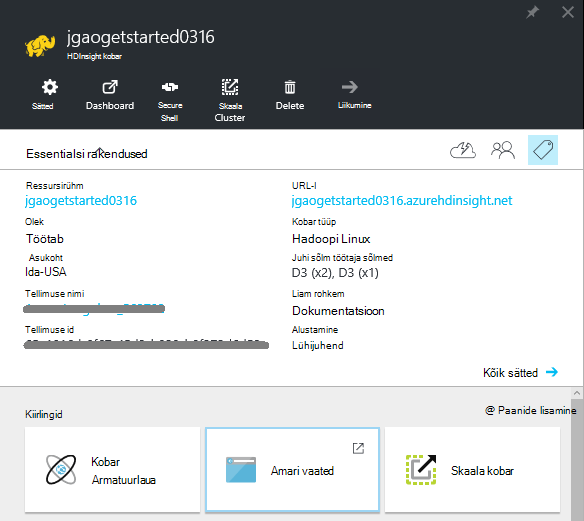
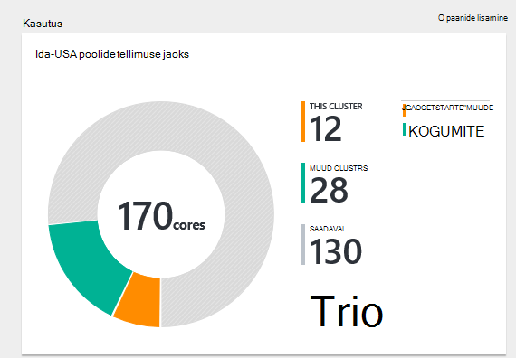
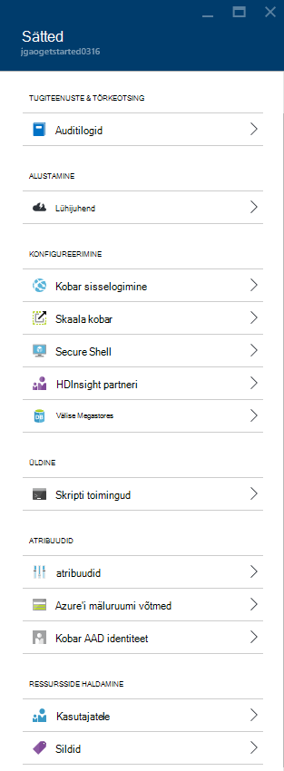
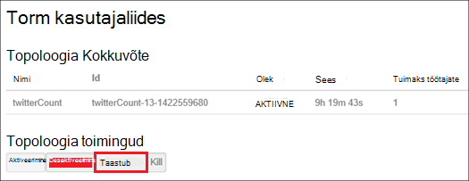
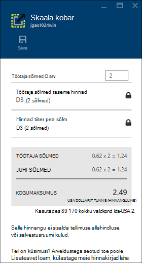
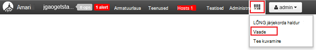

<properties
    pageTitle="Hadoopi Linux-põhine kogumite sisse portaalis Azure Hdinsightiga haldamine | Microsoft Azure'i"
    description="Saate teada, kuidas luua ja hallata Linux-põhine Hdinsightiga kogumite Azure'i portaalis."
    services="hdinsight"
    documentationCenter=""
    authors="mumian"
    manager="jhubbard"
    editor="cgronlun"
    tags="azure-portal"/>

<tags
    ms.service="hdinsight"
    ms.workload="big-data"
    ms.tgt_pltfrm="na"
    ms.devlang="na"
    ms.topic="article"
    ms.date="08/10/2016"
    ms.author="jgao"/>

#Hadoopi kogumite rakenduses Hdinsightiga abil Azure portaali haldamine

[AZURE.INCLUDE [selector](../../includes/hdinsight-portal-management-selector.md)]

[Azure'i portaalis][azure-portal], saate hallata Linux-põhine kogumite Windows Azure Hdinsightiga sisse. Kasutage Vaateselektori menüü teavet loomine Hadoopi kogumite Hdinsightiga muude tööriistade abil. 

**Eeltingimused**

Enne alustamist selles artiklis, peab teil olema järgmised:

- **An Azure'i tellimus**. Leiate [Azure'i saada tasuta prooviversioon](https://azure.microsoft.com/documentation/videos/get-azure-free-trial-for-testing-hadoop-in-hdinsight/).

##Avage portaal

1. Logige sisse [https://portal.azure.com](https://portal.azure.com).
2. Kui portaalis on avatud, saate teha järgmist.

    - Klõpsake vasakul menüüs uus klaster loomiseks **Uus** .
    
        
    - Klõpsake vasakul menüüs loendi olemasoleva rühmad **Hdinsightiga kogumite**
    
        

        Kui **Hdinsightiga** vasakpoolses menüüs ei kuvata, klõpsake nuppu **Sirvi**ja klõpsake **Hdinsightiga kogumite**.

        

##Kogumite loomine

[AZURE.INCLUDE [delete-cluster-warning](../../includes/hdinsight-delete-cluster-warning.md)]

Hdinsightiga töötab, Hadoop komponendid. Komponendid, mis on kinnitatud ja toetatud loendit vt [millist versiooni Hadoopi on Windows Azure Hdinsightiga](hdinsight-component-versioning.md). Üldine kobar loomine leiate teemast [loomine Hadoopi kogumite Hdinsightiga sisse](hdinsight-hadoop-provision-linux-clusters.md). 

##Loendi- ja Kuva kogumite

1. Logige sisse [https://portal.azure.com](https://portal.azure.com).
2. Klõpsake vasakul menüüs loendi olemasoleva rühmad **Hdinsightiga kogumite** .
3. Klõpsake kobar nime. Kui kobar loend on pikk, saate kasutada filtrit lehe ülaosas.
4. Topeltklõpsake klaster loendis Kuva üksikasjad.

    **Menüüde ja Essentialsi**.

    
    
    - **Sätted** ja **Kõik sätted**: kuvatakse **sätted** höövlitera kobar, mis võimaldab kasutada üksikasjalik konfiguratsiooniteavet klaster.
    - **Armatuurlaua**, **Kobar armatuurlaua** ja ** URL: need kõik võimalused kobar armatuurlaud, mis on Ambari Web kogumite Linux-põhine.
    - **Secure Shell**: kuvatakse juhised ühenduse loomiseks klaster Secure Shell (SSH) ühenduse kaudu.
    - **Skaala kobar**: võimaldab teil muuta töötaja sõlmed see arv.
    - **Kustuta**: kustutab klaster.
    - **Kiirjuhend ()**: kuvatakse teave, mis aitavad teil Hdinsightiga kasutamise alustamine.
    - **Kasutajate ()**: võimaldab teil määrata teiste kasutajate õiguste _portaali haldus_ , see Azure tellimuse.
    
        > [AZURE.IMPORTANT] See _ainult_ mõjutab juurdepääsu ja selle kobar Azure'i portaalis õigused ja kes saab ühenduse või edastab Hdinsightiga kobar tööd ei mõjuta.
    - **Silte ()**: Sildid saate seada määratleda kohandatud taksonoomia oma pilveteenuste /-väärtuse paarideks. Näiteks võib luua nimega __projekti__klahvi ja seejärel kasutage kõigi teenuste teatud projektiga seotud ühise väärtuse.
    - **Ambari vaated**: Ambari Web linke.
    
    > [AZURE.IMPORTANT] Teenuste Hdinsightiga klaster juhtida peate kasutama Ambari veebis või Ambari REST API-ga. Ambari kasutamise kohta leiate lisateavet teemast [haldamine Hdinsightiga kogumite Ambari abil](hdinsight-hadoop-manage-ambari.md).

    **Kasutus**:
    
    
    
5. Klõpsake nuppu **sätted**.

    

    - **Auditilogide**:
    - **Kiirjuhend**: kuvatakse teave, mis aitavad teil Hdinsightiga kasutamise alustamine.
    - **Skaala kobar**: suurendamine ja vähendamine kobar töötaja sõlmed arv.
    - **Secure Shell**: kuvatakse juhised ühenduse loomiseks klaster Secure Shell (SSH) ühenduse kaudu.
    - **Hdinsightiga Partner**: praeguse Hdinsightiga partneri lisamine või eemaldamine.
    - **Välise Metastores**: taru ja Oozie metastores vaadata. Selle metastores saab konfigureerida ainult kobar loomisprotsessi ajal.
    - **Skripti toimingud**: Bash käitada skripte klaster.
    - **Atribuudid**: kobar atribuutide vaatamiseks.
    - **Azure'i salvestusruumi klahvid**: vaikekonto salvestusruum ja selle klahvi kuvamine. Salvestusruumi konto on konfigureerimise käigus kobar loomine.
    - **Kobar AAD identiteedi**: 
    - **Kasutajad**: võimaldab teil määrata teiste kasutajate õiguste _portaali haldus_ , see Azure tellimuse.
    - **Sildid**: Sildid saate seada määratleda kohandatud taksonoomia oma pilveteenuste /-väärtuse paarideks. Näiteks võib luua nimega __projekti__klahvi ja seejärel kasutage kõigi teenuste teatud projektiga seotud ühise väärtuse.
    
    > [AZURE.NOTE] See on üldise loendi saadaolevad sätted; Kõik need ei ole Esita kobar kõigi jaoks.

6. Klõpsake nuppu **Atribuudid**:

    Atribuudid on:
    
    - **Hostname (hostinimi)**: kobar nimi.
    - **Kobar URL-i**.
    - **Olek**: kaasata katkestatud vastu, ClusterStorageProvisioned, AzureVMConfiguration, HDInsightConfiguration funktsionaalseid, töötab, viga, kustutamine, kustutada, semaforile, DeleteQueued, DeleteTimedout, DeleteError, PatchQueued, CertRolloverQueued, ResizeQueued, ClusterCustomization
    - **Piirkond**: Azure'i asukoht. Toetatud Azure asukohtade loendit, vt **piirkond** ripploendiboksi [Hdinsightiga](https://azure.microsoft.com/pricing/details/hdinsight/)hinda.
    - **Andmete loodud**.
    - **Operatsioonisüsteem**: kas **Windows** või **Linux**.
    - **Tüüp**: Hadoopi, HBase, Storm, säde. 
    - **Versiooni**. Vaadake teemat [Hdinsightiga versioonid](hdinsight-component-versioning.md)
    - **Tellimus**: tellimuse nime.
    - **Tellimuse ID**.
    - **Vaikimisi andmeallikas**: kobar failisüsteemi.
    - **Töötaja sõlmed hinnad taseme**.
    - **Juhi sõlm hinnakirjad taseme**.

##Kogumite kustutamine

Kustuta klaster ei kustutata salvestusruumi vaikekonto või mis tahes lingitud salvestusruumi kontod. Sama salvestusruumi kontod ja sama metastores abil saate luua uuesti klaster. Soovitatav on kasutada uut vaikimisi bloobimälu container klaster uuesti loomisel.

1. Logige sisse [portaali][azure-portal].
2. Klõpsake nuppu **Sirvi kõik** vasakult menüüst, klõpsake **Hdinsightiga kogumite**, klõpsake oma nime kobar.
3. Klõpsake nuppu **Kustuta** ülalt menüüst, ja seejärel järgige juhiseid.

Vt ka [paus/kogumite Sule](#pauseshut-down-clusters).

##Kogumite skaala
Funktsioon skaleerimist klaster võimaldab töötaja sõlmed kobar, kus töötab Windows Azure Hdinsightiga ilma uuesti luua klaster kasutatavat arvu muutmine.

>[AZURE.NOTE] Ainult koos Hdinsightiga version 3.1.3 kogumite või suurem on toetatud. Kui te pole kindel, klaster versiooni, saate lehe atribuudid.  Vaadake [loendi ja Kuva kogumite](#list-and-show-clusters).

Muudatuste mõju andmete sõlmed iga tüüpi kobar ei toeta Hdinsightiga arv:

- Hadoopi

    Saate suurendada sujuvalt töötaja sõlmed Hadoopi klaster, mis töötab ilma mõjutavad ootel või esitatava töökohtade arvu. Uute töökohtade esitada ka toimingu ajal. Tõrked skaleerimise toiming käsitletakse nõtkelt nii, et klaster on alati otstarbekas olekus vasakule.

    Kui Hadoopi kobar võetakse vähendades andmete sõlmed arvu, teatud teenuste klaster taaskäivitada. Ebaõnnestuda skaleerimise toimingu sooritamist põhjustab kõik töötab ja ootel tööd. Pärast selle toimingu lõpuleviimist, saate, tööde siiski uuesti.

- HBase

    Sujuv saate lisada või eemaldada sõlmed klaster HBase, kui see töötab. Piirkondliku serverid on automaatselt tasakaalustatud skaleerimise toimingu lõpuleviimiseks mõne minuti jooksul. Siiski saate ka käsitsi jääk piirkondliku serverid headnode klaster sisse logida ja käivitades järgmised käsud käsuviiba aken:

        >pushd %HBASE_HOME%\bin
        >hbase shell
        >balancer

    HBase shell kasutamise kohta leiate lisateavet teemast]
- Torm

    Sujuv saate lisada või eemaldada andmete sõlmed klaster Storm, töötamise ajal. Kuid pärast installimise lõpulejõudmist skaleerimise toimingu, peate taastub topoloogia.

    Ümberkorraldamine suunamist kahel viisil:

    * Torm web UI
    * Käsurea liides (CLI) tööriista

    Vaadake [Apache Storm dokumentatsiooni kohta](http://storm.apache.org/documentation/Understanding-the-parallelism-of-a-Storm-topology.html) lisateavet.

    Torm web UI on saadaval Hdinsightiga klaster:

    

    Siin on näide CLI käsu taastub Storm topoloogia:

        ## Reconfigure the topology "mytopology" to use 5 worker processes,
        ## the spout "blue-spout" to use 3 executors, and
        ## the bolt "yellow-bolt" to use 10 executors

        $ storm rebalance mytopology -n 5 -e blue-spout=3 -e yellow-bolt=10

**Kogumite skaala**

1. Logige sisse [portaali][azure-portal].
2. Klõpsake nuppu **Sirvi kõik** vasakult menüüst, klõpsake **Hdinsightiga kogumite**, klõpsake oma nime kobar.
3. Valige ülalt menüüst **sätted** ja klõpsake **Skaala kobar**.
4. Sisestage **Number, töötaja sõlmed**. Kobar sõlm piirang erinev Azure'i tellimused. Võite pöörduda arveldustega seotud toe suurendamiseks limiit.  Arvu sõlmed tehtud muudatused kajastuvad teabes.

    

##Kogumite paus/Sule

Hadoopi tööd on paketi tööd, mis on ainult parandusfunktsiooni aeg-ajalt. Enamik Hadoopi kogumite, on suur aja jooksul, mis ei kasutata klaster töötlemiseks. Hdinsightiga, kus teie andmed on salvestatud Azure Storage, nii, et saate turvaline kustutada klaster, kui seda ei kasuta.
Saate ka ostmisega on Hdinsightiga kobar isegi siis, kui seda ei kasuta. Kuna kulude klaster jaoks on mitu korda rohkem mäluruumi kui, on mõistlik economic kustutamiseks kogumite, kui nad ei kasuta.

On palju võimalusi, saate programmi protsessi:

- Kasutaja Azure'i andmed Factory. Vaadake teemat [loomine tellitavate Linux-põhine Hadoopi le abil Azure'i andmed Factory Hdinsightiga](hdinsight-hadoop-create-linux-clusters-adf.md) loomiseks Hdinsightiga lingitud teenustes.
- Azure'i PowerShelli kasutamine.  Vt [analüüsi lennuandmetega viivitust](hdinsight-analyze-flight-delay-data.md).
- Kasutage Azure CLI. Leiate [Azure'i CLI abil hallata Hdinsightiga kogumite](hdinsight-administer-use-command-line.md).
- Kasutage Hdinsightiga .NET SDK. [Esitage Hadoopi projektide](hdinsight-submit-hadoop-jobs-programmatically.md)kuvamiseks.

Hinnakirjad leiate artiklist [Hdinsightiga hinnad](https://azure.microsoft.com/pricing/details/hdinsight/). Kustutada klaster portaali, lugege teemat [kogumite kustutamine](#delete-clusters)

##Parooli muutmine

Mõne Hdinsightiga kobar võib olla kaks Kasutajakontod. Funktsiooni Hdinsightiga klaster kasutajakonto (alias HTTP kasutajakonto) ja SSH kasutajakonto on loodud loomisprotsessi ajal. Saate Ambari web UI kobar kasutaja konto kasutajanimi ja parool ning skripti toimingute muutmiseks SSH kasutajakonto muutmiseks

###Kobar kasutaja parooli muutmine

Saate Ambari Web UI kobar kasutaja parooli muutmine. Logige sisse Ambari, peate kasutama olemasoleva kobar kasutajanimi ja parool.

> [AZURE.NOTE] Kui muudate parooli kobar kasutaja (haldus), see võib põhjustada skripti toimingud oli see kobar nurjumise suhtes. Kui teil on mis tahes nõutud skripti toimingud, mis puudutavad töötaja sõlmed, need võib nurjuda, kui lisate sõlmed klaster kaudu suuruse toimingud. Skripti toimingute kohta leiate lisateavet teemast [kohandamine Hdinsightiga kogumite skripti toimingute kasutamine](hdinsight-hadoop-customize-cluster-linux.md).

1. Logige sisse Ambari Web UI Hdinsightiga kobar kasutaja mandaadi abil. Vaikimisi kasutajanimi on **administraator**. URL on **https://&lt;Hdinsightiga kobar nimi > azurehdinsight.net**.
2. Valige **administraator** ülalt menüüst, ja klõpsake "Ambari haldamine". 
3. Klõpsake vasakpoolses menüüs **Kasutajad**.
4. Klõpsake linki **administraator**.
5. Klõpsake nuppu **Muuda parooli**.

Seejärel muutub Ambari kõik sõlmed klaster parooli.

###SSH kasutaja parooli muutmine

1. Järgmine tekstiredaktoris kasutamisel __changepassword.sh__nimega failina salvestada.

    > [AZURE.IMPORTANT] Kasutage redaktori, mis kasutab LF rea lõpus. Kui redaktori kasutab CRLF, siis skript ei tööta.
    
        #! /bin/bash
        USER=$1
        PASS=$2

        usermod --password $(echo $PASS | openssl passwd -1 -stdin) $USER

2. Faili üleslaadimine talletuskoht, millele pääseb hdinsightist HTTP- või HTTPS aadressi kasutades. Näiteks avaliku faili salvestada, nt OneDrive või Azure'i bloobimälu salvestusruumi. Kui see on vajalik järgmise juhise salvestada faili URI (HTTP- või HTTPS-i aadress,).

3. Azure'i portaalis valige Hdinsightiga klaster ja seejärel valige __Kõik sätted__. Valige keelest __sätted__ __Skripti toimingud__.

4. Keelest __Skripti toimingud__ valige __Esitada uus__. __Edasta skripti__ tiiviknoad kuvamisel sisestage järgmine teave.

  	| Väli | Väärtus |
  	| ----- | ----- |
  	| Nimi | Ssh parooli muutmine |
  	| Bash skripti URI | URI changepassword.sh fail |
  	| Sõlmed (juht, töötaja, Nimbus, halduri, Zookeeper jne) | ✓ loetletud sõlm kõigi jaoks |
  	| Parameetrid | Sisestage SSH kasutajanimi ja seejärel uus parool. Peaks olema üks tühik kasutajanimi ja parool.
  	| Jää püsima toimingut skripti... | Jätke see väli on märkimata.

5. Valige __Loo__ skripti rakendada. Kui skripti lõpetab, saab ühenduse klaster SSH abil uue parooliga.

##Anda/Tühista juurdepääs

Hdinsightiga kogumite kuuluvad järgmised HTTP web services (kõik need teenused on rahulik lõpp-punktid).

- ODBC
- JDBC
- Ambari
- Oozie
- Templeton

Vaikimisi on nende teenuste juurdepääsu anda. Te saate Tühista/anda juurdepääs [Azure'i CLI](hdinsight-administer-use-command-line.md#enabledisable-http-access-for-a-cluster) ja [Azure PowerShelli](hdinsight-administer-use-powershell.md#grantrevoke-access)abil.

##Tellimuse ID leidmine

**Azure'i Tellimuse ID leidmiseks**

1. Logige sisse [portaali][azure-portal].
2. Klõpsake **Sirvi kõiki** vasakult menüüst ja seejärel klõpsake nuppu **tellimused**. Iga tellimuse on nimi ja ID.

Iga kobar on seotud Azure tellimuse. Tellimuse ID on kuvatud kobar **olulised** paani. Vaadake [loendi ja Kuva kogumite](#list-and-show-clusters).

##Ressursirühma otsimine 

ARM režiimis, luuakse iga Hdinsightiga kobar Azure ressursi rühmaga. Azure'i ressursirühma klaster kuuluva kuvatakse:

- Kobar loend sisaldab **Ressursirühma** veergu.
- Kobar **olulised** paani.  

Vaadake [loendi ja Kuva kogumite](#list-and-show-clusters).

##Salvestusruumi vaikekonto otsimine

Iga Hdinsightiga kobar on vaikimisi salvestusruumi konto. Jaotises **sätted**kuvatakse vaikekonto salvestusruum ja selle klahvid klaster/**Atribuudid**/**Azure salvestusruumi võtmed**. Vaadake [loendi ja Kuva kogumite](#list-and-show-clusters).

##Taru päringute sooritamine

Te ei saa käivitada taru töö otse Azure portaali, kuid saate kasutada Ambari Web UI taru vaade.

**Käivitamiseks taru päringute Ambari taru vaate kasutamine**

1. Logige sisse Ambari Web UI Hdinsightiga kobar kasutaja mandaadi abil. Defaut kasutajanimi on **administraator**. URL on **https://&lt;Hdinsightiga kobar nimi > azurehdinsight.net**.
2. Avage taru vaade, nagu on näidatud järgmine pilt:  

    
3. Klõpsake **päringu** ülalt menüüst.
4. Sisestage päringu taru **Päringuredaktori**ja seejärel klõpsake nuppu **Käivita**.

##Töö jälgimine

Lugege teemat [haldamine Hdinsightiga kogumite Ambari Web Kasutajaliidese abil](hdinsight-hadoop-manage-ambari.md#monitoring).

##Failide sirvimine

Azure'i portaalis saate sirvida vaike-ümbrisest sisu.

1. Logige sisse [https://portal.azure.com](https://portal.azure.com).
2. Klõpsake vasakul menüüs loendi olemasoleva rühmad **Hdinsightiga kogumite** .
3. Klõpsake kobar nime. Kui kobar loend on pikk, saate kasutada filtrit lehe ülaosas.
4. Klõpsake nuppu **sätted**.
5. Tera **sätted** , klõpsake nuppu **Azure'i salvestusruumi klahvid**.
6. Klõpsake soovitud vaikimisi salvestusruumikonto nimi.
7. Klõpsake paani **plekid** .
8. Klõpsake vaikenime ümbrises.

##Kuvari kobar kasutamine

Jaotise __kasutus__ Hdinsightiga kobar tera kuvab teavet valdkond saadaval tellimuse jaoks Hdinsightiga, samuti valdkond eraldada selle kobar ja kuidas need on eraldatud sõlmed sees see arv. Vaadake [loendi ja Kuva kogumite](#list-and-show-clusters).

> [AZURE.IMPORTANT] Jälgida Hdinsightiga kobar teenuste, peate kasutama Ambari veebis või Ambari REST API-ga. Ambari kasutamise kohta leiate lisateavet teemast [haldamine Hdinsightiga kogumite Ambari abil](hdinsight-hadoop-manage-ambari.md)

##Ühenduse loomine mõne kobar

Vaadake [kasutada taru koos Hadoopi rakenduses Hdinsightiga SSH](hdinsight-hadoop-use-hive-ssh.md#ssh).
    
##Järgmised sammud
Selles artiklis on teada, kuidas luua mõne Hdinsightiga kobar portaali kaudu ja Hadoopi käsurea tööriista avamise. Lisateabe saamiseks lugege järgmisi artikleid:

* [Azure'i PowerShelli kaudu Hdinsightiga haldamine](hdinsight-administer-use-powershell.md)
* [Haldamine abil Azure CLI Hdinsightiga](hdinsight-administer-use-command-line.md)
* [Hdinsightiga kogumite loomine](hdinsight-provision-clusters.md)
* [Kasutage taru sisse Hdinsightiga](hdinsight-use-hive.md)
* [Kasutage siga Hdinsightiga](hdinsight-use-pig.md)
* [Kasutage Sqoop Hdinsightiga](hdinsight-use-sqoop.md)
* [Alustamine Azure Hdinsightiga](hdinsight-hadoop-linux-tutorial-get-started.md)
* [Millist versiooni Hadoopi on Windows Azure Hdinsightiga?](hdinsight-component-versioning.md)

[azure-portal]: https://portal.azure.com
[image-hadoopcommandline]: ./media/hdinsight-administer-use-portal-linux/hdinsight-hadoop-command-line.png "Hadoopi käsurea"
