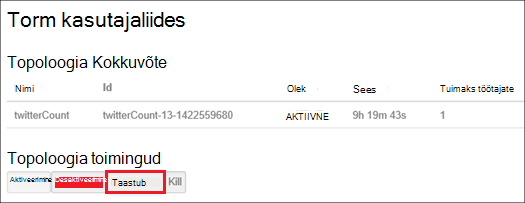

<properties
    pageTitle="Hadoopi kogumite rakenduses Hdinsightiga PowerShelliga haldamine | Microsoft Azure'i"
    description="Saate teada, kuidas administraatoritoiminguid Hadoopi rühmad Hdinsightiga Azure PowerShelli abil sisse."
    services="hdinsight"
    editor="cgronlun"
    manager="jhubbard"
    tags="azure-portal"
    authors="mumian"
    documentationCenter=""/>

<tags
    ms.service="hdinsight"
    ms.workload="big-data"
    ms.tgt_pltfrm="na"
    ms.devlang="na"
    ms.topic="article"
    ms.date="08/10/2016"
    ms.author="jgao"/>

# Hadoopi kogumite rakenduses Hdinsightiga haldamine Azure PowerShelli abil

[AZURE.INCLUDE [selector](../../includes/hdinsight-portal-management-selector.md)]

Azure'i PowerShelli on võimas skriptimine keskkonnas, mille abil saate kontrollida ja juurutamise ja haldamise oma töökoormus Azure automatiseerida. Sellest artiklist saate teada, kuidas hallata Hadoopi kogumite rakenduses Windows Azure Hdinsightiga kohaliku Azure PowerShelli konsooli abil Windows PowerShelli abil. Hdinsightiga PowerShelli cmdlet-käskude loendi leiate teemast [Hdinsightiga cmdleti viide][hdinsight-powershell-reference].

**Eeltingimused**

Enne alustamist selles artiklis, peab teil olema järgmised:

- **An Azure'i tellimus**. Leiate [Azure'i saada tasuta prooviversioon](https://azure.microsoft.com/documentation/videos/get-azure-free-trial-for-testing-hadoop-in-hdinsight/).

##Azure'i PowerShelli installimine

[AZURE.INCLUDE [upgrade-powershell](../../includes/hdinsight-use-latest-powershell.md)]

Kui olete installinud Azure PowerShelli versioon 0,9 x, desinstallida enne installimist uuem versioon.

Installitud PowerShelli versiooni kontrollimiseks tehke järgmist.

    Get-Module *azure*
    
Vanema versiooni desinstallimiseks käivitage juhtpaneelil programmid ja funktsioonid. 

##Kogumite loomine

Vaadake [rakenduses Hdinsightiga Azure PowerShelli kaudu kogumite loomine Linux-põhine](hdinsight-hadoop-create-linux-clusters-azure-powershell.md)

##Loendi kogumite
Loetle kõik kogumite praeguse tellimuse järgmise käsu abil:

    Get-AzureRmHDInsightCluster

##Kuva kobar

Praeguselt tellimuselt teatud kobar üksikasjade kuvamiseks kasutage järgmist käsku:

    Get-AzureRmHDInsightCluster -ClusterName <Cluster Name>

##Kogumite kustutamine

Järgmise käsu abil saate kustutada klaster:

    Remove-AzureRmHDInsightCluster -ClusterName <Cluster Name>

Samuti saate kustutada klaster, eemaldades ressursirühm, mis sisaldab klaster. Pange tähele, et see kustutab kõik ressursid, sh salvestusruumi vaikekonto jaotises.

    Remove-AzureRmResourceGroup -Name <Resource Group Name>
            
##Kogumite skaala
Funktsioon skaleerimist klaster võimaldab töötaja sõlmed kobar, kus töötab Windows Azure Hdinsightiga ilma uuesti luua klaster kasutatavat arvu muutmine.

>[AZURE.NOTE] Ainult koos Hdinsightiga versiooni 3.1.3 kogumite või suurem on toetatud. Kui te pole kindel, klaster versiooni, saate lehe atribuudid.  Vaadake [loendi ja Kuva kogumite](hdinsight-administer-use-portal-linux.md#list-and-show-clusters).

Muudatuste mõju andmete sõlmed iga tüüpi kobar ei toeta Hdinsightiga arv:

- Hadoopi

    Saate suurendada sujuvalt töötaja sõlmed Hadoopi klaster, mis töötab ilma mõjutavad ootel või esitatava töökohtade arvu. Uute töökohtade esitada ka toimingu ajal. Tõrked skaleerimise toiming käsitletakse nõtkelt nii, et klaster on alati otstarbekas olekus vasakule.

    Kui Hadoopi kobar võetakse vähendades andmete sõlmed arvu, teatud teenuste klaster taaskäivitada. Ebaõnnestuda skaleerimise toimingu sooritamist põhjustab kõik töötab ja ootel tööd. Pärast selle toimingu lõpuleviimist, saate, tööde siiski uuesti.

- HBase

    Sujuv saate lisada või eemaldada sõlmed klaster HBase, kui see töötab. Piirkondliku serverid on automaatselt tasakaalustatud skaleerimise toimingu lõpuleviimiseks mõne minuti jooksul. Siiski saate ka käsitsi jääk piirkondliku serverid headnode klaster sisse logida ja käivitades järgmised käsud käsuviiba aken:

        >pushd %HBASE_HOME%\bin
        >hbase shell
        >balancer

- Torm

    Sujuv saate lisada või eemaldada andmete sõlmed klaster Storm, töötamise ajal. Kuid pärast installimise lõpulejõudmist skaleerimise toimingu, peate taastub topoloogia.

    Ümberkorraldamine suunamist kahel viisil:

    * Torm web UI
    * Käsurea liides (CLI) tööriista

    Vaadake [Apache Storm dokumentatsiooni kohta](http://storm.apache.org/documentation/Understanding-the-parallelism-of-a-Storm-topology.html) lisateavet.

    Torm web UI on saadaval Hdinsightiga klaster:

    

    Siin on näide CLI käsu taastub Storm topoloogia:

        ## Reconfigure the topology "mytopology" to use 5 worker processes,
        ## the spout "blue-spout" to use 3 executors, and
        ## the bolt "yellow-bolt" to use 10 executors

        $ storm rebalance mytopology -n 5 -e blue-spout=3 -e yellow-bolt=10

Azure'i PowerShelli abil Hadoopi kobar suuruse muutmiseks käivitage järgmine käsk kliendi seadme kaudu:

    Set-AzureRmHDInsightClusterSize -ClusterName <Cluster Name> -TargetInstanceCount <NewSize>
    

##Anda/Tühista juurdepääs

Hdinsightiga kogumite kuuluvad järgmised HTTP web services (kõik need teenused on rahulik lõpp-punktid).

- ODBC
- JDBC
- Ambari
- Oozie
- Templeton

Vaikimisi on nende teenuste anda juurdepääs. Te saate Tühista/anda juurdepääs. Kui soovite tühistada:

    Revoke-AzureRmHDInsightHttpServicesAccess -ClusterName <Cluster Name>

Anda:

    $clusterName = "<HDInsight Cluster Name>"

    # Credential option 1
    $hadoopUserName = "admin"
    $hadoopUserPassword = "<Enter the Password>"
    $hadoopUserPW = ConvertTo-SecureString -String $hadoopUserPassword -AsPlainText -Force
    $credential = New-Object System.Management.Automation.PSCredential($hadoopUserName,$hadoopUserPW)

    # Credential option 2
    #$credential = Get-Credential -Message "Enter the HTTP username and password:" -UserName "admin"
    
    Grant-AzureRmHDInsightHttpServicesAccess -ClusterName $clusterName -HttpCredential $credential

>[AZURE.NOTE] Andmisel/tühistada juurdepääsu, lähtestab kobar kasutajanimi ja parool.

Seda saab teha portaali kaudu. Teemast [Azure portaali kaudu hallata Hdinsightiga][hdinsight-admin-portal].

##HTTP kasutajatunnust värskendamine

See on sama toimingut, mis [anda/Tühista HTTP juurdepääs](#grant/revoke-access). Kui klaster on antud juurdepääs HTTP, peate selle esmalt tühistada.  Ja seejärel andke juurdepääs koos uue HTTP kasutajatunnust.

##Salvestusruumi vaikekonto otsimine

Järgmist PowerShelli skripti näitab, kuidas on vaikimisi salvestusruumikonto nimi ja vaikimisi salvestusruumi konto võti klaster.

    $clusterName = "<HDInsight Cluster Name>"
    
    $cluster = Get-AzureRmHDInsightCluster -ClusterName $clusterName
    $resourceGroupName = $cluster.ResourceGroup
    $defaultStorageAccountName = ($cluster.DefaultStorageAccount).Replace(".blob.core.windows.net", "")
    $defaultBlobContainerName = $cluster.DefaultStorageContainer
    $defaultStorageAccountKey = (Get-AzureRmStorageAccountKey -ResourceGroupName $resourceGroupName -Name $defaultStorageAccountName)[0].Value
    $defaultStorageAccountContext = New-AzureStorageContext -StorageAccountName $defaultStorageAccountName -StorageAccountKey $defaultStorageAccountKey 

##Ressursirühma otsimine

Iga Hdinsightiga kobar kuulub režiimis ressursihaldur on Azure ressursirühma.  Ressursirühma leidmiseks tehke järgmist.

    $clusterName = "<HDInsight Cluster Name>"
    
    $cluster = Get-AzureRmHDInsightCluster -ClusterName $clusterName
    $resourceGroupName = $cluster.ResourceGroup

##Esitage tööde haldamine

**Esitada MapReduce tööde haldamine**

Vt [Windowsi-põhiste Hdinsightiga käivitada Hadoopi MapReduce proovi](hdinsight-run-samples.md).

**Esitada taru tööde haldamine** 

Lugege teemat [PowerShelli kaudu käivitada taru päringud](hdinsight-hadoop-use-hive-powershell.md).

**Esitada siga tööde haldamine**

Lugege teemat [PowerShelli kaudu käivitada siga tööde haldamine](hdinsight-hadoop-use-pig-powershell.md).

**Esitada Sqoop tööde haldamine**

Lugege teemat [kasutamine Sqoop Hdinsightiga abil](hdinsight-use-sqoop.md).

**Esitada Oozie tööde haldamine**

Lugege teemat [Kasutamine Oozie koos Hadoopi määratlemine ja Hdinsightiga töövoo käivitada](hdinsight-use-oozie.md).

##Laadi andmed Azure'i bloobimälu
Vt [üles laadida Hdinsightiga andmeid][hdinsight-upload-data].

## Vt ka
* [Hdinsightiga cmdlet-käsk dokumentides][hdinsight-powershell-reference]
* [Azure portaali kaudu Hdinsightiga haldamine][hdinsight-admin-portal]
* [Käsurea liidest kasutades Hdinsightiga haldamine][hdinsight-admin-cli]
* [Hdinsightiga kogumite loomine][hdinsight-provision]
* [Laadi andmed Hdinsightiga][hdinsight-upload-data]
* [Edastab Hadoopi tööd programmiliselt][hdinsight-submit-jobs]
* [Alustamine Windows Azure Hdinsightiga][hdinsight-get-started]

[azure-purchase-options]: http://azure.microsoft.com/pricing/purchase-options/
[azure-member-offers]: http://azure.microsoft.com/pricing/member-offers/
[azure-free-trial]: http://azure.microsoft.com/pricing/free-trial/

[hdinsight-get-started]: hdinsight-hadoop-linux-tutorial-get-started.md
[hdinsight-provision]: hdinsight-provision-clusters.md
[hdinsight-provision-custom-options]: hdinsight-provision-clusters.md#configuration
[hdinsight-submit-jobs]: hdinsight-submit-hadoop-jobs-programmatically.md

[hdinsight-admin-cli]: hdinsight-administer-use-command-line.md
[hdinsight-admin-portal]: hdinsight-administer-use-management-portal.md
[hdinsight-storage]: hdinsight-hadoop-use-blob-storage.md
[hdinsight-use-hive]: hdinsight-use-hive.md
[hdinsight-use-mapreduce]: hdinsight-use-mapreduce.md
[hdinsight-upload-data]: hdinsight-upload-data.md
[hdinsight-flight]: hdinsight-analyze-flight-delay-data.md

[hdinsight-powershell-reference]: https://msdn.microsoft.com/library/dn858087.aspx

[powershell-install-configure]: powershell-install-configure.md

[image-hdi-ps-provision]: ./media/hdinsight-administer-use-powershell/HDI.PS.Provision.png
