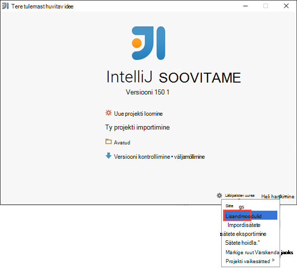
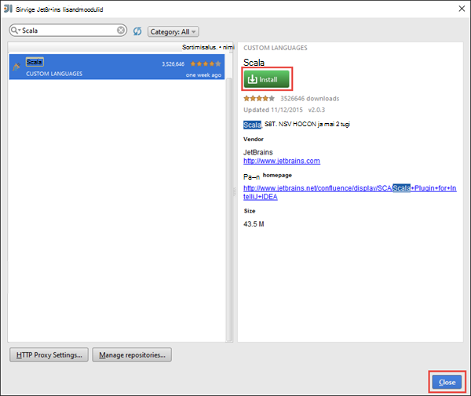
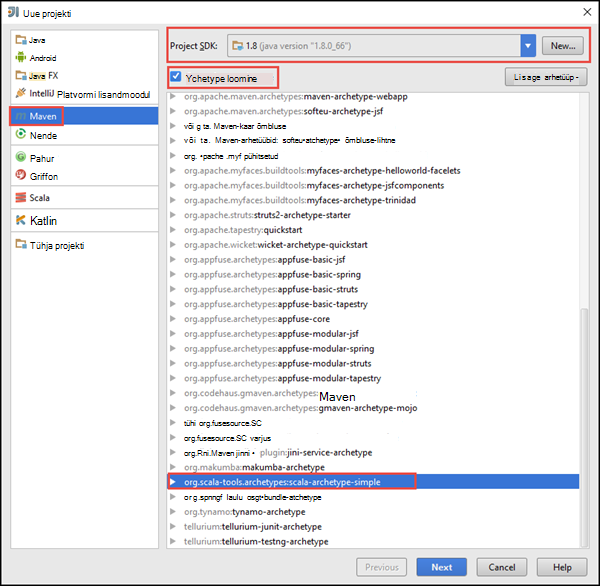
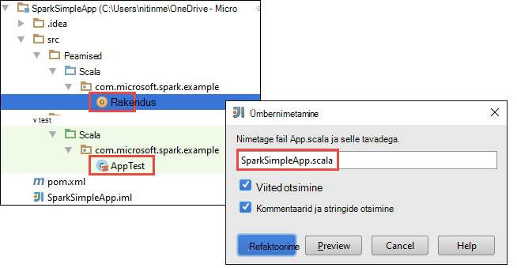
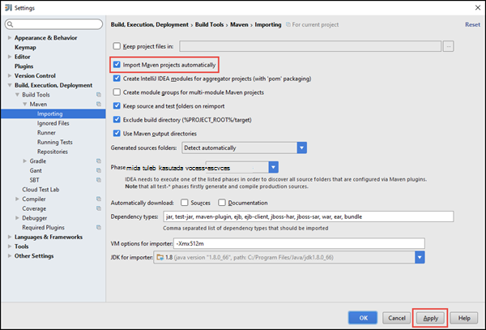
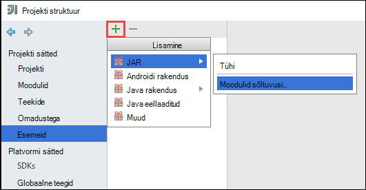
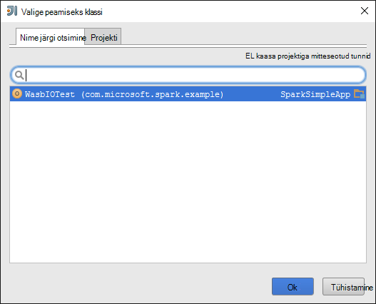
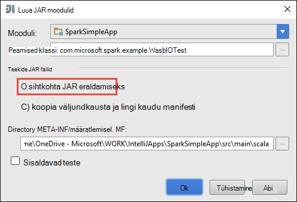
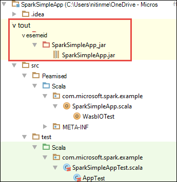

<properties
    pageTitle="Luua eraldi scala rakenduste Hdinsightiga säde kogumite | Microsoft Azure'i"
    description="Saate teada, kuidas luua eraldiseisev säde rakenduse käivitamiseks klõpsake Hdinsightiga säde kogumite."
    services="hdinsight"
    documentationCenter=""
    authors="nitinme"
    manager="jhubbard"
    editor="cgronlun"
    tags="azure-portal"/>

<tags
    ms.service="hdinsight"
    ms.workload="big-data"
    ms.tgt_pltfrm="na"
    ms.devlang="na"
    ms.topic="article"
    ms.date="10/28/2016"
    ms.author="nitinme"/>

# Autonoomse Scala rakenduse käivitamiseks klõpsake Apache Spark kobar Hdinsightiga Linux loomine

Selles artiklis antakse üksikasjalikud juhised väljatöötamise autonoomse säde taotluste kirjutatud Scala huvitav idee Maven abil. Artikkel kasutab Apache Maven Koosta süsteem ja algab olemasoleva Maven arhetüüp Scala huvitav idee järgi.  Veebisaidil üksikasjalik, on Scala loomine rakenduses huvitav idee hõlmab järgmist:

* Kasutage Maven Koosta süsteem.
* Projekti objekti mudeli programmiga faili lahendamiseks säde mooduli sõltuvused värskendamist.
* Kirjutage rakenduse Scala.
* Luua jar faili, mida saab esitada Hdinsightiga säde kogumite.
* Käivitage rakendus säde kobar Liviuse abil.

>[AZURE.NOTE] Hdinsightiga pakub huvitav idee lisandmooduli tööriista lihtsustamiseks loomine ja esitamine rakendused on Hdinsightiga säde kobar Linux. Lisateabe saamiseks vt [Kasutamine Hdinsightiga tööriistade lisandmooduli huvitav idee luua ja esitada säde rakendused](hdinsight-apache-spark-intellij-tool-plugin.md).

**Eeltingimused**

* Azure'i tellimuse. Leiate [Azure'i saada tasuta prooviversioon](https://azure.microsoft.com/documentation/videos/get-azure-free-trial-for-testing-hadoop-in-hdinsight/).
* Apache Spark kobar Hdinsightiga Linux. Juhised leiate teemast [loomine Apache Spark kogumite Windows Azure Hdinsightiga sisse](hdinsight-apache-spark-jupyter-spark-sql.md).
* Oracle'i Java arenduskomplekt. Saate selle installida [siia](http://www.oracle.com/technetwork/java/javase/downloads/jdk8-downloads-2133151.html).
* Java IDE. Selles artiklis kasutab huvitav idee 15.0.1. Saate selle installida [siia](https://www.jetbrains.com/idea/download/).

## Huvitav idee Scala lisandmooduli installimine

Kui huvitav idee installi ei ei küsi Scala lisandmoodulite lubamine, käivitage huvitav idee ja läbida selle lisandmooduli installimiseks tehke järgmist.

1. Käivitage huvitav idee ja tervituskuva nuppu **Konfigureeri** ja klõpsake nuppu **lisandmoodulid**.

    

2. Järgmisel kuval klõpsake **lisandmooduli installimiseks JetBrains** alumises vasakus nurgas. Avanevas dialoogiboksis **Sirvimine JetBrains lisandmoodulid** Scala otsimine ja klõpsake nuppu **Installi**.

    

3. Pärast selle lisandmooduli installimise edukalt, klõpsake **uuesti huvitav idee nupp** IDE taaskäivitama.

## Autonoomse Scala projekti loomine

1. Käivitage huvitav idee ja uue projekti loomine. Uue projekti dialoogiboksis järgmisi valikuid ja seejärel klõpsake nuppu **edasi**.

    

    * Valige **Maven** projekti tüüp.
    * Määrake **projekti SDK**. Klõpsake nuppu Uus ja liikuge Java installikaust, tavaliselt `C:\Program Files\Java\jdk1.8.0_66`.
    * Klõpsake raadionuppu **Loo arhetüüp** .
    * Valige loendist arhetüübid, **org.scala tools.archetypes:scala arhetüüp lihtne**. See loob õige kataloogi struktuuri ja kirjutamiseks Scala programmi sõltuvuste nõutud vaikimisi alla laadida.

2. Sisestage **GroupId**, **ArtifactId**ja **versiooni**vastavad väärtused. Klõpsake nuppu **edasi**.

3. Järgmise dialoogiboksi, kus saate määrata Maven home directory ja muud kasutaja sätted, vaikeväärtused Aktsepteeri ja klõpsake nuppu **edasi**.

4. Viimase dialoogiboksis Määrake projekti nimi ja asukoht ja klõpsake siis nuppu **valmis**.

5. **Src\test\scala\com\microsoft\spark\example** **MySpec.Scala** faili kustutada. Teil pole vaja selle rakenduse.

6. Vajaduse korral vaikimisi lähte-kui ka testi faile ümber nimetada. Vasakpoolsel paanil huvitav idee, liikuge **src\main\scala\com.microsoft.spark.example**. Paremklõpsake **App.scala**, klõpsake **refaktoorime**, klõpsake käsku Nimeta ümber fail, ja sisestage dialoogiboksis rakenduse jaoks uus nimi ja seejärel klõpsake **refaktoorime**.

      

7. Järgmise toimingu värskendate määratleda sõltuvused säde Scala rakenduse pom.xml. Nende sõltuvuste tuleb alla laadida ja lahendada automaatselt, tuleb konfigureerida Maven vastavalt sellele.

    

    1. Klõpsake menüü **fail** nuppu **sätted**.
    2. Dialoogiboksis **sätted** , liikuge **koostada, täitmise juurutamise** > **Koostada tööriistad** > **Maven** > **importimine**.
    3. Valige suvand **impordi Maven projektid automaatselt**.
    4. Klõpsake nuppu **Rakenda**ja seejärel klõpsake nuppu **OK**.

8. Värskendage Scala lähtefail kaasamiseks oma rakenduse koodi. Avage ja asendage olemasolev proovi kood järgmine kood ja salvestage soovitud muudatused. Järgmine kood loeb (saadaval kõik Hdinsightiga säde kogumite), HVAC.csv andmeid toob read, mis on ainult ühe numbrikoha kuuenda veeru ja kirjutab väljund **/HVACOut** jaotises vaikimisi salvestusruumi ümbris klaster.

        package com.microsoft.spark.example

        import org.apache.spark.SparkConf
        import org.apache.spark.SparkContext

        /**
          * Test IO to wasb
          */
        object WasbIOTest {
          def main (arg: Array[String]): Unit = {
            val conf = new SparkConf().setAppName("WASBIOTest")
            val sc = new SparkContext(conf)

            val rdd = sc.textFile("wasbs:///HdiSamples/HdiSamples/SensorSampleData/hvac/HVAC.csv")

            //find the rows which have only one digit in the 7th column in the CSV
            val rdd1 = rdd.filter(s => s.split(",")(6).length() == 1)

            rdd1.saveAsTextFile("wasbs:///HVACout")
          }
        }

9. Värskendage soovitud pom.xml.

    1.  Sees `<project>\<properties>` lisage järgmine tekst:

            <scala.version>2.10.4</scala.version>
            <scala.compat.version>2.10.4</scala.compat.version>
            <scala.binary.version>2.10</scala.binary.version>

    2. Sees `<project>\<dependencies>` lisage järgmine tekst:

            <dependency>
              <groupId>org.apache.spark</groupId>
              <artifactId>spark-core_${scala.binary.version}</artifactId>
              <version>1.4.1</version>
            </dependency>

    Muudatuste salvestamiseks pom.xml.

10. Laiendid faili loomine. Huvitav idee võimaldab JAR artefaktina projekti loomine. Tehke järgmist.

    1. Klõpsake menüü **fail** nuppu **Projekti struktuuri**.
    2. Dialoogiboksis **Projekti struktuuri** klõpsake **esemeid** ja klõpsake plussmärk. Dialoogiboksis Hüpikakende klõpsake **JAR**ja **moodulid sõltuvusi,**seejärel klõpsake nuppu.

        

    3. Klõpsake dialoogiboksis **Loomine JAR kaudu moodulid** kolmikpunkti ( ) **Põhi klassi**suhtes.

    4. Dialoogiboksis **Valige põhi klassi** valige ainekursust, mis kuvatakse vaikimisi ja seejärel klõpsake nuppu **OK**.

        

    5. Dialoogiboksis **Loomine JAR moodulid:** veenduge, et on valitud suvand **sihtkohta JAR** eraldamiseks ja seejärel klõpsake nuppu **OK**. See loob ühe JAR kõigi sõltuvusi.

        

    6. Väljundi paigutus jaotises on loetletud kõik purgid Maven projekti kaasatud. Saate valida ja kustutada need, mille Scala taotlus on pole otsene sõltuvus. Loome siin rakendamiseks saate eemaldada kõik peale Viimane ühte (**SparkSimpleApp kompileerida väljundi**). Valige purgid kustutada, ja seejärel klõpsake ikooni **Kustuta** .

        

        Veenduge, et **teha koostamine** ruut on märgitud, mis tagab purki luuakse iga kord, kui projekt on loodud või värskendatud. Klõpsake nuppu **Rakenda** ja seejärel **OK**.

    7. Menüüriba, klõpsake **koostamine**ja klõpsake **Projekti teha**. Võite klõpsata ka **Koostada esemeid** purki loomiseks. Väljundi jar loodud **\out\artifacts**.

        

## Käivitage rakendus säde kobar

Käivitage rakendus klaster, peate tegema järgmist:

* **Kopeerige rakenduse jar salvestusruumi Azure'i bloobimälu** seostatud klaster. [**AzCopy**](../storage/storage-use-azcopy.md), käsurea kasuliku, saate seda teha. On palju ka teiste klientide, mille abil saate üles laadida andmeid. Võite leida rohkem nende kohta [üles laadida andmete Hadoopi töökohta, Hdinsightiga](hdinsight-upload-data.md).

* **Kasutage Liviuse esitada on rakenduse töö kaugühenduse teel** säde klaster. Säde kogumite kohta Hdinsightiga sisaldab Liviuse, mis seab esitada kaugühenduse teel säde töid ülejäänud lõpp-punktid. Lisateavet [esitada säde töö kaugkustutada Liviuse koos säde kogumite Hdinsightiga kohta](hdinsight-apache-spark-livy-rest-interface.md).

## Vt ka

* [Ülevaade: Apache Spark klõpsake Azure Hdinsightiga](hdinsight-apache-spark-overview.md)

### Stsenaariumid

* [Bi säde: andmeanalüüside interaktiivsed Hdinsightiga säde kasutamine koos Ärianalüüsi tööriistade kohta](hdinsight-apache-spark-use-bi-tools.md)

* [Seadme õppimisega säde: kasutamine säde rakenduses Hdinsightiga building temperatuur HVAC andmete analüüsimiseks](hdinsight-apache-spark-ipython-notebook-machine-learning.md)

* [Seadme õppimisega säde: kasutamine säde Hdinsightiga prognoosida toiduga kontrollitulemuste rakenduses](hdinsight-apache-spark-machine-learning-mllib-ipython.md)

* [Säde Streaming: Kasutamine säde rakenduses reaalajas streaming rakenduste Hdinsightiga](hdinsight-apache-spark-eventhub-streaming.md)

* [Veebisaidi logi analüüs Hdinsightiga säde kasutamine](hdinsight-apache-spark-custom-library-website-log-analysis.md)

### Luua ja kasutada rakendusi

* [Käivitage töö eemalt säde klaster Liviuse abil](hdinsight-apache-spark-livy-rest-interface.md)

### Tööriistad ja laiendid

* [Hdinsightiga tööriistade lisandmooduli huvitav idee abil saate luua ja esitage säde Scala rakendusi](hdinsight-apache-spark-intellij-tool-plugin.md)

* [Hdinsightiga tööriistade lisandmooduli huvitav idee abil silumine säde rakenduste kaugühenduse teel](hdinsight-apache-spark-intellij-tool-plugin-debug-jobs-remotely.md)

* [Säde kobar klõpsake Hdinsightiga Zeppelin märkmike kasutamine](hdinsight-apache-spark-use-zeppelin-notebook.md)

* [Tuumad Jupyter märkmiku säde kobar Hdinsightiga jaoks saadaval](hdinsight-apache-spark-jupyter-notebook-kernels.md)

* [Välise pakettide Jupyter märkmike kasutamine](hdinsight-apache-spark-jupyter-notebook-use-external-packages.md)

* [Jupyter oma arvutisse installida ja luua ühenduse mõne Hdinsightiga säde kobar](hdinsight-apache-spark-jupyter-notebook-install-locally.md)

### Ressursside haldamine

* [Ressursid Apache Spark kobar rakenduses Windows Azure Hdinsightiga haldamine](hdinsight-apache-spark-resource-manager.md)

* [Töötavate on Apache Spark kobar rakenduses Hdinsightiga jälitamine ja silumine tööde haldamine](hdinsight-apache-spark-job-debugging.md)
