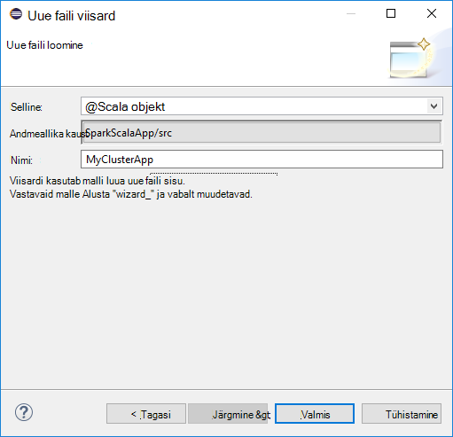

 <properties
    pageTitle="Tööriistakomplekt Azure Hdinsightiga tööriistade kasutamine Eclipse säde Scala rakenduste loomine | Microsoft Azure'i"
    description="Saate teada, kuidas luua eraldiseisev säde rakenduse käivitamiseks klõpsake Hdinsightiga säde kogumite."
    services="hdinsight"
    documentationCenter=""
    authors="nitinme"
    manager="jhubbard"
    editor="cgronlun"
    tags="azure-portal"/>

<tags
    ms.service="hdinsight"
    ms.workload="big-data"
    ms.tgt_pltfrm="na"
    ms.devlang="na"
    ms.topic="article"
    ms.date="08/30/2016"
    ms.author="nitinme"/>

# Hdinsightiga tööriistu kasutada Azure tööriistakomplekt Eclipse luua säde rakendusi Hdinsightiga säde Linux kobar

Sellest artiklist leiate üksikasjalikud juhised väljatöötamise säde taotluste kirjutatud Scala ja esitada, seda ka Hdinsightiga säde klaster Eclipse tööriistakomplekt Azure Hdinsightiga tööriistade kasutamine. Saate kasutada menüü Tööriistad on mitu võimalust:

* Arendamise ja esitada Scala säde rakenduse kohta on Hdinsightiga säde kobar
* Juurdepääsu oma Azure Hdinsightiga säde kobar ressursid
* Arendamise ja Scala säde rakenduse kohalik käivitamine

>[AZURE.IMPORTANT] See tööriist saab luua ja esitada ainult mõne Hdinsightiga säde kobar Linux.

##Eeltingimused

* Azure'i tellimuse. Leiate [Azure'i saada tasuta prooviversioon](https://azure.microsoft.com/documentation/videos/get-azure-free-trial-for-testing-hadoop-in-hdinsight/).

* Apache Spark kobar Hdinsightiga Linux. Juhised leiate teemast [loomine Apache Spark kogumite Windows Azure Hdinsightiga sisse](hdinsight-apache-spark-jupyter-spark-sql.md).

* Oracle'i Java arengu kit version 7 ja 8 versioon. 
    * **Java SDK 7** kasutatakse koostamise säde projektide, nagu Hdinsightiga rühmad toetavad Java versioon 7. Saate alla laadida Java SDK 7 [siin](http://www.oracle.com/technetwork/java/javase/downloads/jdk7-downloads-1880260.html).
    * **Java SDK 8** kasutatakse Eclipse IDE runtime. Te saate alla laadida [siin](http://www.oracle.com/technetwork/java/javase/downloads/jdk8-downloads-2133151.html).

* Eclipse IDE. Selles artiklis kasutab Eclipse neoon. Saate selle installida [siia](https://www.eclipse.org/downloads/).

* Scala IDE Eclipse. 
    * **Kui teil on installitud Eclipse IDE**, saate lisada lisandmooduli Scala IDE **aita** -> **Installi uus tarkvara**, ja lisage [http://download.scala-ide.org/sdk/lithium/e44/scala211/stable/site](http://download.scala-ide.org/sdk/lithium/e44/scala211/stable/site) allikana Eclipse Scala lisandmoodul alla laadida. 
    * **Kui teil on installitud Eclipse IDE**, saate installida Scala IDE otse [siin](http://scala-ide.org/download/sdk.html). Saate laadige alla ZIP-faili selle link, väljavõte, liikuge **/eclipse** kausta ja seejärel käivitage **eclipse.exe** faili sealt.
    
    >[AZURE.NOTE] Selle dokumendi juhised põhinevad Eclipse IDE abil Scala lisandmoodul on installitud.

* Säde SDK. Te saate alla laadida [siin](http://go.microsoft.com/fwlink/?LinkID=723585&clcid=0x409).

* Installige [https://www.eclipse.org/efxclipse/install.html](https://www.eclipse.org/efxclipse/install.html)clipse e (fx).

## Installige Azure'i tööriistakomplekt Hdinsightiga tööriistad Eclipse

Hdinsightiga tööriistade Eclipse on saadaval Azure tööriistakomplekt Eclipse osana. Juhised selle kohta, kuidas installida Azure tööriistakomplekt, lugege teemat [installimist Azure tööriistakomplekt Eclipse](../azure-toolkit-for-eclipse-installation.md).

## Logige sisse oma Azure tellimuse

1. Käivitage Eclipse IDE ja avage Azure'i Explorer. IDE menüü **aken** nuppu **Kuva vaade** ja seejärel nuppu **muud**. Avanevas dialoogiboksis laiendamine **Azure**, **Azure Exploreri**nuppu ja seejärel klõpsake nuppu **OK**.

    

2. Paremklõpsake sõlme **Azure'i** **Azure Explorer**ja valige **Tellimuste haldamine**.

3. Dialoogiboksis **Tellimuste haldamine** klõpsake linki **Logi sisse** ja sisestage mandaat Azure.

    

4. Kui olete sisse logitud, **Tellimuste haldamine** dialoogiboksis on loetletud kõik Azure'i tellimused, mis on seotud identimisteabega. Klõpsake nuppu **Sule** dialoogiboksis.

5. Azure'i Exploreri menüü laiendamine **Hdinsightiga** kuvamiseks Hdinsightiga säde rühmad jaotises tellimuse.

    

6. Saate laiendada kobar nimi sõlm klaster seotud ressursside (nt salvestusruumi kontod) kuvamiseks.

    

## Säde Scala projekti jaoks soovitud Hdinsightiga säde kobar häälestamine

1. Eclipse IDE töö ruumi, klõpsake menüüd **fail**, nuppu **Uus**ja seejärel klõpsake nuppu **projekti**. 

2. **Uus projekt** viisard, laiendage **Hdinsightile**, valige **säde Hdinsightiga (Scala) kohta**ja seejärel klõpsake nuppu **edasi**.

    

3. Dialoogiboksis **Uus Hdinsightiga Scala projekt** sisestage/valige väärtused nagu on näidatud järgmisel pildil ja seejärel klõpsake nuppu **edasi**.

    

    * Sisestage projekti nimi.
    * Väljale **JRE** veenduge, et **täitmise keskkonnas JRE kasutamine** on seatud **JavaSE-1,7**.
    * Veenduge, et säde SDK on määratud asukohta, kus saate alla laadida SDK. [Eeltingimused](#prerequisites) käesolevas teemas sisaldab linki allalaadimine asukohta. Saate ka alla laadida SDK link ka selles dialoogiboksis nagu pildil näidatud.    

4. Järgmise dialoogiboksis vahekaarti **teekide** , ja topeltklõpsake **JRE süsteemi teegi [JavaSE 1.7]**.

    

5. Dialoogiboksis **Redigeeri teegi** veenduge, et **Täitmise keskkond, mis** on seatud **JavaSE-1.7(jdk1.7.0_79)**. Kui see pole saadaval, järgige alltoodud juhiseid.

    1. Valige suvand **Alternatiivne JRE** ning kas **JavaSE-1.7(jdk1.7.0_79)** on saadaval.
    2. Kui ei, klõpsake nuppu **JREs installitud** .

          

    3. Klõpsake dialoogiboksis **Installitud JREs** nuppu **Lisa**.

            

    4. Dialoogiboksis **JRE tüüp** valige **Standard VM**ja seejärel klõpsake nuppu **edasi**

            

    5. Dialoogiboksis **JRE määratlus** kaust, klõpsake nuppu ja seejärel liikuge asukohta JDK 7 installi ja valige juurkausta jaoks **jdk1.7.0_79**.

            

    6. Klõpsake nuppu **valmis**. Valige äsja lisatud JRE dialoogiboksis **JREs installitud** ja seejärel klõpsake nuppu **OK**.

           

    7. Äsja lisatud JRE peaks olema lisatud **Täitmise**keskkonnas. Klõpsake nuppu **valmis**.

           

6. Topeltklõpsake vahekaardil **teekide** , **Scala teegi Container [2.11.8]**. Valige dialoogiboksis **Redigeeri teegi** **fikseeritud Scala teegi container: 2.10.6**. 

    

    Projekti sätete dialoogiboks sulgemiseni, klõpsake nuppu **valmis** .

## Luua Scala sidumise Hdinsightiga säde kobar

1. Juba avatud Eclipse IDE **Paketi Exploreri**laiendamine varem loodud projekt, paremklõpsake **src**, käsk **Uus**ja klõpsake **muud**.

2. Dialoogiboksis **Valige viisardi** **Scala viisardeid**laiendada, klõpsake **Scala objekti**ja seejärel klõpsake nuppu **edasi**.

    

3. **Uue faili loomine** dialoogiboksis Sisestage objekti nimi ja klõpsake siis nuppu **valmis**.

    

4. Kleepige järgmine kood tekstiredaktoris.

        import org.apache.spark.SparkConf
        import org.apache.spark.SparkContext
    
        object MyClusterApp{
          def main (arg: Array[String]): Unit = {
            val conf = new SparkConf().setAppName("MyClusterApp")
            val sc = new SparkContext(conf)
        
            val rdd = sc.textFile("wasbs:///HdiSamples/HdiSamples/SensorSampleData/hvac/HVAC.csv")
        
            //find the rows which have only one digit in the 7th column in the CSV
            val rdd1 =  rdd.filter(s => s.split(",")(6).length() == 1)
        
            rdd1.saveAsTextFile("wasbs:///HVACOut")
          }     
        }

5. Käivitage rakendus on Hdinsightiga säde kobar.

    1. **Paketi Explorer**, paremklõpsake projekti nime ja valige **Hdinsightiga säde rakenduse esitada**.      

    2. Sisestage dialoogiboksis **Säde esitamise** järgmised väärtused.

        * **Kobar nimi**, valige Hdinsightiga säde kobar, kuhu soovite rakenduse käivitada.

        * Peate valige artefakt Eclipse projekti või valige see arvuti kõvakettale.

        * Vastu **Main klassinimi** tekstivälja, sisestage kood määratud objekti nimi (vt pilti allpool).

            

        * Kuna rakenduse koodi selles näites ei nõua mis tahes käsurea argumendid või viide purgid või faile, võite ülejäänud teksti lahtrid tühjaks jätta.

        * Klõpsake **esitada**.

    3. Vahekaart **Säde esitamise** peab algama edenemise kuvamiseks. Rakenduse saate peatada punase nupu "Säde esitamise" aknas. Saate vaadata ka selle kindla rakenduse käivitamiseks klõpsake (tähistatud pildi kasti sinine) gloobuseikooni logid.

        

    Järgmise jaotise saate teada, kuidas töö väljund Hdinsightiga tööriistade kasutamine Azure tööriistakomplekt Eclipse juurdepääsu.

## Juurdepääsuks ja haldamiseks Hdinsightiga säde kogumite Eclipse Azure'i tööriistakomplekt Hdinsightiga tööriistade kasutamine

Saate teha mitmesuguseid toiminguid Hdinsightiga tööriistade abil.

### Juurdepääs salvestusruumi-ümbrisest klaster

1. Azure'i Explorerist laiendage **Hdinsightile** juurkausta Hdinsightiga säde kogumite, mis on saadaval loendi kuvamiseks.

3. Laiendage kuvamiseks salvestusruumi konto ja vaikimisi salvestusruumi ümbris klaster kobar nimi.

    

4. Klõpsake seotud klaster salvestusruumi container nime. Parempoolse paani, peaksite nägema kaust nimega **HVACOut**. Topeltklõpsake avamiseks kausta ja te näete **osa -*** failid. Avage üks failide kuvamiseks rakenduse väljund.

### Säde ajaloo sisestamine

1. **Azure'i Explorer**, paremklõpsake oma säde kobar nime ja seejärel valige **Avatud säde ajalugu UI**. Küsimise korral sisestage administraatori identimisteave klaster. Peab olema eelnevalt määratud neid samal ajal ettevalmistamise klaster.

2. Säde ajalugu serveri armatuurlaual saate vaadata rakenduse te just lõpetanud töötab, kasutades rakenduse nimi. Ülaltoodud kood, seatakse rakenduse nime abil `val conf = new SparkConf().setAppName("MyClusterApp")`. Seega teie säde rakenduse nimi on **MyClusterApp**.

### Käivitage portaalis Ambari

**Azure'i Explorer**, paremklõpsake oma säde kobar nime ja seejärel valige **Avatud kobar haldusportaali (Ambari)**. Küsimise korral sisestage administraatori identimisteave klaster. Peab olema eelnevalt määratud neid samal ajal ettevalmistamise klaster.

### Azure'i tellimuste haldamine

Vaikimisi on loetletud Eclipse tööriistakomplekt Azure Hdinsightiga Tööriistad: Azure'i tellimused säde rühmad. Vajaduse korral saate määrata tellimused, mille jaoks soovite juurdepääsu klaster. **Azure'i Explorer**, Paremklõpsake sõlme **Azure'i** juurkausta, ja klõpsake **Tellimuste haldamine**. Dialoogiboksi, tühjendage ruudud vastu tellimus, mida te ei soovi juurde pääseda ja seejärel klõpsake nuppu **Sule**. Võite ka klõpsata **Logi välja** kui soovite välja logida Azure tellimuse.

## Kohalik säde Scala rakenduse käivitamiseks

Saate Hdinsightiga tööriistad Azure'i tööriistakomplekt Eclipse säde Scala rakenduste käivitamist kohalikult oma töökoha. Tavaliselt selliseid rakendusi ei vaja juurdepääsu kobar ressursside nagu salvestusruumi container ja saate käivitatakse ja kontrollida kohalikult.

### Nõutav

Töötab kohaliku säde Scala rakenduse Windowsi arvuti, võidakse kuvada erandi, nagu on selgitatud [SÄDE-2356](https://issues.apache.org/jira/browse/SPARK-2356) , mille põhjuseks on puudu **WinUtils.exe** Windows OS-is. Selle tõrke lahendamiseks peate asukohta, nt **C:\WinUtils\bin** [käivitatava siit alla laadida](http://public-repo-1.hortonworks.com/hdp-win-alpha/winutils.exe) . Tuleb lisada mõne muutuja **HADOOP_HOME** ja määrake väärtuseks muutuja **C\WinUtils**.

### Kohaliku säde Scala rakenduse käivitamine  

1. Käivitage Eclipse ja uue projekti loomine. Uue projekti dialoogiboksis järgmisi valikuid ja seejärel klõpsake nuppu **edasi**.

    

    * Valige vasakul paanil **Hdinsightiga**.
    * Valige parempoolsel paanil **säde Hdinsightiga kohaliku käivitada näidise (Scala)**.
    * Klõpsake nuppu **edasi**.

2. Projekti üksikasjad, järgige juhiseid 3 – 6, nagu on näidatud varasemast teemast [säde Scala rakenduse projekti jaoks soovitud Hdinsightiga säde kobar häälestamine](#set-up-a-spark-scala-application-project-for-an-hdinsight-spark cluster).

3. Malli lisab proovi kood (**LogQuery**) **src** kaustas, mida saate käitada kohalikku arvutisse.

    

4.  Paremklõpsake **LogQuery** rakendus, valige käsk **Käivita**, ja seejärel nuppu **1 Scala rakendus**. Kuvatakse umbes järgmine väljund **konsooli** menüü allosas.

    

## Tagasiside ja teadaolevad probleemid

Kuvatud säde väljundid otse ei toetata ja mis kohta.

Kui teil on ettepanekuid või tagasiside või kui teil tekib probleeme, kasutades seda tööriista, võite kukutage meile e-posti hdivstool microsoft dot com.

## Vt ka

* [Ülevaade: Apache Spark klõpsake Azure Hdinsightiga](hdinsight-apache-spark-overview.md)

### Stsenaariumid

* [Bi säde: andmeanalüüside interaktiivsed Hdinsightiga säde kasutamine koos Ärianalüüsi tööriistade kohta](hdinsight-apache-spark-use-bi-tools.md)

* [Seadme õppimisega säde: kasutamine säde rakenduses Hdinsightiga building temperatuur HVAC andmete analüüsimiseks](hdinsight-apache-spark-ipython-notebook-machine-learning.md)

* [Seadme õppimisega säde: kasutamine säde Hdinsightiga prognoosida toiduga kontrollitulemuste rakenduses](hdinsight-apache-spark-machine-learning-mllib-ipython.md)

* [Säde Streaming: Kasutamine säde rakenduses reaalajas streaming rakenduste Hdinsightiga](hdinsight-apache-spark-eventhub-streaming.md)

* [Veebisaidi logi analüüs Hdinsightiga säde kasutamine](hdinsight-apache-spark-custom-library-website-log-analysis.md)

### Luua ja kasutada rakendusi

* [Kasutades Scala rakendusena loomine](hdinsight-apache-spark-create-standalone-application.md)

* [Käivitage töö eemalt säde klaster Liviuse abil](hdinsight-apache-spark-livy-rest-interface.md)

### Tööriistad ja laiendid

* [Azure'i tööriistakomplekt huvitav Hdinsightiga tööriistu kasutada luua ja esitada säde Scala rakendusi](hdinsight-apache-spark-intellij-tool-plugin.md)

* [Hdinsightiga tööriistu kasutada Azure tööriistakomplekt huvitav silumine säde rakenduste kaugühenduse teel](hdinsight-apache-spark-intellij-tool-plugin-debug-jobs-remotely.md)

* [Säde kobar klõpsake Hdinsightiga Zeppelin märkmike kasutamine](hdinsight-apache-spark-use-zeppelin-notebook.md)

* [Tuumad Jupyter märkmiku säde kobar Hdinsightiga jaoks saadaval](hdinsight-apache-spark-jupyter-notebook-kernels.md)

* [Välise pakettide Jupyter märkmike kasutamine](hdinsight-apache-spark-jupyter-notebook-use-external-packages.md)

* [Jupyter oma arvutisse installida ja luua ühenduse mõne Hdinsightiga säde kobar](hdinsight-apache-spark-jupyter-notebook-install-locally.md)

### Ressursside haldamine

* [Ressursid Apache Spark kobar rakenduses Windows Azure Hdinsightiga haldamine](hdinsight-apache-spark-resource-manager.md)

* [Töötavate on Apache Spark kobar rakenduses Hdinsightiga jälitamine ja silumine tööde haldamine](hdinsight-apache-spark-job-debugging.md)
