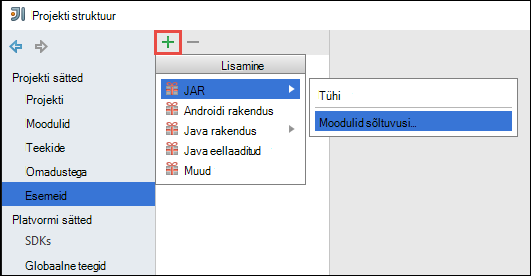

<properties 
    pageTitle="Azure'i sündmuse jaoturi abil Apache Spark rakenduses Hdinsightiga streaming andmete töötlemiseks | Microsoft Azure'i" 
    description="Andmete saatmiseks juhised leiate Azure'i sündmuse jaoturi voona ja seejärel saama nende sündmuste säde scala rakenduse abil" 
    services="hdinsight" 
    documentationCenter="" 
    authors="nitinme" 
    manager="jhubbard" 
    editor="cgronlun"
    tags="azure-portal"/>

<tags 
    ms.service="hdinsight" 
    ms.workload="big-data" 
    ms.tgt_pltfrm="na" 
    ms.devlang="na" 
    ms.topic="article" 
    ms.date="09/30/2016" 
    ms.author="nitinme"/>

# Säde Streaming: Töötlemine Azure'i sündmuse jaoturi sündmusega Hdinsightiga Linux Apache Spark kobar

Säde Streaming laiendab core säde API luua scalable, suure läbilaskevõimega, tõrketaluvusega voo töötlemise rakendusi. Andmete võib märkimisväärselt paljudest allikatest. Selles artiklis me kasutame Azure'i sündmuse jaoturi neelata andmed. Sündmuse jaoturi on väga paindlik manustamisest süsteem, et saab tarbimine miljoneid sündmuste sekundis. 

Selles õppetükis saate teada, kuidas luua Azure'i sündmuse keskuses kuidas neelata sõnumite konsooli rakendust Java sündmuse jaoturiga ja laadida neid samal ajal säde rakendust Scala kirjutatud. Selle rakenduse tarbib voona sündmuse jaoturi kaudu andmed ja marsruudib selle eri väljundid (Azure'i salvestusruumi bloobimälu taru tabeli ja SQL-i tabel).

> [AZURE.NOTE] Järgige selle artikli juhiseid, on teil kasutada Azure portaali mõlemad versioonid. Mõni sündmus keskuse loomiseks kasutate [Azure klassikaline portaalis](https://manage.windowsazure.com). Hdinsightiga säde kobar töötamiseks kasutage [Azure portaali](https://portal.azure.com/).  

**Eeltingimused**

Vajate järgmist:

- Azure'i tellimuse. Leiate [Azure'i saada tasuta prooviversioon](https://azure.microsoft.com/documentation/videos/get-azure-free-trial-for-testing-hadoop-in-hdinsight/).
- Mõne Apache Spark kobar. Juhised leiate teemast [loomine Apache Spark kogumite Windows Azure Hdinsightiga sisse](hdinsight-apache-spark-jupyter-spark-sql.md).
- Oracle'i Java arenduskomplekt. Saate selle installida [siia](http://www.oracle.com/technetwork/java/javase/downloads/jdk8-downloads-2133151.html).
- Java IDE. Selles artiklis kasutab huvitav idee 15.0.1. Saate selle installida [siia](https://www.jetbrains.com/idea/download/).
- SQL serveri, Microsoft JDBC draiveri v4.1 või uuem versioon. See on vajalik sündmuse andmete kirjutamiseks SQL serveri andmebaasi. Saate selle installida [siia](https://msdn.microsoft.com/sqlserver/aa937724.aspx).
- Azure'i SQL-andmebaasiga. Juhised leiate teemast [loomine SQL-andmebaasi minutites](../sql-database/sql-database-get-started.md).

## Mida see lahendus teha?

See on, kuidas streaming lahendus juhtimine:

1. Voo sündmuste saadud Azure'i sündmuse keskuse loomine.

2. Kohaliku autonoomne rakendus, mis loob sündmused ja sunnib see Azure'i sündmuse jaoturi. Valimi rakendus, mis see on avaldatud [https://github.com/hdinsight/spark-streaming-data-persistence-examples](https://github.com/hdinsight/spark-streaming-data-persistence-examples).

2. Käivitage streaming rakenduse kaugühenduse teel säde klaster, mis loeb streaming sündmuste Azure'i sündmuse jaoturi ja sunnib erinevates kohtades (Azure'i bloobimälu taru tabeli ja SQL-i andmebaasi tabeli). 

## Azure'i sündmuse keskuse loomine

1. [Azure'i portaalis](https://manage.windowsazure.com)valige **Uus** > **Teenuse siini** > **Sündmuse jaoturi** > **Kohandatud loomine**.

2. **Lisa uus sündmus jaoturi** ekraanil, sisestage **Sündmuse jaoturi nimi**, valige **piirkond** jaoturi, luua ja luua uus nimeruum või valida mõne olemasoleva. Klõpsake **noolt** jätkata.

    ![viisardi lehel 1] (./media/hdinsight-apache-spark-eventhub-streaming/hdispark.streaming.create.event.hub.png "Mõne Azure sündmuse keskuse loomine")

    > [AZURE.NOTE] Valida nimega Hdinsightiga latentsus ja kulud vähendamiseks klõpsake klaster Apache Spark samasse **asukohta** .

3. Kuval **Konfigureerimine sündmuse jaoturi** **Partition count** ja **Sõnumi säilituspoliitika** väärtuste sisestamiseks, ja klõpsake märkeruutu. Selle näite puhul kasutada partition arv on 10 ja sõnumi säilitamine 1. Pange tähele partition count, kuna te peate seda väärtust hiljem.

    ![viisardi lehel 2] (./media/hdinsight-apache-spark-eventhub-streaming/hdispark.streaming.create.event.hub2.png "Määrake sektsiooni suurus ja säilitamise päevade sündmuse jaoturi")

4. Klõpsake sündmuse jaoturi loodud, klõpsake nuppu **Konfigureeri**ja seejärel looge kaks juurdepääsupoliitikaid jaoturi sündmuste jaoks.

    <table>
    <tr><th>Nimi</th><th>Õigused</th></tr>
    <tr><td>mysendpolicy</td><td>Saatmine</td></tr>
    <tr><td>myreceivepolicy</td><td>Kuulake</td></tr>
    </table>

    Kui olete loonud õigused, valige lehe allosas **salvestada** ikoon. See loob saatmine (**mysendpolicy**) ja see sündmus keskpunkt (**myreceivepolicy**) kuulata kasutatud ühiskasutusega juurdepääsupoliitikaid.

    ![poliitika] (./media/hdinsight-apache-spark-eventhub-streaming/hdispark.streaming.event.hub.policies.png "Sündmuse loomine jaoturi poliitika")

    
5. Samal lehel, Pange kaks poliitikate jaoks loodud poliitika võtmed. Kuna kasutab neid hiljem, salvestage need võtmed.

    ![poliitika võtmed] (./media/hdinsight-apache-spark-eventhub-streaming/hdispark.streaming.event.hub.policy.keys.png "Salvestage poliitika võtmed")

6. Klõpsake lehe **armatuurlaud** tuua ja salvestada ühenduse stringid sündmuse jaoturi abil kahe poliitika ülevalt **Ühenduseteavet** .

    ![poliitika võtmed] (./media/hdinsight-apache-spark-eventhub-streaming/hdispark.streaming.event.hub.policy.connection.strings.png "Poliitika ühendusstringi salvestamine")

## Sündmuse jaoturi sõnumite saatmiseks Scala rakenduse kasutamine

Selles jaotises saate Scala kohaliku rakendusena Azure'i sündmuse jaoturi eelmises etapis loodud voo sündmuste saata. See rakendus on saadaval github [https://github.com/hdinsight/eventhubs-sample-event-producer](https://github.com/hdinsight/eventhubs-sample-event-producer). Siin juhistes eeldatakse, et teil on juba kahestunud selle GitHub hoidla.

1. Avage rakendus, **EventhubsSampleEventProducer**, huvitav idee.
    
2. Projekti koostada. Valige menüüst **koostamine** **Teha Project**. Väljundi jar loodud **\out\artifacts**.

>[AZURE.TIP] Suvand saadaval huvitav idee abil luua otse projekti GitHub hoidla. Mõistmaks, kuidas kasutada seda meetodit või mitte, kasutage juhiseid järgmises jaotises juhised. Pange tähele, et toimingud, mida on kirjeldatud järgmises jaotises palju ei saa rakendada, Scala rakenduse selles juhises loodud. Näiteks:

> * Neil pole POM kaasata säde versiooni värskendamiseks. See on, sest puudub sõltuvus säde selle rakenduse loomiseks
> * Neil pole mõned sõltuvus purgid projekti teeki lisada. Mis on, sest need purgid ei pea selle projekti jaoks.

## Selle rakenduse sündmuste saamise voogesitus Scala värskendamine

Proovi Scala taotluse vastu sündmus ja marsruutida erinevatesse sihtkohtadesse on saadaval veebisaidil [https://github.com/hdinsight/spark-streaming-data-persistence-examples](https://github.com/hdinsight/spark-streaming-data-persistence-examples). Järgige rakenduse värskendamine ja väljundi jar loomiseks alltoodud juhiseid.

1. Käivitage huvitav idee ja käivitada kuval Valige **vaadake kontrolli versiooni** ja seejärel klõpsake **Git**.
        
    

2. Sisestage dialoogiboksis **Klooni hoidla** Git hoidla URL-i klooni kaudu, määrake klooni, et kataloogi, ja seejärel klõpsake nuppu **klooni**.

    

    
3. Järgige viipasid, kuni projekt on täielikult kloonitud. Avamiseks vajutage klahvikombinatsiooni **Alt + 1** **Projekti vaade**. See näeb välja järgmine.

    
    
4. Veenduge, et rakendus kood on kompileeritud Java8. Veenduge, et see, klõpsake menüüd **fail**, nuppu **Projekti struktuuri**ja klõpsake menüü **Projekt** , veenduge, et projekt keele tase on seatud **8 - Lambdas, marginaalid tüüp, jne**.

    

5. Avage **pom.xml** ja veenduge, et säde versioon on õige. Klõpsake jaotises <properties> sõlm, vaadake järgmist koodilõigu ja kontrollige säde versioon.

        <scala.version>2.10.4</scala.version>
        <scala.compat.version>2.10.4</scala.compat.version>
        <scala.binary.version>2.10</scala.binary.version>
        <spark.version>1.6.2</spark.version>
    
5. Rakendus nõuab kahte sõltuvus purgid:

    * **EventHub vastuvõtja jar**. See on vajalik säde sõnumeid sündmuse keskuse kaudu. Purgist kasutamiseks Uuenda **pom.xml** lisada järgmised jaotises `<dependencies>`.

            <dependency>
              <groupId>com.microsoft.azure</groupId>
              <artifactId>spark-streaming-eventhubs_2.10</artifactId>
              <version>1.6.0</version>
            </dependency> 

    * **JDBC draiveri jar**. See on vajalik kirjutada SQL Azure'i andmebaasi sündmuse keskuse kaudu saadud sõnumeid. Saate alla laadida v4.1 või uuem versioon jar faili [siia](https://msdn.microsoft.com/sqlserver/aa937724.aspx). Purgist lisamine projekti teegis. Tehke järgmist.

        1. Huvitav idee aken, kus teil on rakenduse avada, klõpsake menüüd **fail**, klõpsake **Projekti struktuuri**ja seejärel käsku **teekide**. 
        
        2. Klõpsake ikooni lisa (), klõpsake nuppu **Java**ja seejärel liikuge asukohta, kuhu laadisite JDBC draiveri jar. Järgige viipasid jar-faili lisamine teeki projekti.

            ![sõltuvustega lisamine] (./media/hdinsight-apache-spark-eventhub-streaming/add-missing-dependency-jars.png "Lisa puuduvad sõltuvus purgid")

        3. Klõpsake nuppu **Rakenda**.

6. Looge jar väljundfail. Tehke järgmist.
    1. Dialoogiboksis **Projekti struktuuri** klõpsake **esemeid** ja klõpsake plussmärk. Dialoogiboksis Hüpikakende klõpsake **JAR**ja **moodulid sõltuvusi,**seejärel klõpsake nuppu.

        

    1. Klõpsake dialoogiboksis **Loomine JAR kaudu moodulid** kolmikpunkti () **Põhi klassi**suhtes.

    1. Dialoogiboksis **Valige põhi klassi** valige mis tahes saadaval ainekursused ja seejärel klõpsake nuppu **OK**.

        

    1. Dialoogiboksis **Loomine JAR moodulid:** veenduge, et on valitud suvand **sihtkohta JAR** eraldamiseks ja seejärel klõpsake nuppu **OK**. See loob ühe JAR kõigi sõltuvusi.

        

    1. **Väljundi paigutus** jaotises on loetletud kõik purgid Maven projekti kaasatud. Saate valida ja kustutada need, mille Scala taotlus on pole otsene sõltuvus. Loome siin rakendamiseks saate eemaldada kõik peale Viimane ühte (**microsoft-säde streaming-näited kompileerida väljundi**). Valige purgid kustutada, ja seejärel klõpsake ikooni **Kustuta** ().

        

        Veenduge, et **teha koostamine** ruut on märgitud, mis tagab purki luuakse iga kord, kui projekt on loodud või värskendatud. Klõpsake nuppu **Rakenda** ja seejärel **OK**.

    1. Väljundi menüü **Paigutus** jaotises paremas allservas **Saadaval** elemendid, peate SQL-i JDBC jar, mis varem lisatud projekti teeki. Seda peate lisama **Väljundi** paigutus. Paremklõpsake jar faili ja klõpsake **Ekstraktida üheks väljundi juurkausta**.

          

        **Väljundi paigutus** jaotises peaks olema nüüd selline.

             

        **Projekti struktuuri** dialoogiboksi, klõpsake nuppu **Rakenda** ja seejärel klõpsake nuppu **OK**. 

    1. Menüüriba, klõpsake **koostamine**ja klõpsake **Projekti teha**. Võite klõpsata ka **Koostada esemeid** purki loomiseks. Väljundi jar loodud **\out\artifacts**.

        

## Käivitage rakenduste kaugühenduse teel säde klaster Liviuse abil

Kasutame Liviuse kaugühenduse teel säde klaster streaming rakenduse käivitamiseks. Üksikasjalik arutamiseks Liviuse kasutamine Hdinsightiga säde kobar [Edasta projektide kaugühenduse teel, et mõne Apache Spark kobar kohta Windows Azure Hdinsightiga](hdinsight-apache-spark-livy-rest-interface.md)kuvamiseks. Enne alustamist töötab remote tööd voo sündmusi, kasutades säde seal on mõned asjad, mida tuleks teha.

1. Käivitage kohaliku rakendusena luua sündmuste ja sündmuse jaoturi saadetud. Järgmise käsu abil saate teha nii:

        java -cp EventhubsSampleEventProducer.jar com.microsoft.eventhubs.client.example.EventhubsClientDriver --eventhubs-namespace "mysbnamespace" --eventhubs-name "myeventhub" --policy-name "mysendpolicy" --policy-key "<policy key>" --message-length 32 --thread-count 32 --message-count -1

2. Kopeerige seostatud klaster Azure'i bloobimälu streaming jar (**microsoft-säde streaming-examples.jar**). See muudab purki Liviuse kättesaadavaks. [**AzCopy**](../storage/storage-use-azcopy.md), käsurea kasuliku, saate seda teha. On palju teiste klientide abil saate üles laadida andmeid. Võite leida rohkem nende kohta [üles laadida andmete Hadoopi töökohta, Hdinsightiga](hdinsight-upload-data.md).

3. Installige CURL arvutis, kus teil on nende rakenduste kaudu. Kasutame CURL autonoomsest käitamist kaugühenduse teel Liviuse lõpp-punktid.

### Rakendused on Azure salvestusruumi bloobimälu tekstina sündmuste saada käivitamine

Avage käsuviip, liikuge kausta, kuhu installisite CURL ja käivitage järgmine käsk (Asenda kasutajanime ja parooli ja kobar nimi):

    curl -k --user "admin:mypassword1!" -v -H "Content-Type: application/json" -X POST --data @C:\Temp\inputBlob.txt "https://mysparkcluster.azurehdinsight.net/livy/batches"

Faili **inputBlob.txt** parameetrid on määratletud järgmiselt:

    { "file":"wasbs:///example/jars/microsoft-spark-streaming-examples.jar", "className":"com.microsoft.spark.streaming.examples.workloads.EventhubsEventCount", "args":["--eventhubs-namespace", "mysbnamespace", "--eventhubs-name", "myeventhub", "--policy-name", "myreceivepolicy", "--policy-key", "<put-your-key-here>", "--consumer-group", "$default", "--partition-count", 10, "--batch-interval-in-seconds", 20, "--checkpoint-directory", "/EventCheckpoint", "--event-count-folder", "/EventCount/EventCount10"], "numExecutors":20, "executorMemory":"1G", "executorCores":1, "driverMemory":"2G" }

Andke meile mõista, mida parameetrid Sisestuskeel failis on:

* **fail** on seotud klaster Azure storage konto rakenduse jar faili tee.
* **klassinimi** on purki klassi nimi.
* **argumendid** on nõutud ainekursuse argumentide loendisse
* **numExecutors** on arv valdkond kasutavad säde streaming rakendust käivitama. See tuleb alati vähemalt kaks korda sündmuse jaoturi sektsioonid arv.
* **executorMemory**, **executorCores**, **driverMemory** on parameetrid ressursid streaming rakenduse abil.

>[AZURE.NOTE] Pole vaja luua väljundi kaustad (EventCheckpoint, EventCount/EventCount10), mida kasutatakse parameetrid. Streaming rakendus loob teie jaoks.
    
Kui käivitate selle käsu, peaksite nägema umbes selline väljund:

    < HTTP/1.1 201 Created
    < Content-Type: application/json; charset=UTF-8
    < Location: /18
    < Server: Microsoft-IIS/8.5
    < X-Powered-By: ARR/2.5
    < X-Powered-By: ASP.NET
    < Date: Tue, 01 Dec 2015 05:39:10 GMT
    < Content-Length: 37
    <
    {"id":1,"state":"starting","log":[]}* Connection #0 to host mysparkcluster.azurehdinsight.net left intact

Kirjutage paketi ID viimases reas väljund (näites on '1'). Veenduge, et rakendus töötab edukalt, saate vaadata oma Azure storage konto seostatud klaster ja näete seal loodud **/EventCount/EventCount10** kausta. See kaust peaks sisaldama plekid, mis sisaldab töödeldud parameetri **paketi intervall-sisse-sekundiline**määratud aja jooksul sündmuste arv.

Rakendus kasutab ka edaspidi kuni tapad selle käivitamiseks. Kasutage selleks järgmine käsk:

    curl -k --user "admin:mypassword1!" -v -X DELETE "https://mysparkcluster.azurehdinsight.net/livy/batches/1"

### Saada sündmused on Azure salvestusruumi bloobimälu nimega JSON rakendusi

Avage käsuviip, liikuge kausta, kuhu installisite CURL ja käivitage järgmine käsk (Asenda kasutajanime ja parooli ja kobar nimi):

    curl -k --user "admin:mypassword1!" -v -H "Content-Type: application/json" -X POST --data @C:\Temp\inputJSON.txt "https://mysparkcluster.azurehdinsight.net/livy/batches"

Faili **inputJSON.txt** parameetrid on määratletud järgmiselt:

    { "file":"wasbs:///example/jars/microsoft-spark-streaming-examples.jar", "className":"com.microsoft.spark.streaming.examples.workloads.EventhubsToAzureBlobAsJSON", "args":["--eventhubs-namespace", "mysbnamespace", "--eventhubs-name", "myeventhub", "--policy-name", "myreceivepolicy", "--policy-key", "<put-your-key-here>", "--consumer-group", "$default", "--partition-count", 10, "--batch-interval-in-seconds", 20, "--checkpoint-directory", "/EventCheckpoint", "--event-count-folder", "/EventCount/EventCount10", "--event-store-folder", "/EventStore10"], "numExecutors":20, "executorMemory":"1G", "executorCores":1, "driverMemory":"2G" }

Parameetrid sarnanevad määratud teksti väljundi eelmist toimingut. Uuesti, pole vaja luua väljundi kaustad (EventCheckpoint, EventCount/EventCount10), mida kasutatakse parameetrid. Streaming rakendus loob teie jaoks.

 Kui käivitate selle käsu, saate vaadata oma Azure storage kontoga seotud klaster ja näete seal loodud **/EventStore10** kausta. Avage mis tahes faili eesliide **osa -** ja te peaksite nägema JSON-vormingus töödelda sündmusi.

### Käivitage rakenduste saada sündmuste taru tabelisse

Käivitage rakendus, mis andmevoogu taru tabeliks sündmustest on vaja mõned täiendavad komponendid. Need on:

* datanucleus api-jdo 3.2.6.jar
* datanucleus-rdbms-3.2.9.jar
* datanucleus-core-3.2.10.jar
* taru-site.xml

**Laiendid** failid on saadaval veebisaidil klaster Hdinsightiga säde `/usr/hdp/current/spark-client/lib`. **Taru-site.xml** on saadaval aadressil `/usr/hdp/current/spark-client/conf`.

Saate [WinScp](http://winscp.net/eng/download.php) üle nende failide klaster kohalikku arvutisse kopeerida. Seejärel saate kopeerida need failid üle salvestusruumi kontoga seostatud klaster tööriistad. Failide üleslaadimine salvestusruumi konto kohta leiate lisateavet teemast [andmete Hadoopi töökohta, Hdinsightiga üles laadida](hdinsight-upload-data.md).

Kui kopeeritud failide üle Azure storage konto, avage käsuviip, liikuge kausta, kuhu installisite CURL ja käivitage järgmine käsk (Asenda kasutajanime ja parooli ja kobar nimi):

    curl -k --user "admin:mypassword1!" -v -H "Content-Type: application/json" -X POST --data @C:\Temp\inputHive.txt "https://mysparkcluster.azurehdinsight.net/livy/batches"

Faili **inputHive.txt** parameetrid on määratletud järgmiselt:

    { "file":"wasbs:///example/jars/microsoft-spark-streaming-examples.jar", "className":"com.microsoft.spark.streaming.examples.workloads.EventhubsToHiveTable", "args":["--eventhubs-namespace", "mysbnamespace", "--eventhubs-name", "myeventhub", "--policy-name", "myreceivepolicy", "--policy-key", "<put-your-key-here>", "--consumer-group", "$default", "--partition-count", 10, "--batch-interval-in-seconds", 20, "--checkpoint-directory", "/EventCheckpoint", "--event-count-folder", "/EventCount/EventCount10", "--event-hive-table", "EventHiveTable10" ], "jars":["wasbs:///example/jars/datanucleus-api-jdo-3.2.6.jar", "wasbs:///example/jars/datanucleus-rdbms-3.2.9.jar", "wasbs:///example/jars/datanucleus-core-3.2.10.jar"], "files":["wasbs:///example/jars/hive-site.xml"], "numExecutors":20, "executorMemory":"1G", "executorCores":1, "driverMemory":"2G" }

Parameetrid sarnanevad määratud teksti väljund, et eelmiste juhiste järgi. Uuesti, pole vaja luua väljundi kaustad (EventCheckpoint, EventCount/EventCount10) või väljund taru tabel (EventHiveTable10), mida kasutatakse parameetrid. Streaming rakendus loob teie jaoks. Tähele, et suvandi **failide** ja **purgid** sisaldab teed laiendid failid ja taru site.xml kopeeritud üle salvestusruumi kontole.

Veenduge, et taru tabel on loodud, saate SSH kobar ja käitamine taru päringud. Juhised leiate teemast [Kasutamine taru koos Hadoopi SSH Hdinsightiga sisse](hdinsight-hadoop-use-hive-ssh.md). Kui olete ühendatud SSH abil, käivitada järgmine käsk, et kontrollida, kas taru tabeli **EventHiveTable10**, on luuakse.

    show tables;

Peaksite nägema järgmine väljund:

    OK
    eventhivetable10
    hivesampletable

Saate käivitada ka valikupäringu tabeli sisu kuvamiseks.

    SELECT * FROM eventhivetable10 LIMIT 10;

Peaksite nägema umbes selline väljund:

    ZN90apUSQODDTx7n6Toh6jDbuPngqT4c
    sor2M7xsFwmaRW8W8NDwMneFNMrOVkW1
    o2HcsU735ejSi2bGEcbUSB4btCFmI1lW
    TLuibq4rbj0T9st9eEzIWJwNGtMWYoYS
    HKCpPlWFWAJILwR69MAq863nCWYzDEw6
    Mvx0GQOPYvPR7ezBEpIHYKTKiEhYammQ
    85dRppSBSbZgThLr1s0GMgKqynDUqudr
    5LAWkNqorLj3ZN9a2mfWr9rZqeXKN4pF
    ulf9wSFNjD7BZXCyunozecov9QpEIYmJ
    vWzM3nvOja8DhYcwn0n5eTfOItZ966pa
    Time taken: 4.434 seconds, Fetched: 10 row(s)

### Käivitage rakenduste saada sündmuste SQL Azure'i andmebaasi tabelisse

Enne selle toimingu, veenduge, et teil on loodud Azure SQL-andmebaasi. Peate väärtused andmebaasi nimi, andmebaasiserveri nimi ja andmebaasi administraatori identimisteave parameetrid. Teil pole vaja loomiseks andmebaasi tabeli küll. Streaming rakendus loob teie jaoks.

Avage käsuviip, liikuge kausta, kuhu installisite CURL ja käivitage järgmine käsk:

    curl -k --user "admin:mypassword1!" -v -H "Content-Type: application/json" -X POST --data @C:\Temp\inputSQL.txt "https://mysparkcluster.azurehdinsight.net/livy/batches"

Faili **inputSQL.txt** parameetrid on määratletud järgmiselt:

    { "file":"wasbs:///example/jars/microsoft-spark-streaming-examples.jar", "className":"com.microsoft.spark.streaming.examples.workloads.EventhubsToAzureSQLTable", "args":["--eventhubs-namespace", "mysbnamespace", "--eventhubs-name", "myeventhub", "--policy-name", "myreceivepolicy", "--policy-key", "<put-your-key-here>", "--consumer-group", "$default", "--partition-count", 10, "--batch-interval-in-seconds", 20, "--checkpoint-directory", "/EventCheckpoint", "--event-count-folder", "/EventCount/EventCount10", "--sql-server-fqdn", "<database-server-name>.database.windows.net", "--sql-database-name", "mysparkdatabase", "--database-username", "sparkdbadmin", "--database-password", "<put-password-here>", "--event-sql-table", "EventContent" ], "numExecutors":20, "executorMemory":"1G", "executorCores":1, "driverMemory":"2G" }

Veenduge, et rakendus töötab edukalt, saate luua ühenduse SQL Azure'i andmebaasi SQL Server Management Studio abil. Juhised selle kohta, kuidas seda teha, vt [ühenduse loomine SQL-andmebaasi SQL Server Management Studio](../sql-database/sql-database-connect-query-ssms.md). Kui andmebaasiga on ühendatud, saate liikuda **EventContent** tabel, mis on loodud streaming rakendus. Saate kiiresti päringu tabeli andmete toomine käivitada. Käivitage järgmine päring.

    SELECT * FROM EventCount

Peaksite nägema väljundi umbes järgmine:

    00046b0f-2552-4980-9c3f-8bba5647c8ee
    000b7530-12f9-4081-8e19-90acd26f9c0c
    000bc521-9c1b-4a42-ab08-dc1893b83f3b
    00123a2a-e00d-496a-9104-108920955718
    0017c68f-7a4e-452d-97ad-5cb1fe5ba81b
    001KsmqL2gfu5ZcuQuTqTxQvVyGCqPp9
    001vIZgOStka4DXtud0e3tX7XbfMnZrN
    00220586-3e1a-4d2d-a89b-05c5892e541a
    0029e309-9e54-4e1b-84be-cd04e6fce5ec
    003333cf-874f-4045-9da3-9f98c2b4ea49
    0043c07e-8d73-420a-9af7-1fcb94575356
    004a11a9-0c2c-4bc0-a7d5-2e0ebd947ab9

    
## Vt ka

* [Ülevaade: Apache Spark klõpsake Azure Hdinsightiga](hdinsight-apache-spark-overview.md)

### Stsenaariumid

* [Bi säde: andmeanalüüside interaktiivsed Hdinsightiga säde kasutamine koos Ärianalüüsi tööriistade kohta](hdinsight-apache-spark-use-bi-tools.md)

* [Seadme õppimisega säde: kasutamine säde rakenduses Hdinsightiga building temperatuur HVAC andmete analüüsimiseks](hdinsight-apache-spark-ipython-notebook-machine-learning.md)

* [Seadme õppimisega säde: kasutamine säde Hdinsightiga prognoosida toiduga kontrollitulemuste rakenduses](hdinsight-apache-spark-machine-learning-mllib-ipython.md)

* [Veebisaidi logi analüüs Hdinsightiga säde kasutamine](hdinsight-apache-spark-custom-library-website-log-analysis.md)

### Luua ja kasutada rakendusi

* [Kasutades Scala rakendusena loomine](hdinsight-apache-spark-create-standalone-application.md)

* [Käivitage töö eemalt säde klaster Liviuse abil](hdinsight-apache-spark-livy-rest-interface.md)

### Tööriistad ja laiendid

* [Hdinsightiga tööriistade lisandmooduli huvitav idee abil saate luua ja esitage säde Scala rakendusi](hdinsight-apache-spark-intellij-tool-plugin.md)

* [Hdinsightiga tööriistade lisandmooduli huvitav idee abil silumine säde rakenduste kaugühenduse teel](hdinsight-apache-spark-intellij-tool-plugin-debug-jobs-remotely.md)

* [Säde kobar klõpsake Hdinsightiga Zeppelin märkmike kasutamine](hdinsight-apache-spark-use-zeppelin-notebook.md)

* [Tuumad Jupyter märkmiku säde kobar Hdinsightiga jaoks saadaval](hdinsight-apache-spark-jupyter-notebook-kernels.md)

* [Välise pakettide Jupyter märkmike kasutamine](hdinsight-apache-spark-jupyter-notebook-use-external-packages.md)

* [Jupyter oma arvutisse installida ja luua ühenduse mõne Hdinsightiga säde kobar](hdinsight-apache-spark-jupyter-notebook-install-locally.md)

### Ressursside haldamine

* [Ressursid Apache Spark kobar rakenduses Windows Azure Hdinsightiga haldamine](hdinsight-apache-spark-resource-manager.md)

* [Töötavate on Apache Spark kobar rakenduses Hdinsightiga jälitamine ja silumine tööde haldamine](hdinsight-apache-spark-job-debugging.md)

[hdinsight-versions]: hdinsight-component-versioning.md
[hdinsight-upload-data]: hdinsight-upload-data.md
[hdinsight-storage]: hdinsight-hadoop-use-blob-storage.md

[azure-purchase-options]: http://azure.microsoft.com/pricing/purchase-options/
[azure-member-offers]: http://azure.microsoft.com/pricing/member-offers/
[azure-free-trial]: http://azure.microsoft.com/pricing/free-trial/
[azure-management-portal]: https://manage.windowsazure.com/
[azure-create-storageaccount]: ../storage-create-storage-account/ 
