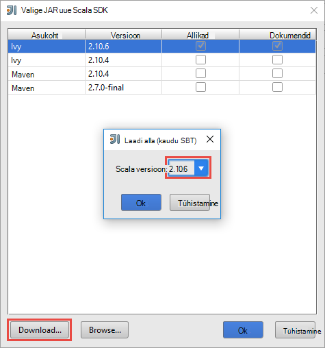
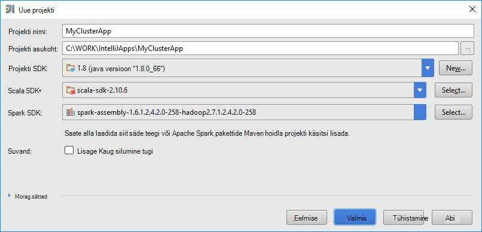
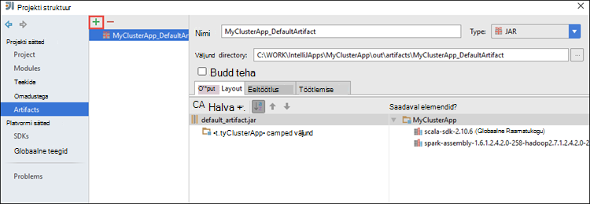
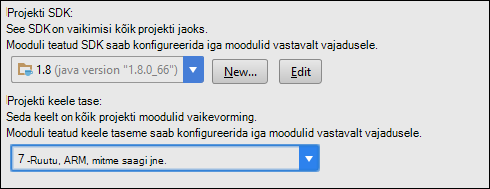
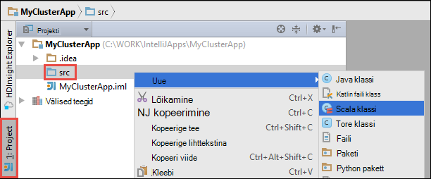

 <properties
    pageTitle="Hdinsightiga tööriistu kasutada Azure tööriistakomplekt huvitav kaugühenduse teel silumine Hdinsightiga säde kogumite töötavad rakendused | Microsoft Azure'i"
    description="Siit saate teada, kuidas Hdinsightiga tööriistu kasutada Azure tööriistakomplekti jaoks huvitav kaugühenduse teel silumine Hdinsightiga säde kogumite töötavad rakendused."
    services="hdinsight"
    documentationCenter=""
    authors="nitinme"
    manager="jhubbard"
    editor="cgronlun"
    tags="azure-portal"/>

<tags
    ms.service="hdinsight"
    ms.workload="big-data"
    ms.tgt_pltfrm="na"
    ms.devlang="na"
    ms.topic="article"
    ms.date="09/09/2016"
    ms.author="nitinme"/>

# Hdinsightiga tööriistu kasutada Azure tööriistakomplekt huvitav silumine säde rakendusi eemalt Hdinsightiga säde Linux kobar

See artikkel annab Hdinsightiga tööriistade kasutamine Azure tööriistakomplekt huvitav esitada säde töökoha Hdinsightiga säde kobar ja seejärel silumine selle kaugühenduse teel oma lauaarvutis üksikasjalikud juhised. Selleks tuleb teha üksikasjalik järgmist:

1. Luua-saidilt või saidi punkti Azure virtuaalse võrgu. Selle dokumendi juhistes eeldatakse, et kasutate saidilt võrku.

2. Luua säde kobar Windows Azure Hdinsightiga, mis on Azure-saidilt virtuaalse võrku.

3. Kontrollige Ühenduvus kobar headnode ja töölaua.

4. Huvitav idee Scala rakenduse loomine ja konfigureerimine remote silumine.

5. Käivita ja silumine rakendus.

##Eeltingimused

* Azure'i tellimuse. Leiate [Azure'i saada tasuta prooviversioon](https://azure.microsoft.com/documentation/videos/get-azure-free-trial-for-testing-hadoop-in-hdinsight/).

* Apache Spark kobar Hdinsightiga Linux. Juhised leiate teemast [loomine Apache Spark kogumite Windows Azure Hdinsightiga sisse](hdinsight-apache-spark-jupyter-spark-sql.md).
 
* Oracle'i Java arenduskomplekt. Saate selle installida [siia](http://www.oracle.com/technetwork/java/javase/downloads/jdk8-downloads-2133151.html).
 
* Huvitav idee. Selles artiklis kasutab versiooni 15.0.1. Saate selle installida [siia](https://www.jetbrains.com/idea/download/).
 
* Azure'i tööriistakomplekti jaoks huvitav Hdinsightiga tööriistad. Huvitav Hdinsightiga tööriistad on saadaval Azure tööriistakomplekt jaoks huvitav osana. Juhised selle kohta, kuidas installida Azure tööriistakomplekt, lugege teemat [installimist Azure tööriistakomplekt jaoks huvitav](../azure-toolkit-for-intellij-installation.md).

* Logige sisse oma huvitav mõte Azure tellimuse. Järgige juhiseid [siin](hdinsight-apache-spark-intellij-tool-plugin.md#log-into-your-azure-subscription).
 
* Kasutate säde Scala rakenduse remote silumine Windows arvutis, võidakse kuvada erandi, nagu on selgitatud [SÄDE-2356](https://issues.apache.org/jira/browse/SPARK-2356) , mille põhjuseks on puudu WinUtils.exe Windows. Selle tõrke lahendamiseks peate asukohta, nt **C:\WinUtils\bin** [käivitatava siit alla laadida](http://public-repo-1.hortonworks.com/hdp-win-alpha/winutils.exe) . Tuleb lisada mõne muutuja **HADOOP_HOME** ja määrake väärtuseks muutuja **C\WinUtils**.

## Samm 1: Luua Azure virtuaalse

Järgige juhiseid selle all luua Azure virtuaalse ja seejärel kontrollige töölaua- ja Azure virtuaalse võrgu Ühenduvus linke.

* [Mõne VNet portaalis Azure-saidilt VPN-ühenduse loomine](../vpn-gateway/vpn-gateway-howto-site-to-site-resource-manager-portal.md)
* [On VNet PowerShelli kaudu-saidilt VPN-ühenduse loomine](../vpn-gateway/vpn-gateway-create-site-to-site-rm-powershell.md)
* [Punkti saidi virtuaalse võrgu PowerShelli kaudu ühenduse konfigureerimine](../vpn-gateway/vpn-gateway-howto-point-to-site-rm-ps.md)

## Samm 2: Looge mõne Hdinsightiga säde kobar

Windows Azure Hdinsightiga, mis on loodud Azure virtuaalse võrku sisse tuleks luua ka mõne Apache Spark kobar. Kasutage saadaoleva teabe [loomine Linux-põhine kogumite Hdinsightiga sisse](hdinsight-hadoop-provision-linux-clusters.md). Valige valikuline konfigureerimise osana Azure virtuaalse võrgu eelmises etapis loodud.

## Samm 3: Kinnitage Ühenduvus kobar headnode ja töölaua

1. Hankida soovitud headnode IP-aadress. Saate avada Ambari UI klaster. Valige keelest kobar **armatuurlaud**.

    

2. Ambari UI, kaudu paremas ülaosas nuppu **Hosts**.

    

3. Peaksite nägema headnodes, töötaja sõlmed ja zookeeper sõlmed loendi. Funktsiooni headnodes on **hn*** eesliide. Klõpsake esimese headnode.

    

4. Kopeerige lehe, mis avab väljalt **Kokkuvõte** allservas IP-aadress on headnode ja hosti nimi.

    

5. IP-aadress ja selle headnode hosti nimi, kuhu soovite käivitada ja eemalt silumine säde töö arvuti **hosts** -faili kaasata. See võimaldab teil suhelda headnode, kasutades IP-aadress, samuti hostname.

    1. Avage notepad laiendatud õigustega. Klõpsake menüü Fail nuppu **Ava** ja seejärel liikuge hosts-faili asukoht. Windowsiga arvutis on `C:\Windows\System32\Drivers\etc\hosts`.

    2. Lisage järgmine **hosts** -faili.

            # For headnode0
            192.xxx.xx.xx hn0-nitinp
            192.xxx.xx.xx hn0-nitinp.lhwwghjkpqejawpqbwcdyp3.gx.internal.cloudapp.net

            # For headnode1
            192.xxx.xx.xx hn1-nitinp
            192.xxx.xx.xx hn1-nitinp.lhwwghjkpqejawpqbwcdyp3.gx.internal.cloudapp.net

5. Arvutis, mille te Hdinsightiga kobar kasutab Azure virtuaalse võrku ühendatud, veenduge, et te saate ping nii selle kasutamise IP-aadressi hostname headnodes.

6. SSH kobar headnode, kasutades juhiseid [ühenduse loomine mõne Hdinsightiga kobar SSH abil](hdinsight-hadoop-linux-use-ssh-windows.md#connect-to-a-linux-based-hdinsight-cluster)sisse. Ping: kobar headnode, lauaarvutis oleva IP-aadress. Ühenduvus nii IP-aadresse määratud arvutisse, ühte võrguühendus ja teine Azure virtuaalse võrgu arvuti on ühendatud, tuleks testida.

7. Korrake juhiseid ka muid headnode. 

## Samm 4: Hdinsightiga tööriistade kasutamine Azure tööriistakomplekt jaoks huvitav säde Scala rakenduse loomine ja konfigureerimine Kaug silumine

1. Käivitage huvitav idee ja uue projekti loomine. Uue projekti dialoogiboksis järgmisi valikuid ja seejärel klõpsake nuppu **edasi**.

    

    * Valige vasakul paanil **Hdinsightiga**.
    * Valige parempoolsel paanil **säde Hdinsightiga (Scala) kohta**.
    * Klõpsake nuppu **edasi**.

2. Järgmise akna, sisestage projekti üksikasjad.

    * Sisestage projekti nimi ja projekti asukoht.
    * **Projekti SDK**, veenduge, et esitate Java versiooni, mis on suurem kui 7.
    * **Scala SDK**, klõpsake nuppu **Loo**, klõpsake nuppu **Laadi alla**ja valige Scala kasutada versiooni. **Veenduge, et kasutate versiooni 2.11.x**. See näide kasutab versiooni **2.10.6**.

        

    * **Säde SDK**, allalaadimine ja kasutamine SDK [siia](http://go.microsoft.com/fwlink/?LinkID=723585&clcid=0x409). Võite ignoreerida seda ja kasutada [säde Maven hoidla](http://mvnrepository.com/search?q=spark) selle asemel, kuid veenduge, et teil on installitud säde rakenduste arendamise õige maven hoidla. (Nt peate veenduge, et teil on installitud, kui kasutate säde Streaming; säde Streaming osa Samuti palun veenduge, et kasutate märgitud Scala 2.10 hoidla - Ärge kasutage hoidla märgitud Scala 2.11.)

        

    * Klõpsake nuppu **valmis**.

3. Projekti säde loob artefakt automaatselt teie eest. Artefakt vaatamiseks toimige järgmiselt.

    1. Klõpsake menüü **fail** nuppu **Projekti struktuuri**.
    2. Klõpsake dialoogiboksis **Projekti struktuuri** **esemeid** vaikimisi artefakt, mis on loodud kuvamiseks.

        

    Samuti saate luua oma artefakt bly klõpsates soovitud **+** ikoon, mis on esile tõstetud pildil.

4. Klõpsake dialoogiboksis **Projekti struktuuri** **projekti**. Kui **Projekti SDK** on seatud 1.8, veenduge, et **Projekt keele tase** on seatud **7 - ruutu, ARM, mitme püük, jne**.

    

4. Teekide lisamine projekti. Dokumenditeegi lisamiseks paremklõpsake projekti puu projekti nime ja seejärel klõpsake käsku **Ava mooduli sätted**. Klõpsake dialoogiboksis **Projekti struktuuri** vasakpoolsel paanil **teekide**, klõpsake nuppu (+) sümbol ja seejärel klõpsake **Maven kaudu**. 

     

    Dialoogiboksis **Allalaadimine teegis Maven hoidla** otsida ja lisada järgmisi teeke.

    * `org.scalatest:scalatest_2.10:2.2.1`
    * `org.apache.hadoop:hadoop-azure:2.7.1`

5. Kopeeri `yarn-site.xml` ja `core-site.xml` kobar headnode kaudu ja lisamine projekti. Failide kopeerimiseks kasutada järgmisi käske. [Cygwin](https://cygwin.com/install.html) abil saate käivitada järgmine `scp` käske Kopeeri failid kobar headnodes.

        scp <ssh user name>@<headnode IP address or host name>://etc/hadoop/conf/core-site.xml .

    Kuna oleme lisanud kobar headnode IP-aadress ja hostinimed küsiks hosts faili töölaual, kasutame **scp** käsud järgmisel viisil.

        scp sshuser@hn0-nitinp:/etc/hadoop/conf/core-site.xml .
        scp sshuser@hn0-nitinp:/etc/hadoop/conf/yarn-site.xml .

    Nende failide lisamine projekti kopeerida need oma projekti puus kaustas **/src** näiteks `<your project directory>\src`.

6. Värskenduse funktsiooni `core-site.xml` järgmisi muudatusi teha.

    1. `core-site.xml`sisaldab seotud klaster salvestusruumi konto krüptitud võti. Klõpsake soovitud `core-site.xml` , et lisatud projekt, asendage krüptitud võti tegelik salvestusruumi võti vaikimisi salvestusruumi kontoga seotud. [Hallata oma salvestusruumi Pääsuklahvide](../storage/storage-create-storage-account.md#manage-your-storage-account)kuvamine

            <property>
                <name>fs.azure.account.key.hdistoragecentral.blob.core.windows.net</name>
                <value>access-key-associated-with-the-account</value>
            </property>

    2. Eemaldage järgmised kirjed on `core-site.xml`.

            <property>
                <name>fs.azure.account.keyprovider.hdistoragecentral.blob.core.windows.net</name>
                <value>org.apache.hadoop.fs.azure.ShellDecryptionKeyProvider</value>
            </property>

            <property>
                <name>fs.azure.shellkeyprovider.script</name>
                <value>/usr/lib/python2.7/dist-packages/hdinsight_common/decrypt.sh</value>
            </property>

            <property>
                <name>net.topology.script.file.name</name>
                <value>/etc/hadoop/conf/topology_script.py</value>
            </property>

    3. Salvestage fail.

7. Lisage põhi klassimärkmiku rakenduse jaoks. **Project Exploreri**Paremklõpsake **src**, käsku **Uus**ja seejärel klõpsake nuppu **Scala klassi**.

    

8. Dialoogiboksis **Loomine Scala uutel** nimi, **Laadi** valige **objekt**, ja seejärel klõpsake nuppu **OK**.

    

9. Klõpsake soovitud `MyClusterAppMain.scala` faili ja kleepige järgmine kood. Järgmine kood tekitab säde konteksti ja käivitab mõne `executeJob` meetod on `SparkSample` objekti.

        import org.apache.spark.{SparkConf, SparkContext}

        object SparkSampleMain {
          def main (arg: Array[String]): Unit = {
            val conf = new SparkConf().setAppName("SparkSample")
                                      .set("spark.hadoop.validateOutputSpecs", "false")
            val sc = new SparkContext(conf)
        
            SparkSample.executeJob(sc,
                                   "wasbs:///HdiSamples/HdiSamples/SensorSampleData/hvac/HVAC.csv",
                                   "wasbs:///HVACOut")
          }
        }

10. Korrake juhiseid 8 ja 9 eespool lisada uue nimega Scala objekti `SparkSample`. Lisage see tund järgmine kood. Järgmine kood loeb (saadaval kõigi Hdinsightiga säde kogumite), HVAC.csv andmeid toob read, mis on ainult ühe numbrikoha CSV seitsmendast veerus ja kirjutab väljund **/HVACOut** jaotises vaikimisi salvestusruumi ümbris klaster.

        import org.apache.spark.SparkContext
    
        object SparkSample {
          def executeJob (sc: SparkContext, input: String, output: String): Unit = {
            val rdd = sc.textFile(input)
        
            //find the rows which have only one digit in the 7th column in the CSV
            val rdd1 =  rdd.filter(s => s.split(",")(6).length() == 1)
        
            val s = sc.parallelize(rdd.take(5)).cartesian(rdd).count()
            println(s)
        
            rdd1.saveAsTextFile(output)
            //rdd1.collect().foreach(println)
          }
        
        }

11. Korrake samme 8 ja 9 ülaltoodud saate lisada uue klassi nimetatakse `RemoteClusterDebugging`. See tund rakendab säde testi raames kasutatava silumine rakendusi. Lisage järgmine kood on `RemoteClusterDebugging` klassi.

        import org.apache.spark.{SparkConf, SparkContext}
        import org.scalatest.FunSuite
        
        class RemoteClusterDebugging extends FunSuite {
        
          test("Remote run") {
            val conf = new SparkConf().setAppName("SparkSample")
                                      .setMaster("yarn-client")
                                      .set("spark.yarn.am.extraJavaOptions", "-Dhdp.version=2.4")
                                      .set("spark.yarn.jar", "wasbs:///hdp/apps/2.4.2.0-258/spark-assembly-1.6.1.2.4.2.0-258-hadoop2.7.1.2.4.2.0-258.jar")
                                      .setJars(Seq("""C:\WORK\IntelliJApps\MyClusterApp\out\artifacts\MyClusterApp_DefaultArtifact\default_artifact.jar"""))
                                      .set("spark.hadoop.validateOutputSpecs", "false")
            val sc = new SparkContext(conf)
        
            SparkSample.executeJob(sc,
              "wasbs:///HdiSamples/HdiSamples/SensorSampleData/hvac/HVAC.csv",
              "wasbs:///HVACOut")
          }
        }

    Mõned olulised asjad, mida siin:
    
    * Jaoks `.set("spark.yarn.jar", "wasbs:///hdp/apps/2.4.2.0-258/spark-assembly-1.6.1.2.4.2.0-258-hadoop2.7.1.2.4.2.0-258.jar")`, veenduge, et säde komplekti JAR on saadaval, klõpsake soovitud klaster salvestusruum määratud tee.
    * Jaoks `setJars`, kus luuakse artefakt jar asukoha määramine. Tavaliselt on `<Your IntelliJ project directory>\out\<project name>_DefaultArtifact\default_artifact.jar`. 

11. Klõpsake soovitud `RemoteClusterDebugging` klassi, paremklõpsake soovitud `test` märksõna ja valige **Loomine RemoteClusterDebugging konfigureerimine**.

    

12. Klõpsake dialoogiboksis konfiguratsiooni nimi ja valige **testi liiki** **testi**nime. Jätke kõik muud väärtused vaikeväärtuseks, klõpsake nuppu **Rakenda**ja seejärel klõpsake nuppu **OK**.

    

13. Nüüd näete **Remote käivitada** konfiguratsiooni rippmenüü menüüriba. 

    

## Juhis 5: Rakenduse käivitada silumine režiimis

1. Avage huvitav idee projektis `SparkSample.scala` ja looge katkestuspunkti 'val rdd1' kõrval. Valige katkestuspunkti loomiseks valige hüpikmenüüst **funktsioon executeJob reale**.

    

2. **Käivitage silumine** kõrval nuppu **Remote käivitada** konfiguratsiooni ripploendi hakatakse rakendus.

    

3. Programmi täitmise jõuab katkestuspunkt, peaksite nägema **siluri** menüü alaosas.

    

4. Klõpsake soovitud (**+**) ikooni lisamine vaadata, nagu on näidatud järgmisel pildil. 

    

    Siin, sest rakendus murdis enne muutuja `rdd1` on loodud, kasutades seda vaadata näeme, mis on esmalt 5 ridu muutuja `rdd`. Vajutage **Sisestage**.

    

    Pildil näete on, et käitusajal, võib päringu terrabytes andmete ja silumine kuidas oma rakenduste arendamise. Näiteks väljund pildil näidatud, näete, et väljund esimene rida on päis. Selle saate muuta oma rakenduse koodi päiserida vahele, kui see on nõutav.

5. Nüüd saate klõpsake **Elulookirjelduse** programmiikooni jätkata oma rakenduse käivitamine.

    

6. Kui rakendus on lõpule jõudnud edukalt, peaksite nägema umbes selline väljund.

    

 

## Vt ka

* [Ülevaade: Apache Spark klõpsake Azure Hdinsightiga](hdinsight-apache-spark-overview.md)

### Stsenaariumid

* [Bi säde: andmeanalüüside interaktiivsed Hdinsightiga säde kasutamine koos Ärianalüüsi tööriistade kohta](hdinsight-apache-spark-use-bi-tools.md)

* [Seadme õppimisega säde: kasutamine säde rakenduses Hdinsightiga building temperatuur HVAC andmete analüüsimiseks](hdinsight-apache-spark-ipython-notebook-machine-learning.md)

* [Seadme õppimisega säde: kasutamine säde Hdinsightiga prognoosida toiduga kontrollitulemuste rakenduses](hdinsight-apache-spark-machine-learning-mllib-ipython.md)

* [Säde Streaming: Kasutamine säde rakenduses reaalajas streaming rakenduste Hdinsightiga](hdinsight-apache-spark-eventhub-streaming.md)

* [Veebisaidi logi analüüs Hdinsightiga säde kasutamine](hdinsight-apache-spark-custom-library-website-log-analysis.md)

### Luua ja kasutada rakendusi

* [Kasutades Scala rakendusena loomine](hdinsight-apache-spark-create-standalone-application.md)

* [Käivitage töö eemalt säde klaster Liviuse abil](hdinsight-apache-spark-livy-rest-interface.md)

### Tööriistad ja laiendid

* [Azure'i tööriistakomplekt huvitav Hdinsightiga tööriistu kasutada luua ja esitada säde Scala rakendusi](hdinsight-apache-spark-intellij-tool-plugin.md)

* [Hdinsightiga tööriistu kasutada Azure tööriistakomplekt Eclipse säde rakenduste loomine](hdinsight-apache-spark-eclipse-tool-plugin.md)

* [Säde kobar klõpsake Hdinsightiga Zeppelin märkmike kasutamine](hdinsight-apache-spark-use-zeppelin-notebook.md)

* [Tuumad Jupyter märkmiku säde kobar Hdinsightiga jaoks saadaval](hdinsight-apache-spark-jupyter-notebook-kernels.md)

* [Välise pakettide Jupyter märkmike kasutamine](hdinsight-apache-spark-jupyter-notebook-use-external-packages.md)

* [Jupyter oma arvutisse installida ja luua ühenduse mõne Hdinsightiga säde kobar](hdinsight-apache-spark-jupyter-notebook-install-locally.md)

### Ressursside haldamine

* [Ressursid Apache Spark kobar rakenduses Windows Azure Hdinsightiga haldamine](hdinsight-apache-spark-resource-manager.md)

* [Töötavate on Apache Spark kobar rakenduses Hdinsightiga jälitamine ja silumine tööde haldamine](hdinsight-apache-spark-job-debugging.md)
