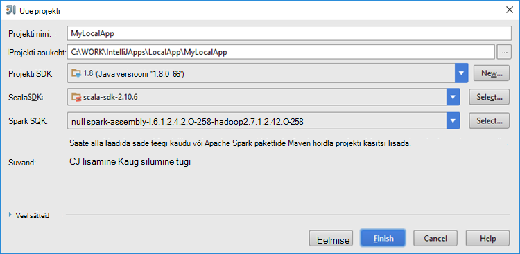

 <properties
    pageTitle="Säde Scala rakenduste jaoks huvitav tööriistakomplekt Azure Hdinsightiga tööriistade kasutamine loomine | Microsoft Azure'i"
    description="Saate teada, kuidas luua eraldiseisev säde rakenduse käivitamiseks klõpsake Hdinsightiga säde kogumite."
    services="hdinsight"
    documentationCenter=""
    authors="nitinme"
    manager="jhubbard"
    editor="cgronlun"
    tags="azure-portal"/>

<tags
    ms.service="hdinsight"
    ms.workload="big-data"
    ms.tgt_pltfrm="na"
    ms.devlang="na"
    ms.topic="article"
    ms.date="09/09/2016"
    ms.author="nitinme"/>

# Hdinsightiga tööriistu kasutada Azure tööriistakomplekt huvitav jaoks luua säde rakendusi Hdinsightiga säde Linux kobar

Sellest artiklist leiate üksikasjalikud juhised väljatöötamise säde taotluste kirjutatud Scala ja esitada, seda ka Hdinsightiga säde klaster jaoks huvitav tööriistakomplekt Azure Hdinsightiga tööriistade kasutamine.  Saate kasutada menüü Tööriistad on mitu võimalust:

* Arendamise ja esitada Scala säde rakenduse kohta on Hdinsightiga säde kobar
* Juurdepääsu oma Azure Hdinsightiga säde kobar ressursid
* Arendamise ja Scala säde rakenduse kohalik käivitamine

Samuti saate jälgida mõne video [siin](https://mix.office.com/watch/1nqkqjt5xonza) võite alustada.

>[AZURE.IMPORTANT] See tööriist saab luua ja esitada ainult mõne Hdinsightiga säde kobar Linux.

##Eeltingimused

* Azure'i tellimuse. Leiate [Azure'i saada tasuta prooviversioon](https://azure.microsoft.com/documentation/videos/get-azure-free-trial-for-testing-hadoop-in-hdinsight/).

* Apache Spark kobar Hdinsightiga Linux. Juhised leiate teemast [loomine Apache Spark kogumite Windows Azure Hdinsightiga sisse](hdinsight-apache-spark-jupyter-spark-sql.md).

* Oracle'i Java arenduskomplekt. Saate selle installida [siia](http://www.oracle.com/technetwork/java/javase/downloads/jdk8-downloads-2133151.html).

* Huvitav idee. Selles artiklis kasutab versiooni 15.0.1. Saate selle installida [siia](https://www.jetbrains.com/idea/download/).

## Installida Azure tööriistakomplekt jaoks huvitav Hdinsightiga tööriistad

Hdinsightiga tööriistade huvitav on saadaval Azure tööriistakomplekt jaoks huvitav osana. Juhised selle kohta, kuidas installida Azure tööriistakomplekt, lugege teemat [installimist Azure tööriistakomplekt jaoks huvitav](../azure-toolkit-for-intellij-installation.md).

## Logige sisse oma Azure tellimuse

1. Käivitage huvitav-IDE ja avage Azure'i Explorer. Klõpsake **Tööriista Windows** ide menüü **Vaade** ja seejärel klõpsake käsku **Azure'i Explorer**.

    

2. Paremklõpsake sõlme **Azure'i** **Azure Explorer**ja valige **Tellimuste haldamine**.

3. Dialoogiboksis **Tellimuste haldamine** klõpsake linki **Logi sisse** ja sisestage mandaat Azure.

    

4. Kui olete sisse logitud, **Tellimuste haldamine** dialoogiboksis on loetletud kõik Azure'i tellimused, mis on seotud identimisteabega. Klõpsake nuppu **Sule** dialoogiboksis.

5. **Azure'i Exploreri** menüü laiendamine **Hdinsightiga** kuvamiseks Hdinsightiga säde rühmad jaotises tellimuse.

    

6. Saate laiendada kobar nimi sõlm klaster seotud ressursside (nt salvestusruumi kontod) kuvamiseks.

    

## Säde Scala rakenduse käitamist on Hdinsightiga säde kobar

1. Käivitage huvitav idee ja uue projekti loomine. Uue projekti dialoogiboksis järgmisi valikuid ja seejärel klõpsake nuppu **edasi**.

    

    * Valige vasakul paanil **Hdinsightiga**.
    * Valige parempoolsel paanil **säde Hdinsightiga (Scala) kohta**.
    * Klõpsake nuppu **edasi**.

2. Järgmise akna, sisestage projekti üksikasjad.

    * Sisestage projekti nimi ja projekti asukoht.
    * **Projekti SDK**, veenduge, et esitate Java versiooni, mis on suurem kui 7.
    * **Scala SDK**, klõpsake nuppu **Loo**, klõpsake nuppu **Laadi alla**ja valige Scala kasutada versiooni. **Veenduge, et kasutate versiooni 2.11.x**. See näide kasutab versiooni **2.10.6**.

        

    * **Säde SDK**, allalaadimine ja kasutamine SDK [siia](http://go.microsoft.com/fwlink/?LinkID=723585&clcid=0x409). Võite ignoreerida seda ja kasutada [säde Maven hoidla](http://mvnrepository.com/search?q=spark) selle asemel, kuid veenduge, et teil on installitud säde rakenduste arendamise õige maven hoidla. (Nt peate veenduge, et teil on installitud, kui kasutate säde Streaming; säde Streaming osa Samuti palun veenduge, et kasutate märgitud Scala 2.10 hoidla - Ärge kasutage hoidla märgitud Scala 2.11.)

        

    * Klõpsake nuppu **valmis**.

3. Projekti säde loob artefakt automaatselt teie eest. Artefakt vaatamiseks toimige järgmiselt.

    1. Klõpsake menüü **fail** nuppu **Projekti struktuuri**.
    2. Klõpsake dialoogiboksis **Projekti struktuuri** **esemeid** vaikimisi artefakt, mis on loodud kuvamiseks.

        

    Samuti saate luua oma artefakt bly klõpsates soovitud **+** ikoon, mis on esile tõstetud pildil.

4. Klõpsake dialoogiboksis **Projekti struktuuri** **projekti**. Kui **Projekti SDK** on seatud 1.8, veenduge, et **Projekt keele tase** on seatud **7 - ruutu, ARM, mitme püük, jne**.

    

5. Lisage oma lähtekoodi.

    1. **Project Exploreri**Paremklõpsake **src**, käsku **Uus**ja seejärel klõpsake nuppu **Scala klassi**.

        

    2. Dialoogiboksis **Loomine Scala uutel** nimi, **Laadi** valige **objekt**, ja seejärel klõpsake nuppu **OK**.

        

    3. Kleepige järgmine kood **MyClusterApp.scala** faili. Järgmine kood loeb (saadaval kõik Hdinsightiga säde kogumite), HVAC.csv andmeid toob read, mis on ainult ühe numbrikoha CSV seitsmendast veerus ja kirjutab väljund **/HVACOut** jaotises vaikimisi salvestusruumi ümbris klaster.

            import org.apache.spark.SparkConf
            import org.apache.spark.SparkContext

            object MyClusterApp{
              def main (arg: Array[String]): Unit = {
                val conf = new SparkConf().setAppName("MyClusterApp")
                val sc = new SparkContext(conf)

                val rdd = sc.textFile("wasbs:///HdiSamples/HdiSamples/SensorSampleData/hvac/HVAC.csv")

                //find the rows which have only one digit in the 7th column in the CSV
                val rdd1 =  rdd.filter(s => s.split(",")(6).length() == 1)

                rdd1.saveAsTextFile("wasbs:///HVACOut")
              }

            }

5. Käivitage rakendus on Hdinsightiga säde kobar.

    1. **Project Explorer**, paremklõpsake projekti nime ja valige **Esitada säde rakenduse Hdinsightile**.

        

    2. Teil palutakse sisestada mandaat Azure'i tellimus. Sisestage dialoogiboksis **Säde esitamise** järgmised väärtused.

        * **Säde kogumite (ainult Linux)**, valige Hdinsightiga säde kobar, kuhu soovite rakenduse käivitada.

        * Vajate artefakt valida huvitav projekt või valige see arvuti kõvakettale.

        * Vastu **põhi klassinimi** tekstivälja, klõpsake kolmikpunkti ( ), valige oma lähtekoodi peamiseks klassi ja seejärel klõpsake nuppu **OK**.

            

        * Kuna rakenduse koodi selles näites ei nõua mis tahes käsurea argumendid või viide purgid või faile, võite ülejäänud teksti lahtrid tühjaks jätta.

        * Pärast küljed, dialoogiboksi näeb välja järgmine.

            

        * Klõpsake **esitada**.

    3. Akna allosas vahekaarti **Säde esitamise** peab algama edenemise kuvamiseks. Soovi korral saate rakenduse lõpetada, klõpsates nuppu punane "Säde esitamise" aknas.

        

    Järgmise jaotise saate teada, kuidas pääseda juurde väljund Hdinsightiga tööriistade kasutamine Azure tööriistakomplekt jaoks huvitav töö.

## Juurdepääsuks ja haldamiseks Hdinsightiga säde kogumite Hdinsightiga tööriistade kasutamine Azure tööriistakomplekt huvitav jaoks

Saate teha mitmesuguseid Hdinsightiga tööriistu, mis on osa Azure'i tööriistakomplekt huvitav abil.

### Töö vaate otse pääseda Hdinsightiga tööriistad

1. **Azure'i Exploreri**laiendada **Hdinsightiga**, laiendage säde kobar nimi ja klõpsake **tööde haldamine**.

2. **Säde töö** vaade kuvatakse parempoolsel paanil kõik rakendused, klaster töötavad. Klõpsake rakenduse nimi, mille jaoks soovite näha rohkem üksikasju.

    

3. **Tõrketeade**, **Töö väljund**, **Liviuse töö logid**ja **Säde draiver logid** väljadele täidetakse valite rakenduse põhjal.

4. Klõpsake vastavaid nuppe ekraani ülaosas saate avada ka **Säde ajalugu Kasutajaliidese** ja **LÕNG kasutajaliides** (tasemel).

### Säde ajaloo sisestamine

1. **Azure'i Exploreri**laiendamine **Hdinsightiga**, paremklõpsake oma säde kobar nimi ja valige **Avatud säde ajalugu UI**. Küsimise korral sisestage administraatori identimisteave klaster. Peab olema eelnevalt määratud neid samal ajal ettevalmistamise klaster.

2. Säde ajalugu serveri armatuurlaual saate vaadata rakenduse te just lõpetanud töötab, kasutades rakenduse nimi. Ülaltoodud kood, seatakse rakenduse nime abil `val conf = new SparkConf().setAppName("MyClusterApp")`. Seega teie säde rakenduse nimi on **MyClusterApp**.

### Käivitage portaalis Ambari

**Azure'i Exploreri**laiendage **Hdinsightiga**, paremklõpsake oma säde kobar nime ja seejärel valige **Avatud kobar haldusportaali (Ambari)**. Küsimise korral sisestage administraatori identimisteave klaster. Peab olema eelnevalt määratud neid samal ajal ettevalmistamise klaster.

### Azure'i tellimuste haldamine

Vaikimisi on loetletud Hdinsightiga Tööriistad: Azure'i tellimused säde rühmad. Vajaduse korral saate määrata tellimused, mille jaoks soovite juurdepääsu klaster. **Azure'i Explorer**, Paremklõpsake sõlme **Azure'i** juurkausta, ja klõpsake **Tellimuste haldamine**. Dialoogiboksi, tühjendage ruudud vastu tellimus, mida te ei soovi juurde pääseda ja seejärel klõpsake nuppu **Sule**. Võite ka klõpsata **Logi välja** kui soovite välja logida Azure tellimuse.

## Kohalik säde Scala rakenduse käivitamiseks

Saate Hdinsightiga tööriistad Azure'i tööriistakomplekt huvitav säde Scala rakenduste käivitamist kohalikult oma töökoha. Tavaliselt selliseid rakendusi ei vaja juurdepääsu kobar ressursside nagu salvestusruumi container ja saate käivitatakse ja kontrollida kohalikult.

### Nõutav

Töötab kohaliku säde Scala rakenduse Windowsi arvuti, võidakse kuvada erandi, nagu on selgitatud [SÄDE-2356](https://issues.apache.org/jira/browse/SPARK-2356) , mille põhjuseks on puudu WinUtils.exe Windows. Selle tõrke lahendamiseks peate asukohta, nt **C:\WinUtils\bin** [käivitatava siit alla laadida](http://public-repo-1.hortonworks.com/hdp-win-alpha/winutils.exe) . Tuleb lisada mõne muutuja **HADOOP_HOME** ja määrake väärtuseks muutuja **C\WinUtils**.

### Kohaliku säde Scala rakenduse käivitamine  

1. Käivitage huvitav idee ja uue projekti loomine. Uue projekti dialoogiboksis järgmisi valikuid ja seejärel klõpsake nuppu **edasi**.

    

    * Valige vasakul paanil **Hdinsightiga**.
    * Valige parempoolsel paanil **säde Hdinsightiga kohaliku käivitada näidise (Scala)**.
    * Klõpsake nuppu **edasi**.

2. Järgmise akna, sisestage projekti üksikasjad.

    * Sisestage projekti nimi ja projekti asukoht.
    * **Projekti SDK**, veenduge, et esitate Java versiooni, mis on suurem kui 7.
    * **Scala SDK**, klõpsake nuppu **Loo**, klõpsake nuppu **Laadi alla**ja valige Scala kasutada versiooni. **Veenduge, et kasutate versiooni 2.11.x**. See näide kasutab versiooni **2.10.6**.

        

    * **Säde SDK**, allalaadimine ja kasutamine SDK [siia](http://go.microsoft.com/fwlink/?LinkID=723585&clcid=0x409). Võite ignoreerida seda ja kasutada [säde Maven hoidla](http://mvnrepository.com/search?q=spark) selle asemel, kuid veenduge, et teil on installitud säde rakenduste arendamise õige maven hoidla. (Nt peate veenduge, et teil on installitud, kui kasutate säde Streaming; säde Streaming osa Samuti palun veenduge, et kasutate märgitud Scala 2.10 hoidla - Ärge kasutage hoidla märgitud Scala 2.11.)

        

    * Klõpsake nuppu **valmis**.

3. Malli lisab proovi kood (**LogQuery**) **src** kaustas, mida saate käitada kohalikku arvutisse.

    

4.  Paremklõpsake **LogQuery** rakendus ja seejärel käsku **"Käivita"LogQuery""**. Kuvatakse umbes järgmine väljund **käivitada** menüü allosas.

    

## Olemasolevate huvitav idee rakenduste kasutamine tööriistakomplekt Azure Hdinsightiga tööriistad huvitav teisendamine

Samuti saate teisendada olemasolevaid säde Scala rakendusi loodud huvitav idee ühilduma huvitav tööriistakomplekt Azure Hdinsightiga tööriistad. See võimaldab teil esitada mõne Hdinsightiga säde kobar rakenduste tööriista kasutamine. Selleks toimige järgmiselt:

1. Mõne olemasoleva säde Scala taotluse huvitav idee abil loodud seotud .iml faili avada.
2. Juurtasemel, kuvatakse **mooduli** elemendi umbes järgmine:

        <module org.jetbrains.idea.maven.project.MavenProjectsManager.isMavenModule="true" type="JAVA_MODULE" version="4">

3. Redigeeri elemendi lisamiseks `UniqueKey="HDInsightTool"` nii, et **mooduli** elemendi näeb välja umbes järgmine:

        <module org.jetbrains.idea.maven.project.MavenProjectsManager.isMavenModule="true" type="JAVA_MODULE" version="4" UniqueKey="HDInsightTool">

4. Salvestage muudatused. Rakenduse peaks nüüd ühilduma huvitav tööriistakomplekt Azure Hdinsightiga tööriistad. Te saate testida, paremklõpsates Project Explorer projekti nime. Valige hüpikmenüüst peaks nüüd olema võimalus **Esitada säde rakenduse Hdinsightiga**.

## Tõrkeotsing

### Kohalik käivitamine tõrge "Kasutage hunnik suuremaks"

Säde 1,6, kui kasutate 32-bitine Java SDK kohaliku käitamisel võib ilmneda järgmistest tõrketeadetest:

    Exception in thread "main" java.lang.IllegalArgumentException: System memory 259522560 must be at least 4.718592E8. Please use a larger heap size.
        at org.apache.spark.memory.UnifiedMemoryManager$.getMaxMemory(UnifiedMemoryManager.scala:193)
        at org.apache.spark.memory.UnifiedMemoryManager$.apply(UnifiedMemoryManager.scala:175)
        at org.apache.spark.SparkEnv$.create(SparkEnv.scala:354)
        at org.apache.spark.SparkEnv$.createDriverEnv(SparkEnv.scala:193)
        at org.apache.spark.SparkContext.createSparkEnv(SparkContext.scala:288)
        at org.apache.spark.SparkContext.<init>(SparkContext.scala:457)
        at LogQuery$.main(LogQuery.scala:53)
        at LogQuery.main(LogQuery.scala)
        at sun.reflect.NativeMethodAccessorImpl.invoke0(Native Method)
        at sun.reflect.NativeMethodAccessorImpl.invoke(NativeMethodAccessorImpl.java:57)
        at sun.reflect.DelegatingMethodAccessorImpl.invoke(DelegatingMethodAccessorImpl.java:43)
        at java.lang.reflect.Method.invoke(Method.java:606)
        at com.intellij.rt.execution.application.AppMain.main(AppMain.java:144)

Selle põhjuseks on kuhja maht pole piisavalt suur, säde käivitamiseks, kuna säde jaoks on vaja vähemalt 471MB (saab teile rohkem üksikasju [SÄDE-12081](https://issues.apache.org/jira/browse/SPARK-12081) kui soovite). Üks lihtne lahendus on 64-bitine Java SDK kasutada. Saate muuta ka huvitav töötab sätteid, lisades järgmistest suvanditest:

    -Xms128m -Xmx512m -XX:MaxPermSize=300m -ea

## Tagasiside ja teadaolevad probleemid

Kuvatud säde väljundid otse ei toetata ja mis kohta.

Kui teil on ettepanekuid või tagasiside või kui teil tekib probleeme, kasutades seda tööriista, võite kukutage meile e-posti hdivstool microsoft dot com.

## Vt ka

* [Ülevaade: Apache Spark klõpsake Azure Hdinsightiga](hdinsight-apache-spark-overview.md)

### Stsenaariumid

* [Bi säde: andmeanalüüside interaktiivsed Hdinsightiga säde kasutamine koos Ärianalüüsi tööriistade kohta](hdinsight-apache-spark-use-bi-tools.md)

* [Seadme õppimisega säde: kasutamine säde rakenduses Hdinsightiga building temperatuur HVAC andmete analüüsimiseks](hdinsight-apache-spark-ipython-notebook-machine-learning.md)

* [Seadme õppimisega säde: kasutamine säde Hdinsightiga prognoosida toiduga kontrollitulemuste rakenduses](hdinsight-apache-spark-machine-learning-mllib-ipython.md)

* [Säde Streaming: Kasutamine säde rakenduses reaalajas streaming rakenduste Hdinsightiga](hdinsight-apache-spark-eventhub-streaming.md)

* [Veebisaidi logi analüüs Hdinsightiga säde kasutamine](hdinsight-apache-spark-custom-library-website-log-analysis.md)

### Luua ja kasutada rakendusi

* [Kasutades Scala rakendusena loomine](hdinsight-apache-spark-create-standalone-application.md)

* [Käivitage töö eemalt säde klaster Liviuse abil](hdinsight-apache-spark-livy-rest-interface.md)

### Tööriistad ja laiendid

* [Hdinsightiga tööriistu kasutada Azure tööriistakomplekt huvitav silumine säde rakenduste kaugühenduse teel](hdinsight-apache-spark-intellij-tool-plugin-debug-jobs-remotely.md)

* [Hdinsightiga tööriistu kasutada Azure tööriistakomplekt Eclipse säde rakenduste loomine](hdinsight-apache-spark-eclipse-tool-plugin.md)

* [Säde kobar klõpsake Hdinsightiga Zeppelin märkmike kasutamine](hdinsight-apache-spark-use-zeppelin-notebook.md)

* [Tuumad Jupyter märkmiku säde kobar Hdinsightiga jaoks saadaval](hdinsight-apache-spark-jupyter-notebook-kernels.md)

* [Välise pakettide Jupyter märkmike kasutamine](hdinsight-apache-spark-jupyter-notebook-use-external-packages.md)

* [Jupyter oma arvutisse installida ja luua ühenduse mõne Hdinsightiga säde kobar](hdinsight-apache-spark-jupyter-notebook-install-locally.md)

### Ressursside haldamine

* [Ressursid Apache Spark kobar rakenduses Windows Azure Hdinsightiga haldamine](hdinsight-apache-spark-resource-manager.md)

* [Töötavate on Apache Spark kobar rakenduses Hdinsightiga jälitamine ja silumine tööde haldamine](hdinsight-apache-spark-job-debugging.md)
