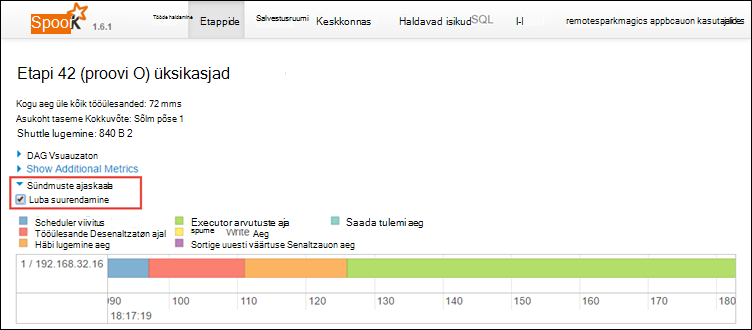

<properties 
    pageTitle="Jälitamiseks ja silumine töö töötab Apache Spark klaster rakenduses Hdinsightiga | Microsoft Azure'i" 
    description="LÕNG UI, säde Kasutajaliidese ja säde ajalugu serveri abil jälgida ja silumine töid säde klaster rakenduses Windows Azure Hdinsightiga" 
    services="hdinsight" 
    documentationCenter="" 
    authors="nitinme" 
    manager="jhubbard" 
    editor="cgronlun"
    tags="azure-portal"/>

<tags 
    ms.service="hdinsight" 
    ms.workload="big-data" 
    ms.tgt_pltfrm="na" 
    ms.devlang="na" 
    ms.topic="article" 
    ms.date="08/25/2016" 
    ms.author="nitinme"/>

# Töötab Apache Spark kobar Hdinsightiga Linux jälitamiseks ja silumine tööde haldamine

Sellest artiklist saate teada, kuidas jälgida ja silumine säde töö LÕNG UI, säde Kasutajaliidese ja säde ajalugu serveri abil. Selles artiklis me alustame säde töö saadaval märkmiku kasutamine säde kobar, **masina õ: ennustav analüüs toiduga kontrolli abil MLLib**. Saate kasutada näiteks **säde esitada**rakendus, mille saatsite abil muu lähenemine ka, jälgida alltoodud juhiseid.

##Eeltingimused

Vajate järgmist:

- Azure'i tellimuse. Leiate [Azure'i saada tasuta prooviversioon](https://azure.microsoft.com/documentation/videos/get-azure-free-trial-for-testing-hadoop-in-hdinsight/).
- Apache Spark kobar Hdinsightiga Linux. Juhised leiate teemast [loomine Apache Spark kogumite Windows Azure Hdinsightiga sisse](hdinsight-apache-spark-jupyter-spark-sql.md).
- Mida on alustanud, märkmik, kus töötab **[masina õ: ennustav analüüs toiduga kontrolli abil MLLib](hdinsight-apache-spark-machine-learning-mllib-ipython.md)**. Juhised selle märkmiku käivitamiseks klõpsake linki.  

## Rakenduse LÕNG UI jälgimine

1. Käivitage LÕNG UI. Keelest kobar **Kobar armatuurlaua**nuppu ja klõpsake **LÕNG**.

    

    >[AZURE.TIP] Teise võimalusena võite käivitada LÕNG UI Ambari Kasutajaliidese kaudu. Ambari UI, keelest kobar käivitamiseks valige **Kobar armatuurlaud**, ja klõpsake **Hdinsightiga kobar armatuurlaua**. Ambari kasutajaliidese, klõpsake **LÕNG**, klõpsake **Kiirlingid**, klõpsake aktiivse ressursihaldur ja klõpsake **ResourceManager UI**.  

3. Kuna teie alustatud säde tööd, kasutades Jupyter märkmikke, taotlus on nimi **remotesparkmagics** (see on kõik rakendused, mis on käivitatud märkmikud nimi). Klõpsake rakenduse ID töö kohta lisateabe saamiseks rakenduse nime. See käivitab rakenduse vaade.

    

    Selliseid rakendusi, mis käivitatakse Jupyter märkmikke, olek on alati **töötab** märkmiku sulgemiseni.

4. Rakenduse vaates saab süvitsi minna veelgi teada saada, ümbriste, mis on seotud rakenduse ja logid (stdout/stderr). Rakenduse säde UI, klõpsates soovitud linkimise vastav **Jälgimise URL-i**, nagu allpool näidatud. 

    

## Rakenduse säde UI jälgimine

Säde UI, saab süvitsi säde tööle, mis on kudenud poolt varem alustatud rakendus.

1. Säde UI, vaatest rakenduse käivitamiseks klõpsake linki vastu **Jälgimise URL-i**, nagu on näidatud ekraanipildi kohal. Saate vaadata kõik säde tööd, mis on algatatud Jupyter märkmikus rakendus.

    

2. Klõpsake vahekaarti **haldavad isikud** iga executor andmetöötlus ja teabe kuvamiseks. Kõne virnas saate alla laadida ka, klõpsates linki **Lõime Dump** .

    
 
3. Klõpsake vahekaarti **etappide** vaatamiseks ja sellega seotud etapid.

    

    Iga etapi võib olla mitu ülesannet, mis saate vaadata täitmise statistika, nagu allpool näidatud.

     

4. Etapi lehel üksikasjad, võite käivitada DAG visualiseering. Klõpsake lehe ülaosas linki **DAG visualiseeringu** laiendada, nagu allpool näidatud.

    

    DAG või otsene Aclyic graafik tähistab eri rakenduse. Iga sinine ruut Graphi tähistab säde toiming, rakenduse kaudu kasutada.

5. Etapi lehel üksikasjad, võite käivitada ka rakenduse ajaskaala vaates. Klõpsake lehe ülaosas linki **Sündmuste ajaskaala** laiendada, nagu allpool näidatud.

    

    Kuvatakse säde sündmuste ajaskaala kujul. Ajaskaala vaates on saadaval kolme tasanditel kogu tööd, töö, ja etapp. Pildil sisaldab Ajavaade antud etapi.

    >[AZURE.TIP] Kui märgite ruudu **Luba suumimise** , saate kerida vasakule ja paremale üle ajaskaala vaates.

6. Muud vahekaardid säde UI jagab säde eksemplari ka teavet.

    * Salvestusruumi vahekaart – kui rakenduse loob mõne RDDs leiate teavet isikute salvestusruumi menüüs.
    * Keskkonna vahekaardilt - sellel vahekaardil leiate kasulikku teavet oma säde eksemplari palju näiteks on 
        * Scala versioon
        * Sündmuste logi seotud klaster kataloog
        * Rakenduse executor valdkond arv
        * Jne.

## Otsige teavet valmis projektide säde ajalugu serveri kasutamine

Kui tööd on lõpule jõudnud, on teavet töö püsis säde ajalugu serveris.

1. Säde ajalugu serveri keelest kobar käivitamiseks valige **Kobar armatuurlaud**ja klõpsake **Säde ajalugu Server**.

    

    >[AZURE.TIP] Teise võimalusena võite käivitada Ambari UI UI säde ajalugu Server. Ambari UI, keelest kobar käivitamiseks valige **Kobar armatuurlaud**, ja klõpsake **Hdinsightiga kobar armatuurlaua**. Ambari kasutajaliidese, **säde**, klõpsake **Kiirlingid**ja klõpsake **Säde ajalugu serveri UI**.

2. Kuvatakse kõik lõpuleviidud rakenduste loendis. Klõpsake rakenduse ID lisateabe saamiseks rakendusse süvitsi.

    
    

## Vt ka

* [Ülevaade: Apache Spark klõpsake Azure Hdinsightiga](hdinsight-apache-spark-overview.md)

### Stsenaariumid

* [Bi säde: andmeanalüüside interaktiivsed Hdinsightiga säde kasutamine koos Ärianalüüsi tööriistade kohta](hdinsight-apache-spark-use-bi-tools.md)

* [Seadme õppimisega säde: kasutamine säde rakenduses Hdinsightiga building temperatuur HVAC andmete analüüsimiseks](hdinsight-apache-spark-ipython-notebook-machine-learning.md)

* [Seadme õppimisega säde: kasutamine säde Hdinsightiga prognoosida toiduga kontrollitulemuste rakenduses](hdinsight-apache-spark-machine-learning-mllib-ipython.md)

* [Säde Streaming: Kasutamine säde rakenduses reaalajas streaming rakenduste Hdinsightiga](hdinsight-apache-spark-eventhub-streaming.md)

* [Veebisaidi logi analüüs Hdinsightiga säde kasutamine](hdinsight-apache-spark-custom-library-website-log-analysis.md)

### Luua ja kasutada rakendusi

* [Kasutades Scala rakendusena loomine](hdinsight-apache-spark-create-standalone-application.md)

* [Käivitage töö eemalt säde klaster Liviuse abil](hdinsight-apache-spark-livy-rest-interface.md)

### Tööriistad ja laiendid

* [Hdinsightiga tööriistade lisandmooduli huvitav idee abil saate luua ja esitage säde Scala rakendusi](hdinsight-apache-spark-intellij-tool-plugin.md)

* [Hdinsightiga tööriistade lisandmooduli huvitav idee abil silumine säde rakenduste kaugühenduse teel](hdinsight-apache-spark-intellij-tool-plugin-debug-jobs-remotely.md)

* [Säde kobar klõpsake Hdinsightiga Zeppelin märkmike kasutamine](hdinsight-apache-spark-use-zeppelin-notebook.md)

* [Tuumad Jupyter märkmiku säde kobar Hdinsightiga jaoks saadaval](hdinsight-apache-spark-jupyter-notebook-kernels.md)

* [Välise pakettide Jupyter märkmike kasutamine](hdinsight-apache-spark-jupyter-notebook-use-external-packages.md)

* [Jupyter oma arvutisse installida ja luua ühenduse mõne Hdinsightiga säde kobar](hdinsight-apache-spark-jupyter-notebook-install-locally.md)

### Ressursside haldamine

* [Ressursid Apache Spark kobar rakenduses Windows Azure Hdinsightiga haldamine](hdinsight-apache-spark-resource-manager.md)
