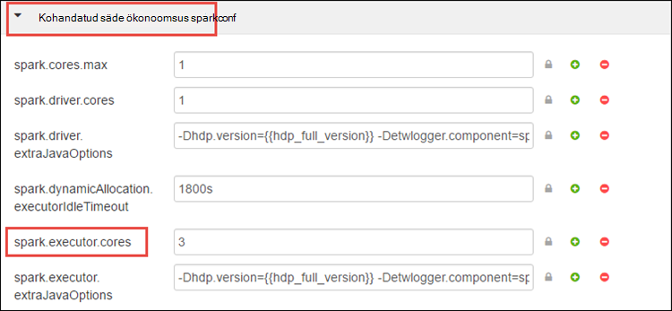

<properties 
    pageTitle="Kasuta ressursihaldur eraldada ressursse Apache Spark klaster sisse Hdinsightile | Microsoft Azure'i" 
    description="Saate teada, kuidas kasutada ressursihaldur säde kogumite parema jõudluse kohta Hdinsightiga." 
    services="hdinsight" 
    documentationCenter="" 
    authors="nitinme" 
    manager="jhubbard" 
    editor="cgronlun"
    tags="azure-portal"/>

<tags 
    ms.service="hdinsight" 
    ms.workload="big-data" 
    ms.tgt_pltfrm="na" 
    ms.devlang="na" 
    ms.topic="article" 
    ms.date="08/25/2016" 
    ms.author="nitinme"/>

# Ressursid Apache Spark kobar Hdinsightiga Linux haldamine

Sellest artiklist saate teada, kuidas liideste Ambari UI, LÕNG UI, nt juurdepääsu ja säde ajalugu serveri seostatud klaster säde. Samuti saate teada, kuidas häälestada kobar konfiguratsiooni optimaalse jõudluse kohta.

**Eeltingimused**

Vajate järgmist:

- Azure'i tellimuse. Leiate [Azure'i saada tasuta prooviversioon](https://azure.microsoft.com/documentation/videos/get-azure-free-trial-for-testing-hadoop-in-hdinsight/).
- Apache Spark kobar Hdinsightiga Linux. Juhised leiate teemast [loomine Apache Spark kogumite Windows Azure Hdinsightiga sisse](hdinsight-apache-spark-jupyter-spark-sql.md).

## Kuidas ma Ambari Web UI käivitada?

1. [Azure portaali](https://portal.azure.com/)kaudu startboard, klõpsake paani klaster säde (kui te kinnitatud selle startboard). Samuti saate liikuda klaster jaotises **Sirvi kõiki** > **Hdinsightiga kogumite**. 
 
2. Valige keelest säde kobar **armatuurlaud**. Küsimise korral sisestage administraatori identimisteave säde kobar.

    ![Käivitage Ambari] (./media/hdinsight-apache-spark-resource-manager/hdispark.cluster.launch.dashboard.png "Ressursihaldur käivitamine")

3. See peaks käivitama Ambari Web UI, nagu allpool näidatud.

    ![Ambari Web UI] (./media/hdinsight-apache-spark-resource-manager/ambari-web-ui.png "Ambari Web UI")   

## Kuidas ma käivitada Server säde ajalugu?

1. [Azure portaali](https://portal.azure.com/)kaudu startboard, klõpsake paani klaster säde (kui te kinnitatud selle startboard).

2. Valige keelest kobar jaotises **Kiirlingid** **Kobar armatuurlaud**. Klõpsake **Kobar armatuurlaua** labale **Säde ajaloo Server**.

    ![Säde ajaloo Server] (./media/hdinsight-apache-spark-resource-manager/launch-history-server.png "Säde ajalugu Server")

    Küsimise korral sisestage administraatori identimisteave säde kobar.

## Kuidas ma käivitada lõng kasutajaliides?

Saate jälgida rakendusi, mis on praegu töötavate säde kobar LÕNG UI. 

1. Keelest kobar **Kobar armatuurlaua**nuppu ja klõpsake **LÕNG**.

    

    >[AZURE.TIP] Teise võimalusena võite käivitada LÕNG UI Ambari kasutajaliidese. Ambari UI, keelest kobar käivitamiseks valige **Kobar armatuurlaud**, ja klõpsake **Hdinsightiga kobar armatuurlaua**. Ambari kasutajaliidese, klõpsake **LÕNG**, klõpsake **Kiirlingid**, klõpsake aktiivse ressursihaldur ja klõpsake **ResourceManager UI**.

## Mis on optimaalne kobar konfiguratsiooni käivitada säde rakendusi?

Kolme klahv parameetrid, mida saab kasutada säde konfiguratsiooni sõltuvalt rakenduse nõuded on `spark.executor.instances`, `spark.executor.cores`, ja `spark.executor.memory`. Testamenditäitja on käivitanud säde rakenduse protsess. See töötab töötaja sõlm ja vastutab rakenduse ülesandeid täita. Haldavad isikud ja executor suurused jaoks iga kobar vaikearvu arvutatakse arvu töötaja sõlmed ja töötaja sõlm suurus. Need on talletatud `spark-defaults.conf` kobar pea sõlmed. 

Kolm konfiguratsiooni parameetrid saab konfigureerida tasemel kobar (kõik rakendused, mis töötavad klaster) või saab määrata iga taotluse ka.

### Parameetrite, kasutades Ambari UI muutmine

1. Kasutajaliidese Ambari **säde**, klõpsake **Configs**ja seejärel laiendage **kohandatud säde-vaikesätted**.

    

2. Vaikeväärtused on hea omada 4 säde rakendusi käivitada üheaegselt klaster. Saate muudatused need väärtused kasutajaliides, nagu allpool näidatud.

    

3. Klõpsake nuppu **Salvesta** konfiguratsiooni muudatused salvestada. Klõpsake lehe ülaosas palutakse teil taaskäivitage kõik teenused. Klõpsake **uuesti**.

    

### Rakenduse Jupyter märkmik käitamise parameetrite muutmine

Rakenduste töötamine Jupyter märkmikku, saate kasutada funktsiooni `%%configure` maagiline konfiguratsiooni muudatusi teha. Ideaalvariandis mitte, tuleb teil teha selliseid muudatusi, saate oma esimesse lahtrisse koodi käivitada enne rakenduse alguses. See tagab, et konfiguratsiooni on rakendatud Liviuse seansi, millal seda saab luua. Kui soovite muuta rakenduse hiljem konfiguratsiooni, kasutage funktsiooni `-f` parameeter. Siiski seda tehes nii, et kõik edenemise rakenduse lähevad kaotsi.

Allpool koodilõigu näitab, kuidas muuta rakendus töötab Jupyter konfigureerimine.

    %%configure 
    {"executorMemory": "3072M", "executorCores": 4, “numExecutors”:10}

Konfiguratsiooni parameetrid peab olema möödunud JSON stringina ja tuleb pärast maagiline, nagu on näidatud veerus näide järgmisele reale. 

### Taotluse abil parameetrid säde esitada muutmine

Järgmine käsk on näide sellest, kuidas muuta konfiguratsiooni parameetrid paketi rakenduse, mis on esitatud abil `spark-submit`.

    spark-submit --class <the application class to execute> --executor-memory 3072M --executor-cores 4 –-num-executors 10 <location of application jar file> <application parameters>

### Taotluse abil cURL parameetrite muutmine

Järgmine käsk on näide sellest, kuidas muuta paketi rakendus, mis on esitatud kasutatakse cURL konfiguratsiooni parameetrid.

    curl -k -v -H 'Content-Type: application/json' -X POST -d '{"file":"<location of application jar file>", "className":"<the application class to execute>", "args":[<application parameters>], "numExecutors":10, "executorMemory":"2G", "executorCores":5' localhost:8998/batches

### Kuidas muuta järgmiste parameetrite säde ökonoomsus serveris?

Säde ökonoomsus Server pakub JDBC/ODBC-juurdepääsu säde kobar ja kasutatakse teenuse säde SQL-päringud. Tööriistad (nt Power BI sellele jne). ODBC-protokolli abil saate suhelda säde ökonoomsus serveri käivitada säde SQL-päringud säde rakendus. Säde kobar loomisel kaks eksemplari säde ökonoomsus Server on käivitatud, üks iga pea sõlme. Iga säde ökonoomsus Server on nähtav säde rakendus LÕNG UI. 

Säde ökonoomsus Server kasutab säde dünaamiline executor eraldatud ja seega on `spark.executor.instances` ei kasutata. Selle asemel säde ökonoomsus Server kasutab `spark.dynamicAllocation.minExecutors` ja `spark.dynamicAllocation.maxExecutors` executor arvu määramiseks. Konfiguratsiooni parameetrid `spark.executor.cores` ja `spark.executor.memory` kasutatakse executor suuruse muutmiseks. Saate muuta järgmiste parameetrite, nagu allpool näidatud.

* Laiendage kategooriat **Täpsemalt spark ökonoomsus sparkconf** värskendamiseks parameetrid `spark.dynamicAllocation.minExecutors`, `spark.dynamicAllocation.maxExecutors`, ja `spark.executor.memory`.

     

* Laiendage **kohandatud säde-ökonoomsus-sparkconf** kategooriat värskendamiseks parameetri `spark.executor.cores`.

    

### Kuidas muuta draiveri mälu säde ökonoomsus serveri?

Säde ökonoomsus serveri draiver mälu on konfigureeritud 25% pea sõlme RAM suurus, tingimusel, et pea sõlme kokku RAM maht on suurem kui 14GB. Ambari Kasutajaliidese abil saate muuta draiveri mälu konfiguratsiooni, nagu allpool näidatud.

* Ambari kasutajaliidese klõpsake **säde**, klõpsake **Configs**, laiendage **Täpsemad säde-keskkonna**ja seejärel väärtuse ette **spark_thrift_cmd_opts**.

    

## Ma ei kasuta BI säde kobar abil. Kuidas ressursside tagasi võtta?

Kuna säde dünaamiline jaotamine kasutamiseks ainult ressursse, mis tarbib ökonoomsus server on kaks rakenduse meistrid ressursse. Järgmiste ressursside Peatage töötavate klaster ökonoomsus serveri teenuseid.

1. Ambari UI, vasakpoolsel paanil nuppu **säde**.

2. Klõpsake järgmisel lehel **Säde ökonoomsus serverites**.

    

3. Peaksite nägema kaks headnodes, kus säde ökonoomsus Server töötab. Klõpsake soovitud headnodes.

    

4. Järgmisel lehel on loetletud kõik selle headnode töötavate teenuste. Loendist säde ökonoomsus serveri kõrval rippmenüü nuppu ja seejärel klõpsake nuppu **Lõpeta**.

    

5. Korrake neid juhiseid ka muude headnode kohta.

## Minu Jupyter märkmikke ei tööta ootuspäraselt. Kuidas teenust uuesti?

1. Käivitage Ambari Web UI, nagu eespool näidatud. Vasakpoolselt navigeerimispaanilt **Jupyter**, nuppu **Rakendused**ja seejärel klõpsake nuppu **Taaskäivitage kõik**. See käivitab Jupyter teenuse kõigi headnodes.

    ![Jupyter taaskäivitamine] (./media/hdinsight-apache-spark-resource-manager/restart-jupyter.png "Taaskäivitage Jupyter")

    

## Vt ka

* [Ülevaade: Apache Spark klõpsake Azure Hdinsightiga](hdinsight-apache-spark-overview.md)

### Stsenaariumid

* [Bi säde: andmeanalüüside interaktiivsed Hdinsightiga säde kasutamine koos Ärianalüüsi tööriistade kohta](hdinsight-apache-spark-use-bi-tools.md)

* [Seadme õppimisega säde: kasutamine säde rakenduses Hdinsightiga building temperatuur HVAC andmete analüüsimiseks](hdinsight-apache-spark-ipython-notebook-machine-learning.md)

* [Seadme õppimisega säde: kasutamine säde Hdinsightiga prognoosida toiduga kontrollitulemuste rakenduses](hdinsight-apache-spark-machine-learning-mllib-ipython.md)

* [Säde Streaming: Kasutamine säde rakenduses reaalajas streaming rakenduste Hdinsightiga](hdinsight-apache-spark-eventhub-streaming.md)

* [Veebisaidi logi analüüs Hdinsightiga säde kasutamine](hdinsight-apache-spark-custom-library-website-log-analysis.md)

### Luua ja kasutada rakendusi

* [Kasutades Scala rakendusena loomine](hdinsight-apache-spark-create-standalone-application.md)

* [Käivitage töö eemalt säde klaster Liviuse abil](hdinsight-apache-spark-livy-rest-interface.md)

### Tööriistad ja laiendid

* [Hdinsightiga tööriistade lisandmooduli huvitav idee abil saate luua ja esitage säde Scala rakendusi](hdinsight-apache-spark-intellij-tool-plugin.md)

* [Hdinsightiga tööriistade lisandmooduli huvitav idee abil silumine säde rakenduste kaugühenduse teel](hdinsight-apache-spark-intellij-tool-plugin-debug-jobs-remotely.md)

* [Säde kobar klõpsake Hdinsightiga Zeppelin märkmike kasutamine](hdinsight-apache-spark-use-zeppelin-notebook.md)

* [Tuumad Jupyter märkmiku säde kobar Hdinsightiga jaoks saadaval](hdinsight-apache-spark-jupyter-notebook-kernels.md)

* [Välise pakettide Jupyter märkmike kasutamine](hdinsight-apache-spark-jupyter-notebook-use-external-packages.md)

* [Jupyter oma arvutisse installida ja luua ühenduse mõne Hdinsightiga säde kobar](hdinsight-apache-spark-jupyter-notebook-install-locally.md)

### Ressursside haldamine

* [Töötavate on Apache Spark kobar rakenduses Hdinsightiga jälitamine ja silumine tööde haldamine](hdinsight-apache-spark-job-debugging.md)

[hdinsight-versions]: hdinsight-component-versioning.md
[hdinsight-upload-data]: hdinsight-upload-data.md
[hdinsight-storage]: hdinsight-hadoop-use-blob-storage.md

[azure-purchase-options]: http://azure.microsoft.com/pricing/purchase-options/
[azure-member-offers]: http://azure.microsoft.com/pricing/member-offers/
[azure-free-trial]: http://azure.microsoft.com/pricing/free-trial/
[azure-management-portal]: https://manage.windowsazure.com/
[azure-create-storageaccount]: storage-create-storage-account.md 
