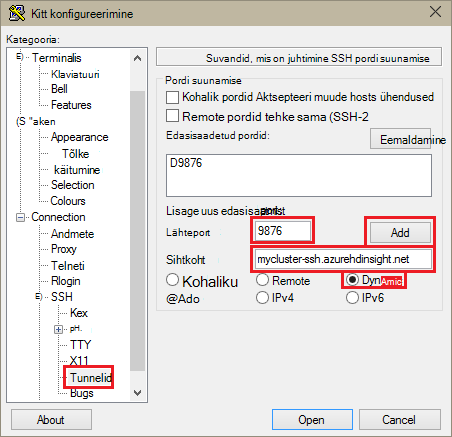
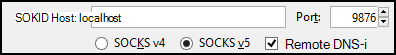
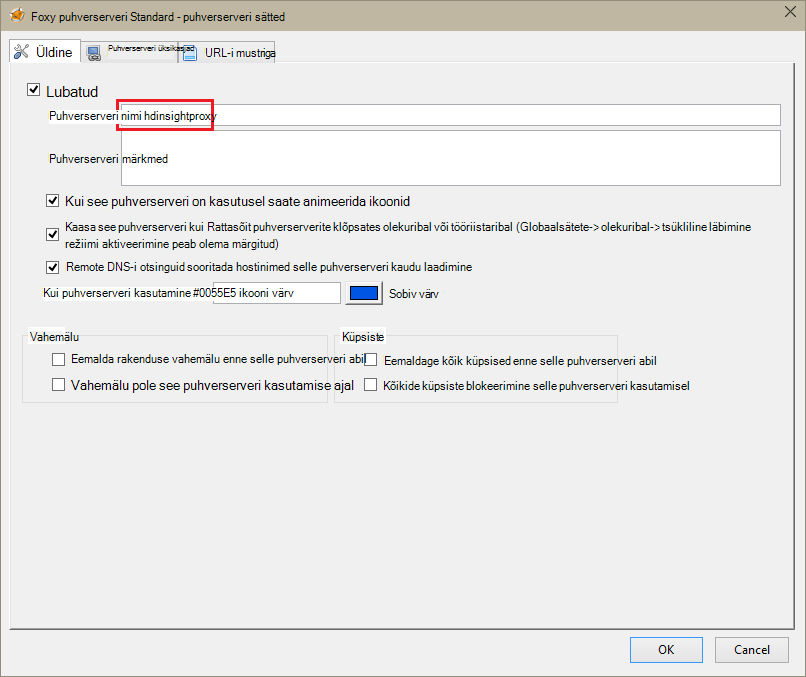
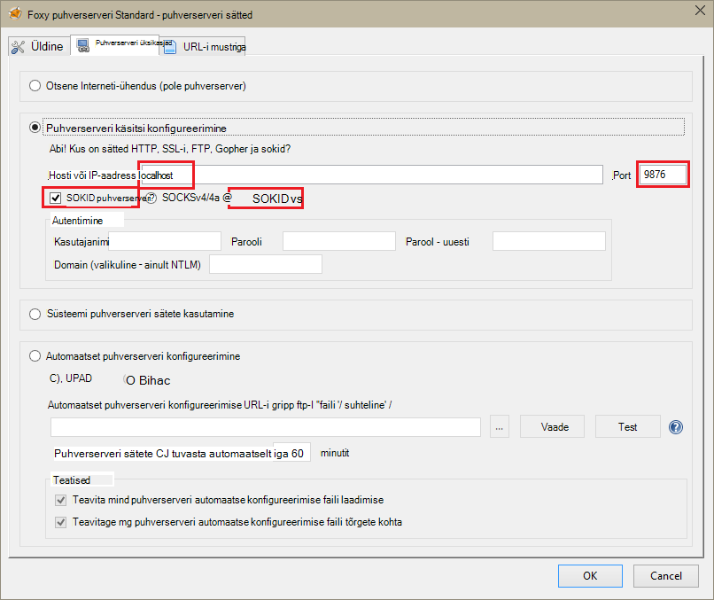
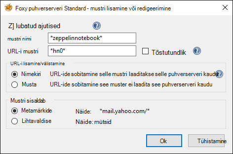
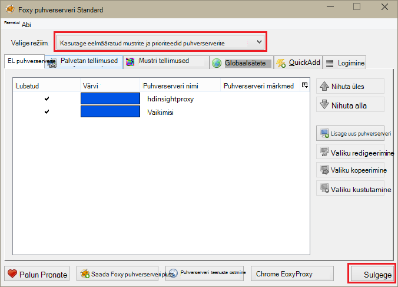

<properties 
    pageTitle="Installida Apache Spark kobar Zeppelin märkmikud Hdinsightiga Linux | Microsoft Azure'i" 
    description="Üksikasjalike juhiste kohta, kuidas installida ja kasutada koos säde kogumite Hdinsightiga Linux Zeppelin märkmikud." 
    services="hdinsight" 
    documentationCenter="" 
    authors="nitinme" 
    manager="jhubbard" 
    editor="cgronlun"/>

<tags 
    ms.service="hdinsight" 
    ms.workload="big-data" 
    ms.tgt_pltfrm="na" 
    ms.devlang="na" 
    ms.topic="article" 
    ms.date="10/28/2016" 
    ms.author="nitinme"/>

# Installida Hdinsightiga Linux Zeppelin märkmikud Apache Spark kobar

Siit saate teada, kuidas installida Zeppelin märkmike Apache Spark kogumite ja Zeppelin märkmike abil saate käivitada säde tööd.

> [AZURE.IMPORTANT] Zeppelin märkmike on nüüd saadaval säde kogumite vaikimisi. Peate ei installida neile konkreetselt enam säde kobar. Lisateavet leiate teemast [kasutamine Zeppelin märkmikke Apache Spark klaster Hdinsightiga Linux](hdinsight-apache-spark-zeppelin-notebook.md). 

**Eeltingimused**

* Enne alustamist selles õpetuses, peab teil olema Azure tellimuse. Leiate [Azure'i saada tasuta prooviversioon](https://azure.microsoft.com/documentation/videos/get-azure-free-trial-for-testing-hadoop-in-hdinsight/).
* Mõne Apache Spark kobar. Juhised leiate teemast [loomine Apache Spark kogumite Windows Azure Hdinsightiga sisse](hdinsight-apache-spark-jupyter-spark-sql.md).
* SSH kliendi. Unix ja Linux jaotuse või Mac OS X, on `ssh` käsk on esitatud operatsioonisüsteemi. Windowsi jaoks, siis soovitame [PuTTY](http://www.chiark.greenend.org.uk/~sgtatham/putty/download.html)

    > [AZURE.NOTE] Kui soovite kasutada SSH kliendi kui `ssh` või pahtel, pöörduge oma kliendi kohta, kuidas luua mõne SSH tunneliga dokumentatsiooni.

* Veebibrauseris, mida saab konfigureerida sokid puhverserveri kasutamine

* __(valikuline)__: näiteks [FoxyProxy](http://getfoxyproxy.org/,) , mida saate rakendada mõne lisandmooduli reeglite, mis marsruutimine ainult kindlate taotluste kaudu soovitud tunneliga.

    > [AZURE.WARNING] Ilma lisandmoodul, nt FoxyProxy, võib brauseri kaudu kõik taotlused marsruutida läbi soovitud tunneliga. See võib põhjustada aeglasem laadimise veebilehti brauseris.

## Installige Zeppelin säde kobar

Säde klaster skripti toimingu abil saate installida Zeppelin. Skripti toimingu kasutab kohandatud skriptide komponentide installimine kobar, mis ei ole saadaval vaikimisi. Kohandatud skripti abil saate installida Zeppelin portaalist Azure Hdinsightiga .NET SDK abil või Azure PowerShelli abil. Skripti abil saate installida Zeppelin kobar loomise või pärast klaster on tööks osana. Järgmistes lõikudes toodud lingid pakuvad juhiseid kuidas seda teha. 

### Azure'i portaalis

Juhised, kuidas kasutada Azure portaali skripti toimingu käivitamiseks installimiseks Zeppelin, vt [kohandamine Hdinsightiga kogumite skripti toimingu abil](hdinsight-hadoop-customize-cluster-linux.md#use-a-script-action-from-the-azure-portal). Selle artikli juhiseid tuleb teil teha mõned muudatused.

* Kasutage skripti Zeppelin installimiseks. Kohandatud skript installida Zeppelin säde kobar Hdinsightiga kohta on saadaval järgmiste linkide kaudu:
    * Säde 1.6.0 kogumite - jaoks`https://hdiconfigactions.blob.core.windows.net/linuxincubatorzeppelinv01/install-zeppelin-spark160-v01.sh`
    * Säde 1.5.2 kogumite - jaoks`https://hdiconfigactions.blob.core.windows.net/linuxincubatorzeppelinv01/install-zeppelin-spark151-v01.sh`

* Peate käivitama skripti toimingu ainult selle headnode.

* Skripti ei pruugi soovitud parameetrid. 

### Hdinsightiga .NET SDK abil

Juhised, kuidas kasutada Hdinsightiga .NET SDK skripti toimingu installimiseks Zeppelin, vt [kohandamine Hdinsightiga kogumite skripti toimingu abil](hdinsight-hadoop-customize-cluster-linux.md#use-a-script-action-from-the-hdinsight-net-sdk). Selle artikli juhiseid tuleb teil teha mõned muudatused.

* Kasutage skripti Zeppelin installimiseks. Kohandatud skript installida Zeppelin säde kobar Hdinsightiga kohta on saadaval järgmiste linkide kaudu:
    * Säde 1.6.0 kogumite - jaoks`https://hdiconfigactions.blob.core.windows.net/linuxincubatorzeppelinv01/install-zeppelin-spark160-v01.sh`
    * Säde 1.5.2 kogumite - jaoks`https://hdiconfigactions.blob.core.windows.net/linuxincubatorzeppelinv01/install-zeppelin-spark151-v01.sh`

* Skripti ei pruugi soovitud parameetrid. 

* Seadke säde loote kobar tüüp.

### Azure'i PowerShelli abil

Järgmine PowerShelli koodilõigu abil saate luua säde kobar Hdinsightiga Linux ja Zeppelin installitud. Sõltuvalt sellest, millist versiooni säde kobar teil peate värskendama PowerShelli koodilõigu allpool vastav kohandatud skript lingi lisada. 

* Säde 1.6.0 kogumite - jaoks`https://hdiconfigactions.blob.core.windows.net/linuxincubatorzeppelinv01/install-zeppelin-spark160-v01.sh`
* Säde 1.5.2 kogumite - jaoks`https://hdiconfigactions.blob.core.windows.net/linuxincubatorzeppelinv01/install-zeppelin-spark151-v01.sh`

[AZURE.INCLUDE [upgrade-powershell](../../includes/hdinsight-use-latest-powershell.md)]

    Login-AzureRMAccount
    
    # PROVIDE VALUES FOR THE VARIABLES
    $clusterAdminUsername="admin"
    $clusterAdminPassword="<<password>>"
    $clusterSshUsername="adminssh"
    $clusterSshPassword="<<password>>"
    $clusterName="<<clustername>>"
    $clusterContainerName=$clusterName
    $resourceGroupName="<<resourceGroupName>>"
    $location="<<region>>"
    $storage1Name="<<storagename>>"
    $storage1Key="<<storagekey>>"
    $subscriptionId="<<subscriptionId>>"
    
    Select-AzureRmSubscription -SubscriptionId $subscriptionId
    
    $passwordAsSecureString=ConvertTo-SecureString $clusterAdminPassword -AsPlainText -Force
    $clusterCredential=New-Object System.Management.Automation.PSCredential ($clusterAdminUsername, $passwordAsSecureString)
    $passwordAsSecureString=ConvertTo-SecureString $clusterSshPassword -AsPlainText -Force
    $clusterSshCredential=New-Object System.Management.Automation.PSCredential ($clusterSshUsername, $passwordAsSecureString)
    
    $azureHDInsightConfigs= New-AzureRmHDInsightClusterConfig -ClusterType Spark
    $azureHDInsightConfigs.DefaultStorageAccountKey = $storage1Key
    $azureHDInsightConfigs.DefaultStorageAccountName = "$storage1Name.blob.core.windows.net"
    
    Add-AzureRMHDInsightScriptAction -Config $azureHDInsightConfigs -Name "Install Zeppelin" -NodeType HeadNode -Parameters "void" -Uri "https://hdiconfigactions.blob.core.windows.net/linuxincubatorzeppelinv01/install-zeppelin-spark151-v01.sh"
    
    New-AzureRMHDInsightCluster -Config $azureHDInsightConfigs -OSType Linux -HeadNodeSize "Standard_D12" -WorkerNodeSize "Standard_D12" -ClusterSizeInNodes 2 -Location $location -ResourceGroupName $resourceGroupName -ClusterName $clusterName -HttpCredential $clusterCredential -DefaultStorageContainer $clusterContainerName -SshCredential $clusterSshCredential -Version "3.3"
 
## SSH tunneling Zeppelin märkmiku juurdepääsu häälestamine

Kasutate SSH tunnelid juurdepääsu töötavate säde kobar Hdinsightiga Linux Zeppelin märkmikud. Alltoodud juhiseid näitavad, kuidas luua SSH tunneliga, mis abil ssh käsurea (Linux) ja kitt (Windows).

### Luua mõne tunneliga käsuga SSH (Linux)

Kasutage järgmine käsk luua mõne SSH tunneli abil soovitud `ssh` käsk. Asendage __kasutajanimi__ SSH kasutajaga klaster Hdinsightiga jaoks, ja __CLUSTERNAME__ klaster Hdinsightiga nimi

    ssh -C2qTnNf -D 9876 USERNAME@CLUSTERNAME-ssh.azurehdinsight.net

See loob ühenduse, mis marsruudib liikluse kohaliku port 9876 klaster üle SSH. Valikud on järgmised:

* **D 9876** – kohaliku portide, mis kuvatakse marsruutida liikluse kaudu soovitud tunneliga.

* **C** - tihendamine kõik andmed, sest web liiklus on peamiselt teksti.

* **2** - Jõusta SSH protokolli versiooni 2 ainult proovida.

* **k** - vaikne režiim.

* **T** - Keela pseudo-tty eraldatud, kuna me on lihtsalt edastada port.

* **n** - vältida lugemine STDIN, kuna me on lihtsalt edastada port.

* **N** - käivitada kaugjuhtimine, kuna me on lihtsalt edastada port.

* **f** - taustal.

Kui olete konfigureerinud klaster on SSH võti, peate võib kasutada funktsiooni `-i` parameeter ja määrake SSH privaatvõti tee.

Kui käsk viimistluse liikluse suunamiseks pordi 9876 kohalikus arvutis suunatakse üle Secure Sockets Layer (SSL) klaster pea sõlm ja seal pärinevad kuvada.

### Luua mõne tunneliga kasutades kitt (Windows)

Järgmiste juhiste abil saate luua SSH tunneliga, mis PuTTY abil.

1. Avage PuTTY ja sisestage oma ühenduse teave. Kui olete tuttav kitt, leiate teavet [Kasutada SSH koos Linux-põhine Hadoopi Hdinsightiga Windows](hdinsight-hadoop-linux-use-ssh-windows.md) kohta, kuidas seda kasutada koos Hdinsightiga.

2. Dialoogiboksi vasakul jaotises **kategooria** laiendamiseks **ühendust**, laiendage **SSH**ja valige **tunnelid**.

3. Vormi **Valikud juhtimine SSH pordi suunamise** järgmist teavet:

    * **Lähteport** - porti klient, mida soovite edastada. Näiteks **9876**.

    * **Sihtkoha** - The SSH aadress Linux-põhine Hdinsightiga kobar. Näiteks **mycluster-ssh.azurehdinsight.net**.

    * **Dünaamiliste** - lubab dünaamiline sokid puhverserveri marsruutimist.

    

4. Lisamiseks klõpsake nuppu **Lisa** sätted ja valige SSH ühendus avamiseks **avage** .

5. Kui palutakse, logige sisse server. See luua mõne SSH seanssi ja luba selle tunneliga.

### Kasutage tunneliga brauseri kaudu

> [AZURE.NOTE] Selle jaotise juhised kasutada Firefoxi brauseris, kui see on allalaadimiseks saadaval Linuxi, Unix, Mac OS X-ja Windows. Tänapäevane brauserite nagu Google Chrome'i, Microsoft Edge või Apple Safari peaks töötama. siiski FoxyProxy lisandmoodul, mis on kasutusel mõned juhised ei pruugi olla saadaval kõik brauserid.

1. Brauseri kasutamiseks **localhost:9876** **sokid v5** puhverserveri konfigureerimine. Siin on Firefoxi sätted näha. Kui kasutasite erinevat porti kui 9876, mida kasutati pordi muutmine

    

    > [AZURE.NOTE] Valige **Remote DNS-i** lahendada süsteemi (DNS) taotlusi Hdinsightiga kobar abil. Kui see on valimata, lahendada DNS-i kohalikult.

2. Veenduge, et liikluse marsruuditakse läbi soovitud tunneliga, ment saidi [http://www.whatismyip.com/](http://www.whatismyip.com/) puhverserveri sätete abil lubatud ja keelatud Firefox. Ajal sätted on lubatud, saab Microsoft Azure'i andmekeskuses masina IP-aadress.

### Brauseri laiendid

Konfigureerida brauseri kasutada funktsiooni tunneliga toimib ei soovi tavaliselt on tunneliga üle kõik liikluse marsruutimiseks. Brauseri laiendid, nt [FoxyProxy](http://getfoxyproxy.org/) toetavad mustrikattuvuse URL-i taotluste (FoxyProxy standardne või pluss ainult), nii et ainult teatud URL-idele taotlused saadetakse üle soovitud tunneliga.

Kui olete installinud FoxyProxy Standard, järgmiste juhiste abil konfigureerida nii, et edastada ainult liikluse Hdinsightiga üle soovitud tunneliga.

1. Avage brauseris FoxyProxy laiendamine. Firefoxis valige aadressivälja FoxyProxy ikooni.

    

2. Valige **Lisa uus puhverserveri**, märkige vahekaardil **üldist** ja sisestage **HDInsightProxy**puhverserveri nimi.

    

3. Valige vahekaart **Üksikasjad puhverserveri** ja asustamine järgmised väljad:

    * **Hosti või IP-aadress** – see on localhost, kuna me kasutame on SSH tunneliga kohalikus arvutis.

    * **Pordi** - see on teie kasutatav SSH tunneliga port.

    * **Puhverserveri sokid** – valige see, kui soovite lubada kasutada funktsiooni tunneliga proxy brauseris.

    * **Sokid v5** – valige see, kui soovite määrata puhvri jaoks vajalik versioon.

    

4. Valige vahekaart **URL-i mustrite** ja valige **Lisa uus muster**. Kasutage järgmist mustri määratlemiseks ja seejärel klõpsake nuppu **OK**.

    * **Mustri nimi** - **zeppelinnotebook** – see on ainult muster sõbralik nimi.

    * **URL-i mustri** - **\*hn0** * – see määratleb mustri, mis vastab lõpp-punkt, kus on majutatud Zeppelin märkmike sisemine täielik domeeninimi. Kuna Zeppelin märkmike on saadaval vaid soovitud klaster headnode0 ja lõpp-punkti on tavaliselt `http://hn0-<string>.internal.cloudapp.net`, kasutades muster * *hn0** tagab, et kutse on ümber Zeppelin lõpp-punkti.

        

4. Klõpsake nuppu **OK** , et lisada puhverserverist ja sulgege **Puhverserveri sätted**.

5. FoxyProxy dialoogiboksi ülaosas muuta **Valige režiimi** **kasutamine puhverserverite vastavalt nende eelmääratletud mustrite ja prioriteedid**ja seejärel klõpsake nuppu **Sule**.

    

Pärast nende juhiste suunatakse ainult taotlused URL-id, mis sisaldavad stringi __hn0__ üle SSL-i tunneliga. 

## Accessi Zeppelin märkmik

Kui teil on SSH tunneling häälestamise, saate järgmiste juhiste juurde pääseda Zeppelin märkmiku säde klaster, järgides allolevaid juhiseid. Selles jaotises kuvatakse käivitamise % SQL-i ja % taru laused.

1. Avage veebibrauser, järgmised lõpp-punkti:

        http://hn0-myspar:9995

    * **hn0** tähistab headnode0
    * **myspar** on kuus esimest tähte säde kobar nime.
    * **9995** on portide, kus Zeppelin märkmik on juurdepääsetav.

2. Looge uus märkmik. Päise paanil klõpsake **märkmiku**ja **Luua uue märkme loomiseks**klõpsake.

    ![Zeppelin uue märkmiku loomine] (./media/hdinsight-apache-spark-use-zeppelin-notebook/hdispark.createnewnote.png "Zeppelin uue märkmiku loomine")

    **Märkmiku** pealkirja all samal lehel peaksite uue märkmiku nime, alustades **Märkus XXXXXXXXX**. Klõpsake käsku Uus märkmik.

3. Uue märkmiku veebilehele, klõpsake pealkirja ja selle märkmiku nime muuta, kui soovite. Vajutage sisestusklahvi ENTER nime muudatuse salvestamiseks. Lisaks veenduge, et märkmiku päis kuvatakse **ühendatud** olek paremas ülanurgas.

    ![Zeppelin märkmiku olek] (./media/hdinsight-apache-spark-use-zeppelin-notebook/hdispark.newnote.connected.png "Zeppelin märkmiku olek")

### Käivitage SQL-lauseid

4. Näidisandmete laadimine ajutine tabel. Hdinsightiga säde kobar loomisel kopeeritakse valimi andmefaili **hvac.csv**, jaotises **\HdiSamples\SensorSampleData\hvac**kontoga seostatud salvestusruumi.

    Tühi lõik, mis on loodud uue märkmiku vaikimisi, kleepige järgmine koodilõigu.

        // Create an RDD using the default Spark context, sc
        val hvacText = sc.textFile("wasbs:///HdiSamples/HdiSamples/SensorSampleData/hvac/HVAC.csv")
        
        // Define a schema
        case class Hvac(date: String, time: String, targettemp: Integer, actualtemp: Integer, buildingID: String)
        
        // Map the values in the .csv file to the schema
        val hvac = hvacText.map(s => s.split(",")).filter(s => s(0) != "Date").map(
            s => Hvac(s(0), 
                    s(1),
                    s(2).toInt,
                    s(3).toInt,
                    s(6)
            )
        ).toDF()
        
        // Register as a temporary table called "hvac"
        hvac.registerTempTable("hvac")
        
    Vajutage klahvikombinatsiooni **SHIFT + ENTER** või lõigu väljavõte käivitamiseks nuppu **Esita** . Klõpsake paremas ülanurgas lõigu olek peaks edu valmis ootel, töötab lõpetatud. Sama lõigu allservas kuvatakse väljund. Kuvatõmmise näeb välja umbes järgmine:

    ![Looge uus ajutine tabel lähteandmed] (./media/hdinsight-apache-spark-use-zeppelin-notebook/hdispark.note.loaddDataintotable.png "Looge uus ajutine tabel lähteandmed")

    Saate sisestada ka iga lõigu tiitel. Parempoolses ülanurgas, klõpsake nuppu **sätted** ja seejärel käsku **Kuva tiitel**.

5. Nüüd saate säde SQL-lauseid **hvac** tabeli. Uue lõigu kleepige järgmine päring. Päringu toob building ID "ja" target ja tegeliku temperatuuride iga hoone antud kuupäeva vahe. Vajutage klahvikombinatsiooni **SHIFT + ENTER**.

        %sql
        select buildingID, (targettemp - actualtemp) as temp_diff, date 
        from hvac
        where date = "6/1/13" 

    **% Sql** -lause alguses ütleb märkmikku kasutama säde SQL Tõlgi. Saate vaadata määratletud tõlke märkmiku päise menüü **Tõlgi** .

    Järgmine pilt kuvatakse väljund.

    ![Käivitage säde SQL-lauses märkmiku abil] (./media/hdinsight-apache-spark-use-zeppelin-notebook/hdispark.note.sparksqlquery1.png "Käivitage säde SQL-lauses märkmiku abil")

     Klõpsake sama väljundi jaoks eri esinduste vaheldumisi kuvamissuvandid (esile tõstetud ristkülikut). Klõpsake nuppu **sätted** , et valida milliseid consitutes võtme ja väärtused väljund. Ekraanipildi kohal kasutab **buildingID** võti ja **temp_diff** keskmise väärtusena.

    
6. Samuti saate käivitada säde SQL-lauseid muutujate kasutamine päringu. Järgmise koodilõigu näitab, kuidas määrata muutuja, **Temp**, päringu võimalikud väärtused soovite päringu abil. Päringu esmakordsel käivitamisel drop-down lisatakse automaatselt teie määratud muutuja väärtused.

        %sql
        select buildingID, date, targettemp, (targettemp - actualtemp) as temp_diff
        from hvac
        where targettemp > "${Temp = 65,65|75|85}" 

    Kleepige see koodilõigu uue lõigu ja vajutage klahvikombinatsiooni **SHIFT + ENTER**. Järgmine pilt kuvatakse väljund.

    ![Käivitage säde SQL-lauses märkmiku abil] (./media/hdinsight-apache-spark-use-zeppelin-notebook/hdispark.note.sparksqlquery2.png "Käivitage säde SQL-lauses märkmiku abil")

    Edaspidised päringuid, saate valida rippmenüüst uus väärtus ja käivitage päring uuesti. Klõpsake nuppu **sätted** , et valida milliseid consitutes võtme ja väärtused väljund. Ülaltoodud ekraanipildi kasutab **buildingID** võti, keskmise väärtusena **temp_diff** ja **targettemp** rühma nimega.

7. Taaskäivitage säde SQL Tõlgi väljuda rakendus. Klõpsake vahekaarti **Tõlgi** ülaosas ja säde tõlgi, klõpsake **uuesti**.

    ![Zeppelin intepreter taaskäivitamine] (./media/hdinsight-apache-spark-use-zeppelin-notebook/hdispark.zeppelin.restart.interpreter.png "Zeppelin intepreter taaskäivitamine")

### Käivitage taru laused

1. Zeppelin märkmikku, klõpsake nuppu **Tõlgi** .

    ![Värskenduse taru Tõlgi] (./media/hdinsight-apache-spark-use-zeppelin-notebook/zeppelin-update-hive-interpreter-1.png "Värskenduse taru Tõlgi")

2. **Taru** tõlgi, klõpsake nuppu **Redigeeri**.

    ![Värskenduse taru Tõlgi] (./media/hdinsight-apache-spark-use-zeppelin-notebook/zeppelin-update-hive-interpreter-2.png "Värskenduse taru Tõlgi")

    Värskendage järgmised atribuudid.

    * Määrake **default.password** administraator kasutajale määratud parool Hdinsightiga säde kobar loomisel.
    * Määratud **default.url** `jdbc:hive2://<spark_cluster_name>.azurehdinsight.net:443/default;ssl=true?hive.server2.transport.mode=http;hive.server2.thrift.http.path=/hive2`. Asendage ** \<spark_cluster_name >** klaster säde nime.
    * Määrake **default.user** administraator kasutaja määratud klaster loomisel nime. Näiteks *administraator*.

3. Klõpsake nuppu **Salvesta** ja kui teil palutakse taaskäivitage taru tõlgi, klõpsake nuppu **OK**.

4. Uue märkmiku loomine ja käivitage järgmine lause taru tabelite klaster loendi.

        %hive
        SHOW TABLES

    Vaikimisi on Hdinsightiga kobar on valimi tabeli nimega **hivesampletable** , seega peaksite nägema järgmine väljund.

    ![Taru väljund] (./media/hdinsight-apache-spark-use-zeppelin-notebook/zeppelin-update-hive-interpreter-3.png "Taru väljund")

5. Käivitage järgmine lause loetleda tabeli kirjeid.

        %hive
        SELECT * FROM hivesampletable LIMIT 5

    Peaksite väljund umbes järgmist.

    ![Taru väljund] (./media/hdinsight-apache-spark-use-zeppelin-notebook/zeppelin-update-hive-interpreter-4.png "Taru väljund")

## Vt ka

* [Ülevaade: Apache Spark klõpsake Azure Hdinsightiga](hdinsight-apache-spark-overview.md)

### Stsenaariumid

* [Bi säde: andmeanalüüside interaktiivsed Hdinsightiga säde kasutamine koos Ärianalüüsi tööriistade kohta](hdinsight-apache-spark-use-bi-tools.md)

* [Seadme õppimisega säde: kasutamine säde rakenduses Hdinsightiga building temperatuur HVAC andmete analüüsimiseks](hdinsight-apache-spark-ipython-notebook-machine-learning.md)

* [Seadme õppimisega säde: kasutamine säde Hdinsightiga prognoosida toiduga kontrollitulemuste rakenduses](hdinsight-apache-spark-machine-learning-mllib-ipython.md)

* [Säde Streaming: Kasutamine säde rakenduses reaalajas streaming rakenduste Hdinsightiga](hdinsight-apache-spark-eventhub-streaming.md)

* [Veebisaidi logi analüüs Hdinsightiga säde kasutamine](hdinsight-apache-spark-custom-library-website-log-analysis.md)

### Luua ja kasutada rakendusi

* [Kasutades Scala rakendusena loomine](hdinsight-apache-spark-create-standalone-application.md)

* [Käivitage töö eemalt säde klaster Liviuse abil](hdinsight-apache-spark-livy-rest-interface.md)

### Tööriistad ja laiendid

* [Hdinsightiga tööriistade lisandmooduli huvitav idee abil saate luua ja esitage säde Scala rakendusi](hdinsight-apache-spark-intellij-tool-plugin.md)

* [Hdinsightiga tööriistade lisandmooduli huvitav idee abil silumine säde rakenduste kaugühenduse teel](hdinsight-apache-spark-intellij-tool-plugin-debug-jobs-remotely.md)

* [Tuumad Jupyter märkmiku säde kobar Hdinsightiga jaoks saadaval](hdinsight-apache-spark-jupyter-notebook-kernels.md)

* [Välise pakettide Jupyter märkmike kasutamine](hdinsight-apache-spark-jupyter-notebook-use-external-packages.md)

* [Jupyter oma arvutisse installida ja luua ühenduse mõne Hdinsightiga säde kobar](hdinsight-apache-spark-jupyter-notebook-install-locally.md)

### Ressursside haldamine

* [Ressursid Apache Spark kobar rakenduses Windows Azure Hdinsightiga haldamine](hdinsight-apache-spark-resource-manager.md)

* [Töötavate on Apache Spark kobar rakenduses Hdinsightiga jälitamine ja silumine tööde haldamine](hdinsight-apache-spark-job-debugging.md)

[hdinsight-versions]: hdinsight-component-versioning.md
[hdinsight-upload-data]: hdinsight-upload-data.md
[hdinsight-storage]: hdinsight-hadoop-use-blob-storage.md

[azure-purchase-options]: http://azure.microsoft.com/pricing/purchase-options/
[azure-member-offers]: http://azure.microsoft.com/pricing/member-offers/
[azure-free-trial]: http://azure.microsoft.com/pricing/free-trial/
[azure-management-portal]: https://manage.windowsazure.com/
[azure-create-storageaccount]: storage-create-storage-account.md 

