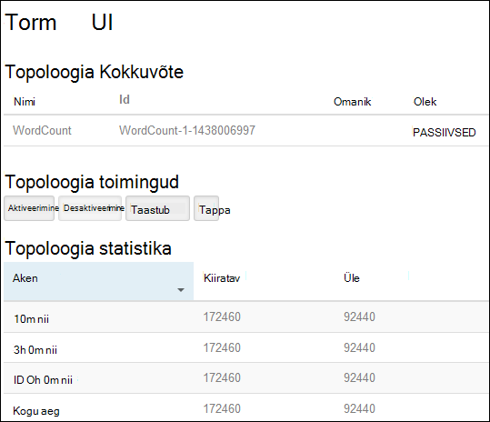
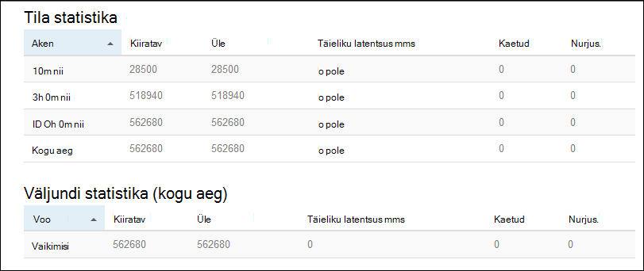

<properties
    pageTitle="Apache Storm õpetus: alustamine Linux-põhine Storm Hdinsightiga kohta | Microsoft Azure'i"
    description="Suur andmeanalüüsi Apache torm ja Storm Starter näidised kasutamine Linux-põhine Hdinsightiga alustamine. Saate teada, kuidas kasutada Storm protsessi andmete reaalajas."
    keywords="Apache torm, apache torm õpetuse, suur andmeanalüüsi torm starter"
    services="hdinsight"
    documentationCenter=""
    authors="Blackmist"
    manager="jhubbard"
    editor="cgronlun"/>

<tags
   ms.service="hdinsight"
   ms.devlang="java"
   ms.topic="get-started-article"
   ms.tgt_pltfrm="na"
   ms.workload="big-data"
   ms.date="10/12/2016"
   ms.author="larryfr"/>

# Apache Storm õpetus: torm Starter näidised suur andmete analüüsimise kohta Hdinsightiga jaoks kasutamise alustamine

Apache Storm on scalable tõrketaluvusega jaotatud, reaalajas arvutus süsteemi voole andmete töötlemiseks. Tormi kohta Windows Azure Hdinsightiga, saate luua pilvepõhist Storm kobar, mis sooritavad suur andmeanalüüsi reaalajas.

> [AZURE.NOTE] Selles artiklis toodud juhiseid luua Linux-põhine Hdinsightiga kobar. Luua Windowsi-põhiste torm Hdinsightiga kobar juhised leiate teemast [Apache Storm õpetus: alustamine Storm Starter valimi andmeanalüüsi kasutamine Hdinsightiga](hdinsight-apache-storm-tutorial-get-started.md)

## Eeltingimused

[AZURE.INCLUDE [delete-cluster-warning](../../includes/hdinsight-delete-cluster-warning.md)]

Peab teil olema edukalt lõpule õppeteema Apache Storm järgmist:

- **An Azure'i tellimus**. Leiate [Azure'i saada tasuta prooviversioon](https://azure.microsoft.com/documentation/videos/get-azure-free-trial-for-testing-hadoop-in-hdinsight/).

- **Tundmine SSH ja SCP**. SSH ja SCP Hdinsightiga kasutamise kohta lisateabe saamiseks vaadake järgmist:

    - **Linux, Unix või OS X kliendid**: vt [Kasutamine SSH koos Linux-põhine Hadoopi Linux, OS X või Unix Hdinsightiga](hdinsight-hadoop-linux-use-ssh-unix.md)

    - **Windowsi kliendid**: vt [Kasutamine SSH koos Linux-põhine Hadoopi Hdinsightiga Windows](hdinsight-hadoop-linux-use-ssh-windows.md)

### Accessi kontrolli nõuded

[AZURE.INCLUDE [access-control](../../includes/hdinsight-access-control-requirements.md)]

## Looge Storm kobar

Selles jaotises saate luua Hdinsightiga versioon 3,2 kobar (torm versioon 0.9.3) on Azure ressursihaldur malli abil. Hdinsightiga versioonid ja nende SLAs kohta leiate teavet teemast [Hdinsightiga komponendi Versioonimine](hdinsight-component-versioning.md). Muud kobar loomise võimalused, leiate teemast [loomine Hdinsightiga kogumite](hdinsight-hadoop-provision-linux-clusters.md).

1. Klõpsake malli avamiseks Azure'i portaalis järgmisel pildil.         

    
    
    Mall asub *https://hditutorialdata.blob.core.windows.net/armtemplates/create-linux-based-storm-cluster-in-hdinsight.json*avaliku bloobimälu ümbrises. 
   
2. Keelest parameetrid sisestage järgmine:

    - **ClusterName**: sisestage Hadoopi kobar loodava nimi.
    - **Kobar kasutajanime ja parooli**: login vaikenimi on haldus.
    - **SSH kasutajanimi ja parool**.
    
    Palun kirjutage need väärtused.  Te peate neid hiljem õpetuse.

    > [AZURE.NOTE] SSH kasutatakse Hdinsightiga klaster mõne käsurea kaudu pääsete juurde. Kasutajanimi ja parool, mida kasutate siin kasutatakse kobar SSH ühendamisel. Ka SSH kasutaja nimi peab olema kordumatu, loob kasutajakonto Hdinsightiga kobar sõlme. Järgmiselt on toodud mõned klaster teenuste jaoks reserveeritud konto nimed ja ei saa kasutada SSH kasutajanimi:
    >
    > juur, hdiuser, torm, hbase, ubuntu, zookeeper, hdfs, lõng, mapred, hbase, taru, oozie, falcon, sqoop, administraator, tez, hcat, hdinsightiga-zookeeper.

    > Hdinsightiga SSH kasutamise kohta lisateabe saamiseks vt ühte järgmistest artiklitest:

    > * [Kasutada SSH Linux-põhine Hadoopi Hdinsightiga Linux, Unix või OS X](hdinsight-hadoop-linux-use-ssh-unix.md)
    > * [Kasutada SSH Linux-põhine Hadoopi Windows Hdinsightiga](hdinsight-hadoop-linux-use-ssh-windows.md)

    
3. Valige parameetrid salvestamiseks nuppu **OK** .

4. **kohandatud juurutamise** keelest, klõpsake **ressursirühm** rippmenüüst ja seejärel klõpsake nuppu **Uus** , et luua uue ressursirühma. Ressursirühma on ümbris, mis pakuvad klaster, sõltuvad salvestusruumi konto ja muud lingitud ressurssi.

5. klõpsake **õiguslikult**ja seejärel klõpsake nuppu **Loo**.

6. klõpsake nuppu **Loo**. Teile kuvatakse uue nimega esitamine juurutamise malli juurutamiseks paani. Kulub umbes 20 minutit kobar ja SQL-andmebaasi loomiseks.

##Käivitage Storm Starter valimi Hdinsightiga

[Torm-starter](https://github.com/apache/storm/tree/master/examples/storm-starter) näidetes on kaasatud Hdinsightiga kobar. Järgmistes juhistes käivitate WordCount näide.

1. Ühendada Hdinsightiga klaster SSH abil.

        ssh USERNAME@CLUSTERNAME-ssh.azurehdinsight.net
        
    Kui kasutasite konto SSH kasutaja parooli, palutakse teil sisestada. Kui kasutasite avalik võti, peate kasutama funktsiooni `-i` parameetri määrama kattuvad privaatvõti. Näiteks `ssh -i ~/.ssh/id_rsa USERNAME@CLUSTERNAME-ssh.azurehdinsight.net`.
        
    Lisateavet kasutades SSH Linux-põhine Hdinsightiga leiate järgmistest artiklitest:
    
    * [Kasutada SSH Linux-põhine Hadoopi Hdinsightiga Linux, Unix või OS X](hdinsight-hadoop-linux-use-ssh-unix.md)

    * [Kasutada SSH Linux-põhine Hadoopi Windows Hdinsightiga](hdinsight-hadoop-linux-use-ssh-windows)

2. Kasutage alustamiseks on näide topoloogia järgmine käsk:

        storm jar /usr/hdp/current/storm-client/contrib/storm-starter/storm-starter-topologies-*.jar storm.starter.WordCountTopology wordcount
        
    > [AZURE.NOTE] Funktsiooni `*` faili nime osa kasutatakse versiooninumber, mis muudab nagu Hdinsightiga värskendatakse vastavaks.

    See käivitab näide WordCount topoloogia kobar, 'wordcount' ühendusele panna soovitud nime. CEIP Loo laused ja loendamiseks esinemiskord iga sõna lauses.

    > [AZURE.NOTE] Topoloogia klaster esitamisel tuleb esmalt kopeerida jar fail, mis sisaldab klaster enne selle `storm` käsk. Seda saab teha, kasutades funktsiooni `scp` käsk klient, kus fail on olemas. Näiteks`scp FILENAME.jar USERNAME@CLUSTERNAME-ssh.azurehdinsight.net:FILENAME.jar`
    >
    > Näide WordCount ja muude torm starter näited, on juba lisatud klaster veebisaidil `/usr/hdp/current/storm-client/contrib/storm-starter/`.

##Topoloogia jälgimine

Torm UI pakub web interface töötamiseks topoloogiatest töötab, ja lisatud Hdinsightiga klaster.

Jälgida topoloogia Storm Kasutajaliidese abil tehke järgmist:

1. Avage veebibrauser https://CLUSTERNAME.azurehdinsight.net/stormui, kus on __CLUSTERNAME__ klaster nime. See avab Storm UI.

    > [AZURE.NOTE] Kui palutakse sisestada kasutajanimi ja parool, sisestage kobar administraator (admin) ja parool, mida olete kasutanud, millal loomise klaster.

2. Klõpsake jaotises **topoloogia Kokkuvõte**, valige **wordcount** kirje veeru **nimi** . See kuvab topoloogia kohta lisateavet.

    

    Sellelt lehelt leiate järgmise teabe:

    * **Topoloogia statistika** - topoloogia jõudluse tagamiseks alusandmete korraldatud kellaaeg Windowsi.

        > [AZURE.NOTE] Valida konkreetse aja aken muudab ajaakna teavet, kuvatakse lehe muudesse sektsioonidesse.

    * **Spouts** - põhiteavet otsikuid, sh tagastatud tilasid viimase tõrke.

    * **Poldid** - poldid põhiteavet.

    * **Topoloogia konfigureerimine** - üksikasjalikku teavet topoloogia konfigureerimine.

    Sellelt lehelt leiate ka toiminguid, mida saavad võtta topoloogia:

    * **Aktiveeri** - desaktiveeritakse topoloogia elulookirjeldused töötlemine.

    * **Desaktiveeri** - peatab töötava topoloogia.

    * Topoloogia paralleelsust **taastub** – saate reguleerida. Töötava topoloogiatest peaks taastub, kui olete muutnud sõlmed klaster arv. See võimaldab topoloogia reguleerimiseks paralleelsus hüvitamine sõlmed klaster suurendatakse/vähendatakse arvu. Lisateabe saamiseks lugege teemat [Storm topoloogia paralleelsust mõistmine](http://storm.apache.org/documentation/Understanding-the-parallelism-of-a-Storm-topology.html).

    * Pärast määratud ajalõpu **tappa** - torm topoloogia lõpeb.

3. Sellelt lehelt, valige jaotises **Spouts** või **poldid** kirje. See kuvab valitud komponendi teavet.

    

    Selle lehel kuvatakse järgmine teave:

    * **Tila/polt statistika** - komponent jõudluse tagamiseks alusandmete korraldatud kellaaeg Windowsi.

        > [AZURE.NOTE] Valida konkreetse aja aken muudab ajaakna teavet, kuvatakse lehe muudesse sektsioonidesse.

    * **Sisestusmeetodi statistika** (ainult polt) - komponendid, mis toodavad andmed tarbitud polt teavet.

    * **Väljundi statistika** - teabe andmete kiiratava see polt.

    * **Haldavad isikud** - teave selle komponendi eksemplari.

    * **Tõrgete** - tõrgete toodetud selle osa.

4. Tila või polt üksikasjade kuvamisel valige kirje **Port** veeru jaotises **haldavad isikud** , et teatud eksemplari komponendi üksikasjade kuvamine.

        2015-01-27 14:18:02 b.s.d.task [INFO] Emitting: split default ["with"]
        2015-01-27 14:18:02 b.s.d.task [INFO] Emitting: split default ["nature"]
        2015-01-27 14:18:02 b.s.d.executor [INFO] Processing received message source: split:21, stream: default, id: {}, [snow]
        2015-01-27 14:18:02 b.s.d.task [INFO] Emitting: count default [snow, 747293]
        2015-01-27 14:18:02 b.s.d.executor [INFO] Processing received message source: split:21, stream: default, id: {}, [white]
        2015-01-27 14:18:02 b.s.d.task [INFO] Emitting: count default [white, 747293]
        2015-01-27 14:18:02 b.s.d.executor [INFO] Processing received message source: split:21, stream: default, id: {}, [seven]
        2015-01-27 14:18:02 b.s.d.task [INFO] Emitting: count default [seven, 1493957]

    Nende andmete põhjal näete, et word **seitse** ilmnenud 1493957 korda. Mis on mitu korda ilmnes, kuna see topoloogia on käivitatud.

##Topoloogia peatamine

Sõnade arv topoloogia jaoks **topoloogia Kokkuvõte** lehele naasmiseks ja valige nupp **tappa** jaotise **topoloogia toimingud** . Küsimise korral sisestage 10 sekundit oodatakse enne lõpetamist topoloogia. Aja, pärast topoloogia ei kuvata enam **Storm UI** jaotise armatuurlaua külastamisel.

##Klaster kustutamine

[AZURE.INCLUDE [delete-cluster-warning](../../includes/hdinsight-delete-cluster-warning.md)]

##Järgmised sammud

Selles õpetuses Apache Storm kasutasite saate teada, kuidas luua torm Hdinsightiga kobar ja kasutada Storm armatuurlaua juurutamine, jälgimine ja haldamine Storm topoloogiatest Storm Starter. Järgmisena saate teada, kuidas [töötada Java-põhine topoloogiatest Maven abil](hdinsight-storm-develop-java-topology.md).

Kui olete juba tuttav arendamise Java-põhine topoloogiatest ja soovite juurutada mõne olemasoleva topoloogia Hdinsightiga, lugege teemat [Deploy ja hallata Apache Storm topoloogiatest kohta Hdinsightiga](hdinsight-storm-deploy-monitor-topology-linux.md).

Kui olete .NET arendaja, saate luua C# või hübriid C# / Java topoloogiatest Visual Studio abil. Lisateabe saamiseks lugege teemat [arendada C# topoloogiatest Apache Storm Hdinsightiga Hadoopi tools for Visual Studio abil sisse](hdinsight-storm-develop-csharp-visual-studio-topology.md).

Näiteks topoloogiatest, mida saab kasutada torm Hdinsightiga, klõpsake näha järgmised näited:

    * [Näide topoloogiatest Storm Hdinsightiga kohta](hdinsight-storm-example-topology.md)

[apachestorm]: https://storm.incubator.apache.org
[stormdocs]: http://storm.incubator.apache.org/documentation/Documentation.html
[stormstarter]: https://github.com/apache/storm/tree/master/examples/storm-starter
[stormjavadocs]: https://storm.incubator.apache.org/apidocs/
[azureportal]: https://manage.windowsazure.com/
[hdinsight-provision]: hdinsight-provision-clusters.md
[preview-portal]: https://portal.azure.com/
