<properties
    pageTitle="Apache Storm õpetus: alustamine torm | Microsoft Azure'i"
    description="Suur andmeanalüüsi Apache torm ja Storm Starter näidised kasutamine Hdinsightiga alustamine. Saate teada, kuidas kasutada Storm protsessi andmete reaalajas."
    keywords="Apache torm, apache torm õpetuse, suur andmeanalüüsi torm starter"
    services="hdinsight"
    documentationCenter=""
    authors="Blackmist"
    manager="jhubbard"
    editor="cgronlun"
    tags="azure-portal"/>

<tags
   ms.service="hdinsight"
   ms.devlang="java"
   ms.topic="article"
   ms.tgt_pltfrm="na"
   ms.workload="big-data"
   ms.date="09/07/2016"
   ms.author="larryfr"/>

# Apache Storm õpetus: torm Starter näidised suur andmete analüüsimise kohta Hdinsightiga jaoks kasutamise alustamine

Apache Storm on scalable tõrketaluvusega jaotatud, reaalajas arvutus süsteemi voole andmete töötlemiseks. Tormi kohta Microsoft Azure Hdinsightiga, saate luua pilvepõhist Storm kobar, mis sooritavad suur andmeanalüüsi reaalajas. 

> [AZURE.NOTE] Selles artiklis toodud juhiseid loomine Windowsi-põhiste Hdinsightiga kobar. Luua Linux-põhine torm Hdinsightiga kobar juhised leiate teemast [Apache Storm õpetus: alustamine Storm Starter valimi andmeanalüüsi kasutamine Hdinsightiga](hdinsight-apache-storm-tutorial-get-started-linux.md)

## Eeltingimused

[AZURE.INCLUDE [delete-cluster-warning](../../includes/hdinsight-delete-cluster-warning.md)]

Peab teil olema edukalt lõpule õppeteema Apache Storm järgmist:

- **An Azure'i tellimus**. Leiate [Azure'i saada tasuta prooviversioon](https://azure.microsoft.com/documentation/videos/get-azure-free-trial-for-testing-hadoop-in-hdinsight/).

### Accessi kontrolli nõuded

[AZURE.INCLUDE [access-control](../../includes/hdinsight-access-control-requirements.md)]

## Looge Storm kobar

Tormi kohta Hdinsightiga kasutab Azure'i bloobimälu logifailid ja esitada klaster topoloogiatest talletamiseks. Järgmiste juhiste abil saate luua Azure storage konto kasutamiseks klaster:

1. [Azure'i portaali]sisselogimine[preview-portal].

2. Valige **Uus**, valige __Andmete analüüsimise__ja valige __Hdinsightiga__.

    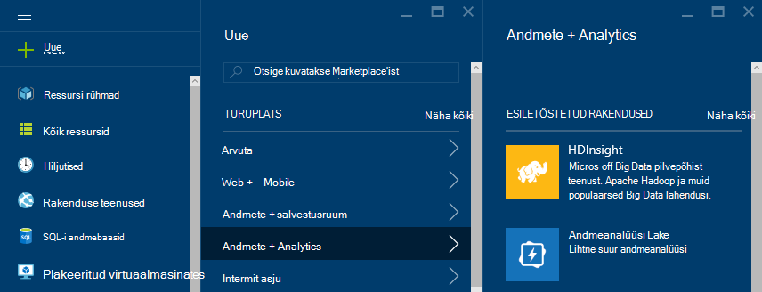

3. Sisestage __kobar nimi__. Roheline märge __Kobar nime__ kõrval kuvatakse, kui see on saadaval.

4. Kui teil on mitu tellimust, valige __tellimus__ kirje valimiseks Azure'i tellimus, mida kasutatakse klaster.

5.  Valige __Storm__ kobar __Kobar tüübi valimine__ abil. Valige __operatsioonisüsteemi__Windows. __Kobar taseme__, märkige ruut standardne. Lõpuks kasutada nende sätete salvestamiseks valige nupp.

    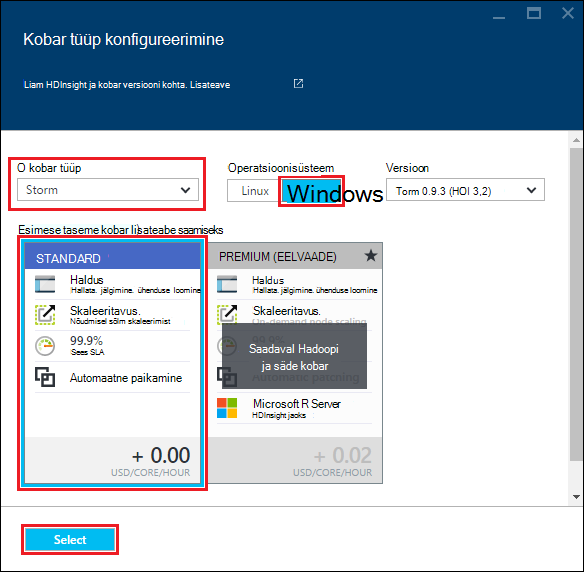

5. __Ressursirühm__, saate meile ripploendit rühmi ressursside loendi ja seejärel valige üks sisse klaster loomiseks. Või valige __Uus__ ja sisestage nimi uue ressursirühma. Roheline märge kuvatakse näitamaks, kui uue rühma nimi on saadaval.

6. Valige __mandaat__ja sisestage __Kobar sisselogimise kasutajanimi__ ja __Parool kobar__. Kasutage __Valige__ mandaadi määramiseks. Kaugtöölaud ei kasutata selles dokumendis, et jätta selle keelatud.

    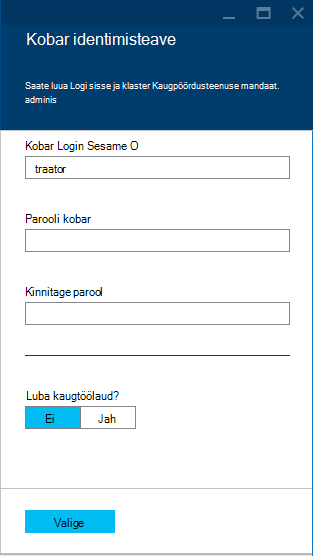

6. __Andmeallika__, saate valida olemasoleva andmeallika valik või looge uus.

    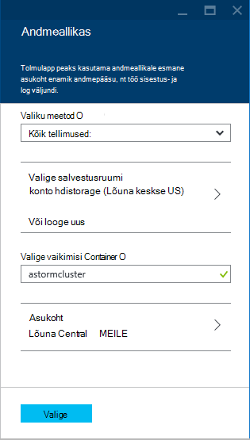

    Praegu saate valida mõne Hdinsightiga kobar andmeallikas Azure storage konto. Kasutage järgmist mõista __Andmeallika__ enne kirjeid.

    - __Valiku meetod__: määrata __kõigi tellimuste kaudu__ lubamiseks sirvimise salvestusruumi kontode tellimuste kohta. Kui soovite sisestada __Salvestusruumi nime__ ja salvestusruumi konto __Kiirklahv__ __Kiirklahv__ seatud.

    - __Loo uus__: selle abil saate luua uue konto salvestusruumi. Kasutage välja, mis kuvatakse Sisestage salvestusruumi konto nimi. Roheline märge kuvatakse, kui nimi on saadaval.

    - __Valige vaikimisi Container__: selle abil sisestage vaikimisi container klaster jaoks nimi. Ajal siia nime saate sisestada, soovitame kasutada sama nime nagu klaster, nii, et saate hõlpsasti ära ümbris kasutatakse seda teatud kobar.

    - __Asukoht__: geograafilised piirkond, mis salvestusruumi konto on või luuakse.

        > [AZURE.IMPORTANT] Vaikimisi andmeallika asukoha valimine seab Hdinsightiga kobar asukoht. Andmeallika kobar ja vaikimisi peavad asuma samas piirkonnas.

    - __Valige__: selle abil saate andmeallika konfiguratsiooni salvestada.

7. Valige __Sõlm hinnad astme__ sõlmed, mis luuakse see kohta teabe kuvamiseks. Vaikimisi on seatud töötaja sõlmed arvu __4__. Määrake see __1__, nagu see piisab selles Õpetuses ja vähendab klaster. Prognoositud kulud klaster kuvatakse see blade allosas.

    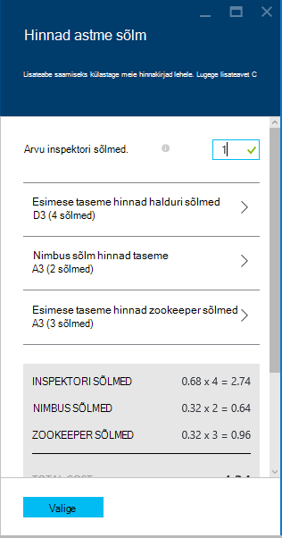

    Kasutage __Valige__ __Sõlm hinnad astme__ teabe salvestamiseks.

8. Valige __Valikuline konfigureerimine__. See tera võimaldab valida kobar versiooni, samuti muud valikulised sätted, nt liituda __Virtuaalse võrgu__konfigureerimine.

    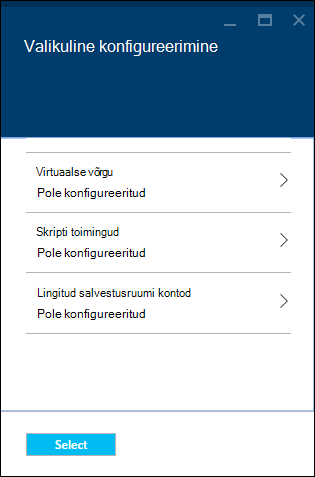

9. Veenduge, et __Startboard Kinnita__ oleks märgitud, ja seejärel nuppu __Loo__. See loob klaster ja lisab teie Azure portaali Startboard seda paani. Ikoon näitab, et klaster on ettevalmistamise, ja muudatuste kuvamiseks ikooni Hdinsightiga üks kord ettevalmistamise on lõpule viidud.

  	| Ettevalmistamise ajal | Ettevalmistamise lõpetamine |
  	| ------------------ | --------------------- |
  	|  | 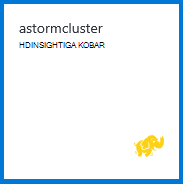 |

    > [AZURE.NOTE] See võtab aega kobar luuakse tavaliselt umbes 15 minutit. Paani kasutamine on Startboard või __teatised__ kirje vasakus servas lehe ebausaldusväärsete kontrollida.

## Käivitage Storm Starter valimi Hdinsightiga

Selles õpetuses Apache Storm tutvustab teile suur andmeanalüüsi github Storm Starter näidised abil.

Iga torm Hdinsightiga kobar kohta on torm armatuurlaua, mida saate kasutada üles laadida ja käivitada Storm topoloogiatest klaster. Iga kobar on ka valimi topoloogiatest Storm armatuurlaualt töötavad.

### Ühenduse loomine armatuurlaua

Armatuurlaua asub **https://&lt;clustername >.azurehdinsight.net//**, kus on **clustername** klaster nime. Leiate lingi armatuurlaud, valides soovitud Startboard klaster ja valides tera ülaosas linki __armatuurlaud__ .

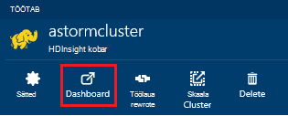

> [AZURE.NOTE] Kui ühendate armatuurlaud, palutakse sisestada kasutajanimi ja parool. See on administraatori nimi (**haldus**) ja parool, kui olete loonud klaster.

Kui torm armatuurlaud on laaditud, kuvatakse **Topoloogia esitage** vorm.

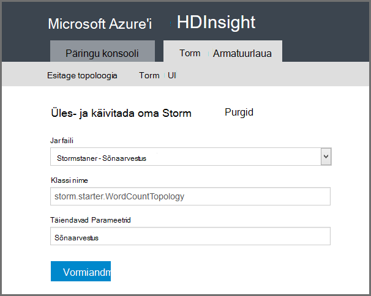

Vormi **Edastamine topoloogia** saab üles laadida ja käivitada laiendid failid, mis sisaldavad Storm topoloogiatest. See hõlmab ka mitu lihtsa proovi, mis on varustatud klaster.

### Sõnade arv valimi pidamine Storm Starter projekti GitHub

Näidised koos klaster kaasata mitu muudatust Wordi lugedes topoloogia. Need näited kaasata on **tila** mis eraldab CEIP laused ja **poldid** leheküljepiiri iga lause üksikuteks sõnadeks, seejärel loendada iga sõna ilmnes mitu korda. Need näited on [torm Starter näidised](https://github.com/apache/storm/tree/master/examples/storm-starter), mis on osa Apache torm.

Järgmiste toimingute Storm Starter valimi käivitamiseks:

1. Valige **StormStarter - WordCount** **Jar faili** ripploendist. See kuvab selle valimi parameetritega **Klassi nime** ja **Täiendavate parameetrite** väljad.

    

    * **Klassi nime** - klassi laiendid faili, mis esitab topoloogia.
    * **Täiendavate parameetrite** - topoloogia nõutud parameetrid. Selles näites kasutatakse välja esitatud topoloogia sõbralik nimi.

2. Klõpsake **esitada**. Hetke pärast, kuvatakse **tulemus** väljal käsk kasutada töö, samuti käsu tulemused. **Tõrge** väli kuvab esitamisega topoloogia vigu.

    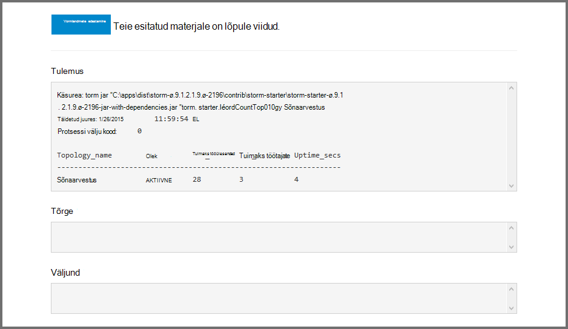

    > [AZURE.NOTE] Tulemused näitavad, et topoloogia on lõpule jõudnud – **Storm topoloogia, üks kord alustamine, käivitatakse kuni peatamiseni esitlusega** Sõnade arv topoloogia genereeritud juhusliku laused ja hoiab arvu, mitu korda, kuni selle jõutakse iga sõna.

### Topoloogia jälgimine

Torm UI saab jälgida topoloogia.

1. Valige **Storm UI** Storm armatuurlaua ülaosas. Kuvatakse kokkuvõtva teabe klaster ja kõik töötab topoloogiatest.

    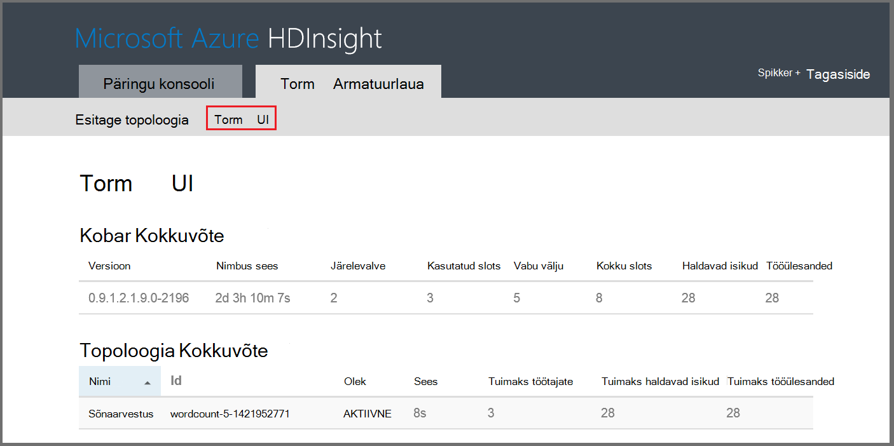

    Ülaltoodud lehel saate vaadata topoloogia on aktiivne aeg töötajate, haldavad isikud ja tööülesannete kasutatava arvu.

    > [AZURE.NOTE] Veeru **nimi** sisaldab sõbralik nimi, mis on varem esitatud **Täiendavate parameetrite** välja kaudu.

4. Klõpsake jaotises **topoloogia Kokkuvõte**, valige **wordcount** kirje veeru **nimi** . Lisateavet topoloogia kuvatakse.

    

    Sellelt lehelt leiate järgmise teabe:

    * **Topoloogia statistika** - topoloogia jõudluse tagamiseks alusandmete korraldatud kellaaeg Windowsi.

        > [AZURE.NOTE] Valida konkreetse aja aken muudab ajaakna teavet, kuvatakse lehe muudesse sektsioonidesse.

    * **Spouts** - põhiteavet otsikuid, sh tagastatud tilasid viimase tõrke.

    * **Poldid** - poldid põhiteavet.

    * **Topoloogia konfigureerimine** - üksikasjalikku teavet topoloogia konfigureerimine.

    Sellelt lehelt leiate ka toiminguid, mida saavad võtta topoloogia:

    * **Aktiveeri** - desaktiveeritakse topoloogia elulookirjeldused töötlemine.

    * **Desaktiveeri** - peatab töötava topoloogia.

    * Topoloogia paralleelsust **taastub** – saate reguleerida. Töötava topoloogiatest peaks taastub, kui olete muutnud sõlmed klaster arv. See võimaldab topoloogia reguleerimiseks paralleelsus hüvitamine sõlmed klaster suurendatakse/vähendatakse arvu. Lisateabe saamiseks lugege teemat [Storm topoloogia paralleelsust mõistmine](http://storm.apache.org/documentation/Understanding-the-parallelism-of-a-Storm-topology.html).

    * Pärast määratud ajalõpu **tappa** - torm topoloogia lõpeb.

5. Sellelt lehelt, valige jaotises **Spouts** või **poldid** kirje. Kuvatakse valitud komponendi teavet.

    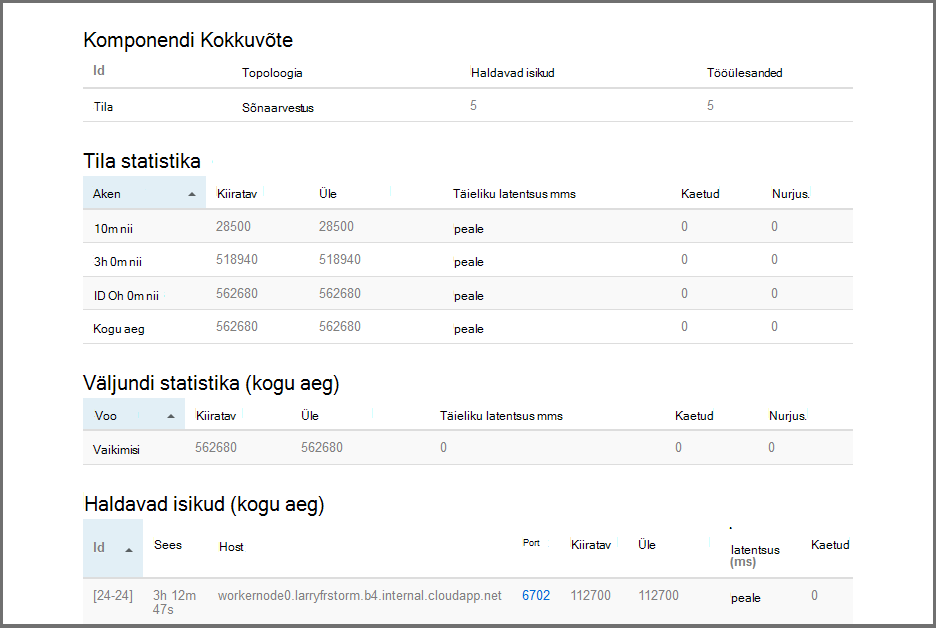

    Selle lehel kuvatakse järgmine teave:

    * **Tila/polt statistika** - komponent jõudluse tagamiseks alusandmete korraldatud kellaaeg Windowsi.

        > [AZURE.NOTE] Valida konkreetse aja aken muudab ajaakna teavet, kuvatakse lehe muudesse sektsioonidesse.

    * **Sisestusmeetodi statistika** (ainult polt) - komponendid, mis toodavad andmed tarbitud polt teavet.

    * **Väljundi statistika** - teabe andmete kiiratava see polt.

    * **Haldavad isikud** - teave selle komponendi eksemplari.

    * **Tõrgete** - tõrgete toodetud selle osa.

5. Tila või polt üksikasjade kuvamisel valige kirje **Port** veeru jaotises **haldavad isikud** , et teatud eksemplari komponendi üksikasjade kuvamine.

        2015-01-27 14:18:02 b.s.d.task [INFO] Emitting: split default ["with"]
        2015-01-27 14:18:02 b.s.d.task [INFO] Emitting: split default ["nature"]
        2015-01-27 14:18:02 b.s.d.executor [INFO] Processing received message source: split:21, stream: default, id: {}, [snow]
        2015-01-27 14:18:02 b.s.d.task [INFO] Emitting: count default [snow, 747293]
        2015-01-27 14:18:02 b.s.d.executor [INFO] Processing received message source: split:21, stream: default, id: {}, [white]
        2015-01-27 14:18:02 b.s.d.task [INFO] Emitting: count default [white, 747293]
        2015-01-27 14:18:02 b.s.d.executor [INFO] Processing received message source: split:21, stream: default, id: {}, [seven]
        2015-01-27 14:18:02 b.s.d.task [INFO] Emitting: count default [seven, 1493957]

    Nende andmete põhjal näete, et word **seitse** ilmnenud 1,493,957 korda. Mis on mitu korda ilmnes, kuna see topoloogia on käivitatud.

### Topoloogia peatamine

Sõnade arv topoloogia jaoks **topoloogia Kokkuvõte** lehele naasmiseks ja valige jaotises **topoloogia toimingud** **tappa** . Küsimise korral sisestage 10 sekundit oodatakse enne lõpetamist topoloogia. Aja, pärast topoloogia ei kuvata enam **Storm UI** jaotise armatuurlaua külastamisel.

##Klaster kustutamine

[AZURE.INCLUDE [delete-cluster-warning](../../includes/hdinsight-delete-cluster-warning.md)]

## Kokkuvõte

Selles õpetuses Apache Storm kasutasite saate teada, kuidas luua torm Hdinsightiga kobar ja kasutada Storm armatuurlaua juurutamine, jälgimine ja haldamine Storm topoloogiatest Storm Starter.

## Järgmised sammud

* **Hdinsightiga Tools for Visual Studio** - Hdinsightiga tööriistad võimaldab Visual Studio abil saate esitada, jälgimine ja haldamine Storm topoloogiatest sarnane eelpool Storm armatuurlaud. Hdinsightiga tööriistad ka pakub võimalust luua C# Storm topoloogiatest ja sisaldab valimi topoloogiatest, mida saate juurutada ja käivitada klaster.

    Lisateavet leiate artiklist [Alustamine kasutamine Hdinsightile Tools for Visual Studio](hdinsight-hadoop-visual-studio-tools-get-started.md).

* **Näidisfailide** - Hdinsightiga Storm kobar pakub mitmeid näiteid **%STORM_HOME%\contrib** kataloogis. Iga näide peaks sisaldama järgmist:

    * Lähtekoodi – näiteks torm-starter-0.9.1.2.1.5.0-2057-sources.jar

    * Java dokumendid – näiteks torm-starter-0.9.1.2.1.5.0-2057-javadoc.jar

    * Näide – näiteks storm-starter-0.9.1.2.1.5.0-2057-jar-with-dependencies.jar

    Käsu "jar" eraldamiseks lähtekoodi või Java dokumendid. Näiteks "jar - xvf storm-starter-0.9.1.2.1.5.0.2057-javadoc.jar".

    > [AZURE.NOTE] Java dokumendid koosnevad veebilehtedel. Pärast ekstraktimist, kasutage brauserit **index.html** faili vaatamiseks.

    Juurdepääs nende näidised, Luba kaugtöölaud Storm Hdinsightiga kobar kohta ja seejärel kopeerige **%STORM_HOME%\contrib**failid.

* Järgmised dokument sisaldab torm klõpsake Hdinsightiga kasutatavate muude näited:

    * [Näide topoloogiatest Storm Hdinsightiga kohta](hdinsight-storm-example-topology.md)

[apachestorm]: https://storm.incubator.apache.org
[stormdocs]: http://storm.incubator.apache.org/documentation/Documentation.html
[stormstarter]: https://github.com/apache/storm/tree/master/examples/storm-starter
[stormjavadocs]: https://storm.incubator.apache.org/apidocs/
[azureportal]: https://manage.windowsazure.com/
[hdinsight-provision]: hdinsight-provision-clusters.md
[preview-portal]: https://portal.azure.com/
